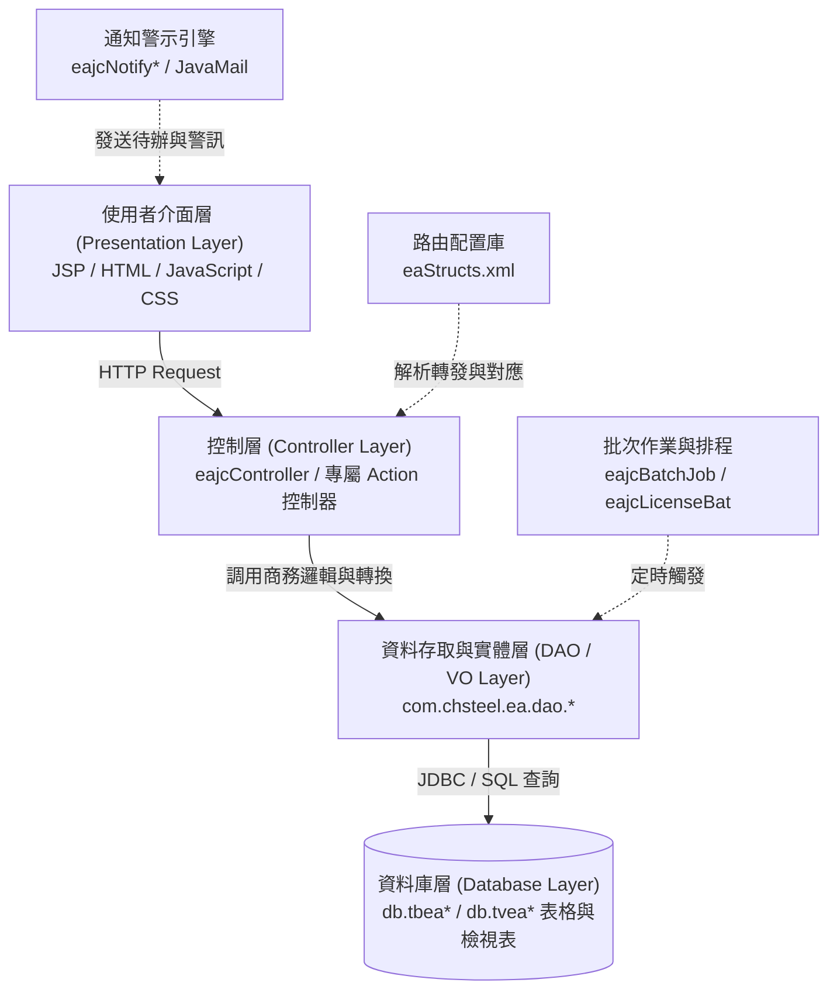

# 安環績效管理系統（EA 模組）功能規格手冊

---

## 1. 系統概述

### 1.1 系統宗旨與目標
**安環績效管理系統（Environmental & Safety Management System，簡稱 EA 模組）**為中龍鋼鐵／企業資源規劃（ERP）架構下專責管理**環境保護、職業安全衛生、法規合規性、風險鑑別及安環績效指標**之核心營運子系統。

本系統旨在協助企業落實 ISO 14001（環境管理系統）、ISO 45001 / TOSHMS（職業安全衛生管理系統）等標準，透過全面數位化與流程標準化，達成以下目標：
1. **落實安全防護與災害防阻**：涵蓋失能傷害、非失能傷害、交通事故等事故通報、調查、改善追蹤及零傷害工時績效統計。
2. **強化主動式現場安檢**：推動安全觀察（Safety Observation）、關鍵巡檢、營造工安查核、動態工安稽查與各類應急設施（AED、醫藥箱）定期盤點。
3. **動態風險與環境考量面評估**：針對廠區製程、各部門作業進行危害鑑別與風險等級評鑑（RE/EA），並制定對應之控制措施。
4. **法規鑑別與符合性查核**：即時收錄更新最新環安衛法規，分派各廠處進行法規符合性查核與改善追蹤，降低法律違規風險。
5. **環境永續與污染監測**：管制空污費申報、連續自動監測（CEMS）、環保許可證（廢水、廢氣、廢棄物、毒化物）生命週期及資源回收。
6. **合規請購審查與證照管理**：針對廠區原物料請購進行 RoHS/REACH/VOC 安環審核，並納管人員專業安環證照效期。

---

## 2. 系統架構總覽

### 2.1 軟體架構層級（MVC 架構）
本系統採用 J2EE 多層次企業級架構，結合專屬 XML 路由控制機制：

1. **表現層（Presentation Layer）**：
   - 採用 JSP 搭配專屬 JavaScript 元件（CHSBrowser 瀏覽器相容環境），提供清單查詢（`*List.jsp`）、資料維護（`*Text*.jsp` / `*Doc.jsp`）、快顯輔助視窗（`*Popup.jsp`）與報表列印（`*Print.jsp`）。
2. **控制層（Controller Layer）**：
   - 透過 [eaStructs.xml](file:///d:/CHSBrowser_erp/erpHome/yl.ear/erp.war/ea/eaStructs.xml) 定義 Page、Action 與 ValueObject 轉換規則，由 `com.chsteel.ea.eajc*` 進行權限檢核、公文流程流轉、狀態判定與業務分派。
3. **資料存取層（DAO / VO Layer）**：
   - 封裝於 `com.chsteel.ea.dao.*`，提供標準 CRUD、多條件組合過濾、公文流程與歷史異動履歷維護。
4. **外部與批次整合（Integration & Batch Layer）**：
   - 定時批次執行法規到期過期查核（`eajcBatchLawsOver`）、證照到期預警（`eajcLicenseBat`）、自動發送 Email 通知（`eajcJavaMail`）與資料倉儲交換（`eajcDWdata`）。

---

## 3. 功能模組詳細說明

本系統劃分為 **九大功能模組**，以下針對各模組之功能範圍、業務邏輯及**【主要資料表】**進行詳細解析。

---

### 模組一：事故與職災管理模組 (Accident & Injury Management)

#### 1. 功能說明
- **通報與調查**：提供各類安全衛生事故之即時登錄與流程通報，包含「失能傷害調查報告書」、「非失能傷害調查報告書」、「上下班交通事故報告書」。
- **原因分析與改善追蹤**：記錄事故直接原因、間接原因、不安全環境與行為，制定改善對策、指派負責單位並追蹤結案狀況。
- **損失與工時統計**：登錄人員受傷部位、醫療院所急救記錄、財物損害與損失工時；整合「零傷害獎勵統計」與「每月總工時統計」，產出安全績效指標（如 FR/SR）。

#### 2. 主要資料表
| 資料表                     | VO／DAO                                               | 功能定位     | 主要用途                          | 關聯功能                                                                                                                                                                                                                       |
| :---------------------- | :--------------------------------------------------- | :------- | :---------------------------- | :------------------------------------------------------------------------------------------------------------------------------------------------------------------------------------------------------------------------- |
| `db.tbeaHtContent`      | `eajcHtContent_vo` `eajcHtContent_dao`           | 失能傷害報告主檔 | 記錄失能傷害事故之人事、發生時間地點、事故過程與初步判定  | [eajjHtContent01.jsp](file:///d:/CHSBrowser_erp/erpHome/yl.ear/erp.war/ea/jsp/eajjHtContent01.jsp) [eajcHtContent01.java](file:///d:/CHSBrowser_erp/erpHome/yl.ear/erp.war/ea/src/com/chsteel/ea/eajcHtContent01.java) |
| `db.tbeaHtContentPlan`  | `eajcHtContentPlan_vo` `eajcHtContentPlan_dao`   | 失能改善計畫檔  | 儲存事故檢討對策、改善行動方案、預計完成日與執行進度    | [eajjHtContentPlan02.jsp](file:///d:/CHSBrowser_erp/erpHome/yl.ear/erp.war/ea/jsp/eajjHtContentPlan02.jsp)                                                                                                                 |
| `db.tbeaHtContentTrace` | `eajcHtContentTrace_vo` `eajcHtContentTrace_dao` | 失能事故追蹤檔  | 記錄工安單位與權責主管對改善成效之複查、結案驗證與追蹤紀錄 | [eajjHtTrace.jsp](file:///d:/CHSBrowser_erp/erpHome/yl.ear/erp.war/ea/jsp/eajjHtTrace.jsp)                                                                                                                                 |
| `db.tbeaNHtContent`     | `eajcNHtContent_vo` `eajcNHtContent_dao`         | 非失能傷害主檔  | 記錄輕傷、無損工時之非失能職業災害事件與預防對策      | [eajjNHtContent01.jsp](file:///d:/CHSBrowser_erp/erpHome/yl.ear/erp.war/ea/jsp/eajjNHtContent01.jsp)                                                                                                                       |
| `db.tbeaTRContent`      | `eajcTRContent_vo` `eajcTRContent_dao`           | 交通事故報告檔  | 記錄員工上下班途中發生之交通事故狀況、肇事責任與就醫資料  | [eajjTRContent01.jsp](file:///d:/CHSBrowser_erp/erpHome/yl.ear/erp.war/ea/jsp/eajjTRContent01.jsp)                                                                                                                         |
| `db.tbeaHTRContent`     | `eajcHTRContent_vo` `eajcHTRContent_dao`         | 事故損失調查表  | 統計各類事故之直接損失、設備損害、醫療費用與間接工時損失  | [eajjHTRContent01.jsp](file:///d:/CHSBrowser_erp/erpHome/yl.ear/erp.war/ea/jsp/eajjHTRContent01.jsp)                                                                                                                       |
| `db.tbeaZHurt`          | `eajcZHurt_vo` `eajcZHurt_dao`                   | 零傷害累計主檔  | 統計各部門累計無災害工時、無事故天數與安全紀錄里程碑    | [eajjZHt01.jsp](file:///d:/CHSBrowser_erp/erpHome/yl.ear/erp.war/ea/jsp/eajjZHt01.jsp)                                                                                                                                     |
| `db.tbeaZHtContent`     | `eajcZHtContent_vo` `eajcZHtContent_dao`         | 零傷害獎勵統計檔 | 依零傷害達成標準，核算各部門獎勵點數與安環獎金發放明細   | [eajjZHt.jsp](file:///d:/CHSBrowser_erp/erpHome/yl.ear/erp.war/ea/jsp/eajjZHt.jsp)                                                                                                                                         |
| `db.tbeaWorkTime`       | `eajcWorkTime_vo` `eajcWorkTime_dao`             | 每月工時統計檔  | 記錄各廠處全體同仁與承攬商每月總工作時數，作為傷害頻率分母 | [eajjWorkTimeDoc.jsp](file:///d:/CHSBrowser_erp/erpHome/yl.ear/erp.war/ea/jsp/eajjWorkTimeDoc.jsp)                                                                                                                         |
| `db.tbeaHurtType`       | `eajcHurtType_vo` `eajcHurtType_dao`             | 事故型態代碼檔  | 維護墜落、感電、被夾、燙傷等標準職災型態分類        | 職災登錄與分析報表                                                                                                                                                                                                                  |
| `db.tbeaHurtRegion`     | `eajcHurtRegion_vo` `eajcHurtRegion_dao`         | 傷害部位代碼檔  | 定義人體受傷部位（頭部、四肢、眼部、軀幹等）代碼      | 職災傷情登錄                                                                                                                                                                                                                     |
| `db.tbeaHospitalIO`     | `eajcHospitalIO_vo` `eajcHospitalIO_dao`         | 醫療就診記錄檔  | 記錄受傷人員轉送醫院、住院天數、就醫評估與出院復工狀態   | 事故調查與醫療關懷                                                                                                                                                                                                                  |

---

### 模組二：工安觀察、稽查與巡檢管理模組 (Safety Inspection & Observation)

#### 1. 功能說明
- **安全觀察（Safety Observation）**：主管與同仁現場走動觀察，記錄不安全行為與不安全環境，並即時給予回饋指導。
- **關鍵巡檢與專案查核**：排定廠區重點設備、高風險作業之「關鍵記錄暨巡檢項目查核」，追蹤查核缺失改善。
- **聯合稽查與營造動態工安**：實施跨部門安環聯合稽查、營造工程安檢（SJP）與動態走動巡檢，防止承攬商施工違規。
- **急救應急設備管理**：管制廠區 AED（自動體外心臟電擊去顫器）與各單位醫藥箱之定期檢查與耗材更換。

#### 2. 主要資料表
| 資料表 | VO／DAO | 功能定位 | 主要用途 | 關聯功能 |
| :--- | :--- | :--- | :--- | :--- |
| `db.tbeaSafeDoc` | `eajcSafeDoc_vo` `eajcSafeDoc_dao` | 安全觀察紀錄主檔 | 記錄安全觀察活動之觀察者、部門、區域、時間及總體摘要 | [eajjSafeDoc.jsp](file:///d:/CHSBrowser_erp/erpHome/yl.ear/erp.war/ea/jsp/eajjSafeDoc.jsp) [eajcSafeDoc.java](file:///d:/CHSBrowser_erp/erpHome/yl.ear/erp.war/ea/src/com/chsteel/ea/eajcSafeDoc.java) |
| `db.tbeaSafeDetail` | `eajcSafeDetail_vo` `eajcSafeDetail_dao` | 安全觀察明細檔 | 記錄特定不安全行為（個人防護具、作業姿勢等）與防範措施 | [eajjSafeItemEdit.jsp](file:///d:/CHSBrowser_erp/erpHome/yl.ear/erp.war/ea/jsp/eajjSafeItemEdit.jsp) |
| `db.tbeaSafeTrace` | `eajcSafeTrace_vo` `eajcSafeTrace_dao` | 工安課追蹤檔 | 記錄工安廠務課對安全觀察發現事項之複查、督導與結案確認 | 安全觀察改善追蹤 |
| `db.tbeaKeycheck` | `eajcKeycheck_vo` `eajcKeycheck_dao` | 關鍵巡檢主檔 | 設定廠區關鍵製程、重大危害點之定期巡檢計畫與查核週期 | [eajjKeyCheck01.jsp](file:///d:/CHSBrowser_erp/erpHome/yl.ear/erp.war/ea/jsp/eajjKeyCheck01.jsp) |
| `db.tbeaKeycheckItem` | `eajcKeycheckItem_vo` `eajcKeycheckItem_dao` | 關鍵巡檢項目檔 | 定義具體查檢標準、判定基準（如壓力、溫度、防護罩、連鎖開關） | [eajjKeyCheckItemEdit.jsp](file:///d:/CHSBrowser_erp/erpHome/yl.ear/erp.war/ea/jsp/eajjKeyCheckItemEdit.jsp) |
| `db.tbeaKeycheckItemRun` | `eajcKeycheckItemRun_vo` `eajcKeycheckItemRun_dao` | 關鍵巡檢執行檔 | 記錄巡檢人員現場實際量測數值、合格判定與異常缺失描述 | [eajjKeyCheckText01.jsp](file:///d:/CHSBrowser_erp/erpHome/yl.ear/erp.war/ea/jsp/eajjKeyCheckText01.jsp) |
| `db.tbeaInspectDoc` | `eajcInspectDoc_vo` `eajcInspectDoc_dao` | 稽查評核主檔 | 記錄全廠安環聯合稽查、專案評比之主辦單位、受稽對象與綜合評分 | [eajjInspectDoc.jsp](file:///d:/CHSBrowser_erp/erpHome/yl.ear/erp.war/ea/jsp/eajjInspectDoc.jsp) |
| `db.tbeaInspCheck` | `eajcInspCheck_vo` `eajcInspCheck_dao` | 聯合稽查項目檔 | 維護各類安環稽查檢核表項目與評分權重標準 | [eajjInspContent.jsp](file:///d:/CHSBrowser_erp/erpHome/yl.ear/erp.war/ea/jsp/eajjInspContent.jsp) |
| `db.tbeaDySafeDoc` | `eajcDySafeDoc_vo` `eajcDySafeDoc_dao` | 動態工安查核檔 | 執行現場非預告動態走動工安稽查，記錄即時缺失並開立改善單 | [eajjDySafeDoc.jsp](file:///d:/CHSBrowser_erp/erpHome/yl.ear/erp.war/ea/jsp/eajjDySafeDoc.jsp) |
| `db.tbeaConstSafChk` | `eajcConstSafChk_vo` `eajcConstSafChk_dao` | 營造工安查核檔 | 針對擴廠或大修營造施工現場之高架、吊掛、開挖等工安自主查驗 | [eajjConstSafChk01.jsp](file:///d:/CHSBrowser_erp/erpHome/yl.ear/erp.war/ea/jsp/eajjConstSafChk01.jsp) |
| `db.tbeaAED01` | `eajcAED01_vo` `eajcAED01_dao` | AED設備管理主檔 | 列管全廠所有 AED 安裝位置、保管人、主機序號、電極貼片效期 | [eajjAEDCheDoc.jsp](file:///d:/CHSBrowser_erp/erpHome/yl.ear/erp.war/ea/jsp/eajjAEDCheDoc.jsp) |
| `db.tbeaAED02` | `eajcAED02_vo` `eajcAED02_dao` | AED定期查核檔 | 記錄 AED 每月自主檢點狀態（指示燈、電量、消耗品更換） | AED定期維護 |
| `db.tbeaMBoxDoc` | `eajcMBoxDoc_vo` `eajcMBoxDoc_dao` | 醫藥箱管理主檔 | 列管各廠處與車間急救醫藥箱編號、設置處所與專責管理人 | [eajjMBoxCheDoc.jsp](file:///d:/CHSBrowser_erp/erpHome/yl.ear/erp.war/ea/jsp/eajjMBoxCheDoc.jsp) |

---

### 模組三：危害鑑別與風險評估模組 (Risk Assessment & Hazard Identification)

#### 1. 功能說明
- **職業安全風險評估（RE）**：針對各部門之製程作業、設備操作清查危害因子，評估發生可能性與嚴重度，鑑別出不可接受之重大風險。
- **環境考量面評估（EA）**：盤點各項作業可能對空氣、水體、土壤、廢棄物產生之環境衝擊，評定重大環境考量面。
- **多階段評估機制**：支援初評（一階段）與控制措施導入後之複評（二階段），並具備版本控制與等級分級規則。

#### 2. 主要資料表
| 資料表 | VO／DAO | 功能定位 | 主要用途 | 關聯功能 |
| :--- | :--- | :--- | :--- | :--- |
| `db.tbeaRE00` | `eajcRE00VO` `eajcRE00DAO` | 風險評估單主檔 | 記錄風險評估單之年度、評估部門、審核狀態與版本編號 | [eajjRE00MainN.jsp](file:///d:/CHSBrowser_erp/erpHome/yl.ear/erp.war/ea/jsp/eajjRE00MainN.jsp) |
| `db.tbeaRE01` | `eajcRE01VO` `eajcRE01DAO` | 流程作業關聯檔 | 建立各廠處生產製程、輔助流程與作業單元架構階層 | [eajjRE01MainN.jsp](file:///d:/CHSBrowser_erp/erpHome/yl.ear/erp.war/ea/jsp/eajjRE01MainN.jsp) |
| `db.tbeaRE02` | `eajcRE02VO` `eajcRE02DAO` | 職務作業清查表 | 盤點各崗位從業人員日常作業、非日常作業及緊急作業項目 | [eajjRE02MainN.jsp](file:///d:/CHSBrowser_erp/erpHome/yl.ear/erp.war/ea/jsp/eajjRE02MainN.jsp) |
| `db.tbeaRE03` | `eajcRE03VO` `eajcRE03DAO` | 風險內容明細檔 | 記錄特定作業之潛在危害情境、風險等級（R值）及控制措施 | [eajjRE03MainN.jsp](file:///d:/CHSBrowser_erp/erpHome/yl.ear/erp.war/ea/jsp/eajjRE03MainN.jsp) |
| `db.tbeaRE13` / `db.tbeaRE13a` | `eajcRE13VO` / `eajcRE13aVO` `eajcRE13DAO` / `eajcRE13aDAO` | 風險與機會評估檔 | 支援 ISO 45001「風險與機會」二階段綜合評鑑與對策制定 | [eajjRE13MainN.jsp](file:///d:/CHSBrowser_erp/erpHome/yl.ear/erp.war/ea/jsp/eajjRE13MainN.jsp) |
| `db.tbeaEA00` | `eajcEA00VO` `eajcEA00DAO` | 環境考量面主檔 | 記錄環境考量面鑑別單之填報部門、評估期間與核定流程 | [eajjEA00MainN.jsp](file:///d:/CHSBrowser_erp/erpHome/yl.ear/erp.war/ea/jsp/eajjEA00MainN.jsp) |
| `db.tbeaEA03` | `eajcEA03VO` `eajcEA03DAO` | 環境衝擊評估明細 | 記錄正常/異常/緊急狀況下之環境衝擊因子、嚴重性評分與管制作為 | [eajjEA03MainN.jsp](file:///d:/CHSBrowser_erp/erpHome/yl.ear/erp.war/ea/jsp/eajjEA03MainN.jsp) |
| `db.tbeaRateRule` | `eajcRateRuleVO` `eajcRateRuleDAO` | 評估規則配置檔 | 定義嚴重度（S）、可能性（L）矩陣計算公式與重大性門檻 | [eajjRateRuleMainN.jsp](file:///d:/CHSBrowser_erp/erpHome/yl.ear/erp.war/ea/jsp/eajjRateRuleMainN.jsp) |
| `db.tbeaRERank` | `eajcRERankVO` `eajcRERankDAO` | 風險等級代碼檔 | 定義高風險（不可接受）、中度風險、低風險（可接受）等級 | 風險等級標示 |

---

### 模組四：安環法規鑑別與符合性管理模組 (EHS Laws & Compliance)

#### 1. 功能說明
- **法規收集與鑑別**：收錄中央與地方環安衛法規、勞動法規與最新修法條文，進行法規屬性分類與適用性鑑別。
- **合規性查核與分派**：將法規條文要求轉換為各廠處查核清單，定期指派各權責部門填報符合性狀況。
- **簽核與期限管制**：提供法規鑑別/查核單會簽流程，並具備批次排程自動檢核查核逾期（Overdue）並發出催辦警訊。

#### 2. 主要資料表
| 資料表 | VO／DAO | 功能定位 | 主要用途 | 關聯功能 |
| :--- | :--- | :--- | :--- | :--- |
| `db.tbeaLaws` | `eajcLaws_vo` `eajcLaws_dao` | 法規條文主檔 | 儲存各項法規名稱、發布日期、主管機關、法規類別與法規全文 | [eajjLaws01.jsp](file:///d:/CHSBrowser_erp/erpHome/yl.ear/erp.war/ea/jsp/eajjLaws01.jsp) [eajcLaws01.java](file:///d:/CHSBrowser_erp/erpHome/yl.ear/erp.war/ea/src/com/chsteel/ea/eajcLaws01.java) |
| `db.tbeaLawsCellect` | `eajcLawsCellect_vo` `eajcLawsCellect_dao` | 法規鑑別主檔 | 記錄法規收錄鑑別單、適用部門判定、相關條文摘要與會辦意見 | [eajjLawsCellect01.jsp](file:///d:/CHSBrowser_erp/erpHome/yl.ear/erp.war/ea/jsp/eajjLawsCellect01.jsp) |
| `db.tbeaLawsMatch` | `eajcLawsMatch_vo` `eajcLawsMatch_dao` | 法規符合性查核單 | 建立年度/季度各部門法規符合性定期查核工作單 | [eajjLawsMatch01.jsp](file:///d:/CHSBrowser_erp/erpHome/yl.ear/erp.war/ea/jsp/eajjLawsMatch01.jsp) |
| `db.tbeaLawsMatch10` / `11` | `eajcLawsMatch10_vo` / `11` `eajcLawsMatch10_dao` / `11` | 法規查核明細檔 | 記錄各條文符合性自評結果（符合/不符合/不適用）、現行做法與佐證 | [eajjLawsMatchEdit.jsp](file:///d:/CHSBrowser_erp/erpHome/yl.ear/erp.war/ea/jsp/eajjLawsMatchEdit.jsp) |
| `db.tbeaLawsFullChkRel` | `eajcLawsFullChkRel_vo` `eajcLawsFullChkRel_dao` | 全廠法規關聯檔 | 建立全廠跨單位共用之法規查核範本與部門對應關係 | [eajjLawsFullChk01.jsp](file:///d:/CHSBrowser_erp/erpHome/yl.ear/erp.war/ea/jsp/eajjLawsFullChk01.jsp) |
| `db.tveaLawsFullChkVrl` | `eajcLawsFullChkVrl_vo` `eajcLawsFullChkVrl_dao` | 法規查核檢視表 | 彙整跨部門法規查核落實率、不符合項目清冊與改善進度檢視 | [eajjLawsFullMat01.jsp](file:///d:/CHSBrowser_erp/erpHome/yl.ear/erp.war/ea/jsp/eajjLawsFullMat01.jsp) |

---

### 模組五：環境保護、排放與許可證管理模組 (Environmental Management & Emissions)

#### 1. 功能說明
- **空污費申報與原物料管制**：依據生產排程與原物料/燃料用量，試算各排放管道之空污費申報金額（`AirPTax`）。
- **連續排放自動監測（CEMS）**：管制連續監測系統連線數據（`CDSDoc`）、有效運作率（`CDSHtRate`）與停機檢修工時。
- **環保許可證生命週期管理**：納管固定污染源設置/操作許可證、水污染防治許可、廢棄物清理計畫書之核准登載項目及變更歷程。
- **資源回收與廢棄物申報**：管制廠內各類資源回收物變賣、一般事業廢棄物與有害事業廢棄物之產出與清運流向。

#### 2. 主要資料表
| 資料表 | VO／DAO | 功能定位 | 主要用途 | 關聯功能 |
| :--- | :--- | :--- | :--- | :--- |
| `db.tbeaAirPTax` | `eajcAirPTax_vo` `eajcAirPTax_dao` | 空污費申報檔 | 儲存每季各排放源之原物料消耗、排放係數、產出量與試算稅費 | [eajjAirPTax01.jsp](file:///d:/CHSBrowser_erp/erpHome/yl.ear/erp.war/ea/jsp/eajjAirPTax01.jsp) [eajcAirPTax01.java](file:///d:/CHSBrowser_erp/erpHome/yl.ear/erp.war/ea/src/com/chsteel/ea/eajcAirPTax01.java) |
| `db.tbeaAirPStock` | `eajcAirPStock_vo` `eajcAirPStock_dao` | 空污原料庫存檔 | 記錄各製程原物料及燃料期初庫存、進貨量、使用量與期末結存 | [eajjAirPStockDoc.jsp](file:///d:/CHSBrowser_erp/erpHome/yl.ear/erp.war/ea/jsp/eajjAirPStockDoc.jsp) |
| `db.tbeaCDSDoc` | `eajcCDSDoc_vo` `eajcCDSDoc_dao` | 連續監測(CEMS)主檔 | 記錄各煙道連續自動監測設施之監測數據、傳輸日誌與連線狀態 | [eajjCDSI01.jsp](file:///d:/CHSBrowser_erp/erpHome/yl.ear/erp.war/ea/jsp/eajjCDSI01.jsp) |
| `db.tbeaCDSHtRate` | `eajcCDSHtRate_vo` `eajcCDSHtRate_dao` | CEMS運作率檔 | 計算 CEMS 每日/每月之連線傳輸率、有效數據率與異常警示率 | CEMS 績效統計 |
| `db.tbeaCDSManTime` | `eajcCDSManTime_vo` `eajcCDSManTime_dao` | 監測儀器維護工時 | 記錄監測設施定期校正、零點/全幅校正試驗及維修工時 | 監測設施保養 |
| `db.tbeaEnvPerm` | `eajcEnvPerm_vo` `eajcEnvPerm_dao` | 環保許可證主檔 | 登載許可證字號、許可類別（空/水/廢/毒）、有效期限與核准發證日 | [eajjEnvPermText.jsp](file:///d:/CHSBrowser_erp/erpHome/yl.ear/erp.war/ea/jsp/eajjEnvPermText.jsp) |
| `db.tbeaEnvPermItem` | `eajcEnvPermItem_vo` `eajcEnvPermItem_dao` | 許可證登載項目 | 記錄許可之製程設備、最大產能、原物料上限與排放濃度限值 | [eajjEnvPermItemEdit.jsp](file:///d:/CHSBrowser_erp/erpHome/yl.ear/erp.war/ea/jsp/eajjEnvPermItemEdit.jsp) |
| `db.tbeaEnvPermItemMan` | `eajcEnvPermItemMan_vo` `eajcEnvPermItemMan_dao` | 許可專責人員檔 | 列管各許可項目指定之法定專責人員（空保、水保、廢棄物專責等） | 專責人員任免核定 |
| `db.tbeaEPProcedureID` | `eajcEPProcedureID_vo` `eajcEPProcedureID_dao` | 許可製程編號檔 | 定義廠內各環保許可登記製程代碼與排放流向關聯 | 環保許可製程關聯 |
| `DB.TBEARECYCLE` | `eajcRecycle_vo` `eajcRecycle_dao` | 資源回收主檔 | 記錄全廠各單位資源回收申報單、清運日期、受託回收廠商 | [eajjRecycleText01.jsp](file:///d:/CHSBrowser_erp/erpHome/yl.ear/erp.war/ea/jsp/eajjRecycleText01.jsp) |
| `DB.TBEARECYCLEITEM` | `eajcRecycleItem_vo` `eajcRecycleItem_dao` | 資源回收明細檔 | 記錄廢鐵、廢銅、廢塑膠、廢油等回收重量、變賣金額與磅單號碼 | 資源回收明細登錄 |
| `db.tbeaAnalyzer` | `eajcAnalyzer_vo` `eajcAnalyzer_dao` | 檢驗分析儀器檔 | 記錄環保實驗室分析儀器校正週期、精密度測試與保養紀錄 | [eajjAnalyzerDoc.jsp](file:///d:/CHSBrowser_erp/erpHome/yl.ear/erp.war/ea/jsp/eajjAnalyzerDoc.jsp) |

---

### 模組六：作業環境監測與健康暴露評估模組 (Work Environment & Exposure)

#### 1. 功能說明
- **作業環境監測與暴露群組（SEG）**：建立相似暴露族群（SEG），記錄化學性（有機溶劑、粉塵、特定化學物質）與物理性（噪音、高溫）之作業環境監測結果。
- **噪音監測與防音管制**：列管全廠高噪音處所、噪音監測標準值、現場實測分貝數（dB(A)）與員工防音防護具配戴防護措施。

#### 2. 主要資料表
| 資料表 | VO／DAO | 功能定位 | 主要用途 | 關聯功能 |
| :--- | :--- | :--- | :--- | :--- |
| `db.tbeaRdExpos` | `eajcRdExposVO` `eajcRdExposDAO` | 暴露評估主檔 | 記錄各部門作業環境監測計畫、採樣日期、檢測機構與判定結果 | [eajjRdExpos.jsp](file:///d:/CHSBrowser_erp/erpHome/yl.ear/erp.war/ea/jsp/eajjRdExpos.jsp) [eajcRdExpos.java](file:///d:/CHSBrowser_erp/erpHome/yl.ear/erp.war/ea/src/com/chsteel/ea/eajcRdExpos.java) |
| `db.tbeaNsExposDt` | `eajcNsExposDt_vo` `eajcNsExposDt_dao` | 暴露監測明細檔 | 記錄具體採樣點位、檢測有害物質濃度、八小時日時量平均濃度（TWA） | [eajjNsExpos.jsp](file:///d:/CHSBrowser_erp/erpHome/yl.ear/erp.war/ea/jsp/eajjNsExpos.jsp) |
| `db.tbeaNsMnt01` | `eajcNsMnt01_vo` `eajcNsMnt01_dao` | 噪音管制標準檔 | 維護各廠房作業場所之噪音管制基準（85 dB(A)警戒、90 dB(A)強制防護） | [eajjNsMnt.jsp](file:///d:/CHSBrowser_erp/erpHome/yl.ear/erp.war/ea/jsp/eajjNsMnt.jsp) |
| `db.tbeaNsMnt02` | `eajcNsMnt02_vo` `eajcNsMnt02_dao` | 噪音監測處所檔 | 列管高噪音車間、機房、發電機組等特定監測處所位置與設備編號 | 噪音處所清單 |
| `db.tbeaNsMnt03` | `eajcNsMnt03_vo` `eajcNsMnt03_dao` | 噪音實測登錄檔 | 記錄定期噪音量測數據、頻譜分析、隔音改善前後比對紀錄 | 噪音監測登錄 |

---

### 模組七：管理方案與綠色物料請購檢核模組 (Management Plan & Material Review)

#### 1. 功能說明
- **目標標的與管理方案（MPP）**：制定年度環安衛方針、量化指標（Target）、管理方案計劃書（Prospectus），落實各階段行動進度管制與成效評估。
- **綠色物料請購審查**：ERP 請購流程與 EA 系統整合，針對各單位請購之原物料、化學品進行安環審查（MSDS/SDS、RoHS 禁用物質、REACH 高關注物質、VOC 揮發性有機物含量），確保符合綠色供應鏈法規。

#### 2. 主要資料表
| 資料表 | VO／DAO | 功能定位 | 主要用途 | 關聯功能 |
| :--- | :--- | :--- | :--- | :--- |
| `db.tbeaMPP` | `eajcMPP_vo` `eajcMPP_dao` | 管理方案計劃主檔 | 記錄年度管理方案之專案名稱、權責單位、目標指標與預算編列 | [eajjMPPDoc.jsp](file:///d:/CHSBrowser_erp/erpHome/yl.ear/erp.war/ea/jsp/eajjMPPDoc.jsp) [eajcMPPDoc.java](file:///d:/CHSBrowser_erp/erpHome/yl.ear/erp.war/ea/src/com/chsteel/ea/eajcMPPDoc.java) |
| `db.tbeaMPPItem` | `eajcMPPItem_vo` `eajcMPPItem_dao` | 方案工作內容檔 | 拆解管理方案之各階段具體實施工作項次與負責人員 | [eajjEISHMPItemEdit.jsp](file:///d:/CHSBrowser_erp/erpHome/yl.ear/erp.war/ea/jsp/eajjEISHMPItemEdit.jsp) |
| `db.tbeaMPPItemRun` | `eajcMPPItemRun_vo` `eajcMPPItemRun_dao` | 方案工作執行檔 | 記錄方案各工作項次之每月實施進度、里程碑達成率與差異分析 | [eajjEISHMPText01.jsp](file:///d:/CHSBrowser_erp/erpHome/yl.ear/erp.war/ea/jsp/eajjEISHMPText01.jsp) |
| `db.tbeaMPPTargetID` | `eajcMPPTargetID_vo` `eajcMPPTargetID_dao` | 政策目標標的設定 | 建立公司環安衛政策方針、中長期目標與各方案項目之關聯對應 | 目標標的關聯維護 |
| `db.tbeaMPPCloseState` | `eajcMPPCloseState_vo` `eajcMPPCloseState_dao` | 方案結案狀態檔 | 記錄管理方案年度結案驗收、效益評估（節能/減廢/降災）與主管核定 | 方案結案驗收 |
| `db.tbeaMPReqCheck` | `eajcMPReqCheck_vo` `eajcMPReqCheck_dao` | 物料請購檢核主檔 | 記錄 ERP 請購單號、物料編號、品名規格、請購單位與安環審查結果 | [eajjMPReqCheck01.jsp](file:///d:/CHSBrowser_erp/erpHome/yl.ear/erp.war/ea/jsp/eajjMPReqCheck01.jsp) [eajcMPReqCheck01.java](file:///d:/CHSBrowser_erp/erpHome/yl.ear/erp.war/ea/src/com/chsteel/ea/eajcMPReqCheck01.java) |
| `db.tbeaMPReqCheckAttr` | `eajcMPReqCheckAttr_vo` `eajcMPReqCheckAttr_dao` | 物料屬性審查檔 | 檢核物料之危險物/有害物特性分類、危害圖式與儲存防護要求 | 物料危險性判定 |
| `db.tbeaMPReqCheckRR` | `eajcMPReqCheckRR_vo` `eajcMPReqCheckRR_dao` | RoHS/REACH審查檔 | 記錄化學品 RoHS 六大禁限用物質檢測報告與 REACH SVHC 清單比對 | 禁限用物質查核 |
| `db.tbeaMPReqCheckTS` | `eajcMPReqCheckTS_vo` `eajcMPReqCheckTS_dao` | 採購技術規範審查 | 針對重大採購設備或工程之採購技術規範（TS）進行安環條件審查 | [eajjMPReqCheckTS01.jsp](file:///d:/CHSBrowser_erp/erpHome/yl.ear/erp.war/ea/jsp/eajjMPReqCheckTS01.jsp) |
| `db.tbeaMPReqCheckVOC` | `eajcMPReqCheckVOC_vo` `eajcMPReqCheckVOC_dao` | VOC檢核檔 | 查驗油漆、塗料、稀釋劑等揮發性有機物重量百分比是否符合標準 | VOC含量審查 |

---

### 模組八：安環證照與專業資質管理模組 (License & Certification Management)

#### 1. 功能說明
- **證照建立與版本管制**：納管全廠員工與承攬商人員之各類安環專業證照（如甲級職業安全管理師、甲級廢水處理專責人員、急救人員、起重機操作人員）。
- **到期預警與公告通知**：系統每日自動執行批次檢核，於證照到期前 30/60/90 天自動觸發通知並發送待換證公告清冊。

#### 2. 主要資料表
| 資料表 | VO／DAO | 功能定位 | 主要用途 | 關聯功能 |
| :--- | :--- | :--- | :--- | :--- |
| `db.tbeaLicense` | `eajcLicenseVo` `eajcLicenseDao` | 安環證照主檔 | 記錄人員員工代號、證照名稱、證書字號、發證機關、生效日與到期日 | [eajjLicense.jsp](file:///d:/CHSBrowser_erp/erpHome/yl.ear/erp.war/ea/jsp/eajjLicense.jsp) [eajcLicense.java](file:///d:/CHSBrowser_erp/erpHome/yl.ear/erp.war/ea/src/com/chsteel/ea/eajcLicense.java) |
| `db.tbeaLicenseVersion` | `eajcLicenseVersionVo` `eajcLicenseVersionDao` | 證照回訓版本檔 | 記錄證照在職回訓紀錄、換照歷程、更新版本與受訓時數證明 | [eajjLicenseVersion.jsp](file:///d:/CHSBrowser_erp/erpHome/yl.ear/erp.war/ea/jsp/eajjLicenseVersion.jsp) |

---

### 模組九：共用公文呈核、簽核與通知中心模組 (Workflow, Approval & Notification)

#### 1. 功能說明
- **電子公文呈核與簽核引擎**：支援所有安環單據之草稿（Draft）、呈核（Submit）、會辦（Concurrence）、核准（Approve）、退回（Reject）與會閱（Read）流轉。
- **簽核層級與代理授權**：依單據性質、風險等級動態判定核決權限主管（如課長、廠處長、總經理）。
- **通知中心與警訊派送**：提供多種通知層級（待辦、一般催辦、緊急逾期警示），結合系統內部通知（Notify Center）與外部 JavaMail 郵件派送。
- **操作履歷與稽核紀錄**：完整留存所有公文狀態異動、退件理由、簽核意見與使用者操作軌跡。

#### 2. 主要資料表
| 資料表 | VO／DAO | 功能定位 | 主要用途 | 關聯功能 |
| :--- | :--- | :--- | :--- | :--- |
| `db.tbeaWorkDoc` | `eajcWorkDoc_vo` `eajcWorkDoc_dao` | 安環公文主檔 | 所有安環表單之通用公文表頭，記錄文件編號、機密等級、發文人與當前狀態 | [eajjNewDoc.jsp](file:///d:/CHSBrowser_erp/erpHome/yl.ear/erp.war/ea/eaStructs.xml#L3-L16) [eajcWorkDoc_dao.java](file:///d:/CHSBrowser_erp/erpHome/yl.ear/erp.war/ea/src/com/chsteel/ea/dao/eajcWorkDoc_dao.java) |
| `db.tbeaAgreeID` | `eajcAgreeID_vo` `eajcAgreeID_dao` | 簽核人員流程檔 | 記錄目前正在簽核中或已完成簽核之主管工號、簽核時間與簽核結果（同意/不同意） | [eajjAgreeID.jsp](file:///d:/CHSBrowser_erp/erpHome/yl.ear/erp.war/ea/jsp/eajjAgreeID.jsp) [eajcAgreeID.java](file:///d:/CHSBrowser_erp/erpHome/yl.ear/erp.war/ea/src/com/chsteel/ea/eajcAgreeID.java) |
| `db.tbeaAgreeIDList` | `eajcAgreeIDList_vo` `eajcAgreeIDList_dao` | 預設簽核路徑檔 | 定義不同表單類型之預設簽核主管層級順序與會辦部門規則 | 簽核流程範本配置 |
| `db.tbeaAgreeLimit` | `eajcAgreeLimit_vo` `eajcAgreeLimit_dao` | 簽核時限管制檔 | 定義各簽核關卡之標準作業時效（SLA），逾期自動發送催辦通知 | 簽核時效管制 |
| `db.tbeaReferenceID` | `eajcReferenceID_vo` `eajcReferenceID_dao` | 會辦人員檔 | 記錄表單加會之各相關單位會辦主管工號、會辦意見與加簽時間 | 公文會辦處理 |
| `db.tbeaReceiver` | `eajcReceiver_vo` `eajcReceiver_dao` | 受文人員檔 | 記錄公文結案後受文分發之主管、同仁與群組清單 | 公文受文分發 |
| `db.tbeaAnnotate` | `eajcAnnotate_vo` `eajcAnnotate_dao` | 批示與簽核意見檔 | 儲存簽核流程中各主管填寫之批示內容、核示意見與退件說明 | 簽核意見歷程 |
| `db.tbeaAttach` | `eajcAttach_vo` `eajcAttach_dao` | 附件管理檔 | 記錄表單夾帶之上傳檔案名稱、檔案大小、儲存路徑與上傳人員 | 附件上傳與下載 |
| `db.tbeaDocFlow` | `eajcDocFlow_vo` `eajcDocFlow_dao` | 公文流程歷程檔 | 完整記錄表單在各關卡流轉之歷史軌跡與停留時數 | 流程軌跡查詢 |
| `db.tbeaDocStatus` | `eajcDocStatus_vo` `eajcDocStatus_dao` | 公文狀態定義檔 | 定義草稿、審核中、已核准、退回、作廢、結案等公文狀態代碼 | 狀態碼字典 |
| `db.tbeaDocType` | `eajcDocType_vo` `eajcDocType_dao` | 表單類型定義檔 | 維護各安環表單之類型編碼（如失能傷害報告、法規鑑別單、管理方案等） | 表單分類字典 |
| `db.tbeaNotify10` / `20` / `30` / `40` | `eajcNotify10VO`~`40VO` `eajcNotify10DAO`~`40DAO` | 通知訊息中心主檔 | 記錄各級通知訊息（10:一般通知、20:待辦提醒、30:逾期警告、40:緊急通報） | [eajjNotify10Main.jsp](file:///d:/CHSBrowser_erp/erpHome/yl.ear/erp.war/ea/jsp/eajjNotify10Main.jsp) [eajcNotify10.java](file:///d:/CHSBrowser_erp/erpHome/yl.ear/erp.war/ea/src/com/chsteel/ea/eajcNotify10.java) |
| `db.tbeaLogs` | `eajcLogs_vo` `eajcLogs_dao` | 系統操作日誌檔 | 記錄使用者登入、表單新增/修改/刪除/查詢之操作時間與 IP 位址 | 資訊安全與稽核 |

---

## 4. 總結與維護指引

1. **核心公文貫穿架構**：EA 模組所有業務單據均與 `db.tbeaWorkDoc`（公文主檔）形成一對一或一對多關聯，藉由 `db.tbeaAgreeID` 與 `db.tbeaDocFlow` 實現統一的企業簽核管理。
2. **資料字典與配置相依**：各模組之分級標準（如 `db.tbeaRateRule`、`db.tbeaDocStatus`、`db.tbeaHurtType`）採用資料庫配置化管理，具備彈性擴充能力。
3. **排程自動化守護**：系統依賴批次作業（`eajcBatch*`）與通知中心（`eajcNotify*`）持續進行法規、查核、證照之逾期監控，維護合規性與工安即時防護。
