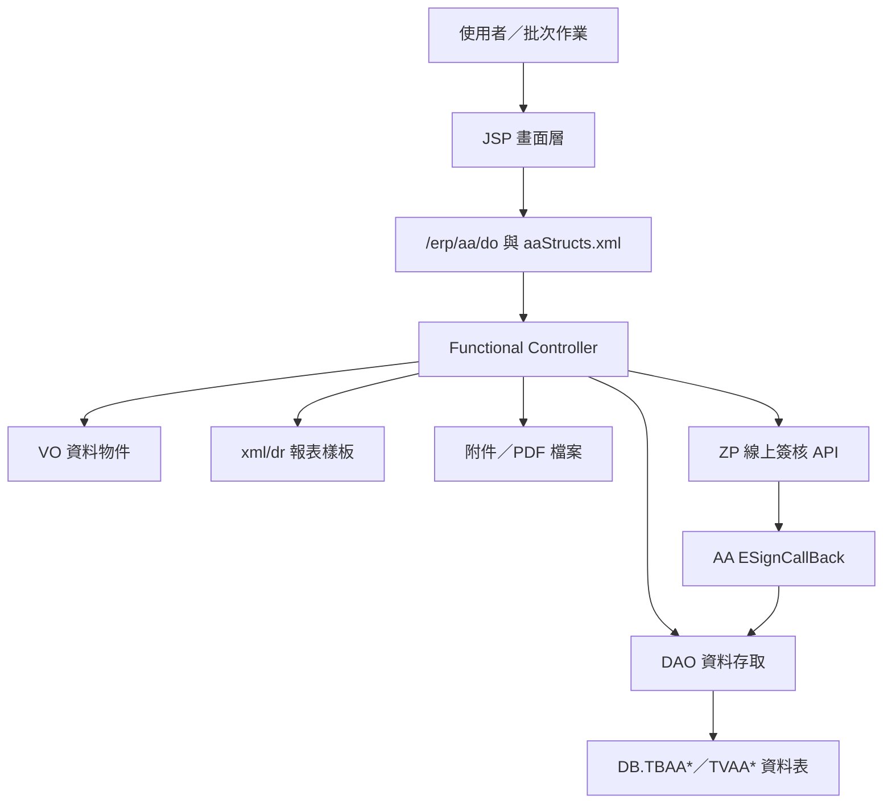
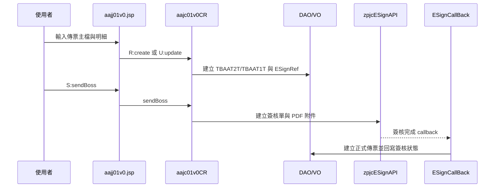
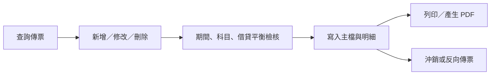
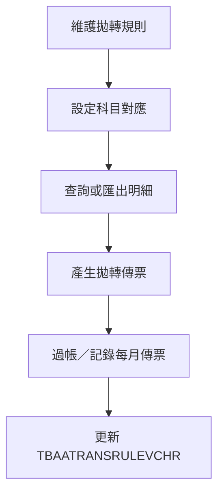

# AA 會計模組功能規格手冊

產出日期：2026-08-19  
整理範圍：`D:\CHSBrowser_erp\erpHome\yl.ear\erp.war\aa`

## 1. 系統概述

### 1.1 系統定位

`AA` 模組為 ERP 會計／總帳作業模組，主要負責會計基本資料維護、傳票建立與查詢、會計期間控管、簽核送審、報表列印、資料拋轉及年度／批次處理。模組以 JSP 畫面、Functional Controller、DAO／VO 及報表 XML 組成，透過 `aaStructs.xml` 定義頁面、控制器、動作與資料物件之間的對應。

### 1.2 使用對象

- 會計承辦人員：執行傳票新增、修改、查詢、列印、沖銷及附件管理。
- 會計主管／簽核人員：處理線上簽核、退回、完成後建正式傳票。
- 系統管理／會計設定人員：維護會計科目、核算項目、參考號碼、會計期間、關帳狀態與拋轉規則。
- 批次與介接作業人員：執行資料轉入、轉出、年度處理及批次傳票產生。

### 1.3 系統目標

- 建立一致的會計基礎資料，支援多公司別、多期間與多幣別會計作業。
- 支援暫存傳票、正式傳票、傳票明細、沖銷及列印作業。
- 透過線上簽核機制控管傳票核准流程，並在簽核完成後回寫傳票狀態或建立正式傳票。
- 提供報表、附件上傳、批次處理及資料拋轉規則，支援跨系統會計資料整合。

### 1.4 主要資料來源與證據

- 頁面與 Controller 映射：`config/yl/aa/aaStructs.xml`
- 系統設定：`config/yl/aa/aaConfig.ini`
- 使用者畫面：`jsp/*.jsp`
- 主要程式：`src/com/icsc/aa/*.java`
- DAO／VO：`src/com/icsc/aa/dao/*.java`、`dao/*.dao`
- 資料表 DDL：`sql/*.sql`、`dao/sql/*.sql`
- 報表樣板：`xml/dr/*.xml`
- 線上簽核 callback：`src/com/icsc/aa/ESignCallBack/*.java`

### 1.5 模組規模

- JSP 畫面：約 676 個。
- Java 程式：約 720 個。
- DAO／資料定義檔：約 158 個。
- 報表 XML：約 13 個。
- `aaStructs.xml` 登錄正式 page 對應約 103 項。

## 2. 系統架構總覽

### 2.1 整體架構

### 2.2 分層說明

| 層級 | 主要元件 | 功能說明 |
| --- | --- | --- |
| 畫面層 | `jsp/aajj*.jsp` | 提供查詢、新增、修改、刪除、列印、送簽、上傳等操作介面。 |
| 映射層 | `config/yl/aa/aaStructs.xml` | 定義 pageID、JSP path、Controller、action flag、method、forward 與 VO converter。 |
| 控制層 | `aajc*CR`、`aajc*Func`、部分 `aajb*` | 接收 action，執行驗證、流程控制、交易處理與訊息回傳。 |
| 資料層 | `aajc*DAO`、`aajc*VO`、`aajb*DAO` | 對應 DB table，負責查詢、建立、更新、刪除與狀態異動。 |
| 報表層 | `xml/dr/aajr*.xml`、`aajcPrintVc`、`aajcRptCR` | 產生傳票、簽核、彙總及明細報表。 |
| 簽核層 | `aajcESignTool`、`ESignCallBack` | 呼叫 ZP 簽核 API，建立簽核單、產生 PDF、回寫簽核狀態。 |
| 批次／介接層 | `bat`、`bp`、`func` | 執行自動轉檔、外部資料拋轉、年度資料處理及排程相關流程。 |

### 2.3 主要設定

`aaConfig.ini` 目前設定 `marFilePath=../../erpfile/aa/`，代表本模組報表或檔案產出會使用 ERP 檔案區下的 `aa` 目錄作為存放路徑之一。

### 2.4 Page 與 Action 運作模式

使用者進入 JSP 畫面後，表單通常送往 `/erp/aa/do?_pageId=...`。系統依 `_pageId` 於 `aaStructs.xml` 找到 Controller，再依 `_action` flag 呼叫對應 method，例如：

- `I:query`：查詢或初始化畫面資料。
- `N:create`、`R:create`：新增資料或建立單據。
- `U:update`、`R:update`：修改資料。
- `D:delete`：刪除或作廢資料。
- `P:print`：列印或預覽。
- `S:sendBoss`：送簽或送主管。
- `C:calculate`、`E:execute`、`RUN:runAA823`：計算、執行或批次功能。

### 2.5 核心資料表群組

| 資料群組 | 代表資料表 | 用途 |
| --- | --- | --- |
| 會計科目與期初資料 | `TBAA01`、`TBAA011`、`TBAA01LOG`、`TBAA01TEMP` | 科目基本資料、科目樹、異動紀錄與暫存。 |
| 會計期間與序號 | `TBAA04`、`TBAA041`、`TBAA042`、`TBAA043`、`TBAA0431` | 期間起訖、關帳狀態、傳票序號與期間控管。 |
| 傳票主檔／明細 | `TBAAT2`、`TBAAT1`、`TBAAT2T`、`TBAAT1T`、`TBAA05`、`TBAA06`、`TBAA061` | 正式或暫存傳票主檔、分錄明細、狀態、金額與摘要。 |
| 輔助核算 | `TBAA23`、`TBAA24`、`TBAA25`、`TBAA26` | 核算類別、參考號類別、核算代號、參考號碼等。 |
| 報表與列印 | `TBAARPT`、報表 XML | 報表參數、列印輸出與傳票 PDF。 |
| 拋轉規則 | `TBAATRANSRULE`、`TBAATRANSRULEVCHR`、`TBAATRANSRULEACCT` | 自動拋轉規則、科目對應、期間傳票記錄。 |
| 簽核參照 | `aajcESignRefVO/DAO` 對應資料 | 紀錄簽核單號、傳票序號、附件 agentNo、簽核狀態與來源程式。 |

### 2.6 主要資料表

| 資料表 | VO／DAO | 功能定位 | 主要用途 | 關聯功能 |
| --- | --- | --- | --- | --- |
| `DB.TBAA01` | `aajc01VO`／`aajc01DAO`、`aajb01`／`aajb01DAO` | 會計科目主檔 | 保存科目代號、科目名稱、借貸方向、傳票可用註記、核算代號註記、參考號碼註記、到期日註記、現金科目註記及刪除狀態。 | 會計科目基本資料、傳票明細檢核、科目查詢。 |
| `DB.TBAA011`／`DB.TBAA011NEW` | `aajc011VO`／`aajc011DAO`、`aajc011NewVO`／`aajc011NewDAO`、`aajb011`／`aajb011DAO` | 科目階層資料 | 保存科目上下層結構與科目樹資料，支援階層瀏覽及科目分類。 | 科目樹維護、科目階層查詢。 |
| `DB.TBAA01LOG` | `aajc01LogVO`／`aajc01LogDAO` | 科目異動紀錄 | 保存科目主檔異動歷程，用於追蹤科目新增、修改或刪除前後資料。 | 科目異動稽核、歷史查詢。 |
| `DB.TBAA02`／`DB.TBAA02Y` | `aajc02VO`／`aajc02DAO`、`aajc02yVO`／`aajc02yDAO`、`aajb02`／`aajb02DAO` | 科目餘額資料 | 保存科目於期間或年度層級的金額彙總資料，作為總帳與報表查詢基礎。 | 期間餘額、年度資料、總帳報表。 |
| `DB.TBAA03`／`DB.TBAA03Y` | `aajc03VO`／`aajc03DAO`、`aajc03yVO`／`aajc03yDAO`、`aajb03`／`aajb03DAO` | 核算餘額資料 | 保存科目加核算代號的期間或年度彙總資料，用於核算項目層級的餘額與明細查詢。 | 核算項目餘額、明細帳、管理報表。 |
| `DB.TBAA04` | `aajc04VO`／`aajc04DAO`、`aajb04`／`aajb04DAO` | 會計期間主檔 | 保存會計期間起訖日、關帳狀態及各類傳票流水號。 | 會計期間維護、關帳、傳票號碼產生。 |
| `DB.TBAA041`／`DB.TBAA042` | `aajc042VO`／`aajc042DAO`、`aajb041`／`aajb041DAO`、`aajb042`／`aajb042DAO` | 期間／日期補助控管 | 保存傳票日期、刪除傳票或期間控管相關資料，協助判斷日期是否可異動。 | 傳票日期檢核、傳票刪除、期間控制。 |
| `DB.TBAA043`／`DB.TBAA0431` | `aajc043VO`／`aajc043DAO`、`aajc0431VO`／`aajc0431DAO` | 程式別傳票控管 | 保存程式別、期間別傳票序號及明細控管資料，支援不同來源程式產生傳票。 | 傳票序號控管、程式別傳票產生。 |
| `DB.TBAAT2` | `aajct2VO`／`aajct2DAO`、`aajbt2`／`aajbt2DAO` | 正式傳票主檔 | 保存正式傳票表頭、摘要、狀態、來源程式、建立人員、列印次數及借貸總額。 | 正式傳票查詢、列印、過帳、沖銷。 |
| `DB.TBAAT1` | `aajct1VO`／`aajct1DAO`、`aajbt1`／`aajbt1DAO` | 正式傳票明細 | 保存正式傳票分錄明細，包含借貸別、科目、核算代號、參考號碼、幣別、原幣金額、本幣金額與摘要。 | 正式傳票分錄、借貸平衡、明細帳。 |
| `DB.TBAAT2T` | `aajct2tVO`／`aajct2tDAO` | 暫存傳票主檔 | 保存暫存或送簽中的傳票表頭資料，作為正式傳票建立前的工作區。 | 暫存傳票建立、修改、送簽。 |
| `DB.TBAAT1T` | `aajct1tVO`／`aajct1tDAO` | 暫存傳票明細 | 保存暫存或送簽中的傳票分錄明細，簽核完成後可轉入正式傳票。 | 暫存傳票分錄、簽核完成轉正式傳票。 |
| `DB.TBAAT3` | `aajct3VO`／`aajct3DAO`、`aajbt3`／`aajbt3DAO` | 沖銷傳票關聯 | 保存原傳票與沖銷／反向傳票的關聯資料，保留追蹤鏈。 | 傳票沖銷、反向傳票追蹤。 |
| `DB.TBAA05` | `aajc05VO`／`aajc05DAO`、`aajb05`／`aajb05DAO` | 傳票明細資料 | 保存分錄借貸、科目、核算、參考號碼、幣別、金額、到期日及摘要等帳務明細。 | 傳票明細、報表、帳務查詢。 |
| `DB.TBAA06`／`DB.TBAA061` | `aajc06VO`／`aajc06DAO`、`aajc06sVO`／`aajc06sDAO`、`aajb06`／`aajb06DAO`、`aajb061`／`aajb061DAO` | 傳票補充分錄 | 保存傳票相關明細或補助資訊，支援特殊分錄與查詢需求。 | 傳票附屬明細、特殊分錄處理。 |
| `DB.TBAA07`／`DB.TBAA08` | `aajc07VO`／`aajc07DAO`、`aajb07`／`aajb07DAO`、`aajb08`／`aajb08DAO` | 傳票補助資料 | 保存傳票主檔、列印、狀態或其他補助資料，供傳票查詢與列印流程使用。 | 傳票查詢、列印、狀態追蹤。 |
| `DB.TBAA09`／`DB.TBAA0B`／`DB.TBAA0C` | `aajb09`／`aajb09DAO`、`aajb0b`／`aajb0bDAO`、`aajb0c`／`aajb0cDAO` | 發票／憑證資料 | 保存發票、憑證或稅務相關資料，並與傳票或會計分錄連結。 | 發票資料、稅務明細、傳票關聯。 |
| `DB.TBAA10` | `aajc10VO`／`aajc10DAO`、`aajc10yVO`／`aajc10yDAO`、`aajb10`／`aajb10DAO` | 核算參考彙總 | 保存科目、核算代號、參考號碼與期間的彙總資料。 | 核算／參考號餘額、明細帳與報表。 |
| `DB.TBAA23` | `aajc23VO`／`aajc23DAO`、`aajb23` | 核算類別主檔 | 維護核算類別代號與說明，供科目與傳票明細檢核使用。 | 核算類別維護、傳票輸入檢核。 |
| `DB.TBAA24` | `aajc24VO`／`aajc24DAO`、`aajb24` | 參考號類別主檔 | 維護參考號類別代號與說明，供科目與傳票明細檢核使用。 | 參考號類別維護、傳票輸入檢核。 |
| `DB.TBAA25` | `aajc25VO`／`aajc25DAO`、`aajb25` | 核算代號主檔 | 維護各核算類別下的核算代號與刪除狀態。 | 核算代號查詢、傳票明細輔助輸入。 |
| `DB.TBAA26` | `aajc26VO`／`aajc26DAO`、`aajb26` | 參考號碼主檔 | 維護各參考號類別下的參考號碼與刪除狀態。 | 參考號碼查詢、傳票明細輔助輸入。 |
| `DB.TBAARPT` | `aajcRptVO`／`aajcRptDAO` | 報表設定資料 | 保存報表參數或報表設定，支援報表查詢、列印與輸出。 | 報表列印、查詢條件保存。 |
| `DB.TBAATRANSRULE` | `aajcTransRuleVO`／`aajcTransRuleDAO` | 自動拋轉規則主檔 | 保存規則代號、規則類型、規則名稱、金額類型、反轉註記及摘要設定。 | 自動拋轉規則維護。 |
| `DB.TBAATRANSRULEACCT` | `aajcTransRuleAcctVO`／`aajcTransRuleAcctDAO` | 拋轉科目設定 | 保存拋轉規則與會計科目之間的對應設定。 | 拋轉科目對應、傳票分錄產生。 |
| `DB.TBAATRANSRULEVCHR` | `aajcTransRuleVchrVO`／`aajcTransRuleVchrDAO` | 拋轉傳票紀錄 | 保存每月依規則產生的傳票號碼、日期、維護人員與傳票迄號。 | 拋轉傳票產生、過帳與追蹤。 |
| `DB.TBAAU010` | `aajcu010VO`／`aajcu010DAO` | 管理分類設定 | 保存管理報表或大類代碼設定資料。 | 報表分類或管理設定維護。 |
| `DB.TBAAU020`／`DB.TBAAU020H` | `aajcu020VO`／`aajcu020DAO`、`aajcu020HVO`／`aajcu020HDAO` | 月資料與歷史資料 | 保存每月管理資料及歷史留存資料，支援更新、取消與追蹤。 | 月資料維護、歷史保留、取消處理。 |
| `DB.TVAAT1FF`／`DB.TVAAT2D` | `tvaat2d.dao`、View SQL | 查詢 View | 由傳票資料建立查詢 View，提供報表或跨功能查詢使用。 | 報表、查詢與資料介接。 |

## 3. 功能模組詳細說明

### 3.1 會計科目基本資料

代表頁面／程式：

- `aajj01m`、`aajj01Newm`、`aajj01Tm`
- `aajc01CR`、`aajc01CRNew`、`aajc01CRT`
- `aajb01`、`aajb011`、`aajc01DAO`、`aajc011DAO`

功能說明：

- 維護公司別下的會計科目代號、科目名稱、英文名稱、借貸方向、可否製作傳票、是否需核算項目、是否需參考號碼、是否需到期日、是否現金科目等屬性。
- 支援科目新增、修改、刪除、查詢、前後筆瀏覽與科目樹管理。
- `TBAA01` 為主要科目資料表，主鍵為 `compId`、`acctCode`。
- `TBAA011`／`TBAA011NEW` 用於科目階層或科目樹資料。

主要規則：

- 已刪除科目以 `deleteCode`、`deleteDate` 標示，部分查詢會排除 `deleteCode='D'`。
- 可製作傳票科目以 `voucherYn` 控制，傳票輸入時會檢查科目狀態與屬性。

### 3.2 會計期間與關帳控制

代表頁面／程式：

- `aajj04`、`aajjf4m`、`aajj90m`、`aajj994m`
- `aajc04DAO`、`aajcf4CR`、`aajc90CR`、`aajc994CR`

功能說明：

- 維護會計期間起訖日、關帳狀態與各類傳票序號。
- 提供關帳、解除關帳、期間查詢及狀態調整。
- `TBAA04` 保存 `acctPeriod`、`startDate`、`endDate`、`closeYn` 及 `mVchrSrl`、`tVchrSrl`、`pVchrSrl`、`rVchrSrl` 等序號欄位。

主要規則：

- 傳票新增、修改、沖銷與過帳前需確認會計期間存在且未關帳。
- 關帳後應限制當期傳票異動，若需調整須先經授權流程解除或重開。

### 3.3 傳票主檔與明細作業

代表頁面／程式：

- 暫存／送簽傳票：`aajj01v0`、`aajj01v1`
- 正式傳票：`aajj02v0`、`aajj02v1`、`aajj020m`、`aajj0201`
- 查詢：`aajjt2`、`aajjt1`
- Controller：`aajc01v0CR`、`aajc01v1CR`、`aajc02v0CR`、`aajc02v1CR`、`aajct2CR`、`aajct1CR`

功能說明：

- 建立傳票主檔與分錄明細，包含傳票日期、傳票號碼、摘要、借貸別、科目、核算代號、參考號碼、幣別、原幣金額、本幣金額、到期日及明細摘要。
- 支援查詢、新增、修改、刪除、沖銷、列印與送簽。
- 暫存傳票使用 `TBAAT2T`、`TBAAT1T` 等資料表；正式傳票使用 `TBAAT2`、`TBAAT1` 或 `TBAA05`、`TBAA06` 相關資料表。
- 傳票號碼由 `aajbdei.doRegister*` 類流程依公司別、傳票日期、程式代號及期間序號產生。

主要規則：

- 借方與貸方金額需平衡。
- 傳票明細需符合科目設定，例如是否要求核算代號、參考號碼、幣別或到期日。
- 傳票狀態以 `statusCode` 控制，簽核、作廢、完成、退回等流程會異動此欄位或相關參照資料。

### 3.4 傳票沖銷與反向傳票

代表頁面／程式：

- `aajj02v0`
- `aajc02v0CR.reverse`
- `aajct3VO/DAO`

功能說明：

- 對既有傳票產生沖銷或反向傳票，保留原傳票與沖銷傳票之間的關聯。
- 支援列印沖銷後傳票，並在部分流程中自動送簽。
- `TBAAT3` 保存原始傳票號碼、沖銷傳票序號與明細關聯。

主要規則：

- 沖銷時會查詢原傳票主檔與明細，產生對應反向分錄。
- 已沖銷或狀態不允許之傳票不應重複沖銷。

### 3.5 線上簽核與附件整合

代表頁面／程式：

- `aajj01v0`、`aajj02v0`、`aajj80m`、`aajjylsSrc`
- `aajcESignTool`
- `aajcMT2ESignCallBack`、`aajcT2ESignCallBack`、`aajcT3ESignCallBack`、`aajc82ESignCallBack`
- `aajcESignRefDAO`、`aajcESignRefVO`

功能說明：

- 建立傳票或特定會計單據時產生簽核參照資料，包含 `ESignNo`、`SerialNo`、`AgentNo`、`SignStatus`、`FromPgrmId`。
- 呼叫 `zpjcESignAPI` 建立線上簽核單，並以報表 XML 產生 PDF 作為簽核附件。
- 簽核完成 callback 會將暫存傳票轉正式傳票，回寫傳票號碼與簽核狀態。
- 簽核退回或取消會將相關傳票及參照狀態改為退回或作廢。

主要狀態：

- `S`：送簽中。
- `F`：簽核完成。
- `R`：退回。
- `D`：取消或作廢。

### 3.6 報表列印與 PDF 產生

代表頁面／程式：

- `aajjPrintVc`、`aajjRptm`、`aajj021`、`aajj021t`
- `aajcPrintVc`、`aajcRptCR`、`aajc021CR`、`aajc021tCR`
- `xml/dr/aajrVchr.xml`、`aajrVchrESign.xml`、`aajrSerialESign.xml`、`aajr999Report.xml`

功能說明：

- 提供傳票列印、簽核傳票 PDF、序號簽核報表及彙總報表。
- 依報表樣板與輸入條件產生預覽、列印或 PDF 檔。
- 支援附件上傳與報表檔案管理，搭配 `marFilePath` 指定之 ERP 檔案區。

### 3.7 輔助核算資料維護

代表頁面／程式：

- `aajj23m`、`aajj24m`、`aajj25m`、`aajj26m`
- `aajc23CR`、`aajc24CR`、`aajc25CR`、`aajc26CR`
- `TBAA23`、`TBAA24`、`TBAA25`、`TBAA26`

功能說明：

- 維護核算類別、參考號類別、核算代號及參考號碼。
- 提供傳票明細輸入時的選擇、查詢與說明帶入。
- 依科目設定決定是否必填核算代號或參考號碼。

### 3.8 公司、幣別、部門與共用代碼維護

代表頁面／程式：

- `aajjcpm`、`aajjrfm`、`aajj0ym`、`aajj0km`、`aajju010m`、`aajju020m`
- `aajccpCR`、`aajcrfCR`、`aajc0yCR`、`aajc0kCR`、`aajcu010CR`、`aajcu020CR`

功能說明：

- 維護公司別、幣別、匯率、部門或共用代碼資料。
- 提供查詢、更新、新增、刪除及取消等功能。
- 支援傳票輸入、報表條件與資料拋轉時的基礎代碼檢核。

### 3.9 自動拋轉規則

代表頁面／程式：

- `aajjTransRuleMain`
- `aajjTransRuleAcct`
- `aajjTransRuleDetail`
- `aajjTransRuleVchr`
- `aajjTransRuleOthSet`
- `aajcTransRuleMainFunc`、`aajcTransRuleAcctFunc`、`aajcTransRuleDetailFunc`、`aajcTransRuleVchrFunc`、`aajcTransRuleOthSetFunc`

功能說明：

- 維護會計資料自動拋轉規則、規則名稱、金額類型、是否反轉、沖銷摘要、反轉摘要、科目對應及其他設定。
- 依規則產生拋轉傳票，並將每期產生的傳票號碼、日期與維護資訊記錄於 `TBAATRANSRULEVCHR`。
- 支援規則查詢、新增、修改、刪除、科目設定、明細匯出、傳票產生與過帳。

主要資料表：

- `TBAATRANSRULE`：規則主檔，主鍵為 `compId`、`ruleNo`。
- `TBAATRANSRULEVCHR`：每月規則產生傳票紀錄，主鍵為 `compId`、`ruleNo`、`YYYYMM`。
- `TBAATRANSRULEACCT`：規則科目或會計科目對應。

### 3.10 固定資產／費用／特殊會計處理

代表頁面／程式：

- `aajj80m`、`aajj81`、`aajj820m`、`aajj824`、`aajj830m`、`aajj831m`、`aajj832m`、`aajj840m`、`aajj841m`
- `aajc80CR`、`aajc81CR`、`aajc820`、`aajc824CR`、`aajc830CR`、`aajc831CR`、`aajc832CR`、`aajc840CR`、`aajc841CR`

功能說明：

- 處理特定會計主題資料，如資產、收入認列、費用攤提或專案類會計資料。
- 提供新增、修改、刪除、查詢、計算、列印與送簽。
- 部分流程會透過 `aajcESignTool` 將資料送簽，簽核完成後建立或更新傳票。

### 3.11 應收／應付、票據與帳齡類作業

代表頁面／程式：

- `aajj70m`、`aajj701`、`aajj702`、`aajj72m`、`aajj721`、`aajj731m`、`aajj73m`、`aajj74m`、`aajj741`
- `aajc70CR`、`aajc701CR`、`aajc702CR`、`aajc72CR`、`aajc721CR`、`aajc731CR`、`aajc73CR`、`aajc74CR`

功能說明：

- 管理往來明細、收付款、沖帳、帳齡或相關分類資料。
- 支援查詢、新增、修改、刪除及部分報表上傳／列印。
- 與傳票明細之核算代號、參考號碼、到期日與科目餘額互相關聯。

### 3.12 IFRS／外部系統介接與批次處理

代表頁面／程式：

- `aajj1001RI`、`aajj1001RB`、`aajj1001RD`
- `aajj1002BatBase`、`aajj1003BatBase`、`aajj1004BatBase`
- `aajc1001RI`、`aajc1001RB`、`aajc1001RD`、`aajc1002CR`、`aajc1003CR`、`aajc1004CR`
- `src/com/icsc/aa/bat/*`、`src/com/icsc/aa/func/*`

功能說明：

- 維護 IFRS 或外部介接相關設定與資料。
- 執行批次查詢、整批執行、刪除、結案及資料匯入／轉入。
- `func` 目錄包含 MQ 接收、外匯評價轉入 AA、其他系統轉會計資料等自動化流程。

### 3.13 年度資料處理

代表頁面／程式：

- `aajjYearDataProc`
- `aajcYearDataProcCR`

功能說明：

- 執行會計年度資料處理，通常包含年度資料建立、轉置或期初期末相關維護。
- 執行前需確認公司別與會計期間狀態，避免重複或錯期處理。

### 3.14 其他輔助查詢與彈出視窗

代表頁面：

- `aajjShowAcctCode`、`aajjShowDate`、`aajjShowCrcy`、`aajjShowDe23`
- `acctCode.jsp`、`idCode.jsp`、`refNo.jsp`、`invoiceKind.jsp`
- `aajj02vIdCode`、`aajj02vRefNo`

功能說明：

- 提供傳票與報表畫面使用之輔助查詢視窗。
- 協助使用者選取科目、核算代號、參考號碼、幣別、日期與發票類別。
- 多數輔助查詢以現行公司別、科目設定與未刪除資料作為篩選條件。

### 3.15 報表與資料輸出

代表頁面／程式：

- `aajjr*` 系列 JSP
- `aajcRptCR`、`aajcRptVChr`、`aajcReport`、`aajcRpPrint*`

功能說明：

- 提供總帳、明細帳、傳票清單、彙總表及各式管理報表。
- 支援以公司別、會計期間、科目區間、核算項目、參考號碼或日期區間查詢。
- 報表輸出可能產生 PDF、列印檔或下載檔。

### 3.16 權限與作業控管

功能說明：

- 功能按鈕與操作通常依使用者權限、公司別、資料狀態及會計期間開關控制。
- 修改與刪除作業需依 Controller 檢核傳票狀態、關帳狀態及資料存在性。
- 簽核中或已完成資料需避免直接異動，應透過退回、取消或正式調整流程處理。

### 3.17 典型作業流程

#### 3.17.1 暫存傳票送簽至正式傳票

#### 3.17.2 正式傳票維護與列印

#### 3.17.3 自動拋轉規則產生傳票

## 附錄 A. 主要 Page 對應摘要

| 功能群組 | pageID | Controller | 主要 Action |
| --- | --- | --- | --- |
| 暫存傳票主檔 | `aajj01v0` | `aajc01v0CR` | query、create、update、sendBoss、notifyBoss |
| 暫存傳票明細 | `aajj01v1` | `aajc01v1CR` | query、update、calculate |
| 正式傳票主檔 | `aajj02v0` | `aajc02v0CR` | query、create、update、delete、reverse、print、sendBoss |
| 正式傳票明細 | `aajj02v1` | `aajc02v1CR` | query、update、calculate |
| 傳票修改 | `aajj020m` | `aajc020CR` | query、update |
| 傳票摘要複製 | `aajj0201` | `aajc0201CR` | query、update、copyVchrDesc |
| 期間關帳 | `aajjf4m` | `aajcf4CR` | query、close、release |
| 報表列印 | `aajjPrintVc` | `aajcPrintVc` | preview、print、prevPage、nextPage |
| 拋轉規則主檔 | `aajjTransRuleMain` | `aajcTransRuleMainFunc` | doInquire、doCreate、doUpdate、doDelete |
| 拋轉傳票 | `aajjTransRuleVchr` | `aajcTransRuleVchrFunc` | doVchr、doPost、doExport |
| 年度資料處理 | `aajjYearDataProc` | `aajcYearDataProcCR` | execute |
| 線上簽核附件 | `aajjylsSrc` | `aajcylsFunc` | query、insert、update、delete、print、send |

## 附錄 B. 維護注意事項

- 文件中的功能分類以 `aaStructs.xml` 映射及現有檔名／資料表／Controller 交叉整理；若需作為正式驗收規格，建議再逐一訪談會計使用者確認畫面名稱與作業名稱。
- 原始程式包含 BIG5 編碼中文，終端顯示可能出現亂碼；後續查核中文欄位或畫面標題時，應以支援 BIG5 的編輯器開啟原檔。
- 部分 Controller 或 JSP 可能未登錄於 `aaStructs.xml`，可能屬舊版、彈窗、include 或未使用功能；正式清冊應以實際選單與使用權限再確認。
