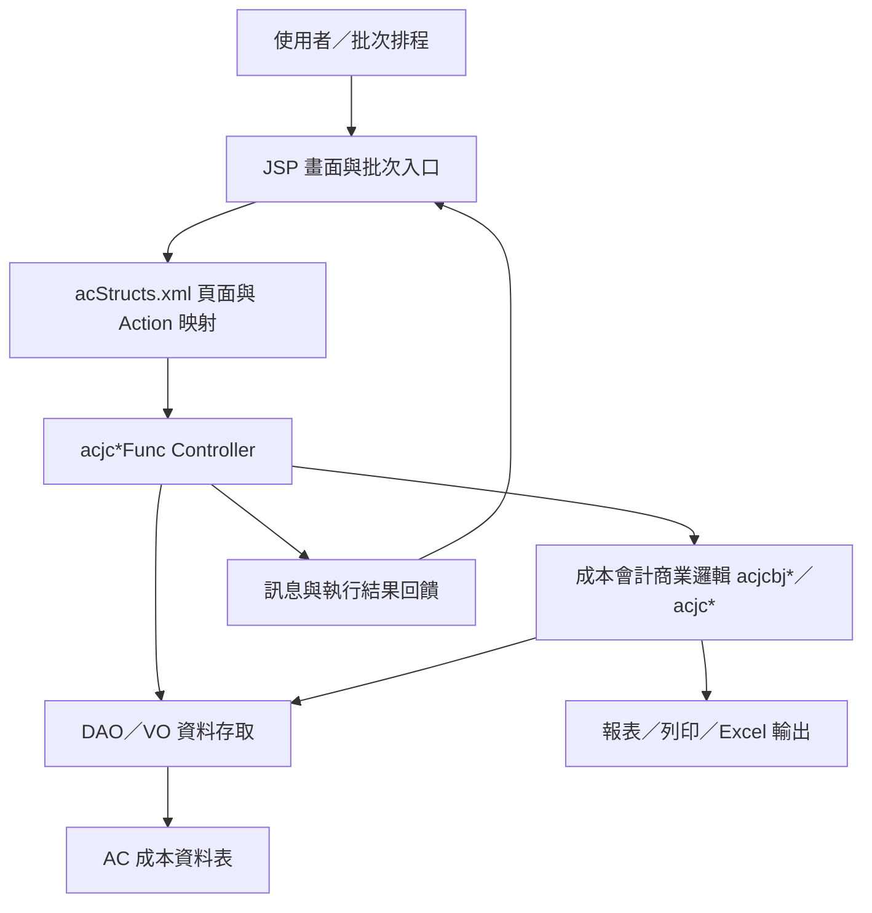

# AC 成本會計管理系統功能規格手冊

## 1. 系統概述

### 1.1 系統定位

AC 成本會計管理系統為 ERP 中負責成本資料蒐集、成本中心與成本科目主檔維護、費用分離與分攤規則設定、成本核算、報表查詢及批次作業執行的子系統。系統以公司別、會計年度、關帳月份、成本中心、成本科目、作業動因與成本產品為主要管理維度，支援成本結算前後的資料檢核、資料調整、成本分攤、成本還原與結果查詢。

本文件依目前 `ac` 模組程式、JSP 頁面、`config/yl/ac/acStructs.xml` 流程設定、DAO／VO 註解與批次類別整理，作為系統維護、需求訪談、功能盤點與後續改版的功能規格基礎。

### 1.2 使用對象

| 使用對象 | 主要目的 |
| --- | --- |
| 成本會計人員 | 維護成本中心、成本科目、分攤規則、交易資料與結轉單價，查詢成本報表。 |
| 生產管理／廠務相關人員 | 提供成本中心、作業動因、生產量或服務性成本中心分攤基礎資料。 |
| 系統管理／資訊人員 | 維護批次設定、資料匯入匯出、報表執行與系統組態。 |
| 主管／稽核查核人員 | 檢視成本結算結果、分攤明細與異常檢核報表。 |

### 1.3 系統範圍

系統範圍包含以下作業：

1. 成本中心、成本科目、成本科目索引與生管所轄中心等基本資料維護。
2. 成本系統介面資料、成本會計交易資料、成本中心費用與分類匯總資料查詢與維護。
3. 生產管理服務性成本中心分攤基準、分離規則、分攤規則與分攤順序設定。
4. 批次作業設定、批次執行、成本資料回復、費用分離比例與分攤金額計算。
5. 成本中心、成本科目、作業動因、成本產品、結轉單價與成本核算報表查詢。
6. 檔案匯入匯出、報表執行、指定單價維護與輔助查詢視窗。

### 1.4 主要資料表

| 資料表／VO | 說明 |
| --- | --- |
| `TBACB1`／`acjcb1VO` | AC 成本中心基本資料對照表。 |
| `TBACB2`／`acjcb2VO` | 成本科目基本資料維護。 |
| `TBACB3`／`acjcb3VO` | 成本科目索引資料，支援階層式科目選單。 |
| `TBACB4`／`acjcb4VO` | 批次作業設定文件。 |
| `TBACB5`／`acjcb5VO` | 成本核算產品及結轉順序。 |
| `TBACBC`／`acjcbcVO` | 生管所轄中心維護。 |
| `TBACI1`／`acjci1VO` | 成本系統介面資料。 |
| `TBACT1`／`acjct1VO` | 成本會計交易資料。 |
| `TBACT2`／`acjct2VO` | 分攤順序。 |
| `TBACTC`／`acjctcVO` | 生產管理服務性成本中心分攤基準。 |
| `TBACTD`／`acjctdVO` | 生產管理服務性成本中心及作業動因分離規則。 |
| `TBACTE`／`acjcteVO` | 生產管理服務性成本中心及作業動因分攤規則。 |
| `TBACM1`／`acjcm1VO` | 成本中心成本科目費用資料。 |
| `TBACM2`／`acjcm2VO` | 成本中心作業動因成本科目費用資料。 |
| `TBACM3`／`acjcm3VO` | 成本中心費用分類匯總。 |
| `TBACM4`／`acjcm4VO` | 成本中心作業動因費用分類匯總。 |
| `TBACM6`／`acjcm6VO` | 成本中心作業動因成本還原資料。 |
| `TBACPA`／`acjcpaVO` | 生管服務 WCE 還原交易資料。 |
| `TBACUP`／`acjcupVO` | 結轉單價／指定單價資料。 |
| `TBACIP`／`acjcipVO` | 存貨資料。 |
| `TBACRF`／`acjcrfVO` | 系統組態檔。 |

## 2. 系統架構總覽

### 2.1 程式目錄與分層

| 分層 | 目錄／檔案 | 說明 |
| --- | --- | --- |
| 使用者介面層 | `jsp/` | 成本會計各功能畫面、查詢頁、輸入頁、列印頁、彈出輔助查詢頁。 |
| 流程設定層 | `config/yl/ac/acStructs.xml` | 定義 pageID、JSP 路徑、Controller、Action flag、method、forward 與 Value Object 綁定。 |
| 控制層 | `src/com/icsc/ac/acjc*Func.java` | 接收畫面 action，執行查詢、新增、修改、刪除、列印、匯入匯出與批次觸發。 |
| 商業邏輯層 | `src/com/icsc/ac/acjcbj*.java`、`acjc*.java` | 成本分離比例、分攤金額、成本還原、產品結轉、資料檢核與共用運算。 |
| 資料存取層 | `src/com/icsc/ac/dao/*DAO.java`、`*VO.java` | 對應 AC 主要資料表，封裝查詢、異動與資料承載。 |
| 批次作業層 | `src/com/icsc/ac/bat/` | 報表檢核、生產移轉、成本回復、資料備份與 WCE 還原等排程或批次功能。 |
| API／介接層 | `src/com/icsc/ac/api/`、`dao/sql/` | 外部介面與部分資料表建置 SQL。 |
| 前端共用資源 | `html/acjtCommon.jss` | JSP 共用 JavaScript 或畫面輔助邏輯。 |

### 2.2 系統邏輯架構

### 2.3 典型作業流程

1. 使用者由 JSP 進入功能頁面，例如 `acjj0101CostCenter.jsp`。
2. ERP 框架依 `acStructs.xml` 的 pageID 找到對應 Controller，例如 `com.icsc.ac.acjc0101Func`。
3. 畫面按鈕送出 action flag，例如 `I` 查詢、`N` 新增、`R` 修改、`D` 刪除、`P` 列印、`U` 執行批次。
4. Controller 執行對應 method，必要時先執行 validate method。
5. Controller 透過 DAO／VO 讀寫資料表，或呼叫成本計算、分攤、還原、報表等商業邏輯。
6. 系統將查詢結果、執行訊息或列印資料 forward 回 JSP 或列印頁。

### 2.4 Action flag 對照

| Action flag | 代表作業 | 常見 method |
| --- | --- | --- |
| `I` | 查詢、初始查詢、列印查詢 | `doInquire`、`doPrintInquire` |
| `N` | 新增 | `doInsert` |
| `R` | 修改、更新 | `doUpdate`、`doInputUpdate` |
| `D` | 刪除或作廢 | `doDelete`、`doScrap` |
| `P` | 列印 | `doPrintInquire` |
| `U` | 執行批次或作業 | `run` |
| `E` | 匯出或執行報表 | `doExport`、`doExecute` |
| `II` | 輸入頁明細查詢 | `doInputInquire` |
| `C` | 複製 | `doCopy` |
| `T` | 切換狀態 | `doToggle` |
| `Prev`／`Next` | 前後筆查詢 | `doQueryPrev`、`doQueryNext` |

### 2.5 批次與成本計算架構

批次與成本計算類別主要位於 `src/com/icsc/ac/` 與 `src/com/icsc/ac/bat/`。其中 `acjcbjProportion`、`acjcbjDistCost`、`acjcbj12`、`acjcbj13`、`acjcbj15_csac`、`acjcbj17_ch` 等類別處理費用分離比例、分攤金額、成本資料回復與產品結轉；`acjcRptMovement`、`acjcRptCheckProdShift`、`acjcShiftXFee`、`acjcWCERecovery` 等批次類別處理報表檢核、生產異動、移轉費用與 WCE 還原。

## 3. 功能模組詳細說明

### 3.1 主要資料表

| 資料表 | VO／DAO | 功能定位 | 主要用途 | 關聯功能 |
| --- | --- | --- | --- | --- |
| `TBACB1` | `acjcb1VO`／`acjcb1DAO` | 成本中心基本主檔 | 建立與維護 AC 成本中心基本資料、成本中心描述及相關屬性。 | `acjj0101` 成本中心維護、報表查詢、成本資料歸屬。 |
| `TBACB2` | `acjcb2VO`／`acjcb2DAO` | 成本科目基本主檔 | 維護成本科目、WCE 及其屬性，供費用蒐集、分離與分攤使用。 | `acjj0102` 成本科目維護、WCE 輔助查詢、成本計算。 |
| `TBACB3` | `acjcb3VO`／`acjcb3DAO` | 成本科目索引主檔 | 維護成本科目階層、上層科目與選單索引資料。 | `acjj0102WCEMenu` 科目階層維護、`acjj0102WCEList` 科目列表。 |
| `TBACB4` | `acjcb4VO`／`acjcb4DAO` | 批次作業設定主檔 | 保存批次作業設定、系統別、應用別與執行相關參數。 | `acjj0801` 批次執行、`acjj0802` 批次設定維護。 |
| `TBACB5` | `acjcb5VO`／`acjcb5DAO` | 成本核算產品主檔 | 維護成本產品、成本核算產品及產品結轉順序。 | `acjj2001` 成本核算產品維護、產品結轉批次。 |
| `TBACBC` | `acjcbcVO`／`acjcbcDAO` | 生管所轄中心資料 | 維護生產管理所轄成本中心，用於生管資料與成本中心對應。 | `acjj0301` 生管所轄中心維護、成本分攤前置資料。 |
| `TBACI1` | `acjci1VO`／`acjci1DAO` | 成本系統介面資料 | 接收或維護外部成本介面資料，供 AC 成本交易與結算處理。 | `acjj0201` 成本介面資料維護、`acjcdei` 成本介面處理。 |
| `TBACT1` | `acjct1VO`／`acjct1DAO` | 成本會計交易資料 | 保存成本會計交易明細，支援查詢、核對、報表及成本分析。 | `acjj0202` 交易資料查詢、`070x`／`072x` 報表群。 |
| `TBACT2` | `acjct2VO`／`acjct2DAO` | 分攤順序設定 | 定義成本分攤或結轉處理的順序控制資料。 | `acjj0403` 分攤順序維護、成本分攤計算。 |
| `TBACTC` | `acjctcVO`／`acjctcDAO` | 分攤基準設定 | 維護服務性成本中心分攤基準，作為費用分離與分攤比例來源。 | `acjj0103` 分攤基準維護、`acjcbjProportion` 分離比例計算。 |
| `TBACTD` | `acjctdVO`／`acjctdDAO` | 分離規則設定 | 維護服務性成本中心與作業動因分離規則。 | `acjj0302`、`acjj1702` 分離規則查詢、修改、列印與 Excel 輸出。 |
| `TBACTE` | `acjcteVO`／`acjcteDAO` | 分攤規則設定 | 維護服務性成本中心與作業動因分攤規則。 | `acjj0402` 分攤規則查詢、修改、列印與 Excel 輸出。 |
| `TBACM1` | `acjcm1VO`／`acjcm1DAO` | 成本中心費用明細 | 保存成本中心與成本科目的費用資料。 | 成本中心費用查詢、`acjj0711` 報表、成本彙總計算。 |
| `TBACM2` | `acjcm2VO`／`acjcm2DAO` | 作業動因費用明細 | 保存成本中心、作業動因與成本科目的費用資料。 | 費用分離、作業動因成本分析、成本分攤計算。 |
| `TBACM3` | `acjcm3VO`／`acjcm3DAO` | 成本中心費用分類彙總 | 保存成本中心費用分類彙總結果。 | `acjj0105` 費用分類查詢、`acjj0701`／`acjj0705` 報表。 |
| `TBACM4` | `acjcm4VO`／`acjcm4DAO` | 作業動因費用分類彙總 | 保存成本中心作業動因費用分類彙總結果。 | 作業動因成本彙總、分攤結果查詢與報表。 |
| `TBACM6` | `acjcm6VO`／`acjcm6DAO` | 成本還原資料 | 保存成本中心作業動因成本還原結果。 | `acjcbj15_csac` 成本資料回復、`acjcWCERecovery` WCE 還原。 |
| `TBACPA` | `acjcpaVO`／`acjcpaDAO` | 生管服務 WCE 還原交易 | 保存生管服務 WCE 還原交易資料。 | 成本還原、WCE 還原批次、服務性成本中心處理。 |
| `TBACUP` | `acjcupVO`／`acjcupDAO` | 指定單價／結轉單價 | 維護指定單價或結轉單價資料。 | `acjjup` 指定單價維護、產品結轉與成本計算。 |
| `TBACIP` | `acjcipVO`／`acjcipDAO` | 存貨資料 | 保存存貨相關資料，供成本核算與結轉參考。 | 存貨成本處理、成本產品與結轉計算。 |
| `TBACPRODRATE` | `acjcProdRateVO`／`acjcProdRateDAO` | 結轉單價資料 | 保存產品結轉單價資料。 | 產品結轉、指定單價查詢、成本核算。 |
| `TBACRF` | `acjcrfVO`／`acjcrfDAO` | 系統組態資料 | 保存 AC 系統組態與控制參數。 | 系統設定、批次或報表執行參數。 |
| `TBACC1` | `acjcc1VO`／`acjcc1DAO` | 成本傳票控制資料 | 保存 AC 成本傳票控制檔資料。 | 成本傳票控制、介面資料驗證與傳票處理。 |

### 3.2 基本資料維護模組

| 功能代號 | 主要頁面 | Controller | 主要資料 | 功能說明 |
| --- | --- | --- | --- | --- |
| `acjj0101` | `acjj0101CostCenter.jsp` | `acjc0101Func` | `TBACB1` | 維護成本中心基本資料，提供查詢、新增、修改、刪除，並可查詢部門與作業活動輔助資料。 |
| `acjj0102` | `acjj0102WCEInput.jsp`、`acjj0102WCEMenu.jsp`、`acjj0102WCEList.jsp` | `acjc0102Func`、`acjc01022Func`、`acjc01023Func` | `TBACB2`、`TBACB3` | 維護成本科目與成本科目索引，支援階層選單、列表查詢與基本資料異動。 |
| `acjj0103` | `acjj0103A.jsp` | `acjc0103Func` | `TBACTC` | 維護生產管理服務性成本中心分攤基準，作為後續費用分攤的基礎。 |
| `acjj0104` | `acjj0104Main.jsp` | `acjc0104Func` | 依程式邏輯複製設定 | 提供規則或資料複製功能，降低跨年度、跨月份或相似設定重建成本。 |
| `acjj0105` | `acjj0105Main.jsp` | `acjc0105Func` | `TBACM3` | 查詢成本中心費用分類匯總，並可切換顯示狀態。 |

### 3.3 介面與交易資料模組

| 功能代號 | 主要頁面 | Controller | 主要資料 | 功能說明 |
| --- | --- | --- | --- | --- |
| `acjj0201` | `acjj0201A.jsp` | `acjc0201Func` | `TBACI1` | 維護成本系統介面資料，提供查詢、新增、修改與作廢，作為外部成本來源資料進入 AC 的入口。 |
| `acjj0202` | `acjj0202A.jsp` | `acjc0202Func` | `TBACT1` | 查詢成本會計交易資料，供成本明細追蹤、資料核對與後續報表使用。 |

### 3.4 成本規則與分攤設定模組

| 功能代號 | 主要頁面 | Controller | 主要資料 | 功能說明 |
| --- | --- | --- | --- | --- |
| `acjj0301` | `acjj0301A.jsp` | `acjc0301Func` | `TBACBC` | 維護生管所轄中心資料，作為成本中心與生管資料關聯依據。 |
| `acjj0302` | `acjj0302Menu.jsp`、`acjj0302Input.jsp`、`acjj0302Print.jsp` | `acjc0302Func` | `TBACTD` | 維護服務性成本中心及作業動因分離規則，支援查詢、明細修改與畫面列印。 |
| `acjj0402` | `acjj0402Menu.jsp`、`acjj0402Input.jsp`、`acjj0402Print.jsp` | `acjc0402Func` | `TBACTE` | 維護服務性成本中心及作業動因分攤規則，支援查詢、修改、列印與 Excel 輸出。 |
| `acjj0403` | `acjj0403A.jsp` | `acjc0403Func` | `TBACT2` | 維護分攤順序，用於控制成本分攤或結轉計算的處理先後。 |
| `acjj1702` | `acjj1702Menu.jsp`、`acjj1702Input.jsp`、`acjj1702Print.jsp` | `acjc1702Func` | `TBACTD` | 與分離規則相關的另一組查詢、修改、列印與 Excel 輸出作業，可能用於特定情境或改版後作業流程。 |

### 3.5 成本核算與產品結轉模組

| 功能代號 | 主要頁面／類別 | Controller／類別 | 主要資料 | 功能說明 |
| --- | --- | --- | --- | --- |
| `acjj2001` | `acjj2001A.jsp` | `acjc2001Func` | `TBACB5` | 維護成本核算產品及結轉順序，提供查詢、新增、修改、刪除，作為產品結轉計算基礎。 |
| 批次計算 | `acjcbj12`、`acjcbj13`、`acjcbj17_ch` | 商業邏輯類別 | `TBACM*`、`TBACB5` 等 | 依關帳月份與成本資料執行費用分離比例、分配率、分攤金額及產品結轉計算。 |
| 成本還原 | `acjcbj15_csac`、`acjcWCERecovery` | 商業邏輯／批次類別 | `TBACM6`、`TBACPA` | 執行成本資料回復或 WCE 還原，支援資料重算或異常修復情境。 |
| 指定單價 | `acjjupList.jsp` | `acjcupFunc` | `TBACUP` | 查詢與維護指定單價、結轉單價相關資料。 |

### 3.6 批次作業設定與執行模組

| 功能代號 | 主要頁面／類別 | Controller／類別 | 主要資料 | 功能說明 |
| --- | --- | --- | --- | --- |
| `acjj0801` | `acjj0801Main.jsp` | `acjc0801Func` | `TBACB4` | 查詢批次作業設定並執行批次，畫面提供「執行」與結果訊息顯示。 |
| `acjj0802` | `acjj0802A.jsp` | `acjc0802Func` | `TBACB4` | 維護批次作業設定文件，提供查詢、新增、修改、刪除。 |
| 報表檢核批次 | `acjcRptCheckProdShift`、`acjcRptMovement` | 批次類別 | 依報表邏輯 | 檢核產品移轉、成本異動與報表相關資料。 |
| 資料備份批次 | `acjcBackUp2MSSql` | 批次類別 | 依備份設定 | 將指定資料備份至 MSSQL 或外部儲存。 |
| 移轉費用批次 | `acjcShiftXFee` | 批次類別 | 成本費用資料 | 處理成本移轉或費用移轉相關批次。 |

### 3.7 報表查詢與列印模組

| 功能代號 | 主要頁面 | Controller | 主要資料 | 功能說明 |
| --- | --- | --- | --- | --- |
| `acjj0701` | `acjj0701.jsp`、`acjj0701Print.jsp` | `acjc0701Func` | `TBACM3` 等 | 成本中心費用分類或月份區間類報表查詢與列印。 |
| `acjj0702` | `acjj0702.jsp`、`acjj0702Print.jsp` | `acjc0702Func` | `TBACT1` 等 | 依關帳月份、成本中心、成本科目或 WCE 條件查詢列印。 |
| `acjj0705` | `acjj0705.jsp`、`acjj0705Print.jsp` | `acjc0705Func` | `TBACM3` 等 | 成本中心費用彙總類報表。 |
| `acjj0706` | `acjj0706.jsp`、`acjj0706Print.jsp` | `acjc0706Func` | 依 Controller 查詢 | 成本會計報表列印查詢。 |
| `acjj0709_csac` | `acjj0709_csac.jsp`、`acjj0709Print_csac.jsp` | `acjc0709Func_csac` | `TBACB1` 等 | CSAC 客製報表查詢與列印。 |
| `acjj0711` | `acjj0711.jsp`、`acjj0711Print.jsp` | `acjc0711Func` | `TBACM1` 等 | 成本中心／月份區間類報表查詢與列印。 |
| `acjj071903_csac` | `acjj071903_csac.jsp`、`acjj071903Print_csac.jsp` | `acjc071903Func_csac` | `TBACT1` | CSAC 客製成本交易或分析報表。 |
| `acjj0720_yl` 至 `acjj0723_yl` | `acjj0720_yl.jsp`、`acjj0721_yl.jsp`、`acjj0722_yl.jsp`、`acjj0723_yl.jsp` | `acjc0720Func_yl` 至 `acjc0723Func_yl` | `TBACT1` 等 | YL 客製報表群，支援關帳月份、成本中心、WCE 等條件查詢。 |
| `acjjrp` | `acjjrp.jsp`、`acjjrpExec.jsp` | `acjcrpFunc` | 報表參數與報表定義 | 查詢可執行報表並依參數執行。 |

### 3.8 匯入匯出與資料蒐集模組

| 功能／頁面 | 主要類別 | 功能說明 |
| --- | --- | --- |
| `acjjImport.jsp` | `acjcImportFunc`（設定存在，程式檔未在目前 checkout 內） | 提供「由 ERP 下載到本機」與「上載到 ERP」的檔案匯入匯出入口。 |
| `acjjIXDataCollect.jsp`、`acjjIXDataCollect01List.jsp`、`acjjIXDataCollect02List.jsp` | `acjcIXDataCollect` | 成本資料蒐集流程，畫面包含查詢、產生與資料收集步驟。 |
| `acjcdei` | 成本系統介面類別 | 提供成本介面資料新增、扣帳、驗證與傳票相關檢查邏輯。 |

### 3.9 輔助查詢與共用功能

| 功能／類別 | 功能說明 |
| --- | --- |
| `acjjHitCostCenter.jsp`、`acjjHitActCodeByCC.jsp`、`acjjHitAcProdCode.jsp`、`acjjHitWCE.jsp` | 成本中心、作業代碼、成本產品、WCE 等彈出式輔助查詢。 |
| `acjcComm` | 成本會計共用方法，供日期、使用者、資料格式與共用查詢使用。 |
| `acjcCheckData`、`acjcCostCenter`、`acjcWCE` | 資料有效性檢查，例如成本中心、成本科目或 WCE 是否為作用中資料。 |
| `acjcThrowMsg`、`acjcMsg` | 訊息、LOG 或批次執行狀態封裝。 |
| `acjcAutor` | 成本會計細部授權相關功能。 |

### 3.10 設定存在但需補查的功能

`acStructs.xml` 中有部分 Controller 設定存在，但目前 `src/com/icsc/ac` 目錄未找到對應 Java 檔。這些項目可能位於其他分支、共用 jar、尚未匯入的原始碼或歷史設定殘留；後續若要做精準改版或測試，建議先補齊來源。

| Controller | 設定頁面 |
| --- | --- |
| `acjcImportFunc` | `acjjImport.jsp` |
| `acjc0707Func` | `acjj0707.jsp` |
| `acjc071902Func_csac` | `acjj071902Print_csac.jsp` |
| `acjc0304Func` | `acjj0304A.jsp` |
| `acjc0501Func` | `acjj0501A.jsp` |
| `acjc0704Func` | `acjj0704Print.jsp` |
| `acjc0901Func`、`acjc0902Func`、`acjc0903AFunc`、`acjc0903BFunc`、`acjc0904BaseFunc`、`acjc0904RowFunc` | `acjj0901.jsp`、`acjj0902A.jsp`、`acjj0903A.jsp`、`acjj0903B.jsp`、`acjj0904Base.jsp`、`acjj0904Row.jsp` |

### 3.11 後續維護建議

1. 以 `acStructs.xml` 為功能入口清單，逐一確認 JSP、Controller、DAO／VO 是否齊全。
2. 對缺少 Controller 的功能，確認是否存在於正式環境 classpath、其他 CVS 模組或封裝 jar。
3. 對 `070x`、`071x`、`072x` 報表群補充實際報表名稱、欄位、排序與加總規則。
4. 對批次作業補充排程時間、輸入參數、前置檢核、錯誤處理與重跑規則。
5. 對成本計算流程補充資料來源、關帳月份鎖定、交易一致性與重算影響範圍。
