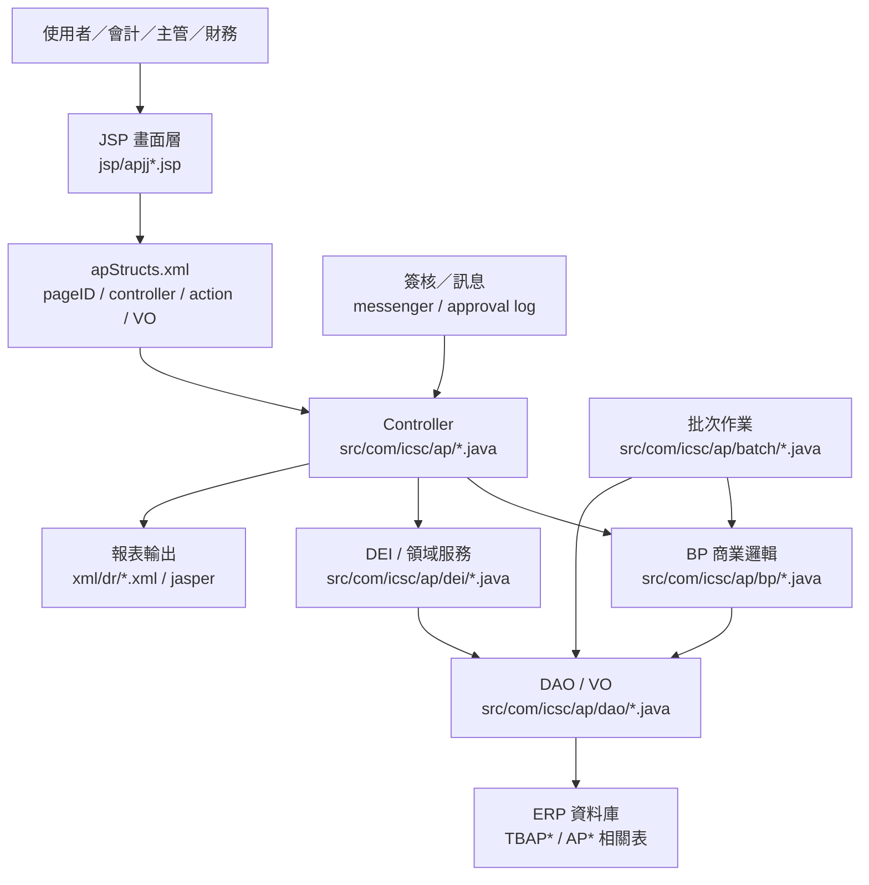

# AP 功能規格手冊

## 1. 系統概述

### 1.1 系統定位

`AP` 模組為 ERP 應付帳款與費用請付款管理系統，負責供應商／銀行／費用項目等基礎資料維護、請款單建立、發票與所得資料管理、付款批次處理、簽核與轉帳、關帳，以及相關報表輸出。系統主要服務會計、採購、請款單位、簽核主管及財務付款作業人員。

### 1.2 作業範圍

本模組依現有程式與設定可歸納為下列作業範圍：

| 類別 | 功能範圍 | 主要證據 |
|---|---|---|
| 共用主檔 | 公司參數、費用類別、會計科目、供應商、銀行帳號、付款條件等基礎資料維護 | `apjjyl01*`、`apjjyl0101`、`apjjyl0102`、`apjjyl01bk`、`apjjyl01ven` |
| 請款與付款 | 請款主檔與明細、付款確認、付款取消、批次付款、付款傳票處理 | `apjj0201_yl`、`apjjyl0211`、`apjjyl0221`、`apjjdoPay`、`apjcPayVchr` |
| 費用與發票 | 雜項費用、交際費、發票資料、費用分攤、所得扣繳、保險與暫付款處理 | `apjj0311_gt`、`apjjSundryExp*`、`apjjEnterTainExp`、`apjjInCome` |
| 簽核流程 | 預設簽核、主管簽核、會計審核、退回、拒絕、待辦與多筆簽核 | `apjjAccountAudit*`、`apjjPreAccountAudit*`、`apjjSundryExpMSign` |
| 關帳與轉拋 | 月結、年結、所得拋轉、會計傳票拋轉、取消拋轉 | `apjjInComeClose`、`apjjch0320YClose`、`apjjAddVouchers` |
| 預算控管 | 年度預算、預算複製、確認／反確認、預算使用查詢與下載 | `apjjyl0701`、`apjjyl0702`、`apjjyl0701P` |
| 報表查詢 | 請款、發票、付款、所得與預算相關報表 | `apjj0p*`、`xml/dr/apjr*.xml`、`xml/dr/apjryl*.xml` |

### 1.3 使用者角色

| 角色 | 主要職責 |
|---|---|
| 系統／會計主檔維護人員 | 維護公司參數、銀行、費用項目、供應商與付款相關基礎資料。 |
| 請款單位 | 建立請款資料、維護明細、發票、費用分攤與附件，送出簽核。 |
| 簽核主管 | 依簽核層級進行核准、退回或拒絕。 |
| 會計審核人員 | 檢核請款、發票、所得與傳票資料，執行審核與補件。 |
| 財務付款人員 | 進行付款批次確認、付款取消、傳票產生與付款相關查詢。 |
| 管理查詢人員 | 查詢報表、預算、關帳狀態與歷史資料。 |

### 1.4 系統資料來源

本手冊依據下列現有檔案整理：

| 類型 | 路徑／檔案 | 用途 |
|---|---|---|
| 頁面映射 | `config/yl/ap/apStructs.xml` | 定義 `pageID`、JSP、Controller、Action、VO 對照。 |
| 系統參數 | `config/yl/ap/apConfig.ini` | 模組設定與環境參數。 |
| 使用者介面 | `jsp/*.jsp` | 前端畫面、查詢頁、明細頁、彈窗與列印入口。 |
| 控制層 | `src/com/icsc/ap/*.java` | 接收頁面 Action，控制查詢、新增、修改、刪除、送簽、核准、退回等流程。 |
| 商業邏輯 | `src/com/icsc/ap/bp/*.java`、`src/com/icsc/ap/dei/*.java` | 付款、傳票、發票、所得、簽核、預算與外部介接規則。 |
| 資料存取 | `src/com/icsc/ap/dao/*.java`、`dao/*.dao` | 資料表 VO、DAO 與欄位定義。 |
| 批次作業 | `src/com/icsc/ap/batch/*.java` | 組織同步、月結、付款／票據訊息等排程處理。 |
| 報表定義 | `xml/dr/*.xml`、`*.jasper` | 請款、付款、所得、預算與明細報表格式。 |

## 2. 系統架構總覽

### 2.1 程式規模

依目前目錄盤點：

| 項目 | 數量 |
|---|---:|
| `apStructs.xml` 頁面映射 | 96 |
| JSP 檔案 | 約 383 |
| Java 檔案 | 約 394 |
| BP 商業邏輯檔 | 約 72 |
| DEI／介接與領域服務檔 | 約 44 |
| DAO／VO Java 檔 | 約 140 |
| `.dao` 定義檔 | 約 57 |
| 報表 XML | 約 22 |
| batch Java 檔 | 約 7 |

### 2.2 邏輯架構

### 2.3 分層說明

| 分層 | 主要元件 | 職責 |
|---|---|---|
| 畫面層 | `jsp/apjj*.jsp` | 呈現查詢、維護、簽核、付款、報表與彈窗畫面。 |
| 頁面映射層 | `config/yl/ap/apStructs.xml` | 將頁面按鈕或 `flag` 映射至 Controller method，並定義資料轉換 VO。 |
| 控制層 | `apjc*.java` | 處理使用者操作，呼叫 DAO、BP、DEI，控制導頁與訊息。 |
| 商業邏輯層 | `bp/apjc*.java` | 封裝請付款、發票、預算、簽核、傳票、付款規則等核心邏輯。 |
| 資料存取層 | `dao/apjc*.java`、`dao/*.dao` | 執行資料查詢與異動，管理 VO 與資料表欄位。 |
| 介接服務層 | `dei/apjc*.java`、`ch/*.java` | 處理傳票、所得、發票、銀行帳號檢核、外部系統或跨模組資料介接。 |
| 批次層 | `batch/apjc*.java` | 執行非即時排程，例如月結、組織同步、訊息通知與資料拋轉。 |
| 報表層 | `xml/dr/*.xml` | 定義列印與查詢報表版型。 |

### 2.4 主要資料物件

| 資料物件 | 說明 |
|---|---|
| `apjcyl0201VO` | 請款主檔資料，廣泛用於請款、付款、簽核、列印與預審。 |
| `apjcyl0202VO` | 請款明細資料，用於明細維護、付款傳票與審核。 |
| `apjcyl0311VO` | 雜項費用／費用申請主檔資料。 |
| `apjcyl0312VO` | 費用明細或請款費用資料。 |
| `apjcyl0313VO` | 費用分攤資料。 |
| `apjcyl0314VO` | 發票資料。 |
| `apjcyl0316VO` | 所得或保險相關資料。 |
| `apjcyl0331VO`、`apjcyl0341VO` | 不同公司別或流程版本的費用／請款主檔。 |
| `apjcApproLogVO` | 簽核歷程與審核紀錄。 |
| `apjcInComeVO` | 所得資料維護與關帳拋轉。 |
| `apjcInvoiceArchiveVO` | 發票歸檔與訊息通知。 |
| `apjcyl0701VO`、`apjcyl0702VO` | 預算資料與預算使用明細。 |

### 2.5 主要資料表

主要資料表依 DAO／VO 的 `Table Name` 與 `.dao` 定義整理如下；部分資料表名稱大小寫依現有程式保留。

| 資料表 | VO／DAO | 功能定位 | 主要用途 | 關聯功能 |
|---|---|---|---|---|
| `db.TBAPYL0000` | `apjcyl0000VO`／`apjcyl0000DAO` | 系統序號 | 維護公司別、資料期間、單據性質與流水號。 | 請款單號、批次單號產生 |
| `db.TBAPYL01RF` | `apjcyl01rfVO`／`apjcyl01rfDAO` | AP 參數主檔 | 維護模組參數、公司別設定與作業控制值。 | 共用主檔、請款檢核 |
| `db.tbapyl0101` | `apjcyl0101VO`／`apjcyl0101DAO` | 費用類別主檔 | 定義費用類別、主管、銀行、額度、借貸科目與狀態。 | 費用申請、請款、預算 |
| `db.tbapyl0102` | `apjcyl0102VO`／`apjcyl0102DAO` | 費用項目主檔 | 定義費用項目、稅別、借貸科目、扣繳、保險與付款條件。 | 請款明細、發票、傳票 |
| `db.tbapyl01bk` | `apjcyl01bkVO`／`apjcyl01bkDAO` | 銀行主檔 | 維護銀行代碼、帳號與付款使用資料。 | 付款、供應商、銀行帳號 |
| `db.tbgp10` | `apjcyl01VendorVO`／`apjcyl01VendorDAO` | 供應商基本資料 | 記錄供應商身分、付款對象與基本資料。 | 請款、付款、供應商維護 |
| `db.tbgp22` | `apjcyl01Vendor22VO`／`apjcyl01Vendor22DAO` | 供應商附屬資料 | 記錄供應商延伸欄位與公司別相關資料。 | 供應商維護、付款資料 |
| `db.tbap0103` | `apjc0103VO`／`apjc0103DAO` | 會計科目主檔 | 維護 AP 使用會計科目與狀態。 | 費用項目、傳票產生 |
| `db.tbap0104` | `apjc0104VO`／`apjc0104DAO` | 科目明細設定 | 維護會計科目與原因／明細設定。 | 傳票檢核、科目維護 |
| `db.tbapyl0201` | `apjcyl0201VO`／`apjcyl0201DAO` | 請款主檔 | 保存請款單主檔、付款對象、金額、狀態與流程資料。 | 請款維護、簽核、付款、列印 |
| `db.tbapyl0202` | `apjcyl0202VO`／`apjcyl0202DAO` | 請款明細 | 保存請款明細、費用項目、金額、發票與傳票依據。 | 請款明細、付款傳票、會計審核 |
| `db.tbapyl0202temp` | `apjcyl0202tempVO`／`apjcyl0202tempDAO` | 暫存請款明細 | 暫存補登、審核或批次選取用明細資料。 | 補登傳票、會計審核 |
| `db.tbapyl0203` | `apjcyl0203VO`／`apjcyl0203DAO` | 請款輔助資料 | 保存請款相關補充資料。 | 請款維護、付款流程 |
| `db.TBAPYL02B1` | `apjcyl02b1VO`／`apjcyl02b1DAO` | 付款條件主檔 | 維護付款條件、付款批次或付款規則主資料。 | 付款條件、請款付款 |
| `db.TBAPYL02B2` | `apjcyl02b2VO`／`apjcyl02b2DAO` | 付款條件明細 | 維護付款條件明細與相關設定。 | 付款條件、請款付款 |
| `db.tbapyl0302` | `apjcyl0302VO`／`apjcyl0302DAO` | 經辦／部門資料 | 維護經辦人、部門或費用作業歸屬資料。 | 費用申請、簽核路徑 |
| `db.tbapyl0303` | `apjcyl0303VO`／`apjcyl0303DAO` | 經辦輔助資料 | 保存費用或經辦作業的輔助設定。 | 費用維護、批次處理 |
| `db.tbapyl0311` | `apjcyl0311VO`／`apjcyl0311DAO` | 雜項費用主檔 | 保存雜項費用申請主檔與簽核狀態。 | 雜項費用、送簽、會計審核 |
| `db.tbapyl0312` | `apjcyl0312VO`／`apjcyl0312DAO` | 雜項費用明細 | 保存費用明細、稅額、金額與費用項目。 | 雜項費用明細、預算、傳票 |
| `db.tbapyl0313` | `apjcyl0313VO`／`apjcyl0313DAO` | 費用分攤 | 保存費用分攤對象、比例與金額。 | 分攤確認、會計審核 |
| `db.tbapyl0314` | `apjcyl0314VO`／`apjcyl0314DAO` | 發票資料 | 保存發票號碼、稅別、發票金額與進項稅資料。 | 發票確認、所得、審核 |
| `db.TBAPYL0315` | `apjcyl0315VO`／`apjcyl0315DAO` | 發票／所得輔助 | 保存與發票、所得或明細清除相關資料。 | 發票維護、資料重整 |
| `DB.TBAPYL0316` | `apjcyl0316VO`／`apjcyl0316DAO` | 所得／保險資料 | 保存扣繳、所得、保險或相關申報資料。 | 所得確認、所得月結 |
| `db.tbapInCome` | `apjcInComeVO`／`apjcInComeDAO` | 所得資料 | 維護所得資料、匯入檔案與拋轉狀態。 | 所得維護、所得月結、HA 拋轉 |
| `db.tbapEnterTainExp` | `apjcEnterTainExpVO`／`apjcEnterTainExpDAO` | 交際費資料 | 保存交際費申請或審核資料。 | 交際費、會計審核 |
| `db.tbapApproval` | `apjcApprovalVO`／`apjcApprovalDAO` | 簽核設定 | 保存簽核流程、關卡或核准人設定。 | 預設簽核、主管簽核 |
| `db.tbapApproLog` | `apjcApproLogVO`／`apjcApproLogDAO` | 簽核歷程 | 保存核准、送出、退回、拒絕等流程紀錄。 | 會計審核、多筆簽核、預審 |
| `db.tbapPreSetAppr` | `apjcPreSetApprVO`／`apjcPreSetApprDAO` | 預設簽核 | 保存請款或發票歸檔的預設簽核資料。 | 預審、發票歸檔、簽核流程 |
| `db.tbapinvoiceArchive` | `apjcInvoiceArchiveVO`／`apjcInvoiceArchiveDAO` | 發票歸檔 | 保存發票歸檔、列印與通知狀態。 | 發票歸檔、訊息通知 |
| `db.tbapMultiBankAcct` | `apjcMultiBankAcctVO`／`apjcMultiBankAcctDAO` | 多銀行帳號 | 保存付款對象多帳號資料。 | 付款、銀行帳號維護 |
| `db.TBAP0471` | `apjc0471VO`／`apjc0471DAO` | 付款安排主檔 | 保存付款安排、付款批次與付款對象資料。 | 付款批次、付款查詢 |
| `db.TBAP0472` | `apjc0472VO`／`apjc0472DAO` | 付款安排明細 | 保存付款安排明細、到期日、金額與帳號資料。 | 付款批次、付款傳票 |
| `db.TBAP0481` | `apjc0481VO`／`apjc0481DAO` | 票據／付款主檔 | 保存票據或付款作業主檔資料。 | 票據付款、付款查詢 |
| `db.TBAP0482` | `apjc0482VO`／`apjc0482DAO` | 票據／付款明細 | 保存票據或付款明細資料。 | 票據付款、付款傳票 |
| `db.TBAP0483` | `apjc0483VO`／`apjc0483DAO` | 付款輔助資料 | 保存付款相關輔助或查詢資料。 | 付款查詢、付款異動 |
| `db.TBAP04ADJ` | `apjc04adjVO`／`apjc04adjDAO` | 付款調整 | 保存付款調整、沖銷或異動資料。 | 付款調整、沖銷 |
| `db.tbap0400` | `apjc0400VO`／`apjc0400DAO` | 付款控制資料 | 保存付款控制或外部付款使用資料。 | 付款、票據、外部介接 |
| `db.tbapyl0401` | `apjcyl0401VO`／`apjcyl0401DAO` | 付款狀態資料 | 保存付款或票據狀態資料。 | 付款查詢、狀態追蹤 |
| `db.tbapyl0402` | `apjcyl0402VO`／`apjcyl0402DAO` | 付款明細狀態 | 保存付款明細、序號與狀態資料。 | 付款查詢、票據管理 |
| `db.tbapyl0320MASTER` | `apjcyl0320MasterVO`／`apjcyl0320MasterDAO` | 關帳主檔 | 保存月結／關帳主檔、期初期末與處理狀態。 | 月結、年結、關帳查詢 |
| `db.tbapyl0320DETAIL` | `apjcyl0320DetailVO`／`apjcyl0320DetailDAO` | 關帳明細 | 保存關帳明細、收入支出與狀態。 | 月結、關帳批次 |
| `db.tbapch0320yclose` | `apjcch0320YCloseVO`／`apjcch0320YCloseDAO` | 年結控制 | 保存年度關帳、復原與處理狀態。 | 年結、關帳復原 |
| `DB.TBAPYL0321` | `apjcyl0321VO`／`apjcyl0321DAO` | 應付作業主檔 | 保存應付或轉帳作業主檔資料。 | 應付處理、轉帳作業 |
| `DB.TBAPYL0322` | `apjcyl0322VO`／`apjcyl0322DAO` | 應付明細 | 保存應付作業明細資料。 | 應付處理、明細維護 |
| `DB.TBAPYL0323` | `apjcyl0323VO`／`apjcyl0323DAO` | 應付關聯資料 | 保存應付流程關聯資料。 | 應付處理、明細維護 |
| `DB.TBAPYL0324` | `apjcyl0324VO`／`apjcyl0324DAO` | 應付分攤資料 | 保存應付分攤或費用關聯明細。 | 應付處理、分攤 |
| `DB.TBAPYL0325` | `apjcyl0325VO`／`apjcyl0325DAO` | 應付發票資料 | 保存應付流程中的發票資料。 | 應付處理、發票 |
| `DB.TBAPYL0326` | `apjcyl0326VO`／`apjcyl0326DAO` | 應付所得資料 | 保存應付流程中的所得或扣繳資料。 | 應付處理、所得 |
| `db.TBAPYL0331` | `apjcyl0331VO`／`apjcyl0331DAO` | 其他請款主檔 | 保存其他請款或新版請款主檔資料。 | 其他請款、簽核、付款 |
| `db.TBAPYL0332` | `apjcyl0332VO`／`apjcyl0332DAO` | 其他請款明細 | 保存其他請款明細資料。 | 其他請款、明細 |
| `db.TBAPYL0333` | `apjcyl0333VO`／`apjcyl0333DAO` | 袋號／批次資料 | 保存袋號、批次或付款彙總資料。 | 袋號維護、批次付款 |
| `db.tbapyl0341` | `apjcyl0341VO`／`apjcyl0341DAO` | 付款主檔 | 保存付款主檔、付款對象與狀態。 | 付款、沖銷、簽核 |
| `db.tbapyl0342` | `apjcyl0342VO`／`apjcyl0342DAO` | 付款明細 | 保存付款明細資料。 | 付款、明細維護 |
| `db.tbapyl0343` | `apjcyl0343VO`／`apjcyl0343DAO` | 付款／沖銷資料 | 保存付款、沖銷或清帳資料。 | 付款沖銷、會計審核 |
| `db.TBAPYL0344` | `apjcyl0344VO`／`apjcyl0344DAO` | 付款發票明細 | 保存付款流程中的發票或稅額資料。 | 付款、發票、預算 |
| `db.tbapyl0345` | `apjcyl0345VO`／`apjcyl0345DAO` | 付款審核資料 | 保存付款審核、取消或補登作業資料。 | 付款審核、取消付款 |
| `db.TBAPYL0346` | `apjcyl0346VO`／`apjcyl0346DAO` | 付款取消資料 | 保存付款取消或退回資料。 | 取消付款、付款查詢 |
| `db.tbapyl0601` | `apjcyl0601VO`／`apjcyl0601DAO` | 傳票主檔 | 保存傳票號碼、日期、類別、總額與處理人員。 | 傳票產生、會計拋轉 |
| `db.tbapyl0602` | `apjcyl0602VO`／`apjcyl0602DAO` | 傳票明細 | 保存借貸別、科目、對象、金額、匯率與到期日。 | 傳票明細、付款傳票 |
| `db.tbapdw01` | `apjcdw01VO`／`apjcdw01DAO` | 工作流／拋轉資料 | 保存 AP 工作流或資料拋轉輔助資料。 | 簽核、資料拋轉 |
| `db.tbaphax2` | `apjchax2VO`／`apjchax2DAO` | HA 介接資料 | 保存與 HA 系統拋轉或回寫相關資料。 | 所得拋轉、HA 介接 |
| `db.tbapyl0701` | `apjcyl0701VO`／`apjcyl0701DAO` | 年度預算主檔 | 保存年度、群組、費用類別、項目與預算金額。 | 預算維護、確認／反確認 |
| `db.tbapyl0702` | `apjcyl0702VO`／`apjcyl0702DAO` | 預算使用明細 | 保存單據與預算項目的使用關聯。 | 預算查詢、請款控管 |
| `DB.TBAPPROFIT01` | `apjcProfit01VO`／`apjcProfit01DAO` | 利潤資料 | 保存利潤估算、利潤拋轉或分析資料。 | 利潤估算、管理報表 |

### 2.6 主要流程

## 3. 功能模組詳細說明

### 3.1 共用主檔與參數維護

此功能群組提供 AP 模組運作所需的基礎資料。主要包含公司參數、費用項目、付款方式、銀行與供應商資料，供請款、付款、簽核及報表流程共用。

| 功能 | 主要頁面 | Controller | 主要動作 |
|---|---|---|---|
| AP 參數維護 | `apjjyl01.jsp`、`apjjyl01rf.jsp` | `apjcyl01rf` | 查詢、新增、修改、刪除、重整 |
| 供應商資料維護 | `apjjyl01ven.jsp` | `apjcyl01Vendor` | 查詢、新增、修改、刪除、鎖定、解鎖 |
| 銀行資料維護 | `apjjyl01bk.jsp` | `apjcyl01bk` | 查詢、新增、修改、刪除 |
| 類別／項目資料 | `apjjyl0101.jsp`、`apjjyl0102.jsp` | `apjcyl0101`、`apjcyl0102` | 查詢、新增、修改、刪除 |
| 付款條件／補助設定 | `apjjyl02b1Master.jsp`、`apjjyl02b2M.jsp` | `apjcyl02b1`、`apjcyl02b2` | 查詢、新增、修改、關閉、刪除 |

### 3.2 請款單建立與維護

請款單以主檔 `apjcyl0201VO` 搭配明細 `apjcyl0202VO` 為核心。使用者可建立請款主檔、維護請款明細、查詢前後筆資料、作廢、取消作廢、結案與取消結案。

| 功能 | 主要頁面 | Controller | 主要動作 |
|---|---|---|---|
| 請款主檔維護 | `apjj0201_yl.jsp` | `apjc0201_yl` | 查詢、新增、修改、刪除、確認、取消、前後筆查詢、結案、作廢 |
| 請款明細維護 | `apjjyl0202.jsp` | `apjcyl0202` | 查詢、刪除、新增列、刪除列、重新整理 |
| 請款資料描述查詢 | `apjjyl0201M.jsp` | `apjcyl0201` | 請款主檔描述查詢 |
| 請款列印／查詢 | `apjjyl0p01Master.jsp`、`apjj0p01_*.jsp` | `apjcyl0p01` | 查詢、列印、修改、刪除 |

### 3.3 雜項費用與交際費作業

雜項費用以 `apjjSundryExp*` 系列頁面拆分主檔、明細、發票、分攤與所得資料；交際費另由 `apjjEnterTainExp.jsp` 處理。此群組支援新增、複製、清除、預設簽核、核准、送出、退回與取消。

| 功能 | 主要頁面 | Controller | 主要動作 |
|---|---|---|---|
| 雜項費用主檔 | `apjjSundryExp01.jsp` | `apjcSundryExp01` | 查詢、列印、新增、複製、修改、清除、取消、送簽、核准、退回 |
| 雜項費用明細 | `apjjSundryExp02.jsp` | `apjcSundryExp02` | 查詢、重新產生明細 |
| 發票資料 | `apjjSundryExp03.jsp` | `apjcSundryExp03` | 查詢、確認 |
| 費用分攤 | `apjjSundryExp04.jsp` | `apjcSundryExp04` | 查詢、確認 |
| 所得／保險資料 | `apjjSundryExp05.jsp` | `apjcSundryExp05` | 查詢、清單查詢、確認 |
| 交際費 | `apjjEnterTainExp.jsp` | `apjcEnterTainExp` | 查詢、確認、轉入審核畫面 |

### 3.4 發票、所得與歸檔管理

此功能群組處理發票資料維護、所得匯入、所得月結，以及發票歸檔與通知。所得月結可拋轉至 HA 或取消拋轉；發票歸檔可列印與送出訊息。

| 功能 | 主要頁面 | Controller | 主要動作 |
|---|---|---|---|
| 所得資料維護 | `apjjInCome.jsp` | `apjcInCome` | 查詢、修改、刪除、檔案匯入 |
| 所得月結 | `apjjInComeCloseList.jsp` | `apjcInComeClose` | 查詢、月結、拋轉 HA、取消拋轉 HA |
| 發票歸檔 | `apjjInvoiceArchive01.jsp` | `apjcInvoiceArchive` | 查詢、修改、取消、列印、發送訊息 |
| 預設簽核設定 | `apjjPreSetAppr.jsp` | `apjcInvoiceArchive` | 查詢、修改 |

### 3.5 簽核與會計審核

簽核流程包含預審、會計審核、主管核准、多筆簽核、退回與拒絕。`apjcApproLogVO` 保存流程紀錄，`apjcAccountAudit*` 與 `apjcPreAccountAudit*` 處理不同審核階段。

| 功能 | 主要頁面 | Controller | 主要動作 |
|---|---|---|---|
| 會計審核主檔 | `apjjAccountAudit01.jsp` | `apjcAccountAudit01` | 查詢、下一關、修改、附件更新、列印、預設簽核、核准、送出、取消送出、退回、拒絕 |
| 會計審核明細 | `apjjAccountAudit02.jsp` | `apjcAccountAudit02` | 查詢、修改 |
| 發票／分攤審核 | `apjjAccountAudit03.jsp` | `apjcAccountAudit03` | 查詢、修改 |
| 審核明細查詢 | `apjjAccountAudit05.jsp` | `apjcAccountAudit05` | 查詢 |
| 多筆簽核 | `apjjAccountAuditMSign01.jsp` | `apjcAccountAuditMSign` | 查詢、核准、送出、退回 |
| 待辦維護 | `apjjAccountAuditToDo01.jsp` | `apjcAccountAuditToDo` | 查詢、修改 |
| 預審作業 | `apjjPreAccountAudit01.jsp` | `apjcPreAccountAudit01` | 查詢、下一關、修改、附件更新、預設簽核、核准、送出、退回 |
| 雜項費用多筆簽核 | `apjjSundryExpMSign01.jsp` | `apjcSundryExpMSign` | 查詢、下一筆、核准、送出、退回 |

### 3.6 付款、票據與傳票處理

付款作業處理請款資料付款確認、取消付款、付款傳票產生與補登。BP 與 DEI 層可見 `apjcPayVchr`、`apjcTransVchr`、`apjcPayRule`、`apjcBillHandler` 等付款與傳票相關服務。

| 功能 | 主要頁面 | Controller | 主要動作 |
|---|---|---|---|
| 請款付款確認 | `apjjyl0211.jsp` | `apjcyl0211` | 查詢、付款確認、取消 |
| 付款明細查詢 | `apjjyl0212.jsp` | `apjcyl0202` | 查詢 |
| 請款付款更新 | `apjjyl0213.jsp` | `apjcyl0213` | 查詢、修改 |
| 付款作業 | `apjjyl0221.jsp` | `apjcyl0221` | 查詢、付款 |
| 付款傳票 | `apjjdoPay.jsp` | `apjcyl0221` | 產生傳票 |
| 補登傳票 | `apjjAddVouchersList.jsp` | `apjcAddVouchers` | 查詢、拋轉 AA、取消拋轉 AA |
| 銀行帳號 | `apjjMultiBankAcct.jsp` | `apjcMultiBankAcct` | 查詢、修改 |

### 3.7 費用、暫付與應付關聯作業

此群組涵蓋費用請款、發票明細、袋號／付款袋資料、應付帳款資料與沖銷等作業。程式命名上集中於 `031*`、`033*`、`034*`、`047*`。

| 功能 | 主要頁面 | Controller | 主要動作 |
|---|---|---|---|
| 費用申請主檔 | `apjj0311_gt.jsp`、`apjj0331.jsp` | `apjc0311_gt`、`apjc0331` | 查詢、新增、修改、刪除、送出、退回、複製、列印 |
| 費用明細重整 | `apjj0312_gt.jsp`、`apjj0332.jsp` | `apjc0312_gt`、`apjc0332` | 查詢、重新產生 |
| 發票／分攤確認 | `apjj0313_icsc.jsp`、`apjj0314_icsc.jsp` | `apjc0313_icsc`、`apjc0314_icsc` | 查詢、確認 |
| 請款確認與反確認 | `apjjyl0331_4E.jsp` | `apjcyl0331` | 查詢、新增、修改、刪除、預設簽核、確認、反確認、核准、退回 |
| 付款資料 | `apjjyl0341.jsp`、`apjjyl0342.jsp`、`apjjyl0343.jsp` | `apjcyl0341`、`apjcyl0342`、`apjcyl0343` | 查詢、新增、修改、刪除、核准、退回 |
| 付款沖銷 | `apjj0343Pay.jsp`、`apjjyl0343Pay.jsp` | `apjcyl0343Pay` | 查詢、沖銷、新增、檢核 |
| 袋號／批次資料 | `apjjyl0333Master.jsp`、`apjjyl0333Pocket.jsp` | `apjcyl0333`、`apjcyl0333Pocket` | 查詢、新增、修改、刪除、進階查詢、袋號更新 |
| 付款安排 | `apjj0471m.jsp`、`apjj0472.jsp` | `apjc0471`、`apjc0472` | 查詢、新增、修改、刪除 |

### 3.8 預算控管

預算功能用於年度預算資料建立、複製、確認、反確認、查詢與下載。主要資料物件為 `apjcyl0701VO` 與 `apjcyl0702VO`。

| 功能 | 主要頁面 | Controller | 主要動作 |
|---|---|---|---|
| 年度預算維護 | `apjjyl0701.jsp` | `apjcyl0701` | 查詢、刪除、修改、搜尋、複製、匯入查詢、新增、確認、反確認 |
| 預算使用查詢 | `apjjyl0702.jsp` | `apjcyl0702` | 查詢 |
| 預算報表下載 | `apjjyl0701P.jsp` | `apjcyl0701P` | 查詢、下載 1、下載 2、下載 3 |

### 3.9 關帳與批次作業

系統提供月結、年結、組織同步與訊息通知批次。批次程式位於 `src/com/icsc/ap/batch`。

| 批次／功能 | 程式 | 說明 |
|---|---|---|
| 月結批次 | `apjcMCloseBatch.java` | 處理 AP 月結相關作業。 |
| 年結／關帳 | `apjcch0320Batch.java`、`apjcch0320YClose.java` | 執行年度關帳、查詢關帳狀態與復原。 |
| 組織同步 | `apjcOrgBatch.java` | 同步或整理組織相關資料。 |
| 付款／票據訊息 | `apjcAddBillMsg.java`、`apjcFactFundMsg.java` | 產生補登、票據或資金相關通知。 |
| 非工作日處理 | `apjcNonWork.java` | 處理非工作日相關邏輯。 |
| 費用批次 | `apjc0303Batch.java` | 處理指定費用資料批次作業。 |

### 3.10 報表與列印

報表定義集中於 `xml/dr`，搭配 `apjj0p*` 查詢列印頁面。常見報表包含請款單、付款明細、發票資料、所得資料、預算資料與關帳報表。

| 報表類型 | 主要檔案 |
|---|---|
| 請款／付款報表 | `apjr0p01.xml`、`apjr0p01New.xml`、`apjr0p06.xml` |
| 發票與費用明細 | `apjr0333Detail.xml`、`apjr0333hdDetail.xml` |
| 關帳／所得報表 | `apch0320.xml`、`apch0320P.xml`、`apjryl0320.xml` |
| 預算報表 | `apjryl0700_1.xml`、`apjryl0700_2.xml`、`apjryl0700_3.xml` |
| 子報表 | `apjryl0322sub.xml`、`apjryl0323sub.xml`、`apjryl0324sub.xml`、`apjryl0325sub.xml`、`apjryl0326sub.xml` |

### 3.11 例外、共用工具與自訂標籤

| 類別 | 主要元件 | 說明 |
|---|---|---|
| 共用工具 | `util/apjctool.java`、`apjcsql.java`、`apjcFileUtil.java`、`apjcDSUtil.java` | 提供 SQL、檔案、資料來源與畫面輔助功能。 |
| 例外處理 | `exception/apjc*.java` | 定義請款、發票、參數、更新與狀態錯誤。 |
| 自訂標籤 | `tag/apjcSelect*.java`、`apjcRemoteTopApprove*.java` | 提供付款人、付款方式、幣別、發票類別與遠端簽核等畫面元件。 |
| 訊息 | `messenger/apjcAPPSign_PreAccountAudit.java` | 處理預審簽核相關訊息。 |

### 3.12 功能群組與頁面數

依 `apStructs.xml` 頁面映射粗分：

| 功能群組 | 映射數 |
|---|---:|
| 共用主檔 | 7 |
| 請款付款簽核 | 34 |
| 費用發票轉帳 | 46 |
| 銀行票據付款 | 2 |
| 預算控管 | 3 |
| 其他查詢輔助 | 4 |

### 3.13 維運注意事項

1. `apStructs.xml` 是追流程的第一入口，但目前檔案含有不合法 XML 註解，標準 XML Parser 可能無法直接載入；查核時建議以寬容方式擷取 page 區塊，或先清理註解後再解析。
2. JSP、Controller、VO 命名多採相同功能代碼，例如 `apjjyl0331` 對應 `apjcyl0331` 與 `apjcyl0331VO`；若遇到多公司別版本，需再比對 JSP 後綴，例如 `_gt`、`_yl`、`_icsc`、`_csac`。
3. 簽核與付款牽涉 `apjcApproLogVO`、付款傳票、所得、發票與主檔狀態，修改時需同時確認主檔、明細、簽核紀錄與拋轉狀態。
4. 報表、批次與 DEI 服務不是單純附屬程式，會影響關帳、傳票、所得拋轉與外部資料一致性；異動時應納入測試範圍。
