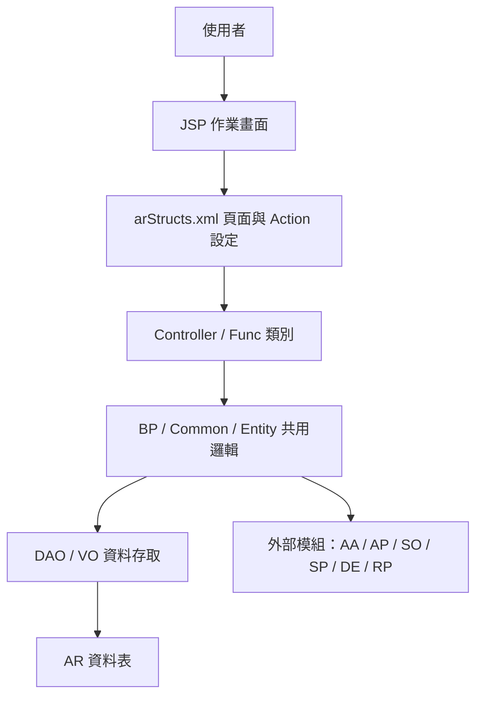
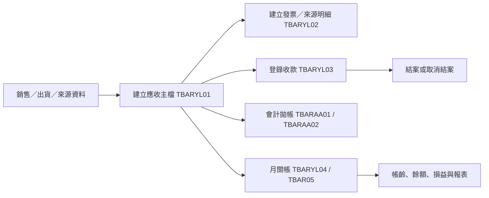

# AR 應收帳款系統功能規格手冊

文件日期：2026-08-19

## 1. 系統概述

### 1.1 系統定位

AR 應收帳款系統負責管理公司銷售後形成之應收帳款資料，涵蓋應收立帳、出貨與發票明細、收款登錄、結案、月關帳、帳齡／餘額彙總、會計傳票拋轉、報表查詢與參數代碼維護。系統以公司別、應收帳款編號、客戶、幣別與資料期間為主要管理維度，支援新台幣與外幣金額並行記錄。

本系統同時與銷售、出貨、會計、應付帳款、代碼資料與人事資料等模組互動。主要業務目標是確保應收帳款來源、收款沖帳、月關結帳與會計傳票資料可以被追蹤、查核與後續報表分析。

### 1.2 使用對象

| 角色 | 主要使用情境 |
| --- | --- |
| 應收帳款承辦人員 | 建立／查詢應收資料、登錄收款、結案、調整收款資料。 |
| 財務或會計人員 | 執行會計拋帳、檢核傳票、查詢帳齡與餘額資料。 |
| 主管或覆核人員 | 檢視月關帳、解除月關、確認帳務狀態與例外資料。 |
| 系統維護人員 | 維護折讓／調整原因與會計分錄代碼設定。 |

### 1.3 主要功能範圍

1. 應收帳款主檔與來源明細管理。
2. 收款資料登錄、沖帳、結案與取消結案。
3. 收款資料轉出與月底收款調整。
4. 會計拋帳與傳票資料產生。
5. 月關帳、解除月關與結帳取消。
6. 帳齡、客戶餘額、匯兌損益與未實現損益處理。
7. 應收帳款相關報表輸出。
8. 折讓原因與會計科目設定維護。

### 1.4 主要資料表

| 資料表 | VO／DAO | 功能定位 | 主要用途 | 關聯功能 |
| --- | --- | --- | --- | --- |
| `TBARYL01` | `arjcyl01VO`／`arjcyl01DAO` | 應收帳款主檔 | 記錄公司別、應收帳款編號、客戶、資料類別、原幣／本幣金額、已收金額、安排金額與狀態。 | 應收立帳、收款沖帳、結案／取消、轉出、拋帳、月關帳、報表。 |
| `TBARYL02` | `arjcyl02VO`／`arjcyl02DAO` | 應收來源／發票明細 | 記錄營業收入單號、發票號碼、出貨日期、傳票日期、出貨數量、幣別、原幣／本幣金額與狀態。 | 應收來源查詢、發票／出貨明細、收款調整、傳票產生、帳齡計算。 |
| `TBARYL03` | `arjcyl03VO`／`arjcyl03DAO` | 收款明細 | 記錄收款編號、收款類型、收款日期、到期日、用途別、幣別、收款金額、安排金額、傳票號碼與狀態。 | 收款登錄、結案／取消、月底收款調整、月關帳、帳齡與餘額報表。 |
| `TBARYL03TEMP` | `arjcyl03TempVO`／`arjcyl03TempDAO` | 收款月關暫存資料 | 暫存月關處理期間的應收帳款、客戶、原幣／本幣金額與狀態，用於月關計算中間結果。 | 收款月關、月關資料轉正式、損益與餘額計算。 |
| `TBARYL04` | `arjcyl04VO`／`arjcyl04DAO` | 月關帳彙總資料 | 依公司別與資料期間記錄期初、本期增加、本期收款、期末、處理人員、處理日期與狀態。 | 月關帳、解除月關、結帳取消、期末餘額查詢。 |
| `TBAR04` | `arjc04VO`／`arjc04DAO` | 月關控制／傳票彙總資料 | 記錄資料期間、起迄日期、匯兌損益／估列／調整傳票號碼、處理人員、處理日期與關帳狀態。 | 月關帳批次、解除月關、會計傳票檢核、損益處理。 |
| `TBAR05` | `arjc05VO`／`arjc05DAO` | 帳齡／客戶餘額資料 | 依資料期間、客戶、會計科目與幣別記錄期初、本期、期末、未到期、逾期及多段帳齡金額。 | 帳齡分析、客戶餘額、逾期金額、月關報表。 |
| `TBAR051` | `arjc051VO`／`arjc051DAO` | 帳齡明細資料 | 依收入單號與序號保存帳齡天數、帳齡區間、未到期與逾期金額明細。 | 月關帳齡展開、報表明細、客戶對帳。 |
| `TBARAA01` | `arjcaa01VO`／`arjcaa01DAO` | AR 會計傳票主檔 | 記錄傳票號碼、傳票日期、傳票類別、摘要、總筆數、總數量、總金額、來源作業與處理人員。 | 會計拋帳、傳票查詢、月關檢核、應收／收款傳票追蹤。 |
| `TBARAA02` | `arjcaa02VO`／`arjcaa02DAO` | AR 會計傳票明細 | 記錄借貸別、會計科目、識別碼、參考號、幣別、原幣金額、本幣金額、到期日與摘要。 | 分錄產生、折讓／調整拋帳、會計核對、傳票明細報表。 |
| `TBARYL06` | `arjcyl06VO`／`arjcyl06DAO` | 月底收款調整記錄 | 保存公司別、資料期間、處理選項、傳票日期、傳票號碼、處理人員、處理日期、備註與狀態。 | 月底收款調整、收款月關、傳票回寫、調整查詢。 |
| `TBARYL0701` | `arjcyl0701VO`／`arjcyl0701DAO` | 應收序號控制 | 依公司別、資料類別與應收帳款編號保存已使用序號，提供下一序號取得與更新。 | 應收立帳、來源明細、收款編號／序號控管。 |
| `TBARYLSS06` | `arjcylss06VO`／`arjcylss06DAO` | 折讓／調整原因主檔 | 保存公司別、原因代碼、原因說明、異動人員、異動日期與狀態。 | 折讓原因維護、收款調整、會計科目設定、傳票拋帳。 |
| `TBARSSYL07` | `arjcssyl07VO`／`arjcssyl07DAO` | 折讓原因會計科目設定 | 保存原因代碼對應之借貸別、會計科目、帳號、合約號、到期設定、比例與是否收回。 | 折讓分錄設定、月底調整、收款轉出、會計傳票產生。 |
| `TBAR01TMP` | `arjc01TmpVO`／`arjc01TmpDAO` | 逾期客戶暫存資料 | 暫存公司別、應收帳款編號、客戶、出貨日期、逾期天數與逾期金額。 | 逾期客戶通知、催收資料產生、例行批次查詢。 |

## 2. 系統架構總覽

### 2.1 程式分層

本系統採用 JSP、Controller、Business Process／Function、DAO／VO 與資料表的典型 ERP 分層。

### 2.2 主要目錄與責任

| 路徑 | 說明 |
| --- | --- |
| `config/yl/ar/arStructs.xml` | 定義頁面 `pageID`、JSP 路徑、Controller、Action、驗證方法與 VO 對應。 |
| `jsp/` | 使用者操作畫面，包含應收、收款、月關、報表與代碼維護頁面。 |
| `src/com/icsc/ar/` | 應收帳款 Controller、批次、共用邏輯、傳票與報表處理類別。 |
| `src/com/icsc/ar/dao/` | DAO 與 VO，負責應收帳款資料表查詢、建立、修改與刪除。 |
| `dao/`、`dao/sql/` | DAO 設定與資料表 DDL。 |
| `javadoc/` | 既有 JavaDoc 說明，輔助辨識類別用途與方法。 |

### 2.3 頁面、Controller 與 Action 對應

| 作業代號 | JSP | Controller | 主要 Action |
| --- | --- | --- | --- |
| `arjjyl011` | `arjjyl011.jsp` | `arjcyl011` | 查詢、結案、取消。 |
| `arjjyl012` | `arjjyl012.jsp` | `arjcyl012` | 查詢。 |
| `arjjyl013` | `arjjyl013.jsp` | `arjcyl013` | 查詢。 |
| `arjjyl014` | `arjjyl014.jsp` | `arjcyl014` | 查詢、轉出確認。 |
| `arjjyl015` | `arjjyl015.jsp` | `arjcyl015` | 查詢、會計拋帳。 |
| `arjjyl016` | `arjjyl016.jsp` | `arjcyl016` | 查詢、月底收款調整、調整金額。 |
| `arjj04m` | `arjj04m.jsp` | `arjc04CR` | 查詢、月關、解除月關。 |
| `arjjyl021` | `arjjyl021.jsp` | `arjcyl021` | 查詢、月關、解除月關。 |
| `arjjyl022` | `arjjyl022.jsp` | `arjcyl022` | 查詢。 |
| `arjjyl03m` | `arjjyl03m.jsp` | `arjcyl03CR` | 查詢、收款資料更新。 |
| `arjjyl06Main` | `arjjyl06Main.jsp` | `arjcyl06Func` | 收款月關。 |
| `arjjyl30Main` | `arjjyl30Main.jsp` | `arjcyl30Func` | 結帳取消、取消回復。 |
| `arjjyl0pMain` | `arjjyl0pMain.jsp` | `arjcyl0pMain` | 報表查詢入口。 |
| `arjjyl0pSearch1` | `arjjyl0pSearch1.jsp` | `arjcyl0p03` | 報表輸出 `P03`。 |
| `arjjyl0pSearch2` | `arjjyl0pSearch2.jsp` | `arjcyl0p04` | 報表輸出 `P04`。 |
| `arjjyl0pSearch3` | `arjjyl0pSearch3.jsp` | `arjcyl0p05` | 報表輸出 `P05`。 |
| `arjjyl0pSearch6` | `arjjyl0pSearch6.jsp` | `arjcyl0p06Func` | 報表輸出 `P06`。 |
| `arjjyl0pSearch7` | `arjjyl0pSearch7.jsp` | `arjcyl0p07Func` | 報表輸出 `P07`。 |
| `arjjylss06m` | `arjjylss06m.jsp` | `arjcylss06Func` | 查詢、新增、修改、刪除。 |
| `arjjylss07` | `arjjylss07.jsp` | `arjcylss07Func` | 欄位查詢、新增、修改、刪除。 |

### 2.4 主要處理流程

### 2.5 外部模組關聯

| 外部模組 | 關聯用途 |
| --- | --- |
| `AA` 會計模組 | 產生、查詢或檢核傳票資料，並處理已月關傳票狀態。 |
| `AP` 應付模組 | 用於特定折讓、轉應付或付款相關資料檢核與拋轉。 |
| `SO` 訂單模組 | 查詢訂單或銷貨相關資料，支援應收來源判斷。 |
| `SP` 出貨模組 | 取用出貨、運費與發票相關資料。 |
| `DE` 基本資料 | 取得代碼表、公司別、幣別、員工、客戶等基礎資料。 |
| `RP` 報表／通知 | 支援逾期客戶通知與報表輸出。 |

## 3. 功能模組詳細說明

### 3.1 應收帳款主檔管理

**對應程式**：`arjcyl01`、`arjcyl011`、`arjcyl012`、`arjcyl013`、`arjcyl0701`  
**主要頁面**：`arjjyl01*`、`arjjyl011.jsp`、`arjjyl012.jsp`、`arjjyl013.jsp`  
**主要資料表**：`TBARYL01`、`TBARYL02`、`TBARYL03`、`TBARYL0701`

本模組負責建立與維護應收帳款基本資料。主檔以公司別、應收帳款編號、客戶與資料類別識別帳款來源，記錄原幣金額、本幣金額、已收金額、已安排金額與狀態。序號由 `TBARYL0701` 控管，避免同一公司別與資料類別下的應收帳款編號或明細序號重複。

主要功能包含：

1. 建立應收帳款主檔與基礎驗證。
2. 建立應收來源明細與收款明細。
3. 查詢應收帳款、發票／收入資料與收款狀態。
4. 依收款或結案結果回寫主檔狀態與已收金額。
5. 支援資料刪除註記與狀態控管。

### 3.2 收款登錄、結案與取消

**對應程式**：`arjcyl011`、`arjcyl011Bp`、`arjcyl03CR`、`arjcCommon`  
**主要頁面**：`arjjyl011.jsp`、`arjjyl03m.jsp`  
**主要資料表**：`TBARYL01`、`TBARYL03`

本模組處理客戶收款資料登錄、收款編號取得、收款明細建立與結案處理。收款資料以收款編號、收款類型、收款日期、到期日、用途別、幣別與金額記錄於 `TBARYL03`，並依收款結果更新 `TBARYL01` 的已收金額、安排金額與狀態。

主要功能包含：

1. 查詢待收或已收應收帳款。
2. 建立收款資料與收款明細。
3. 結案時檢核收款資料、傳票資料與主檔餘額。
4. 取消結案時回復相關狀態與金額。
5. 限制已月關或已拋帳資料不得任意異動。

### 3.3 收款資料轉出與月底調整

**對應程式**：`arjcyl014`、`arjcyl016`、`arjcyl016Bp`  
**主要頁面**：`arjjyl014.jsp`、`arjjyl016.jsp`  
**主要資料表**：`TBARYL01`、`TBARYL02`、`TBARYL03`、`TBARYL06`

本模組處理收款資料轉出與月底收款調整作業。轉出作業會依應收主檔、收款明細、訂單／出貨資料與外部模組資料進行檢核。月底調整則記錄調整選項、傳票日期、傳票號碼、處理人員、處理日期與備註，作為月底帳務修正與後續追蹤依據。

主要功能包含：

1. 查詢可轉出或需調整之應收／收款資料。
2. 執行轉出確認並更新對應狀態。
3. 建立月底收款調整記錄。
4. 依折讓或調整原因代碼產生借貸資料。
5. 檢核已月關、已傳票或資料狀態不符之異動限制。

### 3.4 會計拋帳與傳票處理

**對應程式**：`arjcyl015`、`arjcyl015AP`、`arjcyl016Bp`、`arjcCommon`、`arjcAaEntity`、`arjcApEntity`  
**主要頁面**：`arjjyl015.jsp`  
**主要資料表**：`TBARAA01`、`TBARAA02`、`TBARYL01`、`TBARYL02`、`TBARYL03`

本模組將應收帳款、收款、折讓或調整資料轉為會計傳票。傳票主檔 `TBARAA01` 保存傳票號碼、日期、類別、摘要、總筆數與總金額；傳票明細 `TBARAA02` 保存借貸別、會計科目、參考號、幣別、原幣金額、本幣金額與到期日。

主要功能包含：

1. 查詢可拋帳之公司別與應收帳款編號。
2. 依交易型態產生借方與貸方分錄。
3. 取得折讓原因與會計科目設定。
4. 支援應付或付款相關拋轉情境。
5. 回寫應收或收款資料的傳票號碼、傳票日期與狀態。

### 3.5 月關帳、解除月關與結帳取消

**對應程式**：`arjc04CR`、`arjc04CRBatch`、`arjcyl021`、`arjcyl06Func`、`arjcyl06Bp`、`arjcyl30Func`  
**主要頁面**：`arjj04m.jsp`、`arjjyl021.jsp`、`arjjyl06Main.jsp`、`arjjyl30Main.jsp`  
**主要資料表**：`TBARYL04`、`TBAR04`、`TBAR05`、`TBARYL01`、`TBARYL02`、`TBARYL03`、`TBARYL06`

本模組負責依資料期間進行月關帳，彙總期初、本期增加、本期收款與期末金額，並產生帳齡與客戶餘額資料。解除月關可針對已關帳期間進行控管式回復；結帳取消則用於回復已結帳資料狀態。

主要功能包含：

1. 查詢指定公司別與資料期間之關帳狀態。
2. 執行月關帳，產生或更新月關彙總與帳齡資料。
3. 建立 `TBAR05` 客戶幣別餘額與帳齡資料。
4. 檢核會計傳票是否已月關，避免帳務不一致。
5. 執行解除月關或結帳取消時回復相關應收、收款與彙總狀態。

### 3.6 帳齡、客戶餘額與損益處理

**對應程式**：`arjc04CRBatch`、`arjcylProfit`、`arjcyl0pProfitBp`、`arjcylBalanceBp`  
**主要資料表**：`TBAR05`、`TBARYL04`、`TBARYL01`、`TBARYL02`、`TBARYL03`

本模組在月關或報表處理時，依客戶、幣別、應收帳款與收入明細計算帳齡與餘額。系統記錄期初、本期增加、本期收款、期末、未到期、逾期及多段帳齡金額，同時支援匯率差異、未實現損益與已實現損益處理。

主要功能包含：

1. 計算客戶應收餘額與各帳齡區間金額。
2. 依幣別保存原幣與本幣資料。
3. 依收款日期、到期日與出貨／發票日期判斷帳齡。
4. 處理匯率差異與損益資料。
5. 提供報表與後續會計處理資料來源。

### 3.7 報表查詢與輸出

**對應程式**：`arjcyl0pMain`、`arjcyl0p03`、`arjcyl0p04`、`arjcyl0p05`、`arjcyl0p06Func`、`arjcyl0p06Bp`、`arjcyl0p07Func`  
**主要頁面**：`arjjyl0pMain.jsp`、`arjjyl0pSearch1.jsp`、`arjjyl0pSearch2.jsp`、`arjjyl0pSearch3.jsp`、`arjjyl0pSearch6.jsp`、`arjjyl0pSearch7.jsp`

本模組提供應收帳款相關報表查詢與輸出。報表資料來源包含應收主檔、發票／出貨明細、收款明細、會計傳票與客戶／廠商基本資料。部分報表支援匯出為試算表，用於財務分析或對帳。

主要功能包含：

1. 依公司別、資料期間、客戶、應收帳款編號或幣別查詢資料。
2. 輸出應收帳款、收款、帳齡、餘額或傳票相關報表。
3. 查詢廠商／客戶基本資料以補足報表欄位。
4. 支援損益與餘額分析報表。
5. 供月結、對帳與稽核查核使用。

### 3.8 折讓原因與會計科目設定

**對應程式**：`arjcylss06Func`、`arjcylss07Func`  
**主要頁面**：`arjjylss06m.jsp`、`arjjylss07.jsp`  
**主要資料表**：`TBARYLSS06`、`TBARSSYL07`

本模組維護折讓或調整原因代碼及其對應會計科目設定。原因代碼主檔保存公司別、原因代碼、原因說明、異動人員、異動日期與狀態；欄位設定保存借貸別、會計科目、合約號、到期日、天數、比例與是否收回等資訊。

主要功能包含：

1. 查詢、新增、修改與刪除原因代碼。
2. 維護原因代碼下的會計科目與借貸設定。
3. 檢核原因代碼是否已被明細設定或交易資料使用。
4. 提供收款調整、折讓與傳票拋帳使用。

### 3.9 逾期客戶通知與外部資料處理

**對應程式**：`arjcDelinquentCustNotice`、`arjcE0R0004X`、`arjcylAgtApi`  
**主要資料表**：`TBAR01TMP`、`TBARYL01`

本模組處理逾期客戶提醒、外部資料或特定業務條件判斷。逾期資料暫存於 `TBAR01TMP`，包含公司別、應收帳款編號、客戶、出貨日期、逾期天數與逾期金額，可供通知、查詢或批次處理使用。

主要功能包含：

1. 依系統日期判斷逾期資料。
2. 產生逾期客戶通知資料。
3. 串接特定代理商或廢鋼等業務判斷。
4. 支援批次或例行資料產生。

### 3.10 共用工具與檢核規則

**對應程式**：`arjcCommon`、`arjcmsg`

共用工具提供日期格式轉換、民國／西元日期處理、幣別與匯率取得、金額格式化、員工與客戶名稱查詢、公司別下拉資料、資料是否月關、傳票是否已關帳、代碼表查詢、錯誤訊息包裝與資料空值／數值檢核。

主要功能包含：

1. 日期、年月、金額與幣別格式轉換。
2. 公司、客戶、員工、幣別與代碼資料查詢。
3. 月關狀態、傳票狀態與資料狀態檢核。
4. 匯率查詢與本幣／外幣金額換算。
5. 統一訊息、錯誤與資料異動結果處理。

## 附錄：整理依據

本手冊依據目前 `ar` 模組實際檔案整理，主要參考：

1. `config/yl/ar/arStructs.xml`：頁面、Controller、Action 與 VO 對應。
2. `src/com/icsc/ar/`：Controller、BP、批次與共用邏輯。
3. `src/com/icsc/ar/dao/`：DAO／VO 欄位與資料存取範圍。
4. `dao/sql/`：主要資料表 DDL 與欄位。
5. `jsp/`：使用者作業畫面清單。
