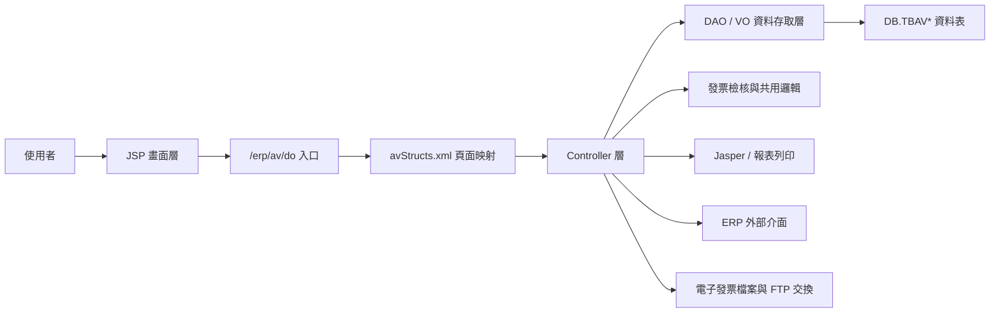
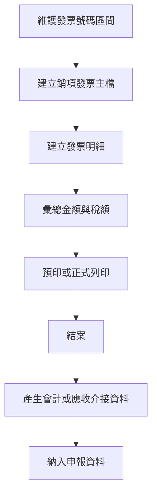
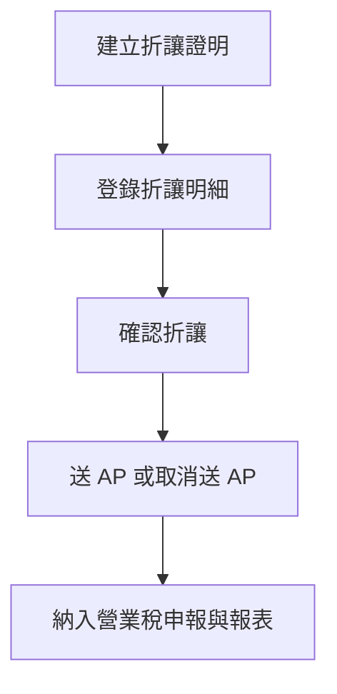
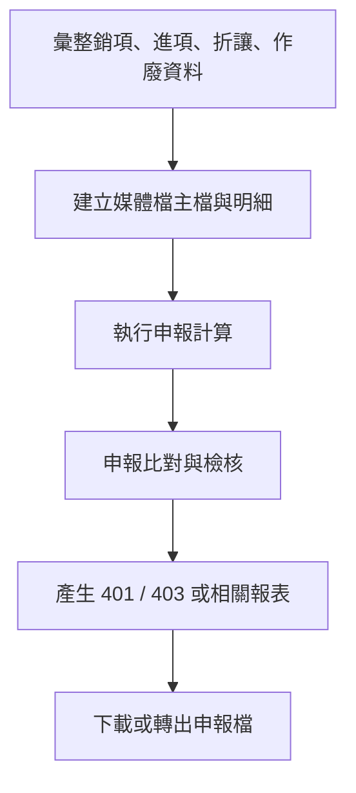
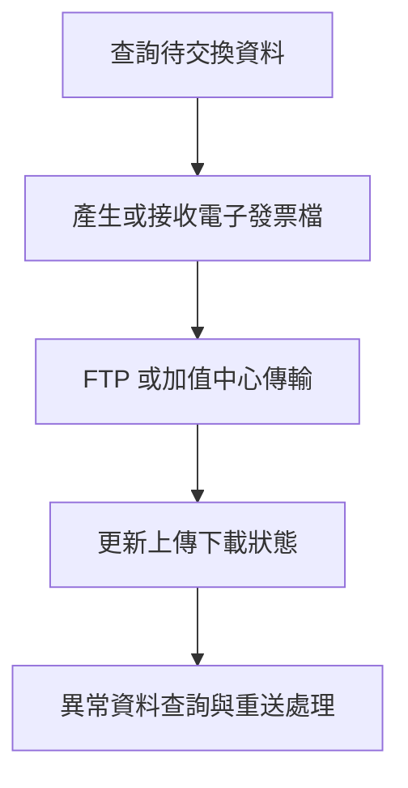

# AV 功能規格手冊

## 1. 系統概述

### 1.1 系統定位

`AV` 模組為中鴻鋼鐵 ERP 發票與營業稅管理系統，主要負責銷項發票、進項發票、折讓證明、作廢發票、營業稅申報、媒體檔產生、電子發票檔案交換、發票列印與相關會計傳票介接。系統以公司別、發票年月、發票號碼、發票日期、發票類別、折讓單號與申報年月等資料為核心索引，支援發票開立、異動、查詢、列印、申報與外部系統傳輸。

### 1.2 使用對象

- 財會人員：維護發票字軌、銷項發票、進項發票、折讓、作廢、營業稅申報與媒體檔。
- 業務或出貨相關人員：透過發票資料查詢、列印與電子發票上傳掌握開立狀態。
- 系統管理人員：維護發票參數、電子發票下載、iKey 客戶資料與資料交換狀態。
- 外部介接系統：透過 `face`、`service`、`chdownload`、`dei` 類別提供發票資料、會計傳票、FTP 或電子發票中心資料交換。

### 1.3 作業範圍

本模組涵蓋下列主要作業：

- 發票基本設定：發票號碼區間、原因代碼、會計科目與發票參數。
- 銷項發票管理：基本資料、明細資料、發票查詢、預印、正式列印、補印、刪除、作廢、還原與結案。
- 進項發票管理：傳票發票查詢、進項發票維護、資料匯入與列印。
- 折讓與作廢管理：折讓證明、折讓明細、折讓確認、作廢發票主檔與明細維護。
- 營業稅申報：編配媒體檔、每月申報、外銷資產申報、專案工程申報、 `401` 與 `403` 申報資料計算。
- 電子發票交換：中鴻電子發票下載、加值中心資料下載與上傳、iKey 客戶資料維護、電子發票檔案上傳。
- 報表與列印：發票列印、折讓發票送 AP 報表、QR Code 列印、銷項與進項結算報表。

### 1.4 資料來源與整理依據

本文件依據現有程式與設定整理，主要參考：

- 頁面與控制器映射：`config/yl/av/avStructs.xml`。
- JSP 畫面：`jsp/`。
- Controller 與服務程式：`src/com/icsc/av/`。
- DAO 與 VO：`src/com/icsc/av/dao/`、`dao/`。
- 資料表定義：`sql/`。
- 報表定義：`xml/dr/`。
- 介接與下載程式：`src/com/icsc/av/face/`、`src/com/icsc/av/service/`、`src/com/icsc/av/chdownload/`、`src/com/icsc/av/dei/`。

## 2. 系統架構總覽

### 2.1 整體架構

### 2.2 分層說明

| 層級 | 主要檔案或目錄 | 職責 |
|---|---|---|
| 畫面層 | `jsp/avjj*.jsp`、`jsp/avjjyl*.jsp` | 提供查詢、維護、列印、申報、上傳與下載操作。 |
| 路由映射 | `config/yl/av/avStructs.xml` | 定義 page ID、JSP、Controller、action flag、method 與 VO 對應。 |
| 控制層 | `src/com/icsc/av/avjc*CR.java` | 接收畫面 action，執行新增、修改、刪除、查詢、列印、申報與檔案處理。 |
| 資料層 | `src/com/icsc/av/dao/*DAO.java`、`*VO.java` | 封裝 `DB.TBAV*` 資料表 CRUD、查詢與資料物件轉換。 |
| 共用邏輯 | `src/com/icsc/av/dei/` | 提供發票號碼、稅額、 QR Code 、電子發票檢核、參數讀取等共用處理。 |
| 外部介接 | `src/com/icsc/av/face/`、`service/` | 提供會計、應收應付、銷售、運務或其他 ERP 模組呼叫介面。 |
| 檔案交換 | `src/com/icsc/av/chdownload/` | 處理電子發票下載、加值中心下載、FTP 連線與批次檔案交換。 |
| 報表列印 | `src/com/icsc/av/report/`、`xml/dr/` | 產生發票、折讓、 QR Code 與申報相關報表。 |

### 2.3 主要資料表

| 資料表 | VO／DAO | 功能定位 | 主要用途 | 關聯功能 |
|---|---|---|---|---|
| `DB.TBAV01` | `avjc01VO`／`avjc01DAO` | 銷項發票字軌與號碼區間主檔。 | 記錄公司別、年月、字軌、起訖號碼、目前號碼與發票類別，作為開立發票時取號依據。 | `avjj01` 發票號碼維護、銷項發票開立取號。 |
| `DB.TBAV02` | `avjc02VO`／`avjc02DAO` | 銷項發票原因代碼主檔。 | 維護發票開立、作廢、折讓或帳務處理所需原因代碼。 | `avjj02` 原因代碼維護、發票立帳與異常原因控管。 |
| `DB.TBAV03` | `avjc03VO`／`avjc03DAO` | 原因代碼對應會計分錄設定。 | 設定原因代碼對應的會計科目、借貸別、成本中心、參考號碼與到期日規則。 | `avjj03` 會計科目維護、銷項發票結案、傳票產生。 |
| `DB.TBAV04` | `avjc04VO`／`avjc04DAO` | 銷項發票主檔。 | 保存發票號碼、序號、日期、類別、客戶、金額、稅額、稅期、傳票號碼、列印狀態與結案狀態。 | `avjj04` 查詢列印、`avjj04ub` 銷項開立、`avjj31` 結案、申報彙總。 |
| `DB.TBAV05` | `avjc05VO`／`avjc05DAO` | 銷項發票明細檔。 | 保存發票品項、金額、稅額或會計拆分明細，供主檔彙總與列印使用。 | `avjj05ub` 明細維護、銷項發票列印、結案分錄產生。 |
| `DB.TBAV04` 暫存／收回資料 | `avjc04TempVO`／`avjc04TempDAO`、`avjc04urVO`／`avjc04urDAO` | 銷項發票收回、暫存與送出處理。 | 保存未正式納入或收回待處理的發票主檔資料，支援送出、還原、刪除與列印。 | `avjj04ur` 收回發票作業、`avjj04urmList` 查詢。 |
| `DB.TBAV05` 暫存明細 | `avjc05TempVO`／`avjc05TempDAO` | 銷項發票收回或暫存明細。 | 保存暫存發票明細資料，待送出後轉入正式明細。 | `avjj05ur` 收回發票明細作業。 |
| `DB.TBAV07` | `avjc07VO`／`avjc07DAO` | 折讓證明主檔。 | 記錄折讓單號、折讓日期、客戶與折讓狀態，作為折讓確認與申報依據。 | `avjj07m` 折讓證明維護、折讓確認、送 AP 。 |
| `DB.TBAV08` | `avjc08VO`／`avjc08DAO` | 折讓證明明細檔。 | 記錄折讓對應的原發票號碼、序號、日期與折讓明細。 | `avjj08` 折讓明細維護、`avjj08m` 折讓確認與送 AP 。 |
| `DB.TBAV09` | `avjc09VO`／`avjc09DAO` | 作廢發票主檔。 | 記錄作廢單號、客戶、訂單、作廢日期與建立資料。 | `avjj09` 作廢發票維護、申報排除或調整。 |
| `DB.TBAV10` | `avjc10VO`／`avjc10DAO` | 作廢發票明細檔。 | 保存作廢發票號碼、序號、日期、類別、品名或原因資料。 | `avjj10` 作廢明細維護、作廢資料拋轉。 |
| `DB.TBAV11` | `avjc11VO`／`avjc11DAO`、`avjc51VO`／`avjc51DAO` | 進項發票資料檔。 | 保存進項發票號碼、日期、類別、金額、稅額、傳票與申報所需資料。 | `avjj11` 傳票發票查詢、`avjj11Invoice` 進項維護、`avjj51` 進項匯入。 |
| `DB.TBAV12` | `avjc12VO`／`avjc12DAO` | 編配媒體檔主檔。 | 以公司別與申報年月建立媒體檔批次主資料。 | `avjj12m` 編配媒體檔維護、`avjj12Download` 下載。 |
| `DB.TBAV13` | `avjc13VO`／`avjc13DAO` | 編配媒體檔明細檔。 | 保存媒體檔所需發票明細、客戶資料、金額與稅額。 | `avjj13` 媒體檔明細維護、轉檔產生。 |
| `DB.TBAV14` | `avjc14VO`／`avjc14DAO` | 每月營業稅申報檔。 | 保存申報年月、申報序號與營業稅彙整資料。 | `avjj14` 每月申報、下載、扣抵轉換。 |
| `DB.TBAV14CHK` | `avjc14chkVO`／`avjc14chkDAO` | 營業稅申報檢核檔。 | 保存申報比對用發票、稅額與狀態資料，支援申報前後比對。 | `avjj14CHK0101` 申報資料建立與比對。 |
| `DB.TBAV15`、`DB.TBAV16` | 由申報 Controller 與 DAO 查詢使用 | 外銷或遞送類申報資料。 | 保存交運、遞送或外銷申報主明細資料。 | 外銷資產申報、申報媒體檔與報表。 |
| `DB.TBAV20`、`DB.TBAV21` | `avjc20VO`／`avjc20DAO`、`avjc21VO`／`avjc21DAO` | 延伸申報或遞送類主明細資料。 | 保存申報相關主檔與明細，供查詢、列印或申報彙整使用。 | `avjc20CR`、`avjc21CR` 相關維護與列印。 |
| `DB.TBAV401` | `avjc401VO`／`avjc401DAO` | `401` 申報計算資料。 | 保存 `401` 營業稅申報書所需欄位與彙總金額。 | `avjj15p` `401` 申報計算。 |
| `DB.TBAV403` | `avjc403VO`／`avjc403DAO` | `403` 申報計算資料。 | 保存 `403` 申報所需欄位、公司別、申報年月與稅額資料。 | `avjj16` `403` 申報查詢、計算、修改、刪除。 |
| `DB.TBAVRF` | `avjcrfVO`／`avjcrfDAO` | AV 系統參數檔。 | 保存發票參數、會計科目或系統控制參數。 | 發票取號、稅額處理、結案與共用參數讀取。 |
| `DB.TBAVTAX` | `avjcTaxVO`／`avjcTaxDAO` | 稅額彙總檔。 | 保存公司別、申報年月與營業稅彙總資訊。 | 每月申報、申報檢核、稅額報表。 |
| `DB.TBAVRP` | `avjcrpVO`／`avjcrpDAO` | 申報或報表來源資料檔。 | 保存產生申報來源、重新計算與報表產生所需資料。 | `avjj22` 來源產生、重算、報表產生與標記。 |
| `DB.TBAVFI01` | `avjctbfi01VO`／`avjctbfi01DAO` | 電子發票檔案索引或交換控制資料。 | 保存主鍵、關聯鍵、公司別、代理、客戶與檔案分類。 | 電子發票檔案上傳、下載與交換追蹤。 |
| `DB.TBAVMESSAGE` | `avjctbmessageVO`／`avjctbmessageDAO` | 電子發票或資料交換訊息檔。 | 保存交換訊息、說明、主鍵、關聯鍵與資料狀態。 | 電子發票下載、上傳、異常訊息追蹤。 |
| 電子發票上傳資料 | `avjctb19VO`／`avjctb19DAO` | 電子發票檔案上傳明細。 | 保存發票號碼、賣方、買方、銷售額、免稅額、營業稅、總額與電子發票欄位。 | `avjj23a` 電子發票檔案上傳。 |
| `DB.TBAVYL*` | `avjcavyl04VO`／`avjcavyl04DAO`、`avjcyl07VO`／`avjcyl07DAO`、`avjcyl08VO`／`avjcyl08DAO` 等 | 義聯或特定公司別延伸資料。 | 保存特定公司別發票、折讓、作廢、申報與列印延伸資料。 | `avjjyl*` 延伸頁面、 MP 查詢、義聯發票列印與申報。 |

### 2.4 頁面與 Controller 對應

`avStructs.xml` 目前定義 `40` 個主要 page。典型作業以 `_pageId` 指向頁面，再以 `_action` 對應 Controller method，例如 `I=query`、`N=create`、`R=update`、`D=delete`、`P=print`、`E=preprint`、`F=finalend`、`UP=upload`。

| 功能群組 | Page ID | Controller | 主要 action |
|---|---|---|---|
| 發票號碼與設定 | `avjj01`、`avjj02`、`avjj03`、`avjj41`、`avjj42` | `avjc01CR`、`avjc02CR`、`avjc03CR`、`avjc41CR`、`avjc42CR` | 查詢、新增、修改、刪除。 |
| 銷項發票 | `avjj04`、`avjj04ub`、`avjj05ub`、`avjj31`、`avjj32` | `avjc04CR`、`avjc04ubCR`、`avjc05ubCR`、`avjc31CR`、`avjc32CR` | 查詢、新增、修改、刪除、還原、預印、列印、結案、 QR Code 。 |
| 銷項發票收回或暫存 | `avjj04ur`、`avjj05ur`、`avjj04urmList` | `avjc04urCR`、`avjc05urCR`、`avjc04urmListCR` | 查詢、刪除、還原、送出、修改、建立、列印。 |
| 折讓與作廢 | `avjj07m`、`avjj08`、`avjj08m`、`avjj09`、`avjj10` | `avjc07CR`、`avjc08CR`、`avjc08mCR`、`avjc09CR`、`avjc10CR` | 折讓確認、取消確認、停用、取消停用、送 AP 、取消送 AP 、作廢維護。 |
| 進項發票 | `avjj11`、`avjj11Invoice`、`avjj51`、`avjj18` | `avjc11CR`、`avjc11InvoiceCR`、`avjc51CR`、`avjc18CR` | 查詢、維護、上傳、匯入、刪除。 |
| 媒體檔與申報 | `avjj12m`、`avjj13`、`avjj12Download`、`avjj14`、`avjj14CHK0101`、`avjj14m`、`avjj14m2`、`avjj14m3`、`avjj15p`、`avjj16`、`avjj17`、`avjj19`、`avjj22` | `avjc12CR`、`avjc13CR`、`avjc12DownloadCR`、`avjc14CR`、`avjc14CHK0101CR`、`avjc14mCR`、`avjc14m2CR`、`avjc15CR`、`avjc16CR`、`avjc17CR`、`avjc19CR`、`avjc22CR` | 媒體檔建立、異動、轉檔、申報、比對、計算、列印、報表產生。 |
| 電子發票交換 | `avjjchdlList`、`avjjchcscList`、`avjjCdsCust`、`avjj23a` | `avjcDownload`、`avjcCscDownload`、`avjcCdsCust`、`avjc23aFunc` | 下載、上傳、iKey 維護、電子發票檔案上傳。 |
| MP 或延伸查詢 | `avjjyl08` | `avjcyl04Func1` | 查詢與延伸查詢。 |

### 2.5 主要外部介接

- 會計傳票介接：`avjcaadei`、`avjc04`、`avjiac`、`avjcOutInvoice` 涉及發票轉傳票、應收或會計資料建立。
- 電子發票與加值中心：`avjcDownload`、`avjcCscDownload`、`avjcCDSDownload`、`avjcFTPCon`、`avjcFtpSS15` 處理 FTP 下載、上傳與批次交換。
- 發票服務介面：`avjcInInvoice`、`avjcOutInvoice` 提供進項與銷項發票資料服務。
- 其他 ERP 模組介面：`face/` 下 `avjcaa`、`avjcdr`、`avjcflyl`、`avjcsoyl`、`avjcssyl`、`avjctp` 等類別，提供跨模組取得或傳送發票資料的 API。

## 3. 功能模組詳細說明

### 3.1 發票基本設定模組

#### 3.1.1 發票號碼區間維護

- Page：`avjj01`
- Controller：`avjc01CR`
- 資料表：`DB.TBAV01`
- 功能：維護公司別、發票年月、字軌、序號、發票類別、起訖號碼與目前號碼。
- 主要規則：新增時檢核起訖號碼邏輯與區間重疊；已使用目前號碼的區間不可任意刪除。
- 作業：查詢、新增、修改、刪除、清單查詢。

#### 3.1.2 原因代碼與會計科目設定

- Page：`avjj02`、`avjj03`
- Controller：`avjc02CR`、`avjc03CR`
- 資料表：`DB.TBAV02`、`DB.TBAV03`
- 功能：維護發票原因代碼，以及原因代碼對應的會計科目、借貸別、成本中心、參考號碼與到期日規則。
- 主要規則：發票立帳與傳票產生會依原因代碼展開會計分錄。

#### 3.1.3 參數與帳務設定

- Page：`avjj41`、`avjj42`
- Controller：`avjc41CR`、`avjc42CR`
- 資料表：`DB.TBAVRF` 或相關參數表。
- 功能：維護非營業性或發票相關立帳科目、參數與對應規則。

### 3.2 銷項發票管理模組

#### 3.2.1 銷項發票主檔查詢與列印

- Page：`avjj04`
- Controller：`avjc04CR`
- 資料表：`DB.TBAV04`、`DB.TBAV05`
- 報表：`avPrintSInvoice.xml`、`avPrintSInvoice.jrxml`、`avjrPrintSInvoice_New.xml`、`avjrPrintSInvoice_NewSub.xml`
- 功能：查詢銷項發票、刪除、預印、正式列印、特殊刪除處理與列印次數更新。
- 主要規則：支援 `invoiceNo`、`invoiceSrlNo`、`invoiceDate`、`invoiceType` 查詢；列印時讀取主檔與明細資料，並更新列印資訊。

#### 3.2.2 銷項發票開立作業

- Page：`avjj04ub`、`avjj05ub`
- Controller：`avjc04ubCR`、`avjc05ubCR`
- 資料表：`DB.TBAV04`、`DB.TBAV05`
- 功能：維護銷項發票主檔與明細，支援新增、修改、刪除、還原、預印、列印、結案與 QR Code 列印。
- 主要規則：開立時依發票類別、日期與字軌取得新發票號碼；明細金額彙總後回寫主檔金額與稅額；結案時可觸發立帳或傳票相關處理。

#### 3.2.3 銷項發票結案與立帳

- Page：`avjj04ub`、`avjj31`
- Controller：`avjc04ubCR`、`avjc31CR`
- 介接：`avjcaadei`、`avjcOutInvoice`、`face/avjiac`
- 功能：將可結案發票轉為會計傳票或應收資料，並依原因代碼會計設定產生分錄。
- 主要規則：稅額科目透過參數取得；不同稅率會影響稅額拆分；若缺少明細或會計設定，作業應回報錯誤。

#### 3.2.4 收回或暫存銷項發票

- Page：`avjj04ur`、`avjj05ur`、`avjj04urmList`
- Controller：`avjc04urCR`、`avjc05urCR`、`avjc04urmListCR`
- 資料表：`DB.TBAV04`、`DB.TBAV05` 與暫存 VO／DAO。
- 功能：處理收回或暫存銷項發票資料，支援查詢、刪除、還原、送出、修改、建立與列印。
- 主要規則：暫存資料送出後才納入正式發票處理；刪除與還原需保留原發票資料關聯。

#### 3.2.5 QR Code 發票列印

- Page：`avjj04ub`
- Controller：`avjc04ubCR`
- 共用邏輯：`avjcQrcodeContent`、`avjcQrcodeGen`
- 報表：`avjrQrCode.xml`
- 功能：依發票資料產生 QR Code 內容並列印。

### 3.3 折讓與作廢管理模組

#### 3.3.1 折讓證明維護

- Page：`avjj07m`、`avjj08`
- Controller：`avjc07CR`、`avjc08CR`
- 資料表：`DB.TBAV07`、`DB.TBAV08`
- 功能：維護折讓證明主檔與折讓發票明細，支援新增、修改、刪除、確認、取消確認、停用與取消停用。
- 主要規則：折讓明細需關聯原發票號碼與發票日期；折讓確認後會影響申報或送 AP 狀態。

#### 3.3.2 折讓確認與送 AP

- Page：`avjj08m`
- Controller：`avjc08mCR`
- 報表：`avjrEDiscountInvSendAP.xml`
- 功能：查詢待處理折讓資料，產生送 AP 資料，並可取消送 AP 。
- 主要規則：送 AP 後需保留處理狀態與訊息；系統透過 `sendMsg` 等流程通知或記錄後續處理。

#### 3.3.3 作廢發票維護

- Page：`avjj09`、`avjj10`
- Controller：`avjc09CR`、`avjc10CR`
- 資料表：`DB.TBAV09`、`DB.TBAV10`
- 功能：維護作廢發票主檔與明細，並支援明細拋轉或移除。
- 主要規則：作廢資料需保存原發票號碼、發票序號、日期、類別與原因，供申報與查核使用。

### 3.4 進項發票管理模組

#### 3.4.1 傳票發票查詢

- Page：`avjj11`
- Controller：`avjc11CR`
- 資料表：`DB.TBAV11`
- 功能：依傳票或進項發票條件查詢進項資料。

#### 3.4.2 進項發票維護

- Page：`avjj11Invoice`
- Controller：`avjc11InvoiceCR`
- 資料表：`DB.TBAV11`
- 功能：維護進項發票資料，支援新增、修改、刪除、查詢與上傳。
- 主要規則：進項發票資料包含發票號碼、日期、稅額、金額、廠商或交易對象等資訊，供申報與稅務檢核使用。

#### 3.4.3 進項發票資料匯入

- Page：`avjj51`
- Controller：`avjc51CR`
- 資料表：`DB.TBAV11` 或匯入暫存資料。
- 功能：匯入進項發票資料，支援建立、更新、刪除與執行批次新增／更新。

#### 3.4.4 進項發票字軌或資料上傳

- Page：`avjj18`
- Controller：`avjc18CR`
- 功能：維護進項發票字軌或上傳檔案，支援新增、刪除、查詢與 `UP` 上傳。

### 3.5 編配媒體檔與營業稅申報模組

#### 3.5.1 編配媒體檔主檔與明細

- Page：`avjj12m`、`avjj13`、`avjj12Download`
- Controller：`avjc12CR`、`avjc13CR`、`avjc12DownloadCR`
- 資料表：`DB.TBAV12`、`DB.TBAV13`
- 功能：維護申報媒體檔主檔與明細，支援查詢、新增、修改、刪除、全部建立、全部查詢、轉檔與下載。
- 主要規則：媒體檔以公司別與申報年月為主軸，明細可依發票日期、發票號碼與序號產生。

#### 3.5.2 每月營業稅申報

- Page：`avjj14`
- Controller：`avjc14CR`
- 資料表：`DB.TBAV14`、`DB.TBAVTAX`
- 功能：執行申報、標記、下載與扣抵轉換。
- 主要規則：申報作業會彙整銷項、進項、折讓、作廢及扣抵資料，產出申報資料或檔案。

#### 3.5.3 營業稅申報檢核

- Page：`avjj14CHK0101`
- Controller：`avjc14CHK0101CR`
- 資料表：`DB.TBAV14CHK`
- 功能：查詢、建立與比對營業稅申報檢核資料。
- 主要規則：比對發票資料與申報彙總，確認發票號碼、類別、日期、稅額與申報資料一致。

#### 3.5.4 外銷資產與專案工程申報

- Page：`avjj14m`、`avjj14m2`、`avjj14m3`
- Controller：`avjc14mCR`、`avjc14m2CR`
- 功能：外銷資產申報查詢與更新、專案工程發票查詢、設定、報表與匯出。

#### 3.5.5 `401` 與 `403` 申報資料計算

- Page：`avjj15p`、`avjj16`
- Controller：`avjc15CR`、`avjc16CR`
- 資料表：`DB.TBAV401`、`DB.TBAV403`
- 功能：依申報年月計算 `401` 或 `403` 申報資料，並提供查詢、修改、刪除與列印前查詢。

#### 3.5.6 發票結算與報表

- Page：`avjj17`、`avjj19`、`avjj22`
- Controller：`avjc17CR`、`avjc19CR`、`avjc22CR`
- 功能：列印發票與銷售結算資料、銷項或進項發票帳冊，產生申報來源資料、重新計算、報表產生與標記。

### 3.6 電子發票與檔案交換模組

#### 3.6.1 中鴻電子發票下載

- Page：`avjjchdlList`
- Controller：`chdownload/avjcDownload`
- 相關批次：`avjcInvoBatch`、`avjcDiscoBatch`、`avjcDInvoBatch`、`avjcDDiscoBatch`
- 功能：查詢可下載資料，執行多種下載與上傳動作，包含發票、折讓或備份類檔案。
- 主要規則：依不同 action 執行不同檔案下載流程，並透過 FTP 或指定目錄完成資料交換。

#### 3.6.2 加值中心電子發票交換

- Page：`avjjchcscList`
- Controller：`chdownload/avjcCscDownload`
- 功能：與加值中心進行資料下載與上傳，支援下載、上傳與資料確認。

#### 3.6.3 iKey 客戶資料維護

- Page：`avjjCdsCust`
- Controller：`avjcCdsCust`
- 資料物件：`avjcIkeyVO`、`avjcIkeyDAO`
- 功能：維護加值中心客戶 iKey 資料，支援查詢、新增、修改與刪除。

#### 3.6.4 電子發票檔案上傳

- Page：`avjj23a`
- Controller：`func/avjc23aFunc`
- Business Service：`bs/avjc23aBs`
- 資料物件：`avjctb19VO`
- 功能：查詢、新增、修改、刪除與上傳電子發票檔案資料。
- 主要資料：發票號碼、發票日期、發票類別、賣方、買方、銷售額、免稅額、營業稅、總額、匯率與電子發票欄位。

### 3.7 發票列印與報表模組

#### 3.7.1 發票列印

- Controller：`report/avjcPrintInvoice`、`report/avjcPrintInvoiceT`
- 報表：`avPrintSInvoice.xml`、`avPrintRInvoice.xml`、`avjrPrintSInvoice_New.xml`、`avjrPrintRInvoice_New.xml`
- 功能：依銷項或折讓發票資料產生列印內容，支援新版格式與子報表。

#### 3.7.2 QR Code 列印

- Controller：`report/avjcQrcodePrint`
- 報表：`avjrQrCode.xml`
- 功能：依電子發票規格產生 QR Code 列印資料。

#### 3.7.3 Applet 舊式列印

- Applet：`src/com/icsc/av/applet/avjaInvoice_yl.java`、`html/avjaInvoice.jar`
- 功能：提供舊式客戶端發票列印能力，透過傳入參數完成版面定位與印表機列印。

### 3.8 共用檢核與服務模組

#### 3.8.1 發票號碼與稅務檢核

- 類別：`dei/avjcInvoiceChkdei`、`dei/avjcSInvoiceChkdei`
- 功能：檢核發票號碼、產生新發票號碼、處理序號與發票規則。

#### 3.8.2 QR Code 與電子發票內容

- 類別：`dei/avjcQrcodeContent`、`dei/avjcQrcodeGen`
- 功能：組成電子發票 QR Code 內容並產生可列印資訊。

#### 3.8.3 共用參數與資料處理

- 類別：`dei/avjcCommondei`
- 功能：取得 AV 參數、日期與申報年月、共用查詢或格式處理。

#### 3.8.4 進項與銷項發票服務

- 類別：`service/avjcInInvoice`、`service/avjcOutInvoice`
- 功能：提供進項與銷項發票資料服務，供本模組或其他 ERP 模組呼叫。

### 3.9 權限與資料控管

- 多數 Controller 具有 `getAuthorization` 方法，代表畫面按鈕或作業權限需依 ERP 權限框架控制。
- 重要交易作業包含新增、修改、刪除、還原、結案、申報、送 AP 、上傳與下載，應保留操作人員、日期、時間與資料狀態。
- 發票、折讓與申報作業均與稅務及會計資料相關，正式異動前應完成必要檢核，避免重複發票號碼、重複申報、缺少會計科目或稅額不一致。

### 3.10 主要作業流程

#### 3.10.1 銷項發票開立流程

#### 3.10.2 折讓作業流程

#### 3.10.3 營業稅申報流程

#### 3.10.4 電子發票交換流程

## 4. 附錄：主要檔案索引

| 類別 | 檔案 |
|---|---|
| 路由設定 | `config/yl/av/avStructs.xml` |
| 核心 Controller | `src/com/icsc/av/avjc01CR.java` 至 `avjc51CR.java` |
| 電子發票下載 | `src/com/icsc/av/chdownload/avjcDownload.java`、`avjcCscDownload.java`、`avjcCDSDownload.java` |
| 報表列印 | `src/com/icsc/av/report/avjcPrintInvoice.java`、`avjcPrintInvoiceT.java`、`avjcQrcodePrint.java` |
| 共用檢核 | `src/com/icsc/av/dei/avjcInvoiceChkdei.java`、`avjcSInvoiceChkdei.java`、`avjcCommondei.java` |
| DAO / VO | `src/com/icsc/av/dao/`、`dao/` |
| SQL | `sql/db.TBAV*.sql`、`sql/DB.TBAV14CHK.sql` |
| 報表 XML | `xml/dr/*.xml`、`xml/dr/*.jrxml` |
