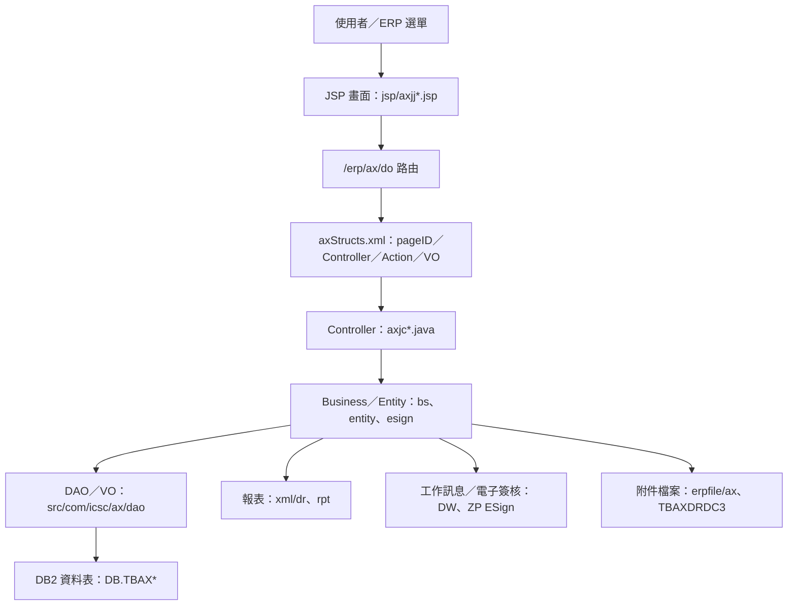

# AX 資本支出系統功能規格手冊

整理日期：2026-08-19  
整理範圍：`D:\CHSBrowser_erp\erpHome\yl.ear\erp.war\ax`

## 1. 系統概述

### 1.1 系統定位

`AX` 模組為 ERP 內的資本支出管理系統，主要支援資本支出案件自提案、審議、預算增減、執行進度追蹤、實際動支、資料修正、完工結案、效益追蹤至查詢報表的完整作業流程。

本系統以提案編號、專案工程編號、年度預算、審議結果、進度時程、採購／物料動支與效益評估資料為核心，提供業務單位、審議單位、專案負責人、A29 業務負責人及簽核主管進行資料維護、審核、追蹤與報表輸出。

### 1.2 業務目標

1. 建立資本支出提案資料，集中管理提案人員、提案部門、廠別、提案項目、專案工程編號、專案名稱、預算金額與提案狀態。
2. 維護資本支出計畫金額、提案內容、效益評估與進度時程，作為審議、核准與後續追蹤依據。
3. 管理審議單位經辦作業，紀錄審議類別、審議結果、承辦人員、核准日期及資料異動確認。
4. 追蹤資本支出執行進度與實際動支金額，包含採購、預付、驗收、領料與實際時程。
5. 支援提案資料修正與資本支出結案，並保存修正後資料、完工說明、結論、效益差異說明與結案日期。
6. 支援重大資本支出效益追蹤、A29 檢核與電子簽核流程，提供送出、核准、退回、鎖定、解鎖與工作訊息通知。
7. 提供資本支出提案、預算增減、完工結案、執行進度與效益追蹤等查詢、匯出與報表列印。

### 1.3 使用者角色

| 角色 | 主要職責 |
| --- | --- |
| 提案單位使用者 | 建立與維護提案基本資料、計畫金額、提案內容、效益評估與進度時程。 |
| 審議單位經辦 | 維護審議資料、審議結果、承辦人員與核准資料，必要時進行預算增減確認。 |
| 專案／工程負責人 | 更新進度追蹤、實際動支金額、採購資料、領料明細與完工結案資訊。 |
| A29 業務負責人 | 檢核 A29 相關申請資料與流程節點，協助重大資本支出簽核或流程確認。 |
| 主管／簽核人員 | 依電子簽核流程進行核准、退回、審核、確認與結案相關決策。 |
| 查詢／管理人員 | 使用查詢、資料匯出與彙總報表，掌握資本支出案件狀態與執行成效。 |

### 1.4 作業生命週期

### 1.5 主要資料來源

本手冊依下列程式與設定盤點整理：

| 類別 | 位置 | 用途 |
| --- | --- | --- |
| 頁面與控制器映射 | `config/yl/ax/axStructs.xml` | 還原 JSP、Controller、Action、VO 對應關係。 |
| 前端畫面 | `jsp/` | 取得使用者操作入口、欄位標籤、查詢／清單／編輯畫面。 |
| Controller | `src/com/icsc/ax/`、`src/com/icsc/ax/controller/` | 取得查詢、新增、修改、刪除、計算、列印、送出、核准、退回等處理流程。 |
| Business／Entity | `src/com/icsc/ax/bs/`、`src/com/icsc/ax/entity/`、`src/com/icsc/ax/esign/` | 取得商業邏輯、簽核流程、工作訊息與檔案處理。 |
| DAO／VO | `src/com/icsc/ax/dao/`、`dao/`、`dao/sql/` | 取得主要資料表、欄位、主鍵與資料存取方式。 |
| 報表 | `xml/dr/`、`src/com/icsc/ax/rpt/` | 取得資本支出提案、預算增減、完工結案、效益追蹤與彙總報表。 |
| 設定 | `config/yl/ax/axConfig.ini`、`config/yl/ax/axcfg.ini` | 取得檔案存放路徑與模組設定。 |

## 2. 系統架構總覽

### 2.1 技術架構

`AX` 模組採用傳統 JSP 加 Java Controller 的 ERP 架構，畫面透過 `/erp/ax/do?_pageId=...` 進入功能控制器，Controller 依 `axStructs.xml` 中的 action flag 執行對應方法，並透過 VO／DAO 存取 `DB.TBAX*` 資料表。

### 2.2 分層說明

| 分層 | 主要元件 | 說明 |
| --- | --- | --- |
| 表現層 | `jsp/axjj*.jsp` | 提供查詢、清單、編輯、Popup、頁籤與列印入口。 |
| 路由設定層 | `config/yl/ax/axStructs.xml` | 定義每個 pageID 對應的 Controller、Action flag 與 VO converter。 |
| 控制層 | `axjc01CR`、`axjc02CR`、`axjc05CR`、`axjc08aFunc` 等 | 接收畫面 action，執行查詢、新增、修改、刪除、計算、列印、送出、核准、退回等動作。 |
| 商業邏輯層 | `bs/`、`entity/`、`inter/`、`esign/` | 處理效益計算、結案、簽核流程、工作訊息、A29 通知、檔案與共用工具。 |
| 資料存取層 | `dao/`、`VO`、`DAO` | 對應資本支出相關資料表，負責 SQL 查詢與資料異動。 |
| 報表層 | `xml/dr/`、`rpt/` | 產出提案表、預算增減表、完工結案表、效益評估表與彙總表。 |

### 2.3 主要資料表

| 資料表 | VO／DAO | 功能定位 | 主要用途 | 關聯功能 |
| --- | --- | --- | --- | --- |
| `DB.TBAX010` | `axjc010VO`、`axjc010DAO` | 資本支出提案主檔。 | 保存提案編號、提案人員、部門、廠別、專案工程、預算金額、實際金額、提案狀態、進度、完工與結案資訊，作為各階段作業的主關聯資料。 | `AXJJ01` 提案維護、`AXJJ03` 進度追蹤、`AXJJ04` 資料修正、`AXJJ05` 結案、`AXJJ06` 提案查詢、`AXJJ07` 進度查詢、`AXJJ99` A29 檢核。 |
| `DB.TBAX015` | `axjc015VO`、`axjc015DAO` | 資本支出計畫金額明細。 | 保存年度、提案項目、提案細項、專案工程、計畫金額、幣別、匯率、外幣金額、修改後金額、預定增減後金額與異動說明。 | `AXJJ01` 計畫金額維護、`AXJJ02` 審議計畫金額維護、`AXJJ04` 資料修正、`AXJJ99` A29 檢核。 |
| `DB.TBAX020` | `axjc020VO`、`axjc020DAO` | 資本支出提案內容明細。 | 保存必要性說明、計畫數量、計畫單位、使用範圍、主要規範、計畫費用、有形／無形效益、施工天期、策略、未來效益、減碳效益與結論。 | `AXJJ01` 提案內容維護、`AXJJ99` A29 檢核、提案表與彙總報表。 |
| `DB.TBAX030` | `axjc030VO`、`axjc030DAO` | 資本支出效益評估資料。 | 保存總預算、使用年限、操作成本、原物料成本、維修成本、殘值、年效益、IRR、NPV、回收年限與情境試算結果。 | `AXJJ01` 提案效益評估、`AXJJ02` 審議效益評估、`AXJJ05` 結案效益評估、`AXJJ99` A29 檢核、效益評估報表。 |
| `DB.TBAX040` | `axjc040VO`、`axjc040DAO` | 資本支出進度時程明細。 | 保存進度類別、專案工程、計畫日期、修改日期、實際日期與維護資訊，支援採購、發包、安裝、驗收等時程追蹤。 | `AXJJ01` 進度時程維護、`AXJJ03` 進度追蹤、`AXJJ04` 資料修正、`AXJJ05` 結案時程、`AXJJ99` A29 檢核、時程修訂表。 |
| `DB.TBAX100` | `axjc100VO`、`axjc100DAO` | 審議單位經辦資料。 | 保存審議類別、審議結果、提案資訊、承辦人員、核准日期、取消日期、備註、修改狀態與修改日期。 | `AXJJ02` 審議單位經辦維護、審議通知、提案狀態更新。 |
| `DB.TBAX200` | `axjc200VO`、`axjc200DAO` | 實際動支金額資料。 | 保存專案工程、採購編號、提案編號、年度、計畫金額、實際動支金額、驗收金額、預付金額、實際採購／發包／驗收時程。 | `AXJJ03` 實際動支金額維護、`AXJJ07` 進度追蹤查詢、執行進度彙總報表。 |
| `DB.TBAX210` | `axjc210VO`、`axjc210DAO` | 物料領用明細資料。 | 保存專案工程、物料編號、提案編號、使用日期、領料金額與維護資訊，補充實際支出來源。 | `AXJJ03` 物料明細維護、實際動支追蹤。 |
| `DB.TBAX010A` | `axjctb010aVO`、`axjctb010aDAO` | 申請版提案基本資料。 | 保存提案主檔的申請／版本快照，包含 `priKey`、`forKey`、`verKey`、有效狀態、資料狀態、版本、建立／更新人員與提案欄位。 | `AXJJ08` 預算增減申請、A29 檢核、電子簽核送出／核准／退回。 |
| `DB.TBAX015A` | `axjctb015aVO`、`axjctb015aDAO` | 申請版計畫金額資料。 | 保存計畫金額申請版資料，包含年度、提案項目、幣別、匯率、修改後金額、預定增減後金額、有效狀態與資料狀態。 | `AXJJ09` 計畫金額申請維護、`AXJJ08` 預算增減頁籤、電子簽核送出／核准／退回。 |
| `DB.TBAX030A` | `axjctb030aVO`、`axjctb030aDAO` | 申請版結案效益評估資料。 | 保存結案效益評估申請版資料，包含成本、年效益、IRR、NPV、回收年限、追蹤年度、有效狀態、資料狀態與版本。 | `AXJJ05` 結案效益評估改版、審核鎖定／解鎖、結案、效益追蹤。 |
| `DB.TBAX040A` | `axjctb040aVO`、`axjctb040aDAO` | 申請版進度時程資料。 | 保存進度時程申請版資料，包含進度類別、計畫日期、修改日期、實際日期、有效狀態、資料狀態與版本。 | `AXJJ10` 進度時程申請維護、`AXJJ08` 預算增減頁籤、時程修訂簽核。 |
| `DB.TBAXS01` | `axjctbs01VO`、`axjctbs01DAO` | 簽核明細與狀態資料。 | 保存申請資料的簽核分類、簽核人員、簽核意見、簽核狀態、主管工作訊息序號與關聯鍵，作為電子簽核流程追蹤依據。 | `AXJJ08`、`AXJJ09`、`AXJJ10` 申請簽核、`AXJJ05` 結案審核、ZP ESign callback、DW 工作訊息。 |
| `DB.TBAXDRDC3` | `axjcdrdc3VO`、`axjcdrdc3DAO` | 附件檔案資料。 | 保存附件檔案編號、檔名、建立時間、檔案描述、檔案位置與維護資訊，透過 `info='AX0020' + propNo` 關聯提案附件。 | `AXJJ01` 提案附件、`AXJJ99` A29 檢核附件、`axjc328FileUpload`、`axjsUploadReader`。 |
| `DB.TBAXG020` | `axjcg020VO`、`axjcg020DAO` | 序號設定與產生資料。 | 保存公司別、系統別、表格名稱、欄位名稱、年月日、前後綴、格式、目前序號與日期格式設定，供流水號註冊與產生。 | `AXG02` 序號設定維護、`axjcsn`、`axjcsn1`、提案編號與審議編號產生。 |

### 2.4 共用代碼與設定

| 代碼 | 用途 |
| --- | --- |
| `AX0001` | 提案項目。 |
| `AX0002` | 提案類別／型態。 |
| `AX0003` | 提案或審議狀態。 |
| `AX0006` | 廠別。 |
| `AX0007` | 進度類別。 |
| `AX0008` | 延期類別。 |
| `AX0009` | 審議類別。 |
| `AX0010` | 金額判斷／提案等級。 |
| `AX0011` | 計畫單位。 |
| `AX0012` | 安環專案項目。 |
| `AX0013` | 提案項目細項。 |
| `AX0016` | 結案／完工相關逾期天數設定。 |
| `AX0017` | 通知名單或審議相關設定。 |

### 2.5 電子簽核與工作訊息

電子簽核相關程式集中於 `src/com/icsc/ax/entity/`、`src/com/icsc/ax/esign/` 與 `src/com/icsc/ax/controller/`，主要元件如下：

| 元件 | 說明 |
| --- | --- |
| `axjcCr01FlowSetting` | 依簽核狀態、金額級距與流程階段取得簽核清單；流程包含會議審議、書面審議、未達 200 萬、200 萬至 2,000 萬、2,000 萬至 5,000 萬、5,000 萬以上等級距，並處理 A29 節點。 |
| `axjcProposalFlow` | 提供簽核清單與主管授權相關基礎能力。 |
| `axjcCr01EsignGothrough` | 電子簽核核准與退回 callback，依目前流程狀態通知申請人或 A29。 |
| `axjcCr01EsignWithdraw` | 電子簽核撤回 callback。 |
| `axjcCr01esignDW`、`axjcCr01A29esignDW`、`axjcCr01MesignDW`、`axjcCr01FinishEsignDW` | 建立退回、A29、M 簽核及流程完成相關工作訊息。 |
| `axjcDw` | 包裝 DW 工作訊息建立功能。 |

### 2.6 報表架構

報表格式主要位於 `xml/dr/`，程式端報表 VO 位於 `src/com/icsc/ax/rpt/`。主要報表如下：

| 報表 | 檔案 |
| --- | --- |
| 資本支出提案表 | `axjrVO010.xml`、`axjrVO010資本支出提案表.xml`、`axjrVO010a.xml` |
| 資本支出預算增減表 | `axjrVO020.xml`、`axjrVO020資本支出預算增減表.xml`、`axjrVO020a.xml`、`axjrVO020b.xml` |
| 資本支出完工結案表 | `axjrVO030.xml`、`axjrVO030資本支出完工結案表.xml` |
| 重大資本支出效益追蹤表 | `axjrVO040.xml` |
| 資本支出提案效益評估表 | `axjrVO100.xml`、`axjrVO100a.xml` |
| 資本支出時程修訂表 | `axjrVO101a.xml` |
| 資本支出提案彙總表 | `axjrProp100資本支出提案彙總表.xml`、`axjrProp110.xml` |
| 資本支出執行進度追蹤彙總表 | `axjrProp200資本支出執行進度追蹤彙總表.xml` |
| 重大資本支出效益追蹤彙總表 | `axjrProp300重大資本支出效益追蹤彙總表.xml` |
| 資本支出完工結案彙總表 | `axjrProp400資本支出完工結案彙總表.xml` |

## 3. 功能模組詳細說明

### 3.1 `AXJJ01` 資本支出提案維護

#### 3.1.1 功能目的

提供資本支出提案建立與維護，包含提案基本資料、計畫金額、提案內容、效益評估與進度時程。此模組是資本支出生命週期的起點。

#### 3.1.2 功能清單

| 功能 | pageID／JSP | Controller | 主要資料 |
| --- | --- | --- | --- |
| 提案基本資料作業 | `axjj0101Edit`／`axjj0101Edit.jsp` | `axjc01CR` | `TBAX010` |
| 計畫金額維護作業 | `axjj0102Edit`／`axjj0102Edit.jsp` | `axjc012CR` | `TBAX015`、`TBAX010` |
| 提案內容維護作業 | `axjj0103Edit`／`axjj0103Edit.jsp` | `axjc013CR` | `TBAX020` |
| 提案效益評估作業 | `axjj0104Edit`／`axjj0104Edit.jsp` | `axjc014CR` | `TBAX030` |
| 進度時程維護作業 | `axjj0105List`／`axjj0105List.jsp` | `axjc015CR` | `TBAX040` |

#### 3.1.3 主要作業

1. 查詢提案資料與關聯明細。
2. 新增、修改、刪除提案主檔與各類明細。
3. 維護提案編號、提案人、部門、廠別、提案項目、專案工程編號、專案名稱、計畫金額與提案狀態。
4. 維護必要性說明、主要規範、使用範圍、有形效益、無形效益、施工天期、減碳效益與結論。
5. 計算效益評估資料，包含 IRR、NPV、回收年限、成本與年效益。
6. 維護採購、發包、安裝、驗收等計畫進度時程。
7. 列印資本支出提案表及相關報表。
8. 支援舊案重提；程式設定中亦保留送審、撤回、確認賦予、未核准結案等擴充流程註解。

#### 3.1.4 主要 Action

| Action flag | 方法 | 說明 |
| --- | --- | --- |
| `I` | `query` | 查詢資料。 |
| `N` | `create` | 新增資料。 |
| `R` | `update` | 修改資料。 |
| `D` | `delete` | 刪除資料。 |
| `PV` | `printView` | 預覽或列印。 |
| `RS` | `doResubmit` | 舊案重提。 |
| `CA`、`CB` | `calcIRRA`、`calcIRRB` | 計算不同情境 IRR。 |
| `C` | `calculate` | 執行效益試算。 |
| `CC` | `calcNPV` | 計算 NPV。 |

### 3.2 `AXJJ02` 審議單位經辦與預算增減維護

#### 3.2.1 功能目的

提供審議單位處理資本支出案件，維護審議類別、審議結果、承辦人員、核准日期及計畫金額異動資料。

#### 3.2.2 功能清單

| 功能 | pageID／JSP | Controller | 主要資料 |
| --- | --- | --- | --- |
| 審議單位經辦維護作業 | `axjj0201Edit`／`axjj0201Edit.jsp` | `axjc02CR` | `TBAX100`、`TBAX010`、`TBAX040` |
| 審議效益評估作業 | `axjj0202Edit`／`axjj0202Edit.jsp` | `axjc022CR` | `TBAX030` |
| 計畫金額維護作業 | `axjj0203Edit`／`axjj0203Edit.jsp` | `axjc023CR` | `TBAX015` |

#### 3.2.3 主要作業

1. 維護審議類別、審議結果、承辦人員、承辦電話、核准日期與備註。
2. 建立或更新審議資料後，同步更新提案主檔狀態與進度時程。
3. 依審議結果與金額條件處理通知或後續控管。
4. 維護預算增減後計畫金額與異動原因。
5. 重新計算審議階段效益評估資料，包含 IRR、NPV 與回收年限。
6. 提供修改確認 `modConfirm`，作為審議後資料異動確認作業。

### 3.3 `AXJJ03` 執行進度追蹤

#### 3.3.1 功能目的

追蹤已核准資本支出案件的執行情形，維護實際進度、採購／動支資料、進度時程與物料明細。

#### 3.3.2 功能清單

| 功能 | pageID／JSP | Controller | 主要資料 |
| --- | --- | --- | --- |
| 進度追蹤維護作業 | `axjj0301Edit`／`axjj0301Edit.jsp` | `axjc03CR` | `TBAX010` |
| 實際動支金額維護作業 | `axjj0302Edit`／`axjj0302Edit.jsp` | `axjc032CR` | `TBAX200`、`TBAX010` |
| 進度時程維護作業 | `axjj0303List`／`axjj0303List.jsp` | `axjc033CR` | `TBAX040` |
| 物料明細維護作業 | `axjj0304List`／`axjj0304List.jsp` | `axjc034CR` | `TBAX210` |

#### 3.3.3 主要作業

1. 查詢並更新提案進度狀態、實際進度類別與延期原因。
2. 維護採購編號、年度、計畫金額、實際動支金額、驗收金額、預付金額與採購時程。
3. 依採購與驗收資料更新提案主檔實際動支資訊。
4. 維護採購、發包、安裝、驗收等進度時程的計畫日、修改日、實際日。
5. 維護物料編號、使用日期與領料金額，供實際支出追蹤使用。

### 3.4 `AXJJ04` 提案資料修正

#### 3.4.1 功能目的

提供已建檔或已審議案件的提案資料修正，包含主檔資料、計畫金額與進度時程調整。

#### 3.4.2 功能清單

| 功能 | pageID／JSP | Controller | 主要資料 |
| --- | --- | --- | --- |
| 提案資料修正作業 | `axjj0401Edit`／`axjj0401Edit.jsp` | `axjc04CR` | `TBAX010` |
| 計畫金額維護作業 | `axjj0402Edit`／`axjj0402Edit.jsp` | `axjc042CR` | `TBAX015` |
| 進度時程維護作業 | `axjj0403List`／`axjj0403List.jsp` | `axjc043CR` | `TBAX040` |

#### 3.4.3 主要作業

1. 查詢並修正提案主檔資料。
2. 更新計畫金額與年度預算資料。
3. 更新進度時程資料。
4. 預覽或列印修正後提案資料。

### 3.5 `AXJJ05` 資本支出完工結案與效益追蹤

#### 3.5.1 功能目的

管理資本支出案件完工後的結案資料與效益評估，包含完工說明、結論、效益差異、結案日期、結案效益評估與追蹤年度資料。

#### 3.5.2 功能清單

| 功能 | pageID／JSP | Controller | 主要資料 |
| --- | --- | --- | --- |
| 資本支出結案作業 | `axjj0501Edit`／`axjj0501Edit.jsp` | `axjc05CR` | `TBAX010` |
| 結案效益評估作業 | `axjj0502Edit`／`axjj0502Edit.jsp` | `axjc052CR` | `TBAX030` |
| 結案效益評估作業改版 | `axjj0502aEdit`／`axjj0502aEdit.jsp` | `axjc0502aCr` | `TBAX030A`、`TBAXS01` |
| 進度時程維護作業 | `axjj0503List`／`axjj0503List.jsp` | `axjc053CR` | `TBAX040` |

#### 3.5.3 主要作業

1. 維護完工說明、結論、新增資產、新增設備、實際完成日、結案申請日與效益差異說明。
2. 執行結案 `close`，完成案件結案處理。
3. 維護結案效益評估，包含成本、年效益、IRR、NPV 與回收年限。
4. 支援預估與實際效益差異說明修改。
5. 改版畫面支援審核鎖定、取消審核、核准、結案、鎖定與解鎖。
6. 維護效益追蹤年度及年度效益資料，支援重大資本支出營運後追蹤。
7. 提供完工結案表與效益追蹤表預覽列印。

### 3.6 `AXJJ06` 資本支出提案查詢

#### 3.6.1 功能目的

提供資本支出提案主檔查詢與資料匯出，供管理單位快速掌握提案案件狀態。

#### 3.6.2 功能清單

| 功能 | pageID／JSP | Controller | 主要資料 |
| --- | --- | --- | --- |
| 資本支出提案查詢作業 | `axjj0601List`／`axjj0601List.jsp` | `axjc06CR` | `TBAX010` |

#### 3.6.3 主要作業

1. 依提案編號、專案工程編號、部門、廠別、提案項目、狀態等條件查詢。
2. 顯示提案主檔與關鍵金額／狀態資訊。
3. 匯出查詢結果。

### 3.7 `AXJJ07` 資本支出進度追蹤查詢

#### 3.7.1 功能目的

提供資本支出進度追蹤查詢與資料匯出，協助管理執行進度、延期與實際完成狀態。

#### 3.7.2 功能清單

| 功能 | pageID／JSP | Controller | 主要資料 |
| --- | --- | --- | --- |
| 資本支出進度追蹤查詢 | `axjj0701List`／`axjj0701List.jsp` | `axjc07CR` | `TBAX010` |

#### 3.7.3 主要作業

1. 查詢提案進度、計畫進度、實際進度、延期原因與相關金額。
2. 顯示進度追蹤清單。
3. 匯出查詢結果，供後續彙整與管理追蹤。

### 3.8 `AXJJ08` 預算增減申請與 A29 檢核

#### 3.8.1 功能目的

提供資本支出預算增減申請、A29 檢核與簽核作業。畫面支援提案編號查詢、申請資料建立、送出、核准、退回及列印預算增減表／時程修訂表。

#### 3.8.2 功能清單

| 功能 | pageID／JSP | Controller | 主要資料 |
| --- | --- | --- | --- |
| 預算增減／A29 檢核主畫面 | `axjj08.jsp` | 頁籤入口 | `TBAX010A`、`TBAX015A`、`TBAX040A` |
| 提案基本資料申請版維護 | `axjj08a`／`axjj08aEdit.jsp` | `axjc08aFunc` | `TBAX010A`、`TBAXS01` |
| 計畫金額申請版維護 | `axjj09a`／`axjj09aEdit.jsp` | `axjc09aFunc` | `TBAX015A`、`TBAXS01` |
| 進度時程申請版維護 | `axjj10a`／`axjj10aEdit.jsp` | `axjc10aFunc` | `TBAX040A`、`TBAXS01` |

#### 3.8.3 主要作業

1. 依提案編號查詢預算增減相關資料。
2. 維護異動前計畫金額、異動後計畫金額、異動增減金額、實際動支金額、年動支率與審議核准日期。
3. 維護修訂後主要規範明細、預算增減原因與時程修改原因。
4. 產生申請資料，並以有效狀態／資料狀態標示資料是否已產生。
5. 執行送出 `apply`，進入簽核流程。
6. 執行核准 `approve` 或退回 `reject`。
7. 列印預算增減表與時程修訂表。

### 3.9 `AXJJ09` 計畫金額申請維護

#### 3.9.1 功能目的

針對計畫金額明細進行申請版資料維護與簽核處理，主要處理年度、提案項目、原計畫金額、幣別、匯率、外幣金額、修改後金額與異動說明。

#### 3.9.2 主要作業

1. 查詢與模糊查詢計畫金額申請資料。
2. 新增、修改、刪除申請版計畫金額資料。
3. 送出申請資料。
4. 主管核准或退回。
5. 回寫或同步簽核明細狀態。

### 3.10 `AXJJ10` 進度時程申請維護

#### 3.10.1 功能目的

針對進度時程明細進行申請版資料維護與簽核處理，主要處理進度類別、計畫日期、修改日期與實際日期等資料。

#### 3.10.2 主要作業

1. 查詢與模糊查詢進度時程申請資料。
2. 新增、修改、刪除申請版進度時程資料。
3. 送出申請資料。
4. 主管核准或退回。
5. 維護簽核明細與工作訊息狀態。

### 3.11 `AXJJ99` A29 業務負責人檢核資料

#### 3.11.1 功能目的

提供 A29 業務負責人檢核資料，功能結構與提案維護相近，但使用 `AXJJ99` 入口及對應 Controller，供特定角色進行檢核或補正。

#### 3.11.2 功能清單

| 功能 | pageID／JSP | Controller | 主要資料 |
| --- | --- | --- | --- |
| 提案基本資料作業 | `axjj9901Edit`／`axjj9901Edit.jsp` | `axjc99CR` | `TBAX010` |
| 計畫金額維護作業 | `axjj9902Edit`／`axjj9902Edit.jsp` | `axjc992CR` | `TBAX015` |
| 提案內容維護作業 | `axjj9903Edit`／`axjj9903Edit.jsp` | `axjc993CR` | `TBAX020` |
| 提案效益評估作業 | `axjj9904Edit`／`axjj9904Edit.jsp` | `axjc994CR` | `TBAX030` |
| 進度時程維護作業 | `axjj9905List`／`axjj9905List.jsp` | `axjc995CR` | `TBAX040` |

#### 3.11.3 主要作業

1. 查詢並檢核提案基本資料。
2. 維護或確認計畫金額、提案內容、效益評估與進度時程。
3. 進行列印預覽與資料確認。
4. 搭配電子簽核流程中 A29 節點通知與後續處理。

### 3.12 `AXG02` 序號／設定資料維護

#### 3.12.1 功能目的

提供 AX 模組序號設定資料維護，用於產生提案編號、審議編號或其他表格欄位流水號。

#### 3.12.2 功能清單

| 功能 | JSP／程式 | 主要資料 |
| --- | --- | --- |
| 序號設定維護 | `axjjg02.jsp`、`axjjg0201List.jsp`、`axjcg02`、`axjsg02` | `TBAXG020` |

#### 3.12.3 主要作業

1. 查詢序號設定。
2. 新增、修改、刪除公司別、系統別、表格名稱、欄位名稱、年月日格式與目前序號。
3. 供 `axjcsn`、`axjcsn1` 進行流水號產生與註冊。

### 3.13 輔助查詢與附件功能

| 功能 | 程式／畫面 | 說明 |
| --- | --- | --- |
| 提案編號查詢 | `axjjPropNo.jsp` | 提供提案編號查詢 Popup。 |
| 專案工程編號查詢 | `axjjProjNo.jsp` | 提供專案工程編號查詢 Popup。 |
| 採購編號查詢 | `axjjPurNo.jsp` | 提供採購編號查詢 Popup。 |
| 附件上傳 | `axjc328FileUpload`、`axjj328.jsp` | 處理提案附件上傳。 |
| 附件讀取 | `axjsUploadReader`、`axjcCr01FileTool` | 依 `TBAXDRDC3.info='AX0020' + propNo` 讀取提案附件。 |
| 延期／結案檢查批次 | `axjcCheckDelayBat`、`axjcCheckCloseDate`、`axjcFinishDateDelay`、`axjcFinishApplyDateDelay` | 檢查結案、完工或申請日是否逾期，依 `AX0016` 設定判斷。 |

### 3.14 查詢與報表彙總功能

| 功能 | 主要報表／資料 |
| --- | --- |
| 資本支出提案彙總 | `axjrProp100資本支出提案彙總表.xml`、`axjrProp110.xml` |
| 執行進度追蹤彙總 | `axjrProp200資本支出執行進度追蹤彙總表.xml` |
| 重大資本支出效益追蹤彙總 | `axjrProp300重大資本支出效益追蹤彙總表.xml` |
| 完工結案彙總 | `axjrProp400資本支出完工結案彙總表.xml` |
| 個案列印 | 提案表、預算增減表、完工結案表、效益評估表、時程修訂表。 |

### 3.15 主要控制規則整理

1. 提案主檔以 `propNo` 為核心識別，部分作業另以 `projNo`、`purNo`、`matrlNo` 或申請版 `priKey`、`forKey`、`verKey` 作為關聯鍵。
2. 計畫金額、提案內容、效益評估與時程資料需依提案編號與專案工程編號串接。
3. 效益評估計算包含成本、殘值、年效益、IRR、NPV 與回收年限；當年效益不足造成回收年限過長時，程式會提示例外訊息。
4. 審議資料異動會同步提案主檔與進度時程，並依金額或審議結果觸發通知或控管。
5. 申請版資料透過 `validStatus`、`dataStatus`、`dataVersion` 管理資料有效性、簽核狀態與版本。
6. 簽核流程依金額級距、會議／書面審議與 A29 節點決定簽核清單。
7. 工作訊息序號寫入 `dwMsg` 或相關欄位，用於追蹤主管通知與退回／核准訊息。
8. 附件以 `TBAXDRDC3` 保存檔案資訊，並以 `AX0020 + propNo` 關聯提案。
9. 查詢清單支援資料匯出，報表則由 `xml/dr/` 報表模板與 `rpt/` VO 組合產生。

## 文件限制與後續建議

本手冊是依目前程式碼、JSP 畫面、XML mapping、DAO／VO 與報表檔整理出的功能規格盤點版。由於未連線正式資料庫與實際 ERP 執行環境，以下項目建議後續再逐項驗證：

1. 各 `AX0001` 至 `AX0017` 代碼在正式環境的完整中文名稱與有效值。
2. 各簽核級距在正式電子簽核平台的實際 template 設定。
3. A29、A2、A、P、B 等節點在組織權限中的實際人員與授權條件。
4. 報表列印結果與正式套印格式是否完全一致。
5. 批次逾期檢核的排程時間、通知對象與實際執行紀錄。
