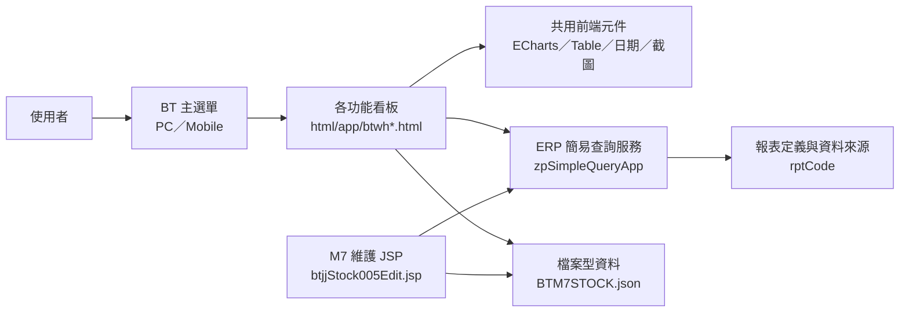
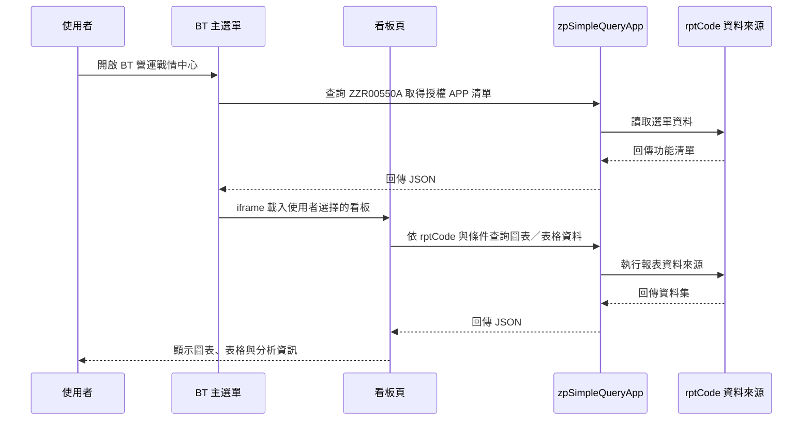
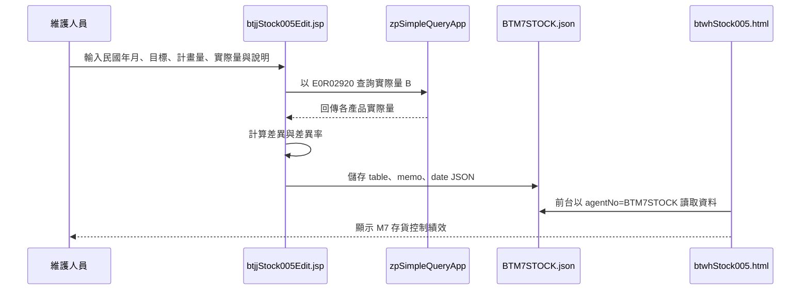

# BT 營運戰情中心功能規格手冊

文件日期：2026-08-19

## 1. 系統概述

### 1.1 系統定位

`BT` 模組為 ERP 內的「營運戰情中心」，主要提供經營管理、銷售、生產、鋼胚、庫存、人力、財務、物料與 AI 使用費用等資訊看板。系統以前端 HTML 儀表板為主要呈現層，透過 ERP 既有的簡易報表查詢服務取得資料，並以圖表、表格、趨勢分析與明細展開方式呈現營運指標。

本模組偏向決策支援與視覺化查詢，不是傳統交易型作業系統。大部分功能以唯讀查詢為主，例外為 `M7 存貨控制績效` 提供 JSP 維護畫面，可輸入目標值、計畫量、實際量及說明，並產生前台看板使用的 JSON 資料。

### 1.2 使用對象

- 經營主管：查看整體營運、毛利、銷價、成本、產量與存貨趨勢。
- 銷售與業務管理人員：追蹤即時銷售、出貨、接單與訂單推移。
- 生產與廠務管理人員：追蹤產線績效、產出、能耗與各廠加工成本。
- 庫存與鋼胚管理人員：追蹤存貨結構、庫存推移、訂購管理與久庫存分析。
- 人資管理人員：查看平均年齡、屆退、學歷、性別、年資、離職率及特殊身分等人力指標。
- 財務與管理分析人員：查看匯率、匯兌損益、產品毛利與變動費用。
- 系統管理或 AvaGPT 管理人員：查看 AvaGPT 使用量、訊息量、Token 與費用統計。

### 1.3 系統目標

- 將 ERP 既有報表資料轉換為可視化戰情室畫面。
- 支援 PC 與行動裝置入口，提供一致的功能選單與 iframe 顯示體驗。
- 以 `rptCode` 作為資料契約，降低各看板直接耦合後端 SQL 的程度。
- 提供圖表與明細表互補檢視，支援管理者快速掌握趨勢、結構與異常。
- 對部分重要看板提供截圖下載或資料維護能力，便利會議簡報與月度管理。

### 1.4 功能範圍

本次依程式檔案盤點，納入下列範圍：

- 主選單：`btwhMainMenuPC.html`、`btwhMainMenuMB.html`。
- 共用前端元件：`btjtCommon.jss`、`btjtEcharts.jss`、`btjtHtml2Canvasmin.jss`、`btAllmin.css`。
- 看板頁面：`html/app/btwh*.html`。
- 編輯作業：`jsp/btjjStock005Edit.jsp`、`jsp/btjjEdit.jsp`。
- 初始化類別：`src/com/icsc/bt/btjcInitial.java`。

### 1.5 系統特性

- 圖表引擎使用 ECharts，常見圖型包含長條圖、折線圖、圓餅圖、堆疊圖及雙軸趨勢圖。
- 資料取得主要透過 `/erp/zp/do?_pageId=zpSimpleQueryApp&_action=queryByRptCode`。
- 主選單透過 `ZZR00550A` 取得 APP 清單與權限入口。
- 多數看板具備圖表區與表格區，可依不同 `DATALOC`、`TITLEID`、年月、產品別、產線或單位取得資料。
- 部分成本與分析頁整合 `html2canvas`，支援將圖表或表格下載為圖片。
- `M7 存貨控制績效` 前台讀取 `agentNo=BTM7STOCK` 的 JSON 檔，後台 JSP 負責產生與儲存該 JSON。

## 2. 系統架構總覽

### 2.1 整體架構

### 2.2 前端呈現層

前端以靜態 HTML 為核心，放置於 `html/app`。頁面依檔名與主題分群，例如 `btwhSale*` 為銷售、`btwhProduction*` 為生產、`btwhStock*` 為庫存、`btwhHuman*` 為人力。各頁使用 `fetch` 或 `axios` 呼叫 ERP 查詢服務，再將回傳的 JSON 組成圖表與表格。

主選單頁面提供固定頁首、側邊功能選單、時鐘與 iframe 內容區。功能選單由 `ZZR00550A` 查詢 APP 權限資料後動態建立；若功能無 URL，會導向權限申請頁。

### 2.3 共用元件層

| 檔案 | 主要用途 |
|---|---|
| `html/btjtCommon.jss` | 建立資料表、判斷行動裝置、取得今日／昨日日期、成本表格轉置、圖片下載等共用函式。 |
| `html/btjtEcharts.jss` | ECharts 相關共用圖表設定與渲染支援。 |
| `html/btjtHtml2Canvasmin.jss` | 提供看板截圖、圖表與表格下載圖片使用。 |
| `html/btAllmin.css` | 共用樣式與圖示資源。 |
| `images/`、`images/svg/` | 主選單與看板卡片使用的圖片、SVG 圖示。 |

### 2.4 資料服務層

看板資料主要由 ERP 既有 `zpSimpleQueryApp` 提供：

- `_action=queryByRptCode`：依 `rptCode` 與查詢參數取得報表資料。
- `_action=queryByFile`：依 `agentNo` 取得檔案型 JSON 資料，例如 `BTM7STOCK`。

常用查詢參數包含：

- `rptCode`：報表資料來源代碼。
- `DATALOC`：同一報表中的資料區段或圖表／表格資料別。
- `TITLEID`：標題或資料抬頭區段。
- `YYYYMM`、`YYYYMMDD`、`WORKDATE`、`SMDATE`：年月日條件。
- `PRODTYPE`、`ITEMTYPE`、`SPECCODE`、`LINECODE`、`DEPTNO`：產品、材質、規格、產線或部門條件。
- `CC`、`SN`：廠別與分析項目條件。

### 2.5 程式結構

| 目錄 | 說明 |
|---|---|
| `html/app` | 各營運戰情中心看板頁面。 |
| `html` | 共用 JavaScript、CSS 與前端套件。 |
| `images` | JPG 圖片資源。 |
| `images/svg` | SVG 圖示資源。 |
| `jsp` | ERP JSP 作業畫面，目前包含一般編輯頁與 `M7` 存貨控制績效維護頁。 |
| `src/com/icsc/bt` | Java 初始化類別，目前僅保留模組初始化空類別。 |

### 2.6 主要作業流程

### 2.7 M7 存貨控制績效維護流程

## 3. 功能模組詳細說明

### 3.1 主選單與入口

| 功能 | 程式 | 資料來源 | 說明 |
|---|---|---|---|
| PC 主選單 | `btwhMainMenuPC.html` | `ZZR00550A` | 提供桌面版戰情中心入口，動態建立樹狀功能選單，以 iframe 載入各看板。 |
| Mobile 主選單 | `btwhMainMenuMB.html` | `ZZR00550A` | 提供行動裝置入口，邏輯與 PC 版相近，著重小螢幕瀏覽。 |
| 研發入口 | `btwhRD001.html`、`btwhRD002.html` | `ZZR00550A` | 依選單資料導入研發或測試性看板入口。 |

主選單處理重點：

- 依 APP 權限資料組成多層選單。
- 有 URL 的功能以 iframe 顯示。
- 無 URL 或未授權功能導向權限申請頁。
- 點擊 iframe 內容區後自動收合選單。
- 頁首顯示目前時間與目前開啟功能名稱。

### 3.2 經營管理看板

| 功能 | 程式 | `rptCode` | 主要內容 |
|---|---|---|---|
| 產品總毛利推移圖 | `btwhOperation001.html` | `BTR00240`、`BTR00240A` | 追蹤產品毛利變化，支援趨勢圖與明細表。 |
| 全產品銷價推移圖 | `btwhOperation002.html` | `BTR00250`、`BTR00260`、`BTR00270`、`BTR00300`、`BTR00310`、`BTR00320` | 依產品別呈現銷價推移，支援多報表來源整合。 |
| 熱軋加工成本／淨產量趨勢圖 | `btwhOperation003.html` | `BTR00390` | 呈現熱軋加工成本與淨產量趨勢。 |
| 熱軋 HRC 銷價推移圖 | `btwhOperation004.html` | `BTR00240` | 追蹤熱軋 HRC 銷價變化。 |

### 3.3 銷售管理看板

| 功能 | 程式 | `rptCode` | 主要內容 |
|---|---|---|---|
| 即時銷售績效 | `btwhSale001.html` | `BTR00010` | 依產品類型切換銷售績效，含圖表、抬頭資訊與明細表。 |
| 單軋客戶出貨量 | `btwhSale002.html` | `BTR00020` | 追蹤單軋客戶出貨量與相關明細。 |
| 銷售推移表 | `btwhSale003.html` | `BTR00090` | 依產品別呈現銷售趨勢，使用 `PRODTYPE`、`TITLEID`、`DATALOC` 取資料。 |
| 產品銷售區域分佈 | `btwhSale004.html` | `BTR00210` | 顯示產品在不同區域的銷售分佈。 |
| 接單量推移表 | `btwhSale005.html` | `BTR00330`、`BTR00330A` | 以年月與項目條件查詢接單量趨勢。 |
| OD 訂單推移 | `btwhSale006.html` | `BTR00340` | 追蹤 OD 訂單推移與產品別差異。 |

### 3.4 生產管理看板

| 功能 | 程式 | `rptCode` | 主要內容 |
|---|---|---|---|
| 產線日生產績效圖表 | `btwhProduction001.html` | `BTR00050` | 依產線與日期查詢日生產績效，包含產線選擇、圖表與明細。 |
| 託工產品生產績效表 | `btwhProduction002.html` | `BTR00060` | 呈現託工產品生產績效。 |
| 產出推移表 | `btwhProduction003.html` | `BTR00100` | 依產線或資料區段呈現產出趨勢。 |
| 熱軋生產產品組合 | `btwhProduction004.html` | `BTR00120` | 分析熱軋產品組合。 |
| 冷軋包裝產品組合 | `btwhProduction005.html` | `BTR00130` | 分析冷軋包裝產品組合。 |
| M4 能耗推移表 | `btwhProduction006.html` | `BTR00160` | 追蹤 M4 產線能耗趨勢。 |
| M5 能耗推移表 | `btwhProduction007.html` | `BTR00170` | 追蹤 M5 產線能耗趨勢。 |
| M6 能耗推移表 | `btwhProduction008.html` | `BTR00180` | 追蹤 M6 產線能耗趨勢。 |
| 熱軋廠加工成本淨產量趨勢圖 | `btwhProduction009.html` | `BTR00390` | 比較加工成本、淨產量、目標與差異原因，支援圖片下載。 |
| 冷軋廠加工成本淨產量趨勢圖 | `btwhProduction010.html` | `BTR00400` | 比較冷軋廠加工成本與淨產量，支援圖片下載。 |
| 酸鍍廠加工成本淨產量趨勢圖 | `btwhProduction011.html` | `BTR00410` | 比較酸鍍廠加工成本與淨產量，支援圖片下載。 |
| 鋼管大發廠加工成本淨產量趨勢圖 | `btwhProduction012.html` | `BTR00420` | 比較大發廠加工成本與淨產量，支援圖片下載。 |
| 鋼管鹿港廠加工成本淨產量趨勢圖 | `btwhProduction013.html` | `BTR00430` | 比較鹿港廠加工成本與淨產量，支援圖片下載。 |
| 總變動費用比較分析圖 | `btwhProduction014.html` | `BTR00491` | 依廠別與項目分析總變動費用，含圖表、表格與截圖下載。 |

### 3.5 加工成本看板

| 功能 | 程式 | `rptCode` | 主要內容 |
|---|---|---|---|
| 熱軋廠加工成本推移 | `btwhM4ConversionCost.html` | `E0R02610` | 呈現熱軋廠加工成本趨勢。 |
| 冷軋廠加工成本推移 | `btwhM5ConversionCost.html` | `E0R02610` | 呈現冷軋廠加工成本趨勢。 |
| 酸鍍廠加工成本推移 | `btwhM6ConversionCost.html` | `E0R02610` | 呈現酸鍍廠加工成本趨勢。 |
| 大發廠加工成本推移 | `btwhMPDConversionCost.html` | `E0R02610` | 呈現鋼管大發廠加工成本趨勢。 |
| 鹿港廠加工成本推移 | `btwhMPLConversionCost.html` | `E0R02610` | 呈現鋼管鹿港廠加工成本趨勢。 |

### 3.6 鋼胚管理看板

| 功能 | 程式 | `rptCode` | 主要內容 |
|---|---|---|---|
| 扁鋼胚庫存結構 | `btwhSlab001.html` | `BTR00150`、`BTR00150A` | 依規格、寬度或日期分析扁鋼胚庫存結構，支援點選展開明細。 |
| 扁鋼胚存貨訂購管理 | `btwhSlab002.html` | `BTR00220` | 呈現扁鋼胚存貨與訂購管理資訊。 |
| 扁鋼胚庫存結構推移 | `btwhSlab003.html` | `BTR00230`、`BTR00230A` | 依材質或年月追蹤庫存結構推移。 |
| 扁鋼胚購料耗用量價推移 | `btwhSlab004.html` | `BTR00280` | 分析購料與耗用的量價變化。 |
| 360 天以上久庫存鋼胚材質規格庫存分析 | `btwhSlab005.html` | `BTR00370` | 針對 360 天以上久庫存鋼胚，分析材質與規格庫存分佈。 |

### 3.7 庫存管理看板

| 功能 | 程式 | `rptCode`／資料來源 | 主要內容 |
|---|---|---|---|
| 存貨狀況表 | `btwhStock001.html` | `BTR00040`、`BTR00140` | 呈現存貨現況與明細表。 |
| 庫存推移表 | `btwhStock002.html` | `BTR00110` | 依產品別追蹤庫存推移。 |
| 存貨量價推移 | `btwhStock003.html` | `BTR00290` | 分析存貨量與價格趨勢。 |
| 鋼品存貨週轉率及週轉天數表 | `btwhStock004.html` | `BTR00360` | 呈現鋼品週轉率與週轉天數。 |
| M7 存貨控制績效 | `btwhStock005.html` | `BTM7STOCK.json` | 顯示合理存貨目標、計畫量、實際量、計畫差異、目標差異率與說明。 |
| 庫存採購或存貨分類查詢 | `btwhStock006.html` | `BTR00380` | 以 `PURTYPE` 等條件查詢存貨相關資料。 |

### 3.8 M7 存貨控制績效維護

| 功能 | 程式 | 主要內容 |
|---|---|---|
| M7 存貨控制績效維護 | `btjjStock005Edit.jsp` | 維護 `M7` 存貨控制績效前台 JSON，供 `btwhStock005.html` 呈現。 |

作業規格：

- APP ID 為 `BTJJSTOCK005EDIT`。
- 檔案型資料代碼為 `BTM7STOCK`，檔名為 `BTM7STOCK.json`。
- 公司別固定為 `yl`。
- 實際量 B 可由 `E0R02920` 依民國年月換算次月 1 日後帶出。
- 維護產品類別包含：扁鋼胚、熱軋、冷軋、鍍鋅、鋼管 D、鋼管 L。
- 必填資料包含合理存貨目標、計畫量與存貨目標值。
- 系統計算計畫差異、計畫差異率、目標差異率與合計列。
- 說明文字以非空白行儲存，前台以說明區呈現。

### 3.9 人力分析看板

| 功能 | 程式 | `rptCode` | 主要內容 |
|---|---|---|---|
| 平均年齡分析 | `btwhHuman001.html` | `0HR00150` | 依單位或整體分析員工平均年齡。 |
| 特殊身份 | `btwhHuman002.html` | `0HR00110`、`0HR00210` | 呈現特殊身分人員統計與明細。 |
| 屆退分析 | `btwhHuman003.html` | `0HR00120` | 依單位查詢屆退統計，並可展開名冊明細。 |
| 合理化編制分析 | `btwhHuman004.html` | `0HR00170` | 分析編制與人力配置狀況。 |
| 性別分析 | `btwhHuman005.html` | `0HR00180` | 呈現性別結構分析。 |
| 學歷分析 | `btwhHuman006.html` | `0HR00130` | 呈現學歷結構分析。 |
| 平均年資分析 | `btwhHuman007.html` | `0HR00160` | 分析員工平均年資。 |
| 離職率分析 | `btwhHuman008.html` | `0HR00140`、`0HR00200` | 呈現離職率與相關人力異動指標。 |
| 持股信託人數分析 | `btwhHuman009.html` | `0HR00190` | 分析持股信託參與人數。 |

人力看板常用條件包含 `WORKDATE`、`DEPTNO`、`NAMEID`、`TITLEID`。其中多數頁面使用今日日期作為查詢基準，並支援單位選擇或明細表呈現。

### 3.10 財務與物料看板

| 功能 | 程式 | `rptCode` | 主要內容 |
|---|---|---|---|
| 美元兌新台幣匯率與匯兌損益走勢表 | `btwhFinance001.html` | `BTR00470` | 依期間呈現匯率與匯兌損益趨勢。 |
| 物料庫存金額推移 | `btwhMaterial001.html` | `BTR00190` | 依物料或庫存分類追蹤庫存金額推移。 |

### 3.11 AvaGPT 使用與費用統計

| 功能 | 程式 | 主要內容 |
|---|---|---|
| AvaGPT 使用與費用統計戰情室 | `btwhAvaGTP001.html` | 呈現使用者數、訊息量、Token 用量、費用與平均使用指標，並提供圖表與表格切換。 |

此功能用於觀察公司內部 AvaGPT 使用狀況，頁面包含多個圖表區塊與明細資料表，可切換顯示圖表或表格。

### 3.12 研發與測試頁

| 功能 | 程式 | 說明 |
|---|---|---|
| 即時銷售績效測試頁 | `btwhRD003.html`、`btwhTest003.html` | 與正式銷售績效資料來源相近，用於測試或研發展示。 |
| 人力分析測試頁 | `btwhRD004.html`、`btwhTest001.html` | 與人力分析資料來源相近，用於測試或研發展示。 |
| 產品組合圖表測試頁 | `btwhTest002.html` | 以產品組合資料測試圖表呈現。 |
| 庫存推移表測試頁 | `btwhTest004.html` | 以庫存推移資料測試圖表呈現，局部使用 CDN 版 ECharts。 |

上述頁面名稱與位置顯示為研發或測試用途，正式授權選單是否開放仍應以 `ZZR00550A` 的 APP 權限資料為準。

### 3.13 共通功能規格

| 共通功能 | 規格說明 |
|---|---|
| 資料載入 | 頁面載入後依預設條件組成 URL，呼叫 `zpSimpleQueryApp` 取得 JSON。 |
| 圖表渲染 | 使用 ECharts 依資料集產生圖表，常見欄位由報表回傳欄位名稱動態組成。 |
| 表格渲染 | 以共用 `createTableFromRows` 或頁面內建函式將 JSON rows 轉為 HTML table。 |
| 標題取得 | 多數頁面以 `TITLEID` 或不同 `DATALOC` 取得圖表標題與表格標題。 |
| 條件切換 | 依頁面支援產品別、產線、年月、單位、規格、廠別或項目切換。 |
| 響應式版面 | 多數頁面使用 CSS media query 調整多欄圖表在小螢幕上的排列。 |
| 明細展開 | 部分鋼胚、人力與生產頁面支援點選圖表或資料列後查詢明細。 |
| 截圖下載 | 加工成本與變動費用相關頁面可使用 `html2canvas` 下載圖表或表格圖片。 |
| 錯誤處理 | 查詢失敗或無資料時，多數頁面以訊息、空表格或 console log 呈現。 |

### 3.14 權限與安全

- 主選單依 `ZZR00550A` 的 APP 資料與使用者權限產生可用功能。
- 無授權或無 URL 的功能會導向 ERP 權限申請頁。
- 看板頁面本身主要為資料查詢，權限控管重點落在 ERP 選單、APP 授權與後端 `zpSimpleQueryApp` 報表資料來源。
- `M7` 維護 JSP 屬於可寫入資料的作業，應由 ERP 既有登入、APP ID 與選單權限控管。

### 3.15 維護注意事項

- 新增看板時，應同步維護 APP 選單資料、前端 HTML、圖片資源與對應 `rptCode`。
- 若同一 `rptCode` 提供多區段資料，需明確定義 `DATALOC`、`TITLEID` 與條件欄位，避免前端與報表定義不一致。
- 目前多數 HTML 使用 CP950 編碼，但部分頁面使用 UTF-8；維護時需確認 `<meta charset>` 與實際檔案編碼一致。
- `btwhSlab005.html` 使用 UTF-8 讀取可正確顯示標題；若以 CP950 解讀會出現亂碼，後續維護需特別留意。
- `btwhTest*` 與 `btwhRD*` 頁面應確認是否僅限研發測試，避免誤放入正式選單。
- `btjcInitial.java` 目前為空初始化類別，未承載實際商業邏輯。
