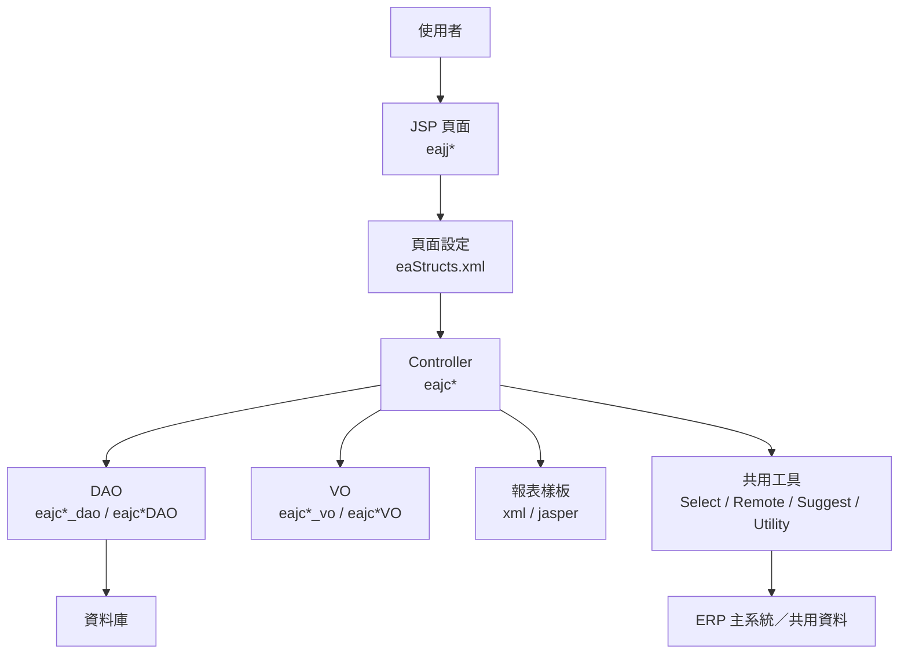

# 安環績效管理系統（EA）功能規格手冊

## 1. 系統概述

### 1.1 系統名稱

安環績效管理系統（EA，Environment & Safety）。

### 1.2 系統定位

本系統為 ERP 架構下之安環管理子系統，主要支援企業內部環境管理、安全衛生管理、職災事故處理、法規符合性、風險評估、環安衛目標與管理方案、文件簽核、報表列印及批次作業等業務。

系統以 Java Servlet、JSP、DAO／VO 資料存取模式及 ICSC DPMS 框架為主要實作基礎，透過頁面設定檔、控制器、資料物件與報表樣板組成完整的安環作業平台。

### 1.3 建置目的

1. 建立環安衛資料集中管理平台，降低紙本與分散式表單作業成本。
2. 提供事故、傷害、檢查、稽查、法規、許可證、風險評估等資料之登錄、查詢、維護與追蹤。
3. 支援簽核流程、通知公告、附件管理與文件留存，形成可追溯的管理紀錄。
4. 產出管理報表與統計資料，支援環安績效分析與稽核需求。
5. 透過批次作業與遠端資料元件，整合 ERP 主系統及外部共用資料。

### 1.4 使用對象

| 使用對象 | 主要用途 |
| --- | --- |
| 安環管理人員 | 維護事故、稽查、法規、許可證、目標、方案與統計資料 |
| 各單位承辦人 | 登錄單位環安資料、處理改善事項、查詢簽核與通知 |
| 主管／簽核人員 | 審核文件、追蹤改善進度、查詢績效與報表 |
| 系統管理人員 | 維護基礎資料、批次作業、通知與系統共用設定 |

### 1.5 系統主要資料與文件

| 類別 | 說明 | 主要位置 |
| --- | --- | --- |
| JSP 頁面 | 前端作業畫面、查詢頁、清單頁、列印頁 | `jsp/` |
| Java Controller | 業務邏輯與頁面動作控制 | `src/com/chsteel/ea/` |
| DAO／VO | 資料表存取與資料物件 | `src/com/chsteel/ea/dao/`、`dao/` |
| 頁面設定 | 頁面、控制器、動作與資料物件對應 | `eaStructs.xml`、`config/yl/ea/eaStructs.xml` |
| 報表樣板 | 報表 XML、JasperReports 樣板 | `xml/`、`xml/dr/` |
| 共用頁面與樣式 | CSS、JavaScript、圖片與 App 頁面 | `html/`、`images/` |
| 匯出範本 | Excel 或 GUL 等檔案範本 | `files/`、`gul/` |

### 1.6 命名規則

| 命名 | 說明 |
| --- | --- |
| `eajj*` | JSP 頁面，通常為使用者操作畫面 |
| `eajc*` | Java 控制類別或共用元件 |
| `*_dao`／`*DAO` | Data Access Object，負責資料庫存取 |
| `*_vo`／`*VO` | Value Object，承載資料欄位 |
| `*Search`、`*List`、`*Popup` | 查詢條件頁、結果清單頁、彈出選擇頁 |
| `*Doc`、`*PrintDoc`、`*Print` | 文件內容頁、列印頁、報表輸出頁 |
| `CR`／`CRN` | CRUD 或新版 CRUD 控制類別 |

### 1.7 主要資料表

| 資料表 | VO／DAO | 功能定位 | 主要用途 | 關聯功能 |
| --- | --- | --- | --- | --- |
| `tbeaHtContent` | `eajcHtContent_vo`／`eajcHtContent_dao` | 事故內容主檔 | 保存環安衛事故基本內容、事故描述、發生資訊與調查資料 | Ht 事故管理、事故查詢、事故報告列印 |
| `tbeaHtContentPlan` | `eajcHtContentPlan_vo`／`eajcHtContentPlan_dao` | 事故改善計畫 | 保存事故改善對策、負責單位、預定完成日與執行內容 | Ht 改善計畫、事故追蹤 |
| `tbeaHtContentTrace` | `eajcHtContentTrace_vo`／`eajcHtContentTrace_dao` | 事故追蹤紀錄 | 記錄改善計畫之追蹤結果、完成狀態與查核意見 | Ht 事故追蹤、改善成效確認 |
| `tbeaNHtContent` | `eajcNHtContent_vo`／`eajcNHtContent_dao` | 新版事故主檔 | 保存新版事故管理流程之事故內容資料 | NHt 新版事故管理 |
| `tbeaTRContent` | `eajcTRContent_vo`／`eajcTRContent_dao` | 事故報告內容 | 保存事故調查報告、原因分析與改善建議 | TR 事故報告、失能傷害調查報告 |
| `tbeaHNTContent` | `eajcHNTContent_vo`／`eajcHNTContent_dao` | 傷害統計資料 | 保存失能傷害、輕傷害與統計報表所需資料 | HNT 傷害統計、績效統計 |
| `tbeaHNHurt` | `eajcHNHurt_vo`／`eajcHNHurt_dao` | 傷害明細資料 | 保存傷害案件明細、傷害類別與相關統計欄位 | HND 傷害統計、CDSI 職災統計 |
| `tbeaHurtType` | `eajcHurtType_vo`／`eajcHurtType_dao` | 傷害類別主檔 | 維護傷害類型代碼與名稱 | 傷害管理、事故登錄、統計分析 |
| `tbeaHurtRegion` | `eajcHurtRegion_vo`／`eajcHurtRegion_dao` | 傷害部位主檔 | 維護受傷部位分類資料 | 傷害管理、事故調查 |
| `tbeaHurtID` | `eajcHurtID_vo`／`eajcHurtID_dao` | 傷害項目主檔 | 維護傷害項目代碼與說明 | 傷害管理、事故統計 |
| `tbeaCDSDoc` | `eajcCDSDoc_vo`／`eajcCDSDoc_dao` | 職災統計文件 | 保存職業災害統計調查文件資料 | CDSI 職災統計調查 |
| `tbeaCDSHtRate` | `eajcCDSHtRate_vo`／`eajcCDSHtRate_dao` | 傷害率資料 | 保存傷害率、失能傷害相關指標與計算結果 | CDSI、績效指標 |
| `tbeaCDSManTime` | `eajcCDSManTime_vo`／`eajcCDSManTime_dao` | 人工小時資料 | 保存人工小時統計資料，供傷害率計算使用 | WorkTime、CDSI、績效統計 |
| `tbeaSafeDoc` | `eajcSafeDoc_vo`／`eajcSafeDoc_dao` | 安全觀察文件 | 保存安全觀察紀錄與檢查結果 | Safe 安全觀察、安全觀察紀錄表 |
| `tbeaSafeDetail` | `eajcSafeDetail_vo`／`eajcSafeDetail_dao` | 安全觀察明細 | 保存安全觀察項目、缺失與改善內容 | SafeLocal、Safe 安全觀察 |
| `tbeaSafeTrace` | `eajcSafeTrace_vo`／`eajcSafeTrace_dao` | 安全改善追蹤 | 保存安全缺失改善追蹤、回覆與結案紀錄 | 廠區安全、改善追蹤 |
| `tbeaDySafeDoc` | `eajcDySafeDoc_vo`／`eajcDySafeDoc_dao` | 動態安全文件 | 保存動態安全管理文件資料 | DySafe 動態安全 |
| `tbeaConstSafChk` | `eajcConstSafChk_vo`／`eajcConstSafChk_dao` | 施工安全檢查主檔 | 保存工程施工安全檢查表與檢查結果 | ConstSafChk 施工安全檢查 |
| `tbeaKeycheck` | `eajcKeycheck_vo`／`eajcKeycheck_dao` | 關鍵檢核主檔 | 保存關鍵檢核類別、檢核主資料 | KeyCheck 關鍵檢核 |
| `tbeaKeycheckItem` | `eajcKeycheckItem_vo`／`eajcKeycheckItem_dao` | 關鍵檢核項目 | 保存檢核項目、檢核內容與項目設定 | KeyCheck 項目維護 |
| `tbeaInspectDoc` | `eajcInspectDoc_vo`／`eajcInspectDoc_dao` | 稽查文件主檔 | 保存工安環保聯合稽查文件與期別資料 | Inspect／Insp 稽查管理 |
| `tbeaInspContent` | `eajcInspContent_vo`／`eajcInspContent_dao` | 稽查內容明細 | 保存稽查內容、缺失、建議與評核資料 | 稽查報告、評核彙整 |
| `tbeaEnvPerm` | `eajcEnvPerm_vo`／`eajcEnvPerm_dao` | 環保許可證主檔 | 保存環保許可證基本資料、類別與有效期限 | EnvPerm 環保許可證 |
| `tbeaEnvPermItem` | `eajcEnvPermItem_vo`／`eajcEnvPermItem_dao` | 許可項目明細 | 保存許可證項目、管制條件與明細資料 | EnvPerm 許可項目編輯 |
| `tbeaEPProcedureID` | `eajcEPProcedureID_vo`／`eajcEPProcedureID_dao` | 製程代碼主檔 | 維護廢棄物清理計畫書相關製程資料 | EPP 廢棄物清理計畫 |
| `tbeaEPProduct` | `eajcEPProduct_vo`／`eajcEPProduct_dao` | 產品資料主檔 | 維護製程產品資料 | EPP、產能暨廢棄物統計 |
| `tbeaEPWaste` | `eajcEPWaste_vo`／`eajcEPWaste_dao` | 廢棄物資料主檔 | 維護廢棄物種類、代碼與清理資訊 | EPP、PPAW、廢棄物管理 |
| `tbeaAirPTax` | `eajcAirPTax_vo`／`eajcAirPTax_dao` | 空污費申報資料 | 保存空氣污染防制費申報資料 | AirP 空污費申報 |
| `tbeaAirPStock` | `eajcAirPStock_vo`／`eajcAirPStock_dao` | 空污庫存資料 | 保存空污相關庫存、煙囪或物料資料 | AirPStock 空污庫存 |
| `tbeaNsExposDt` | `eajcNsExposDt_vo`／`eajcNsExposDt_dao` | 噪音暴露明細 | 保存噪音暴露測定明細資料 | NsExpos 噪音暴露測定 |
| `tbeaNsMnt01`、`tbeaNsMnt02`、`tbeaNsMnt03` | `eajcNsMnt01_vo`／`eajcNsMnt01_dao` 等 | 噪音監測資料 | 保存噪音監測主檔、明細與統計資料 | NsMnt 噪音監測 |
| `tbeaRdExpos` | `eajcRdExposVO`／`eajcRdExposDAO` | 輻射暴露資料 | 保存輻射暴露測定與匯入資料 | RdExpos 輻射暴露測定 |
| `tbeaRecycle` | `eajcRecycle_vo`／`eajcRecycle_dao` | 資源回收主檔 | 保存資源回收紀錄主資料 | Recycle 資源回收 |
| `tbeaRecycleItem` | `eajcRecycleItem_vo`／`eajcRecycleItem_dao` | 資源回收項目 | 維護回收項目、重量單位與換算資料 | Recycle 資源回收報表 |
| `tbeaEA` | `eajcEAVO`／`eajcEADAO` | 環境考量面主檔 | 保存環境考量面評估主資料 | EA 環境考量面評估 |
| `tbeaEA00`、`tbeaEA01`、`tbeaEA02`、`tbeaEA03` | `eajcEA00VO`／`eajcEA00DAO` 等 | 環境考量面代碼資料 | 維護環境考量面分類、項目與評估代碼 | EA 代碼維護、EA 評估 |
| `tbeaEADept` | `eajcEADeptVO`／`eajcEADeptDAO` | 部門環境評估資料 | 保存各部門環境考量面評估資料 | EADept、EARank、EARpt |
| `tbeaRateRule` | `eajcRateRuleVO`／`eajcRateRuleDAO` | 評分規則主檔 | 維護環境與風險評估之評分規則 | RateRule、EA、RE |
| `tbeaRE` | `eajcREVO`／`eajcREDAO` | 風險評估主檔 | 保存風險評估主資料 | RE 風險評估 |
| `tbeaRE00`、`tbeaRE01`、`tbeaRE02`、`tbeaRE03`、`tbeaRE04` | `eajcRE00VO`／`eajcRE00DAO` 等 | 風險代碼資料 | 維護風險評估分類、危害、控制措施與評分項目 | RE 代碼維護、風險評估 |
| `tbeaREDept` | `eajcREDeptVO`／`eajcREDeptDAO` | 部門風險評估資料 | 保存各部門風險辨識與評估結果 | REDept、RERank、RERpt |
| `tbeaRERank` | `eajcRERankVO`／`eajcRERankDAO` | 風險評等資料 | 保存風險評等與排序結果 | RERank、風險報表 |
| `tbeaRiskRRVers` | `eajcRiskRRVersVO`／`eajcRiskRRVersDAO` | 風險規則版本 | 保存風險評估規則版本與版本日期 | RE 版本管理、RateRule |
| `tbeaLaws` | `eajcLaws_vo`／`eajcLaws_dao` | 法規主檔 | 保存環保與安全衛生法規基本資料 | Laws 法規管理 |
| `tbeaLawsCellect` | `eajcLawsCellect_vo`／`eajcLawsCellect_dao` | 法規蒐集資料 | 保存法規與其他要求事項蒐集登錄資料 | LawsCellect 法規蒐集 |
| `tbeaLawsMatch` | `eajcLawsMatch_vo`／`eajcLawsMatch_dao` | 法規比對資料 | 保存法規適用性鑑別、比對與查核資料 | LawsMatch 法規比對 |
| `tbeaLawsFullChkRel`、`tbeaLawsFullChkVrl` | `eajcLawsFullChkRel_vo`／`eajcLawsFullChkRel_dao` 等 | 法規符合性檢查 | 保存完整法規符合性檢查與驗證資料 | LawsFullChk 法規符合性 |
| `tbeaLawsKind` | `eajcLawsKind_vo`／`eajcLawsKind_dao` | 法規類別主檔 | 維護法規分類與類別代碼 | Laws 法規管理、下拉選單 |
| `tbeaLicense` | `eajcLicenseVo`／`eajcLicenseDao` | 許可證主檔 | 保存證照、許可證資料與管制資訊 | License 許可證管理 |
| `tbeaLicenseVersion` | `eajcLicenseVersionVo`／`eajcLicenseVersionDao` | 許可證版本 | 保存許可證版本與異動資料 | LicenseVersion 版本管理 |
| `tbeaRelDisaID` | `eajcRelDisaID_vo`／`eajcRelDisaID_dao` | 相關要求事項類別 | 維護其他要求事項分類或代碼 | Rel 相關要求事項 |
| `tbeaMPPSource` | `eajcMPPSource_vo`／`eajcMPPSource_dao` | 管理方案來源資料 | 保存環安衛管理方案之來源、依據與關聯要求 | EISHMP 管理方案、MPP 管理計畫 |
| `tbeaMPPKind` | `eajcMPPKind_vo`／`eajcMPPKind_dao` | 管理方案類別 | 保存管理方案分類、目標類別與方案屬性 | EISHMP 管理方案、MPP 分類 |
| `tbeaMPP` | `eajcMPP_vo`／`eajcMPP_dao` | 管理計畫主檔 | 保存管理計畫或改善專案主資料 | MPP 管理計畫 |
| `tbeaMPPItem` | `eajcMPPItem_vo`／`eajcMPPItem_dao` | 管理計畫項目 | 保存計畫項目、執行內容與改善資料 | MPP 項目維護、MPPList |
| `tbeaMPPItemRun` | `eajcMPPItemRun_vo`／`eajcMPPItemRun_dao` | 計畫執行紀錄 | 保存管理計畫項目執行情形與進度 | MPP 執行追蹤 |
| `tbeaMPReqCheck` | `eajcMPReqCheck_vo`／`eajcMPReqCheck_dao` | 需求檢查主檔 | 保存管理計畫相關需求檢查資料 | MPReqCheck、TS／VOC 檢查 |
| `tbeaManageCenter` | `eajcManageCenter_vo`／`eajcManageCenter_dao` | 管理中心主檔 | 維護管理中心基本資料 | MCenter、MMCenter |
| `tbeaWorkDoc` | `eajcWorkDoc_vo`／`eajcWorkDoc_dao` | 工作文件主檔 | 保存文件、表單與送簽主資料 | 文件簽核、NewDoc、ReadDoc、SignDoc |
| `tbeaDocFlow` | `eajcDocFlow_vo`／`eajcDocFlow_dao` | 文件流程資料 | 保存文件簽核流程、關卡與流向設定 | 簽核流程、文件管理 |
| `tbeaAttach` | `eajcAttach_vo`／`eajcAttach_dao` | 附件資料 | 保存文件或表單附件資訊 | FileUpload、文件管理 |
| `tbeaAnnotate` | `eajcAnnotate_vo`／`eajcAnnotate_dao` | 文件註記資料 | 保存文件註記、加註意見與補充說明 | 文件簽核、閱讀流程 |
| `tbeaAgreeID` | `eajcAgreeID_vo`／`eajcAgreeID_dao` | 同意書主檔 | 保存同意書或核准文件資料 | AgreeID 同意書 |
| `tbeaDocChange` | `eajcDocChange_vo`／`eajcDocChange_dao` | 文件變更資料 | 保存文件變更申請與異動內容 | DocChange 文件變更 |
| `tbeaSender` | `eajcSender_vo`／`eajcSender_dao` | 寄件人資料 | 保存通知或文件寄送來源資料 | 文件流程、通知、郵件 |
| `tbeaNotify10`、`tbeaNotify20`、`tbeaNotify30`、`tbeaNotify40` | `eajcNotify10VO`／`eajcNotify10DAO` 等 | 通知公告資料 | 保存不同類型通知、公告或提醒資料 | Notify 通知公告 |
| `tbeaNotifyFactory` | `eajcNotifyFactoryVO`／`eajcNotifyFactoryDAO` | 通知工廠設定 | 保存工廠別通知對象與通知設定 | NotifyFactory、批次通知 |
| `tbeaAPAloc` | `eajcAPAlocVO`／`eajcAPAlocDAO` | 安環撥款資料 | 保存工安、環保、衛健等撥款資料 | APAloc 安環撥款 |
| `tbeaINAloc` | `eajcINAlocVO`／`eajcINAlocDAO` | 內部撥款主檔 | 保存內部費用撥款與分攤主資料 | INAloc 內部撥款 |
| `tbeaINAlocItem` | `eajcINAlocItemVO`／`eajcINAlocItemDAO` | 內部撥款項目 | 保存內部撥款明細項目與金額資料 | INAlocListItem |
| `tbeaWorkTime` | `eajcWorkTime_vo`／`eajcWorkTime_dao` | 工時統計資料 | 保存部門、期間與人工小時資料 | WorkTime、CDSI 傷害率計算 |
| `tbeaDictionary` | `eajcDictionary_vo`／`eajcDictionary_dao` | 字典資料 | 維護系統共用代碼、文字與資料字典 | 共用下拉、資料轉換 |
| `tbeaLogs` | `dao/eajcLogs.dao` | 系統紀錄 | 保存系統操作、錯誤或批次紀錄 | 系統管理、稽核追蹤 |

## 2. 系統架構總覽

### 2.1 架構分層

本系統採傳統 Java Web 分層架構，整體可分為使用者介面層、控制層、資料存取層、報表層、共用服務層及外部整合層。

### 2.2 頁面流程

系統透過 `eaStructs.xml` 定義頁面與控制器的對應關係。典型流程如下：

1. 使用者進入 `eajj*` JSP 頁面。
2. 頁面依作業代碼送出動作，例如查詢、新增、修改、刪除或簽核。
3. 框架依 `pageID` 找到對應 Controller。
4. Controller 執行對應 method，讀寫 DAO／VO 或呼叫共用工具。
5. Controller 將結果 forward 回 JSP 頁面或列印頁。

### 2.3 常見作業代碼

| 代碼 | 意義 |
| --- | --- |
| `I` | 查詢或初始載入 |
| `N` | 新增 |
| `R` | 修改／更新 |
| `D` | 刪除 |
| `YES` | 簽核同意 |
| `NO` | 簽核退回或不同意 |
| `F` | 單純轉頁 |
| `SENDAGREE` | 送出同意或簽核流程 |

### 2.4 主要技術組成

| 技術／元件 | 規格說明 |
| --- | --- |
| Web 技術 | Java Servlet、JSP |
| 系統框架 | ICSC DPMS，Controller 繼承 `dejcFunctionalController` |
| 頁面設定 | XML 設定 page、controller、action、converter |
| 資料存取 | DAO／VO 模式 |
| 編碼 | 舊系統檔案多為 Big5 編碼 |
| 報表 | XML 報表樣板、JasperReports `.jasper` |
| 前端資源 | CSS、JSS、GIF／JPG 圖片 |
| 匯出 | Excel 範本、CSV 匯出、列印輸出 |

### 2.5 目錄與責任

| 目錄 | 責任 |
| --- | --- |
| `src/com/chsteel/ea/` | 主要業務 Controller、批次、列印、共用作業 |
| `src/com/chsteel/ea/dao/` | Java DAO／VO 資料存取類別 |
| `src/com/icsc/ea/tag/` | 自訂 Tag、下拉選單與遠端查詢元件 |
| `src/com/icsc/ea/sg/` | Suggest／提示查詢元件 |
| `jsp/` | 使用者操作頁、查詢頁、清單頁、Popup、列印頁 |
| `dao/` | DAO 定義、資料表 SQL、欄位描述文字 |
| `xml/` | 報表定義與 JasperReports 樣板 |
| `html/` | 共用樣式、JavaScript、App HTML |
| `images/` | 系統圖片與 App 圖示 |
| `files/` | Excel、GUL 等範本或附屬檔 |
| `config/` | 系統部署設定與頁面結構設定 |

### 2.6 共用服務

| 服務類型 | 說明 |
| --- | --- |
| 基底控制器 | `eajcController` 提供系統共用基礎行為 |
| 資料庫工具 | `eajcConnectDB`、`eajcDBUtility` 等負責資料連線與 SQL 輔助 |
| 日期與字串工具 | `eajcDateTimeUtility`、`eajcStringUtility` |
| 下拉選單 | `eajcSelect*` 元件提供單位、法規、燃料、傷害、醫院等選擇 |
| 遠端查詢 | `eajcRemote*` 元件整合 ERP 共用資料 |
| Suggest 查詢 | `eajcSuggest*` 提供提示式查詢或多選功能 |
| 列印與匯出 | `eajcPrint`、`eajcPrintPQ`、CSV／Excel 相關功能 |
| 檔案處理 | `eajcFileUpload`、`eajsFileDownload` |
| 郵件通知 | JavaMail 與 `eajcSendUtil` 類工具 |

## 3. 功能模組詳細說明

### 3.1 事故與傷害管理

#### 3.1.1 Ht 事故管理

| 項目 | 說明 |
| --- | --- |
| 功能目的 | 管理環安衛事故報告、事故內容、改善計畫、追蹤與損失統計 |
| 主要功能 | 事故登錄、事故查詢、內容維護、改善計畫、改善追蹤、事故損失統計 |
| 主要頁面 | `eajjHt*`、`eajjHtContent*`、`eajjHtPlan*`、`eajjHtTrace*`、`eajjHtLost.jsp` |
| 主要程式 | `eajcHtContent*`、`eajcHtContentPlan*`、`eajcHtContentTrace*`、`eajcHtQueryDoc` |
| 輸出文件 | 事故調查報告、失能傷害調查報告、事故損失調查資料 |

#### 3.1.2 NHt 新版事故管理

| 項目 | 說明 |
| --- | --- |
| 功能目的 | 提供新版事故管理流程，涵蓋事故內容、計畫與追蹤 |
| 主要功能 | 新版事故資料登錄、查詢、改善計畫、追蹤 |
| 主要頁面 | `eajjNHt*` |
| 主要程式 | `eajcNHtContent*`、`eajcNHtContentPlan*`、`eajcNHtContentTrace03` |

#### 3.1.3 TR 事故報告

| 項目 | 說明 |
| --- | --- |
| 功能目的 | 建立事故調查報告與改善建議，並支援後續追蹤 |
| 主要功能 | 報告登錄、內容維護、計畫建議、統計報表 |
| 主要頁面 | `eajjTR*`、`eajjTReport.jsp` |
| 主要程式 | `eajcTRContent*`、`eajcTRContentPlan02` |

#### 3.1.4 傷害與職災統計

| 項目 | 說明 |
| --- | --- |
| 功能目的 | 維護傷害分類、部位、醫療及職災統計調查資料 |
| 主要功能 | 傷害基本資料、職災統計調查、失能／輕傷害統計、零傷害管理 |
| 主要頁面 | `eajjHurt*`、`eajjCDSI*`、`eajjHNT*`、`eajjHND*`、`eajjZHt*`、`eajjZHD*` |
| 主要程式 | `eajcHurtDoc`、`eajcCDSI01~03`、`eajcHNT01~02`、`eajcHND01~04`、`eajcZHt01~02`、`eajcZHD01~02` |
| 輸出文件 | 職業災害統計調查表、失能／輕傷害統計表、零傷害獎勵統計表 |

### 3.2 安全衛生管理

#### 3.2.1 安全觀察與廠區安全

| 項目 | 說明 |
| --- | --- |
| 功能目的 | 管理安全觀察、廠區安全檢查及改善紀錄 |
| 主要功能 | 安全觀察登錄、觀察紀錄列印、項目編輯、廠區安全三階段作業 |
| 主要頁面 | `eajjSafe*`、`eajjSafeLocal*` |
| 主要程式 | `eajcSafeDoc`、`eajcSafeItemEdit`、`eajcSafeLocal01~03` |
| 輸出文件 | 安全觀察紀錄表 |

#### 3.2.2 動態安全與施工安全檢查

| 項目 | 說明 |
| --- | --- |
| 功能目的 | 管理動態安全文件與施工安全檢查表 |
| 主要功能 | 動態安全文件登錄、工程施工安全檢查、檢查清單與 Popup 查詢 |
| 主要頁面 | `eajjDySafe*`、`eajjConstSafChk*` |
| 主要程式 | `eajcDySafeDoc`、`eajcConstSafChk01` |

#### 3.2.3 關鍵檢核

| 項目 | 說明 |
| --- | --- |
| 功能目的 | 維護關鍵檢核項目、檢核文字及分類資料 |
| 主要功能 | 檢核項目維護、AM／BM／CM／GM 類別文字維護、檢核清單查詢 |
| 主要頁面 | `eajjKeyCheck*` |
| 主要程式 | `eajcKeycheckItemEdit`、`eajcKeyCheckText*` |

#### 3.2.4 急救與醫療設備

| 項目 | 說明 |
| --- | --- |
| 功能目的 | 管理 AED、醫藥箱及醫療院所相關資料 |
| 主要功能 | AED 點檢、醫藥設備點檢、醫院資料維護、住院出入資料管理 |
| 主要頁面 | `eajjAED*`、`eajjMBox*`、`eajjHos*` |
| 主要程式 | `eajcAEDDoc`、`eajcMBoxDoc`、`eajcHosDoc` |
| 輸出文件 | AED 點檢紀錄表、醫藥衛生設備點檢紀錄表 |

#### 3.2.5 稽查管理

| 項目 | 說明 |
| --- | --- |
| 功能目的 | 管理工安環保聯合稽查、稽查期別、稽查內容及彙整報表 |
| 主要功能 | 稽查文件維護、稽查內容登錄、稽查報告列印、評核彙整 |
| 主要頁面 | `eajjInspect*`、`eajjInsp*`、`eajjContentInsp1.jsp`、`eajjContentSP1.jsp` |
| 主要程式 | `eajcInspectDoc`、`eajcInspContent` |

### 3.3 環境管理

#### 3.3.1 環保許可證

| 項目 | 說明 |
| --- | --- |
| 功能目的 | 管理空污、水污、廢清等環保許可證資料及其許可項目 |
| 主要功能 | 許可證登錄、許可項目編輯、文字資料維護、清單與查詢 |
| 主要頁面 | `eajjEnvPerm*` |
| 主要程式 | `eajcEnvPermText`、`eajcEnvPermItemEdit` |

#### 3.3.2 廢棄物清理計畫與產能統計

| 項目 | 說明 |
| --- | --- |
| 功能目的 | 管理廢棄物清理計畫書、製程、產品、廢棄物與產能暫存統計 |
| 主要功能 | 計畫書登錄、計畫書文件、製程／產品／廢棄物維護、產能統計 |
| 主要頁面 | `eajjEPP*`、`eajjPPAW*` |
| 主要程式 | `eajcEPPDoc`、`eajcEPPDoc2`、`eajcPPAW01~03` |
| 輸出文件 | 廢棄物清理計畫書、產能暨廢棄物暫存情形統計表 |

#### 3.3.3 空污管理

| 項目 | 說明 |
| --- | --- |
| 功能目的 | 管理空氣污染防制費申報與空污庫存資料 |
| 主要功能 | 空污費資料登錄、稅費資料維護、煙囪／庫存資料管理、申報表列印 |
| 主要頁面 | `eajjAirPTax*`、`eajjAirPStock*` |
| 主要程式 | `eajcAirPTax01~03`、`eajcAirPStockDoc` |
| 輸出文件 | 空污費申報表 |

#### 3.3.4 噪音、輻射與資源回收

| 項目 | 說明 |
| --- | --- |
| 功能目的 | 管理噪音暴露、噪音監測、輻射暴露及資源回收紀錄 |
| 主要功能 | 測定資料登錄、群組資料、報表列印、輻射資料匯入、資源回收換算 |
| 主要頁面 | `eajjNsExpos*`、`eajjNsMnt*`、`eajjRdExpos*`、`eajjRecycle*` |
| 主要程式 | `eajcNsExpos`、`eajcNsMnt`、`eajcNsStdID`、`eajcRdExpos`、`eajcRdExposImport`、`eajcRecycleText01` |

#### 3.3.5 環境考量面評估

| 項目 | 說明 |
| --- | --- |
| 功能目的 | 建立環境考量面之代碼、評分規則、部門評估、評等及報表 |
| 主要功能 | 代碼維護、部門考量面維護、評分規則版本、評等計算、報表查詢 |
| 主要頁面 | `eajjEA*`、`eajjEADept*`、`eajjEARank*`、`eajjEARpt*`、`eajjRateRule*` |
| 主要程式 | `eajcEA*`、`eajcRateRule*`、`eajcForEAM` |

### 3.4 風險評估管理

| 項目 | 說明 |
| --- | --- |
| 功能目的 | 管理各部門風險評估、風險代碼、風險評等與報表 |
| 主要功能 | 風險代碼維護、部門風險評估、評分規則、風險等級、報表查詢、版本管理 |
| 主要頁面 | `eajjRE*`、`eajjREDept*`、`eajjRERank*`、`eajjRERpt*`、`eajjRECodeList*` |
| 主要程式 | `eajcRE*`、`eajcRiskRRVers*`、`eajcRateRule*` |
| 相關資料 | 風險評估主檔、部門評估資料、評分規則版本 |

### 3.5 法規與合規管理

#### 3.5.1 法規管理

| 項目 | 說明 |
| --- | --- |
| 功能目的 | 管理環保、安全衛生法規之蒐集、鑑別、符合性檢查、比對與簽核 |
| 主要功能 | 法規維護、法規蒐集、法規符合性檢查、法規比對、排程查核、簽核 |
| 主要頁面 | `eajjLaws*` |
| 主要程式 | `eajcLaws*`、`eajcBatchLaws*` |
| 輸出文件 | 法規蒐集登錄、符合性檢查資料、法規比對資料 |

#### 3.5.2 相關要求事項與許可證管理

| 項目 | 說明 |
| --- | --- |
| 功能目的 | 管理其他環安衛要求事項、證照與許可證版本 |
| 主要功能 | 要求事項登錄、要求事項文件、許可證維護、許可證版本、公告日期、批次作業 |
| 主要頁面 | `eajjRel*`、`eajjLicense*` |
| 主要程式 | `eajcRelDoc`、`eajcLicense*` |

### 3.6 目標、管理方案與管理計畫

#### 3.6.1 環安衛管理方案與目標

| 項目 | 說明 |
| --- | --- |
| 功能目的 | 管理環安衛目標、標的、管理方案、進度管制與結案評估 |
| 主要功能 | 方案登錄、項目編輯、項目更正、目標文字維護、進度管制、統計報表 |
| 主要頁面 | `eajjEISHMP*`、`eajjEISHMPT*` |
| 主要程式 | `eajcEISHMP*`、`eajcEISHMPT*` |
| 輸出文件 | 管理方案進度管制表、環安衛目標標的及管理方案統計一覽表 |

#### 3.6.2 MPP 管理計畫與管理中心

| 項目 | 說明 |
| --- | --- |
| 功能目的 | 管理改善計畫、計畫項目、來源目標、關閉狀態與管理中心資料 |
| 主要功能 | 管理計畫登錄、計畫文件、計畫項目維護、需求檢查、TS／VOC 檢查、管理中心設定 |
| 主要頁面 | `eajjMPP*`、`eajjMPReqCheck*`、`eajjMCenter*`、`eajjMMCenter*` |
| 主要程式 | `eajcMPPDoc`、`eajcMPReqCheck01`、`eajcMPReqCheckTS01`、`eajcMCenter01~04`、`eajcMMCenter01` |

### 3.7 文件、簽核與流程管理

| 項目 | 說明 |
| --- | --- |
| 功能目的 | 提供文件、表單、附件、註記、收件人、簽核與閱讀流程管理 |
| 主要功能 | 文件新增、送簽、同意／退回、閱讀、附件、註記、同意書、文件變更、交換異動 |
| 主要頁面 | `eajjAgreeID*`、`eajjDocChange*`、`eajjExChange*`、`eajjFileUpload.jsp` |
| 主要程式 | `eajcAgreeID*`、`eajcDocChangeText*`、`eajcExChangeText*`、`eajcExChangeNtClose`、`eajcFileUpload` |
| 關聯資料 | 工作文件、文件流程、寄件人、收件人、附件、註記 |

### 3.8 通知、公告與郵件

| 項目 | 說明 |
| --- | --- |
| 功能目的 | 支援系統通知、公告、批次通知與郵件發送 |
| 主要功能 | 通知維護、公告查詢、通知批次、工廠別通知、郵件寄送 |
| 主要頁面 | `eajjNotify*`、`eajjMail*`、`eajjJavaMail.jsp` |
| 主要程式 | `eajcNotify10~40`、`eajcNotifyBatch`、`eajcSumNotifyBatch`、`eajcNotifyDateTime` |

### 3.9 費用與撥款管理

| 項目 | 說明 |
| --- | --- |
| 功能目的 | 管理安環費用撥款、內部撥款、報銷撥款及相關報表 |
| 主要功能 | 撥款資料維護、分類撥款、內部撥款項目、報銷撥款、撥款報表列印 |
| 主要頁面 | `eajjAlocRpt*`、`eajjAPAloc.jsp`、`eajjAP0310.jsp`、`eajjAP0330.jsp`、`eajjAP0340.jsp`、`eajjAP0343.jsp`、`eajjINAloc*`、`eajjReimbAloc*` |
| 主要程式 | `eajcAPAloc*`、`eajcINAloc*` |
| 報表樣板 | `xml/eajrAlocRpt*.xml` |

### 3.10 工時與績效統計

| 項目 | 說明 |
| --- | --- |
| 功能目的 | 維護人工小時、傷害率、失能／輕傷害統計及安環績效資料 |
| 主要功能 | 工時資料登錄、工時文件、績效統計、傷害率計算支援 |
| 主要頁面 | `eajjWorkTime*`、`eajjCDSI*`、`eajjHNT*`、`eajjHND*`、`eajjZHt*` |
| 主要程式 | `eajcWorkTimeDoc`、`eajcCDSI*`、`eajcHNT*`、`eajcHND*`、`eajcZHt*` |

### 3.11 報表、列印與匯出

| 項目 | 說明 |
| --- | --- |
| 功能目的 | 提供各模組列印、報表、Excel 與 CSV 匯出能力 |
| 主要功能 | 報表套印、JasperReports 輸出、Excel 範本輸出、CSV 匯出、畫面列印 |
| 主要頁面 | `eajjPrint.jsp`、`eajjPrintPQ.jsp`、各模組 `*Print*` 頁面 |
| 主要程式 | `eajcPrint`、`eajcPrintPQ`、`eajcExportCSV`、`eajcPrintScreen` |
| 主要資源 | `xml/`、`xml/dr/`、`files/dx/` |

### 3.12 批次與系統管理

| 項目 | 說明 |
| --- | --- |
| 功能目的 | 管理系統批次作業、法規批次、AED 批次及管理用功能 |
| 主要功能 | 批次工作維護、批次連結、法規逾期／到期批次、AED 點檢批次、授權或管理設定 |
| 主要頁面 | `eajjBatchJob*`、`mpjjBatchJob01.jsp` |
| 主要程式 | `eajcBatchJob*`、`eajcBatchLaws*`、`eajcBatchAED` |

### 3.13 查詢、選擇與遠端整合

| 項目 | 說明 |
| --- | --- |
| 功能目的 | 提供系統共用查詢元件、下拉選單、遠端資料與提示式查詢 |
| 主要功能 | 單位、人員、法規、傷害、醫院、燃料、製程、物料、庫存等資料選擇與遠端查詢 |
| 主要程式 | `src/com/icsc/ea/tag/eajcSelect*`、`src/com/icsc/ea/tag/eajcRemote*`、`src/com/icsc/ea/sg/eajcSuggest*` |
| 整合對象 | ERP 主系統共用資料、單位資料、物料與庫存資料、燃料與製程資料 |

## 4. 補充說明

### 4.1 規格邊界

本手冊依目前專案目錄、JSP、Java Controller、DAO／VO、XML 報表與既有功能盤點整理。若需作為正式驗收文件，建議後續再補齊以下內容：

1. 各功能畫面欄位定義。
2. 各資料表欄位與鍵值關係。
3. 各簽核流程之角色、狀態與例外規則。
4. 批次作業排程時間、輸入來源與錯誤處理。
5. 重要報表之欄位來源與計算邏輯。

### 4.2 維護建議

1. 新增模組時，應同步新增 JSP、Controller、DAO／VO、頁面設定及報表資源之對照說明。
2. 若修改 `eaStructs.xml` 或 `config/yl/ea/eaStructs.xml`，應同步檢查頁面入口、action flag 與 Controller method 是否一致。
3. 若新增報表，應同步登錄報表樣板位置、輸入條件與輸出格式。
4. 若新增共用查詢元件，應確認 Select、Remote、Suggest 命名與既有規則一致。
