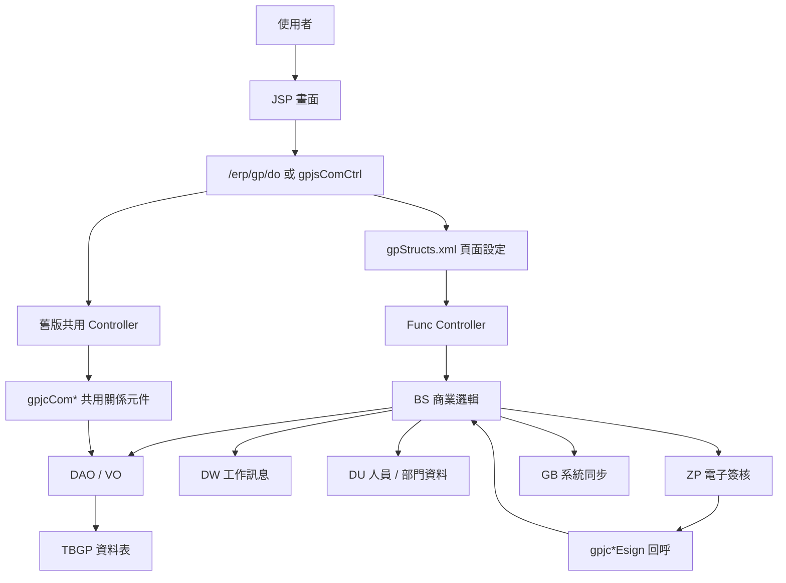
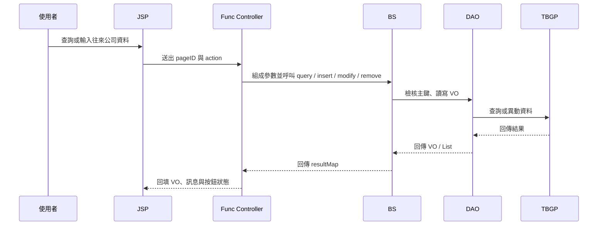
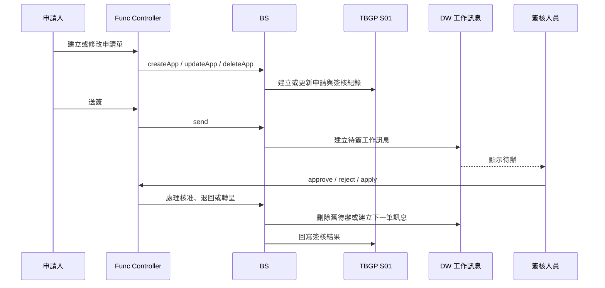

# GP 往來公司管理系統功能規格手冊

## 1. 系統概述

### 1.1 系統定位

`GP` 模組為 ERP 中的往來公司管理系統，負責維護公司或個人往來對象的主檔、統一編號／廠商編號、公司基本資料，以及依業務屬性延伸出的會計、商務、報支、資金管理、備標、協力廠商、採購與客戶等關係資料。

本系統提供單一往來公司主檔入口，讓使用者可先查詢或建立往來公司，再依該對象所屬關係切換至不同功能頁籤進行資料維護、查詢、送簽、簽核或同步。

### 1.2 使用對象

- 採購、資材、備標與承辦單位：維護採購關係、供應商資料、報支與銀行匯款資料。
- 會計與財務單位：維護會計關係、資金管理關係、付款／匯款資訊與審核作業。
- 業務與客戶管理單位：維護客戶關係與往來公司相關聯絡資料。
- 系統管理人員：維護關係分類、授權設定、資料選擇器與共用參數。
- 簽核主管：透過 ERP 工作訊息或簽核頁面處理送簽、核准與退回。

### 1.3 主要功能範圍

- 往來公司主檔查詢、新增、修改與刪除。
- 往來公司基本資料維護，包含公司代號、統一編號、中文名稱、英文名稱、簡稱、國別、資本額、營業額、負責人、分類與建檔異動資訊。
- 多種業務關係資料維護，包含會計關係、商務關係、報支關係、資金管理關係、備標關係、協力廠商關係、採購關係與客戶關係。
- 銀行匯款帳戶資料維護、異動申請、審核與工作訊息通知。
- 採購關係、報支關係、資金管理關係與客戶關係之申請單、送簽、簽核、退回與匯入作業。
- 採購關係英文銀行地址或相關補充資料同步至 `GB` 系統。
- 往來公司資料列印、模糊查詢、彈出選取視窗與關係樹瀏覽。
- 電子簽核回呼、簽核報表產生與簽核結果回寫。

### 1.4 系統邊界

`GP` 模組以往來公司資料為核心，主要資料表由 `TBGP` 系列表達，例如 `TBGP10`、`TBGP11`、`TBGP20`、`TBGP20A`、`TBGP20B`、`TBGP22`、`TBGP22B`、`TBGP24`、`TBGP25`、`TBGP26` 與 `TBGP S01`。系統會透過既有 ERP 共用元件處理使用者授權、資料來源、交易連線、畫面轉送、工作訊息與電子簽核。

與外部或其他模組的關係包含：

- `DE`：頁面控制、資料轉換、Functional Controller、連線與畫面導向。
- `DW`：ERP 工作訊息產生、刪除與通知。
- `DU`：使用者、部門、主管與簽核人員資料。
- `ZP`：電子簽核機制與簽核回呼。
- `GB`：採購關係之英文地址或銀行地址資料同步。
- 其他公司別或資料庫：部分關係資料具跨公司同步邏輯，但是否啟用須以實際程式註解與環境設定為準。

## 2. 系統架構總覽

### 2.1 目錄與程式分層

本模組主要由下列目錄組成：

| 目錄 | 說明 |
| --- | --- |
| `jsp/` | 使用者畫面、查詢頁、編輯頁、選取視窗、彈出視窗與檔案上傳頁。 |
| `config/yl/gp/gpStructs.xml` | `DE` 頁面設定，定義 `pageID`、JSP、Controller、Action 與 VO 轉換。 |
| `src/com/icsc/gp/func/` | 新式功能控制器，繼承 `dejcFunctionalController`，承接 `_action` 並呼叫商業服務。 |
| `src/com/icsc/gp/bs/` | 商業邏輯層，負責查詢、檢核、資料異動、申請單、簽核、工作訊息與同步。 |
| `src/com/icsc/gp/dao/` | 手寫 DAO 與 VO，對應 `TBGP` 系列資料表與特殊查詢。 |
| `src/com/icsc/gp/codegen/dao/`、`src/com/icsc/gp/codegen/entity/` | 程式產生的 DAO 與 Entity，提供基礎資料存取。 |
| `src/com/icsc/gp/list/` | 選擇器與清單查詢元件，供畫面彈窗或下拉選擇使用。 |
| `src/com/icsc/gp/web/` | WebMap 與基礎資料畫面工廠，支援舊版共用關係畫面。 |
| `src/com/icsc/gp/entity/`、`src/com/icsc/gp/tool/`、`src/com/icsc/gp/gpji/` | 共用工具、介面、日期、主鍵、簽核、報表與輔助 Entity。 |
| `src/com/chsteel/gp/esign/` | 電子簽核回呼類別，處理簽核報表與回寫作業。 |
| `xml/dr/` | 報表或資料列印設定。 |
| `html/` | 共用 JavaScript 或前端輔助檔。 |

### 2.2 整體邏輯架構

### 2.3 頁面控制架構

本模組同時存在兩種控制模式：

- 新式 `DE Functional Controller`：由 `config/yl/gp/gpStructs.xml` 將 `pageID` 對應到 `com.icsc.gp.func.*Func`，再依 `_action` 呼叫 `query`、`create`、`update`、`delete`、`send`、`approve`、`reject` 等方法。
- 舊式 `gpjsComCtrl` 共用控制器：由 `/erp/gp/gpjsComCtrl` 接收 `formAction`、`mapType`、`hidBtn` 等參數，負責主檔清單、關係樹、關係畫面、選擇器、列印與部分銀行匯款審核通知。

### 2.4 主要流程

#### 2.4.1 主檔與關係資料維護流程

#### 2.4.2 申請與簽核流程

### 2.5 共同資料模型

| 類別 / 資料表 | 用途 |
| --- | --- |
| `gpjctb10VO` / `TBGP10` | 往來公司基本資料。 |
| `gpjctb11VO` / `TBGP11` | 往來公司與各類關係代碼的關聯資料。 |
| `gpjctb20VO` / `TBGP20` | 採購關係資料。 |
| `gpjctb20aVO` / `TBGP20A` | 採購關係申請單資料。 |
| `gpjctb20bVO` / `TBGP20B` | 採購關係異動申請資料。 |
| `gpjctb21VO` / `TBGP21` | 備標關係資料。 |
| `gpjctb22VO` / `TBGP22` | 報支關係資料。 |
| `gpjctb22bVO` / `TBGP22B` | 銀行或匯款相關補充／申請資料。 |
| `gpjctb23VO` / `TBGP23` | 協力廠商關係資料。 |
| `gpjctb24VO` / `TBGP24` | 會計關係資料。 |
| `gpjctb25VO` / `TBGP25` | 資金管理關係資料。 |
| `gpjctb26VO` / `TBGP26` | 客戶關係資料。 |
| `gpjctbs01VO` / `TBGP S01` | 申請與簽核流程紀錄。 |
| `gpjcEcVO` | 商務關係或 EC 關係資料。 |

### 2.6 主要資料表

| 資料表 | VO／DAO | 功能定位 | 主要用途 | 關聯功能 |
| --- | --- | --- | --- | --- |
| `TBGP10` | `gpjctb10VO`／`gpjctb10DAO` | 往來公司基本主檔 | 保存公司別、往來公司編號、統一編號、中文名稱、英文名稱、簡稱、國別、分類、建檔與異動資訊。 | 往來公司主入口、各關係模組共同參照。 |
| `TBGP11` | `gpjctb11VO`／`gpjctb11DAO` | 往來公司關係對照表 | 保存往來公司與關係代碼的對應資料，用來判斷該公司具備哪些業務關係。 | 關係樹、基本資料、會計、報支、採購、客戶等關係維護。 |
| `TBGP20` | `gpjctb20VO`／`gpjctb20DAO` | 採購關係主檔 | 保存供應商／採購往來所需欄位、停止期間、聯絡與採購屬性。 | 採購關係、具送簽功能的採購關係、採購資料同步。 |
| `TBGP20A` | `gpjctb20aVO`／`gpjctb20aDAO` | 採購關係申請單 | 保存送簽前後的申請內容、建立人員、有效狀態與申請單主鍵。 | 採購關係申請、送簽、核准、退回、轉呈。 |
| `TBGP20B` | `gpjctb20bVO`／`gpjctb20bDAO` | 採購關係異動申請明細 | 保存採購關係異動前後或待審資料。 | `gpjj001ha` 採購異動、`gpjj004a` 採購關係異動維護。 |
| `TBGP21` | `gpjctb21VO`／`gpjctb21DAO` | 備標關係主檔 | 保存往來公司於備標或投標前置作業所需屬性。 | 備標關係維護。 |
| `TBGP22` | `gpjctb22VO`／`gpjctb22DAO` | 報支關係主檔 | 保存付款、匯款、報支及銀行帳戶相關主資料。 | 報支關係、銀行匯款資料審核。 |
| `TBGP22B` | `gpjctb22bVO`／`gpjctb22bDAO` | 銀行／匯款申請明細 | 保存銀行或匯款相關補充資料，可保存多筆帳戶或申請明細。 | 報支關係第二版本、資金管理關係、客戶關係之申請與匯入。 |
| `TBGP23` | `gpjctb23VO`／`gpjctb23DAO` | 協力廠商關係主檔 | 保存往來公司作為協力廠商時的關係資料。 | 協力廠商關係維護。 |
| `TBGP24` | `gpjctb24VO`／`gpjctb24DAO` | 會計關係主檔 | 保存往來公司在會計處理上所需屬性。 | 會計關係維護。 |
| `TBGP25` | `gpjctb25VO`／`gpjctb25DAO` | 資金管理關係主檔 | 保存資金關係、交易類型、聯絡與匯款相關資訊。 | 資金管理關係維護與送簽。 |
| `TBGP26` | `gpjctb26VO`／`gpjctb26DAO` | 客戶關係主檔 | 保存往來公司作為客戶時的聯絡、交易與備註資料。 | 客戶關係維護與送簽。 |
| `TBGPS01` | `gpjctbs01VO`／`gpjctbs01DAO` | GP 申請與簽核流程紀錄 | 保存 `FORKEY`、簽核人員、簽核狀態、有效狀態與 `DW` 工作訊息識別。 | 報支、採購、資金管理、客戶關係之送簽、核准、退回與轉呈。 |
| `TBGP28` / `TBGP281` / `TBGP29` | `gpjcYL28VO`／`gpjcYL28DAO`、`gpjcYL281VO`／`gpjcYL281DAO`、`gpjcYL29VO`／`gpjcYL29DAO` | 公司別客製化維護資料 | 保存公司別客製化或供應商相關維護資料。 | `gpjj28Edit`、`gpjj281Edit`、`gpjjyl2901Edit` 等客製化維護頁。 |

## 3. 功能模組詳細說明

### 3.1 往來公司主入口與基本資料

| 項目 | 說明 |
| --- | --- |
| 代表頁面 | `gpjj001.jsp`、`gpjj001a.jsp`、`gpjj001Search.jsp`、`gpjj001Popup.jsp`、`gpjj001aList.jsp` |
| Controller | `gpjc001aFunc`、`gpjsComCtrl`、`gpjcComBase` |
| 主要 VO | `gpjctb10VO`、`gpjcBase` |
| 主要操作 | 查詢、新增、修改、刪除、頁籤切換、彈出查詢、主檔列印 |

本功能為往來公司資料維護的主入口。使用者可依公司別、廠商編號、統一編號、公司名稱、簡稱、國別、分類或建檔人員查詢資料，並可新增或維護公司基本資料。主畫面會透過多個隱藏表單載入不同關係頁籤，例如會計、商務、報支、資金管理、備標、協力廠商、採購與客戶。

基本資料維護包含公司代號、往來公司編號、統一編號、中文名稱、英文名稱、簡稱、國別、負責人、分類、資本額、營業額與異動資訊。新增或刪除主檔時，系統需維持主檔與關係資料的一致性。

### 3.2 會計關係

| 項目 | 說明 |
| --- | --- |
| 代表頁面 | `gpjj001b.jsp` |
| Controller | `gpjc001bFunc` |
| BS | `gpjc001bBs` |
| 主要 VO | `gpjctb24VO` |
| 主要操作 | 查詢、新增、修改、刪除 |

會計關係用於維護往來公司在會計處理上的相關屬性，例如帳務分類、會計關係代碼或其他會計處理所需欄位。使用者必須先選定往來公司主檔，再進入會計關係頁籤進行維護。

### 3.3 商務關係

| 項目 | 說明 |
| --- | --- |
| 代表頁面 | `gpjj001c.jsp`、`gpjjComEC.jsp` |
| Controller | `gpjc001cFunc`、`gpjcComEC` |
| BS / 元件 | `gpjc001cBs`、`gpjcComEC` |
| 主要 VO | `gpjcEcVO` |
| 主要操作 | 查詢、新增、修改、刪除、取消 |

商務關係用於維護往來公司在商務或電子商務相關流程中的資料。系統提供 `EC` 關係頁面與共用元件，讓使用者可依關係資料進行建立、修改、刪除與查詢。

### 3.4 報支關係

| 項目 | 說明 |
| --- | --- |
| 代表頁面 | `gpjj001d.jsp`、`gpjj001dA.jsp` |
| Controller | `gpjc001dFunc`、`gpjc001dAFunc` |
| BS | `gpjc001dBs`、`gpjc001dABs` |
| 電子簽核 | `gpjc001dAEsign` |
| 主要 VO | `gpjctb22VO`、`gpjctb22bVO`、`gpjctbs01VO` |
| 主要操作 | 查詢、新增、修改、刪除、申請、建立申請單、送簽、核准、退回、匯入 |

報支關係維護往來公司報支、匯款或付款所需資料。原始版本由 `gpjj001d` 與 `gpjc001dFunc` 處理；第二版本 `gpjj001dA` 增加申請單與簽核流程，並使用 `TBGP22B` 保存多筆銀行或匯款相關申請資料。

第二版本支援 `createApp`、`updateApp`、`deleteApp`、`send`、`approve`、`reject`、`importSingle` 與 `importAll`。當資料需要送簽時，系統會建立 `TBGP S01` 簽核紀錄並透過 `DW` 建立工作訊息。電子簽核回呼由 `gpjc001dAEsign` 處理，回呼後再呼叫對應 BS 完成資料重查、簽核狀態回寫與報表產生。

### 3.5 資金管理關係

| 項目 | 說明 |
| --- | --- |
| 代表頁面 | `gpjj001e.jsp` |
| Controller | `gpjc001eFunc` |
| BS | `gpjc001eBs`、`gpjc001eA` |
| 電子簽核 | `gpjc001eEsign` |
| 主要 VO | `gpjctb25VO`、`gpjctb22bVO` |
| 主要操作 | 查詢、新增、修改、刪除、建立申請單、送簽、匯入 |

資金管理關係用於維護往來公司與資金管理有關的資料，例如資金關係、交易類型、聯絡資訊與匯款資料。此模組同樣具備申請單與送簽機制，可將銀行帳戶或資金管理異動送出審核。

### 3.6 備標關係

| 項目 | 說明 |
| --- | --- |
| 代表頁面 | `gpjj001f.jsp` |
| Controller | `gpjc001fFunc` |
| BS | `gpjc001fBs` |
| 主要 VO | `gpjctb21VO` |
| 主要操作 | 查詢、新增、修改、刪除 |

備標關係維護往來公司在備標或投標前置作業中的相關屬性。此功能以單純資料維護為主，提供標準新增、修改、刪除與查詢。

### 3.7 協力廠商關係

| 項目 | 說明 |
| --- | --- |
| 代表頁面 | `gpjj001g.jsp` |
| Controller | `gpjc001gFunc` |
| BS | `gpjc001gBs` |
| 主要 VO | `gpjctb23VO` |
| 主要操作 | 查詢、新增、修改、刪除 |

協力廠商關係維護往來公司作為協力廠商時的資料。系統在新增或刪除該關係時，需同步維持 `TBGP11` 關係資料，確保主檔關係樹與各關係頁籤一致。

### 3.8 採購關係

| 項目 | 說明 |
| --- | --- |
| 代表頁面 | `gpjj001h.jsp`、`gpjj001ha.jsp`、`gpjj004a.jsp` |
| Controller | `gpjc001hFunc`、`gpjc001haFunc`、`gpjc004Func` |
| BS | `gpjc001hBs` |
| 電子簽核 | `gpjc004Esign` |
| 主要 VO | `gpjctb20VO`、`gpjctb20aVO`、`gpjctb20bVO`、`gpjctbs01VO`、`gpjctb20VOExt` |
| 主要操作 | 查詢、新增、修改、刪除、建立申請單、送簽、轉呈、核准、退回、同步 `GB`、異動申請 |

採購關係是本系統較完整的流程模組。基本採購關係資料保存在 `TBGP20`，申請單保存在 `TBGP20A`，採購關係異動申請保存在 `TBGP20B`，簽核紀錄保存在 `TBGP S01`。`gpjj001h` 提供採購關係維護與送簽，`gpjj001ha` 為具送簽功能的採購關係版本，`gpjj004a` 則負責採購關係異動維護。

主要規則包含：

- 新增採購關係時，系統會檢查資料是否已存在，並建立對應關係資料。
- 修改採購關係時，會記錄異動人員與異動日期時間，並可維護英文地址或銀行地址補充資料。
- 刪除採購關係時，需同步移除對應關係資料。
- 送簽時，系統依輸入的簽核人員建立 `DW` 工作訊息與 `TBGP S01` 簽核紀錄。
- 核准、退回或轉呈時，系統會更新目前簽核紀錄、刪除原工作訊息，必要時建立下一筆工作訊息。
- `syngb` 可將採購關係相關英文地址資料同步至 `GB` 系統。

### 3.9 客戶關係

| 項目 | 說明 |
| --- | --- |
| 代表頁面 | `gpjj001i.jsp` |
| Controller | `gpjc001iFunc` |
| BS | `gpjc001iBs` |
| 電子簽核 | `gpjc001iEsign` |
| 主要 VO | `gpjctb26VO`、`gpjctb22bVO` |
| 主要操作 | 查詢、新增、修改、刪除、建立申請單、送簽、匯入 |

客戶關係維護往來公司作為客戶時的資料，例如客戶名稱、聯絡資訊、客戶備註與相關交易資料。此模組提供一般資料維護，也支援申請單、送簽與匯入作業。

### 3.10 申請與簽核查詢

| 項目 | 說明 |
| --- | --- |
| 代表頁面 | `gpjj002a.jsp`、`gpjj002b.jsp` |
| Controller | `gpjc002aFunc`、`gpjc002bFunc` |
| BS | `gpjc002aBs`、`gpjc002bBs` |
| 主要 VO | `gpjctbs01VO`、`gpjctb22bVO` |
| 主要操作 | 查詢、送簽、轉呈、核准、退回 |

`gpjj002a` 主要提供簽核資料查詢，`gpjj002b` 則提供送簽、核准、退回與轉呈等簽核操作。此功能以 `TBGP S01` 為核心，負責查詢與更新申請單目前簽核狀態。

### 3.11 往來公司資料查詢與報表

| 項目 | 說明 |
| --- | --- |
| 代表頁面 | `gpjj003a.jsp`、`gpjjComPrint.jsp`、`xml/dr/gpjr*.xml` |
| Controller | `gpjc003aFunc`、`gpjsComCtrl` |
| BS / 報表 | `gpjc003aBs`、`gpjcE0R02820Gen`、`gpjcE0R02820Rpt` |
| 主要 VO | `gpjc003VO`、`gpjcE0R02820Form` |
| 主要操作 | 查詢、列印、報表產生 |

此功能提供往來公司相關資料的查詢與列印。`gpjsComCtrl` 的列印流程會依查詢條件取得主檔清單，再轉送至列印頁；報表程式與 `xml/dr` 設定則支援系統內特定報表輸出。

### 3.12 銀行匯款資料審核

| 項目 | 說明 |
| --- | --- |
| 代表頁面 | `gpjjVerifyFC.jsp` |
| Controller | `gpjsComCtrl`、`gpjc28CR` |
| 主要 DAO | `gpjcFCDAO`、`gpjcRelationDAO`、`gpjctbs01DAO` |
| 主要操作 | 匯款資料審核、確認、退回、工作訊息通知 |

銀行匯款資料審核用於處理報支或付款相關銀行帳戶資料的確認流程。系統會依不同銀行帳戶欄位更新 `TBGP22` 對應匯款戶名、銀行與帳號資料，並透過 `DW` 工作訊息通知指定審核人員。退回時，系統會清理或調整待審標記，並刪除對應工作流程訊息。

### 3.13 舊版共用關係維護

| 項目 | 說明 |
| --- | --- |
| 代表頁面 | `gpjjCom.jsp`、`gpjjComBase.jsp`、`gpjjComTree.jsp`、`gpjjComList.jsp`、`gpjjRelMan.jsp` |
| Controller | `gpjsComCtrl` |
| 元件 | `gpjcComMAP`、`gpjcComBase`、`gpjcComTree`、`gpjcRelMan` |
| 主要操作 | 主檔列表、關係樹、關係頁面開啟、關係設定維護 |

此功能為較早期的通用往來公司關係維護機制。`gpjcComMAP` 定義 `BASE`、`AA`、`CL`、`FC`、`FF`、`KC`、`KE`、`MP`、`SO`、`ST`、`MT`、`ST1`、`ST2`、`MW`、`MPP`、`EC` 等關係代碼，並以 `gpjcAuth` 決定各關係頁面 URL、授權群組與控制類別。

### 3.14 選擇器與彈出查詢

| 項目 | 說明 |
| --- | --- |
| 代表頁面 | `gpjjFCSelect.jsp`、`gpjjFFSelect.jsp`、`gpjjSOSelect.jsp`、`gpjjComSel.jsp`、`gpjjComSOQuery.jsp`、`gpjjComMPQuery.jsp` |
| Controller | `gpjsComCtrl` |
| 元件 | `gpjcSelectorFactory`、`gpjiSelector`、各類 `*Selector` 與 `*Helper` |
| 主要操作 | 關係資料選取、模糊查詢、彈出視窗回填 |

選擇器負責提供其他 ERP 畫面或本模組畫面查詢往來公司及其關係資料。`gpjsComCtrl` 依 `hidBtn` 或 `GP_REL` 決定要啟用的 selector，並將查詢結果轉換為畫面可顯示的 selector view。

### 3.15 供應商與特殊維護功能

| 項目 | 說明 |
| --- | --- |
| 代表頁面 | `gpjj28.jsp`、`gpjj28Edit.jsp`、`gpjj281Edit.jsp`、`gpjjyl29.jsp`、`gpjjyl2901Edit.jsp`、`gpjjylComp.jsp` |
| Controller | `gpjc28CR`、`gpjc281CR`、`gpjc29CR`、`gpjcCompCR` |
| 主要 VO | `gpjcYL28VO`、`gpjcYL281VO`、`gpjcYL29VO` |
| 主要操作 | 查詢、新增、修改、刪除、稅籍查詢、取消、測試報表 |

此群功能屬於公司別或客製化維護頁面，包含往來公司資料查詢、供應商資料維護、稅籍資料查詢、廠商資料彈出視窗與特定報表測試。這些頁面多透過 `gpStructs.xml` 對應到 `gpjc28CR`、`gpjc281CR`、`gpjc29CR` 或 `gpjcCompCR`。

### 3.16 檔案上傳與輔助頁

| 項目 | 說明 |
| --- | --- |
| 代表頁面 | `gpjjFileUpload.jsp`、`gpjjModifyFC.jsp`、`gpjjModifyRel.jsp`、`gpjjRecoverBase.jsp` |
| 主要操作 | 檔案上傳、資料修復、關係補建、基本資料回復 |

輔助頁面提供檔案上傳、資料修復與關係補建功能。這類頁面通常由特定業務流程或維護作業呼叫，不一定會出現在一般使用者主選單中。

### 3.17 權限與按鈕控制

本系統同時使用共用授權與各功能自訂授權群組控制畫面按鈕。舊版共用關係由 `gpjcAuthDAO` 取得關係代碼對應的 URL、查詢授權群組、維護授權群組與控制類別；新式 Func 則常透過 `gpjcAuthorize` 判斷使用者是否可操作特定群組，例如採購關係的操作群組。

畫面通常依授權結果控制新增、修改、刪除、同步或送簽按鈕是否啟用；若使用者無權限，系統會回傳訊息並停用相關操作。

### 3.18 主要頁面與控制對照

| Page ID | JSP | Controller | 功能摘要 |
| --- | --- | --- | --- |
| `gpjj001a` | `gpjj001a.jsp` | `gpjc001aFunc` | 往來公司基本資料。 |
| `gpjj001b` | `gpjj001b.jsp` | `gpjc001bFunc` | 會計關係。 |
| `gpjj001c` | `gpjj001c.jsp` | `gpjc001cFunc` | 商務關係。 |
| `gpjj001d` | `gpjj001d.jsp` | `gpjc001dFunc` | 報支關係。 |
| `gpjj001da` | `gpjj001dA.jsp` | `gpjc001dAFunc` | 報支關係第二版本與簽核。 |
| `gpjj001e` | `gpjj001e.jsp` | `gpjc001eFunc` | 資金管理關係。 |
| `gpjj001f` | `gpjj001f.jsp` | `gpjc001fFunc` | 備標關係。 |
| `gpjj001g` | `gpjj001g.jsp` | `gpjc001gFunc` | 協力廠商關係。 |
| `gpjj001h` | `gpjj001h.jsp` | `gpjc001hFunc` | 採購關係。 |
| `gpjj001ha` | `gpjj001ha.jsp` | `gpjc001haFunc` | 具送簽功能的採購關係。 |
| `gpjj001i` | `gpjj001i.jsp` | `gpjc001iFunc` | 客戶關係。 |
| `gpjj002a` | `gpjj002a.jsp` | `gpjc002aFunc` | 簽核資料查詢。 |
| `gpjj002b` | `gpjj002b.jsp` | `gpjc002bFunc` | 簽核送簽、核准、退回與轉呈。 |
| `gpjj003a` | `gpjj003a.jsp` | `gpjc003aFunc` | 往來公司資料查詢。 |
| `gpjj004a` | `gpjj004a.jsp` | `gpjc004Func` | 採購關係異動維護。 |
| `gpjj28Edit` | `gpjj28Edit.jsp` | `gpjc28CR` | 客製化維護與稅籍查詢。 |
| `gpjj281Edit` | `gpjj281Edit.jsp` | `gpjc281CR` | 客製化維護、重載與報表測試。 |
| `gpjj29Edit` | `gpjjyl2901Edit.jsp` | `gpjc29CR` | 客製化資料維護。 |
| `gpjjEC` | `gpjjComEC.jsp` | `gpjcComEC` | EC / 商務關係維護。 |
| `gpjjylCompEdit` | `gpjjylCompEdit.jsp` | `gpjcCompCR` | 往來公司資料查詢。 |

### 3.19 常用 Action 說明

| Action | 方法 | 說明 |
| --- | --- | --- |
| `I` | `query` | 查詢資料。 |
| `N` | `create` | 新增資料。 |
| `R` | `update` | 修改資料。 |
| `D` | `delete` | 刪除資料。 |
| `NA` | `createApp` | 建立申請單。 |
| `RA` | `updateApp` | 修改申請單。 |
| `DA` | `deleteApp` | 刪除申請單。 |
| `S` | `send` | 送簽或送出申請。 |
| `AP` | `apply` | 轉呈或續送下一關。 |
| `A` | `approve` | 核准。 |
| `RT` / `R` / `Re` | `reject` | 退回。 |
| `IS` | `importSingle` | 單筆匯入。 |
| `IA` | `importAll` | 全部匯入。 |
| `SYNGB` | `syngb` | 同步資料至 `GB` 系統。 |
| `C` | `billCancel` / `change` | 取消或異動申請，依頁面定義不同。 |

### 3.20 文件依據與注意事項

本手冊依目前程式目錄、`gpStructs.xml` 頁面設定、`func`、`bs`、`dao`、`esign`、`jsp` 與 `xml/dr` 檔案交叉整理。部分 JSP 與 Java 原始碼為 `BIG5` 編碼，若以 UTF-8 終端直接檢視，中文註解可能顯示為亂碼；正式審查時建議使用可正確讀取 `BIG5` 的編輯器重新核對畫面文字與欄位標籤。

本文件定位為功能規格整理稿，重點在建立系統功能輪廓、流程與模組對照。若要作為開發異動或驗收文件，需再逐頁比對實際畫面欄位、資料表欄位、權限設定與公司別客製差異。
