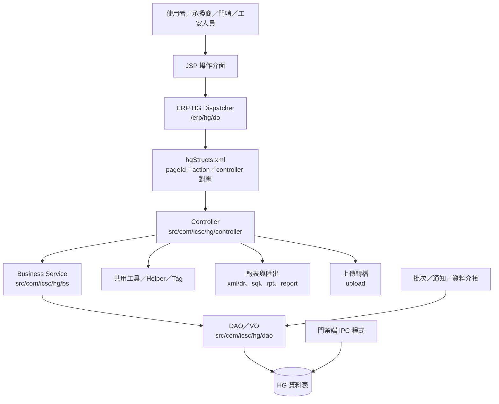
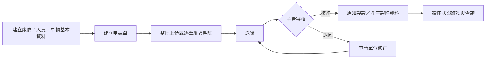
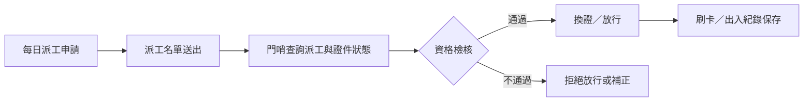
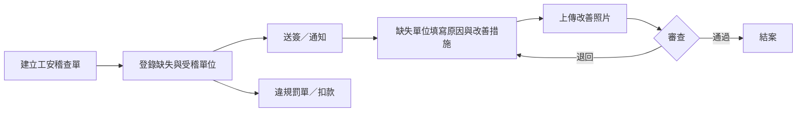

# 中鴻鋼鐵 ERP 系統 HG 模組功能規格手冊

## 1. 系統概述

### 1.1 系統定位

HG 模組為中鴻鋼鐵 ERP 系統中的「門禁與承攬商安全衛生管理系統」，主要支援承攬商進出廠、工作證／通行證申請、門哨放行、派工管制、高風險作業提報、工安稽查、缺失矯正、違規罰單、證照管理、保險刷卡勾稽與教育訓練等作業。

本系統的核心目的，是將承攬商從「廠商建檔、入廠資格審核、每日派工、現場放行、施工風險管制、稽查改善、違規追蹤」串成可查詢、可簽核、可稽核的完整管理流程。

### 1.2 使用對象

| 使用角色 | 主要使用情境 |
| :--- | :--- |
| 承辦單位／申請單位 | 建立承攬商資料、提出人力需求、工作證、通行證、派工與高風險作業申請。 |
| 主管／簽核人員 | 審核各類申請單、稽查單、矯正單與違規罰單，執行核准、退回、撤簽等流程。 |
| 行政處／製證單位 | 接收核准後之工作證與車輛通行證資料，進行製證、換發、遺失、註銷與證件狀態管理。 |
| 警衛室／門哨人員 | 依派工與證件狀態進行現場身分驗證、換證、放行、繳證與退回作業。 |
| 工安／安衛人員 | 維護高風險作業、工安稽查、矯正措施、違規罰單、證照與教育訓練資料。 |
| 系統管理／資料維護人員 | 維護代碼、參數、報表、資料匯入與批次介接相關資料。 |

### 1.3 系統範圍

本手冊依目前專案目錄、JSP 頁面、Controller、DAO、報表 XML 與 SQL 檔整理，涵蓋下列範圍：

1. 承攬商、承攬商人員與車輛基本資料管理。
2. 長期工作證、臨時工作證、車輛通行證與承租工作證申請。
3. 申請單線上送簽、核准、退回、撤回、列印與整批上傳。
4. 每日派工與門哨即時放行作業。
5. 高風險作業設定、每日提報、簽核與報表產製。
6. 工安稽查、水平追溯、矯正預防、改善照片與違規罰單管理。
7. 安全工作程序與特殊作業證照管理。
8. 出勤刷卡、投保資料勾稽與門禁端通訊程式。
9. 工安教育訓練課程、名冊、效期與複訓管理。
10. 管理報表、逾期清單、警示通知與批次資料轉檔。

### 1.4 主要資料來源

| 資料類型 | 專案位置 | 說明 |
| :--- | :--- | :--- |
| 頁面定義 | `jsp/` | 使用者操作畫面，包含查詢、主檔、明細、申請、簽核、報表與上傳頁面。 |
| 流程與頁面映射 | `config/yl/hg/hgStructs.xml` | 定義 `_pageId`、Controller、Action flag、轉頁與 Value Object 對應。 |
| 控制器 | `src/com/icsc/hg/controller/` | 處理頁面請求、查詢、新增、修改、刪除、送簽、核准、退回、列印、上傳等行為。 |
| 商業邏輯 | `src/com/icsc/hg/bs/` | 申請單、資料檢核、流程操作等共用商業規則。 |
| 資料存取 | `src/com/icsc/hg/dao/` 與 `dao/` | DAO／VO 與資料表定義檔。 |
| 報表 | `xml/dr/` 與 `sql/` | DataReport XML 報表與固定 SQL 報表查詢。 |
| 上傳轉檔 | `src/com/icsc/hg/upload/` | Excel、CSV、照片與申請資料上傳處理。 |
| 批次與通知 | `src/com/icsc/hg/`、`src/com/icsc/hg/di/` | 逾期通知、保險 Email、刷卡轉檔、資料發布與同步批次。 |
| 門禁端程式 | `ipc/`、`中鴻門禁程式版本4.exe` | 門禁現場通訊、讀卡、聲音、燈號與 Socket 連線程式。 |

## 2. 系統架構總覽

### 2.1 邏輯架構

### 2.2 程式分層

| 分層 | 對應目錄 | 職責 |
| :--- | :--- | :--- |
| 展示層 | `jsp/` | 提供畫面輸入、查詢條件、清單、明細、頁籤、彈窗、報表與上傳入口。 |
| 請求控制層 | `src/com/icsc/hg/controller/` | 依 Action flag 執行查詢、建立、修改、刪除、送簽、核准、退回、列印與轉頁。 |
| 商業邏輯層 | `src/com/icsc/hg/bs/` | 處理申請流程、資料檢核、簽核規則、資料異動與跨表邏輯。 |
| 資料存取層 | `src/com/icsc/hg/dao/` | 封裝資料表 DAO 與 VO，提供查詢與更新資料表的介面。 |
| 共用工具層 | `src/com/icsc/hg/tool/`、`helper/`、`tag/` | 提供參數、報表、權限、流程、下拉選單、視圖輔助與共用檢核功能。 |
| 報表層 | `src/com/icsc/hg/rpt/`、`report/`、`xml/dr/`、`sql/` | 產製清單、統計、逾期、稽核、罰單與 Excel 報表。 |
| 匯入層 | `src/com/icsc/hg/upload/` | 處理照片、Excel、CSV 與各類申請資料整批匯入。 |
| 批次／介接層 | `src/com/icsc/hg/di/` 與 `src/com/icsc/hg/hgjc*.java` | 執行資料發布、刷卡／保險轉檔、通知信、逾期提醒與資料同步。 |
| 現場門禁層 | `ipc/`、門禁 EXE／JAR | 負責讀卡、燈號、聲音、Socket 與門禁硬體通訊。 |

### 2.3 主要作業流程

#### 2.3.1 工作證／通行證申請流程

#### 2.3.2 派工與門哨放行流程

#### 2.3.3 工安稽查與矯正流程

## 3. 功能模組詳細說明

### 3.1 A 模組：基本資料管理

| 功能代碼 | 功能名稱 | 主要頁面／程式 | 功能說明 |
| :--- | :--- | :--- | :--- |
| A01 | 廠商基本資料管理 | `hgjja01.jsp`、`hgjja01Company.jsp`、`hgjca01Company.java` | 維護承攬商廠商基本資料，包含廠商編號、名稱、簡稱、聯絡資料與狀態，支援查詢、新增、修改、刪除與重載。 |
| A02 | 承攬商人員資料管理 | `hgjja02.jsp`、`hgjja02Staff.jsp`、`hgjca02Staff.java` | 維護承攬商人員身分資料、辦證資料、照片與相關進廠資格，支援整批上傳。 |
| A02-Invalid | 違規／失效人員資料 | `hgjja02Invalid.jsp`、`hgjca02Invalid.java` | 管理失效、停權或違規相關人員資料，並可產製報表。 |
| A03 | 車輛基本資料管理 | `hgjja03.jsp`、`hgjja03Vehicle.jsp`、`hgjca03Vehicle.java` | 維護承攬商車輛資料，包含車牌、車種、車主與車輛狀態。 |
| A04 | 關懷信作業 | `hgjja04.jsp`、`hgjja04Master.jsp`、`hgjja04Print.jsp`、`hgjca04.java` | 維護與列印關懷信資料，可依生效日進行整批處理。 |
| A05 | 課長工作內容清單 | `hgjja05.jsp`、`hgjca05.java` | 維護課長工作內容清單，提供查詢、更新與列印。 |

### 3.2 B 模組：工作證與通行證申請管理

| 功能代碼 | 功能名稱 | 主要頁面／程式 | 功能說明 |
| :--- | :--- | :--- | :--- |
| B01 | 承攬商人力需求申請 | `hgjjb01.jsp`、`hgjjb01Apply.jsp`、`hgjjb01Approve.jsp`、`hgjcb01Apply.java`、`hgjcb01Approve.java` | 建立人力需求申請，支援新增、修改、刪除、送簽、撤回、列印、上傳與主管審核。 |
| B02 | 長期工作證申請 | `hgjjb02.jsp`、`hgjjb02Apply.jsp`、`hgjjb02Staff.jsp`、`hgjcb02Apply.java` | 承攬商人員長期工作證申請，支援人員明細維護、整批上傳、全選處理、通知製證與資料清除。 |
| B03 | 臨時工作證申請 | `hgjjb03.jsp`、`hgjjb03Apply.jsp`、`hgjjb03Staff.jsp`、`hgjcb03Apply.java` | 短期進廠人員臨時工作證申請，支援明細維護、複製申請、整批上傳與送簽。 |
| B04 | 車輛通行證申請 | `hgjjb04.jsp`、`hgjjb04Apply.jsp`、`hgjjb04Vehicle.jsp`、`hgjcb04Apply.java` | 承攬商車輛進廠通行證申請，支援車輛明細維護、送簽、列印、上傳與通知。 |
| B05 | 臨時通行證申請 | `hgjjb05.jsp`、`hgjjb05Apply.jsp`、`hgjcb05Apply.java` | 管理臨時性人員或訪客通行證申請，提供建立、修改、刪除、送簽、撤回與上傳。 |
| B06 | 證件狀態異動 | `hgjjb06.jsp`、`hgjjb06Staff.jsp`、`hgjjb06Vehicle.jsp`、`hgjcb06Staff.java`、`hgjcb06Vehicle.java` | 處理工作證與車證之繳回、遺失、毀損、註銷與逾期狀態。 |
| B07 | 工作證查詢 | `hgjjb07.jsp`、`hgjjb07List.jsp`、`hgjcb07List.java` | 查詢承攬商工作證申請與核發資料，支援清單列印。 |
| B08 | 工作證歷史查詢 | `hgjjb08.jsp`、`hgjjb08List.jsp`、`hgjcb08List.java` | 查詢工作證歷史資料與統計清單，支援列印或匯出。 |
| B09 | 臨時通行證查詢 | `hgjjb09.jsp`、`hgjjb09List.jsp`、`hgjcb09List.java` | 查詢臨時通行證申請與使用紀錄，支援列印。 |
| B10 | 出入證基本資料維護 | `hgjjb10.jsp`、`hgjjb10Edit.jsp`、`hgjcb10Edit.java` | 維護出入證相關代碼、卡別、卡片狀態與基本設定。 |
| B11 | 承租工作證申請 | `hgjjb11.jsp`、`hgjjb11Apply.jsp`、`hgjjb11Staff.jsp`、`hgjcb11Apply.java` | 承租廠商人員工作證申請，支援人員明細、照片上傳、送簽、通知與複製申請。 |

### 3.3 C 模組：派工與門哨放行管理

| 功能代碼 | 功能名稱 | 主要頁面／程式 | 功能說明 |
| :--- | :--- | :--- | :--- |
| C01 | 承攬商派工申請 | `hgjjc01.jsp`、`hgjjc01Apply.jsp`、`hgjcc01Apply.java` | 建立每日派工申請，維護進廠人員名單，支援新增、修改、刪除、送簽、撤回、上傳與複製。 |
| C02 | 派工臨時通行證查詢 | `hgjjc02.jsp`、`hgjjc02List.jsp`、`hgjcc02List.java` | 查詢派工對應之臨時通行證與進廠資料。 |
| C03 | 門哨放行作業 | `hgjjc03.jsp`、`hgjjc03A.jsp`、`hgjjc03B.jsp`、`hgjjc03C.jsp` | 門哨現場依人員、證件與派工資料進行查詢、換證、取消換證、繳回與退回。 |
| C06 | 臨時通行證維護 | `hgjjc06.jsp`、`hgjjc06List.jsp`、`hgjjc06Modify.jsp` | 查詢與維護臨時通行證資料，支援資料補正與清單處理。 |
| C07 | 出入紀錄查詢 | `hgjjc07.jsp`、`hgjcc07.java` | 查詢門禁出入、放行與刷卡歷史紀錄。 |

### 3.4 F 模組：高風險作業管理

| 功能代碼 | 功能名稱 | 主要頁面／程式 | 功能說明 |
| :--- | :--- | :--- | :--- |
| F01 | 高風險工作設定 | `hgjjf01.jsp`、`hgjjf01Master.jsp`、`hgjcf01.java` | 依合約、訂購單或施工內容設定高風險工作項目、承辦單位與相關安衛資料。 |
| F02 | 高風險作業每日提報 | `hgjjf02.jsp`、`hgjjf02Master.jsp`、`hgjjf02d.jsp`、`hgjcf02.java` | 維護每日高風險作業提報內容、施工人員、施工地點、特殊作業別與簽核狀態。 |
| F02-Appr | 高風險作業簽核 | `hgjjf02Appr.jsp`、`hgjcf02Appr.java` | 處理高風險作業提報單之核准、退回與簽核意見。 |
| F02-Rpt | 高風險作業報表 | `hgjjf02t.jsp`、`hgjjf02d.jsp`、`hgjcf02t.java`、`hgjcf02d.java` | 產製高風險作業提報清單與勞檢相關報表。 |
| F03 | 高風險作業稽查清單 | `hgjjf03.jsp`、`hgjjf03CheckList.jsp`、`hgjjf03SafeList.jsp` | 查詢每日高風險作業稽查與安全照護清單。 |
| F04 | 高風險作業每日維護 | `hgjjf04.jsp`、`hgjjf04Master.jsp`、`hgjjf04List.jsp`、`hgjcf04.java` | 維護每日高風險作業資料、簽核流程與未簽核狀態追蹤。 |

### 3.5 G 模組：工安稽查、矯正與罰單管理

| 功能代碼 | 功能名稱 | 主要頁面／程式 | 功能說明 |
| :--- | :--- | :--- | :--- |
| G01 | 工安稽查登錄 | `hgjjg01.jsp`、`hgjjg01d.jsp`、`hgjjg01Appr.jsp`、`hgjcg01.java` | 建立工安稽查單，維護查核缺失、受稽單位、改善要求與簽核資料。 |
| G01-Pass | 稽查單放行／通過處理 | `hgjjg01Pass.jsp`、`hgjcg01Pass.java` | 處理稽查單相關通過、放行或流程後續動作。 |
| G01-Export | 稽查資料匯出 | `hgjjg01Exl1.jsp`、`hgjcg01Exl1.java` | 匯出工安稽查相關資料。 |
| G02 | 巡檢水平追溯 | `hgjjg02.jsp`、`hgjjg02List.jsp`、`hgjjg02Master.jsp`、`hgjcg02.java` | 針對稽查缺失進行水平展開追溯，追蹤相同風險於其他區域或單位的改善情形。 |
| G03 | 合約與稽核查詢 | `hgjjg03.jsp`、`hgjcg03.java` | 依合約、廠商或條件查詢工安稽核執行狀況。 |
| G04 | 矯正措施追蹤 | `hgjjg04.jsp`、`hgjjg04List.jsp`、`hgjjg04Appr.jsp`、`hgjcg04.java` | 維護原因分析、矯正措施、預防措施、完成日期與簽核結案。 |
| G04-Mail | 矯正催辦通知 | `hgjjg04Mail.jsp`、`hgjcg04Mail.java` | 對未完成或需補正之矯正單發送通知或重送提醒。 |
| G05 | 違規罰單與扣款 | `hgjjg05.jsp`、`hgjjg05Appr.jsp`、`hgjcg05.java` | 建立承攬商違規罰單，管理違規項目、扣點、扣款與簽核。 |
| G06 | 改善照片上傳 | `hgjjg06.jsp`、`hgjjg06Upload.jsp`、`hgjcg06Upload.java` | 上傳缺失改善照片，支援改善前後佐證與審查。 |

### 3.6 K 模組：安全程序與證照管理

| 功能代碼 | 功能名稱 | 主要頁面／程式 | 功能說明 |
| :--- | :--- | :--- | :--- |
| K01 | 安全工作程序維護 | `hgjjk01.jsp`、`hgjjk01List.jsp`、`hgjjk01Detail.jsp` | 維護安全工作程序、作業分類、適用範圍與明細資料。 |
| K02 | 特殊作業證照管理 | `hgjjk02.jsp`、`hgjjk02List.jsp`、`hgjjk02Detail.jsp` | 維護承攬商人員特殊作業證照、證照效期與資格查詢。 |

### 3.7 N 模組：稽查後續審查與簽核

| 功能代碼 | 功能名稱 | 主要頁面／程式 | 功能說明 |
| :--- | :--- | :--- | :--- |
| N01 | 承攬商稽查資料 | `hgjjn01.jsp`、`hgjjn01List.jsp`、`hgjjn01Detail.jsp` | 查詢與維護承攬商稽查資料，支援明細檢視與列印。 |
| N02 | 缺失後續審查 | `hgjjn02.jsp`、`hgjjn02List.jsp`、`hgjjn02Master.jsp` | 維護缺失後續審查資料，支援送簽、取消送簽與退回申請單位。 |

### 3.8 S 模組：系統代碼、刷卡與保險資料

| 功能代碼 | 功能名稱 | 主要頁面／程式 | 功能說明 |
| :--- | :--- | :--- | :--- |
| S00 | 系統簡易代碼維護 | `hgjjs00.jsp`、`hgjjs00List.jsp`、`hgjjs00Master.jsp` | 維護系統下拉選單、分類代碼、顯示名稱與參數值。 |
| S01 | 刷卡／保險資料維護 | `hgjjs01.jsp`、`hgjjs01Create.jsp`、`hgjjs01Modify.jsp` | 維護承攬商出入刷卡紀錄與投保資料，支援新增、修改與查詢。 |
| IPC | 門禁端通訊程式 | `ipc/`、`中鴻門禁程式版本4.exe`、`中鴻門禁程式版本4.jar` | 門哨端與讀卡機、燈號、聲音、Socket Server／Client 等硬體通訊。 |

### 3.9 T 模組：安衛教育訓練管理

| 功能代碼 | 功能名稱 | 主要頁面／程式 | 功能說明 |
| :--- | :--- | :--- | :--- |
| T001 | 課程基本資料維護 | `hgjjt001.jsp`、`hgjjt001Master.jsp`、`hgjct001.java` | 維護教育訓練課程代碼、課程名稱、作業內容、複訓方式與訓練類別。 |
| T002 | 人員訓練名冊管理 | `hgjjt002.jsp`、`hgjjt002d.jsp`、`hgjct002.java` | 維護人員訓練資料、證書字號、課程代碼、訓練日期、有效期限與匯入資料。 |
| T002-Rpt | 教育訓練報表 | `hgjjt002rp.jsp`、`hgjjt002rp2.jsp` | 依年度、廠商、課程或日期產製訓練與複訓相關報表。 |

### 3.10 主要資料表

| 資料表 | VO／DAO | 功能定位 | 主要用途 | 關聯功能 |
| :--- | :--- | :--- | :--- | :--- |
| `TBHG001` | `hgjctb001VO`／`hgjctb001DAO` | 簽核流程主檔 | 保存申請或稽核案件之簽核主流程、目前關卡、流程狀態與送簽資訊。 | B01、B02、B03、B04、B05、B11、F02、F04、G01、G04、G05、N02 |
| `TBHG001B` | `hgjctb001BVO`／`hgjctb001BDAO` | 簽核流程明細 | 保存各關卡簽核人員、核准、退回、取消、重送與簽核意見。 | 各類申請單與稽查／矯正／罰單簽核 |
| `TBHG001C` | `hgjctb001CVO`／`hgjctb001CDAO` | 簽核流程項目 | 定義或保存流程項目與簽核節點資料，供流程工具判斷下一關。 | 簽核流程共用 |
| `TBHG101` | `hgjctb101VO`／`hgjctb101DAO` | 承攬商廠商主檔 | 維護廠商編號、名稱、聯絡人、代理人、地址、電話、Email 與基本狀態。 | A01、B 模組申請、C 派工、F 高風險、G 稽查、T 教育訓練 |
| `TBHG102` | `hgjctb102VO`／`hgjctb102DAO` | 承攬商人員主檔 | 維護承攬商人員身分、姓名、所屬廠商、照片、資格與工作證相關基礎資料。 | A02、B02、B03、B11、C01、C03、K02、T002 |
| `TBHG103` | `hgjctb103VO`／`hgjctb103DAO` | 承攬商車輛主檔 | 維護車牌、車種、所屬廠商、車主與通行證申請所需車籍資料。 | A03、B04、B06、報表 HGR00010 |
| `TBHG104` | `hgjctb104VO`／`hgjctb104DAO` | 廠商工程協調人資料 | 維護廠商對應工程或現場協調人資料，供申請與派工帶入。 | A01、B01、C01、F01、F02 |
| `TBHG106` | `hgjctb106VO`／`hgjctb106DAO` | 人員違規資料 | 保存違規單號、違規日期、違規項目、地點、金額與承辦資料。 | A02-Invalid、G05、報表 HGR00050 |
| `TBHG107` | `hgjctb107VO`／`hgjctb107DAO` | 高風險工作設定主檔 | 保存合約、工程名稱、廠商、施工部門、安衛人員與高風險工作設定狀態。 | F01、F02、F03、F04 |
| `TBHG108` | `hgjctb108VO`／`hgjctb108DAO` | 關懷信／訓練類資料 | 保存人員、序號、生效日、類別、訓練日期與附件等資料。 | A04、A05 |
| `TBHG109` | `hgjctb109VO`／`hgjctb109DAO` | 安全工作程序主檔 | 保存安全工作程序、作業分類與明細識別資料。 | K01 |
| `TBHG110` | `hgjctb110VO`／`hgjctb110DAO` | 特殊作業證照主檔 | 保存承攬商人員特殊作業證照、證號、類別與效期資料。 | K02、報表 HGR00020 |
| `TBHG201` | `hgjctb201VO`／`hgjctb201DAO` | 申請單主檔 | 保存申請單號、申請類別、申請人、部門、廠商、合約、預定期間、狀態與備註。 | B01、B02、B03、B04、B05、B11、C01 |
| `TBHG202` | `hgjctb202VO`／`hgjctb202DAO` | 申請人員明細 | 保存工作證或臨時證申請之人員明細，連結申請主檔與人員主檔。 | B02、B03、B11 |
| `TBHG203` | `hgjctb203VO`／`hgjctb203DAO` | 申請車輛明細 | 保存車輛通行證申請之車輛明細，連結申請主檔與車輛主檔。 | B04、B06 |
| `TBHG204` | `hgjctb204VO`／`hgjctb204DAO` | 派工申請人員明細 | 保存每日派工申請所列人員資料與進廠作業資訊。 | C01、C02、C03 |
| `TBHG205` | `hgjctb205VO`／`hgjctb205DAO` | 派工人員資料 | 保存派工人員與放行相關資料，供門哨查詢與資格檢核。 | C01、C03、C06 |
| `TBHG206` | `hgjctb206VO`／`hgjctb206DAO` | 出入證基本資料 | 保存工作證、車證或臨時通行證之卡號、證件狀態與異動紀錄。 | B06、B07、B08、B09、C03 |
| `TBHG207A` | `hgjctb207AVO`／`hgjctb207ADAO` | 高風險每日提報主檔 | 保存高風險每日提報單主資料，例如日期、工程、廠商、作業地點與狀態。 | F02、F03、F04 |
| `TBHG207B` | `hgjctb207BVO`／`hgjctb207BDAO` | 高風險每日提報明細 | 保存每日提報之施工內容、作業項目、人員、機具或特殊作業明細。 | F02、F03、F04 |
| `TBHG208` | `hgjctb208VO`／`hgjctb208DAO` | 工安稽查主檔 | 保存稽查單號、稽查日期、稽查人員、廠商、工程、缺失、建議與簽核狀態。 | G01、G02、G03、N01 |
| `TBHG208F` | `hgjctb208fVO`／`hgjctb208fDAO` | 違規罰單資料 | 保存承攬商違規罰單、扣點、扣款、違規項目與簽核資料。 | G05、報表 HGR00050 |
| `TBHG208T` | `hgjctb208tVO`／`hgjctb208tDAO` | 稽查通知／追蹤資料 | 保存稽查後續通知、追蹤或流程通知主資料。 | G01、G04、通知批次 |
| `TBHG208V` | `hgjctb208vVO`／`hgjctb208vDAO` | 矯正預防主檔 | 保存缺失原因分析、矯正措施、預防措施、期限、完成日與審查狀態。 | G04、G06、N02、報表 HGR00070 |
| `TBHG208VD` | `hgjctb208vdVO`／`hgjctb208vdDAO` | 矯正預防明細 | 保存矯正措施明細、改善內容、處理紀錄或附件關聯資料。 | G04、G06、N02 |
| `TBHG209` | `hgjctb209VO`／`hgjctb209DAO` | 承攬商稽查／後續審查資料 | 保存承攬商稽查後續審查主資料與查詢明細。 | N01、N02 |
| `TBHG301` | `hgjctb301VO`／`hgjctb301DAO` | 人員進出管制資料 | 保存人員證件與進出管制狀態，供門哨與刷卡檢核。 | C03、S01、門禁端程式 |
| `TBHG302` | `hgjctb302VO`／`hgjctb302DAO` | 臨時證換發資料 | 保存臨時工作證或通行證換發、換證與歸還相關資料。 | C03、C06、B09 |
| `TBHG303` | `hgjctb303VO`／`hgjctb303DAO` | 人員停權／失效資料 | 保存停權、失效或不得進廠的人員管制資料。 | A02-Invalid、C03 |
| `TBHG304` | `hgjctb304VO`／`hgjctb304DAO` | 人員違規扣點明細 | 保存人員違規文件、違規分類、扣點與姓名等明細資料。 | G05、A02-Invalid |
| `TBHG401` | `hgjctb401VO`／`hgjctb401DAO` | 每日刷卡與保險狀態 | 保存每日刷卡序號、刷卡日期時間、刷卡人員、廠商、保險狀態與傳送檔名。 | S01、門禁端程式、保險批次 |
| `TBHG402` | `hgjctb402VO`／`hgjctb402DAO` | 人員進出廠彙總資料 | 保存人員進出廠統計或彙總資訊，供查詢與報表使用。 | C07、S01、管理報表 |
| `TBHG403` | `hgjctb403VO`／`hgjctb403DAO` | 超時工作進出紀錄 | 保存超過工時限制或異常出入之人員紀錄。 | C07、S01、逾時通知 |
| `TBHGT0` | `hgjctbt0VO`／`hgjctbt0DAO` | 系統簡易代碼表 | 保存各類代碼、名稱、字串參數、數值參數與失效日。 | S00、全系統下拉選單與參數 |
| `TBHGTS0` | `hgjctbts0VO`／`hgjctbts0DAO` | 教育訓練課程主檔 | 保存課程代碼、課程名稱、作業內容、複訓方式與訓練類別。 | T001 |
| `TBHGTM0` | `hgjctbtm0VO`／`hgjctbtm0DAO` | 教育訓練人員主檔 | 保存人員訓練證書、課程、訓練日期、有效期限與廠商資料。 | T002 |
| `TBHGTM0A` | `hgjctbtm0AVO`／`hgjctbtm0ADAO` | 複訓／回訓明細 | 保存教育訓練複訓或回訓明細資料。 | T002、T002-Rpt |
| `TBHGTM0B` | `hgjctbtm0BVO`／`hgjctbtm0BDAO` | 外訓／補充明細 | 保存外部訓練、補充訓練或其他教育訓練明細資料。 | T002、T002-Rpt |
| `TVHGN02` | `hgjctvn02VO`／`hgjctvn02DAO` | N02 審查視圖 | 提供缺失後續審查查詢與簽核畫面使用之整合視圖資料。 | N02 |
| `HGCARDUSER.PERSON` | `hgjcPersonVO`／`hgjcPersonDAO` | 門禁人員資料 | 保存門禁系統人員資料，供刷卡與門禁端程式比對。 | S01、IPC 門禁端 |
| `HGCARDUSER.CARDTYPE` | `hgjcCardTypeVO`／`hgjcCardTypeDAO` | 門禁卡別資料 | 保存門禁卡片類別與卡別設定。 | B10、S01、IPC 門禁端 |
| `HGCARDUSER.BLACKLIST` | `hgjcBlackListVO`／`hgjcBlackListDAO` | 門禁黑名單資料 | 保存不得進廠或需攔阻人員資料，供門哨及門禁端檢核。 | A02-Invalid、C03、IPC 門禁端 |

### 3.11 報表與管理清單

| 報表／清單 | 檔案位置 | 功能說明 |
| :--- | :--- | :--- |
| 車證過期報表 | `sql/HGR00010 車證過期報表.txt` | 查詢車輛通行證到期或逾期資料。 |
| 承攬商駕照到期報表 | `sql/HGR00020 承攬商駕照到期報表.txt` | 查詢承攬商駕照即將到期或已到期資料。 |
| 罰單資料查詢報表 | `sql/HGR00050罰單資料查詢報表.txt` | 查詢承攬商違規罰單、扣點與扣款資料。 |
| 臨時工作證統計報表 | `sql/HGR00060 臨時工作證統計報表.txt` | 統計臨時工作證申請與使用資料。 |
| 稽核核准超過七天未送矯正單清單 | `sql/HGR00070稽核核准超過七天未送矯正單清單.txt` | 追蹤稽核核准後逾期未送矯正單案件。 |
| DataReport 報表 | `xml/dr/*.xml` | 產製 A、B、E、M、N 等模組相關列印報表與管理報表。 |
| 每日投保名單 Excel | `src/com/icsc/hg/report/hgjcExlDailyInsu.java` | 匯出每日進廠承攬商人員投保資料。 |

### 3.12 批次、通知與資料介接

| 類別 | 主要程式 | 功能說明 |
| :--- | :--- | :--- |
| 資料發布／同步 | `src/com/icsc/hg/di/hgjcPublish*.java`、`hgjcShiftBatch*.java` | 將 HG 相關主檔、證件、刷卡或設定資料進行發布、轉檔與同步。 |
| 逾期與提醒 | `hgjcOverDue.java`、`hgjcOver12Notify.java`、`hgjcReviseRemind.java`、`hgjcReviseNotFinish.java` | 針對證件、矯正單、未完成事項與逾期案件發送提醒或產生清單。 |
| 稽查通知 | `hgjcCheckErrNotify.java`、`hgjcCheckErrNotify2.java`、`hgjcCheckOver7NoRevise.java` | 針對工安稽查缺失、逾期未改善或未送矯正單案件進行通知。 |
| 保險通知 | `hgjcInsuEmail.java`、`hgjcInsuSentMail.java`、`hgjcInsuCoupleSet.java` | 處理每日投保、保險名單、保險勾稽與 Email 通知。 |
| 申請資料匯入 | `hgjcUploadApplyData.java`、`hgjcUploadApplyData2.java` | 上傳或轉入外部申請資料。 |
