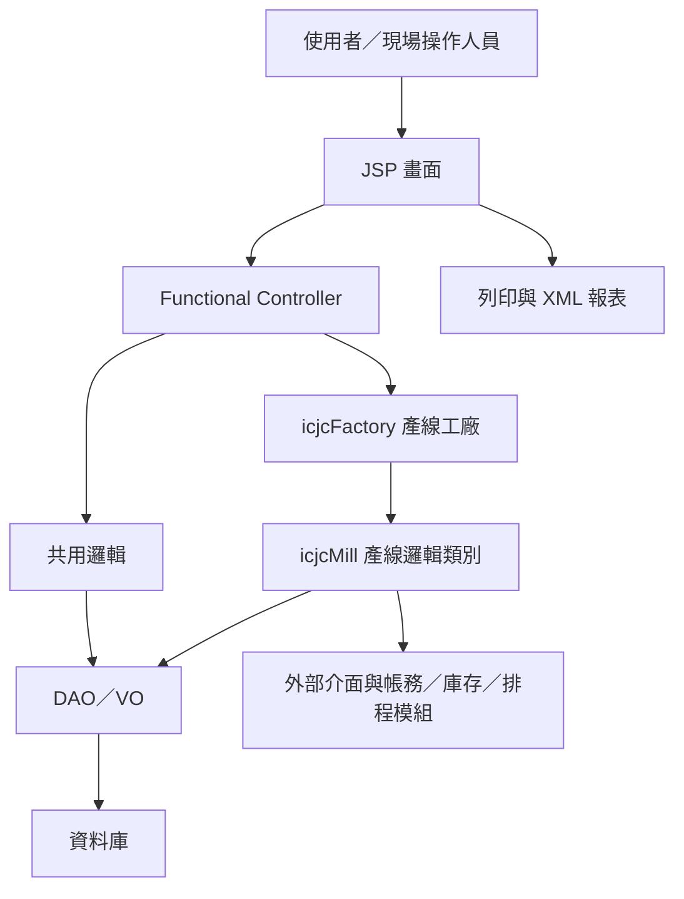

# IC 模組功能規格手冊

## 1. 系統概述

### 1.1 系統名稱

IC 模組，屬於 ERP Web 系統中的鋼捲投入、產出、質檢、包裝、庫存與產線實績管理功能。

### 1.2 系統目的

本系統主要支援鋼捲在各製程產線中的作業控管，包含：

- 接收或查詢排程與製程指示資料，作為投入作業依據。
- 記錄鋼捲投入、產出、質檢判定、分切、暫留、包裝與託工等作業結果。
- 依產線別產生或更新 PDO 資料，作為後續製程、庫存、帳務與品質追蹤使用。
- 更新鋼捲主檔、路徑檔與 WIP 狀態，維持現場鋼捲流向一致性。
- 提供標籤列印、排程列印、報表查詢、缺陷與判定資料維護等周邊作業。

### 1.3 適用範圍

本手冊依目前 `ic` 模組程式與設定整理，適用範圍包含：

- YL 產線群：熱軋線、熱軋調質線、酸洗線、軋延線、清洗線、退火線、調質線、精整線、整平線、包裝線、託工線。
- 舊有產線群：CAN、CKN、CPN、CSN、CTN、GIN、HR1、HS1、CP1、CR1、CR2 等。
- 共用資料處理：PDI 查詢、PDO 產生與查詢、WIP 異動、鋼捲主檔異動、路徑追蹤、帳務及介面資料拋轉。
- 系統維護與報表：參數維護、代碼維護、缺陷資料維護、日報與 XML 報表。

### 1.4 主要使用對象

- 現場產線操作人員：執行投入、產出、質檢、包裝、列印等作業。
- 生產管理人員：查詢排程、鋼捲狀態、產出結果與異常資料。
- 品質管理人員：維護與查詢缺陷、檢驗判定與品質相關資料。
- ERP 維運人員：維護程式、DAO、報表 XML、產線設定與資料異常處理。

### 1.5 主要資料概念

| 資料概念 | 說明 |
| --- | --- |
| PDI | 生產前製程指示資料，來源多為 WF、WH 等外部模組或排程資料表。 |
| PDO | 生產後產出資料，由各產線依實績、檢驗、主檔與排程資料組成。 |
| WIP | 在製鋼捲狀態，用來追蹤目前鋼捲所在製程、狀態、母子捲與下一站資訊。 |
| 鋼捲主檔 | 記錄鋼捲基本資料、尺寸、重量、品名、等級、判定與目前狀態。 |
| 路徑檔 | 記錄鋼捲通過各站的製程路徑與實績歷程。 |
| 02 檔 | 各產線產出或作業實績資料。 |
| 03 檔 | 各產線質檢或缺陷判定資料。 |
| Temp 檔 | 暫存輸入、質檢或產出過程資料，待確認後轉為正式實績。 |

## 2. 系統架構總覽

### 2.1 應用架構

本模組採傳統 Java Web 架構，主要由 JSP 畫面、Functional Controller、產線邏輯類別、DAO/VO 與 XML 報表組成。

### 2.2 目錄架構

| 目錄 | 用途 |
| --- | --- |
| `jsp` | 前端作業畫面，包含查詢、維護、投入、產出、質檢、列印與報表畫面。 |
| `src/com/icsc/ic` | 主要 Java 控制器、產線邏輯、共用服務與工具類別。 |
| `src/com/icsc/ic/dao` | 由 DAO 定義產生的 Java DAO/VO 類別。 |
| `dao` | DAO 定義檔，對應各資料表與欄位。 |
| `config/yl/ic` | 產線 Class、DAO/VO、資料表與跳軋傳送等設定。 |
| `xml/dr` | 報表定義 XML，例如日報、包裝報表、重量報表等。 |
| `codegen` | 部分程式與 JSP 的產生器輸出或範本結果。 |
| `images` | 畫面或報表使用的圖像資源。 |
| `pdo` | PDO 相關文字資料或輸出暫存。 |

### 2.3 核心類別分層

| 類別／群組 | 主要責任 |
| --- | --- |
| `icjsServlet` | 依 APID 檢查權限，查詢程式對應 Class，執行功能並轉導回指定 JSP。 |
| `icjc01Func` | 投入作業控制，包含查詢、投入、取消投入，適用 PPL、RCM、ECL、TPM、RCL 等製程。 |
| `icjc02Func` | 產出作業控制，包含查詢、產出、沖銷，適用 PPL、RCM、ECL、TPM、RCL 等製程。 |
| `icjcYL01Func` | YL 類共用基本控制器，定義查詢、新增、刪除等抽象流程。 |
| `icjcMill` | 產線抽象基底類別，定義投入、產出、質檢沖銷、PDO 沖銷、WIP 與路徑處理共用流程。 |
| `icjcFactory` | 依公司別與產線代碼建立對應產線邏輯物件。 |
| `icjcPDI` | 依鋼捲號、排程號、產線取得 PDI；支援子捲查無時回查母捲。 |
| `icjcPDO` | 取得、組合與檢核 PDO；提供 PDO 畫面連結、良率檢查與日期範圍檢核等。 |
| `icjcCoil` | 鋼捲主檔異動、狀態計算、分切、暫留、跳軋與尺寸換算。 |
| `icjcWipPO` | 對帳務／PO 相關資料進行異動追蹤與拋轉。 |
| `icjcWipIP` | 對庫存／IP 相關資料進行異動追蹤與拋轉。 |
| `icjcWipWO` | 對工單／WO 相關資料進行異動追蹤與拋轉。 |
| `icjcWipDJ` | 處理 DJ 追蹤紀錄。 |

### 2.4 產線設定總覽

| 產線代碼 | 中文名稱 | 主要 Class | 主要資料群 |
| --- | --- | --- | --- |
| HSM | 熱軋線 | `icjcYLHSM` | `YLHSM02`、`YLHSM03`、`YLHSMPDO` |
| SPM | 熱軋調質線 | `icjcYLSPM` | `YLSPM02`、`YLSPM03`、`YLSPMPDO` |
| PPL | 酸洗線 | `icjcYLPPL` | `YLPPL02`、`YLPPL03`、`YLPPLPDO` |
| RCM | 軋延線 | `icjcYLRCM` | `YLRCM02`、`YLRCM03`、`YLRCMPDO` |
| ECL | 清洗線 | `icjcYLECL` | `YLECL02`、`YLECL03`、`YLECLPDO` |
| BAF | 退火線 | `icjcYLBAF` | `YLBAF02`、`YLBAF03`、`YLBAFPDO` |
| CA0 | 退火線 | `icjcYLCA0` | `YLCA002Temp`、`YLCA003Temp`、`YLCA0PDO` |
| TPM | 調質線 | `icjcYLTPM` | `YLTPM02`、`YLTPM03`、`YLTPMPDO` |
| CS1 | 調質線 | `icjcYLCS1` | `YLCS102`、`YLCS103`、`YLCS1PDO` |
| RCL | 精整線 | `icjcYLRCL` | `YLRCL02`、`YLRCL03`、`YLRCLPDO` |
| CFL | 整平線 | `icjcYLCFL` | `YLCF102`、`YLCF103`、`YLCF1PDO` |
| PKL | 包裝線 | 借用 `icjcYLPPL` | `YLPKLPDO`、`YLPKLLOG` |
| CON | 託工線 | 借用 `icjcYLPPL` | `YLCONPDO` |

### 2.5 主要作業流程

#### 2.5.1 投入流程

1. 使用者於投入畫面輸入或查詢鋼捲與排程資料。
2. 系統依產線代碼取得對應產線物件。
3. 查詢 PDI 與 WIP，確認鋼捲狀態是否可投入。
4. 寫入投入人員、班別、日期、時間與系統時間。
5. 更新 PDI 投入狀態與 WIP 狀態。
6. 寫入投入相關 Log。

#### 2.5.2 產出流程

1. 使用者於產出畫面帶入鋼捲、排程與產線資料。
2. 系統檢查鋼捲是否可產出、是否暫留、是否分切、下一站是否已排程。
3. 寫入 02 檔產出實績。
4. 寫入 03 檔質檢或缺陷判定資料。
5. 建立或更新 PDO。
6. 更新鋼捲主檔、WIP 與路徑檔。
7. 視作業需要拋轉 PO、IP、WO、MR 或其他外部介面資料。

#### 2.5.3 沖銷流程

1. 使用者選擇欲沖銷的鋼捲與排程資料。
2. 系統檢查鋼捲是否已產出、是否涉及分切、下一站是否已排程。
3. 沖銷質檢資料、產出實績與 PDO。
4. 將鋼捲主檔與 WIP 回復至產出前狀態。
5. 回復路徑檔，並拋轉沖銷相關帳務與庫存異動。

## 3. 功能模組詳細說明

### 3.1 投入作業模組

| 項目 | 說明 |
| --- | --- |
| 功能目的 | 控制鋼捲進入指定產線前的投入確認。 |
| 主要畫面 | `icjjXXX01`、`icjjYL*01`、各產線 `01KeyIn` 或 `01Detail` 畫面。 |
| 主要程式 | `icjc01Func`、`icjcYL*01Func`、各產線 Class。 |
| 主要輸入 | 鋼捲號、排程號、產線代碼、班別、投入日期、投入時間、作業人員。 |
| 主要處理 | 查詢 PDI、檢查 WIP 狀態、更新投入狀態、記錄投入 Log。 |
| 主要輸出 | PDI 投入狀態更新、WIP 狀態更新、投入作業訊息。 |
| 例外檢核 | PDI 查無資料、鋼捲狀態不可投入、已投入資料重複、排程資料不一致。 |

### 3.2 產出作業模組

| 項目 | 說明 |
| --- | --- |
| 功能目的 | 記錄各產線鋼捲產出實績，並建立後續製程所需 PDO。 |
| 主要畫面 | `icjjXXX02`、`icjjYL*02`、各產線 `02KeyIn`、`02Detail` 畫面。 |
| 主要程式 | `icjc02Func`、`icjcYL*02Func`、`icjcMill`、各產線 Class。 |
| 主要輸入 | 鋼捲號、母捲號、排程號、排程列、排程序、產出日期時間、產出尺寸重量、產出品名、判定結果。 |
| 主要處理 | 檢查產出條件、寫入 02 檔、建立或更新 PDO、更新鋼捲主檔、WIP 與路徑檔、拋轉相關介面。 |
| 主要輸出 | 產出實績、PDO、鋼捲狀態、庫存與帳務異動資料。 |
| 例外檢核 | 鋼捲未投入、鋼捲已產出、下一站排程衝突、分切資料不完整、重量或尺寸不合理。 |

### 3.3 質檢與缺陷判定模組

| 項目 | 說明 |
| --- | --- |
| 功能目的 | 維護各產線質檢結果、缺陷代碼、缺陷程度、位置、比率與鋼捲判定。 |
| 主要畫面 | `icjjXXX03`、`icjjYL*03`、各產線 `03KeyIn`、`03Main`、`03List` 畫面。 |
| 主要程式 | `icjc03Func`、`icjcYL*03Func`、各產線 03 DAO/VO。 |
| 主要輸入 | 鋼捲號、排程資料、檢驗判定、缺陷代碼、缺陷程度、缺陷位置、缺陷比率。 |
| 主要處理 | 查詢產出資料、維護 03 檔、將判定資料帶入 PDO，必要時影響鋼捲等級與後續流程。 |
| 主要輸出 | 質檢資料、缺陷清單、判定結果、PDO 品質欄位。 |
| 例外檢核 | 未產出不可質檢、缺陷欄位不完整、判定與品級不一致。 |

### 3.4 PDO 管理模組

| 項目 | 說明 |
| --- | --- |
| 功能目的 | 產生、查詢、更新與沖銷各產線的 PDO 資料。 |
| 主要畫面 | 各產線 `*04`、`*05`、`*Info`、PDO 連結畫面。 |
| 主要程式 | `icjcPDO`、各產線 `createPDO()`、`queryPDO()`、`celPDO()`。 |
| 主要輸入 | 產線代碼、鋼捲號、排程號、產出實績、質檢資料、訂單與產品資訊。 |
| 主要處理 | 依產線取得對應 PDO DAO/VO，彙整 PDI、02 檔、03 檔、鋼捲主檔與訂單資料。 |
| 主要輸出 | 各產線 PDO 資料表，例如 `YLHSMPDO`、`YLPPLPDO`、`YLRCMPDO`、`YLECLPDO`、`YLBAFPDO`、`YLTPMPDO`、`YLRCLPDO`。 |
| 例外檢核 | 產線代碼錯誤、排程或鋼捲號缺漏、PDO 已存在但資料不一致、良率或日期範圍超出。 |

### 3.5 WIP 與鋼捲主檔管理模組

| 項目 | 說明 |
| --- | --- |
| 功能目的 | 維持鋼捲在製狀態、目前製程、下一製程、母子捲關係與暫留狀態。 |
| 主要程式 | `icjcCoil`、`icjcWipPO`、`icjcWipIP`、`icjcWipWO`、`icjcWipDJ`、`icjcPath`。 |
| 主要資料 | `tbicWIP`、鋼捲主檔、路徑檔、PO/IP/WO/DJ 介面資料。 |
| 主要處理 | 投入、產出、沖銷、分切、暫留、跳軋、包裝、託工時同步更新狀態。 |
| 主要輸出 | 正確的 WIP 狀態、鋼捲主檔、路徑歷程與外部介面紀錄。 |
| 例外檢核 | 母子捲關係錯誤、重複產出、路徑缺漏、暫留狀態與作業不符。 |

### 3.6 退火線與 KAB 作業模組

| 項目 | 說明 |
| --- | --- |
| 功能目的 | 處理退火線投入、退火爐座／爐台、KAB 進出與退火相關 PDO。 |
| 主要畫面 | `icjjYLBAF*`、`icjjYLCA0*`、`icjjylKAB*`。 |
| 主要程式 | `icjcYLBAF`、`icjcYLCA0`、`icjcylKAB01Func` 至 `icjcylKAB04Func`。 |
| 主要輸入 | 鋼捲號、排程號、退火爐號、爐座、KAB 編號、進出爐日期時間、退火週期。 |
| 主要處理 | 投入退火爐、取消投入、KAB 進出處理、建立退火線 PDO、更新 WIP。 |
| 主要輸出 | 退火實績、KAB 狀態、退火 PDO、班報資料。 |

### 3.7 包裝與標籤列印模組

| 項目 | 說明 |
| --- | --- |
| 功能目的 | 支援鋼捲包裝、標籤資料產生、標籤列印與包裝相關 PDO。 |
| 主要畫面 | `icjjYLPKL*`、`icjj*Label.jsp`、`icjjProdPrt*`、`icjjPPLSchdPrt*`。 |
| 主要程式 | `icjcYLPKL01Func`、`icjcYLPKL02Func`、`icjcProdPrtFunc`、`icjcPPLSchdPrtFunc`。 |
| 主要輸入 | 鋼捲號、包裝方式、標籤號、重量、產品資訊、客戶或訂單資訊。 |
| 主要處理 | 查詢 PDO 或鋼捲主檔，組合標籤與包裝資料，記錄包裝 Log。 |
| 主要輸出 | 包裝 PDO、包裝紀錄、標籤列印畫面或報表。 |

### 3.8 基礎資料與代碼維護模組

| 項目 | 說明 |
| --- | --- |
| 功能目的 | 維護系統代碼、缺陷代碼、產品分類、備註、ARP 參數與各類下拉選單資料。 |
| 主要畫面 | `icjjArp*`、`icjjBug*`、`icjjYLMemo*`、`icjjBasePara.jsp`。 |
| 主要程式 | `icjcArp*`、`icjcBug`、`icjcYLMemoFunc`、`icjcARPPublicFunction`。 |
| 主要資料 | `TBICARP*`、`tbicYLMEMO`、缺陷代碼 VO、各 Tag Select 類別。 |
| 主要處理 | 查詢、新增、修改、刪除與代碼清單輸出。 |
| 主要輸出 | 系統參數、代碼資料、畫面選項、錯誤或提示訊息。 |

### 3.9 報表與查詢模組

| 項目 | 說明 |
| --- | --- |
| 功能目的 | 提供現場日報、重量報表、產出報表、混合報表與各產線報表列印。 |
| 主要畫面 | `icjjYLDailyRpt01*`、`icjj*05Rpt.jsp`、`icjj*05Prt.jsp`、`icjj*06.jsp`。 |
| 主要報表 | `icrpCAN06.xml`、`icrpCKN06.xml`、`icrpCPN06.xml`、`icrpCSN06.xml`、`icrpCTN06.xml`、`icrpGIN06.xml`、`icrpWA.xml`、`icrpPWA.xml`、`icrpBWA.xml`、`icrpRA.xml`、`icrpMixA.xml`。 |
| 主要處理 | 依查詢條件取得實績、PDO、鋼捲與統計資料，透過 XML 報表定義產生列印結果。 |
| 主要輸出 | 日報、產出報表、重量報表、包裝或各線別統計報表。 |

### 3.10 外部介面與拋轉模組

| 項目 | 說明 |
| --- | --- |
| 功能目的 | 將投入、產出、質檢、沖銷、包裝與託工等異動同步至相關外部模組。 |
| 主要程式 | `icjcAPI`、`icjcOutApi`、`icjcWipPO`、`icjcWipIP`、`icjcWipWO`、`icjcGenQCData`、`icjcFtpCPN`。 |
| 主要介面 | PO、IP、WO、MR、WF、WH、IH、品質資料與遠端 Queue 設定。 |
| 主要處理 | 組合異動資料、記錄前後狀態、傳送或產生外部系統所需資料。 |
| 主要輸出 | 外部系統可接收的異動紀錄、訊息或檔案資料。 |

### 3.11 舊有產線作業模組

| 產線代碼 | 推定功能範圍 | 主要畫面／資料 |
| --- | --- | --- |
| CAN | 產線投入、產出、質檢、標籤、報表 | `icjjCAN*`、`tbicCAN02Temp`、`tbicCAN03Temp`、`tbicCANPDO` |
| CKN | 產線投入、產出、質檢、包裝、標籤、報表 | `icjjCKN*`、`tbicCKN02Temp`、`tbicCKN03Temp`、`tbicCKNPDO` |
| CPN | 產線投入、產出、質檢、標籤、報表、FTP | `icjjCPN*`、`tbicCPN02Temp`、`tbicCPN03Temp`、`tbicCPNPDO` |
| CSN | 產線投入、產出、質檢、標籤、報表 | `icjjCSN*`、`tbicCSN02Temp`、`tbicCSN03Temp`、`tbicCSNPDO` |
| CTN | 產線投入、產出、質檢、標籤、報表 | `icjjCTN*`、`tbicCTN02Temp`、`tbicCTN03Temp`、`tbicCTNPDO` |
| GIN | 產線投入、產出、質檢、標籤、報表 | `icjjGIN*`、`tbicGIN02Temp`、`tbicGIN03Temp`、`tbicGINPDO` |
| HR1／HS1 | 熱軋或熱軋調質相關投入、產出、質檢、查詢 | `icjjHR1*`、`icjjHS1*`、`tbicYLHR*`、`tbicYLHS*` |
| CP1／CR1／CR2 | 酸洗、軋延或相關製程作業 | `icjjCP1*`、`icjjCR1*`、`icjjCR2*` |

## 4. 主要資料表

| 資料表 | VO／DAO | 功能定位 | 主要用途 | 關聯功能 |
| --- | --- | --- | --- | --- |
| `tbicWIP` | `icjcWIPVO`／`icjcWIPDAO` | 在製鋼捲主控資料 | 記錄鋼捲目前狀態、目前製程、下一製程、母子捲關係、排程與暫留資訊。 | 投入、產出、沖銷、分切、暫留、跳軋、包裝、託工。 |
| `tbicYL04`、`tbicYL04Temp` | `icjcYL04VO`／`icjcYL04DAO`、`icjcYL04TempVO`／`icjcYL04TempDAO` | YL 製程路徑與作業歷程資料 | 記錄鋼捲經過各產線的路徑、實際線別、目標鋼捲號與作業狀態。 | 產出、沖銷、PDO 查詢、鋼捲路徑追蹤。 |
| `tbicYLHSM02`、`tbicYLHSM02Temp` | `icjcYLHSM02VO`／`icjcYLHSM02DAO`、`icjcYLHSM02TempVO`／`icjcYLHSM02TempDAO` | 熱軋線產出實績 | 保存熱軋線產出尺寸、重量、品名、時間、人員與相關生產條件。 | 熱軋產出、熱軋 PDO、日報、WIP 更新。 |
| `tbicYLHSM03`、`tbicYLHSM03Temp` | `icjcYLHSM03VO`／`icjcYLHSM03DAO`、`icjcYLHSM03TempVO`／`icjcYLHSM03TempDAO` | 熱軋線質檢資料 | 保存熱軋線缺陷、判定、等級與品質檢查資料。 | 熱軋質檢、PDO 品質欄位、缺陷查詢。 |
| `tbicYLHSMPDO` | `icjcYLHSMPDOVO`／`icjcYLHSMPDODAO` | 熱軋線 PDO | 彙整熱軋 PDI、產出實績、質檢、訂單與鋼捲主檔資料，供後續製程使用。 | 熱軋產出、後續線別 PDI／PDO 查詢、報表。 |
| `tbicYLSPM02`、`tbicYLSPM02Temp` | `icjcYLSPM02VO`／`icjcYLSPM02DAO`、`icjcYLSPM02TempVO`／`icjcYLSPM02TempDAO` | 熱軋調質線產出實績 | 保存熱軋調質線產出與製程條件。 | SPM 產出、WIP 更新、PDO 建立。 |
| `tbicYLSPM03`、`tbicYLSPM03Temp` | `icjcYLSPM03VO`／`icjcYLSPM03DAO`、`icjcYLSPM03TempVO`／`icjcYLSPM03TempDAO` | 熱軋調質線質檢資料 | 保存熱軋調質線缺陷與判定資料。 | SPM 質檢、PDO 品質欄位。 |
| `tbicYLSPMPDO`、`tbicYLSPMnewPdo` | `icjcYLSPMPDOVO`／`icjcYLSPMPDODAO`、`icjcYLSPMNEWPDOVO`／`icjcYLSPMNEWPDODAO` | 熱軋調質線 PDO | 保存熱軋調質線產出後的 PDO 資料，新舊版本並存支援不同流程。 | SPM 產出、後續製程、PDO 查詢。 |
| `tbicYLPPL02`、`TBICYLPPL02NEW` | `icjcYLPPL02VO`／`icjcYLPPL02DAO`、`icjcYLPPL02NEWVO`／`icjcYLPPL02NEWDAO` | 酸洗線產出實績 | 保存酸洗線產出、酸洗條件、尺寸重量與相關作業資料。 | 酸洗投入、產出、沖銷、PDO 建立。 |
| `tbicYLPPL03`、`TBICYLPPL03NEW` | `icjcYLPPL03VO`／`icjcYLPPL03DAO`、`icjcYLPPL03NEWVO`／`icjcYLPPL03NEWDAO` | 酸洗線質檢資料 | 保存酸洗線缺陷、表面品質與判定資料。 | 酸洗質檢、缺陷維護、PDO 品質欄位。 |
| `tbicYLPPLPDO`、`tbicYLPPLPDONEW` | `icjcYLPPLPDOVO`／`icjcYLPPLPDODAO`、`icjcYLPPLPDONEWVO`／`icjcYLPPLPDONEWDAO` | 酸洗線 PDO | 保存酸洗線產出後資料，作為軋延、清洗、包裝或託工等後續流程依據。 | 酸洗產出、PDO 查詢、後續線別投入。 |
| `tbicYLRCM02` | `icjcYLRCM02VO`／`icjcYLRCM02DAO` | 軋延線產出實績 | 保存軋延後鋼捲尺寸、重量、產線條件與產出資訊。 | 軋延產出、WIP 更新、PDO 建立。 |
| `tbicYLRCM03` | `icjcYLRCM03VO`／`icjcYLRCM03DAO` | 軋延線質檢資料 | 保存軋延線缺陷與判定資料。 | 軋延質檢、缺陷查詢、PDO 品質欄位。 |
| `tbicYLRCMPDO` | `icjcYLRCMPDOVO`／`icjcYLRCMPDODAO` | 軋延線 PDO | 保存軋延後 PDO，供清洗、退火、調質、精整等後續製程使用。 | 軋延產出、後續製程、PDO 查詢。 |
| `tbicYLECL02` | `icjcYLECL02VO`／`icjcYLECL02DAO` | 清洗線產出實績 | 保存清洗線產出尺寸、重量與清洗相關條件。 | 清洗產出、WIP 更新、PDO 建立。 |
| `tbicYLECL03` | `icjcYLECL03VO`／`icjcYLECL03DAO` | 清洗線質檢資料 | 保存清洗線品質判定與缺陷資訊。 | 清洗質檢、PDO 品質欄位。 |
| `tbicYLECLPDO` | `icjcYLECLPDOVO`／`icjcYLECLPDODAO` | 清洗線 PDO | 保存清洗後產出資料，供退火、調質或精整流程使用。 | 清洗產出、PDO 查詢、後續製程。 |
| `tbicYLBAF02` | `icjcYLBAF02VO`／`icjcYLBAF02DAO` | 退火線產出實績 | 保存退火線鋼捲、爐號、爐座、退火週期與產出資料。 | 退火投入、產出、KAB 作業、PDO 建立。 |
| `tbicYLBAF03` | `icjcYLBAF03VO`／`icjcYLBAF03DAO` | 退火線質檢資料 | 保存退火後品質判定與缺陷資料。 | 退火質檢、PDO 品質欄位。 |
| `tbicYLBAFPDO` | `icjcYLBAFPDOVO`／`icjcYLBAFPDODAO` | 退火線 PDO | 保存退火後 PDO，供調質、精整、包裝等後續流程使用。 | 退火產出、PDO 查詢、後續製程。 |
| `tbicYLCA002Temp`、`tbicYLCA003Temp` | `icjcYLCA002TempVO`／`icjcYLCA002TempDAO`、`icjcYLCA003TempVO`／`icjcYLCA003TempDAO` | CA0 退火線暫存實績與質檢資料 | 支援退火爐座、群組、進出爐與質檢暫存作業。 | CA0 投入、出爐、質檢、班報。 |
| `tbicYLCA0PDO`、`tbicYLCA0KARPDO` | `icjcYLCA0PDOVO`／`icjcYLCA0PDODAO`、`icjcYLCA0KARPDOVO`／`icjcYLCA0KARPDODAO` | CA0 退火線 PDO 與 KAB PDO | 保存 CA0 退火與 KAB 相關產出資料。 | CA0 產出、KAB 進出、跳軋、後續製程。 |
| `tbicYLTPM02` | `icjcYLTPM02VO`／`icjcYLTPM02DAO` | 調質線產出實績 | 保存調質線產出、張力、塗油、尺寸與品質相關製程條件。 | 調質產出、PDO 建立、WIP 更新。 |
| `tbicYLTPM03` | `icjcYLTPM03VO`／`icjcYLTPM03DAO` | 調質線質檢資料 | 保存調質線缺陷與判定資料。 | 調質質檢、PDO 品質欄位。 |
| `tbicYLTPMPDO` | `icjcYLTPMPDOVO`／`icjcYLTPMPDODAO` | 調質線 PDO | 保存調質線產出後完整 PDO 資料。 | 調質產出、後續精整／包裝、PDO 查詢。 |
| `tbicYLCS102`、`tbicYLCS102Temp` | `icjcYLCS102VO`／`icjcYLCS102DAO`、`icjcYLCS102TempVO`／`icjcYLCS102TempDAO` | CS1 調質線產出實績 | 保存 CS1 產出與暫存資料。 | CS1 產出、跳軋、PDO 建立。 |
| `tbicYLCS103`、`tbicYLCS103Temp` | `icjcYLCS103VO`／`icjcYLCS103DAO`、`icjcYLCS103TempVO`／`icjcYLCS103TempDAO` | CS1 調質線質檢資料 | 保存 CS1 質檢與缺陷暫存資料。 | CS1 質檢、PDO 品質欄位。 |
| `tbicYLCS1PDO` | `icjcYLCS1PDOVO`／`icjcYLCS1PDODAO` | CS1 調質線 PDO | 保存 CS1 調質後 PDO。 | CS1 產出、後續精整、PDO 查詢。 |
| `tbicYLRCL02` | `icjcYLRCL02VO`／`icjcYLRCL02DAO` | 精整線產出實績 | 保存精整線產出、剪切、尺寸重量與製程條件。 | 精整產出、WIP 更新、PDO 建立。 |
| `tbicYLRCL03` | `icjcYLRCL03VO`／`icjcYLRCL03DAO` | 精整線質檢資料 | 保存精整線缺陷與判定資料。 | 精整質檢、PDO 品質欄位。 |
| `tbicYLRCLPDO` | `icjcYLRCLPDOVO`／`icjcYLRCLPDODAO` | 精整線 PDO | 保存精整線產出後 PDO，供包裝、出貨或後續作業查詢。 | 精整產出、包裝、PDO 查詢。 |
| `tbicYLCF102`、`tbicYLCF102Temp` | `icjcYLCF102VO`／`icjcYLCF102DAO`、`icjcYLCF102TempVO`／`icjcYLCF102TempDAO` | 整平線產出實績 | 保存整平線產出與暫存資料。 | 整平產出、WIP 更新、PDO 建立。 |
| `tbicYLCF103`、`tbicYLCF103Temp` | `icjcYLCF103VO`／`icjcYLCF103DAO`、`icjcYLCF103TempVO`／`icjcYLCF103TempDAO` | 整平線質檢資料 | 保存整平線質檢與缺陷暫存資料。 | 整平質檢、PDO 品質欄位。 |
| `tbicYLCF1PDO` | `icjcYLCF1PDOVO`／`icjcYLCF1PDODAO` | 整平線 PDO | 保存整平線產出後 PDO。 | 整平產出、包裝、PDO 查詢。 |
| `tbicYLPKLPDO` | `icjcYLPKLPDOVO`／`icjcYLPKLPDODAO` | 包裝線 PDO | 保存包裝後資料、包裝方式、標籤與出貨前相關資訊。 | 包裝作業、標籤列印、出貨前查詢。 |
| `tbicYLPKLLOG` | `icjcYLPKLLOGVO`／`icjcYLPKLLOGDAO` | 包裝作業 Log | 記錄包裝作業異動歷程。 | 包裝、重印標籤、異常追蹤。 |
| `tbicYLCONPDO` | `icjcYLCONPDOVO`／`icjcYLCONPDODAO` | 託工線 PDO | 保存託外加工或託工流程的產出資料。 | 託工產出、PDO 查詢、WIP 更新。 |
| `TBICYLKAB01`、`TBICYLKAB02` | `icjcylKAB01VO`／`icjcylKAB01DAO`、`icjcylKAB02VO`／`icjcylKAB02DAO` | KAB 作業資料 | 維護退火線 KAB 相關鋼捲、位置或進出作業資料。 | KAB 進出、退火投入、退火產出。 |
| `tbicYLMEMO` | `icjcYLMemoVO`／`icjcYLMemoDAO` | 備註資料 | 保存鋼捲或作業相關備註。 | 備註維護、查詢畫面、現場作業補充說明。 |
| `TBICARP02` 至 `TBICARP13` | `icjcArp*`、`TBICARP*.dao` 對應產生類別 | 系統參數與代碼資料 | 維護各類基礎參數、代碼、分類與作業選項。 | 基礎資料維護、下拉選單、畫面檢核、報表條件。 |
| `tbicCAN02Temp`、`tbicCAN03Temp`、`tbicCANPDO` | `icjcCAN02TempVO`／`icjcCAN02TempDAO`、`icjcCAN03TempVO`／`icjcCAN03TempDAO`、`icjcCANPDOVO`／`icjcCANPDODAO` | CAN 舊線別作業資料 | 保存 CAN 產出、質檢暫存與 PDO。 | CAN 投入、產出、質檢、標籤、報表。 |
| `tbicCKN02Temp`、`tbicCKN03Temp`、`tbicCKNPDO`、`tbicCKNPack` | 對應 `icjcCKN*VO`／`icjcCKN*DAO` | CKN 舊線別作業資料 | 保存 CKN 產出、質檢、包裝與 PDO。 | CKN 投入、產出、質檢、包裝、標籤。 |
| `tbicCPN02Temp`、`tbicCPN03Temp`、`tbicCPNPDO` | 對應 `icjcCPN*VO`／`icjcCPN*DAO` | CPN 舊線別作業資料 | 保存 CPN 產出、質檢與 PDO。 | CPN 投入、產出、質檢、FTP、標籤、報表。 |
| `tbicCSN02Temp`、`tbicCSN03Temp`、`tbicCSNPDO` | 對應 `icjcCSN*VO`／`icjcCSN*DAO` | CSN 舊線別作業資料 | 保存 CSN 產出、質檢與 PDO。 | CSN 投入、產出、質檢、標籤、報表。 |
| `tbicCTN02Temp`、`tbicCTN03Temp`、`tbicCTNPDO` | 對應 `icjcCTN*VO`／`icjcCTN*DAO` | CTN 舊線別作業資料 | 保存 CTN 產出、質檢與 PDO。 | CTN 投入、產出、質檢、標籤、報表。 |
| `tbicGIN02Temp`、`tbicGIN03Temp`、`tbicGINPDO` | 對應 `icjcGIN*VO`／`icjcGIN*DAO` | GIN 舊線別作業資料 | 保存 GIN 產出、質檢與 PDO。 | GIN 投入、產出、質檢、標籤、報表。 |

## 5. 權限與入口說明

本模組透過 APID 控制作業入口。`icjsServlet` 會依使用者要求的 APID 進行授權檢查，再從 `TBISPB07` 取得對應 Class、畫面定義與轉導 URL。若使用者無權限或 APID 未設定，系統不繼續執行對應功能。

## 6. 注意事項與待確認項目

- 本手冊依程式碼、JSP 命名、DAO 定義與設定檔整理；實際欄位中文名稱、作業角色與簽核流程仍需由現場或業務單位確認。
- 部分舊有產線代碼的完整業務名稱需依現場慣用名稱補正。
- `02`、`03`、`04`、`05`、`06` 等程式編號在多數產線具一致規律，但少數線別有特殊畫面或特殊流程，導入或修改時需逐線檢查。
- 沖銷、分切、跳軋、暫留、託工與包裝會影響多個模組資料，異動前需確認 WIP、主檔、路徑、PDO 與介面資料的一致性。
- 報表 XML 已存在，但報表欄位與統計邏輯需搭配報表工具或執行結果進一步驗證。
