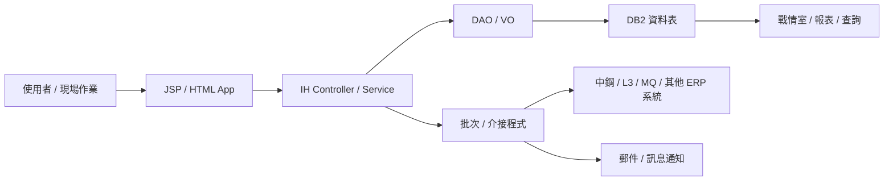

# IH 系統功能規格手冊

文件版本：v0.1  
整理日期：2026-08-19  
整理範圍：`ih` 子系統現有程式、JSP、HTML App、設定檔、DAO 與 SQL 定義。

> 本文件依目前程式碼與設定檔反向整理，作為功能規格初稿。實際畫面權限、選單名稱、批次排程時間與外部系統責任邊界，仍需搭配正式選單、排程主機與使用者作業流程確認。

## 1. 系統概述

### 1.1 系統定位

IH 系統為熱冷軋成品存貨管理相關子系統，主要支援鋼捲資料管理、儲位與庫存管理、交易明細、盤點、出入庫、轉單、內部領用、溢產品管理、代軋中鋼資料處理、戰情室報表與外部系統資料介接。

系統以鋼捲為核心管理物件，串接訂單、產品規格、庫存地點、生產線別、放行狀態、出貨狀態、PDI / PDO 資料與異常處理紀錄，提供現場、倉儲、銷售、生管與管理報表查詢使用。

### 1.2 主要使用情境

1. 維護與查詢鋼捲主檔、儲位、轉單參數、基本參數等存貨管理基礎資料。
2. 執行鋼捲入庫、放行、備貨、出貨、退回、改判、移倉、內部領用等作業。
3. 產生盤點表、記錄盤盈虧與盤點版本，支援庫存盤點流程。
4. 管理代軋中鋼鋼捲與 PDI 資料，處理中鋼相關放行、出貨、入庫與資料比對規則。
5. 透過批次或 MQ 接收／拋送 PDI、PDO、庫存、報支、CE、L3 與中鋼相關資料。
6. 提供戰情室與行動查詢頁面，呈現生產實績、庫存推移、銷售實績、出貨追蹤、暫留與待處理鋼捲資訊。
7. 針對暫留、異常、超期未處理鋼捲發送通知或產生追蹤資料。

### 1.3 系統邊界

系統內部負責：

- IH 相關資料表之查詢、新增、修改、刪除與交易控制。
- 鋼捲庫存、儲位、交易、盤點、轉單、溢產品與代軋中鋼資料處理邏輯。
- JSP 傳統網頁與 HTML App 查詢畫面所需資料提供。
- 批次處理、資料匯入、資料拋送與訊息接收後之業務邏輯。

系統外部依賴：

- ERP 共用框架，例如 `dsjccom`、`de301`、`dejc318`、DAO Tool、權限與交易框架。
- DB2 資料庫與 `DB.TBIH*`、`DB.TBSO*`、`DB.TBIC*`、`DB.TBZZ*` 等跨系統資料表。
- 生產線、品保、銷售、財務或中鋼等外部系統之 MQ、檔案、資料表或遠端服務。
- 郵件或訊息通知服務。

## 2. 系統架構總覽

### 2.1 架構分層

系統採用傳統 Java Web / ERP Framework 架構，主要分為下列層次：

| 層次 | 目錄或元件 | 說明 |
| --- | --- | --- |
| 前端頁面 | `jsp/` | 傳統 JSP 作業畫面，對應 Controller 執行查詢、維護、列印與作業動作。 |
| 行動／戰情室頁面 | `html/app/` | HTML / Vue / Framework7 類型頁面，提供戰情室、行動查詢與報表操作。 |
| 控制層 | `src/com/icsc/ih/*.java` | 主要 Controller 與業務服務，負責作業流程、驗證、交易與畫面資料準備。 |
| 批次／介接層 | `src/com/icsc/ih/ex/*.java` | 外部資料接收、拋送、批次更新與中鋼／L3／MQ 相關處理。 |
| DAO / VO | `src/com/icsc/ih/*DAO.java`、`*VO.java`、`src/com/icsc/ih/ex/dao/` | 資料表存取與資料物件封裝。 |
| DAO 定義 | `dao/*.dao`、`dao/sql/*.sql` | DAO Tool 輸入檔與資料表 SQL 定義。 |
| 設定檔 | `config/yl/ih/*.ini`、`config/yl/ih/ihStructs.xml` | SQL、控制規則、批次參數、通知參數與匯入設定。 |
| 自訂 Tag / Servlet | `src/com/icsc/ih/tag/`、`src/com/icsc/ih/servlet/` | 下拉選項、遠端查詢、AJAX 基礎資料查詢。 |

### 2.2 典型作業流程

1. 使用者由 JSP 或 HTML App 進入作業畫面。
2. 前端送出查詢、維護、列印、匯出或批次觸發動作。
3. Controller 取得 `dsCom`、資料庫連線與權限資訊。
4. Controller 執行輸入驗證、業務規則判斷與交易控制。
5. DAO / SQL 查詢或異動 IH 與跨系統資料表。
6. 結果回傳畫面、產生報表、寫入交易紀錄，或觸發外部拋送／通知。

### 2.3 資料流概念

### 2.4 主要資料表

| 資料表 | VO／DAO | 功能定位 | 主要用途 | 關聯功能 |
| --- | --- | --- | --- | --- |
| `TBIHCR01` | `ihjccrtb01VO`／`ihjccrtb01DAO` | 鋼捲核心主檔 | 保存鋼捲編號、訂單、規格、尺寸、重量、狀態、庫存地點、目前線別與放行資訊。 | 鋼捲主檔與庫存資料管理、儲位與倉儲作業、轉單、放行、出貨控制。 |
| `TBIHCR011` | `ihjccrtb011VO`／`ihjccrtb011DAO` | 代軋中鋼鋼捲資料 | 保存代軋中鋼鋼捲相關資料，作為中鋼特殊流程、PDI / PDO 與出貨判斷依據。 | 代軋中鋼管理、PDI / PDO 管理、中鋼特殊入庫、放行與出貨。 |
| `TBIHCR012` | `ihjccrtb012VO`／`ihjccrtb012DAO` | 代軋中鋼 PDI 資料 | 保存代軋中鋼 PDI 資料與 PDI 拋送／產生次數等資訊。 | PDI 建立、PDO 比對、中鋼資料檢核、特殊作業控制。 |
| `TBIHCR88` | `ihjccrtb88VO`／`ihjccrtb88DAO` | 原料資料 | 保存原料或前段鋼捲來源資料，供鋼捲追蹤與製程關聯使用。 | 鋼捲資料查詢、製程追蹤、原料關聯。 |
| `TBIHCR02` | `ihjccrtb02VO`／`ihjccrtb02DAO` | 儲位設定檔 | 定義庫存儲位、區域或存放位置基礎資料。 | 儲位管理、入庫、移倉、庫存查詢。 |
| `TBIHCR03` | `ihjccrtb03VO`／`ihjccrtb03DAO` | 交易明細主檔 | 保存鋼捲交易或異動主檔資料。 | 入庫、出庫、移倉、放行、出貨、交易追蹤。 |
| `TBIHCR04` | `ihjccrtb04VO`／`ihjccrtb04DAO` | 交易明細紀錄 | 保存鋼捲交易或異動明細紀錄。 | 交易追蹤、庫存異動稽核、異常追查。 |
| `TBIHCR14` | `ihjccrtb14VO`／`ihjccrtb14DAO` | 鋼捲移倉備份檔 | 保存鋼捲移倉或異動前後備份資料。 | 移倉作業、資料回復、異動稽核。 |
| `TBIHCR05` | `ihjccrtb05VO`／`ihjccrtb05DAO` | 盤點表產生作業檔 | 保存盤點表產生條件、清單或盤點作業資料。 | 盤點管理、盤點表列印。 |
| `TBIHCR06` | `ihjccrtb06VO`／`ihjccrtb06DAO` | 鋼捲盤盈虧資料檔 | 保存盤點後盤盈、盤虧與差異資料。 | 盤點差異處理、庫存調整、盤點稽核。 |
| `TBIHCR09` | `ihjccrtb09VO`／`ihjccrtb09DAO` | 盤點版本記錄檔 | 保存盤點版本、批次或歷次盤點紀錄。 | 盤點版本控管、盤點追蹤。 |
| `TBIHCR07` | `ihjccrtb07VO`／`ihjccrtb07DAO` | 轉單參數設定檔 | 定義鋼捲轉單相關參數與判斷規則。 | 轉單作業、特殊鋼捲作業控制。 |
| `TBIHCR11` | `ihjccrtb11VO`／`ihjccrtb11DAO` | 基本參數設定檔 | 保存 IH 系統共用基本參數。 | 鋼捲作業控制、批次處理、查詢條件輔助。 |
| `TBIHCR16` | `ihjccrtb16VO`／`ihjccrtb16DAO` | 鋼捲轉單資料檔 | 保存鋼捲轉單過程與結果資料。 | 轉單、放行、出貨控制、交易追蹤。 |
| `TBIHCR10` | `ihjccrtb10VO`／`ihjccrtb10DAO` | 內部領用基本資料檔 | 保存內部領用作業所需基礎資料。 | 內部領用與特殊領用作業。 |
| `TBIHCR12` | `ihjccrtb12VO`／`ihjccrtb12DAO` | 鋼捲彙整資料檔 | 保存鋼捲彙整後資料，提供對帳、統計或報表使用。 | 對帳、三版與彙整資料、戰情室報表。 |
| `TBIHCR13` | `ihjccrtb13VO`／`ihjccrtb13DAO` | 三版記錄檔 | 保存三版相關處理紀錄。 | 對帳處理、資料比對、管理報表。 |
| `TBIHCR15` | `ihjccrtb15VO`／`ihjccrtb15DAO` | 對帳暫存檔 | 保存總帳或明細對帳過程中的暫存資料。 | 總帳對帳、明細對帳、存貨清單比對。 |
| `TBIHCR31` | `ihjccrtb31VO`／`ihjccrtb31DAO` | 溢產品決策參數資料 | 保存溢產品判定與決策參數。 | 溢產品產生、溢產品參數維護。 |
| `TBIHCR32` | `ihjccrtb32VO`／`ihjccrtb32DAO` | 溢產品常用尺寸設定資料 | 保存溢產品常用尺寸與規格設定。 | 溢產品尺寸維護、溢產品產生。 |
| `TBIHCR33` | `ihjccrtb33VO`／`ihjccrtb33DAO` | 溢產品存貨資料 | 保存溢產品庫存資料。 | 溢產品查詢、溢產品存貨列印。 |
| `TBIHCR34` | `ihjccrtb34VO`／`ihjccrtb34DAO` | 溢產品產生記錄檔 | 保存溢產品產生過程與結果紀錄。 | 溢產品產生、產生紀錄追蹤。 |
| `TBIH0010` | `ihjc0010VO`／`ihjc0010DAO` | 車輛報到資料檔 | 保存車輛報到、進出與基本作業資料。 | 車輛報到與載運管理、出貨現場作業。 |
| `TBIH0011` | `ihjc0011VO`／`ihjc0011DAO` | 車輛載運資料檔 | 保存車輛載運鋼捲明細資料。 | 載運資料維護、車號與鋼捲檢核、放行。 |
| `TBIH0021` | `ihjc0021VO`／`ihjc0021DAO` | 磅重資料檔 | 保存磅重相關資料。 | 出貨、車輛載運、重量檢核。 |
| `TBIHPBIS` | `ihjcpbtbisVO`／`ihjcpbtbisDAO` | 匯入格式定義檔 | 定義匯入資料欄位、格式與處理規則。 | 匯入、批次處理、資料格式檢核。 |
| `TBIHPBER` | `ihjcpbtberVO`／`ihjcpbtberDAO` | 匯入資料異狀記錄檔 | 保存匯入資料錯誤與異常紀錄。 | 匯入錯誤追蹤、批次異常處理。 |
| `TBIHPBEC` | `ihjcpbtbec`／`ihjcpbtbecDAO` | 執行狀況記錄檔 | 保存批次或匯入作業執行狀態。 | 批次監控、執行紀錄查詢。 |
| `TBIHPBHT` | `ihjcpbtbhtVO`／`ihjcpbtbhtDAO` | 歷史資料備份參數檔 | 保存歷史資料備份相關參數。 | 歷史資料備份、資料保存管理。 |
| `TBIHPBRC` | `ihjcpbtbrcVO`／`ihjcpbtbrcDAO` | 執行狀況記錄檔 | 保存批次或資料處理執行紀錄。 | 批次監控、執行結果追蹤。 |
| `TBIHPBRG` | `ihjcpbtbrgVO`／`ihjcpbtbrgDAO` | 序號註冊機物件 | 保存序號產生或註冊相關資料。 | 匯入批次、序號控管。 |
| `TBIHCSCEXACCOUNT` | `ihjcCscExAccountVO`／`ihjcCscExAccountDAO` | 拋送中鋼報支資料交換記錄 | 保存中鋼報支資料拋送與交換紀錄。 | 中鋼報支、外部系統介接。 |
| `TBIHCSCEXCOIL` | `ihjcCscExCoilVO`／`ihjcCscExCoilDAO` | 拋送中鋼鋼捲資料交換記錄 | 保存中鋼鋼捲資料拋送與交換紀錄。 | 中鋼鋼捲資料拋送、PDI / PDO 介接。 |
| `TBIHCSCEXIN` | `ihjcCscExInVO`／`ihjcCscExInDAO` | 中鋼匯入資料記錄 | 保存中鋼匯入資料與處理紀錄。 | 中鋼資料匯入、資料比對與錯誤追蹤。 |
| `TBIHCSCEXSTOCK` | `ihjcCscExStockVO`／`ihjcCscExStockDAO` | 拋送中鋼庫存資料交換記錄 | 保存中鋼庫存資料拋送與交換紀錄。 | 中鋼庫存同步、外部系統介接。 |
| `TBIHCEDETAILDATA` | `ihjcCEDetailDataVO`／`ihjcCEDetailDataDAO` | CE 明細資料 | 保存 CE 明細資料，供對外拋送或報表使用。 | CE 資料拋送 L3、外部系統介接。 |
| `TBIHCESUMDATA` | `ihjcCESumDataVO`／`ihjcCESumDataDAO` | CE 彙總資料 | 保存 CE 彙總資料。 | CE 資料拋送 L3、統計彙總。 |
| `TBIHREC` | `ihjcRecVO`／`ihjcRecDAO` | 介接記錄資料 | 保存介接或資料接收處理紀錄。 | 外部系統介接、批次追蹤。 |
| `TBIHSTA01` | `ihjcsta01VO`／`ihjcsta01DAO` | 每日各廠暫留與待處理鋼捲明細 | 保存每日各廠暫留與待處理鋼捲資料。 | 暫留查詢、異常通知、戰情室暫留資訊。 |

## 3. 功能模組詳細說明

### 3.1 鋼捲主檔與庫存資料管理

**功能目的**  
維護與查詢鋼捲生命週期中的核心資料，包含鋼捲編號、訂單、產品規格、尺寸、重量、目前廠別／線別、庫存位置、狀態、放行狀態、PDI / PDO 關聯與異動紀錄。

**主要程式與資料**

- `ihjccrtb01DAO.java` / `TBIHCR01`：鋼捲資料文件。
- `ihjccr01Api.java`、`ihjccr01m*.java`：鋼捲狀態、出入庫、轉單、改判等核心 API 與作業邏輯。
- `ihjc0100.java`、`ihjc0500.java`、`ihjc0510.java`、`ihjc0530.java`、`ihjc0540.java`：鋼捲查詢、列印、維護或特定業務作業。
- `jsp/ihjj0010*.jsp`、`jsp/ihjj0500*.jsp`、`jsp/ihjj0530*.jsp`、`jsp/ihjj0540*.jsp`：相關作業畫面。

**主要功能**

- 依鋼捲編號、訂單、產品、狀態、庫存地點等條件查詢。
- 新增、修改、刪除或更正鋼捲資料。
- 查詢鋼捲關聯 PDI、PDO、訂單與製程資料。
- 產生鋼捲資料列印與標籤相關資訊。
- 記錄交易明細，以利日後追蹤。

**主要輸入**

- 鋼捲編號、標籤號碼、訂單號碼、項次、產品規格、尺寸、重量、廠別、線別、儲位、狀態。

**主要輸出**

- 鋼捲清單、鋼捲明細、列印資料、交易結果訊息、錯誤或檢核訊息。

### 3.2 儲位與倉儲作業管理

**功能目的**  
管理鋼捲庫存位置、儲位設定、移倉、入庫、出庫與庫存異動紀錄，確保庫存帳與現場儲放資訊一致。

**主要程式與資料**

- `TBIHCR02`：儲位設定檔。
- `TBIHCR03` / `TBIHCR04`：交易明細主文件與記錄文件。
- `TBIHCR14`：鋼捲移倉備份檔。
- `ihjccr02m01.java`、`ihjccr03m01.java`、`ihjccr01mil.java`、`ihjccr01mip.java`、`ihjcBackCoil.java`、`ihjcBackOnline.java`。

**主要功能**

- 儲位基本資料設定與查詢。
- 鋼捲入庫、移倉、出庫與狀態更新。
- 交易主檔與明細紀錄寫入。
- 異動前後資料備份與追蹤。
- 回復或線上補正特定鋼捲資料。

**業務規則摘要**

- 鋼捲異動需依狀態、廠別、線別、庫存地點與業務別檢核。
- 特殊代軋中鋼鋼捲需依 `ih_Controller.ini` 設定，套用額外入庫、放行、出貨或備貨規則。

### 3.3 車輛報到與載運管理

**功能目的**  
管理車輛報到、載運資料與磅重資料，支援出貨現場之車輛進出、裝載、放行或取消放行相關流程。

**主要程式與資料**

- `TBIH0010`：車輛報到資料檔。
- `TBIH0011`：車輛載運資料檔。
- `TBIH0021`：磅重資料檔。
- `ihjc0010.java`、`ihjc0011.java`、`ihjc0020.java`、`ihjc0021DAO.java`。
- `jsp/ihjj0010*.jsp`、`jsp/ihjj001A*.jsp`、`jsp/ihjj0020.jsp`。

**主要功能**

- 車輛報到資料查詢、新增、修改、刪除。
- 載運鋼捲資料維護與檢核。
- 車號、標籤號碼與關聯資料檢核。
- 放行、取消、取消放行。
- 匯出 CSV。

### 3.4 盤點管理

**功能目的**  
支援鋼捲盤點作業，包含盤點表產生、盤點版本記錄、盤盈虧資料處理與盤點表列印。

**主要程式與資料**

- `TBIHCR05`：鋼捲盤點表產生作業。
- `TBIHCR06`：鋼捲盤盈虧資料檔。
- `TBIHCR09`：盤點版本記錄檔。
- `ihjccr05m01.java`、`ihjccr06m01.java`。
- `jsp/ihjjei21m1p1.jsp`、`jsp/ihjjei21m1p2.jsp`：盤點表列印。

**主要功能**

- 依庫區、產品、日期或條件產生盤點清單。
- 記錄盤點版本與盤點結果。
- 產生盤盈、盤虧資料。
- 提供盤點表列印。

### 3.5 轉單、放行與出貨控制

**功能目的**  
控制鋼捲轉單、放行、備貨、出貨與退回等作業，並依業務類型與鋼捲狀態套用檢核規則。

**主要程式與資料**

- `TBIHCR07`：轉單參數設定檔。
- `TBIHCR16`：鋼捲轉單資料檔。
- `ihjccr01m04.java`：轉單。
- `ihjccr01mil.java`：備貨、更改車序、放行等異動邏輯。
- `ihjcSpecialApi.java`：中鋼相關特殊入庫、放行、出貨與備貨檢核。
- `config/yl/ih/ih_Controller.ini`：統一控制設定。

**主要功能**

- 依採購類型、作業代碼與鋼捲狀態判斷可否作業。
- 支援代工與非代工作業差異化規則。
- 特定中鋼轉單鋼捲執行特殊入庫、放行、出貨與備貨 API。
- 作業成功後同步更新鋼捲狀態、交易明細與相關交換紀錄。

**控制規則摘要**

- `purchType = D` 代表代工類型，針對入庫、放行、出貨、退貨、資料調整、備貨等代碼有獨立檢核。
- `purchType = A / B / E` 代表非代工類型，部分作業直接允許或使用共通規則。
- 中鋼至特定廠別或特定訂單之鋼捲，需檢核客戶、訂單、鋼捲類型與採購單號是否一致。

### 3.6 代軋中鋼與 PDI / PDO 管理

**功能目的**  
處理代軋中鋼鋼捲資料、PDI 資料建立、PDO 拋送／比對、資料匯入與特殊業務流程。

**主要程式與資料**

- `TBIHCR011`：代軋中鋼鋼捲資料檔。
- `TBIHCR012`：代軋中鋼 PDI 資料。
- `ihjccrtb011DAO.java`、`ihjccrtb012DAO.java`。
- `ihjcCscPdim.java`、`ihjcCscRevert.java`、`ihjcCscAutoShip.java`、`ihjcChsAutoRlsCoil.java`。
- `ihjcExPdi.java`、`ihjcExPdoCheck.java`、`ihjcCscPdo*.java`、`ihjiCscPdoFormat.java`。
- `jsp/ihjjCscPdi*.jsp`、`jsp/ihjjCscRevert*.jsp`、`jsp/ihjjCscAccount.jsp`。

**主要功能**

- 匯入、查詢與維護代軋中鋼鋼捲資料。
- 建立與檢核 PDI 資料。
- 接收或處理 PDO 相關資料。
- 比對 PDO 內容並發送錯誤通知。
- 處理中鋼資料回復、報支、鋼捲資料拋送與自動出貨。

### 3.7 溢產品管理

**功能目的**  
管理溢產品決策參數、常用尺寸設定、溢產品存貨與產生紀錄，支援溢產品產生、查詢與列印。

**主要程式與資料**

- `TBIHCR31`：溢產品決策參數資料。
- `TBIHCR32`：溢產品常用尺寸設定資料。
- `TBIHCR33`：溢產品存貨資料。
- `TBIHCR34`：溢產品產生記錄檔。
- `ihjccr31m01.java`、`ihjccr32m01.java`、`ihjccr33m01.java`、`ihjccr13m04.java`。
- `jsp/ihjjei35.jsp`：溢產品存貨列印作業。

**主要功能**

- 維護溢產品判定參數。
- 維護常用尺寸設定。
- 產生溢產品資料。
- 查詢與列印溢產品存貨。

### 3.8 內部領用與特殊領用作業

**功能目的**  
管理內部領用基本資料與相關鋼捲處理，支援非一般銷售出貨之內部流向控管。

**主要程式與資料**

- `TBIHCR10`：內部領用基本資料檔。
- `ihjcei10m.java`。
- `jsp/ihjjei10*.jsp`。

**主要功能**

- 內部領用資料查詢與維護。
- 依鋼捲與領用條件檢核可否作業。
- 寫入交易紀錄並更新相關狀態。

### 3.9 對帳、三版與彙整資料

**功能目的**  
支援總帳／明細對帳、存貨清單擷取、彙整資料與三版記錄，提供財務或管理報表所需資料基礎。

**主要程式與資料**

- `TBIHCR12`：鋼捲彙整資料檔。
- `TBIHCR13`：三版記錄檔。
- `TBIHCR15`：對帳暫存檔。
- `ihjccr13m01.java`：總帳對帳處理。
- `ihjccr13m02.java`：明細對帳產生暫存檔。
- `ihjccr13m03.java`：明細對帳取存貨清單。

**主要功能**

- 產生或更新對帳暫存資料。
- 擷取存貨清單。
- 提供後續總帳、明細或管理報表比對使用。

### 3.10 匯入、備份與執行紀錄管理

**功能目的**  
管理資料匯入格式、異常紀錄、執行狀況、歷史資料備份參數與序號註冊，支援批次作業穩定執行與追蹤。

**主要程式與資料**

- `TBIHPBIS`：匯入格式定義檔。
- `TBIHPBER`：匯入資料異狀記錄檔。
- `TBIHPBEC` / `TBIHPBRC`：執行狀況記錄檔。
- `TBIHPBHT`：歷史資料備份參數檔。
- `TBIHPBRG`：序號註冊機物件。
- `ihjcpbm*.java`、`ihjcpbhtm.java`。
- `config/yl/ih/ih_importCoilData01.ini`、`ih_importCoilData02.ini`、`ih_importCoilData03.ini`、`ih_BackCoil.ini`。

**主要功能**

- 定義匯入欄位格式與處理規則。
- 記錄匯入錯誤與批次執行狀況。
- 管理歷史資料備份設定。
- 提供序號產生或註冊機制。

### 3.11 外部系統介接與批次處理

**功能目的**  
處理與中鋼、L3、生產線、銷售／財務相關系統之資料交換，包含 MQ 接收、批次拋送、資料格式轉換與自動處理。

**主要程式**

- `ihjcMQRecv_*.java`：MQ 接收入口，包含 `ICBD02`、`ICP002`、`ICP003`、`ICRE01`、`IH4A01`、`IHDA01`、`TPMC01`、`TQHL01` 等。
- `ihjcCEDataToL3.java`：CE 資料拋送 L3。
- `ihjcChartDataToCSC.java`：圖表或資料拋送中鋼。
- `ihjcM67DataToPMIS.java`：M67 資料拋送 PMIS。
- `ihjcExCoil.java`、`ihjcExStockId.java`、`ihjcExStockRec.java`、`ihjcExAccount.java`：鋼捲、儲位、庫存與報支資料交換。
- `ihjcExAutoShipOutExec.java`、`ihjcChsAutoRlsCoilExec.java`：自動出貨與自動放行執行。

**主要功能**

- 接收外部訊息並依 publisher / queue 類型轉入對應處理流程。
- 組成固定格式資料後拋送外部系統。
- 執行自動放行、自動出貨、庫存資料同步與異常通知。
- 寫入交換紀錄與執行結果，供追蹤與重送。

### 3.12 戰情室與行動查詢模組

**功能目的**  
提供管理者與現場人員快速查詢生產、庫存、銷售、出貨與暫留資訊。

**主要頁面**

| 頁面 | 功能名稱 | 說明 |
| --- | --- | --- |
| `ihCIC01App.html` | 戰情室綜合資訊 | 生產實績、熱軋線產品組合、冷軋線產品組合、成品庫存結構、存貨、銷售、鋼管包裝量。 |
| `ihCIC02App.html` | 銷售實績 | 銷售實績查詢。 |
| `ihCIC03App.html` | 單軋客戶出貨追蹤 | 單軋客戶出貨追蹤查詢。 |
| `ihApp001.html` | 月 OD 數量統計表 | 依月份查詢 OD 數量統計。 |
| `ihApp002.html` | 月接單量統計表 | 依月份查詢接單量統計。 |
| `ih008App.html` | 冷軋在製品滯留鋼捲一覽表 | 查詢冷軋在製品超過指定滯留時間之鋼捲。 |
| `ih009App.html` | 月銷售量統計表 | 查詢月銷售量統計。 |
| `ih010App.html` | 主要產線作業率日報表 | 查詢主要產線作業率日報。 |
| `ihwh002App.html` | 暫留與待處理鋼捲資訊 | 提供統計資訊與鋼捲明細。 |
| `ihwh003App.html` | 酸鍍廠車輛管理查詢 App | 車輛管理查詢。 |
| `ihwh01App.html` | 天車出貨查詢作業 | 天車出貨清單與明細查詢。 |
| `ihwh02App.html` | 熱軋廠成品庫存推移表 | 熱軋廠成品庫存趨勢查詢。 |
| `ihwh03App.html` | 冷軋廠成品庫存推移表 | 冷軋廠成品庫存趨勢查詢。 |
| `ihwh04App.html` | 鋼管半成品帳齡分析表 | 鋼管半成品帳齡分析。 |
| `ihwh05App.html` | 出貨及銷帳計畫表 | 出貨與銷帳計畫查詢。 |
| `ihwh06App.html` | 鋼管品保暫留帳齡明細表 | 品保暫留帳齡明細。 |

**主要功能**

- 日期、月份、廠別或條件查詢。
- 表格化呈現統計結果與明細。
- 支援查詢與清除條件。
- 部分頁面提供 Tab 切換統計資訊與明細資訊。

### 3.13 暫留、異常與通知管理

**功能目的**  
追蹤暫留、異常與需處理鋼捲，並依設定發送通知或產生追蹤清單。

**主要程式與資料**

- `TBIHSTA01`：每日各廠暫留與待處理鋼捲明細。
- `ihjcNoticeAbnormH.java`、`ihjcNoticeCoilBugRecord.java`、`ihjcNoticeCoilBugRecord2.java`。
- `ihjcThrowMsg.java`、`ihjcMsg.java`。
- `config/yl/ih/ih_config.ini`：暫留異常通知間隔與收件人設定。

**主要功能**

- 依鋼捲狀態、異常代碼與滯留天數產生待處理資料。
- 熱軋與冷軋可設定不同通知間隔。
- 以郵件或訊息方式通知相關人員。
- 保留批次與通知執行訊息，供問題追蹤。

### 3.14 AJAX、下拉選項與共用 UI 支援

**功能目的**  
提供畫面查詢所需之基礎資料、下拉選項與遠端選取資料。

**主要程式**

- `servlet/ihjsAjax.java`：AJAX 方式查詢基本資料。
- `servlet/ihjsAjax17m.java`：特定鋼捲相關 AJAX 基礎資料。
- `tag/ihjcSelectStockId.java`、`ihjcSelectSrcId.java`、`ihjcSelectRefLocation.java`、`ihjcSelectcrroutingno.java`、`ihjcSelectcrturntype.java`、`ihjcRemotecrmscmill.java`。

**主要功能**

- 提供儲位、來源、參考位置、路由、轉向類型等下拉資料。
- 支援遠端查詢或關鍵字查找。
- 減少各 JSP 重複撰寫基礎資料查詢邏輯。

## 4. 待確認事項

1. 正式系統名稱是否以「熱冷軋成品存貨管理系統」為準。
2. 各 JSP 作業在正式選單中的中文名稱與使用角色。
3. 批次程式實際排程、執行週期、失敗重送機制與監控窗口。
4. MQ queue、publisher、外部系統代碼與責任邊界。
5. 中鋼特殊規則中客戶、訂單、採購單號與鋼捲類型判斷是否仍為現行規則。
6. 戰情室報表的正式指標定義、計算週期與資料來源責任單位。
7. 權限控管、審核流程與操作紀錄保存年限。
