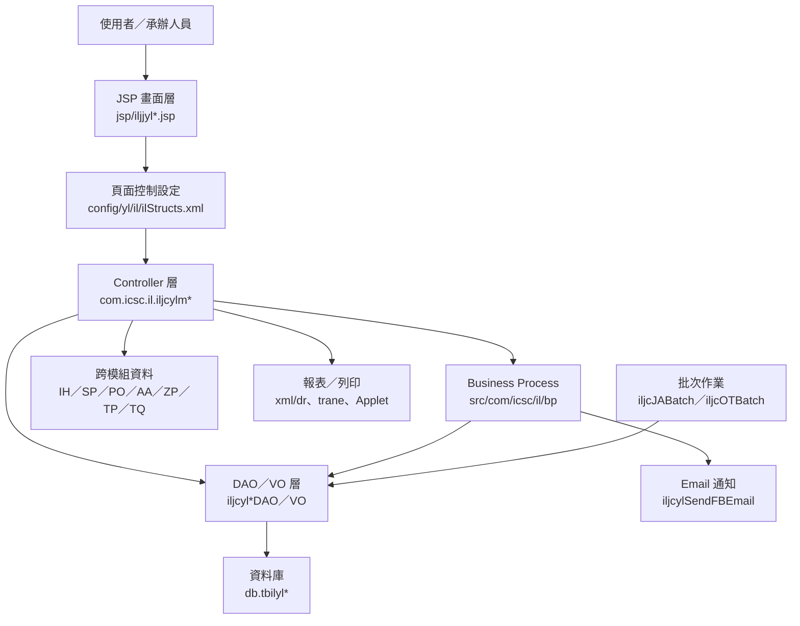
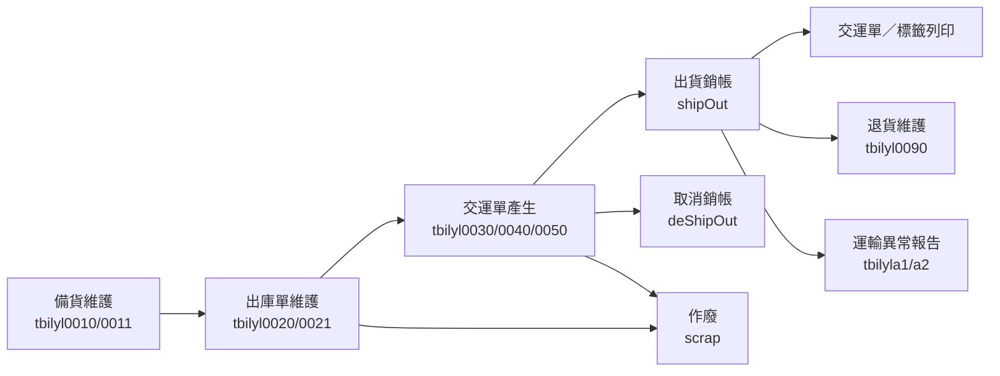

# IL 功能規格手冊

產出日期：2026-08-19

本文件依據 `config/yl/il/ilStructs.xml`、`jsp/`、`src/com/icsc/il/`、`dao/`、`dao/sql/` 與 `trane/` 目錄整理，描述 IL 模組目前可識別之系統定位、架構與功能模組。若程式註解或功能名稱未完整揭露，本文件以頁面設定、Controller Action、VO／DAO 對應與資料表命名交叉判讀。

## 1. 系統概述

### 1.1 系統定位

IL 模組為 ERP 中與物流、出庫、出貨銷帳、交運單、退貨、鋼胚運輸、標籤列印及運輸異常管理相關的作業模組。系統主要支援熱軋、冷軋、副產品與鋼胚等產品在出貨前後的資料維護、鋼捲挑選、出庫單建立、交運單產生、銷帳、作廢、列印與異常回報。

從程式與設定可見，IL 模組不是單一畫面，而是一組以 `iljjyl*` JSP 畫面、`iljcylm*` Controller、`iljcyl*TBVO/DAO` 資料物件與 `tbilyl*` 資料表組成的傳統 Java Web 模組。畫面透過 `ilStructs.xml` 綁定 Controller 與 Action，後端以 DAO 存取資料庫，必要時呼叫其他 ERP 模組，例如 IH 庫存鋼捲資料、SP 外銷出貨資料、PO 訂單資料、AA 組織與人員資料、ZP 郵件或列印相關服務。

### 1.2 使用對象

- 出貨／物流承辦人員：建立與維護備貨單、出庫單、交運單、出貨銷帳與退貨資料。
- 倉儲與裝車相關人員：挑選鋼捲、維護裝車計畫、確認車號與倉儲位置。
- 列印與報表使用者：列印標籤、交運單、出庫報表與區間列印資料。
- 管理與稽核相關人員：維護報表設定、序號規則、車輛禁運設定與運輸異常報告。

### 1.3 業務範圍

IL 模組涵蓋以下主要業務：

- 熱冷軋備貨：建立備貨主檔、挑選鋼捲、維護備貨明細、產生出庫單與列印鋼捲／備貨相關報表。
- 出庫單維護：建立出庫單主檔與明細，挑選出庫鋼捲，支援新增、修改、刪除、作廢與列印。
- 出貨銷帳：熱冷軋、副產品、外銷與鋼胚交運單之銷帳、取消銷帳、作廢與交運單列印。
- 交運單產生與維護：支援批次產生交運單、交運單維護、批次銷帳與批次作廢。
- 退貨管理：維護熱冷軋退貨單，執行退貨與取消退貨。
- 標籤與報表：支援熱軋、冷軋、鍍鋅、R1、CSC 版本標籤列印，以及出庫／出貨／鋼捲清單與區間報表。
- 例外與設定：支援鋼品運輸異常報告、鋼捲異常明細、客戶電匯、C1 倉裝車計畫、RP 報表與車輛禁運設定。
- 批次與通知：提供 JA／OT 批次與 FB Email 通知相關程式，供排程或背景程序使用。

### 1.4 主要資料表

| 資料表 | VO／DAO | 功能定位 | 主要用途 | 關聯功能 |
| --- | --- | --- | --- | --- |
| `tbilyl0010` | `iljcyl0010TBVO`、`iljcyl0010TBDAO` | 備貨主檔 | 記錄備貨單號、訂單、客戶、運輸方式、起訖地點、預計交貨量、備貨量、實際交貨量與成本中心等主檔資料。 | 熱冷軋備貨維護、鋼捲挑選、出庫單產生、備貨鋼捲報表。 |
| `tbilyl0011` | `iljcyl0011TBVO`、`iljcyl0011TBDAO` | 備貨明細 | 記錄備貨鋼捲、標籤、尺寸、重量、庫位、車序與鋼捲狀態等明細資料。 | 備貨鋼捲明細、出庫明細建立、熱冷軋出貨銷帳、標籤列印。 |
| `tbilyl0020` | `iljcyl0020TBVO`、`iljcyl0020TBDAO` | 出庫主檔 | 記錄出庫單號、交運單號、客戶、出貨日期、車號、運輸方式、起訖地點、出貨狀態與建修人員。 | 出庫單維護、出庫單列印、熱冷軋交運、C1 倉裝車計畫、出庫鋼捲報表。 |
| `tbilyl0021` | `iljcyl0021TBVO`、`iljcyl0021TBDAO` | 出庫明細 | 記錄出庫項次、訂單項次、鋼捲、產品分類、產品型態、運輸單價與運費金額。 | 出庫鋼捲明細、出庫鋼捲挑選、銷帳明細、退貨來源資料。 |
| `tbilyl0030` | `iljcyl0030TBVO`、`iljcyl0030TBDAO` | 副產品交運主檔 | 記錄副產品交運單、客戶、出貨日期、車號、運輸資訊、重量、出貨狀態與成本中心。 | 副產品出貨銷帳、新版副產品出貨銷帳、交運單列印。 |
| `tbilyl0031` | `iljcyl0031TBVO`、`iljcyl0031TBDAO` | 副產品交運明細 | 記錄副產品交運項次、訂單項次、品名、料號、鋼捲、庫位、重量與運費資料。 | 副產品交運明細維護、地磅重量整合、交運單列印。 |
| `tbilyl0040` | `iljcyl0040TBVO`、`iljcyl0040TBDAO` | 熱冷軋交運主檔 | 記錄熱冷軋交運單、客戶、出貨日期、車號、運輸資訊、交貨重量、計費重量、出貨狀態與成本中心。 | 熱冷軋出貨銷帳、交運單產生、批次銷帳、區間列印、運輸異常報告。 |
| `tbilyl0050` | `iljcyl0050TBVO`、`iljcyl0050TBDAO` | 鋼胚交運主檔 | 記錄鋼胚交運單、客戶、出貨日期、車號、運輸資訊、交貨重量、計費重量與出貨狀態。 | 鋼胚交運單批次產生、鋼胚交運單維護、批次銷帳、批次作廢。 |
| `tbilyl0051` | `iljcyl0051TBVO`、`iljcyl0051TBDAO` | 鋼胚交運明細 | 記錄鋼胚交運單明細項目與交運內容。 | 鋼胚交運單維護、交運單列印、批次銷帳。 |
| `tbilyl0080` | `iljcyl0080VO`、`iljcyl0080DAO` | 出貨重量／地磅輔助資料 | 保存副產品出貨銷帳新版流程中與重量、地磅號或備註相關的輔助資料。 | 副產品出貨銷帳新版、地磅重量檢核、重量資料整合。 |
| `tbilyl0090` | `iljcyl0090TBVO`、`iljcyl0090TBDAO` | 退貨主檔 | 記錄退貨單號、標籤、鋼捲、客戶、原出庫單、原交運單、退貨狀態、退貨日期、退貨原因與退貨重量。 | 熱冷軋退貨單維護、退貨、取消退貨、退貨列印。 |
| `tbilylrgt` | `iljcylrgtTBVO`、`iljcylrgtTBDAO` | 序號規則主檔 | 維護系統、資料表、欄位、日期格式、前後置字串與流水號長度等編碼規則。 | 出庫單號、交運單號、退貨單號或其他單號產生規則。 |
| `tbilylrgtdel` | `iljcylrgtdelTBVO`、`iljcylrgtdelTBDAO` | 序號使用紀錄 | 記錄已使用之年度、月份、日期與流水號資料。 | 單號產生、流水號控管、防止序號重複。 |
| `tbilylRpPrint` | `iljcylRpPrintTBVO`、`iljcylRpPrintTBDAO` | RP 報表設定 | 維護使用者、報表代碼、備註與排序代碼。 | RP 系統報表設定、報表列印權限或排序設定。 |
| `tbilylRpPrintTB` | `iljcylRpPrintTBVO`、`iljcylRpPrintTBDAO` | RP 報表設定輔助表 | 維護使用者與報表代碼等簡化設定資料。 | RP 系統報表設定、報表清單維護。 |
| `tbilylOutCoilTmp` | `iljcylOutCoilTmpVO`、`iljcylOutCoilTmpDAO` | 出庫鋼捲暫存彙總 | 暫存出庫鋼捲查詢、彙總重量、客戶、訂單與產品資料。 | 出庫鋼捲報表、交運明細彙總、報表暫存資料產生。 |
| `tbilyla1` | `iljcyla1VO`、`iljcyla1DAO` | 運輸異常報告主檔 | 記錄鋼品運輸異常報告、交運單、客戶、承運或責任相關資訊與核准狀態。 | 鋼品運輸異常報告維護、列印、核准、取消核准。 |
| `tbilyla2` | `iljcyla2VO`、`iljcyla2DAO` | 鋼捲異常明細 | 記錄異常報告所屬鋼捲、標籤、重量、尺寸、出貨狀態與相關明細。 | 鋼捲異常明細維護、異常報告挑選鋼捲、異常資料下載。 |
| `tbilylb1` | `iljcylb1VO`、`iljcylb1DAO` | 車輛禁運設定 | 記錄車輛識別、客戶、起點、收單人與禁運條件。 | 車輛禁運設定維護、熱冷軋出貨銷帳與出庫檢核。 |

## 2. 系統架構總覽

### 2.1 程式目錄結構

| 目錄 | 說明 |
| --- | --- |
| `config/yl/il/` | 頁面設定，核心檔案為 `ilStructs.xml`，定義 Page、Controller、Action、Forward 與 VO Converter。 |
| `jsp/` | 前端 JSP 畫面，包含查詢、主檔、明細、Popup、清單、報表與列印頁。 |
| `src/com/icsc/il/` | IL 模組主要 Controller、服務類別、批次、Applet 列印類別與 VO／DAO。 |
| `src/com/icsc/il/bp/` | 較偏 Business Process 的輔助類別，例如交運單產生、運輸異常、車輛禁運與 Email 通知。 |
| `src/com/icsc/il/dao/` | 部分新式或子模組 DAO／VO，例如異常報告、鋼胚與車輛禁運。 |
| `dao/`、`dao/sql/` | DAO 定義與資料表建置 SQL。 |
| `xml/dr/` | 報表或 DR 設定檔。 |
| `trane/` | 標籤列印使用的 `TranE.exe`、`.fmt`、`.ini`、`.lbl`、`.out`、`.GRF`、`.bmp` 等資源。 |

### 2.2 邏輯架構

### 2.3 頁面控制模式

IL 模組採用頁面設定檔集中定義操作流程。每一個 `<page>` 通常包含：

- `pageID`：功能頁代號，例如 `iljjyl02`。
- `path`：對應 JSP，例如 `iljjyl02.jsp`。
- `controller`：後端 Controller，例如 `com.icsc.il.iljcylm02`。
- `action`：畫面按鈕或功能旗標，例如 `I/query`、`N/create`、`R/update`、`D/delete`、`shipOut`、`deShipOut`、`scrap`、`print`。
- `converter`：畫面與後端交換的 VO，例如 `iljcyl0020TBVO`、`iljcyl0021TBVO`。

常見 Action 語意如下：

| Action | 常見方法 | 說明 |
| --- | --- | --- |
| `I` | `query`、`queryCoil` | 查詢主檔或明細資料。 |
| `N` | `create`、`insert` | 新增主檔、明細或設定資料。 |
| `R` | `update` | 修改既有資料。 |
| `D` | `delete`、`deleteCoil` | 刪除資料或明細。 |
| `scrap` | `scrap` | 作廢單據。 |
| `shipOut` | `shipOut` | 執行出貨銷帳。 |
| `deShipOut` | `deShipOut` | 取消出貨銷帳。 |
| `saleReturn` | `saleReturn` | 執行退貨。 |
| `deSaleReturn` | `saleReturn` 搭配取消狀態 | 取消退貨。 |
| `preP`、`P`、`print` | `prePrint`、`Print`、`doPrint`、`print` | 產生列印前資料或執行列印。 |
| `shipPrint` | `shipPrint` | 交運單或區間報表列印。 |
| `labelPrint` | `labelPrint`、`labelPrintCSC` | 標籤列印。 |
| `genShipOrder` | `genShipOrder` | 批次或條件式產生交運單。 |

### 2.4 資料流與狀態流

1. 備貨階段：由 `iljjyl01` 建立或查詢備貨主檔，透過鋼捲挑選頁挑選 IH 鋼捲資料後，產生 `tbilyl0010` 與 `tbilyl0011`。
2. 出庫階段：由 `iljjyl02` 建立 `tbilyl0020` 出庫主檔，再由 `iljjyl02T1` 或挑選鋼捲頁維護 `tbilyl0021` 出庫明細。
3. 出貨／交運階段：依產品類型轉入副產品、熱冷軋、外銷或鋼胚交運作業，維護 `tbilyl0030/0031`、`tbilyl0040` 或 `tbilyl0050/0051`。
4. 銷帳階段：使用 `shipOut` 更新出貨狀態與相關單據，必要時以 `deShipOut` 回復。
5. 作廢與退貨：單據不再有效時執行 `scrap`；已出貨或退回情境透過 `tbilyl0090` 維護退貨單並執行退貨／取消退貨。
6. 列印與報表：出庫單、交運單、標籤與鋼捲清單透過 JSP 報表頁、DR XML、`trane/` 標籤資源或 Applet 產出。

### 2.5 外部與跨模組介接

| 介接對象 | 程式線索 | 用途 |
| --- | --- | --- |
| IH 模組 | `com.icsc.ih.ihjccrtb01VO`、`db.tbihcr01`、`db.tbih0021` | 取得鋼捲、庫存、重量、庫位與地磅相關資料。 |
| SP 模組 | `com.icsc.sp.spjcyl03VO`、`spjcyl04VO` | 外銷出貨主檔與明細查詢／銷帳。 |
| PO 模組 | `pojctb01DAO` | 訂單或項次資料補查。 |
| AA 模組 | `aajcDE23DAO`、主管／部門查詢 | 人員、部門與通知收件人查詢。 |
| ZP 模組 | 郵件與列印相關類別 | Email 通知、報表與周邊服務。 |
| TRANE 標籤程式 | `trane/TranE.exe`、`.fmt`、`.ini` | 標籤格式與本機列印。 |

## 3. 功能模組詳細說明

### 3.1 熱冷軋備貨維護

**功能頁面**

| 頁面 | Controller | 說明 |
| --- | --- | --- |
| `iljjyl01.jsp` | `iljcylm01` | 熱冷軋備貨維護主檔。 |
| `iljjyl01T1.jsp` | `iljcylm01T1` | 備貨鋼捲明細維護。 |
| `iljjylSelCoil.jsp`、`iljjylSelQry.jsp` | `iljcylm01` | 挑選鋼捲與查詢規則。 |

**主要功能**

- 查詢備貨資料與備貨鋼捲明細。
- 由 IH 鋼捲資料挑選可備貨鋼捲。
- 產生出庫單、刪除全部鋼捲、刪除出庫資料。
- 維護備貨鋼捲車序、刪除鋼捲、取消出庫。
- 執行預覽列印與鋼捲標籤／報表列印。

**主要資料**

- 主檔：`tbilyl0010`。
- 明細：`tbilyl0011`。
- 外部鋼捲資料：`ihjccrtb01VO`、`tbihcr01`。

**流程摘要**

1. 使用者輸入或查詢備貨條件。
2. 系統從 IH 鋼捲資料中篩選可備貨鋼捲。
3. 使用者挑選鋼捲後寫入備貨主檔與明細。
4. 必要時產生出庫單，並進入出庫或列印流程。

### 3.2 出庫單維護

**功能頁面**

| 頁面 | Controller | 說明 |
| --- | --- | --- |
| `iljjyl02.jsp` | `iljcylm02` | 出庫單主檔維護。 |
| `iljjyl02T1.jsp` | `iljcylm02T1` | 出庫鋼捲明細維護。 |
| `iljjylSelCoil2.jsp`、`iljjylSelQry2.jsp` | `iljcylm02` | 出庫鋼捲挑選與查詢。 |
| `iljjylOSPrint.jsp`、`iljjylOSPrintZ.jsp` | `iljcylmOSPrint` | 出庫單列印與其他格式列印。 |

**主要功能**

- 新增、查詢、修改、刪除出庫單。
- 挑選出庫鋼捲並建立出庫明細。
- 刪除出庫鋼捲明細。
- 作廢出庫單。
- 產生出庫單報表與列印資料。

**主要資料**

- 主檔：`tbilyl0020`。
- 明細：`tbilyl0021`。
- 關聯備貨資料：`tbilyl0011`。

**流程摘要**

1. 由備貨資料或人工條件建立出庫主檔。
2. 使用者挑選鋼捲並生成明細。
3. 系統依出庫單狀態控制修改、刪除、作廢與列印。
4. 出庫資料後續供交運單產生、銷帳與報表使用。

### 3.3 副產品出貨銷帳

**功能頁面**

| 頁面 | Controller | 說明 |
| --- | --- | --- |
| `iljjyl04.jsp` | `iljcylm04` | 副產品出貨銷帳舊版作業。 |
| `iljjyl04New.jsp` | `iljcylm04New` | 副產品出貨銷帳新版作業。 |

**主要功能**

- 查詢與維護副產品交運資料。
- 新增或修改交運資料。
- 執行出貨銷帳與取消銷帳。
- 作廢副產品交運單。
- 列印交運單。
- 新版流程額外可見與地磅重量資料 `tbih0021` 及 `tbilyl0080` 的處理線索，用於重量或備註資料整合。

**主要資料**

- 主檔：`tbilyl0030`。
- 明細：`tbilyl0031`。
- 相關重量／暫存：`tbih0021`、`tbilyl0080`。

**流程摘要**

1. 依交運單號、客戶、日期或產品資料查詢副產品交運資料。
2. 新增或調整主檔與明細。
3. 確認車號、重量、客戶與品名等條件。
4. 執行銷帳，更新交運狀態；若需回復則執行取消銷帳。

### 3.4 熱冷軋出貨銷帳

**功能頁面**

| 頁面 | Controller | 說明 |
| --- | --- | --- |
| `iljjyl05.jsp` | `iljcylm05` | 熱冷軋出貨銷帳作業。 |
| `iljjyl05T1.jsp` | `iljcylm05T1` | 相關備貨鋼捲明細查詢。 |
| `iljjylST.jsp` | `iljcylmPostSt` | 後續或補登類型之出貨狀態維護。 |
| `iljjylShipBt.jsp` | `iljcylmShipBt` | 批次銷帳／取消銷帳。 |

**主要功能**

- 建立、查詢、修改熱冷軋交運單。
- 查詢交運單所屬出庫或備貨鋼捲明細。
- 執行出貨銷帳、取消銷帳與作廢。
- 查詢交運單清單與列印交運單。
- 批次執行交運單銷帳或取消銷帳。

**主要資料**

- 交運主檔：`tbilyl0040`。
- 出庫主檔與明細：`tbilyl0020`、`tbilyl0021`。
- 備貨明細：`tbilyl0011`。

**流程摘要**

1. 由出庫單或條件查詢交運資料。
2. 建立或維護交運單，確認客戶、車號、日期、重量與路線。
3. 執行銷帳後更新 `shipStatus` 等狀態欄位。
4. 列印交運單或依區間列印交運單。

### 3.5 熱冷軋外銷出貨銷帳

**功能頁面**

| 頁面 | Controller | 說明 |
| --- | --- | --- |
| `iljjyl06.jsp` | `iljcylm06` | 外銷出貨銷帳主檔。 |
| `iljjyl06t2.jsp` | `iljcylm06` | 外銷出貨明細。 |
| `iljjyl06t3.jsp` | `iljcylm06` | 外銷出貨標籤。 |

**主要功能**

- 查詢外銷出貨資料。
- 取得 SP 外銷出貨主檔與明細資料。
- 執行外銷出貨銷帳與取消銷帳。
- 查詢外銷標籤或裝載清單。

**主要資料**

- 外部主檔：`spjcyl03VO`。
- 外部明細：`spjcyl04VO`。
- 標籤／裝載資料：`iljcylLoadListVO`。

### 3.6 鋼胚交運單

**功能頁面**

| 頁面 | Controller | 說明 |
| --- | --- | --- |
| `iljjyls01.jsp` | `iljcylms01` | 鋼胚交運單批次產生作業。 |
| `iljjyls02.jsp` | `iljcylm07` | 鋼胚交運單維護作業。 |
| `iljjylShipSLBt.jsp` | `iljcylmShipSLBt` | 鋼胚交運單批次銷帳作業。 |
| `iljjylSLCancelBt.jsp` | `iljcylSLCancelBt` | 鋼胚交運單批次作廢作業。 |

**主要功能**

- 依條件批次產生鋼胚交運單。
- 查詢與維護鋼胚交運主檔與明細。
- 執行鋼胚交運單銷帳、取消銷帳與作廢。
- 列印鋼胚交運單。

**主要資料**

- 主檔：`tbilyl0050`。
- 明細：`tbilyl0051`。

### 3.7 退貨單維護

**功能頁面**

| 頁面 | Controller | 說明 |
| --- | --- | --- |
| `iljjyl09.jsp` | `iljcylm09` | 熱冷軋退貨單維護作業。 |

**主要功能**

- 新增、查詢與修改退貨單。
- 作廢退貨單。
- 執行退貨與取消退貨。
- 列印退貨相關資料。

**主要資料**

- 退貨主檔：`tbilyl0090`。
- 來源出庫／交運資料：`tbilyl0020`、`tbilyl0040`。
- 外部標籤或鋼捲資料：`TBTLA1`、`ihjccrtb01VO` 等線索。

### 3.8 標籤列印與報表

**功能頁面與程式**

| 功能 | 頁面／程式 | 說明 |
| --- | --- | --- |
| 交運單區間列印 | `iljjylSPPrint.jsp`、`iljjylSPPrint2.jsp`、`iljcylmSPPrint` | 依區間列印熱冷軋交運單。 |
| 熱軋／冷軋／鍍鋅標籤 | `iljjylCRPrint.jsp`、`iljjylHRPrint.jsp`、`iljjylGIPrintR1.jsp`、`iljcylmLabelPrint` | 依產品與格式列印標籤。 |
| R1／CSC 標籤 | `iljjylHRPrintR1.jsp`、`iljjylHRPrintCSC.jsp`、`iljjylCRPrintR1.jsp` | 支援不同廠別或格式版本。 |
| 備貨鋼捲報表 | `iljjylPreCoil.jsp`、`iljcylmp01` | 產出備貨鋼捲報表。 |
| 出庫鋼捲報表 | `iljjylOutCoil.jsp`、`iljcylmp02` | 產出出庫鋼捲多種格式報表。 |
| Applet 列印 | `iljaylCRRpt`、`iljaylSPRpt` | 用於前端列印或報表呈現。 |
| 標籤資源 | `trane/` | 包含 `TranE.exe`、格式檔、圖檔、輸出範例與批次檔。 |

**主要功能**

- 依交運單、出庫單、鋼捲或標籤資料產生列印資料。
- 支援不同產品線與不同客戶／廠別格式。
- 使用 `trane/` 中的格式與圖形資源進行本機標籤列印。
- 可透過 `tbilylRpPrint`、`tbilylRpPrintTB` 維護 RP 報表設定。

### 3.9 交運單產生與批次作業

**功能頁面與程式**

| 項目 | 程式 | 說明 |
| --- | --- | --- |
| 熱冷軋交運單產生 | `iljjylGenSP.jsp`、`iljcylmg01` | 依交運或出庫條件產生交運單。 |
| JA 批次 | `iljcJABatch` | 實作 `diji234`，供排程呼叫。 |
| OT 批次 | `iljcOTBatch` | 實作 `diji234`，供排程呼叫。 |
| FB Email 通知 | `bp/iljcylSendFBEmail` | 排程檢查並寄送 FB 相關通知。 |

**主要功能**

- 自動或批次產生交運單資料。
- 依既有出庫、備貨或鋼捲資料彙整批次處理。
- 對特定報表或通知情境寄送 Email。

### 3.10 鋼品運輸異常與鋼捲異常明細

**功能頁面**

| 頁面 | Controller | 說明 |
| --- | --- | --- |
| `iljjyla1.jsp` | `iljcyla1` | 鋼品運輸異常報告維護作業。 |
| `iljjyla2.jsp` | `iljcyla2` | 鋼捲異常明細維護作業。 |

**主要功能**

- 查詢、建立、修改與刪除運輸異常報告。
- 挑選鋼捲或依交運單號查詢異常所屬資料。
- 列印異常報告。
- 核准與取消核准異常報告。
- 下載或查詢鋼捲異常明細。

**主要資料**

- 異常報告主檔：`tbilyla1`。
- 異常明細：`tbilyla2`。
- 來源交運與備貨資料：`tbilyl0040`、`tbilyl0011`。

### 3.11 基礎設定與輔助維護

**功能頁面**

| 頁面 | Controller | 說明 |
| --- | --- | --- |
| `iljja0101Edit.jsp` | `iljca01` | 客戶電匯維護作業。 |
| `iljjyl1001List.jsp` | `iljcylm10` | C1 倉裝車計畫設定作業。 |
| `iljjyl2001List.jsp` | `iljcylm20` | RP 系統報表設定作業。 |
| `iljjylb1List.jsp` | `iljcylb1List` | 車輛禁運設定維護作業。 |

**主要功能**

- 客戶電匯資料查詢、新增、修改與刪除。
- C1 倉裝車計畫查詢與更新。
- RP 報表設定查詢、新增、修改與刪除。
- 車輛禁運設定查詢、新增、修改與刪除。

**主要資料**

- 客戶電匯與標籤相關資料：`iljcyl0011TBVO`。
- C1 倉裝車設定：`tbilyl0020`。
- RP 報表設定：`tbilylRpPrint`。
- 車輛禁運設定：`tbilylb1`。

### 3.12 已標示停用功能

| 頁面 | Controller | 說明 |
| --- | --- | --- |
| `iljjyl03.jsp` | `iljcylm03` | 設定註解標示為「已不使用」，仍保留查詢、更新、銷帳、取消銷帳與列印 Action。 |

此類功能仍存在於設定與程式中，若未來要移除或重啟，需再確認選單、權限、資料表狀態與實際呼叫紀錄。

### 3.13 主要作業流程總結

### 3.14 維護注意事項

- 新增頁面或功能時，需同步維護 `ilStructs.xml` 的 Page、Action、Forward 與 Converter，否則 JSP 與 Controller 不會正確串接。
- 單據狀態欄位如 `shipStatus`、`rtnStatus` 會影響是否允許修改、作廢、銷帳或取消銷帳，異動前需確認狀態流。
- `tbilyl0010/0011`、`tbilyl0020/0021`、`tbilyl0030/0031`、`tbilyl0040`、`tbilyl0050/0051` 是核心作業資料，跨表更新需維持主明細一致。
- 標籤列印依賴 `trane/` 的外部執行檔與格式資源，部署時需確認路徑、權限與用戶端列印環境。
- 與 IH、SP、PO、AA、ZP 等模組的跨系統查詢需注意資料存在性與代碼一致性，尤其是鋼捲號、標籤號、出庫單號、交運單號與客戶代號。
- 批次程式實作 `diji234`，排程參數、執行帳號、交易範圍與錯誤紀錄需另行確認。
