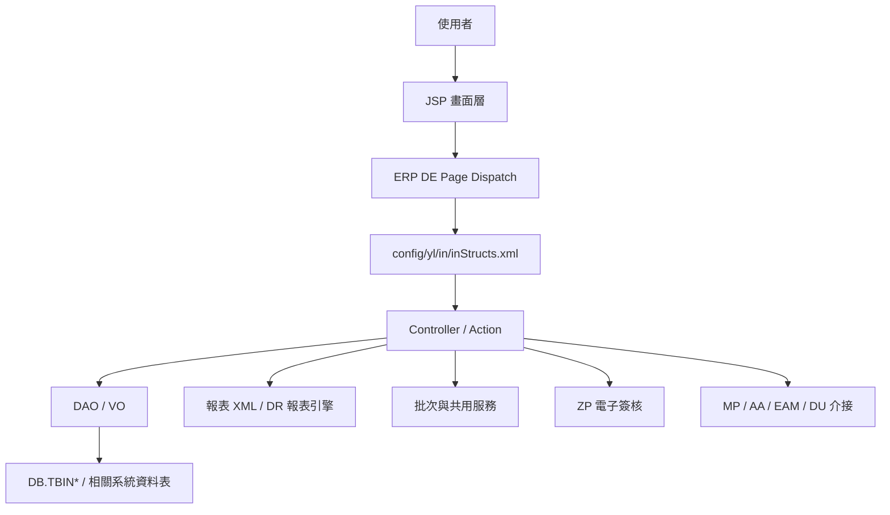

# IN 功能規格手冊

## 1. 系統概述

### 1.1 系統定位

`IN` 模組為 ERP 之庫存、物料與資材異動管理系統，主要負責物料基本資料、庫別與儲位、收發存異動、帳務過帳、指定廠商、簽核會辦、報廢申請、批次處理及管理報表。系統透過 JSP 畫面、Java Controller、DAO／VO 與報表 XML 組成完整作業鏈，並與採購、會計、設備維修、電子簽核及使用者組織資料互相銜接。

本文件依目前程式目錄與設定檔整理，主要依據如下：

- `config/yl/in/inStructs.xml`：正式 page、JSP、Controller、Action、VO 對應。
- `jsp/`：使用者操作畫面、查詢頁、清單頁、列印頁與跨系統輔助頁。
- `src/com/icsc/in/`：主要 Controller、批次程式、共用工具與商業邏輯。
- `src/com/icsc/in/dao/` 與 `dao/sql/`：資料表 DAO／VO 與建表或欄位參考 SQL。
- `xml/dr/`：庫存、異動、帳務、報廢與各類管理報表定義。
- `src/com/chsteel/in/esign/`：電子簽核回呼處理。

### 1.2 系統使用對象

- 庫存與資材管理人員：維護物料、庫別、儲位、收發存異動、盤點與庫存查詢。
- 申請與領用單位：提出材料需求、查詢可用庫存、確認領用或退料狀態。
- 採購與廠商管理人員：處理指定廠商、採購相關物料資料與採購系統介接。
- 會計與帳務人員：確認庫存異動對應之帳務資料、會計科目、暫估與過帳結果。
- 主管與簽核人員：審核領料、報廢、會辦及其他需授權之作業。
- 系統維護人員：管理代碼、批次、資料轉入轉出、權限與例外處理。

### 1.3 系統目標

- 建立物料、庫存、儲位與帳務資料的一致性管理。
- 支援材料收料、發料、退料、轉撥、盤點、報廢等庫存異動流程。
- 提供依人員、部門、物料、未使用、異動紀錄等條件之查詢與報表。
- 透過簽核與會辦機制控管重要異動，留下送簽、核准、駁回、取消與授權紀錄。
- 透過批次與介接作業，與 `MP` 採購、`AA` 會計、`EAM` 設備維修、`ZP` 電子簽核及 `DU` 組織人員資料整合。

### 1.4 作業範圍

本模組功能可歸納為下列範圍：

- 基本資料維護：物料、庫別、儲位、分類、帳務代碼、系統代碼、廠商資料。
- 庫存異動作業：收料、發料、退料、轉撥、調整、盤點與庫存結算。
- 庫存查詢作業：依物料、庫別、儲位、部門、帳務、異動單號或歷史紀錄查詢。
- 帳務與對帳作業：庫存金額、會計科目、暫估、過帳、`AA` 對帳與異常檢核。
- 簽核與會辦作業：會辦單、材料報廢單、簽核註記、流程設定與簽核回呼。
- 批次作業：庫存結算、異動批次、會計拋轉、資料補正與定期同步。
- 報表作業：庫存、異動、帳務、採購、報廢、盤點、個人保護具及跨系統報表。
- 跨系統支援：`MP` 採購領用、`EAM` 維修領料、`ZP` 電子簽核、`AA` 會計與 `DU` 人員組織資料。

## 2. 系統架構總覽

### 2.1 整體架構

### 2.2 程式分層

| 層級 | 主要位置 | 說明 |
| --- | --- | --- |
| 畫面層 | `jsp/` | 提供查詢、維護、清單、列印、匯出、簽核與跨系統輔助畫面。 |
| Page 設定層 | `config/yl/in/inStructs.xml` | 定義 `_pageId`、JSP、Controller、Action flag、method、forward 與 VO 轉換。 |
| 控制層 | `src/com/icsc/in/*.java` | 實作查詢、新增、修改、刪除、送簽、核准、駁回、匯出、列印、批次等行為。 |
| 資料存取層 | `src/com/icsc/in/dao/`、`dao/` | 以 DAO／VO 對應 `DB.TBIN*` 等資料表，處理資料新增、查詢、更新與刪除。 |
| 報表層 | `xml/dr/` | 以 DR／Jasper 類型 XML 定義查詢 SQL、欄位、版面與列印輸出。 |
| 共用工具層 | `src/com/icsc/in/util/`、`src/com/icsc/in/tag/`、`src/com/icsc/in/web/` | 提供物料編碼、選單、遠端欄位選擇、日誌、查詢工具與 JSP 輔助元件。 |
| 介接層 | `injcEamAPI`、`injctstAPI`、`injcBatch*`、`injcMPBatch*`、`esign` | 處理跨系統資料交換、批次更新及電子簽核回呼。 |

### 2.3 Page Dispatch 與 Action 模式

`inStructs.xml` 目前定義 53 個正式 page。常見 Action flag 與用途如下：

| Action flag | 常見 method | 功能語意 |
| --- | --- | --- |
| `I` | `query` | 查詢或載入資料。 |
| `N` | `create`、`insert` | 新增主檔、明細或異動資料。 |
| `R` | `update` | 修改既有資料。 |
| `D` | `delete` | 刪除或作廢資料。 |
| `C` | `clear`、`cancelSign`、`copy` | 清除畫面、取消簽核或複製資料，依 page 定義而異。 |
| `P` | `Print` | 列印報表。 |
| `T` | `csv` | 匯出 CSV 或清單資料。 |
| `S` | `sendSign`、`sendAgreement`、`saveDoc` | 送簽、送會辦或文件儲存。 |
| `A`、`J` | `agree`、`reject` | 核准或駁回。 |
| `EM` | `empower` | 授權或代理處理。 |
| `F` | `flow`、`fuzzyqueryA`、`justForward` | 流程設定、模糊查詢或頁面轉向。 |

### 2.4 主要資料表群

| 資料表 | VO／DAO | 功能定位 | 主要用途 | 關聯功能 |
| --- | --- | --- | --- | --- |
| `TBIN0002` | `injc0002VO`／`injc0002DAO` | 物料主檔 | 維護物料編號、品名規格、單位、庫別、分類與庫存管制屬性。 | 物料查詢、收發料、庫存報表、EAM／MP 物料帶入。 |
| `TBIN0011`、`TBIN0012`、`TBIN0013` | `injc0011VO`／`injc0011DAO`、`injc0012VO`／`injc0012DAO`、`injc0013VO`／`injc0013DAO` | 庫別與儲位基礎檔 | 維護庫別、子庫、儲位與相關名稱資料。 | 物料主檔、庫存查詢、收發料、儲位選單。 |
| `TBIN0016`、`TBIN0018` | `injc0016VO`／`injc0016DAO`、`injc0018VO`／`injc0018DAO` | 物料分類與庫存屬性 | 維護物料類別、品項、等級或庫存分類條件。 | 物料編碼、分類查詢、報表統計。 |
| `TBIN0024` | `injc0024VO`／`injc0024DAO` | 收發料主檔 | 記錄收料、發料、退料、調整等單據主檔資料。 | `injjq0301Edit`、EAM 領料、MP 領用、收發料報表。 |
| `TBIN0025` | `injc0025VO`／`injc0025DAO` | 收發料明細 | 記錄單據明細物料、數量、庫別、儲位、批號與狀態。 | `injjq0302Edit`、庫存數量查詢、批次結算、報表。 |
| `TBIN0026` | `injc0026VO`／`injc0026DAO` | 異動主檔 | 記錄庫存異動單頭、異動日期、部門、人員與帳務相關資訊。 | `injjq0101Edit`、異動查詢、帳務拋轉。 |
| `TBIN0027` | `injc0027VO`／`injc0027DAO` | 異動明細 | 記錄庫存異動明細物料、數量、金額、庫存位置與帳務欄位。 | `injjq0102Edit`、異動報表、AA 對帳、批次處理。 |
| `TBINCH26`、`TBINCH27` | `injcch26VO`／`injcch26DAO`、`injcch27VO`／`injcch27DAO` | 歷史異動檔 | 保存已結轉或歷史期間之異動主檔與明細。 | `injjq0201Edit`、`injjq0202Edit`、歷史查詢、異動紀錄報表。 |
| `TBINCL01`、`TBINCL02`、`TBINCL03`、`TBINCL04`、`TBINCL06` | `injccl01VO`／`injccl01DAO`、`injccl02VO`／`injccl02DAO`、`injccl03VO`／`injccl03DAO`、`injccl04VO`／`injccl04DAO`、`injccl06VO`／`injccl06DAO` | 結算與分類庫存檔 | 保存月結、分類、儲位、盤點或結算後庫存資料。 | 庫存月結、盤點、分類庫存查詢、管理報表。 |
| `TBINCLS01`、`TBINCLS02` | `injccls01VO`／`injccls01DAO`、`injccls02VO`／`injccls02DAO` | 結算查詢檔 | 保存結算後查詢用主檔與明細資料。 | `injjq0901List` 至 `injjq0903Edit`、結算查詢。 |
| `TBINCHCL01`、`TBINCHCL02` | `injcchcl01VO`／`injcchcl01DAO`、`injcchcl02VO`／`injcchcl02DAO` | 歷史結算查詢檔 | 保存歷史期間分類庫存或收發存查詢資料。 | `injjq0801List` 至 `injjq0803Edit`、歷史庫存查詢。 |
| `TBIN0022`、`TBIN0023`、`TBIN0023A`、`TBIN0023B` | `injc0022VO`／`injc0022DAO`、`injc0023VO`／`injc0023DAO`、`injc0023a_vo`／`injc0023a_dao`、`injc0023b_vo`／`injc0023b_dao` | 帳務規則與會計文件 | 維護庫存異動對應之會計規則、暫估或會計文件資料。 | `injjMAccDoc`、AA 對帳、帳務拋轉、暫估報表。 |
| `TBIN0050`、`TBIN0051`、`TBIN0052` | `injc0050VO`／`injc0050DAO`、`injc0051VO`／`injc0051DAO`、`injc0052VO`／`injc0052DAO` | 帳務代碼與輔助設定 | 維護會計科目、用途別、帳務分類與輔助代碼。 | 帳務檢核、收發料異動、帳務報表。 |
| `TBINPB01`、`TBINPB02` | `injcpb01VO`／`injcpb01DAO`、`injcpb02VO`／`injcpb02DAO` | 系統代碼主檔／明細 | 維護 IN 模組共用代碼與代碼明細。 | `injjpb0101Edit`、`injjpb0102Edit`、選單、狀態顯示。 |
| `TBINVENDOR` | `injcVendorVO`／`injcVendorDAO` | 指定廠商資料 | 維護物料指定廠商、相關文件與確認狀態。 | `injjVendorMain`、文件上傳／下載、採購介接。 |
| `TBINEMPMTRL`、`TBINEXCHEMPL` | `injcEmpMtrlVO`／`injcEmpMtrlDAO`、`injcExchEmpl_vo`／`injcExchEmpl_dao` | 人員物料與人員異動 | 維護個人或部門常用物料，以及人員異動資料。 | 個人保護具、用料查詢、人員異動批次。 |
| `TBINTOOLS` | `injctools_vo`／`injctools_dao` | 會辦／工具單資料 | 保存會辦單、工具單或需簽核作業之主資料。 | `injjht01`、送會辦、核准、駁回、授權。 |
| `TBINANNOTATE` | `injcAnnotate_vo`／`injcAnnotate_dao` | 簽核註記 | 記錄簽核意見、處理備註與溝通紀錄。 | `injjComFLog`、`injjht01`、`injjscrapFNL01`。 |
| `TBINWORKDOC` | `injcWorkDoc_vo`／`injcWorkDoc_dao` | 工作文件／附件 | 保存簽核或作業文件關聯資料。 | 會辦、報廢、電子簽核附件。 |
| `TBINAGREEIDLIST` | `injcAgreeIDList_vo`／`injcAgreeIDList_dao` | 簽核人員與流程清單 | 維護簽核人員、流程節點、追加簽核與例外流程。 | `injjAgreeID`、流程設定、代理授權。 |
| `TBINDEPTFLOW`、`TBINDOCFLOW` | `injcDeptFlow_vo`／`injcDeptFlow_dao`、`injcDocFlow_vo`／`injcDocFlow_dao` | 部門／文件流程設定 | 維護依部門或文件類別判斷之簽核流程資料。 | 會辦流程、報廢簽核、流程查核。 |
| `TBINS02`、`TBINS03` | `injcs02VO`／`injcs02DAO`、`injcs03VO`／`injcs03DAO` | 材料報廢主檔／明細 | 記錄材料報廢申請、明細、狀態與簽核資訊。 | `injjscrap01`、`injjscrapFNL01`、電子簽核、報廢報表。 |
| `TBIN0070`、`TBIN0071`、`TBIN0074`、`TBIN0075`、`TBIN0076`、`TBIN0077` | `injc0070VO`／`injc0070DAO`、`injc0071VO`／`injc0071DAO`、`injc0074VO`／`injc0074DAO`、`injc0075VO`／`injc0075DAO`、`injc0076VO`／`injc0076DAO`、`injc0077VO`／`injc0077DAO` | 個人保護具與管制物料 | 管理個人保護具、管制物料、用量、簽收、庫存與匯出資料。 | `injj0070Edit` 至 `injj0077Edit`、`AMR00480`、`AMR00490`、`AMR00500`。 |

### 2.5 報表架構

報表集中於 `xml/dr/`，檔名可分為下列類型：

- `injrStock*`：庫存相關報表。
- `injrTran*`、`injrTranRecord*`：庫存異動與異動紀錄報表。
- `injrRpt*`、`injcRpt*`：一般管理、統計與查核報表。
- `injrAcctAmt`、`injrAAStagnet`、`injrStagnet`、`20060118`：帳務、暫估與 `AA` 對帳報表。
- `injrMatrlScrabReq*`、`injrHTScrabReqESign`、`injrESingSubBySql`：報廢及電子簽核相關報表。
- `infjrPerson`、`infjrPart`、`infjrNoUse`、`infjrMatrlNo`、`infjrChange`：依人員、部門、未使用、物料與異動條件輸出。
- `mpjr*`：與採購或用料需求相關之報表。
- `AMR00480`、`AMR00490`、`AMR00500`：個人保護具相關報表。

### 2.6 外部系統與共用服務

| 系統／服務 | 介接線索 | 功能 |
| --- | --- | --- |
| `MP` 採購 | `mpjj*` JSP、`injcMPBatch*`、`mpjr*` 報表 | 材料需求、採購單、領用、批次與採購報表。 |
| `AA` 會計 | `injcBatch`、`injcAAStagnet`、`injrAAStagnet`、`20060118` | 庫存帳務拋轉、暫估、會計科目與對帳。 |
| `EAM` 設備維修 | `injcEamAPI`、`mzxjin_*_yl.jsp`、`INJJCHEAM04` | 維修領料、由設備維修拋轉庫存申請、回寫 IN 單號。 |
| `ZP` 電子簽核 | `zpjcESignAPI`、`src/com/chsteel/in/esign/` | 送簽、取消、核准、駁回與簽核回呼。 |
| `DU` 組織人員 | `TBDU01`、`TBDU04` 查詢 | 員工、部門、職位與主管資料。 |
| `DR` 報表引擎 | `drjcRptUtil`、`xml/dr/` | 報表產生、列印與匯出。 |

## 3. 功能模組詳細說明

### 3.1 功能說明維護模組

對應 page：

- `injjf01`：`tbinf01`，提供功能主檔查詢、新增、修改、刪除。
- `injjf02`：`injcf02`，提供功能說明查詢、新增、修改、刪除、權限新增與資料變更。
- `injjf03`：`injcf03`，提供功能明細或補充資料維護。
- `injjfRpt_person`、`injjfRpt_dept`、`injjfRpt_change`、`injjfRpt_nouse`、`injjfRpt_matrlNo`：依人員、部門、異動、未使用與物料編號列印功能／物料相關報表。
- `injjf_batch`：`injcfbatch.empChangeBatch`，處理人員異動批次。

主要功能：

- 維護系統功能與相關說明資料。
- 提供依人員、部門、異動狀態與物料之查詢及報表。
- 支援批次處理人員異動後的資料同步。

主要資料物件：

- `injcf01VO`、`injcf02VO`、`injcf03VO`、`injcf04VO`。

### 3.2 物料與收發存異動模組

對應 page：

- `injjq0101Edit`：`injcq01`，對應 `injc0026VO`，處理物料異動主檔作業。
- `injjq0102Edit`：`injcq01CR`，對應 `injc0027VO`，處理物料異動明細作業。
- `injjq0201Edit`：`injcq02`，對應 `injcch26VO`，處理歷史異動主檔。
- `injjq0202Edit`：`injcq02CR`，對應 `injcch27VO`，處理歷史異動明細。
- `injjq0301Edit`：`injcq03`，對應 `injc0024VO`，處理收發料主檔。
- `injjq0302Edit`：`injcq03CR`，對應 `injc0025VO`，處理收發料明細。

主要功能：

- 建立、查詢、修改、刪除庫存異動主檔與明細。
- 支援清除畫面、複製新增與異動明細帶入。
- 維護收料、發料、退料、調整、轉撥等與庫存數量相關之交易。
- 保留歷史主檔與明細供查詢及報表使用。

主要資料物件：

- `TBIN0024`、`TBIN0025`、`TBIN0026`、`TBIN0027`。
- `TBINCH26`、`TBINCH27`。

### 3.3 系統代碼與帳務規則模組

對應 page：

- `injjpb0101Edit`：`injcpb01`，維護系統代碼主檔。
- `injjpb0102Edit`：`injcpb01CR`，維護系統代碼明細。
- `injjMAccDoc`：`injcMAccDoc`，維護材料帳務暫估或會計文件資料。

主要功能：

- 維護系統代碼、代碼明細、會計規則與帳務輔助資料。
- 提供庫存交易對應帳務科目之查詢與維護基礎。
- 支援新增、修改、刪除與批次對帳資料前置維護。

主要資料物件：

- `TBINPB01`、`TBINPB02`。
- `TBIN0022`、`TBIN0023`、`TBIN0023A`、`TBIN0023B`。
- `TBIN0050`、`TBIN0051`、`TBIN0052`。

### 3.4 庫存查詢與明細維護模組

對應 page：

- `injjq0401Edit`、`injjq0402Edit`：依條件查詢收發存明細。
- `injjq0501Edit`：提供庫存相關狀態確認、回復或取消。
- `injjq0502Edit`：庫存查詢輔助作業。
- `injjq0601Edit`、`injjq0602Edit`：明細新增、修改、刪除及不同條件之查詢。
- `injjq0701Edit`、`injjq0702Edit`：進一步查詢特定庫存或明細資料。
- `injjq0801List` 至 `injjq0803Edit`：歷史分類或儲位資料查詢與維護。
- `injjq0901List` 至 `injjq0903Edit`：結算分類或庫存歷史資料查詢與維護。

主要功能：

- 提供依庫別、儲位、物料、部門、異動日期與單號等條件之查詢。
- 支援模糊查詢、清單查詢、明細查詢與部分資料維護。
- 將主檔、明細、歷史檔、分類檔與結算檔串聯，供日常管理與月底結算查核。

主要資料物件：

- `TBIN0025`、`TBINCHCL01`、`TBINCHCL02`。
- `TBINCLS01`、`TBINCLS02`。
- `TBINCL01`、`TBINCL02`、`TBINCL03`、`TBINCL04`、`TBINCL06`。

### 3.5 指定廠商與附件文件模組

對應 page：

- `injjVendorMain`：`injcVendorCR`，對應 `injcVendorVO`。

主要功能：

- 查詢指定廠商資料。
- 上傳、儲存、下載相關文件。
- 修改、刪除、確認指定廠商資料。
- 透過 `owner` action 轉向廠商明細畫面。

主要資料物件：

- `TBINVENDOR`。

### 3.6 批次作業模組

對應 page：

- `injjBatchJob01`：`injcBatchJob01`，查詢與更新物料批次資料。
- `injjBatchJob02`：`injcBatchJob02`，查詢批次處理結果或中介資料。
- `injjBatchJob03`：`injcBatchJob03`，查詢與更新物料批次資料。

主要程式：

- `injcBatch`、`injcBatch2`、`injcBatch3`、`injcBatch4`。
- `injcMPBatch`、`injcMPBatch2`、`injcMPBatch3`、`injcMPBatch4`、`injcMPBatch5`。
- `injcStockBatch`、`injcMakeInventoryBatch`、`injcT020Batch`、`injc010Batch`。

主要功能：

- 執行庫存月結、交易彙總、帳務拋轉與暫估處理。
- 處理採購或用料需求相關批次。
- 維護批次結果、錯誤訊息與補正資料。
- 提供定期或人工觸發之庫存資料整理。

### 3.7 會辦、簽核與流程設定模組

對應 page：

- `injjht01`：`injcht01`，會辦或工具單主作業。
- `injjht04Edit`：`injcht04`，會辦明細或關聯資料維護。
- `injjComFLog`：`injcComFLog`，簽核註記或溝通紀錄維護。
- `injjAgreeID`：`injcAgreeID`，流程、簽核人員、追加簽核與例外流程設定。

`injjht01` 主要 Action：

- `S:sendAgreement`：送出會辦或簽核。
- `SM:sendman`、`RM:rejectman`：人員送出或退回。
- `A:agree`、`J:reject`：核准或駁回。
- `NG:notget`：未取得或例外狀態處理。
- `RUN`、`RVS`、`Mqty`、`RN`、`RR`、`RD`：各類執行、回復、數量或狀態轉換。
- `EM:empower`：代理或授權處理。

主要功能：

- 管理需要會辦或主管核准之作業單。
- 記錄簽核註記、附件與工作文件。
- 設定簽核流程、部門流程、簽核人員與例外處理。
- 與電子簽核 API 串接，支援核准、駁回與回呼更新。

主要資料物件：

- `TBINTOOLS`、`TBINANNOTATE`、`TBINWORKDOC`、`TBINAGREEIDLIST`。
- `TBINDEPTFLOW`、`TBINDOCFLOW`。

### 3.8 個人保護具與特殊物料管理模組

對應 page：

- `injj0070Edit`：個人保護具或特殊物料主檔維護，支援查詢、新增、修改、刪除、展開、列印、匯出、複製與前後筆查詢。
- `injj0071`：列印 `AMR00490` 類報表。
- `injj0072`：列印 `AMR00500` 類報表。
- `injj0073`：上傳或匯出查詢。
- `injj0075Edit`：管制物料查詢。
- `injj0076`：管制物料使用或消耗量匯出。
- `injj0077Edit`：管制物料庫存或安全量維護。

主要功能：

- 維護人員或部門所需個人保護具資料。
- 查詢保護具使用紀錄、用量與庫存。
- 匯出保護具簽收、上傳、管制物料與消耗量資料。
- 產生 `AMR00480`、`AMR00490`、`AMR00500` 等報表。

主要資料物件：

- `TBIN0070`、`TBIN0071`、`TBIN0074`、`TBIN0075`、`TBIN0076`、`TBIN0077`。

### 3.9 材料報廢與電子簽核模組

對應 page：

- `injjscrap01`：`injcscrap01`，材料報廢申請單。
- `injjscrapFNL01`：`injcscrapFNL01`，材料報廢後續處理與簽核。

主要 Action：

- `N:create`：新增報廢申請。
- `R:update`：修改報廢資料。
- `D:delete`：刪除資料。
- `AB:abolish`：作廢申請。
- `I:query`：查詢申請。
- `S:sendSign`：送電子簽核。
- `C:cancelSign`：取消簽核。
- `NA:agree`：核准或確認。
- `EM:empower`：代理授權。

主要功能：

- 建立材料報廢申請主檔與明細。
- 支援送簽、取消送簽、核准、作廢與後續處理。
- 透過 `ZP` 電子簽核 API 與回呼類別更新簽核結果。
- 產生材料報廢申請與簽核報表。

主要資料物件：

- `TBINS02`、`TBINS03`。
- `TBINANNOTATE`、`TBINWORKDOC`。

### 3.10 報表與列印模組

主要 Controller：

- `injcRpt01`、`injcRpt02`、`injcRpt03`、`injcRpt04`、`injcRpt05`、`injcRpt091`、`injcRpt111`、`injcRpt750`。
- `injcCrTranRecord`、`injcCrInventoryQty`、`injcCrMatrlInvQty`、`injcCrAccAmt`、`injcCrAAStagnet`、`injcCrStagnet`。
- `injcStock`、`injcStock1`、`injcStock2`、`injcMatrlInvQty`、`injcTranRecord`。

主要功能：

- 產生庫存現況、異動紀錄、交易明細、領料單、採購相關與帳務報表。
- 依日期、庫別、物料、單號、部門、人員、帳務科目等條件輸出。
- 支援 DR／Jasper XML 報表格式，並由程式傳入參數與資料來源。

### 3.11 採購與用料需求介接模組

相關畫面與程式：

- `mpjjYLReq.jsp`、`mpjjIssue.jsp`、`mpjjYLChecked.jsp`、`mpjjYLLCApply.jsp`。
- `mpjjrp0101List.jsp`、`mpjjrp0201List.jsp`、`mpjjrp0301List.jsp`、`mpjjrp0401List.jsp`。
- `injcMPBatch*`、`injctstAPI`、`injctst02Control`、`injctst03Control`。
- `mpjrYLReqM.xml`、`mpjrYLMatchM.xml`、`mpjrPaySQ.xml`、`mpjrBillNoP1.xml`。

主要功能：

- 支援採購請購、領用、收料與查詢。
- 由採購資料帶入物料、數量、價格、供應商與需求單資訊。
- 提供採購相關查詢報表與批次處理。
- 與庫存資料共同確認可用量、儲位與歷史領用紀錄。

### 3.12 EAM 維修領料介接模組

相關畫面與程式：

- `mzxjin_401M_yl.jsp`、`mzxjin_401L_yl.jsp`、`mzxjin_403L_yl.jsp`。
- `mzxjin_04MatrlNo_yl.jsp`、`mzxjin_04MatrlNoList_yl.jsp`、`mzxjin_04SMatrlNo_yl.jsp`。
- `injcEamAPI`。

主要功能：

- 接收 `EAM` 傳入之維修領料參數。
- 依 `EAM` 傳入資料建立或查詢 `IN` 材料申請與發料單。
- 將 `IN` 產生之單號回寫至 `EAM`。
- 提供設備維修所需之物料查詢、庫別帶入、領料明細與狀態確認。

### 3.13 共用查詢、選單與輔助工具模組

主要程式：

- `injcSelectMemu`：代碼與下拉選單產生。
- `injcTableControl`、`injcMapControl`：表格與 request／資料表對應工具。
- `injcMtrlNo`、`injcUtil`、`injcUt`、`injcSU`、`injcUQ`：物料編碼、字串、查詢與共用邏輯。
- `src/com/icsc/in/tag/*`：JSP tag 或遠端選取元件。
- `src/com/icsc/in/web/*`：Web 輔助工具。

主要功能：

- 提供物料分類、庫別、儲位、帳務科目、部門、單位與代碼選單。
- 支援 JSP 查詢條件與彈窗選取。
- 統一資料表存取、欄位映射、訊息處理與日誌紀錄。

### 3.14 資料與流程控管重點

- 庫存交易應同時維護主檔與明細，避免單頭與單身不一致。
- 涉及帳務之交易應確認會計科目、成本中心、數量、金額與過帳狀態。
- 報廢、會辦與重要異動需檢核簽核狀態，避免未核准資料進入後續庫存或帳務處理。
- 批次作業需保留錯誤訊息、處理日期、處理人員與可重跑條件。
- 與 `MP`、`AA`、`EAM` 介接時，需檢查外部單號、回寫狀態、交易日期與資料一致性。
- 報表 SQL 涉及多表關聯，正式審查時應逐項核對查詢條件、欄位意義與資料來源。

### 3.15 待正式審查項目

本文件為依現有程式結構整理之功能規格初稿。若要作為正式驗收或改版設計依據，建議再補強下列項目：

- 逐一核對 `jsp/` 中未納入 `inStructs.xml` 的舊式作業是否仍在使用。
- 對每一個主要報表補上參數、查詢條件、輸出欄位與使用者情境。
- 對批次程式補上排程時間、觸發來源、輸入輸出資料表與錯誤重跑方式。
- 對 `MP`、`AA`、`EAM`、`ZP` 介接補上正式資料契約與狀態碼定義。
- 對簽核流程補上每一類單據之送簽、核准、駁回、作廢與取消規則。
