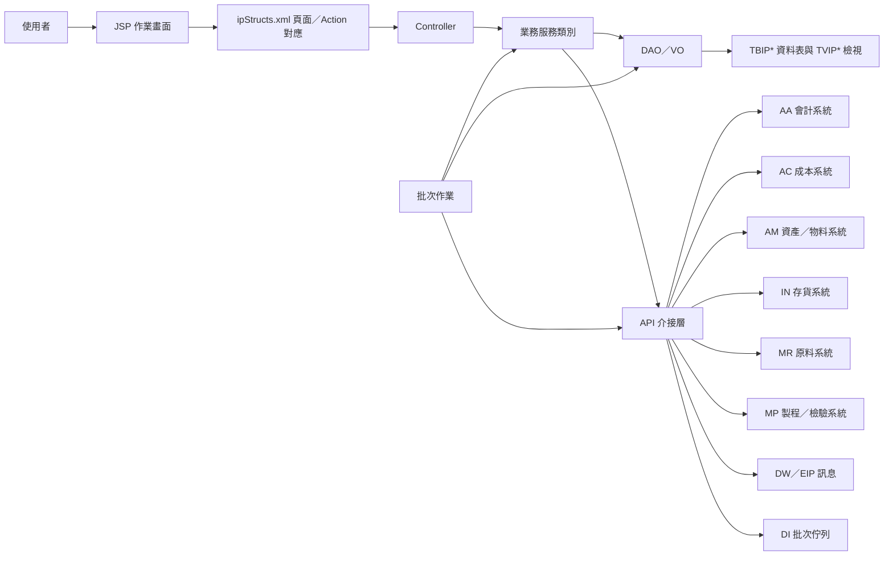

# IP 功能規格手冊

## 1. 系統概述

### 1.1 系統定位

`IP` 模組為 ERP 中處理存貨、生產投入產出、成本中心、會計入帳與相關報表的功能模組。系統以產品代碼、帳務科目、產線、成本中心、交易規則及調整單據為核心，將來源系統資料轉入 `IP` 後，進行資料檢核、待調整處理、日月彙總、成本中心彙總、會計分錄與外部系統回拋。

本模組主要服務對象包含生產、成本、會計、庫存與資訊維運人員。前台使用 JSP 頁面進行資料維護、查詢、調整與報表列印；後台則透過 Java 批次與 API 類別執行自動檢核、月結、資料備份及跨系統介接。

### 1.2 系統目標

- 建立產品基本資料、產品屬性、帳務科目、價格與成本中心對應規則。
- 管理生產投入、產出、回收品、外購品及銷售相關之存貨異動資料。
- 將來源資料轉為標準化交易資料，區分已完成資料與待調整資料。
- 依帳務規則產生會計入帳、成本中心及管理報表所需資料。
- 支援日結、月結、彙總、查核、報表產製與外部系統資料回拋。

### 1.3 功能範圍

本模組依頁面與程式命名，可分為下列功能群：

- `0101`：產品資料、屬性、帳務科目與產品價格維護。
- `0102`：帳務科目、帳務屬性與入帳規則維護。
- `0103`：產品價格查詢與調整。
- `0104`：產線、成本中心、投入產品、產出產品、前後工程、回收品與活動設定。
- `0201`：產品判定因子維護。
- `0202`：交易規則維護。
- `0203`：入帳與成本中心規則維護。
- `0501` 至 `0505`：待調整資料查詢、執行、修正與轉入正式交易。
- `0601`、`0602`、`0606`：成本中心與交易資料查詢、參照號碼維護及成本中心彙總調整。
- `0801` 至 `0803`：日月報表、彙總報表、交易資料明細與帳務明細查詢。
- `0901`：投入／產出成本中心報表。
- `1001` 至 `1004`：系統參數、樹狀設定、批次基本設定與代碼資料維護。
- 批次與介接：月結、存貨餘額、交易檢核、回收品處理、會計與成本系統回拋、報表匯出及資料備份。

### 1.4 主要資料表

| 資料表 | VO／DAO | 功能定位 | 主要用途 | 關聯功能 |
| --- | --- | --- | --- | --- |
| `TBIPTDOK` | `ipjcTDOKVO`／`ipjcTDOKDAO` | 正式交易主檔 | 儲存已完成檢核、可供彙總與入帳之標準交易資料，主鍵為 `slipNo`、`slipNoItem`、`compId`。 | 交易資料建立、日月彙總、成本中心彙總、報表、會計／成本回拋。 |
| `TBIPTDSRC` | 未見對應獨立 VO／DAO，欄位結構近似 `ipjcTDOKVO` | 來源資料暫存 | 暫存來源系統或匯入作業進入 `IP` 前的交易資料。 | 資料匯入、交易轉換、檢核前置處理。 |
| `TBIPTDERR` | `ipjcTDERRVO`／`ipjcTDERRDAO` | 待調整交易資料 | 儲存檢核異常、規則不足或需人工補正之交易資料。 | 待調整資料查詢、修正、重新執行、送回正式交易。 |
| `TVIPTDOK` | 由 `ipjcTDOKDAO` 或查詢 SQL 使用 | 正式交易整合檢視 | 整合 `TBIPTDOK` 與歷史備份表，提供跨期間交易查詢。 | 交易查詢、歷史資料查詢、報表產出。 |
| `TBIPPDPRICE` | `ipjcpdPriceVO`／`ipjcpdPriceDAO` | 產品價格資料 | 依年月、產品性質、產品代碼與價格類別管理標準價格或實際價格。 | 產品價格維護、入帳金額計算、報表。 |
| `TBIPMCC` | `ipjcMCCVO`／`ipjcMCCDAO` | 成本中心月彙總 | 依月份、成本中心、帳務科目、產品與 `WCE` 彙總數量與金額。 | 成本中心查詢、成本調整、月結、會計／成本回拋。 |
| `TBIPMDAY` | `ipjcMDayVO`／`ipjcMDayDAO` | 產品日彙總 | 依產品、規格、年月與帳務科目保存每日數量彙總。 | 日報、月報、存貨異動查詢、餘額計算。 |
| `TBIPBALANCE` | `ipjcBalanceVO`／`ipjcBalanceDAO` | 存貨餘額比較 | 儲存盤點日、產品、規格與系統餘額比對結果。 | 存貨盤點、餘額檢核、明細餘額報表。 |
| `TBIPMILL` | `ipjcMillVO`／`ipjcMillDAO` | 產線與工程設定 | 維護產線、系統、成本中心、投入／產出產品、前後工程與活動設定。 | 產線設定、工程關聯、交易規則判定、回收品設定。 |
| `TBIPTR` | `ipjcTRVO`／`ipjcTRDAO` | 交易規則設定 | 定義系統、產線、活動、前後工程、產品與執行功能之交易轉換規則。 | 交易資料建立、資料檢核、待調整原因判定。 |
| `TBIPAIRULE` | `ipjcAIRuleVO`／`ipjcAIRuleDAO` | 入帳規則設定 | 定義表單、產品帳務屬性、帳務科目、價格類別與借貸入帳方式。 | 會計入帳、成本入帳、產品帳務規則維護。 |
| `TBIPAIATTRI` | `ipjcAIAttriVO`／`ipjcAIAttriDAO` | 帳務科目屬性 | 定義帳務科目可用屬性與相關設定值。 | 帳務科目屬性維護、入帳規則判定。 |
| `TBIPACCTITEM` | `ipjcacctItemVO`／`ipjcacctItemDAO` | 帳務科目基本檔 | 維護 `IP` 使用之帳務科目代碼、名稱與基本屬性。 | 帳務科目維護、交易分類、報表分類。 |
| `TBIPRD` | `ipjcrdVO`／`ipjcrdDAO` | 系統參數明細 | 儲存系統樹狀設定、代碼、批次參數與各類控制設定。 | 系統參數維護、批次設定、動態規則、報表設定。 |

## 2. 系統架構總覽

### 2.1 程式分層

`IP` 模組採用傳統 ERP Web 模組架構，主要分層如下：

| 分層 | 路徑 | 說明 |
| --- | --- | --- |
| 使用者介面層 | `jsp/` | 使用者進行查詢、維護、列印、調整與批次啟動的 JSP 頁面。 |
| 頁面控制層 | `src/com/icsc/ip/*.java` | 對應 `ipStructs.xml` 的 Controller，處理頁面動作、驗證、查詢與更新。 |
| 業務服務層 | `src/com/icsc/ip/bp/`、`src/com/icsc/ip/*.java` | 封裝產品、交易、彙總、待調整、成本中心與帳務相關處理邏輯。 |
| 資料存取層 | `src/com/icsc/ip/dao/`、`dao/*.dao` | 對應資料表 VO／DAO 與查詢更新邏輯。 |
| API 介接層 | `src/com/icsc/ip/api/` | 封裝與 `AA`、`AC`、`AM`、`DI`、`DS`、`DW`、`IN`、`IX`、`MP`、`MR`、`SS` 等系統互動。 |
| 批次作業層 | `src/com/icsc/ip/bat/` | 月結、存貨餘額、資料檢核、回拋、報表產生、備份與自動處理作業。 |
| 設定層 | `config/ipStructs.xml`、`src/com/icsc/ip/ini/` | 頁面路由、Controller、Action、VO 對應、系統常數與動態呼叫設定。 |
| 資料庫定義 | `dao/sql/` | `TBIP*` 資料表與 `TVIP*` 檢視建立 SQL。 |

### 2.2 頁面控制架構

`config/ipStructs.xml` 共定義 59 個頁面節點與 36 個 Controller。每個頁面以 `pageID` 對應 JSP，並指定 Controller、Action flag、處理 method、驗證 method 及資料轉換 VO。

常見 Action 代碼如下：

| Action | 常見 method | 功能意義 |
| --- | --- | --- |
| `I` | `doQuery`、`doQueryList`、`query` | 查詢單筆或清單資料。 |
| `N` | `doCreate`、`doCreateList`、`create` | 新增資料。 |
| `R` | `doUpdate`、`doUpdateList`、`update`、`doRun` | 修改資料或執行處理。 |
| `D` | `doRemove`、`doRemoveList`、`delete` | 刪除資料。 |
| `P` | `doPrint` | 列印或產生報表。 |
| `PREV`、`NEXT` | `doQueryPrevList`、`doQueryNextList` | 分頁查詢。 |
| `C`、`AC` | `doCopy`、`doCopyActivity` | 複製規則或活動設定。 |
| `H` | `doHistory` | 查詢歷史資料。 |
| `COPYTOERR` | `doCopyToERR` | 將正式交易複製到待調整資料。 |

### 2.3 邏輯架構

### 2.4 主要資料流

1. 來源系統或人工輸入資料進入 `TBIPTDSRC` 或頁面輸入物件。
2. 程式依產品基本資料、帳務科目、交易規則與產線設定進行檢核。
3. 檢核成功的資料寫入 `TBIPTDOK`；異常或需人工補正資料寫入 `TBIPTDERR`。
4. `TBIPTDOK` 依日、月、成本中心、產品、帳務科目及 `WCE` 產生 `TBIPMDAY`、`TBIPMCC`、`TBIPBALANCE` 等彙總資料。
5. 批次或人工作業依入帳規則將資料拋轉至 `AA` 會計、`AC` 成本、`AM`、`MR`、`MP`、`IN` 等外部模組。
6. 報表功能由 `DX`、`DR` 或各報表 Controller 產生 Excel／列印輸出。

### 2.5 外部系統介接

| 介接類別 | 代表程式 | 功能說明 |
| --- | --- | --- |
| 會計系統 `AA` | `api/ipjcAA.java` | 取得會計傳票號、產生會計分錄、查詢科目與期初期末資料。 |
| 成本系統 `AC` | `api/ipjcAC.java` | 取得分攤代碼、寫入成本交易資料。 |
| 動態批次 `DI` | `api/ipjcDI.java` | 送出批次佇列與自動作業參數。 |
| 訊息／群組 `DS`、`DW` | `api/ipjcDS.java`、`api/ipjcDW.java` | 查詢群組成員並發送 EIP 或工作訊息。 |
| 存貨／原料 `IN`、`MR` | `api/ipjcIN.java`、`api/ipjcMR.java` | 查詢物料、原料屬性與拋轉原料交易紀錄。 |
| 製程／檢驗 `MP` | `api/ipjcMP.java` | 拋轉製程或檢驗相關交易資料。 |
| 銷售／帳務查詢 `SS` | `api/ipjcSS.java` | 查詢銷售或帳務彙總資料。 |
| 報表匯出 `DX` | `api/ipjcDX.java` | 依設定產生 Excel 報表。 |

## 3. 功能模組詳細說明

### 3.1 產品基本資料與價格設定

| 項目 | 說明 |
| --- | --- |
| 代表頁面 | `ipjj0101pdBase.jsp`、`ipjj0101pdAttri.jsp`、`ipjj0101pdAcct.jsp`、`ipjj0101pdPrice.jsp` |
| 代表 Controller | `ipjc0101pdBase`、`ipjc0101pdAttri`、`ipjc0101pdAcct`、`ipjc0101pdPrice` |
| 主要資料 | `TBIPPDPRICE`、產品基本資料 DAO、產品屬性 DAO、產品帳務 DAO |

功能內容：

- 維護產品基本資料、產品性質、產品代碼與產品分類。
- 維護產品屬性，例如產品帳務屬性、產品分類、單位、材料或外購品相關屬性。
- 維護產品對應帳務科目規則，供後續入帳與成本中心判定使用。
- 查詢標準價格與實際價格，支援前筆、後筆瀏覽與列印。
- 提供產品資料的清單、明細、搜尋、彈窗與列印頁面。

### 3.2 帳務科目、屬性與入帳規則設定

| 項目 | 說明 |
| --- | --- |
| 代表頁面 | `ipjj0102AcctItem.jsp`、`ipjj0102Attri.jsp`、`ipjj0102AIRule.jsp`、`ipjj0203AAR.jsp`、`ipjj0203ACR.jsp` |
| 代表 Controller | `ipjc0102AcctItem`、`ipjc0102Attri`、`ipjc0102AIRule`、`ipjc0203AAR`、`ipjc0203ACR` |
| 主要資料 | `TBIPACCTITEM`、`TBIPAIATTRI`、`TBIPAIRULE` |

功能內容：

- 建立帳務科目基本資料，供存貨異動、入帳與報表分類使用。
- 維護帳務科目屬性，支援依帳務科目定義產品屬性或處理條件。
- 維護入帳規則，依表單、產品帳務屬性、帳務科目、價格類別及借貸科目產生會計資料。
- 維護成本中心入帳規則，作為成本系統或管理會計資料之對應依據。
- 支援清單查詢、新增、修改、刪除、列印及分頁。

### 3.3 產線、工程與成本中心設定

| 項目 | 說明 |
| --- | --- |
| 代表頁面 | `ipjj0104Sys.jsp`、`ipjj0104Activity.jsp`、`ipjj0104Prod.jsp`、`ipjj0104InProd.jsp`、`ipjj0104OutProd.jsp`、`ipjj0104PrCrn.jsp`、`ipjj0104PrePrCrn.jsp`、`ipjj0104NextPrCrn.jsp`、`ipjj0104Recycle.jsp`、`ipjj0104Cost.jsp` |
| 代表 Controller | `ipjc0104`、`ipjc0104Cost` |
| 主要資料 | `TBIPMILL`、`TBIPRD` |

功能內容：

- 維護產線、系統代碼、成本中心、活動代碼與活動項目。
- 設定產線可投入與產出的產品代碼。
- 設定前工程、後工程與相關製程關聯。
- 維護回收品資料，並提供歷史查詢。
- 支援複製產品設定與活動設定，降低類似產線或活動的重複維護成本。

### 3.4 產品判定因子與交易規則

| 項目 | 說明 |
| --- | --- |
| 代表頁面 | `ipjj0201PdFactor.jsp`、`ipjj0202TR.jsp` |
| 代表 Controller | `ipjc0201PdFactor`、`ipjc0202` |
| 主要資料 | `TBIPTR`、產品判定因子 DAO |

功能內容：

- 維護產品判定因子，供來源資料轉換、產品代碼判定與檢核使用。
- 維護交易規則，定義系統、產線、活動、前後工程、投入／產出產品與執行功能。
- 支援交易規則複製、分頁查詢、列印與維護。
- 交易規則為來源資料轉為 `TBIPTDOK` 或 `TBIPTDERR` 的主要判斷依據之一。

### 3.5 交易資料建立、檢核與彙總

| 項目 | 說明 |
| --- | --- |
| 代表程式 | `ipjc0301TDdei`、`ipjc0302TDChk`、`ipjc0303`、`bp/ipjcTD.java`、`ipjcTDOK.java`、`ipjcTDErr.java` |
| 主要資料 | `TBIPTDSRC`、`TBIPTDOK`、`TBIPTDERR`、`TBIPMDAY`、`TBIPMCC` |

功能內容：

- 將來源資料依規則轉入 `IP` 交易資料。
- 依產品、帳務科目、產線、活動、成本中心及日期進行檢核。
- 檢核成功寫入 `TBIPTDOK`，待補正或異常資料寫入 `TBIPTDERR`。
- 更新每日產品彙總與成本中心月彙總。
- 支援將已完成交易複製回待調整區，以進行補正、重算或重新處理。

### 3.6 待調整資料處理

| 項目 | 說明 |
| --- | --- |
| 代表頁面 | `ipjj0501TDErrList.jsp`、`ipjj0501pdFactorErrList.jsp`、`ipjj0501TRErrList.jsp`、`ipjj0502TDErrList.jsp`、`ipjj0502TDErrDetail.jsp`、`ipjj0503TDErrList.jsp`、`ipjj0503TR.jsp`、`ipjj0504TDErrList.jsp`、`ipjj0504TDErrDetail.jsp`、`ipjj0505TDErrList.jsp` |
| 代表 Controller | `ipjc0501List`、`ipjc0502TDErrFunc`、`ipjc0503TDErrFunc`、`ipjc0504TDErrFunc`、`ipjc0505TDErrFunc`、`ipjcIPtdErr` |
| 主要資料 | `TBIPTDERR`、`TBIPTDOK`、`TBIPTR` |

功能內容：

- 查詢待調整交易資料、產品判定因子錯誤與交易規則錯誤。
- 提供待調整資料明細維護，包含新增、修改、刪除與重新執行。
- 支援查詢交易規則關鍵條件，協助判斷錯誤來源。
- 支援待調整資料轉入正式交易，或將正式交易複製回待調整資料。
- 提供列印與分頁功能，方便人工追蹤處理狀態。

### 3.7 成本中心查詢與異動調整

| 項目 | 說明 |
| --- | --- |
| 代表頁面 | `ipjj0601m.jsp`、`ipjj0602m.jsp`、`ipjj0606m.jsp` |
| 代表 Controller | `ipjc0601CR`、`ipjc0602CR`、`ipjc0606CR` |
| 主要資料 | `TBIPMCC`、`TBIPTDOK`、`TBIPMCClog` |

功能內容：

- 查詢指定年月、成本中心、帳務科目與產品的成本中心彙總資料。
- 維護或回寫交易資料中的參照號碼。
- 新增成本中心調整紀錄，並同步更新或新增 `TBIPMCC` 彙總資料。
- 保留調整紀錄，支援後續追蹤與稽核。

### 3.8 報表與查詢

| 項目 | 說明 |
| --- | --- |
| 代表頁面 | `ipjj0801Day.jsp`、`ipjj0801Month.jsp`、`ipjj0802RSLT.jsp`、`ipjj0803TDList.jsp`、`ipjj0803TDDetail.jsp`、`ipjj0803TDAcct.jsp`、`ipjj0901Input.jsp`、`ipjj0901Output.jsp` |
| 代表 Controller | `ipjc0801Day`、`ipjc0801Month`、`ipjc0802Func`、`ipjc0803TDOK`、`ipjc0901Func` |
| 主要資料 | `TBIPMDAY`、`TBIPMCC`、`TBIPTDOK`、`TVIPTDOK` |

功能內容：

- 依日或月查詢產品存貨異動與彙總資料。
- 查詢成本中心彙總結果，並支援列印。
- 查詢交易資料清單、交易明細與帳務明細。
- 支援刪除交易清單資料及複製到待調整資料。
- 產製投入與產出成本中心報表。
- 報表產出可透過 `ipjcDX`、`ipjc080XPrint`、`ipjc0901MCCRpt` 等程式產生 Excel 或列印檔。

### 3.9 系統參數、樹狀設定與批次設定

| 項目 | 說明 |
| --- | --- |
| 代表頁面 | `ipjj1001RI.jsp`、`ipjj1001RB.jsp`、`ipjj1001RD.jsp`、`ipjj1001RDSearch.jsp`、`ipjj1002BatBase.jsp`、`ipjj1003m.jsp`、`ipjj1004m.jsp` |
| 代表 Controller | `ipjc1001RI`、`ipjc1001RB`、`ipjc1001RD`、`ipjc1002Func`、`ipjc1003CR`、`ipjc1004CR` |
| 主要資料 | `TBIPRD`、批次執行紀錄 DAO |

功能內容：

- 維護系統樹狀節點、基本設定與明細參數。
- 提供進階查詢，查找特定設定節點或明細設定。
- 維護批次作業基本參數，並可由畫面啟動指定批次。
- 維護與系統參數相關的代碼資料。
- 批次啟動後寫入批次紀錄，供執行追蹤使用。

### 3.10 批次作業

| 批次程式 | 功能說明 |
| --- | --- |
| `ipjcYLMonthClose` | 月結處理，依月份彙總、檢核並更新相關結帳狀態。 |
| `ipjcChkTDERR` | 自動檢核待調整資料。 |
| `ipjcCheckAAByAI` | 依帳務科目檢查會計資料一致性。 |
| `ipjcPdBalance`、`ipjcPdDetailBalance` | 產生產品餘額與明細餘額比較資料。 |
| `ipjcAdjustMCC` | 調整成本中心彙總並產生會計相關資料。 |
| `ipjcputAXbyMCC` | 依成本中心彙總資料拋轉會計或成本資料。 |
| `ipjcputAM`、`ipjcPutAMOutMatrl`、`ipjcputAMPackWgt` | 拋轉 `AM` 相關物料、外發物料或包裝重量資料。 |
| `ipjcputMP` | 拋轉製程或檢驗系統資料。 |
| `ipjcYLPutIN`、`ipjcYLputMR` | 拋轉存貨或原料系統資料。 |
| `ipjcRecyclePDPrice`、`ipjcRecyclePDPutIP` | 處理回收品價格、產生回收品投入／產出交易與相關報表。 |
| `ipjcSaleBalance` | 處理銷售相關餘額或異動資料。 |
| `ipjcgen0803Rpt`、`ipjcgenMCCRpt`、`ipjcInvRpt1` | 產生交易明細、成本中心及存貨相關報表。 |
| `ipjcbackupTDOK`、`ipjcBackup2MSSql` | 備份交易資料或將報表資料同步至外部資料庫。 |
| `ipjcSendBackToErr` | 將指定資料送回待調整區重處理。 |

### 3.11 權限、訊息與稽核

功能內容：

- Controller 多繼承 `dejcFunctionalController`，由 ERP 共用框架處理登入、資料來源、畫面上下文與權限檢核。
- `ipjcAutor`、`ipjcCheck`、`api/ipjcDS.java` 可支援權限、群組與檢核邏輯。
- `api/ipjcDW.java` 提供 EIP 訊息發送能力，批次可在完成或異常時通知指定人員或群組。
- 交易資料與彙總資料包含建立者、建立日期、最後異動者、最後異動日期、處理日期與處理時間等欄位，可供追蹤處理來源。
- 成本中心調整以 `TBIPMCClog` 類資料保留異動紀錄。

### 3.12 維運注意事項

- `config/ipStructs.xml` 為前台頁面與 Controller 行為的主要路由來源；新增頁面或 Action 時須同步維護。
- `src/com/icsc/ip/ini/ipjcSetting.java` 定義大量系統常數與設定鍵，正式異動前須確認 `TBIPRD` 或環境設定是否已有對應資料。
- `TBIPTDOK`、`TBIPTDERR` 與 `TBIPTDSRC` 欄位結構高度相似，資料搬移或修正時須確認主鍵、日期、帳務科目、產品代碼、成本中心及傳票欄位。
- 月結、回拋與批次作業多涉及外部系統，執行前應先確認待調整資料是否清空、帳務規則是否完整、外部系統連線是否正常。
- 目前手冊依程式與設定檔盤點整理，若要作為正式簽核版，建議逐頁比對畫面欄位、按鈕、驗證規則與實際使用者流程。
