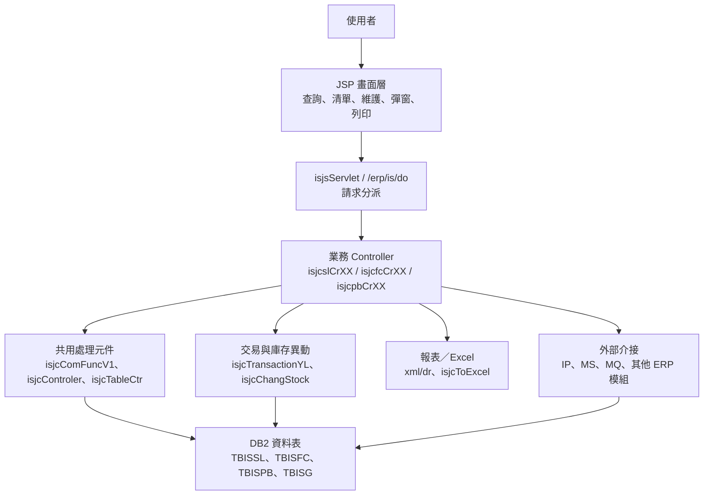
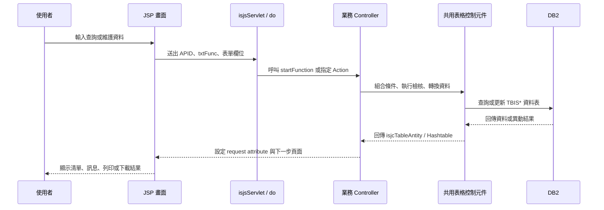

# IS 功能規格手冊

## 1. 系統概述

### 1.1 系統定位

IS 模組為 ERP 內之鋼胚、庫存、交易、基礎參數與相關報表管理系統。系統以 JSP 畫面為主要操作介面，搭配 Java Controller、共用表格控制元件、DAO 與報表 XML 設定，提供鋼胚資料維護、庫存異動、板胚成分／規格查詢、庫位管理、成品／發料相關作業、報表輸出與外部系統資料同步等功能。

本文件依目前程式目錄與設定檔盤點，整理 IS 模組之功能規格，主要來源包含：

- `jsp/`：前端作業畫面、清單、查詢、彈窗與列印頁面。
- `src/com/icsc/is/`：主要業務邏輯、Controller、共用元件、交易處理與外部介接類別。
- `src/com/icsc/is/dao/`、`dao/`、`dao/sql/`：DAO、VO 與資料表定義。
- `config/yl/is/isStructs.xml`：部分頁面、Controller、Action 與 VO 對照。
- `config/yl/is/isCarbonEquivalent.ini`：碳當量等鋼胚成分衍生計算 SQL 設定。
- `xml/dr/`：報表定義檔。

### 1.2 使用對象

IS 模組主要供下列角色使用：

- 庫存管理人員：維護鋼胚基本資料、庫位、庫存異動、退回與盤點資料。
- 生產／製程管理人員：查詢鋼胚規格、化學成分、批號、爐號、分切與作業狀態。
- 成品／發料管理人員：維護與查詢成品、發料、入出帳或轉拋相關資料。
- 系統維護人員：維護基礎代碼、欄位定義、選單設定、序號與參數。
- 管理與稽核人員：查詢庫存、交易紀錄、產出報表與匯出 Excel。

### 1.3 系統主要功能範圍

IS 模組功能可歸納為下列主軸：

| 功能群組 | 代碼／頁面特徵 | 功能說明 |
| --- | --- | --- |
| 鋼胚庫存與交易 | `ISSLxx`、`isjjsl*.jsp`、`isjcslCr*.java` | 鋼胚基本資料、化學成分、交易履歷、庫位、狀態、退回、分切、盤點與各類庫存查詢。 |
| 成品／發料相關作業 | `ISFCxx`、`ISFCYLxx`、`isjjfc*.jsp`、`isjcfcCr*.java` | 成品、發料、入帳、拋轉與廠別相關作業資料維護。 |
| 基礎資料與參數 | `ISPBxx`、`ISJJPBN01`、`isjjpb*.jsp`、`isjcpbCr*.java` | 代碼、庫別、規格、欄位、序號、參數與系統基礎設定維護。 |
| 通用資料維護 | `ISJJGxxx`、`isjjg*.jsp`、`isjcg01.java` | 依資料表中繼設定進行通用資料新增、修改、刪除、查詢與列印。 |
| 查詢、報表與匯出 | `ISRP01`、`ISJCTOEXCEL`、`xml/dr/*.xml` | 報表查詢、列印、Excel 匯出與資料下載。 |
| 外部系統介接 | `isjcIP*`、`isjcMQRecv_ISCH01`、`isjcMSgetData`、`isjcUpdateSlabYL` | 與 IP、MS、MQ 或其他系統進行鋼胚資料、庫存異動與狀態同步。 |

### 1.4 主要資料表

| 資料表 | VO／DAO | 功能定位 | 主要用途 | 關聯功能 |
| --- | --- | --- | --- | --- |
| `TBISSL01` | `isjc0001VO`／`isjc0001DAO`、共用 `isjcTableControl` | 鋼胚主檔 | 保存鋼胚編號、規格、尺寸、重量、狀態、庫位、收料、消耗與異動資訊。 | `ISSL01`、`ISSL03`、`ISSL05`、`ISSL06`、`ISSL07`、`ISSL08`、`ISSL10` 至 `ISSL12`、`ISSL14`、`ISSL15`、`ISSL18`、`ISSL19`、外部狀態更新。 |
| `TBISSL02` | 共用 `isjcTableControl`、`isjcpbn0101` 查詢使用 | 鋼胚化學成分資料 | 保存爐號、鋼種與 C、Si、Mn、P、S、Ni、Cr 等成分，並支援碳當量等衍生計算。 | `ISSL02`、`ISSL11`、`ISSL18`、`ISJJPBN01`、`isCarbonEquivalent.ini`。 |
| `TBISSL0201` | 共用 `isjcTableControl` | 鋼胚附屬成分／材質資料 | 保存材質、成分附屬資料或規格補充資訊。 | `ISSL02`、`ISSL15`。 |
| `TBISSL03` | 共用 `isjcTableControl` | 分切或鋼胚作業紀錄 | 保存分切、作業段或鋼胚關聯紀錄。 | `ISSL01`、`ISSL09`、`ISSL21` 至 `ISSL25`。 |
| `TBISSL04` | `isjcsl0401VO`／`isjcsl0401DAO`、共用 `isjcTableControl` | 鋼胚庫存異動明細 | 記錄鋼胚庫存異動、庫位移轉、異動原因與交易明細。 | `ISSL04`、`ISSL17`、`isjcChangStock`、`isjcTransactionYL`。 |
| `TBISSL0401` | 共用 `isjcTableControl` | 庫存異動附屬明細 | 保存庫存異動延伸資訊或附屬明細。 | `ISSL04`。 |
| `TBISSL05` | 共用 `isjcTableControl` | 庫區主檔 | 保存庫區、區域或倉儲基本設定。 | `ISSL13`、`ISSL14`、`isjcStockDef`。 |
| `TBISSL0501` | 共用 `isjcTableControl` | 庫位／儲位明細 | 保存庫位座標、層數、可承載重量、件數限制與儲位配置。 | `ISSL13`、`ISSL14`、`isjcCheckStock`、`isjcStockDef`。 |
| `TBISSL06` | 共用 `isjcTableControl` | 庫存異動彙總 | 保存庫存異動彙總或日彙總資料，例如件數、重量、交易別與成本資訊。 | `ISSL04`、`isjcChangStock`。 |
| `TBISSL07` | 共用 `isjcTableControl` | 入帳／帳務資料 | 保存帳務重量、入帳日期、入帳產品別與 IP 對帳關聯資料。 | `ISSL07`、`isjcIPbalance`、`isjcIPDetailCopy`、`isjcTransactionYL`。 |
| `TBISSL08` | 共用 `isjcTableControl` | 發貨／單據紀錄 | 保存發貨、出帳、單據列印或交易拋轉紀錄。 | `ISSL08`、`isjcTransactionYL`。 |
| `TBISSL10` | 共用 `isjcTableControl` | 鋼胚群組／分類設定 | 保存群組、規格或鋼胚分類資料。 | `ISSL10`、`ISSL16`。 |
| `TBISSL11` | `isjcSL11VO`／`isjcSL11DAO` | 鋼胚退回資料 | 保存鋼胚退回作業、退回原因與退回狀態。 | `ISSL11`、`ISSL26`。 |
| `TBISFC01` 至 `TBISFC08` | 共用 `isjcTableControl` | 成品／發料主資料與關聯資料 | 保存成品、發料、入出帳、彙總、拋轉與關聯設定資料。 | `ISFC01` 至 `ISFC06`、`ISSL18`、IS30 報表。 |
| `TBISFCYL01`、`TBISFCYL02` | 共用 `isjcTableControl` | 廠別專用成品／發料資料 | 保存裕隆或特定廠別專用成品／發料資料。 | `ISFCYL01` 至 `ISFCYL03`、`ISFC05`。 |
| `TBISPB00`、`TBISPB001` | 共用 `isjcTableControl` | 基礎分類／主從代碼 | 保存 IS 系統基礎分類、主從代碼與對照設定。 | `ISPB00`。 |
| `TBISPB01` 至 `TBISPB09` | 共用 `isjcTableControl`、`isjcSelectMemu` | 代碼與系統參數 | 保存系統代碼、庫別、規格、欄位、選單、提示與特殊參數。 | `ISPB01` 至 `ISPB05`、`ISJJG001`、`ISJJG004`、`ISJJG005`、各功能下拉選單。 |
| `TBISG01`、`TBISG011` | 共用 `isjcTableControl`、`isjcg01` | 通用資料表中繼設定 | 保存資料表欄位、Key 欄位、顯示欄位、清單欄位與通用維護設定。 | `ISJJG001`、`ISPB04`、`isjcComFuncV1`、`isjcListCr01`。 |
| `TBISG02`、`TBISG03`、`TBISG05` | 共用 `isjcTableControl`、`isjcControler`、`isjcsn` | 序號、控制與共用設定 | 保存序號登錄、主從控制、權限或其他共用系統設定。 | `ISJJG002`、`ISJJG003`、`ISJJG006`、通用維護流程。 |
| `TBIS0001` | `isjc0001VO`／`isjc0001DAO` | 特定鋼胚暫存／查詢資料 | 保存特定鋼胚作業資料，供查詢、新增、修改、刪除流程使用。 | `ISJJPBN01`。 |
| `TBISCSCSLAB` | `isjcCSCSlabVO`／`isjcCSCSlabDAO` | 中鋼鋼胚資料暫存 | 保存外部鋼胚資料暫存內容，例如鋼胚 ID、鋼種、尺寸、重量、訂單與接收時間。 | 外部鋼胚資料接收、暫存與後續轉入。 |
| `TBISCONFIG` | `isjcconfigVO`／`isjcconfigDAO`、`isjcConfigAPI` | IS 系統設定 | 保存系統代碼、顯示名稱或環境設定。 | 系統參數查詢、顯示文字與共用設定讀取。 |

## 2. 系統架構總覽

### 2.1 整體架構

### 2.2 程式分層

| 層級 | 主要檔案／類別 | 說明 |
| --- | --- | --- |
| 畫面層 | `jsp/isjjsl*.jsp`、`jsp/isjjpb*.jsp`、`jsp/isjjfc*.jsp`、`jsp/isjjg*.jsp` | 提供查詢條件、資料清單、資料維護、彈窗選取、列印與 Excel 下載操作。 |
| 請求分派層 | `src/isjsServlet.java`、`src/com/icsc/is/isjiServlet.java`、`/erp/is/do` | 依 `APID`、`txtFunc`、`_pageId` 或 XML 設定轉派到對應處理類別。 |
| 業務邏輯層 | `isjcslCrXX`、`isjcfcCrXX`、`isjcpbCrXX`、`isjcg01`、`isjcReturnCr` | 依功能別實作查詢、新增、修改、刪除、退回、庫存異動與特殊檢核。 |
| 共用控制層 | `isjcComFunc`、`isjcComFuncV1`、`isjcControler`、`isjcTableControl`、`isjcTableCtr`、`isjcMapControl` | 封裝資料表中繼設定、Request 轉資料物件、CRUD、欄位處理、條件查詢與共用流程。 |
| DAO／VO 層 | `src/com/icsc/is/dao/*.java`、`dao/*.dao`、`dao/sql/*.sql` | 對特定資料表提供查詢、新增、修改、刪除與資料物件轉換。 |
| 報表層 | `xml/dr/*.xml`、`isjcGetIS30Report`、`isjcToExcel` | 產生報表、查詢清單與 Excel 檔案。 |
| 外部介接層 | `isjcIPbalance`、`isjcIPDetailCopy`、`isjcIPDetBalance`、`isjcMQRecv_ISCH01`、`isjcMSgetData`、`isjcUpdateSlabYL` | 接收或拋轉外部系統資料，更新鋼胚狀態、入帳、庫存與相關資料。 |

### 2.3 主要請求流程

一般維護作業流程如下：

### 2.4 交易與庫存異動架構

鋼胚異動作業不只更新主檔，亦會產生相關異動紀錄與帳務／外部拋轉資料。主要邏輯集中在：

- `isjcTransactionYL`：處理鋼胚交易資料、拋轉 IP／PO／DJ、產生 `TBISSL04`、`TBISSL08`、`TBISSL07` 等紀錄，並更新 `TBISSL01` 狀態。
- `isjcChangStock`：處理庫存異動明細與 `TBISSL06` 彙總更新。
- `isjcStockDef`：查詢庫區、庫位、庫存定義與容量資料。
- `isjcUpdateSlabYL`、`isjcUpdateSlabStatusYL`：由外部流程更新鋼胚庫位、裝車、狀態與相關欄位。

### 2.5 設定與中繼資料

IS 模組大量依中繼資料驅動畫面與 CRUD 行為：

- `TBISG01`：資料表欄位、中繼設定與 key 欄位判斷。
- `TBISPBxx`：系統代碼、選單、庫別、規格與基礎參數。
- `isjcSelectMemu`、`isjcWebUtil`：依代碼表產生下拉選單、核取項目與顯示文字。
- `isCarbonEquivalent.ini`：依鋼胚成分計算碳當量、合金元素加總等衍生值。

### 2.6 報表與匯出

報表檔集中於 `xml/dr/`，包含：

- `IS00R.xml`、`IS01R.xml`、`is10r.xml`、`is20r.xml`
- `is30r.xml`、`is31r.xml`、`is32r.xml`
- `IS11T01A.xml`、`IS11T01AL.xml`、`IS11T01T.xml`

相關 Java 類別包含 `isjcGetIS30Report` 與 `isjcToExcel`，JSP 入口包含 `isjjrp01.jsp`、`isjjrp0101List.jsp`、`isjjToExcelPre.jsp` 與 `isjjToExcel.jsp`。

## 3. 功能模組詳細說明

### 3.1 鋼胚庫存與交易模組

#### 3.1.1 模組目的

鋼胚庫存與交易模組為 IS 系統核心，用於維護鋼胚主檔、化學成分、庫存異動、庫位、分切、退回、入出帳與狀態查詢。主要頁面前綴為 `isjjsl`，主要 AppId 為 `ISSL01` 至 `ISSL26`。

#### 3.1.2 主要畫面與程式

| 功能代碼 | 主要 JSP | 後端類別 | 主要資料表 | 功能重點 |
| --- | --- | --- | --- | --- |
| `ISSL01` | `isjjsl01.jsp`、`isjjsl0101.jsp`、`isjjsl0101List.jsp` | `isjcslCr01` | `TBISSL01`、`TBISSL03` | 鋼胚主檔查詢、清單、維護與列印。 |
| `ISSL02` | `isjjsl02.jsp`、`isjjsl0201.jsp`、`isjjsl0202.jsp` | `isjcslCr02` | `TBISSL02`、`TBISSL0201` | 鋼胚化學成分、材質或附屬規格資料維護。 |
| `ISSL03` | `isjjsl0301List.jsp`、`isjjCheckStock.jsp` | `isjcslCr03`、`isjcCheckStock` | `TBISSL01` | 鋼胚庫存查核與狀態查詢。 |
| `ISSL04` | `isjjsl04.jsp`、`isjjsl0401.jsp`、`isjjsl0402List.jsp` | `isjcslCr04`、`isjcslCr0401` | `TBISSL01`、`TBISSL04`、`TBISSL0401`、`TBISSL06` | 庫存異動登錄、明細維護與彙總更新。 |
| `ISSL05` | `isjjsl0501List.jsp`、`isjjsl0502List.jsp` | `isjcslCr05` | `TBISSL01` | 鋼胚庫存清單或庫位查詢。 |
| `ISSL06` | `isjjsl0601List.jsp`、`isjjsl06Search.jsp` | `isjcslCr06` | `TBISSL01` | 庫存條件查詢與清單顯示。 |
| `ISSL07` | `isjjsl0701List.jsp` | `isjcslCr07` | `TBISSL01`、`TBISSL07` | 入帳、帳務或帳面重量資料。 |
| `ISSL08` | `isjjsl08Search.jsp`、`isjjsl08List.jsp`、`isjjsl0801List.jsp` | `isjcslCr08` | `TBISSL01` | 發貨、出帳或單據查詢。 |
| `ISSL09` | `isjjsl0901List.jsp` | `isjcslCr09` | `TBISSL03` | 分切或附屬交易資料維護。 |
| `ISSL10` | `isjjsl1001List.jsp` | `isjcslCr10` | `TBISSL01` | 鋼胚狀態或交易查詢。 |
| `ISSL11` | `isjjsl1101.jsp`、`isjjsl1101List.jsp`、`isjjsl11Search.jsp` | `isjcslCr11` | `TBISSL01`、`TBISSL02`、`TBISSL11` | 鋼胚退回或特殊處理作業。 |
| `ISSL12` | `isjjsl1201List.jsp` | `isjcslCr12` | `TBISSL01` | 鋼胚切割、再處理或狀態異動查詢。 |
| `ISSL13` | `isjjsl1301List.jsp`、`isjjsl1302List.jsp` | `isjcslCr13` | `TBISSL05`、`TBISSL0501` | 庫區、庫位或儲位設定查詢。 |
| `ISSL14` | `isjjsl1401List.jsp` | `isjcslCr14` | `TBISSL01`、`TBISSL05`、`TBISSL0501` | 庫位配置、儲位容量與鋼胚放置檢核。 |
| `ISSL15` | `isjjsl1501List.jsp` | `isjcslCr15` | `TBISSL01`、`TBISSL0201` | 鋼胚選取、轉入或關聯資料查詢。 |
| `ISSL16` | `isjjsl1601List.jsp` | `isjcslCr16` | `TBISPB02`、`TBISSL10` | 分類、群組或規格代碼設定查詢。 |
| `ISSL17` | `isjjsl1701List.jsp`、`isjjsl1702List.jsp` | `isjcslCr17` | `TBISSL04` | 庫存異動明細與重量計算。 |
| `ISSL18` | `isjjsl1801List.jsp`、`isjjsl1802List.jsp`、`isjjsl1803List.jsp` | `isjcslCr18` | `TBISFC01`、`TBISSL01`、`TBISSL02` | 鋼胚與成品／發料資料關聯查詢。 |
| `ISSL19` | `isjjsl1901List.jsp` | `isjcslCr19` | `TBISSL01` | 鋼胚狀態、庫存或異動查詢。 |
| `ISSL21` 至 `ISSL25` | `isjjsl2101List.jsp` 至 `isjjsl2501List.jsp` | `isjcslCr21` 至 `isjcslCr25` | `TBISSL01`、`TBISSL03` | 其他鋼胚查詢、報表清單或特殊作業。 |
| `ISSL26` | `isjjSLReturn.jsp`、`isjjSLReturnKeyIn.jsp`、`isjjSLReturnList.jsp` | `isjcReturnCr` | `TBISSL01`、`TBISSL11` | 鋼胚退回查詢、確認退回與列印。 |

#### 3.1.3 主要處理規則

- 鋼胚主檔以公司別與鋼胚號碼作為重要識別條件。
- 交易作業會依狀態、庫位、重量、日期、班別、爐號、規格與用途等欄位判斷可異動性。
- 庫存異動需同步產生明細與彙總資料，常見資料表為 `TBISSL04` 與 `TBISSL06`。
- 涉及帳務或外部拋轉時，會透過 `isjcTransactionYL` 進一步產生 IP、PO、DJ 或相關入出帳資料。
- 庫位相關作業需檢核 `TBISSL05`、`TBISSL0501` 的庫區、座標、層數、重量與件數限制。
- 化學成分與碳當量計算依 `TBISSL02` 與 `isCarbonEquivalent.ini` 設定取得。

### 3.2 成品／發料相關作業模組

#### 3.2.1 模組目的

成品／發料模組處理與 `TBISFCxx` 相關的資料維護、查詢、入出帳、轉拋與廠別專用流程。主要頁面前綴為 `isjjfc` 與 `isjjfcYL`，主要 Controller 為 `isjcfcCr01` 至 `isjcfcCr06`、`isjcfcylCr01` 至 `isjcfcylCr03`。

#### 3.2.2 主要畫面與程式

| 功能代碼 | 主要 JSP | 後端類別 | 主要資料表 | 功能重點 |
| --- | --- | --- | --- | --- |
| `ISFC01` | `isjjfc01.jsp`、`isjjfc0101.jsp`、`isjjfc0101List.jsp` | `isjcfcCr01` | `TBISFC01`、`TBISFC08` | 成品或發料主資料維護與查詢。 |
| `ISFC02` | `isjjfc02.jsp`、`isjjfc0201.jsp`、`isjjfc0201List.jsp` | `isjcfcCr02` | `TBTMYL50` | 與 TM 或廠別資料相關查詢。 |
| `ISFC03` | `isjjfc03.jsp`、`isjjfc0301.jsp`、`isjjfc0301List.jsp` | `isjcfcCr03` | `TBISFC03`、`TBISFCTOSO`、`TBISFCTOTM50` | 成品轉銷售、轉 TM 或資料拋轉作業。 |
| `ISFC04` | `isjjfc04.jsp`、`isjjfc0401.jsp`、`isjjfc0401List.jsp` | `isjcfcCr04` | `TBISFC01`、`TBISFC03`、`TBISFC04`、`TBISFC07` | 成品或發料異動處理、重算與回寫。 |
| `ISFC05` | `isjjfc05.jsp`、`isjjfc0501List.jsp` | `isjcfcCr05` | `TBISFC04`、`TBISFC05`、`TBISFC06`、`TBISFCYL01` | 成品發料、異動與裕隆資料同步。 |
| `ISFC06` | `isjjfc06.jsp`、`isjjfc0601List.jsp` | `isjcfcCr06` | `TBISFC06`、`TBISFC07`、`TBISFC08` | 成品或發料彙總、結轉與狀態處理。 |
| `ISFCYL01` | `isjjfcYL01.jsp`、`isjjfcYL0101.jsp`、`isjjfcYL0101List.jsp` | `isjcfcylCr01` | `TBISFCYL01`、`TBISFCYL02` | 裕隆專用成品／發料資料維護。 |
| `ISFCYL02` | `isjjfcYL02.jsp`、`isjjfcYL0201.jsp`、`isjjfcYL0201List.jsp` | `isjcfcylCr02` | `TBISFCYL01` | 裕隆專用查詢或異動作業。 |
| `ISFCYL03` | `isjjfcYL03.jsp`、`isjjfcYL0301.jsp`、`isjjfcYL0301List.jsp` | `isjcfcylCr03` | `TBISFC01`、`TBISFCYL01` | 裕隆資料與一般成品資料關聯處理。 |

#### 3.2.3 主要處理規則

- 成品／發料資料與鋼胚主檔、帳務資料可能交互影響，異動時需注意狀態與重量一致性。
- 部分作業會將資料轉至 SO、TM 或裕隆專用資料表，需確認轉出與回寫結果。
- `isjcSetting` 提供成品相關查詢、初始訊息與資料設定。
- `isjcIS30RDI`、`isjcIS30RVO` 負責特定 IS30 報表或成品資料查詢。

### 3.3 基礎資料與參數維護模組

#### 3.3.1 模組目的

基礎資料與參數維護模組用於維護 IS 系統運作所需的代碼、庫別、規格、欄位、選單、序號與其他參數。主要頁面前綴為 `isjjpb`、`isjjpbn`。

#### 3.3.2 主要畫面與程式

| 功能代碼 | 主要 JSP | 後端類別 | 主要資料表 | 功能重點 |
| --- | --- | --- | --- | --- |
| `ISPB00` | `isjjpb00.jsp`、`isjjpb0001.jsp`、`isjjpb0002.jsp` | `isjcpbCr00` | `TBISPB00`、`TBISPB001` | 基礎分類或主從代碼維護。 |
| `ISPB01` | `isjjpb01.jsp`、`isjjpb0101.jsp`、`isjjpb0102.jsp` | `isjcpbCr01` | `TBISPB01`、`TBISPB02` | 一般代碼、庫別或選單資料維護。 |
| `ISPB02` | `isjjpb02.jsp`、`isjjpb0201.jsp`、`isjjpb0202.jsp` | `isjcpbCr02` | `TBISPB07` | 參數、欄位或特殊設定維護。 |
| `ISPB03` | `isjjpb03.jsp`、`isjjpb0301.jsp`、`isjjpb0302.jsp` | `isjcpbCr03` | `TBISSN01`、`TBISSN02` | 序號或編碼規則維護。 |
| `ISPB04` | `isjjpb04.jsp`、`isjjpb0401.jsp`、`isjjpb0402.jsp` | `isjcpbCr04` | `TBISG01`、`TBISPB05`、`TBISPB06` | 欄位設定、通用資料表設定與提示資料維護。 |
| `ISPB05` | `isjjpb05.jsp`、`isjjpb0501.jsp` | `isjcpbCr05` | `TBISPB09` | 特定參數或對照資料維護。 |
| `ISJJPBN01` | `isjjpbn01.jsp`、`isjjpbn0101Edit.jsp` | `isjcpbn0101` | `TBIS0001`、`TBISSL02` | 特定鋼胚或成分資料查詢、新增、修改、刪除。 |

#### 3.3.3 主要處理規則

- 下拉選單與顯示文字由 `isjcSelectMemu`、`isjcWebUtil` 依代碼表產生。
- 通用欄位設定與資料表 key 判斷依 `TBISG01`，會影響查詢條件、CRUD 與清單顯示。
- 序號登錄與產生由 `isjcsn`、`isjcsn1` 處理，並使用 `TBISG02`、`TBISSN01`、`TBISSN02`。
- 基礎資料異動會影響其他作業的查詢條件、欄位顯示與代碼合法性，正式異動前需確認相依作業。

### 3.4 通用資料維護模組

#### 3.4.1 模組目的

通用資料維護模組提供系統管理者透過中繼資料管理資料表與欄位設定，並提供列印、欄位提示、權限或系統設定相關功能。主要頁面前綴為 `isjjg`。

#### 3.4.2 主要畫面與程式

| 功能代碼 | 主要 JSP | 後端類別 | 主要資料表 | 功能重點 |
| --- | --- | --- | --- | --- |
| `ISJJG001` | `isjjg001.jsp`、`isjjg0011.jsp`、`isjjg001Print.jsp` | `isjcg01` | `TBISG011`、`TBISPB06` | 通用資料設定、查詢與列印。 |
| `ISJJG002` | `isjjg002.jsp` | `isjcsn` | `TBISG02` | 序號或代碼產生設定。 |
| `ISJJG003` | `isjjg003.jsp` | `isjcControler` | `TBISG03` | 通用表格控制或資料關聯設定。 |
| `ISJJG004` | `isjjg004.jsp`、`isjjg004Temp.jsp` | `isjcpbCr02` | `TBISPB07` | 欄位或格式設定。 |
| `ISJJG005` | `isjjg005.jsp` | `isjcGetUrl` | `TBISPB08` | URL、連結或系統路徑設定。 |
| `ISJJG006` | `isjjg006.jsp` | `isjcControler` | `TBISG05` | 其他共用設定維護。 |

#### 3.4.3 共用元件說明

| 類別 | 功能 |
| --- | --- |
| `isjcComFunc`、`isjcComFuncV1` | 提供查詢、新增、修改、刪除前後鉤子，以及依資料表中繼設定執行資料處理。 |
| `isjcControler` | 通用資料查詢、刪除、更新與主從表控制。 |
| `isjcTableControl`、`isjcTableCtr` | 依資料表名稱與欄位設定執行 SQL、轉換資料與異動資料。 |
| `isjcMapControl` | 將 HTTP request 參數轉換為後端資料結構。 |
| `isjcListCr01` | 依欄位設定產生清單欄名、提示、按鈕與清單資料。 |
| `isjcJournal` | 紀錄資料表異動 SQL 或處理結果。 |

### 3.5 查詢、報表與匯出模組

#### 3.5.1 模組目的

提供鋼胚、庫存、交易與成品資料之查詢、報表列印與 Excel 匯出功能，供管理、追蹤與稽核使用。

#### 3.5.2 主要畫面與程式

| 功能 | 主要檔案 | 說明 |
| --- | --- | --- |
| 報表查詢 | `isjjrp01.jsp`、`isjjrp0101List.jsp` | 提供報表查詢條件與清單結果。 |
| Excel 匯出 | `isjjToExcelPre.jsp`、`isjjToExcel.jsp`、`isjcToExcel.java` | 依查詢結果產生 Excel 檔案。 |
| 報表定義 | `xml/dr/*.xml` | 定義 IS 報表欄位、版面與資料來源。 |
| IS30 報表 | `isjcGetIS30Report`、`isjcIS30RDI`、`isjcIS30RVO` | 提供 IS30 報表或資料集產生。 |
| 其他資料查詢 | `isjjCustQry.jsp`、`isjja01*.jsp` | 提供客製查詢、彈窗查詢與清單選取。 |

#### 3.5.3 報表檔案

| 報表 XML | 說明 |
| --- | --- |
| `IS00R.xml`、`IS01R.xml` | IS 基礎或鋼胚相關報表。 |
| `is10r.xml`、`is20r.xml` | 庫存、交易或鋼胚查詢報表。 |
| `is30r.xml`、`is31r.xml`、`is32r.xml` | 成品、發料或特定資料統計報表。 |
| `IS11T01A.xml`、`IS11T01AL.xml`、`IS11T01T.xml` | 特定清單、明細或列印格式。 |

### 3.6 外部系統介接模組

#### 3.6.1 模組目的

IS 模組需與其他 ERP 子系統或外部流程交換鋼胚、庫存、入帳與狀態資料。介接類別集中在 `isjcIP*`、`isjcMQRecv_ISCH01`、`isjcMSgetData` 與 `isjcUpdateSlabYL`。

#### 3.6.2 主要介接類別

| 類別 | 主要資料表 | 功能說明 |
| --- | --- | --- |
| `isjcIPbalance` | `TBISSL07` | 產生或同步 IP 帳務平衡資料。 |
| `isjcIPDetailCopy` | `TBISIP01`、`TBISSL07` | 複製 IP 明細或入帳資料。 |
| `isjcIPDetBalance` | `TBISIP01` | IP 明細平衡處理。 |
| `isjcIpGetEndUse` | 外部 IP 資料 | 取得用途資料。 |
| `isjcIpGetSpec` | 外部 IP 資料 | 取得規格資料。 |
| `isjcIpGetSupply` | 外部 IP 資料 | 取得供料或來源資料。 |
| `isjcMQRecv_ISCH01` | MQ 訊息 | 接收 ISCH01 訊息並觸發後續處理。 |
| `isjcMSgetData` | 鋼胚資料 | 查詢 MS 或其他來源之鋼胚資料。 |
| `isjcUpdateSlabYL` | `TBISSL01` | 由外部流程更新鋼胚庫位、裝車、狀態或相關欄位。 |
| `isjcUpdateSlabStatusYL` | `TBISSL01` | 依外部呼叫更新鋼胚狀態。 |

#### 3.6.3 介接處理原則

- 外部資料進入 IS 後，需以鋼胚號碼、公司別、爐號、規格或交易條件查詢既有資料。
- 更新鋼胚主檔時，需同步維護異動紀錄與帳務紀錄，避免主檔狀態與交易明細不一致。
- 接收 MQ 或外部批次資料時，需記錄處理訊息與錯誤內容，方便追蹤重送或補正。
- 對外拋轉應確認來源資料、轉出資料與回寫狀態三者一致。

### 3.7 安全與權限

目前程式可見權限判斷主要散落於 JSP 與共用類別，例如 `dsjcagc().check(...)` 用於特定作業權限檢查。系統應依 ERP 既有權限架構控管下列行為：

- 查詢權限：是否允許進入特定功能或查詢特定公司別資料。
- 維護權限：是否允許新增、修改、刪除、退回、異動庫存或更新狀態。
- 特殊權限：例如 HOLD、退回、拋轉、列印或批次處理。
- 資料範圍：依公司別、廠別、作業別、使用者角色限制可操作資料。

### 3.8 例外處理與稽核

IS 模組主要透過下列方式處理例外與稽核：

- `dejc318`：記錄系統 log 或錯誤訊息。
- `isjcJournal.tableIO(...)`：記錄資料表異動 SQL、成功與否及補充訊息。
- Controller 內之 `msg`、`strMessage` 或 request attribute：回傳畫面錯誤訊息。
- 交易處理類別在任一資料表更新失敗時，應中止後續處理並回報錯誤。

### 3.9 待後續確認事項

本文件為依現有檔案盤點整理之功能規格初稿。若要進一步成為正式審查版，建議補齊下列內容：

- 逐一開啟主要 JSP 畫面，確認畫面中文標題、欄位名稱與按鈕文字。
- 依實際資料庫 schema 補齊 `TBISSLxx`、`TBISFCxx`、`TBISPBxx`、`TBISGxx` 欄位中文說明。
- 對 `ISSL01` 至 `ISSL26`、`ISFC01` 至 `ISFC06`、`ISPB00` 至 `ISPB05` 補上實際作業流程與權限矩陣。
- 針對 `isjcTransactionYL` 交易拋轉流程補上完整狀態碼、交易碼與失敗補償流程。
- 針對外部介接補上來源系統、傳輸方式、排程頻率、錯誤重送與監控方式。
