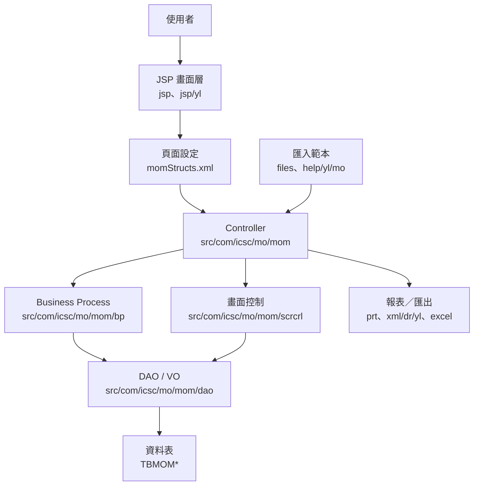
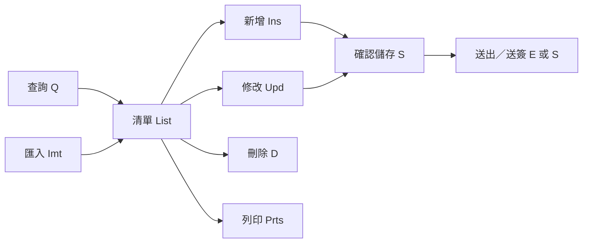

# MOM 功能規格手冊

## 1. 系統概述

### 1.1 系統定位

`MOM` 模組為中鴻鋼鐵 ERP 體系中的工程／保養／工安管理作業模組。依現有程式、頁面設定、資料表與報表檔案推導，本系統涵蓋工程與保養案件的計畫建立、工作項目編製、施工與外包資料維護、工安程序管理、費用與預算控管、驗收結案、報表列印與批次匯入。

本文件依下列來源整理：

- `config/yl/mom/momStructs.xml`：頁面、Controller、Action 與 VO 對應。
- `jsp/` 與 `jsp/yl/`：使用者畫面與義聯客製畫面。
- `src/com/icsc/mo/mom/`：Controller、Business Process、畫面控制、DAO、列印與 Excel 輸出程式。
- `dao/`、`dao/sql/`、`config/yl/mom/hbm/`：資料表、SQL 與 Hibernate 對應。
- `xml/dr/yl/`：義聯報表樣板。
- `files/`、`help/yl/mo/`：資料匯入範本與操作輔助檔案。

### 1.2 使用對象

本系統主要服務下列角色：

- 工程／保養承辦人員：建立計畫、維護工作明細、安排施工與追蹤進度。
- 施工／維修單位：填報作業資料、施工項目、用料、人力、費用與完成狀態。
- 工安與稽核人員：維護安全程序、查核安全防護、追蹤不安全原因與改善資料。
- 主管與簽核人員：審查送簽案件、核准、退回或追蹤處理進度。
- 管理與查詢人員：查詢專案、標準、保養資料、成本、報表與匯出結果。

### 1.3 業務範圍

系統業務範圍包含：

- 基本資料維護：工程、設備、廠商、工作分類、保養標準、區域與工安相關基礎資料。
- 計畫與案件管理：工程／保養計畫、工作項目、排程、執行進度、延遲與結案。
- 工安程序管理：安全作業程序、危害原因、防護措施、列印與 App 查詢。
- 費用與預算管理：預估金額、實際金額、驗收、扣款、成本歸屬與月度彙總。
- 外部資料整合：匯入範本、Excel 匯出、跨模組資料查詢與報表列印。

### 1.4 主要資料表

| 資料表 | VO／DAO | 功能定位 | 主要用途 | 關聯功能 |
| --- | --- | --- | --- | --- |
| `TBMOMW1`、`TBMOMW2`、`TBMOMW3`、`TBMOMW4` | `momcw1VO`／`momcw1DAO`、`momcw2VO`／`momcw2DAO`、`momcw3VO`／`momcw3DAO`、`momcw4VO`／`momcw4DAO` | 工程執行、排程、契約與結案主資料。 | 保存工程計畫、工作項目、成本資料、請購或契約關聯、工程結案與月度彙總所需資料。 | `JW` 工程執行模組、`JB` 工作單、`JF` 預算驗收、`JP` 專案計畫、報表列印與 Excel 匯出。 |
| `TBMOMWA`、`TBMOMWB`、`TBMOMWC`、`TBMOMWD` | `momcwaVO`／`momcwaDAO`、`momcwbVO`／`momcwbDAO`、`momcwcVO`／`momcwcDAO`、`momcwdVO`／`momcwdDAO` | 工程月度彙總與輔助明細資料。 | 保存月份、年度、單位、工程編號、金額與彙總明細，用於管理性查詢或統計。 | `JW` 月度工程資料、`JX` 查詢統計、報表與匯出。 |
| `TBMOMA1`、`TBMOMA2`、`TBMOMA3` | `momca1VO`／`momca1DAO`、`momca2VO`／`momca2DAO`、`momca3VO`／`momca3DAO` | 保養週期與排程資料。 | 保存保養週期、工作日期、工作時間、設備或工作項目關聯與排程歷程。 | `JA` 保養週期設定、`JV` 設備標準、`JW` 工程計畫、保養報表。 |
| `TBMOMS1`、`TBMOMS2`、`TBMOMS1DROPFLOW` | `momcs1VO`／`momcs1DAO`、`momcs2VO`／`momcs2DAO`、`momcs1dropflowVO`／`momcs1dropflowDAO` | 工安程序與簽核流程資料。 | 保存安全作業程序主檔、作業步驟、不安全原因、安全防護、列印狀態與簽核流程資料。 | `JS` 工安程序、`momwhs1App`、匯入作業、送簽／核准／退回流程、工安報表。 |
| `TBMOMSA`、`TBMOMSB` | `momcsaVO`／`momcsaDAO`、`momcsbVO`／`momcsbDAO` | 工安輔助主檔與統計資料。 | 保存工安相關單位、標準、設備、人員關聯與累計／重置統計資料。 | `JS` 工安查詢、`MOMJSA`、`MOMJSB`、安全作業程序維護。 |
| `TBMOMJ1`、`TBMOMJA` | `momcj1VO`／`momcj1DAO`、`momcjaVO`／`momcjaDAO` | 工作標準與設備標準資料。 | 保存標準編號、標準名稱、工作型態、週期、設備、人員與承攬商關聯。 | `JJ` 工作標準、`JV` 設備檢點、`JA` 週期設定、`JR` 施工資源、匯入與列印。 |
| `TBMOMV1`、`TBMOMV2`、`TBMOMVA`、`TBMOMVB`、`TBMOMVC` | `momcv1VO`／`momcv1DAO`、`momcv2VO`／`momcv2DAO`、`momcvaVO`／`momcvaDAO`、`momcvbVO`／`momcvbDAO`、`momcvcVO`／`momcvcDAO` | 設備、部位與檢點標準資料。 | 保存設備主檔、部位、檢查項目、週期、工作型態與設備標準關聯。 | `JV` 設備標準、`JJ` 工作標準、`JF` 檢查標準、`JA` 保養週期、設備資料匯入。 |
| `TBMOMF3`、`TBMOMFB`、`TBMOMFI`、`TBMOMFJ`、`TBMOMFM`、`TBMOMFP`、`TBMOMFV`、`TBMOMFW`、`TBMOMFX` | `momcf3VO`／`momcf3DAO`、`momcfbVO`／`momcfbDAO`、`momcfiVO`／`momcfiDAO`、`momcfjVO`／`momcfjDAO`、`momcfmVO`／`momcfmDAO`、`momcfpVO`／`momcfpDAO`、`momcfvVO`／`momcfvDAO`、`momcfwVO`／`momcfwDAO`、`momcfxVO`／`momcfxDAO` | 預算、驗收、扣款、評分與費用控管資料。 | 保存預算彙總、實際費用、驗收結果、扣款原因、評分、人力統計與完工資料。 | `JF` 預算驗收、`JW` 工程執行、`JB` 工作單、`JV` 檢查標準、驗收報表。 |
| `TBMOMB1`、`TBMOMB2`、`TBMOMB3` | `momcb1VO`／`momcb1DAO`、`momcb2VO`／`momcb2DAO`、`momcb3VO`／`momcb3DAO` | 工程／保養工作單資料。 | 保存工作單號、名稱、預算金額、實際金額、工作狀態、負責部門與承辦人。 | `JB` 工作單、`JM` 申請委外、`JW` 工程項目、送出流程與列印。 |
| `TBMOMM1`、`TBMOMM2`、`TBMOMM3` | `momcm1VO`／`momcm1DAO`、`momcm2VO`／`momcm2DAO`、`momcm3VO`／`momcm3DAO` | 工程／保養申請與委外施工資料。 | 保存申請單、委外或施工工作、月度明細、工作型態、數量與計畫年月。 | `JM` 申請委外、`JB` 工作單、`JR` 施工資源、月度查詢與報表。 |
| `TBMOMP1`、`TBMOMP2` | `momcp1VO`／`momcp1DAO`、`momcp2VO`／`momcp2DAO` | 專案計畫與時段資料。 | 保存專案編號、名稱、預計與實際起迄日、成本中心、承辦人、施工單位與時段。 | `JP` 專案計畫、`JW` 工程執行、樹狀查詢、分類查詢與專案報表。 |
| `TBMOMT1`、`TBMOMT2` | `momct1VO`／`momct1DAO`、`momct2VO`／`momct2DAO` | 進度節點與時程資料。 | 保存節點編號、名稱、預計／實際起迄日、預計／實際進度與備註。 | `JT` 進度節點、`JP` 專案計畫、`JW` 工程進度追蹤。 |
| `TBMOMR1`、`TBMOMR2`、`TBMOMR3`、`TBMOMR4` | `momcr1VO`／`momcr1DAO`、`momcr2VO`／`momcr2DAO`、`momcr3VO`／`momcr3DAO`、`momcr4VO`／`momcr4DAO` | 施工資源與明細資料。 | 保存人力、材料、機具、數量、工時、備註與施工項目關聯。 | `JR` 施工資源、`JW` 工程項目、`JJ` 工作標準、匯入與施工報表。 |
| `TBMOMCA` | `momccaVO`／`momccaDAO` | 分類、卡別或區域主檔資料。 | 保存分類編號、名稱、卡別位置、備註與相關標準代碼。 | `JC` 分類維護、`JJ` 標準資料、義聯報表與匯入。 |
| `TBMOM11`、`TBMOM12`、`TBMOM13`、`TBMOM14`、`TBMOM15` | `momc11VO`／`momc11DAO`、`momc12VO`／`momc12DAO`、`momc13VO`／`momc13DAO`、`momc14VO`／`momc14DAO`、`momc15VO`／`momc15DAO` | 特殊作業／聯合維護資料。 | 保存特殊作業主檔、明細、檢核與列印相關資料。 | `J1` 特殊作業、檢核、列印、義聯客製報表。 |

## 2. 系統架構總覽

### 2.1 邏輯架構

### 2.2 程式分層

| 層級 | 目錄／檔案 | 職責 |
| --- | --- | --- |
| 畫面層 | `jsp/`、`jsp/yl/` | 查詢、新增、修改、送出、列印、匯入與義聯客製畫面。 |
| 路由設定 | `config/yl/mom/momStructs.xml` | 定義 `pageID`、JSP 路徑、Controller、Action flag、method、validate 與 VO converter。 |
| 控制層 | `src/com/icsc/mo/mom/*.java` | 接收畫面 Action，執行查詢、儲存、刪除、送簽、列印與轉導。 |
| 商業邏輯層 | `src/com/icsc/mo/mom/bp/`、`bp/yl/` | 封裝資料處理、檢核、計算、匯入、送簽與義聯客製邏輯。 |
| 畫面控制層 | `src/com/icsc/mo/mom/scrcrl/`、`scrcrl/yl/` | 管理欄位顯示、按鈕、清單與客製畫面行為。 |
| 資料存取層 | `src/com/icsc/mo/mom/dao/`、`dao/`、`config/yl/mom/hbm/` | 對應 `TBMOM*` 資料表，提供 VO、DAO 與 ORM 映射。 |
| 報表與匯出 | `src/com/icsc/mo/mom/prt/`、`xml/dr/yl/`、`excel/` | 產生列印報表、義聯報表樣板與 Excel 匯出。 |
| 輔助檔案 | `files/`、`help/yl/mo/` | 提供匯入範本與 App 操作手冊。 |

### 2.3 標準作業流程

系統多數功能依下列模式運作：

### 2.4 Action 代碼摘要

| Action | 常見 method | 用途 |
| --- | --- | --- |
| `Q` | `query` | 查詢清單或明細。 |
| `S` | `sure`、`send` | 確認、儲存或送出。 |
| `D` | `delete` | 刪除資料。 |
| `U` | `update` | 更新清單或明細狀態。 |
| `E` | `send` | 送簽或送出流程。 |
| `R` | `read` | 讀取匯入檔。 |
| `I` | `imt` | 執行資料匯入。 |
| `A` | `approve` | 核准。 |
| `B` | `reject`、`back` | 退回或駁回。 |
| `C` | `check`、`checkAll`、`methodA` | 檢核、全選或特定流程動作。 |
| `P` | `methodA`、列印相關 method | 列印、挑選或特定輔助作業。 |

### 2.5 報表與匯入

義聯報表樣板集中於 `xml/dr/yl/`，包含 `momrw1`、`momrw2`、`momrs1`、`momrva`、`momrca`、`momr11` 等報表；Java 報表程式位於 `src/com/icsc/mo/mom/prt/` 與 `src/com/icsc/mo/mom/prt/yl/`。

資料匯入範本包含：

- `momjs1_imt.xls`、`momjs2_imt.xls`：工安程序與明細資料匯入。
- `momjja_imt.xls`、`momjca_imt.xls`：標準或分類資料匯入。
- `momjr1_imt.xls`：施工資源相關資料匯入。
- `momjva_imt.xls`、`momjvb_imt.xls`：設備／部位／檢查相關資料匯入。
- `momxp1_01_01_yl.xls`、`momxp1_01_02_yl.xls`：義聯客製匯入或報表輔助範本。

## 3. 功能模組詳細說明

### 3.1 `JA` 保養／週期設定模組

對應頁面以 `MOMJA1` 為主，Controller 包含 `momca1`、`momca1_List`、`momca1_Ins`、`momca1_Upd`、`momca1_Prts`。此模組維護保養或工作週期設定，資料表以 `TBMOMA1`、`TBMOMA2`、`TBMOMA3` 為主，欄位包含週期數、週期類型、到期日、工作日期、工作時間與歷程資料。

主要功能：

- 查詢保養週期與工作設定。
- 新增、修改、刪除週期主檔。
- 維護工作日期、工時、設備或工作項目關聯。
- 列印保養週期或工作清單。
- 支援義聯客製畫面與 Excel 匯出。

### 3.2 `JB` 工程／工作單主檔模組

對應頁面包含 `MOMJB1`、`MOMJB2`、`MOMJB3` 等，Controller 包含 `momcb1`、`momcb2`、`momcb3` 系列。資料表以 `TBMOMB1`、`TBMOMB2`、`TBMOMB3` 為主，保存工作單號、名稱、預算金額、實際金額、狀態、負責部門、承辦人與關聯工程。

主要功能：

- 建立與維護工程或工作單主檔。
- 查詢、刪除與修改工作單。
- 送出工作單或相關流程。
- 維護工作單明細、預算、驗收或實際金額。
- 提供欄位選取、查詢輔助與列印。

### 3.3 `JC` 分類／卡別／區域資料模組

對應頁面為 `MOMJCA` 系列，Controller 包含 `momcca_List`、`momcca_Ins`、`momcca_Upd`、`momcca_Imt`。資料表 `TBMOMCA` 保存分類編號、名稱、卡別位置、備註與相關工作標準代碼。

主要功能：

- 查詢分類或區域主檔。
- 新增、修改、刪除分類資料。
- 使用 `momjca_imt.xls` 匯入資料。
- 提供義聯報表 `momrca_*_yl.xml` 與列印程式輸出。

### 3.4 `JF` 預算、驗收與費用控管模組

`JF` 模組包含 `MOMJFB`、`MOMJFV`、`MOMJFX`、`MOMJFJ`、`MOMJFI`、`MOMJF3`、`MOMJFP`、`MOMJFM`、`MOMJFW` 等頁面，資料表包含 `TBMOMF3`、`TBMOMFB`、`TBMOMFI`、`TBMOMFJ`、`TBMOMFM`、`TBMOMFP`、`TBMOMFV`、`TBMOMFW`、`TBMOMFX`。

主要功能：

- 查詢年度、月份、工程或工作項目的預算與實績。
- 維護檢查標準、驗收資料、扣款原因、評分與完成日期。
- 處理預算金額、實際金額、百分比與人力統計。
- 提供與 `HG` 或其他模組的查詢清單介接。
- 支援送出、退回、全選檢核與義聯客製驗收畫面。

### 3.5 `JJ` 工作標準／設備標準模組

`JJ` 模組包含 `MOMJJ1` 與 `MOMJJA` 系列，Controller 包含 `momcj1_*`、`momcja_*`。資料表 `TBMOMJ1`、`TBMOMJA` 保存標準編號、名稱、工作型態、週期、設備、承攬或人員關聯。

主要功能：

- 維護工作標準主檔與明細。
- 查詢標準清單、明細與關聯資料。
- 新增、修改、刪除標準資料。
- 使用 `momjj1_imt.jsp`、`momjja_Imt.jsp` 與匯入範本批次建立資料。
- 提供列印、Excel 匯出與義聯客製清單。

### 3.6 `JM` 工程／保養申請與委外管理模組

`JM` 模組包含 `MOMJM1`、`MOMJM2`、`MOMJM3` 系列，資料表 `TBMOMM1`、`TBMOMM2`、`TBMOMM3` 保存申請單、外包或施工工作、月度明細與數量資料。

主要功能：

- 建立工程或保養申請資料。
- 維護施工單位、工作型態、預計日期與負責人。
- 送出申請或流程資料。
- 查詢月度施工／保養明細。
- 列印申請與相關報表。

### 3.7 `JP` 專案計畫模組

`JP` 模組以 `MOMJP1` 為主，Controller 包含 `momcp1_Planlist`、`momcp1_Ins`、`momcp1_Upd`、`momcp1_Qry`、`momcp1_Tree`、`momcp1_Classify`、`momcp1_Prts`。資料表 `TBMOMP1`、`TBMOMP2` 保存專案編號、名稱、預計與實際起迄日、成本中心、承辦人、施工單位與時段資料。

主要功能：

- 建立與維護專案計畫。
- 依樹狀結構或分類查詢計畫。
- 維護預計／實際起迄、成本中心與負責人。
- 查詢計畫清單與列印專案報表。

### 3.8 `JR` 施工資源與明細模組

`JR` 模組包含 `MOMJR1`、`MOMJR2`、`MOMJR3`、`MOMJR4` 系列，資料表 `TBMOMR1`、`TBMOMR2`、`TBMOMR3`、`TBMOMR4` 保存人力、材料、機具、數量、工時與備註等施工資源資料。

主要功能：

- 維護施工人力、材料、機具或其他資源明細。
- 查詢、新增、修改、刪除資源資料。
- 由匯入範本批次建立資源資料。
- 連結設備、標準、工作單與施工項目。
- 列印施工資源相關報表。

### 3.9 `JS` 工安程序與安全作業模組

`JS` 模組包含 `MOMJS1`、`MOMJS2`、`MOMJS6`、`MOMJSA`、`MOMJSB`、`MOMJS1DROPFLOW` 與 `momwhs1App`。資料表 `TBMOMS1`、`TBMOMS2`、`TBMOMSA`、`TBMOMSB` 與 `TBMOMS1DROPFLOW` 保存安全作業程序、作業步驟、不安全原因、防護措施、稽核人、列印與簽核流程。

主要功能：

- 維護安全作業程序主檔。
- 維護作業步驟、不安全原因、安全防護與改善措施。
- 查詢與列印工安程序資料。
- 支援 `MOMJS1DROPFLOW` 簽核流程，包含更新、核准、退回、返回與送出。
- 支援 `momwhs1App` 查詢、下拉選項與列印，並附有 `momwhs1App_manunal.pdf` 操作手冊。
- 支援 `momjs1_imt.xls`、`momjs2_imt.xls` 匯入。

### 3.10 `JV` 設備、部位與檢點標準模組

`JV` 模組包含 `MOMJV1`、`MOMJV2`、`MOMJVA`、`MOMJVB`、`MOMJVC`、`MOMJVD` 等，資料表 `TBMOMV1`、`TBMOMV2`、`TBMOMVA`、`TBMOMVB`、`TBMOMVC` 保存設備、部位、檢查標準、週期、工作型態與查詢清單。

主要功能：

- 維護設備或保養標準主檔。
- 維護設備部位、檢查項目與週期。
- 查詢設備與標準關聯清單。
- 複製既有標準資料至新設備或新項目。
- 使用 `momjv1_imt.jsp`、`momjva_Imt.jsp`、`momjvb_Imt.jsp` 匯入資料。
- 提供多張清單與列印報表。

### 3.11 `JW` 工程執行、排程、契約與結案模組

`JW` 是本模組中頁面數最多的功能群，包含 `MOMJW1`、`MOMJW2`、`MOMJW3`、`MOMJW4`、`MOMJWA`、`MOMJWB`、`MOMJWC`、`MOMJWD`、`MOMJWW` 等。資料表 `TBMOMW1`、`TBMOMW2`、`TBMOMW3`、`TBMOMW4`、`TBMOMWA`、`TBMOMWB`、`TBMOMWC`、`TBMOMWD` 保存工程計畫、工作項目、成本、請購或契約、月度彙總與結案資料。

主要功能：

- 建立工程計畫與工程項目。
- 維護計畫清單、明細欄位、施工項目與進度。
- 處理進場、檢核、選取、排程、延遲與結案。
- 維護契約與取消契約資料。
- 關聯外部工程或維修模組資料。
- 產生圖表、批次列印、報表與 Excel 匯出。
- 支援義聯客製工程清單、修改、結案與畫面控制。

### 3.12 `J1` 特殊作業／聯合維護模組

`J1` 模組包含 `MOMJ11` 至 `MOMJ15`，資料表 `TBMOM11` 至 `TBMOM15`。依程式註解與命名判斷，這組功能屬於特殊作業或聯合維護作業，提供清單、修改、檢核、列印與關聯資料維護。

主要功能：

- 查詢特殊作業清單。
- 維護主檔、明細與關聯設定。
- 支援全選、檢核、刪除、退回或特定輔助動作。
- 提供列印報表與義聯客製報表。

### 3.13 `JT` 進度節點模組

`JT` 模組包含 `MOMJT1`、`MOMJT2`，資料表 `TBMOMT1`、`TBMOMT2` 保存節點編號、名稱、預計起迄、實際起迄、預計進度、實際進度與備註。

主要功能：

- 維護進度節點主檔。
- 維護節點預計／實際時程。
- 追蹤進度百分比與備註。
- 提供查詢、新增、修改與刪除。

### 3.14 `JX` 查詢與統計模組

`JX` 模組包含 `MOMJX1`、`MOMJX2` 查詢頁面，並有 `momcx1_QryExcel`、`momcx2_QryExcel` 匯出程式。此模組偏向跨資料查詢、統計或管理報表入口。

主要功能：

- 執行跨模組查詢。
- 依條件輸出 Excel。
- 作為工程、保養、工安或成本資料的查詢入口。

### 3.15 匯入與匯出功能

匯入功能集中於 `*_Imt` Controller，通常包含 `R:read` 與 `I:imt` 兩個 Action：先讀取 Excel，再將內容匯入對應主檔或明細表。匯出功能集中於 `excel/` 與 `excel/yl/`，提供清單或查詢結果輸出。

主要匯入頁面：

- `MOMJS1_IMT`、`MOMJS2_IMT`
- `MOMJJ1_IMT`、`MOMJJA_IMT`
- `MOMJV1_IMT`、`MOMJV2_IMT`
- `MOMJVA_IMT`、`MOMJVB_IMT`
- `MOMJR1_IMT`、`MOMJR2_IMT`
- `MOMJCA_IMT`

### 3.16 報表列印功能

報表功能由 `*_Prts` Controller、`prt/` Java 程式與 `xml/dr/yl/` 報表樣板構成，支援工程計畫、工安程序、施工資源、設備標準、分類資料與費用驗收等報表。

主要報表樣板：

- `momrw1_yl.xml`、`momrw1_02_yl.xml`、`momrw1_03_yl.xml`、`momrw2_yl.xml`
- `momrs1_06_01_yl.xml`、`momrs1_06_02_yl.xml`、`momrs1_06_03_yl.xml`
- `momrva_05_01_yl.xml`
- `momrca_01_yl.xml`、`momrca_02_yl.xml`、`momrca_03_yl.xml`
- `momr11_01_yl.xml`

### 3.17 權限與客製化

系統透過 ERP 原有框架與 `pageID` 控制功能入口，並以 `jsp/yl/`、`bp/yl/`、`scrcrl/yl/`、`prt/yl/` 放置義聯客製畫面、流程與報表。客製化功能以覆寫或指定義聯 JSP 路徑為主，保留標準 Controller 與 BP 流程，再於客製層補強欄位、查詢、匯入、報表或特殊流程。

### 3.18 待確認事項

本文件已依程式與設定完成初版整理，但下列項目仍建議由業務或系統負責人確認：

- 各功能群的正式中文名稱。
- `J1` 與部分 `JF/JX` 作業的正式業務定位。
- 送簽流程是否全部透過 `MOMJS1DROPFLOW`，或另有 ERP 共用簽核機制。
- 報表名稱與使用時機是否與現場表單名稱一致。
- 與 `MWM`、`HG`、`ME`、`MZ` 等外部模組的資料交換責任邊界。
