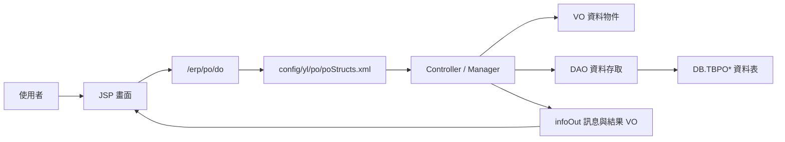
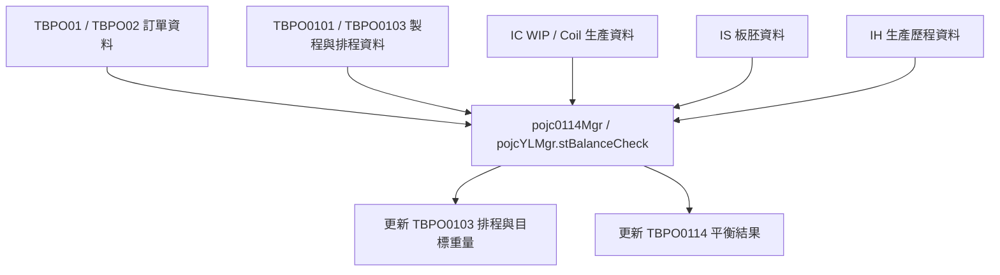

# PO 功能規格手冊

## 1. 系統概述

### 1.1 系統定位

`PO` 模組為 ERP 中的生產訂單與製程訂單資料維護系統，主要負責訂單主檔、製程路徑、製程條件、半成品／平衡量、中鴻相關訂單資料、API 異動紀錄與批次檢核作業。系統以 `JSP` 畫面、`poStructs.xml` 頁面設定、`Controller / Manager` 控制邏輯、`VO / DAO` 資料存取物件與資料庫 `TBPO*` 資料表共同構成。

本文件依目前程式目錄 `D:\CHSBrowser_erp\erpHome\yl.ear\erp.war\po` 盤點，主要來源包含：

- `config/yl/po/poStructs.xml`：頁面、Controller、Action、VO 對照。
- `jsp/`：使用者操作畫面、查詢視窗、報表與批次頁面。
- `src/com/icsc/po/`：Manager、VO、DAO、中鴻批次與 API 邏輯。
- `dao/`、`dao/sql/`：資料表欄位、主鍵與資料存取定義。

### 1.2 系統目標

`PO` 模組的目標如下：

- 維護生產訂單與各訂單項次資料，例如訂單號碼、項次、客戶、規格、重量、交期、用途、材質與狀態。
- 維護訂單對應的製程、製程順序、產線、站別、投入產出重量、良率與半成品資訊。
- 維護不同產線或製程別的條件資料，例如熱軋、酸洗、冷軋、退火、剪切、包裝、管類或塗鍍相關條件。
- 支援訂單平衡檢核，統整目標分配量、半成品量、生產量、合格量、出貨量、未出貨量與不足量。
- 支援中鴻相關訂單維護、批次平衡檢核、報表列印與 API 異動紀錄查詢。
- 提供跨模組 API 與資料整合能力，讓 `SO`、`IC`、`IS`、`IH`、`SB` 等相關模組能取得或回寫訂單與生產進度資料。

### 1.3 使用者與作業角色

依程式與畫面設計推估，系統使用者包含：

- 訂單維護人員：建立、查詢、修改、刪除訂單主檔與項次資料。
- 生管／排程人員：維護製程路徑、排程順序、產線條件與製程重量。
- 品質／製程工程人員：維護規格、材質、測試、塗油、包裝與特殊品質條件。
- 中鴻相關作業人員：維護中鴻訂單、API 異動資料、執行批次平衡檢核與查詢報表。
- 系統管理或維護人員：透過共用維護頁面管理基礎資料、批次狀態與異常資料。

### 1.4 系統範圍

本系統範圍包含：

- `TBPO01`、`TBPO02` 訂單主體資料維護。
- `TBPO0101` 至 `TBPO0115` 之訂單製程、條件、品質與平衡資料維護。
- `TBPO0201` 管類或特殊產品條件資料維護。
- `TBPO0301`、`TBPO0303`、`TBPO0306`、`TBPOYL0307` 等基準與製程設定資料。
- `TBPOGI0`、`TBPOCPN`、`TBPOPRODSPEC` 等特殊規格或產線資料維護。
- `TBPOYLAPI01` API 異動紀錄查詢與資料維護。
- 中鴻批次平衡檢核、檢核確認、取消與結果報表。

以下範圍需由外部模組或實際環境再確認：

- `poStructs.xml` 中有 `pojj05Main`、`pojj0501Main`、`pojj0502Main`、`pojj0503Main`、`pojj07Edit`、`pojj07List`、`pojj0701Edit`、`pojj0701List`、`pojj0702Edit`、`pojj0702List` 等設定，但目前此目錄未見對應 JSP 與 Java 類別，推估為尚未部署、歷史設定或由其他位置提供，正式版需再追查。
- DAO 中文註解因原始檔為 Big5 / CP950，在終端顯示可能亂碼；本文件以設定檔、檔名、欄位名稱、Controller 方法與 SQL 欄位交叉判讀。

---

## 2. 系統架構總覽

### 2.1 目錄與元件架構

```text
po/
├─ config/yl/po/poStructs.xml    頁面、Controller、Action、VO 對照設定
├─ jsp/                           JSP 操作畫面、查詢視窗、報表、批次頁面
├─ src/com/icsc/po/               Java Controller、Manager、VO、DAO、批次與 API 邏輯
├─ dao/                           DAO 產生設定
├─ dao/sql/                       資料表建立 SQL
├─ html/                          前端共用 JS / GUI 定義
└─ images/                        模組圖片與功能圖示
```

### 2.2 請求處理架構

使用者從 JSP 表單送出後，主要透過 `/erp/po/do?_pageId=...` 進入 ERP 共用控制框架。框架依 `poStructs.xml` 找到 pageID 對應的 Controller，再依 `_action` 旗標執行指定方法。



### 2.3 Action 對照規則

多數維護頁面採用相同 Action 規則：

| Action | Controller 方法 | 用途 |
| --- | --- | --- |
| `I` | `query()` | 查詢資料並回填畫面 |
| `N` | `create()` | 新增資料 |
| `R` | `update()` | 修改資料 |
| `D` | `delete()` | 刪除資料 |
| `S` | `quickQuery()` 或確認類方法 | 快速查詢或確認 |
| `Q` | `query02()` | 第二種查詢模式 |
| `REFRESH` | `refresh()`、`balanceCheck()`、`refreshPoTraceData()` | 重算或刷新資料 |
| `RESET` / `RESET02` | `reset()`、`reset02()` | 重設平衡或衍生資料 |
| `O` | `xmlBatchBalanceCheck()` | 啟動批次平衡檢核 |
| `C` | `xmlBBCCancel()` | 取消批次檢核 |
| `H` | `handConfirm()` | 人工確認 |
| `CANCEL` | `cancelClosePo()` | 取消結案或關閉訂單 |

### 2.4 程式分層

| 層級 | 主要元件 | 說明 |
| --- | --- | --- |
| 畫面層 | `jsp/pojj*.jsp` | 顯示表單、列表、查詢、彈窗、報表與批次操作頁 |
| 設定層 | `poStructs.xml` | 定義 pageID、JSP、Controller、Action、VO 綁定 |
| 控制層 | `pojc*Mgr.java`、`pojcYLMgr*.java` | 接收 Action、執行商業邏輯、交易控制與訊息回傳 |
| 資料物件層 | `pojctb*.java`、`pojc*VO.java` | 對應資料表欄位與畫面資料 |
| 資料存取層 | `pojctb*DAO.java`、`dao/*.dao` | 提供查詢、新增、修改、刪除與批次寫入 |
| 資料庫層 | `DB.TBPO*` | 儲存訂單、製程、條件、API 與平衡資料 |
| 整合層 | `pojcYLMgr`、`pojcylAPI`、外部 import | 與 `SO`、`IC`、`IS`、`IH`、`SB` 等模組交換資料 |

### 2.5 主要資料表

| 資料表 | VO／DAO | 功能定位 | 主要用途 | 關聯功能 |
| --- | --- | --- | --- | --- |
| `TBPO01` | `pojctb01`／`pojctb01DAO` | 訂單主檔 | 儲存主要產品訂單資料，包含訂單、項次、客戶、產品、規格、重量、交期、狀態、材質與加工要求 | `pojj01Detail`、`pojj0304Detail`、`TBPO0114` 平衡檢核、`pojcYLMgr.stBalanceCheck()` |
| `TBPO02` | `pojctb02`／`pojctb02DAO` | 第二類訂單主檔 | 儲存另一類訂單主體資料，包含內外銷、交期、產品、包裝、特殊需求、製程代碼與訂單狀態 | `pojj02Detail`、`POJJYL0305`、`TBPO0201` 條件資料、中鴻 API 異動 |
| `TBPO0101` | `pojctb0101`／`pojctb0101DAO` | 訂單製程主路徑 | 記錄訂單項次下的 MSC、製程線別、製程明細與有效狀態 | `pojj0101Detail`、`pojj0304Detail`、`POJJYL0305`、`TBPO0103` 製程順序 |
| `TBPO0102` | `pojctb0102`／`pojctb0102DAO` | 投料與半成品對應 | 維護投料型態、MFC、板胚厚寬重與半成品規格對應資料 | `pojj0102Detail`、`pojj0304Detail`、`pojcYLMgr.xmlCreate0306()` |
| `TBPO0103` | `pojctb0103`／`pojctb0103DAO` | 製程順序與排程重量 | 記錄製程路徑、產線順序、排程重量、目標重量、實際半成品量與良率資訊 | `pojj0303Detail`、`pojc0114Mgr.refresh()`、`pojcYLMgr.stBalanceCheck()` |
| `TBPO0104` | `pojctb0104`／`pojctb0104DAO` | 製程尺寸條件 | 維護 MSC 製程的厚度、寬度、公差或尺寸相關條件 | `pojj0104Detail`、訂單製程條件維護 |
| `TBPO0105` | `pojctb0105`／`pojctb0105DAO` | 主要製程條件 | 維護熱軋或主要產線條件，包含材質、張力、目標尺寸、品質與測試條件 | `pojj0105Detail`、製程條件維護 |
| `TBPO0106` | `pojctb0106`／`pojctb0106DAO` | 製程品質條件 | 維護偏差、張力、材質代碼等製程附屬條件 | `pojj0106Detail`、製程條件維護 |
| `TBPO0107` | `pojctb0107`／`pojctb0107DAO` | 冷軋／加工條件 | 維護卡別、修磨面、塗油、目標尺寸與品質備註 | `pojj0107Detail`、`pojj0304Detail` |
| `TBPO0108` | `pojctb0108`／`pojctb0108DAO` | 軋延／塗油條件 | 維護軋延、塗油、目標厚度與品質備註等條件 | `pojj0108Detail`、製程條件維護 |
| `TBPO0109` | `pojctb0109`／`pojctb0109DAO` | 清洗／電極條件 | 維護電極、加罐、清洗速度、塗油與品質備註 | `pojj0109Detail`、製程條件維護 |
| `TBPO0110` | `pojctb0110`／`pojctb0110DAO` | 退火條件 | 維護退火週期、除氫或凍結位置、目標厚度與品質備註 | `pojj0110Detail`、製程條件維護 |
| `TBPO0111` | `pojctb0111`／`pojctb0111DAO` | 後段製程條件 | 維護目標厚度、塗油、臨時油品與品質條件 | `pojj0111Detail`、製程條件維護 |
| `TBPO0112` | `pojctb0112`／`pojctb0112DAO` | 剪切／後處理條件 | 維護剪邊、加罐、內徑、油品與後處理條件 | `pojj0112Detail`、製程條件維護 |
| `TBPO0113` | `pojctb0113`／`pojctb0113DAO` | 簡化品質條件 | 維護製程線別下的材質規格與品質備註 | `pojj0113Detail`、製程條件維護 |
| `TBPO0114` | `pojctb0114`／`pojctb0114DAO` | 訂單平衡資料 | 儲存半成品量、生產量、合格量、出貨量、未出貨量、目標分配量、實際分配量與不足量 | `pojj0114Detail`、`pojj0114Detail02`、中鴻批次平衡檢核、`pojcYLMgr.stBalanceCheck()` |
| `TBPO0115` | `pojctb0115`／`pojctb0115DAO` | 訂單附屬資料 | 維護訂單項次的延伸條件或附屬資訊 | `pojj0115Detail`、訂單製程條件維護 |
| `TBPO0201` | `pojctb0201`／`pojctb0201DAO` | 管類／特殊產品條件 | 儲存包裝、特殊測試、刮除、膜厚、品牌、檢測與尺寸允收條件 | `pojj0201Detail`、`pojj02Detail` |
| `TBPO0301` | `pojctb0301`／`pojctb0301DAO` | 生產前置與排程基準 | 維護生產前置時間、排程或基準設定資料 | `pojj0301Seq`、`pojcYLMgr.getRollDay()` |
| `TBPO0303` | `pojctb0303`／`pojctb0303DAO` | 製程良率基準 | 維護製程良率或相關基準值，供平衡與排程計算參考 | `pojj0303Detail`、`pojcYLMgr.getYieldValue()` |
| `TBPO0306` | `pojctb0306`／`pojctb0306DAO` | 投料／板胚基準 | 維護投料厚度、板胚尺寸、重量與 MFC 條件基準 | `POJJ0306`、`pojcYLMgr.xmlQuery0306()`、`pojcYLMgr.xmlCreate0306()` |
| `TBPOYL0307` | `pojctbYL0307`／`pojctbYL0307DAO` | 中鴻期間設定 | 儲存中鴻年月或期間性設定資料 | `POJJYL0307`、`pojcYLMgr.xmlCreateYL0307()`、`pojcYLMgr.xmlQueryYL0307()` |
| `TBPOYLAPI01` | `pojctbYLAPI01`／`pojctbYLAPI01DAO` | API 異動紀錄 | 記錄異動前後訂單、項次、MSC、製程、重量、訊息代碼與處理訊息 | `pojjYLAPI01`、`POJJYL0305`、`pojcylAPI`、跨系統異動追蹤 |
| `TBPOGI0` | `pojctbGI0`／`pojctbGI0DAO` | CGL 產線資料 | 維護 PO-CGL 或鍍鋅線相關製程資料 | `pojjGI0Detail`、特殊產線資料維護 |
| `TBPOCPN` | `pojctbCPN`／`pojctbCPNDAO` | CPN／MIC 類資料 | 維護特殊 CPN、MIC 或製程代碼類資料 | `pojjCPNDetail`、特殊規格資料維護 |
| `TBPOPRODSPEC` | `pojcProdSpecVO`／`pojcProdSpecDAO` | 產品規格資料 | 維護訂單產品規格與規格條件資料 | `pojjSemiProdSpec`、產品規格查詢與維護 |

### 2.6 跨模組整合

`pojcYLMgr.java` 與 `pojc0114Mgr.java` 有多個外部模組引用與計算點：

- `SO`：讀取銷售訂單或項次資料，例如 `sojcItemDAO`。
- `IC`：查詢 Coil、WIP、生產量與半成品資料，例如 `icjcCoil`。
- `IS`：查詢板胚或庫存相關資料，例如 `isjcQuerySlabYL`。
- `IH`：查詢或更新熱軋／生產歷程資料，例如 `ihjccr01mpo`。
- `SB`：中鴻或其他介接 API，例如 `sbjcylAPI02`。

平衡檢核作業會彙整上述模組資料後回寫 `TBPO0114`，並可能同步更新 `TBPO0103` 的排程重量與目標重量。

---

## 3. 功能模組詳細說明

### 3.1 訂單主檔維護：`pojj01Detail`

**對應程式**

- JSP：`pojj01Detail.jsp`
- Controller：`com.icsc.po.pojc01Mgr`
- VO / Table：`pojctb01` / `TBPO01`
- Action：`I` 查詢、`N` 新增、`R` 修改、`D` 刪除

**功能說明**

維護主要訂單資料，包含公司別、訂單號碼、項次、客戶、產品名稱、規格、訂單型態、用途、重量、交期、產品狀態、材質、加工要求與備註等資料。此模組是後續製程、平衡檢核與 API 異動的基礎資料來源。

**主要流程**

1. 使用者輸入訂單號碼與項次查詢。
2. Controller 透過 `pojctb01DAO` 查詢 `TBPO01`。
3. 查詢成功後回填 `v1` 至 JSP。
4. 新增、修改、刪除時執行 validate 後寫入資料表。

### 3.2 訂單製程與條件明細：`pojj0101Detail` 至 `pojj0115Detail`

**對應程式**

- Controller：`pojc0101Mgr` 至 `pojc0115Mgr`
- VO / Table：`pojctb0101` 至 `pojctb0115`
- 多數頁面 Action：`I`、`N`、`R`、`D`

**功能說明**

`010x` 系列是訂單主檔下的製程、產線、品質、尺寸、材質、測試與特殊條件資料。各頁面多採標準 CRUD 模式，但資料語意依資料表不同而分工。

| 頁面 / 資料表 | 功能重點 |
| --- | --- |
| `pojj0101Detail` / `TBPO0101` | 維護訂單項次下的 MSC、產線或製程主路徑 |
| `pojj0102Detail` / `TBPO0102` | 維護投料、板胚、MFC 或半成品規格對應 |
| `pojj0104Detail` / `TBPO0104` | 維護 MSC 尺寸或公差類製程條件 |
| `pojj0105Detail` / `TBPO0105` | 維護熱軋或主要製程條件，欄位量最大，含材質、張力、厚寬長與品質條件 |
| `pojj0106Detail` / `TBPO0106` | 維護特定製程條件，例如偏差、張力、材質代碼 |
| `pojj0107Detail` / `TBPO0107` | 維護冷軋或卡別、塗油、修磨面等製程品質條件 |
| `pojj0108Detail` / `TBPO0108` | 維護加工、塗油、軋延與品質備註類條件 |
| `pojj0109Detail` / `TBPO0109` | 維護電極、加罐、清洗速度、塗油等條件 |
| `pojj0110Detail` / `TBPO0110` | 維護退火週期、除氫或凍結位置等條件 |
| `pojj0111Detail` / `TBPO0111` | 維護目標厚度、塗油或臨時油品等條件 |
| `pojj0112Detail` / `TBPO0112` | 維護剪邊、加罐、內徑、油品等條件 |
| `pojj0113Detail` / `TBPO0113` | 維護簡化製程品質備註條件 |
| `pojj0114Detail` / `TBPO0114` | 維護與重算訂單平衡量 |
| `pojj0115Detail` / `TBPO0115` | 維護附屬條件或延伸資料 |

### 3.3 訂單平衡資料維護：`pojj0114Detail`、`pojj0114Detail02`

**對應程式**

- JSP：`pojj0114Detail.jsp`、`pojj0114Detail02.jsp`
- Controller：`com.icsc.po.pojc0114Mgr`
- VO / Table：`pojctb0114` / `TBPO0114`
- Action：`I`、`N`、`R`、`D`、`REFRESH`、`RESET`、`RESET02`

**功能說明**

此模組負責訂單量平衡資料查詢、重算與回寫。查詢時會先呼叫平衡檢核邏輯，再讀取 `TBPO0114` 顯示結果。`refresh()` 與 `balanceCheck()` 會整合訂單主檔、製程路徑、WIP、生產、合格、出貨與良率資料，計算各項重量。

**主要計算項目**

- 訂單重量與追加重量。
- 半成品實際量與換算量。
- 生產量、合格量、出貨量、未出貨量。
- 目標分配量與實際分配量。
- 不足量與不足原因代碼。
- 製程良率與各段 target / schedule weight。

**主要資料流**



### 3.4 第二類訂單主檔與管類條件：`pojj02Detail`、`pojj0201Detail`

**對應程式**

- JSP：`pojj02Detail.jsp`、`pojj0201Detail.jsp`
- Controller：`pojc02Mgr`、`pojc0201Mgr`
- VO / Table：`pojctb02` / `TBPO02`、`pojctb0201` / `TBPO0201`
- Action：`I`、`N`、`R`、`D`

**功能說明**

`TBPO02` 是另一類訂單主體資料，欄位包含內外銷、客戶、產品、訂單重量、包裝、材質、製程代碼、特殊需求與狀態。`TBPO0201` 則維護該訂單下的特殊管類或加工條件，例如包裝、特殊測試、刮除、膜厚、品牌、檢測與尺寸允收條件。

### 3.5 製程基準與快速查詢：`pojj0301Seq`、`pojj0303Detail`

**對應程式**

- JSP：`pojj0301Seq.jsp`、`pojj0303Detail.jsp`
- Controller：`pojc0301MgrSeq`、`pojc0303Mgr`
- VO / Table：`pojctb0301` / `TBPO0301`、`pojctb0303` / `TBPO0303`
- Action：`I`、`N`、`R`、`D`、`S`、`Q`

**功能說明**

此類模組維護生產前置時間、製程良率、排程基準或製程查詢資料。`pojj0301Seq` 額外提供快速查詢與第二查詢模式，適合查詢序列型資料。

### 3.6 訂單衍生資料更新：`pojj0304Detail`、`POJJYL0305`

**對應程式**

- `pojj0304Detail.jsp`：`pojc0304Mgr`
- `pojjYL0305Detail.jsp`：`pojcYL0305Mgr`
- Action：`I` 查詢、`R` 修改

**功能說明**

此類頁面不是單一資料表標準 CRUD，而是一次讀取或更新多個 VO。`pojj0304Detail` 會同時處理 `TBPO01`、`TBPO0102`、`TBPO0101`、`TBPO0107` 等資料，更新時可能同步修改投料規格、製程主檔、冷軋條件與 `TBPO0114` 平衡資訊。`POJJYL0305` 主要處理中鴻相關 `TBPO02` 訂單資料，更新時也可能同步更新 `TBPO0101`、`TBPO0103`、`TBPO0114` 與 `TBPOYLAPI01`。

### 3.7 中鴻投料與設定維護：`POJJ0306`、`POJJYL0307`

**對應程式**

- JSP：`pojj0306.jsp`、`pojjYL030703.jsp`
- Controller：`pojcYLMgr`
- VO / Table：`pojctb0306` / `TBPO0306`、`pojctbYL0307` / `TBPOYL0307`
- Action：`xmlQuery0306`、`xmlCreate0306`、`xmlCreateYL0307`、`xmlQueryYL0307`、`xmlDeleteYL0307`

**功能說明**

此類頁面使用 XML 型 Action，支援中鴻或特殊設定資料的批次查詢、新增與刪除。`TBPO0306` 依欄位可判讀為投料厚度、板胚尺寸、重量與 MFC 條件基準；`TBPOYL0307` 則以公司別與年月作為查詢基礎，記錄中鴻週期性設定資料。

### 3.8 中鴻 API 異動紀錄：`pojjYLAPI01`

**對應程式**

- JSP：`pojjYLAPI01.jsp`、`pojjYLAPI01Search.jsp`、`pojjYLAPI01List.jsp`、`pojjYLAPI01Popup.jsp`
- VO / Table：`pojctbYLAPI01` / `TBPOYLAPI01`
- 相關類別：`pojcylAPI`、`pojcYLMgr`

**功能說明**

記錄中鴻訂單或製程異動前後資料。資料表欄位包含異動日期、時間、處理程式、異動前後訂單號碼、項次、MSC、製程序號、製程代碼、重量、訊息代碼、處理訊息與材料識別。此資料可作為跨系統 API 交換後的稽核、追蹤與錯誤診斷依據。

### 3.9 中鴻批次平衡檢核

**對應程式**

- JSP：`pojjYLBatchBalanceCheck.jsp`、`pojjYLBatchBalanceCheck02.jsp`
- 編輯頁：`pojjYLBatchBalanceCheckEdit.jsp`、`pojjYLBatchBalanceCheckEdit02.jsp`
- Controller：`pojcYLMgr02`、`pojcYLMgr04`
- 批次類別：`pojcYLBatchBalanceCheck`、`pojcYLBatchBalanceCheck02`
- 狀態物件：`pojcYLBatchBalanceCheckStatus`、`pojcYLBatchBalanceCheckStatus02`
- Action：`I` 查詢狀態、`O` 執行檢核、`S` 確認、`C` 取消

**功能說明**

中鴻批次平衡檢核用於一次檢查多筆訂單平衡狀態。使用者可查詢目前批次狀態、啟動檢核、確認執行或取消執行。批次類別會產生檢核結果檔，並以 `TBPO0114` 作為主要檢核與結果資料來源。

### 3.10 中鴻報表

**對應程式**

- `pojjYLReport01.jsp`、`pojjYLReport01Search.jsp`、`pojjYLReport01Popup.jsp`、`pojjYLReport01Print.jsp`
- `pojjYLReport02.jsp`、`pojjYLReport02Search.jsp`、`pojjYLReport02Popup.jsp`、`pojjYLReport02Print.jsp`

**功能說明**

提供中鴻相關報表查詢、彈窗選取與列印。依檔名分為 `Report01` 與 `Report02` 兩組，正式版需搭配實際 JSP 欄位與使用者流程再補齊報表欄位定義、排序條件、彙總欄位與列印格式。

### 3.11 特殊規格與產線資料維護

**對應程式**

- `pojjGI0Detail.jsp` / `pojcGI0Mgr` / `TBPOGI0`
- `pojjCPNDetail.jsp` / `pojcCPNMgr` / `TBPOCPN`
- `pojjSemiProdSpec.jsp` / `pojcSemiProdSpecDAO` / 半成品規格資料
- `TBPOPRODSPEC` / `pojcProdSpecDAO` / 產品規格資料

**功能說明**

此類模組維護特殊產線、產品規格、半成品規格或 MIC / CPN 類資料。`TBPOGI0` DAO 註解顯示與 `PO-CGL` 製程相關；`TBPOCPN` 則為特殊代碼或 MIC 類資料。這些資料可能被訂單製程、品質條件或平衡檢核邏輯引用。

### 3.12 查詢、列表與彈窗共用頁

**對應 JSP**

- `pojj01Search.jsp`、`pojj01List.jsp`、`pojj01Popup.jsp`、`pojj01TreeView.jsp`、`pojj01Wrapper.jsp`
- `pojj02Search.jsp`、`pojj02List.jsp`、`pojj02Popup.jsp`、`pojj02TreeView.jsp`、`pojj02Wrapper.jsp`
- `pojj01OrderItemNoQry*.jsp`、`pojj02OrderItemNoQry*.jsp`
- `pojj0304Search.jsp`、`pojj0304List.jsp`、`pojj0304Popup.jsp`
- `pojjYL0305Search.jsp`、`pojjYL0305List.jsp`、`pojjYL0305Popup.jsp`

**功能說明**

提供訂單號碼、項次、製程、列表與彈窗查詢功能，供主維護頁面選取資料。Wrapper 與 TreeView 頁面用於呈現樹狀或主從資料結構，讓使用者從訂單主檔一路切換到項次、製程與條件明細。

### 3.13 權限與操作控制

JSP 中可見部分操作會依 `isAdmin(_dsCom)` 判斷是否顯示刪除、修改、新增按鈕；非管理者時欄位可能改為唯讀。此表示模組至少具備前端層級的管理權限控制。正式規格若需完整權限矩陣，需再追查 ERP 共用登入、角色與授權框架。

### 3.14 交易與錯誤處理

多數 Controller 使用 `dejc301` 取得連線並於成功時 commit；例外時透過 `handleTransacException()` 或手動 rollback 處理。資料異動完成後，透過 `infoOut.setMessage()` 回傳查詢成功、新增成功、修改成功、刪除成功或例外訊息。

### 3.15 待補確認項目

以下項目建議後續補充：

- 各 JSP 欄位的正式中文欄名與欄位驗證規則。
- `pojj05*`、`pojj07*` 系列設定是否為歷史、缺檔或其他模組提供。
- 中鴻報表 `Report01`、`Report02` 的實際欄位、排序、群組與列印樣式。
- `TBPO0114` 平衡檢核與外部模組 `IC`、`IS`、`IH` 的資料契約。
- API 異動紀錄 `TBPOYLAPI01` 的來源系統、觸發時機與錯誤碼對照表。
