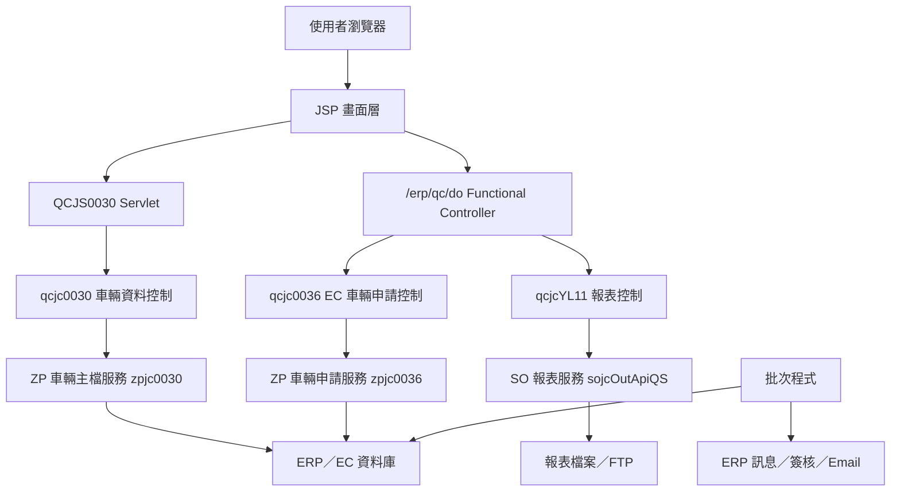
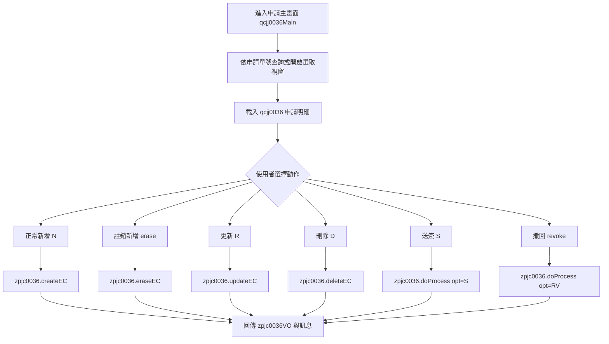

# QC 功能規格手冊

> 本文件依 `qc` 模組現有程式、JSP、頁面設定檔與批次程式盤點整理，作為後續維護、設計溝通與異動評估之功能規格基準。

## 1. 系統概述

### 1.1 系統定位

`QC` 模組為 ERP／EC 電子商務環境中的車輛與帳號控管輔助模組，主要負責車輛基本資料維護、EC 車輛異動申請、報表產製、EC 帳號定期檢核，以及特定資安與簽核監控作業。

模組實作上，`QC` 多數畫面與控制層扮演「入口與包裝層」角色，實際車輛主檔與申請邏輯多委派至共用 `ZP` 服務，例如 `com.icsc.zp.zpjc0030`、`com.icsc.zp.zpjc0036`、檔案上傳、簽核、公文訊息與寄信服務等。

### 1.2 使用對象

- EC 或 ERP 承辦人員：維護車輛、司機與運輸廠商資料，查詢車輛與申請單狀態。
- 廠商或申請相關人員：透過 EC 車輛申請流程提出新增、異動、刪除或註銷需求。
- A31 主管或資安承辦窗口：接收密碼規則異動通知、DA 程式上線清單簽核、帳號清查結果通知。
- 系統維運人員：追蹤批次清查、報表產製、檔案簽核與訊息通知執行結果。

### 1.3 功能範圍

| 類別 | 功能範圍 | 主要依據 |
| --- | --- | --- |
| 車輛基本資料維護 | 車輛資料查詢、新增、修改、送出、刪除或註銷相關流程 | `qcjs0030.java`、`qcjc0030.java`、`qcjj0030.jsp`、`qcjj0031.jsp` |
| EC 車輛申請 | EC 車輛申請單查詢、車輛帶入、新增、註銷新增、更新、刪除、送簽、撤回 | `qcStructs.xml`、`qcjc0036.java`、`qcjj0036.jsp`、`qcjj0036Main.jsp` |
| 查詢輔助 | 車輛選取、申請單選取、狀態與功能代碼查詢 | `qcjjCarSelect.jsp`、`qcjjCarApplySel.jsp`、`TBZP0030`、`TBZP0036`、`TBDE23` |
| 首頁選單與報表入口 | 依選單設定載入 QC 首頁、報表清單與報表產生視窗 | `qcjjHome.jsp`、`qcjjHomeMenu.jsp`、`qcjjHomeMenu01.jsp`、`qcjjylgenRpt01.jsp` |
| 報表產製 | 依報表代號與參數呼叫 SO 報表服務產生檔案 | `qcjcYL11.java`、`TBRP0020`、`sojcOutApiQS.makeSalDetailRtp` |
| 批次監控 | EC 帳號清查、密碼規則異動監控、DA 程式上線清單簽核 | `qcjcChkUserBatch.java`、`qcjcPasswordRuleMonitor.java`、`qcjcECOnlineLstEsign.java` |

### 1.4 系統特色

- 延用 DPMS／ERP 既有框架，透過 JSP、Servlet、Functional Controller、VO 與共用 Web Service 組成作業流程。
- 車輛資料與車輛申請分成兩條入口，前者以 `QCJS0030` Servlet 進入，後者以 `/erp/qc/do?_pageId=qcjj0036` 與 `qcStructs.xml` action 映射進入。
- 多數代碼、狀態與選單資料由通用代碼表維護，例如 `TBDE23` 的 `ZP0030STATUS`、`ZP0036FUNCODE`、`ZP0036EXESTAT`。
- 批次作業具有清查、通知、停權、產檔與簽核串接能力，並會透過 ERP 工作訊息、群組訊息或電子郵件通知指定對象。

## 2. 系統架構總覽

### 2.1 程式結構

### 2.2 主要目錄與職責

| 目錄／檔案 | 職責 |
| --- | --- |
| `config/yl/qc/qcStructs.xml` | 定義 Functional Controller 頁面、Action Flag、Controller、Forward JSP 與 VO 映射。 |
| `jsp/` | 使用者介面、查詢彈窗、首頁選單、報表產製視窗。 |
| `src/com/icsc/qc/` | QC 模組控制層、批次程式、報表與監控邏輯。 |
| `src/com/icsc/qc/web/` | Servlet 入口，目前包含 `qcjs0030`。 |

### 2.3 頁面與控制器映射

| 頁面 ID／入口 | JSP | Controller／Servlet | Action／方法 | 說明 |
| --- | --- | --- | --- | --- |
| `qcjj0030` | `qcjj0030.jsp`、`qcjj0031.jsp`、`qcjj0030MQry.jsp` | `qcjs0030` → `qcjc0030` | `INITIAL`、`SEARCH`、`MASTER_INQUIRE`、`MASTER_INSERT`、`MASTER_UPDATE`、`MASTER_FIRSTUPDATE`、`DETAIL_INQUIRE`、`DETAIL_FIRSTUPDATE` | 車輛基本資料維護與查詢。 |
| `qcjj0036` | `qcjj0036.jsp` | `qcjc0036` | `I=query`、`carInq=carInq`、`N=create`、`erase=erase`、`R=update`、`D=delete`、`S=sent`、`revoke=revoke` | EC 車輛申請單維護、送簽與撤回。 |
| `qcjj0036` Forward | `qcjj0036Main.jsp` | `qcjc0036` | `F=justForward` | 申請單主畫面，內嵌申請明細 iframe。 |
| `qcjjylgenRpt01` | `qcjjylgenRpt01.jsp` | `qcjcYL11` | `GP1=genRpt1` | 報表參數處理與報表產製。 |

### 2.4 主要資料表與設定來源

| 資料表 | VO／DAO | 功能定位 | 主要用途 | 關聯功能 |
| --- | --- | --- | --- | --- |
| `DB.TBZP0030` | `zpjc0030MVO`；實際維護委派 `com.icsc.zp.zpjc0030` | 車輛主檔 | 儲存車號、司機、車籍、運輸廠商、證照、附檔、狀態與維護資訊。 | 車輛基本資料維護、車輛選取、EC 車輛申請帶入。 |
| `DB.TBZP0036` | `zpjc0036VO`；實際維護委派 `com.icsc.zp.zpjc0036` | EC 車輛申請單 | 儲存 EC 車輛新增、註銷新增、更新、刪除、送簽、撤回等申請資料。 | EC 車輛申請、申請單選取、簽核流程。 |
| `DB.TBDE23` | `dejc323`；查詢多以 SQL 或 `dejcQueryDAO` 處理 | 通用代碼與批次控制明細 | 維護車輛狀態、申請功能別、執行狀態、批次基準日與監控時間戳。 | 狀態下拉、功能代碼轉換、帳號清查批次、密碼規則監控。 |
| `DB.TBDE22` | 未於本模組直接引用專屬 VO／DAO；以 SQL 寫入 | 通用代碼主檔 | 建立監控代碼主檔，例如 `ISMS01` 密碼規則監控項。 | EC 密碼規則異動監控。 |
| `DB.TBDU01` | `dujcUserDAO`／`dujcUserVO`；批次多以 SQL 或 `dejcQueryDAO` 處理 | 使用者帳號主檔 | 儲存 EC 帳號、姓名、個資欄位、使用期限與 Email。 | EC 帳號清查、長期未登入停用、離職／調單位停權、密碼規則通知、DA 上線清單人員名稱。 |
| `DB.TBDU02SIGN` | 未於本模組直接引用專屬 VO／DAO；以 SQL 查詢 | 使用者登入紀錄 | 取得帳號最後成功登入日期，判斷是否超過 180 天未登入。 | EC 帳號定期清查。 |
| `DB.TBHAMA`、`DB.TBHAT0` | 未於本模組直接引用專屬 VO／DAO；以 SQL 查詢 | 人事異動與異動原因代碼 | 取得員工離職、調單位及異動原因，用於判斷 EC 帳號是否需停權。 | EC 帳號定期清查。 |
| `DB.TBRP0020` | `qsjcComCMD`／`qsjcComTB` 查詢結果物件 | 報表參數設定 | 依 `rptCode` 取得報表參數名稱、型態與傳入順序。 | 報表產製、SO 報表服務呼叫。 |
| `DB.TBDSDF`、`DB.TBDSMF` | 未於本模組直接引用專屬 VO／DAO；以 SQL 查詢 | 首頁選單與功能資訊 | 依 `PARENTSEQ='AIQC'` 載入 QC 首頁功能選單與報表入口資訊。 | QC 首頁選單、報表入口。 |
| `DB.TBDAU1`、`DB.TBDAU2`、`DB.TBDAU3`、`DB.TBDAB2` | 未於本模組直接引用專屬 VO／DAO；以 SQL 查詢，並由 `dxjcCsvHandler` 產檔 | DA 程式上線資料 | 取得 DA 程式上線申請、上線主檔、程式明細與物件說明，產生每日上線清單。 | DA 程式上線清單產製與簽核。 |

### 2.5 外部服務與共用元件

| 服務／元件 | 用途 |
| --- | --- |
| `com.icsc.zp.zpjc0030` | 車輛主檔查詢、新增、修改與送出／註銷相關處理。 |
| `com.icsc.zp.zpjc0036` | EC 車輛申請單新增、註銷新增、查詢、更新、刪除、送簽、撤回與廠商名稱查詢。 |
| `com.icsc.so.api.sojcOutApiQS` | 報表參數取得與報表檔案產製。 |
| `com.icsc.zp.zpjcDwMsg` | ERP 訊息通知，支援使用者或群組通知。 |
| `com.icsc.zp.zpjcSendMail` | Email 通知。 |
| `com.icsc.zp.zpjcFileUploadApi` | 檔案上傳至遠端暫存路徑。 |
| `com.chsteel.zp.busi.zpjcCommonUtility` | 查詢 A31 主管與建立檔案簽核流程。 |

## 3. 功能模組詳細說明

### 3.1 車輛基本資料維護

#### 3.1.1 功能說明

車輛基本資料維護提供車輛資料查詢與維護作業，包含車號、運輸公司、司機、電話、車頭號碼、車籍、駕照、身分證、吊車證照、有效日期、附檔與狀態等欄位。畫面採主頁加 iframe 的方式呈現，主頁提供查詢列，明細頁呈現車輛資料。

#### 3.1.2 操作流程

1. 使用者進入 `qcjj0030.jsp`。
2. 可直接輸入車號查詢，或開啟 `qcjj0030MQry.jsp` 進行模糊查詢。
3. JSP 送出至 `/erp/qc/qcjs0030`。
4. `qcjs0030` 將 request 轉為 `infoIn`，並建立 `zpjc0030MVO`。
5. `qcjc0030.info()` 依 `execution` 判斷動作，再委派至 `com.icsc.zp.zpjc0030`。
6. 回傳資料放入 `infoOut`，forward 至指定 JSP 顯示。

#### 3.1.3 功能動作

| 動作 | 前端觸發 | 後端處理 | 委派服務 | 說明 |
| --- | --- | --- | --- | --- |
| 初始 | `INITIAL` | `doInitiation` | 無 | 初始化公司別與訊息。 |
| 查詢明細 | `SEARCH` | `qcjc0030.info` | `doSearch` | 由查詢視窗選取車輛後帶出明細。 |
| 模糊查詢 | `MASTER_INQUIRE` | `qcjc0030.info` | `doMasterInquire` | 依車號、運輸地址、狀態等條件查詢清單。 |
| 新增 | `MASTER_INSERT` | `qcjc0030.info` | `doMasterInsert` | 建立車輛主檔資料。 |
| 修改 | `MASTER_UPDATE` | `qcjc0030.info` | `doMasterUpdate` | 修改既有車輛資料。 |
| 查詢車輛 | `DETAIL_INQUIRE` | `qcjc0030.info` | `doDetailInquire` | 主頁直接以車號查詢。 |
| EC 送出 | `MASTER_FIRSTUPDATE` | `qcjc0030.info`，`opt=B` | `doFirstUpdate` | EC 正常送簽或承辦流程處理。 |
| EC 註銷送出 | `DETAIL_FIRSTUPDATE` | `qcjc0030.info`，`opt=D` | `doFirstUpdate` | EC 車輛註銷送簽流程處理。 |

#### 3.1.4 主要欄位

| 欄位 | 說明 |
| --- | --- |
| `compId` | 公司別。 |
| `carIdentiNo` | 車牌或車輛識別號。 |
| `transportName`、`transportAddrName` | 運輸公司名稱與地址。 |
| `driverName`、`telephoneNo` | 司機姓名與聯絡電話。 |
| `motiveNo`、`cartNo` | 車頭、車斗或相關車輛編號。 |
| `limitWeight` | 載重限制。 |
| `idNo`、`birthDate` | 身分證號與生日。 |
| `driverLice`、`driverNo`、`craneLiscno` | 駕照、司機編號與吊車證照。 |
| `statusCode` | 車輛狀態，對應 `TBDE23/ZP0030STATUS`。 |
| `transportID`、`vendorName` | 運輸廠商代號與名稱。 |
| `vendSendTS`、`confirmTS` | 廠商送出與確認時間。 |

### 3.2 EC 車輛申請作業

#### 3.2.1 功能說明

EC 車輛申請作業處理車輛新增、註銷新增、更新、刪除、送簽與撤回。此流程以 `qcStructs.xml` 定義 Action Flag，透過 `qcjc0036` Functional Controller 呼叫 `com.icsc.zp.zpjc0036` 完成實際申請邏輯。

#### 3.2.2 申請作業流程

#### 3.2.3 Action 對照

| Action Flag | Controller 方法 | 委派服務 | 說明 |
| --- | --- | --- | --- |
| `I` | `query` | `queryEC` | 依申請單號查詢申請資料。 |
| `carInq` | `carInq` | `carInqEC` | 依公司別與車號帶入車輛資料。 |
| `N` | `create` | `createEC` | 建立 EC 正常新增申請。 |
| `erase` | `erase` | `eraseEC` | 建立 EC 註銷新增申請。 |
| `R` | `update` | `updateEC` | 更新申請資料。 |
| `D` | `delete` | `deleteEC` | 刪除申請資料。 |
| `S` | `sent` | `doProcess`，`opt=S` | 送簽。 |
| `revoke` | `revoke` | `doProcess`，`opt=RV` | 撤回。 |
| `F` | `justForward` | 無 | Forward 至申請主畫面。 |

#### 3.2.4 申請單狀態與畫面控制

畫面依 `funCode` 與 `exeStat` 判定是否為唯讀或可編輯。代碼來源如下：

| 代碼來源 | 用途 |
| --- | --- |
| `TBDE23/ZP0036FUNCODE` | 申請功能別，例如新增、更新、刪除、註銷等。 |
| `TBDE23/ZP0036EXESTAT` | 申請執行狀態，例如送簽、確認等。 |
| `TBDE23/ZP0030STATUS` | 車輛狀態。 |

### 3.3 車輛與申請單選取輔助

#### 3.3.1 車輛選取

`qcjjCarSelect.jsp` 提供車輛清單查詢，資料來源為 `DB.TBZP0030`，並以 `DB.TBDE23/ZP0030STATUS` 轉換狀態文字。使用者選取車輛後，會回填 opener 畫面欄位，必要時送出 `form2` 觸發 `qcjc0036.carInq()`，將車輛資料帶入 EC 申請畫面。

#### 3.3.2 申請單選取

`qcjjCarApplySel.jsp` 提供申請單查詢，資料來源為 `DB.TBZP0036`，並串接 `ZP0030STATUS`、`ZP0036FUNCODE`、`ZP0036EXESTAT` 取得狀態與功能說明。使用者選取申請單後，回填申請單號並送出主畫面查詢。

### 3.4 首頁選單與報表入口

#### 3.4.1 功能說明

QC 首頁由 `qcjjHome.jsp` 內嵌 `qcjjHomeMenu.jsp`，再載入 `qcjjHomeMenu01.jsp` 呈現選單與報表入口。選單資料依 `TBDSDF` 的 `PARENTSEQ='AIQC'` 查詢，再依功能資訊讀取 `TBDSMF`。

#### 3.4.2 報表產製流程

1. 使用者於首頁選單選擇報表。
2. 系統開啟 `qcjjylgenRptPopup01.jsp`，內嵌 `qcjjylgenRpt01.jsp`。
3. JSP 呼叫 `sojcOutApiQS.genRptPara` 取得報表參數畫面。
4. 使用者送出後，以 `GP1` action 呼叫 `qcjcYL11.genRpt1()`。
5. `qcjcYL11` 依 `rptCode` 至 `TBRP0020` 取得參數定義。
6. 組成參數向量後呼叫 `sojcOutApiQS.makeSalDetailRtp`。
7. 報表服務回傳 Base64 報表內容、成功旗標與檔名。
8. 系統解碼產生檔案，並回傳下載或 FTP 連結資訊。

### 3.5 EC 帳號定期清查批次

#### 3.5.1 功能說明

`qcjcChkUserBatch` 為 EC 電子商務帳號定期清查批次，實作 `diji234` 介面。批次會連線至 `ec` datasource，執行三類檢核，最後透過 ERP 群組訊息通知 `ECCHKACCOUNTSGP`。

#### 3.5.2 檢核項目

| 項目 | 方法 | 資料來源 | 處理方式 |
| --- | --- | --- | --- |
| 清除個資 | `chkSensitiveData` | `TBDU01` | 找出 `PERSONID`、`BIRTHDAY`、`PHONE1`、`ADDRESS` 不為空的帳號，記錄後清空欄位。 |
| 長期未登入 | `chkLongtimeNoLogin` | `TBDU01`、`TBDU02SIGN` | 找出 180 天未成功登入或無成功登入紀錄且仍有效的帳號，將 `VALIDDATE` 改為系統日減 1 天。 |
| 離職或調單位 | `chkTurnOverEmp` | `TBDU01`、`TBDE23`、`TBHAMA`、`TBHAT0` | 依批次記錄日與人事異動資料判斷離職或調單位人員，將 `VALIDDATE` 改為系統日減 30 天。 |

#### 3.5.3 批次控制

- 使用 `TBDE23` 的 `TABID='ECBATCH'`、`FIELD1='ADJDEPTDATE'` 記錄人事異動檢查基準日。
- 若首次執行無基準日，預設以前 2 日作為檢查起點。
- 每次執行會更新基準日為昨日，以避免重複掃描或漏掃。

### 3.6 DA 程式上線清單簽核批次

#### 3.6.1 功能說明

`qcjcECOnlineLstEsign` 依指定日期產生 EC 每日 DA 程式上線清單，若有資料則產生 CSV 檔、上傳暫存檔案，並建立簽核流程；若無資料或發生錯誤，則以 ERP 群組訊息通知 `ECONLINELSTESIGN`。

#### 3.6.2 作業流程

1. 取得日期參數 `dateLFmt2`，空白時預設為昨日，格式為民國年 `YYY/MM/DD`。
2. 查詢 `TBDAU1`、`TBDAU2`、`TBDAU3`、`TBDAB2`、`TBDU01`，產出上線時間、系統、員工、程式、版本、上線原因與需求單號。
3. 使用 `dxjcCsvHandler` 產生 CSV。
4. 透過 `zpjcFileUploadApi.__dejc329_RemoteReciveFile` 上傳檔案。
5. 透過 `zpjcCommonUtility.findManager("A31")` 取得 A31 主管。
6. 透過 `zpjcCommonUtility.fileApproval` 建立檔案簽核。
7. 無資料或失敗時，透過 `zpjcDwMsg.throwDwMsg` 通知群組。

### 3.7 EC 密碼規則異動監控

#### 3.7.1 功能說明

`qcjcPasswordRuleMonitor` 監控 `./du/duPwdCheckConfig.ini` 的最後異動時間。若檔案異動時間與上次記錄不同，系統會通知 A31 主管，並更新 `TBDE23` 中的監控時間戳。

#### 3.7.2 監控流程

1. 取得本機 Host 與 IP，作為通知內容的一部分。
2. 讀取 `./du/duPwdCheckConfig.ini` 的 `lastModified`。
3. 查詢 `TBDE23` 是否存在 `TABID='ISMS01'`、`FIELD1='lastModified'`。
4. 若不存在，建立 `TBDE22` 與 `TBDE23` 初始資料。
5. 若存在，與目前檔案異動時間比對，容許 `1000 ms` 誤差。
6. 若判斷有異動，透過 ERP 訊息與 Email 通知 A31 主管，並更新 `TBDE23.FIELD2`。

### 3.8 例外處理與通知

| 模組 | 例外處理方式 |
| --- | --- |
| 車輛主檔維護 | Servlet 捕捉例外並輸出 stack trace；商業邏輯由 `ZP` 服務回傳訊息。 |
| EC 車輛申請 | Controller 捕捉例外，組合申請單號與車號錯誤訊息，必要時呼叫 transaction exception handler。 |
| 報表產製 | 捕捉報表服務或檔案解碼例外，寫入 ERP log 並於畫面回傳失敗訊息。 |
| 帳號清查批次 | 每項清查寫入 log，最後以群組訊息通知清查結果或錯誤內容。 |
| DA 上線簽核批次 | 產檔或簽核失敗時寫入 log，並以群組訊息通知。 |
| 密碼規則監控 | 發現異動時同時發送 ERP 訊息與 Email，並更新監控基準值。 |

### 3.9 維護注意事項

- `QC` 模組中的車輛主檔與申請邏輯大多委派至 `ZP` 服務，異動前需同步檢查 `com.icsc.zp.zpjc0030`、`com.icsc.zp.zpjc0036` 與相關 VO／DAO。
- `qcStructs.xml` 僅列出 Functional Controller 入口，`qcjs0030` 這類 Servlet 入口需另由 JSP action 與 web 設定追蹤。
- 終端機顯示 BIG5 中文註解可能出現亂碼；盤點時應以檔名、Action、方法名稱、SQL 與資料表交叉確認。
- 牽涉帳號停用、清除個資、簽核建立、ERP 訊息與 Email 的批次作業，異動前應先確認執行環境、datasource、通知群組與主管代碼。
- 報表產製會寫入檔案並依報表服務回傳檔名處理，調整時需確認輸出路徑、FTP 連結、Base64 解碼與檔案權限。
