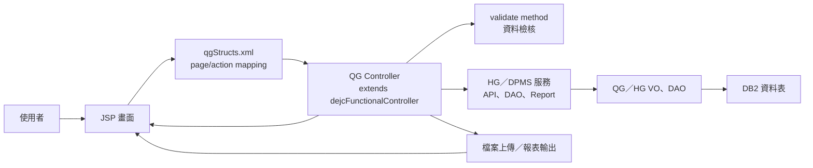

# QG 功能規格手冊

整理日期：2026-08-19  
整理範圍：`D:\CHSBrowser_erp\erpHome\yl.ear\erp.war\qg`  
主要依據：`config/yl/qg/qgStructs.xml`、`jsp/`、`src/com/icsc/qg/controller/`、`src/com/icsc/qg/dao/`

## 1. 系統概述

### 1.1 系統定位

QG 模組為承攬商相關作業前端模組，提供廠商、人員、車輛等基本資料維護，以及承攬商人力需求、工作證、臨時工作證、車輛通行證、安全工作程序、證照與稽查矯正等作業。模組以 JSP 作為使用者介面，透過 `dejcFunctionalController` 進行 action 分派，並以 VO、DAO、跨模組服務完成資料查詢、維護、送審、撤回、列印與附件處理。

### 1.2 使用者與業務對象

- 承攬商：維護廠商自身基本資料、工程協調人、人員與車輛資料。
- 承攬商申請人：建立人力需求、工作證、臨時工作證與車輛通行證申請。
- 審核人員：處理申請審核、核准、退回與驗證。
- 管理人員：維護安全工作程序（SJP）、證照資料與承攬商稽查矯正紀錄。
- 查詢／列印使用者：查詢工作證、車輛通行證、稽查矯正清單並產出報表。

### 1.3 功能範圍

| 功能群組 | 說明 | 主要頁面 |
| --- | --- | --- |
| 基本資料維護 | 廠商、人員、車輛基本資料查詢、新增、修改、刪除與附件／照片上傳。 | `qgjja01Company.jsp`、`qgjja02List.jsp`、`qgjja02Staff.jsp`、`qgjja03List.jsp`、`qgjja03Vehicle.jsp` |
| 申請作業 | 人力需求、工作證、臨時工作證、車輛通行證申請，支援建立、修改、刪除、送出、撤回、列印、上傳。 | `qgjjb01Apply.jsp`、`qgjjb02Apply.jsp`、`qgjjb03Apply.jsp`、`qgjjb04Apply.jsp` |
| 申請明細維護 | 工作證／臨時工作證人員資料與車輛通行證車輛資料維護。 | `qgjjb02Staff.jsp`、`qgjjb03Staff.jsp`、`qgjjb04Vehicle.jsp` |
| 查詢與列印 | 承攬商工作證、車輛通行證、承攬商稽查與矯正查詢及報表下載。 | `qgjjb07List.jsp`、`qgjjb08List.jsp`、`qgjjn01List.jsp` |
| 安全與證照管理 | 安全工作程序（SJP）與證照資料清單查詢及維護。 | `qgjjk01List.jsp`、`qgjjk01Detail.jsp`、`qgjjk02List.jsp`、`qgjjk02Detail.jsp` |
| 稽查矯正 | 承攬商稽查與矯正資料建立、修改、刪除、確認與取消確認。 | `qgjjn01List.jsp`、`qgjjn01Detail.jsp` |

### 1.4 系統特性

- 採用 `qgStructs.xml` 定義 pageID、JSP、controller、action、validate method 與 VO converter。
- 大量功能透過 `com.icsc.hg` 的 API、DAO、controller、report 服務完成後端業務處理，QG 模組扮演承攬商入口與畫面控制層。
- 基本資料與申請作業使用 `zpjcFileUploadEC.getECCustNoForEC(dsCom)` 取得承攬商編號，作為資料查詢與異動的主要範圍條件。
- 列印功能由 HG 報表服務產生報表字串後輸出至 `public` 路徑，前端以 `filePath` 參數提供下載。
- 上傳功能使用檔案代理號、Base64 轉換與跨模組 API 儲存照片或附件。

## 2. 系統架構總覽

### 2.1 程式結構

| 目錄／檔案 | 用途 |
| --- | --- |
| `config/yl/qg/qgStructs.xml` | QG 模組頁面與 action routing 設定。 |
| `jsp/` | 使用者操作畫面、查詢彈窗與主選單。 |
| `src/com/icsc/qg/controller/` | JSP action 對應 controller，負責初始化、驗證、呼叫服務、回填畫面資料。 |
| `src/com/icsc/qg/dao/` | QG 模組 VO／DAO，包含廠商、人員、車輛、申請與代碼資料。 |
| `src/com/icsc/qg/helper/` | 畫面選單、按鈕狀態與特定業務 helper。 |
| `src/com/icsc/qg/tag/` | 自訂 tag，提供下拉選單、遠端證照類別與代碼選取。 |
| `src/com/icsc/qg/tool/` | SQL、VO 轉換、跨模組資料處理工具。 |
| `src/com/icsc/qg/upload/` | Excel 與檔案轉入處理。 |
| `src/com/icsc/qg/sg/` | 訊息或寄送相關程式。 |

### 2.2 執行架構

### 2.3 Action 分派模式

使用者於 JSP 觸發 action flag 後，由 `qgStructs.xml` 對應 controller method。若 action 設定 validate method，系統會先執行檢核，無錯誤後才執行主要 method。

| Action flag | 常見 method | 說明 |
| --- | --- | --- |
| `I` | `query` | 查詢或載入畫面資料。 |
| `C` | `clean` | 清空畫面欄位或建立空白 VO。 |
| `N` | `insert`／`create` | 新增主檔或申請單。 |
| `R` | `update`／`recall` | 依功能不同代表修改或撤回。 |
| `M` | `modify` | 修改申請資料。 |
| `D` | `delete` | 刪除資料或申請單。 |
| `S` | `sent` | 送出申請。 |
| `P` | `print` | 產出報表或列印資料。 |
| `U` | `upload` | 上傳照片、附件或匯入檔案。 |
| `A` | `all` | 申請明細全選或批次處理；設定存在於 XML，但本目錄 controller 未見公開 `all` method。 |
| `CA` | `clearAll` | 清除批次選取。 |
| `CNF` | `confirm` | 稽查矯正資料確認。 |
| `CNL` | `cancel` | 稽查矯正資料取消確認。 |

### 2.4 主要資料表

| 資料表 | VO／DAO | 功能定位 | 主要用途 | 關聯功能 |
| --- | --- | --- | --- | --- |
| `DB.TBQG101` | `qgjctb101VO` | 廠商主檔 | 保存承攬商基本資料，例如廠商編號、名稱、聯絡資訊與異動資訊。 | 廠商基本資料、人力需求申請、申請資料帶入。 |
| `DB.TBHG102` | `qgjctb102VO`、HG `hgjctb102DAO` | 人員主檔 | 保存承攬商人員基本資料、照片／附件資訊與健康檢查等欄位。 | 人員基本資料、工作證申請、臨時工作證申請、人員明細維護。 |
| `DB.TBQG103` | `qgjctb103VO`、HG `hgjctb103DAO` | 車輛主檔 | 保存承攬商車輛基本資料，供車輛資料維護與車輛通行證申請使用。 | 車輛基本資料、車輛通行證申請、車輛資料維護。 |
| `DB.TBQG104` | `qgjctb104VO` | 工程協調人明細 | 保存電子商務廠商工程協調人資料，作為廠商資料的明細資料。 | 廠商基本資料、人力需求申請聯絡資料。 |
| `DB.TBHG201` | `qgjctb201VO`、HG `hgjctb201DAO` | 申請主檔 | 保存各類承攬商申請單主檔、狀態、申請日期、送出／撤回等流程資訊。 | 人力需求申請、工作證申請、臨時工作證申請、車輛通行證申請。 |
| `DB.TBQG202` | `qgjctb202VO`、HG `hgjctb202DAO` | 申請人員明細 | 保存申請單下的人員明細資料，對應申請主檔與人員主檔。 | 工作證申請人員明細、臨時工作證申請人員明細。 |
| `DB.TBQG206` | `qgjctb206VO`、HG `hgjctb206DAO` | 出入證資料 | 保存人員出入證基本資料，供申請或查詢時判斷既有出入證狀態。 | 工作證申請、臨時工作證申請、人員資料檢核。 |
| `DB.TBQG303` | `qgjctb303VO`、HG `hgjctb303DAO` | 人員停權紀錄 | 保存人員停權資料，用於申請時判斷是否具備申請資格。 | 工作證申請、臨時工作證申請、人員明細維護。 |
| `DB.TBQGT0` | `qgjctbt0VO`、`qgjctbt0DAO` | 簡易代碼檔 | 保存 QG 模組代碼資料、代碼名稱、分類與失效日期。 | 下拉選單、代碼轉換、畫面顯示。 |
| `HG.TBHG109` | HG `hgjctb109VO`、`hgjctb109DAO` | 安全工作程序資料 | 保存安全工作程序（SJP）文件資料、文件說明、建立與更新資訊。 | 安全工作程序（SJP）清單與維護。 |
| `HG.TBHG110` | HG `hgjctb110VO`、`hgjctb110DAO` | 證照管理資料 | 保存證照資料、證照類別、附件代理號與備註等資料。 | 證照管理清單與維護。 |
| `HG.TBHG209` | HG `hgjctb209VO`、`hgjctb209DAO` | 稽查矯正資料 | 保存承攬商稽查紀錄、改善內容、附件代理號與確認狀態。 | 承攬商稽查與矯正查詢、維護、確認、取消確認。 |

### 2.5 跨模組依賴

QG controller 常透過 `zpjcWebServiceUtil.callJavaBeanService` 呼叫 HG 或 DPMS 服務：

| 功能 | 主要外部服務 |
| --- | --- |
| 廠商基本資料 | `com.icsc.hg.api.hgjca01CompanyEC` |
| 人員基本資料 | `com.icsc.hg.api.hgjca02StaffEC` |
| 車輛基本資料 | `com.icsc.hg.api.hgjca03VehicleEC` |
| 人力需求申請 | `com.icsc.hg.api.hgjcb01ApplyEC`、`com.icsc.hg.dao.hgjctb201DAO` |
| 工作證申請 | `com.icsc.hg.api.hgjcb02ApplyEC`、`com.icsc.hg.dao.hgjctb201DAO` |
| 臨時工作證申請 | `com.icsc.hg.api.hgjcb03ApplyEC`、`com.icsc.hg.dao.hgjctb201DAO` |
| 車輛通行證申請 | `com.icsc.hg.controller.hgjcb04Apply`、`com.icsc.hg.controller.hgjcb04Vehicle` |
| 工作證／車輛通行證查詢列印 | `com.icsc.hg.rpt.hgjcb07Rpt`、`com.icsc.hg.rpt.hgjcb08Rpt` |
| 安全工作程序 | `com.icsc.hg.controller.hgjck01Detail`、`com.icsc.hg.dao.hgjctb109DAO` |
| 證照管理 | `com.icsc.hg.dao.hgjctb110DAO`、`com.icsc.dpms.de.dejcQueryDAO` |
| 稽查矯正 | `com.icsc.hg.dao.hgjctb209DAO`、`com.icsc.hg.rpt.hgjcn01Rpt` |

## 3. 功能模組詳細說明

### 3.1 廠商基本資料

| 項目 | 內容 |
| --- | --- |
| 頁面 | `qgjja01Company.jsp` |
| Controller | `com.icsc.qg.controller.qgjca01Company` |
| 主要 VO | `qg101`：`qgjctb101VO`、`qg104`：`qgjctb104VO` |
| 支援 action | 查詢、清除、新增、修改、刪除、重新載入廠商資料 |
| 外部服務 | `hgjca01CompanyEC.doQuery101`、`doInsert`、`doUpdate` |

功能說明：提供承攬商基本資料與工程協調人資料維護。進入畫面時以 EC 承攬商編號作為查詢條件，查詢廠商資料及協調人清單；新增或修改時呼叫 HG API 完成資料寫入，並回傳訊息至畫面。

### 3.2 人員基本資料

| 項目 | 清單畫面 | 維護畫面 |
| --- | --- | --- |
| 頁面 | `qgjja02List.jsp` | `qgjja02Staff.jsp` |
| Controller | `qgjca02List` | `qgjca02Staff` |
| 主要 VO | `qgjctb102VO` | `qgjctb102VO` |
| 支援 action | 查詢 | 查詢、清除、新增、修改、刪除、上傳 |
| 外部服務 | `hgjca02StaffEC.doQuery102` | `doQuery102Single`、`doInsert`、`doUpdate`、`doDelete102Single`、`doUpload` |

功能說明：人員清單可依身分證號、姓名與承攬商編號查詢。維護畫面可建立或修改人員資料，並支援照片或附件上傳；上傳時將檔案轉為 Base64 後交由 HG API 保存。

### 3.3 車輛基本資料

| 項目 | 清單畫面 | 維護畫面 |
| --- | --- | --- |
| 頁面 | `qgjja03List.jsp` | `qgjja03Vehicle.jsp` |
| Controller | `qgjca03List` | `qgjca03Vehicle` |
| 主要 VO | `qgjctb103VO` | `qgjctb103VO` |
| 支援 action | 查詢 | 查詢、清除、新增、修改、刪除 |
| 外部服務 | `hgjca03VehicleEC.doQuery` | `doQuery103Single`、`doInsert`、`doUpdate`、`doDelete103Single` |

功能說明：提供承攬商車輛資料查詢與維護。清單以車主姓名、車號及承攬商編號查詢；維護畫面可管理單筆車輛主檔資料。

### 3.4 承攬商人力需求申請作業

| 項目 | 內容 |
| --- | --- |
| 頁面 | `qgjjb01Apply.jsp` |
| Controller | `com.icsc.qg.controller.qgjcb01Apply` |
| 主要 VO | `qgjctb201VO`、`qgjctb101VO`、`qgjctb104VO` |
| 支援 action | 查詢、建立、修改、刪除、送出、撤回、列印、上傳 |
| 驗證 method | `create_validate`、`modify_validate`、`delete_validate`、`sent_validate`、`recall_validate`、`print_validate`、`upload_validate` |
| 外部服務 | `hgjcb01ApplyEC`、`hgjcToolEC`、`hgjctb201DAO` |

功能說明：處理承攬商人力需求申請主檔。送出前會檢核申請資料狀態、員工編號、採購／工程案號等條件；送出後由 HG API 進入後續申請流程。撤回、刪除與修改皆會先檢查既有資料狀態是否允許操作。

### 3.5 承攬商工作證申請作業

| 項目 | 申請主檔 | 人員明細 |
| --- | --- | --- |
| 頁面 | `qgjjb02Apply.jsp` | `qgjjb02Staff.jsp` |
| Controller | `qgjcb02Apply` | `qgjcb02Staff` |
| 主要 VO | `hgjctb201VO`、`hgjctb102VO` | `hgjctb102VO`、`hgjctb202VO`、`hgjctb303VO` |
| 支援 action | 查詢、建立、修改、刪除、送出、撤回、列印、上傳、清除全選 | 查詢、修改、上傳 |
| 外部服務 | `hgjcb02ApplyEC`、`hgjctb201DAO` | `hgjcb02StaffEC`、`hgjctb102DAO`、`hgjctb202DAO` |

功能說明：承攬商建立工作證申請主檔後，可維護人員明細資料。系統支援依排程日期查詢申請資料、檢核人員是否存在、更新人員資料與上傳證件或照片。送出、撤回、列印等行為交由 HG API 執行。

注意事項：`qgStructs.xml` 設定 `A:all/all_validate`，但本目錄 `qgjcb02Apply.java` 未見公開 `all` 或 `all_validate` method，需確認是否由舊版或父類別提供。

### 3.6 臨時工作證申請作業

| 項目 | 申請主檔 | 人員明細 |
| --- | --- | --- |
| 頁面 | `qgjjb03Apply.jsp` | `qgjjb03Staff.jsp` |
| Controller | `qgjcb03Apply` | `qgjcb03Staff` |
| 主要 VO | `hgjctb201VO`、`hgjctb102VO` | `hgjctb102VO`、`hgjctb202VO` |
| 支援 action | 查詢、建立、修改、刪除、送出、撤回、列印、上傳、清除全選 | 查詢、修改、上傳 |
| 外部服務 | `hgjcb03ApplyEC`、`hgjctb201DAO` | `hgjcb03StaffEC`、HG 人員／明細／出入證／停權 DAO |

功能說明：臨時工作證申請流程與工作證申請相近，但以臨時入廠需求為主要情境。人員明細維護會讀取人員基本資料、申請明細、出入證與停權紀錄，用於判斷是否可申請或更新。

注意事項：XML 設定 `qgjjb03Copy.jsp` 與 `com.icsc.hg.controller.qgjcb03Copy`，但本 QG 目錄未見對應 JSP／controller，需確認部署來源是否在 HG 模組或已停用。

### 3.7 車輛通行證申請作業

| 項目 | 申請主檔 | 車輛明細 |
| --- | --- | --- |
| 頁面 | `qgjjb04Apply.jsp` | `qgjjb04Vehicle.jsp` |
| Controller | `qgjcb04Apply` | `qgjcb04Vehicle` |
| 主要 VO | `hgjctb201VO`、`hgjctb103VO` | `hgjctb103VO`、`hgjctb203VO` |
| 支援 action | 查詢、建立、修改、刪除、送出、撤回、列印、上傳 | 查詢、修改 |
| 外部服務 | `hgjcb04Apply`、`hgjcToolEC`、`hgjctb103DAO`、`hgjctb201DAO`、`hgjctb203DAO` | `hgjcb04Vehicle` |

功能說明：提供承攬商車輛通行證申請。主檔處理申請資料與流程狀態，車輛明細處理車輛資料與通行證資料。送出前會檢核申請主檔狀態、車輛資料與既有通行資料是否允許。

### 3.8 工作證與車輛通行證查詢作業

| 項目 | 工作證查詢 | 車輛通行證查詢 |
| --- | --- | --- |
| 頁面 | `qgjjb07List.jsp` | `qgjjb08List.jsp` |
| Controller | `qgjcb07List` | `qgjcb08List` |
| 支援 action | 查詢、列印 | 查詢、列印 |
| 報表服務 | `com.icsc.hg.rpt.hgjcb07Rpt.printEC` | `com.icsc.hg.rpt.hgjcb08Rpt.printEC` |

功能說明：提供已申請或已核發工作證、車輛通行證資料查詢。列印時先執行查詢組出 SQL，再呼叫 HG 報表服務產生報表檔案，並將下載路徑回填至畫面。

### 3.9 安全工作程序（SJP）作業管理

| 項目 | 清單畫面 | 維護畫面 |
| --- | --- | --- |
| 頁面 | `qgjjk01List.jsp` | `qgjjk01Detail.jsp` |
| Controller | `qgjck01List` | `qgjck01Detail` |
| 主要 VO | `hgjctb109VO` | `hgjctb109VO` |
| 支援 action | 查詢 | 查詢、清除、新增、修改、刪除 |
| 外部服務 | SQL 查詢 | `hgjck01Detail`、`hgjctb109DAO` |

功能說明：管理安全工作程序資料。清單會查詢 SJP 編號、文件說明、建立／修改日期等欄位，並計算是否達到需更新條件；維護畫面可新增、修改、刪除及檢核資料。

### 3.10 證照管理作業

| 項目 | 清單畫面 | 維護畫面 |
| --- | --- | --- |
| 頁面 | `qgjjk02List.jsp` | `qgjjk02Detail.jsp` |
| Controller | `qgjck02List` | `qgjck02Detail` |
| 主要 VO | `hgjctb110VO` | `hgjctb110VO` |
| 支援 action | 查詢 | 查詢、清除、新增、修改、刪除 |
| 外部服務 | SQL 查詢 | `hgjctb110DAO`、`dejcQueryDAO` |

功能說明：維護承攬商或人員相關證照資料。維護畫面可處理證照資料新增、修改、刪除、附件代理號檢查與備註全形轉換。

### 3.11 承攬商稽查與矯正作業

| 項目 | 清單畫面 | 維護畫面 |
| --- | --- | --- |
| 頁面 | `qgjjn01List.jsp` | `qgjjn01Detail.jsp` |
| Controller | `qgjcn01List` | `qgjcn01Detail` |
| 主要 VO | 查詢 SQL | `hgjctb209VO` |
| 支援 action | 查詢、列印 | 查詢、清除、新增、修改、刪除、確認、取消確認 |
| 外部服務 | `hgjcn01Rpt.printEC` | `hgjctb209DAO`、`hgjcn01Detail.insertEC` |

功能說明：管理承攬商稽查與矯正紀錄。清單支援查詢與列印；維護畫面可建立稽查資料、紀錄矯正內容、確認完成或取消確認。系統會檢核必要附件，例如稽查單或改善單附件是否已上傳。

### 3.12 設定存在但本目錄未完整提供的功能

| PageID | XML 設定 | 本目錄觀察 |
| --- | --- | --- |
| `qgjjb02Copy` | `qgjjb02Copy.jsp`、`com.icsc.qg.controller.qgjcb02Copy` | `jsp/` 與 `controller/` 未見對應檔案。 |
| `qgjjb03Copy` | `qgjjb03Copy.jsp`、`com.icsc.hg.controller.qgjcb03Copy` | QG 目錄未見 JSP；controller 指向 HG package。 |
| `qgjjb01B` | `qgjjb01Approve.jsp`、`com.icsc.hg.controller.qgjcb01Approve` | QG 目錄未見 JSP；controller 指向 HG package。 |

建議後續確認上述功能是否由 HG 模組提供、部署時另行打包，或屬於歷史設定殘留。若實際選單仍會導向這些 pageID，需補齊部署來源或調整 routing。

## 附錄 A. 來源檔案對照

| 類型 | 檔案 |
| --- | --- |
| 頁面設定 | `config/yl/qg/qgStructs.xml` |
| 基本資料 controller | `qgjca01Company.java`、`qgjca02List.java`、`qgjca02Staff.java`、`qgjca03List.java`、`qgjca03Vehicle.java` |
| 申請 controller | `qgjcb01Apply.java`、`qgjcb02Apply.java`、`qgjcb02Staff.java`、`qgjcb03Apply.java`、`qgjcb03Staff.java`、`qgjcb04Apply.java`、`qgjcb04Vehicle.java` |
| 查詢／報表 controller | `qgjcb07List.java`、`qgjcb08List.java`、`qgjcn01List.java` |
| 安全／證照／稽查 controller | `qgjck01List.java`、`qgjck01Detail.java`、`qgjck02List.java`、`qgjck02Detail.java`、`qgjcn01Detail.java` |
| QG DAO／VO | `qgjctb101VO.java`、`qgjctb102VO.java`、`qgjctb103VO.java`、`qgjctb104VO.java`、`qgjctb201VO.java`、`qgjctb202VO.java`、`qgjctb206VO.java`、`qgjctb303VO.java`、`qgjctbt0DAO.java`、`qgjctbt0VO.java` |
