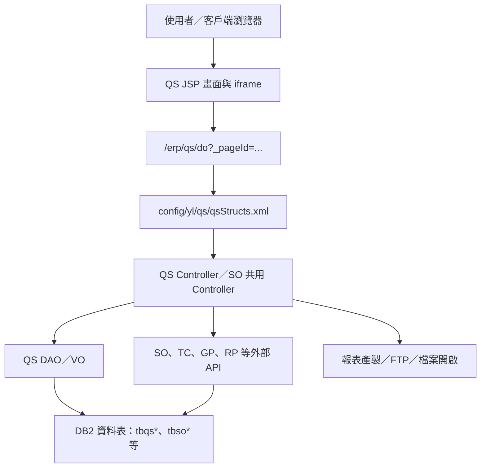

# QS 電子訂購系統功能規格手冊

整理日期：2026-08-19  
整理範圍：`D:\CHSBrowser_erp\erpHome\yl.ear\erp.war\qs`

## 1. 系統概述

### 1.1 系統定位

`QS` 模組為中鴻鋼鐵 ERP 中的電子訂購系統，主要提供客戶或業務端進行訂單查詢、訂單輸入、訂單明細維護、客戶電子訂購設定、訂購期間限制與訂購相關報表產製。系統與既有 `SO` 銷售訂單、客戶、合約與報價資料高度整合，並以 `QS` 自有資料表保存電子訂購專屬設定、訂單明細、問卷調查與操作紀錄。

### 1.2 使用對象

- 客戶端使用者：查詢可訂購資料、輸入訂單明細、確認訂購內容、下載或產製相關報表。
- 業務或管理人員：維護客戶電子訂購設定、設定訂購期間限制、查詢訂單進度、協助批次確認與報表產製。
- 系統管理或維護人員：維護國別港口、產品別、銷售類別、訂購規則、報表設定與介接資料。

### 1.3 系統目標

- 將電子訂購流程集中在 `QS` 模組中處理，降低紙本或人工往返作業。
- 依產品別、銷售別、月份、版本與客戶設定控制可訂購期間與資料可見範圍。
- 透過 `SO` 既有訂單、品項、合約、報價與客戶資料作為訂購依據，避免重複建檔。
- 提供報表產製與檔案下載能力，支援客戶通知、訂購確認、郵寄與內部管理。

### 1.4 主要功能範圍

- 電子訂購首頁與功能選單。
- 訂單主檔與品項明細輸入、修改、刪除、複製、結案、取消、退回與列印。
- 訂單查詢、模糊查詢、明細查詢與批次確認。
- 客戶電子訂購基本設定。
- 客戶訂購期間限制設定與批次新增。
- 國別港口等基礎資料維護。
- 電子訂購意見調查。
- 報表參數輸入、報表產製、FTP 或檔案開啟。
- 與 `SO`、`TC`、`GP`、`RP`、`IP`、`SE` 等模組資料介接。

### 1.5 主要資料表

| 類別 | 資料表 | 用途 |
| --- | --- | --- |
| QS 記錄 | `db.tbqs00` | 電子訂購登入或操作紀錄，含登入者、時間、來源、訂單與操作代碼。 |
| QS 基礎 | `db.tbqs01` | 國別與目的港等基本資料維護。 |
| QS 訂單 | `db.TBqsORDER`、`db.tbqsorder01`、`db.TBqsITEM` | 電子訂購主檔、訂單補充資料與品項明細。 |
| QS 客戶 | `db.tbqscust03` | 客戶電子訂購設定，含聯絡人、Email、適用品種、業務與主管設定。 |
| QS 限制 | `db.tbqscust04` | 客戶訂購期間限制，依客戶、銷售類別、內外銷、月份與版本設定起迄日。 |
| QS 調查 | `db.tbqsinvestigate` | 客戶滿意度或訂購意見調查資料。 |
| QS 規則 | `db.tbqsRule` | 判定或訂購相關規則設定。 |
| SO 來源 | `db.TBSOORDER`、`db.tbsoorder01`、`db.TBsoITEM`、`db.tbsoinvestigate` | 銷售訂單、訂單項次與調查資料來源或對照。 |
| 其他介接 | `db.tbrp0020`、`db.TBSRPDEF`、`db.tbiprd`、`db.tbse02`、`db.tbpo01`、`db.tbpo02` | 報表、代碼、排程或相關外部資料介接。 |

## 2. 系統架構總覽

### 2.1 技術架構

系統採用傳統 Java Web 架構，前端以 `JSP`、iframe、JavaScript 與 DPMS 共用標頭／頁尾組成；後端以 `com.icsc.dpms.de.structs` 的 page-controller 設定與 `dejcFunctionalController` 控制器處理表單動作；資料存取以 DAO／VO 模式封裝資料表，另有通用 DAO 與外部 API 類別負責跨模組查詢與更新。

### 2.2 目錄與元件分層

| 目錄 | 內容 | 說明 |
| --- | --- | --- |
| `config/yl/qs/qsStructs.xml` | page-controller-action-VO mapping | 定義 `_pageId` 對應 JSP、controller、action flag、method 與 valueObject。 |
| `jsp/` | 使用者畫面 | 首頁、選單、訂單畫面、查詢、客戶設定、限制設定與報表參數頁。 |
| `src/com/icsc/qs/` | Java 後端 | `QS` 自有 controller、DAO、VO、API、通用資料處理與 servlet 介面。 |
| `src/com/icsc/qs/quata/` | 額度相關例外與定義 | 訂購額度或數量不足等例外類別。 |
| `dao/` | DAO 產生設定 | `tbqs00`、`tbqs01`、`tbqscust03`、`tbqscust04` 對應 DAO 產生描述。 |
| `html/` | 使用手冊與共用 JavaScript | 既有使用手冊 PDF／DOC、AJAX 與列表操作腳本。 |
| `xml/dr/` | 報表 XML | 報表格式或報表參數相關設定。 |
| `files/`、`jws/` | 憑證／Web Service 相關檔案 | 訂購憑證頁與 `qsjw001.jws` 測試或介接服務。 |

### 2.3 Page Controller 架構

`qsStructs.xml` 為本模組主要流程設定。畫面送出時透過 `_pageId` 找到 controller，再依 `_action` 找到 method 執行。

| 功能群 | Page ID | Controller | 主要動作 |
| --- | --- | --- | --- |
| 國別港口維護 | `qsjjyl01Edit` | `com.icsc.qs.qsjc01CR` | 查詢、新增、修改、刪除。 |
| 客戶電子訂購設定 | `qsjjylcust01Edit`、`qsjjylcust01List` | `com.icsc.qs.qsjcylcust01CR` | 查詢、新增、修改、刪除、停用／特殊刪除。 |
| 客戶訂購期間限制 | `qsjjylcust04Edit`、`qsjjylcust04List` | `com.icsc.qs.qsjcylcust04CR` | 查詢、新增、修改、刪除、批次新增。 |
| 訂單明細查詢 | `qsjjyl02ListDetail` | `com.icsc.qs.qsjcYL11` | 複製訂單明細。 |
| 訂單批次確認 | `qsjjyl02BatchConfirm` | `com.icsc.qs.qsjcYL11` | 批次確認。 |
| 報表產製 | `qsjjylgenRpt01` | `com.icsc.qs.qsjcYL11` | 報表產製。 |
| 客戶意見調查 | `qsjjyl0201i` | `com.icsc.qs.qsjcAPI02` | 檢查訂單、建立調查資料。 |
| SO 共用基礎資料 | `sojj*` | `com.icsc.so.*` | 報價規則、計畫、客戶、合約、說明、備註與銷售訂單共用維護。 |

### 2.4 後端類別職責

| 類別 | 職責 |
| --- | --- |
| `qsjcyl02` | 電子訂購主流程 servlet 型處理類，負責訂單主檔與明細的查詢、新增、複製、修改、結案、取消、退回、刪除與列印檢視。 |
| `qsjcYL11` | 訂單查詢、明細複製、批次確認與報表產製 controller。 |
| `qsjcAPI01` | 對外或跨模組查詢 API，提供訂單、品項、合約、月份、FOB、佣金運費、出貨量與產線狀態等查詢／更新。 |
| `qsjcAPI02` | 客戶意見調查相關 controller，負責檢核訂單與建立調查資料。 |
| `qsjcComDAO` | 通用資料維護 DAO，支援依資料表、PK、SQL 與命令執行新增、修改、刪除與查詢。 |
| `qsjcItemDAO`、`qsjcOrderDAO` | 電子訂購品項與主檔資料存取。 |
| `qsjcylcust01CR` | 客戶電子訂購設定維護。 |
| `qsjcylcust04CR` | 客戶訂購期間限制維護與批次新增。 |
| `qsjc01CR` | 國別港口資料維護。 |
| `qsjcSelecter`、`qsjcComTB`、`qsjcComCMD` | 共用查詢、資料表物件與命令輔助。 |
| `qsjcyl02Trans`、`qsjcylThreadRunForIpcodeTrans` | 訂購資料轉換與背景更新輔助。 |

### 2.5 外部介接

- `SO` 銷售訂單：查詢 `TBSOORDER`、`TBsoITEM`、合約、客戶、報價與報表參數，並透過 `sojcOutApiQS` 取得訂購畫面與報表所需資料。
- `TC` 憑證資料：`files/qsjjtcCert*.jsp` 呼叫 `tcjcOutApiQS` 查詢憑證資料。
- `GP` 客戶選取：多個 JSP 開啟 `gpjsComCtrl` 或自有客戶選擇頁，支援客戶代號挑選。
- `RP` 報表：使用 `rptCode` 與報表參數產製檔案，並依設定提供 FTP 或開啟檔案。
- `IP`／`SE` 資料轉換：背景處理中可由 `tbiprd` 對應資料更新 `tbse02` 相關欄位。

### 2.6 權限與操作控制

畫面多以 `_AppId` 作為權限與記錄識別，並透過 `dsjcagc.check` 檢查 `INQUIRE`、`INSERT`、`UPDATE`、`DELETE` 等權限。訂單畫面依產品別與銷售別切換不同 `_AppId`，例如 `QSJJORDER_H`、`QSJJORDER_H1`、`QSJJORDER_C`、`QSJJORDER_C1`、`QSJJORDER_G`、`QSJJORDER_G1`，用於區分熱軋、冷軋、鍍鋅及內外銷訂購作業權限。

## 3. 功能模組詳細說明

### 3.1 首頁與功能選單

#### 功能目的

提供電子訂購系統入口、訊息區、功能分類選單、報表選單與使用手冊連結。

#### 主要程式

- `jsp/qsjjHome.jsp`
- `jsp/qsjjHomeMenu.jsp`
- `jsp/qsjjHomeMenu01.jsp`
- `jsp/qsjjHomeMenu02.jsp`
- `jsp/qsjjHomeMenu03.jsp`
- `jsp/qsjjHomeMenu04.jsp`
- `jsp/qsjjHomeUb.jsp`

#### 功能說明

- 顯示使用者可操作的訂購功能與報表項目。
- 依權限顯示可進入的訂購、查詢、報表或維護功能。
- 提供使用手冊 PDF 開啟連結，包含內銷版與外銷版。
- 報表選單可依 `rptCode` 開啟報表參數頁。

### 3.2 電子訂購作業

#### 功能目的

提供使用者依產品別與銷售別建立或維護電子訂購資料，包含訂單主檔、訂單明細與品項規格。

#### 主要程式

- `jsp/qsjjOrder.jsp`
- `jsp/qsjjOrderHD.jsp`、`qsjjOrderHF.jsp`
- `jsp/qsjjOrderCD.jsp`、`qsjjOrderCF.jsp`
- `jsp/qsjjOrderGD.jsp`、`qsjjOrderGF.jsp`
- `jsp/qsjjyl0201Edit.jsp`、`qsjjyl0201Edit01.jsp`、`qsjjyl0201Edit02.jsp`
- `jsp/qsjjyl0202Edit.jsp`、`qsjjyl0202Edit01.jsp`、`qsjjyl0202Edit02.jsp`
- `src/com/icsc/qs/qsjcyl02.java`

#### 作業條件

- 產品別以 `saleTypeNo` 區分，程式中可見 `H`、`C`、`G` 等類別。
- 銷售別以 `saleType` 區分，程式中常見 `D` 與 `F`，部分設定頁另見 `E`。
- 訂購月份、版本、客戶、工廠、合約與訂單狀態會影響可查詢與可修改資料。

#### 主要流程

1. 使用者進入 `qsjjOrder.jsp` 或特定產品／銷售別頁。
2. 系統依 `saleTypeNo` 與 `saleType` 決定 `_AppId` 與主要 iframe。
3. 主檔頁載入 `qsjjyl0201Edit*`，明細清單載入 `qsjjyl0202List.jsp`，明細編輯載入 `qsjjyl0202Edit*`。
4. 使用者可查詢既有訂單，或建立／修改訂購主檔與品項明細。
5. 後端由 `qsjcyl02` 執行 `queryProcess01`、`insertProcess01`、`copyProcess01`、`updateProcess01`、`closeProcess01`、`cancelProcess01`、`deleteProcess01` 等主檔流程。
6. 明細由 `queryProcess02`、`insertProcess02`、`updateProcess02`、`changeProcess02`、`deleteProcess02`、`closeProcess02`、`cancelProcess02`、`rollBackProcess02` 等流程處理。
7. 必要時執行 `printView` 顯示列印畫面。

#### 主要資料

- 訂單主檔：`db.TBqsORDER`
- 訂單明細：`db.TBqsITEM`
- SO 來源訂單：`db.TBSOORDER`、`db.TBsoITEM`
- 客戶限制：`db.tbqscust04`
- 客戶設定：`db.tbqscust03`

#### 控制規則

- 新增前會執行 `beforeInsert`，檢查資料完整性、訂購期間、訂單狀態與相關限制。
- 修改前會執行 `beforeUpdate`，避免狀態不允許時被異動。
- 刪除前會執行 `beforeDelete`，確認可刪除條件。
- 完成後透過 `afterInsert`、`afterUpdate`、`afterDelete` 處理後續資料同步或狀態更新。

### 3.3 訂單查詢與明細查詢

#### 功能目的

提供依訂購月份、產品別、銷售別、客戶、訂單號碼等條件查詢訂單與明細，並可從查詢結果帶回訂單編輯畫面。

#### 主要程式

- `jsp/qsjjyl02Popup.jsp`
- `jsp/qsjjyl02Search.jsp`
- `jsp/qsjjyl02List.jsp`
- `jsp/qsjjyl02List1.jsp`
- `jsp/qsjjyl02ListDetail.jsp`
- `src/com/icsc/qs/qsjcYL11.java`

#### 功能說明

- `qsjjyl02Popup.jsp` 作為查詢彈窗外框。
- `qsjjyl02Search.jsp` 提供查詢條件輸入。
- `qsjjyl02List.jsp` 與 `qsjjyl02List1.jsp` 依銷售別與查詢條件列出訂單。
- `qsjjyl02ListDetail.jsp` 顯示訂單明細，並支援明細複製。
- `qsjcYL11.copy` 可將明細資料帶入後續訂購編輯流程。

### 3.4 訂單批次確認

#### 功能目的

提供批次確認訂購資料的作業畫面，降低逐筆確認成本。

#### 主要程式

- `jsp/qsjjyl02batchConfirm.jsp`
- `config/yl/qs/qsStructs.xml` pageID：`qsjjyl02BatchConfirm`
- `src/com/icsc/qs/qsjcYL11.java`

#### 功能說明

- 畫面列出待確認資料，使用者勾選後送出。
- controller action `BC` 對應 `batchConfirm`。
- `batchConfirm` 依畫面傳入清單逐筆處理確認狀態與相關訊息。

### 3.5 客戶電子訂購設定

#### 功能目的

維護哪些客戶可使用電子訂購，以及客戶聯絡人、通知 Email、適用品種、負責業務與主管等資料。

#### 主要程式

- `jsp/qsjjylcust01.jsp`
- `jsp/qsjjylcust01List.jsp`
- `jsp/qsjjylcust01Edit.jsp`
- `src/com/icsc/qs/qsjcylcust01CR.java`
- `src/com/icsc/qs/qsjcylcust03DAO.java`
- `src/com/icsc/qs/qsjcylcust03VO.java`

#### 主要資料表

- `db.tbqscust03`

#### 欄位重點

- 公司別、客戶代號、客戶名稱。
- 聯絡人 A／B 與 Email A／B。
- 適用產品：`forProductH`、`forProductC`、`forProductG`。
- 負責業務、業務主管、代理人。
- 狀態、建立人員、建立日期、更新人員、更新日期。

#### 主要動作

| 動作 | 說明 |
| --- | --- |
| 查詢 | 依客戶條件查詢既有設定。 |
| 新增 | 建立客戶電子訂購設定。 |
| 修改 | 更新聯絡人、Email、適用品種與業務設定。 |
| 刪除 | 移除或停用客戶電子訂購設定。 |
| 特殊刪除 `D1` | 程式保留另一組刪除／停用流程，實際用途需依作業規範確認。 |

### 3.6 客戶訂購期間限制設定

#### 功能目的

依客戶、銷售類別、銷售別、訂購月份與版本設定可下單起迄日，控制客戶在特定期間內才可進行電子訂購。

#### 主要程式

- `jsp/qsjjylcust04.jsp`
- `jsp/qsjjylcust04List.jsp`
- `jsp/qsjjylcust04Edit.jsp`
- `jsp/qsjjylcust04Ins.jsp`
- `jsp/qsjjylcust04Popup.jsp`
- `src/com/icsc/qs/qsjcylcust04CR.java`
- `src/com/icsc/qs/qsjcylcust04DAO.java`
- `src/com/icsc/qs/qsjcylcust04VO.java`

#### 主要資料表

- `db.tbqscust04`

#### 欄位重點

- 客戶代號、銷售類別、銷售別、訂購月份、版本。
- 訂購開始日、訂購結束日。
- 建立人員、建立日期、更新人員、更新日期。

#### 主要動作

| 動作 | 說明 |
| --- | --- |
| 查詢 | 依訂購月份、客戶或業務查詢限制資料。 |
| 新增 | 建立單筆訂購期間限制。 |
| 修改 | 調整起迄日期、版本或相關條件。 |
| 刪除 | 移除限制設定。 |
| 批次新增 | 透過 `qsjjylcust04Ins.jsp` 選取多筆資料後，由 `addBatch` 建立限制設定。 |

#### 規則說明

`qsjcylcust04DAO.checkOrderPeriod` 會依銷售類別、銷售別、訂購月份、客戶與版本檢查目前日期是否落在可訂購期間。若找不到客戶專屬設定，程式會再查詢客戶空白的共用設定作為備援。

### 3.7 國別港口基本資料維護

#### 功能目的

維護電子訂購相關國別與目的港資料，提供訂單輸入或查詢時選用。

#### 主要程式

- `jsp/qsjj01.jsp`
- `jsp/qsjj01List.jsp`
- `jsp/qsjj01Popup.jsp`
- `jsp/qsjj01Search.jsp`
- `jsp/qsjjyl01Edit.jsp`
- `jsp/qsjjyl0101List.jsp`
- `src/com/icsc/qs/qsjc01CR.java`
- `src/com/icsc/qs/qsjc01DAO.java`
- `src/com/icsc/qs/qsjc01VO.java`

#### 主要資料表

- `db.tbqs01`

#### 主要欄位

- 公司別、國別代碼、目的港、國別名稱、維護人員、維護日期、維護時間。

#### 主要動作

- 查詢：依國別或目的港查詢。
- 新增：建立國別港口資料。
- 修改：更新國別名稱或港口資料。
- 刪除：移除不再使用的資料。

### 3.8 客戶意見調查

#### 功能目的

在電子訂購流程中蒐集客戶對服務、尺寸、品質、交期與改善建議等意見。

#### 主要程式

- `jsp/qsjjyl02investigate.jsp`
- `config/yl/qs/qsStructs.xml` pageID：`qsjjyl0201i`
- `src/com/icsc/qs/qsjcAPI02.java`
- `src/com/icsc/qs/qsjcinvestDAO.java`
- `src/com/icsc/qs/qsjcinvestVO.java`

#### 主要資料表

- `db.tbqsinvestigate`

#### 欄位重點

- 客戶代號、訂購月份、產品別、訂單號碼。
- 服務、尺寸、品質、交期評分或代碼。
- 改善建議、建立日期。

#### 主要動作

- `chkP`：檢查訂單或調查資料是否可建立。
- `createInvest`：建立調查資料。

### 3.9 報表產製與下載

#### 功能目的

依報表代號與輸入參數產製電子訂購相關報表，並提供 FTP 或瀏覽器開啟檔案。

#### 主要程式

- `jsp/qsjjHomeMenu02.jsp`
- `jsp/qsjjylgenRptPopup01.jsp`
- `jsp/qsjjylgenRpt01.jsp`
- `src/com/icsc/qs/qsjcYL11.java`
- `xml/dr/qsjr001.xml`
- `xml/dr/qsjr002.xml`
- `xml/dr/B0R00190_1.xml`

#### 報表入口

系統可從選單傳入 `rptCode` 開啟報表參數頁。程式中可見報表代號包含：

- `B0R00060`
- `B0R00070`
- `B0R00180`
- `B0R00190`

#### 主要流程

1. 使用者從首頁或選單選擇報表。
2. 系統開啟 `qsjjylgenRptPopup01.jsp`，並帶入 `rptCode`、`txtFunc`、`ftp`。
3. `qsjjylgenRpt01.jsp` 輸入或帶入客戶、訂購日期、訂購月份、Email 與格式等參數。
4. 後端呼叫 `sojcOutApiQS.genRptPara` 取得報表參數與 JavaScript 控制字串。
5. 由 `qsjcYL11.genRpt1` 執行報表產製。
6. 產製完成後依設定開啟檔案或透過 FTP 處理。

### 3.10 憑證查詢與 Web Service 測試

#### 功能目的

提供訂購相關憑證查詢與 Web Service 測試入口，支援外部憑證或訂購服務整合。

#### 主要程式

- `files/qsjjtcCert.jsp`
- `files/qsjjtcCertVer.jsp`
- `files/qsjjtccert01.jsp`
- `jws/qsjw001.jws`
- `jsp/qstestWS.jsp`
- `jsp/qsjjTestWs.jsp`
- `jsp/qsjjTestWs2.jsp`

#### 功能說明

- 憑證頁透過 `tcjcOutApiQS.qryCertByNo` 查詢憑證資料。
- 測試頁可連到 `/erp/qs/jws/qsjw001.jws` 驗證服務呼叫。
- 此區偏向輔助功能，正式交易仍以電子訂購與報表流程為主。

### 3.11 共用 SO 基礎資料與交易維護

#### 功能目的

`QS` 模組設定檔中納入多個 `SO` 共用頁面，供電子訂購流程使用報價規則、計畫、客戶、合約、說明與備註等基礎資料。

#### Page 範圍

- 報價與規則：`sojjPriceTypeSetup`、`sojjRuleSetup`、`sojjPlanTypeSetup`、`sojjCustTypeSetup`
- 計畫維護：`sojjPlanTypeEdit`、`sojjPlanEdit`、`sojjPlanDetail`
- 客戶資料：`sojjCustEdit`、`sojjCustDetailEdit`、`sojjCustSpecEdit`、`sojjCustTypeEdit`
- 訂單與明細：`sojjyl10List`、`sojjyl10Main`、`sojjyl10Edit`、`sojjyl11List`
- 合約資料：`sojjCntrctEdit`、`sojjCntrctDetailEdit`
- 訂單生效：`sojjyl09List`
- 說明與備註：`sojjDescEdit`、`sojjRemarkEdit`

#### 說明

這些頁面 controller 位於 `com.icsc.so.*`，不是 `QS` 自有實作，但被登錄在 `config/yl/qs/qsStructs.xml` 中，代表 `QS` 交易會直接重用 `SO` 的基礎資料與交易能力。文件維護時應將其視為 `QS` 的依賴模組，而非完全獨立功能。

### 3.12 共用查詢與 AJAX 輔助

#### 功能目的

提供客戶選取、模糊查詢、列表操作與 AJAX 回傳，支援訂單與維護畫面的互動需求。

#### 主要程式

- `jsp/qsjjAJAX.jsp`
- `jsp/qsjjComSel.jsp`
- `jsp/qsjjComCustSel.jsp`
- `jsp/qsjjyl93FuzQry.jsp`
- `jsp/qsjjyl94FuzQry.jsp`
- `jsp/qsjjyl95FuzQry.jsp`
- `html/qsjtAJAX.jss`
- `html/qsjtListCom.jss`
- `html/qs/qsjtAJAX.jss`

#### 功能說明

- `qsjjComSel.jsp` 與 `qsjjComCustSel.jsp` 提供客戶或公司資料選取。
- `qsjjyl93FuzQry.jsp`、`qsjjyl94FuzQry.jsp`、`qsjjyl95FuzQry.jsp` 提供模糊查詢支援。
- `qsjjAJAX.jsp` 接收 controller 回傳資料，配合前端 JavaScript 更新欄位。
- `qsjtListCom.jss` 提供全選、判斷是否選取、查詢單筆、新增、查詢等列表共用操作。

### 3.13 批次與資料轉換輔助

#### 功能目的

支援訂購資料轉換、背景處理與跨資料表更新。

#### 主要程式

- `src/com/icsc/qs/qsjcyl02Trans.java`
- `src/com/icsc/qs/qsjcylThreadRunForIpcodeTrans.java`
- `src/com/icsc/qs/qsjcGenSerNo.java`

#### 功能說明

- `qsjcyl02Trans` 處理訂購流程中的資料轉換或更新。
- `qsjcylThreadRunForIpcodeTrans` 具備背景執行介面，會查詢 `db.tbiprd` 並更新 `db.tbse02` 相關資料。
- `qsjcGenSerNo` 提供流水號產生輔助。

### 3.14 例外處理與額度限制

#### 功能目的

提供訂購額度或數量限制相關例外，讓訂購流程能區分不同失敗原因。

#### 主要程式

- `src/com/icsc/qs/quata/qsjiQuataTypeDef.java`
- `src/com/icsc/qs/quata/qsjcQuataNotFoundException.java`
- `src/com/icsc/qs/quata/qsjcQuataNoLimitException.java`
- `src/com/icsc/qs/quata/qsjcNotSufficientAmountException.java`
- `src/com/icsc/qs/quata/NotSufficientAmountException.java`

#### 功能說明

- 額度類別定義：區分訂購額度或限制檢核類型。
- 額度不存在：查無可用額度設定時回報。
- 無限制：可明確表示該訂購情境不受額度限制。
- 數量不足：訂購量超過可用量時回報。

### 3.15 操作紀錄

#### 功能目的

保存電子訂購登入或操作軌跡，供稽核、查詢或異常追蹤使用。

#### 主要程式

- `src/com/icsc/qs/qsjc00DAO.java`
- `src/com/icsc/qs/qsjc00VO.java`

#### 主要資料表

- `db.tbqs00`

#### 欄位重點

- 流水號、登入帳號、登入日期、登入時間、登入來源位址。
- 訂單號碼、項次、操作目標、操作代碼。

### 3.16 主要狀態與作業控制摘要

| 控制項 | 說明 |
| --- | --- |
| `_AppId` | 權限、記錄與功能識別。不同產品與銷售別會切換不同 `_AppId`。 |
| `_pageId` | 對應 `qsStructs.xml` 的 page 定義，用於找到 controller 與 JSP。 |
| `_action` | 對應 action flag，例如 `I` 查詢、`N` 新增、`R` 修改、`D` 刪除、`BC` 批次確認、`GP1` 報表產製。 |
| `saleTypeNo` | 產品或工廠類別，例如 `H`、`C`、`G`。 |
| `saleType` | 銷售別或內外銷別，例如 `D`、`F`，限制設定中另可見 `E`。 |
| `dispMonth` | 訂購或交期月份，是查詢、報表與期間限制的重要條件。 |
| `version` | 訂購版本，會參與期間限制與訂單查詢。 |
| `status` | 訂單或明細狀態，控制是否可修改、刪除、結案、取消或退回。 |

## 附錄：本次整理依據

- `config/yl/qs/qsStructs.xml` 的 page、controller、action 與 valueObject 對照。
- `jsp/` 目錄中的首頁、訂單、查詢、客戶設定、訂購限制、報表與輔助頁面。
- `src/com/icsc/qs/` 中的 controller、DAO、VO、API 與批次輔助類別。
- `dao/` 中的 `tbqs00`、`tbqs01`、`tbqscust03`、`tbqscust04` 產生設定。
- `html/` 與 `xml/dr/` 中既有使用手冊、共用 JavaScript 與報表 XML。

