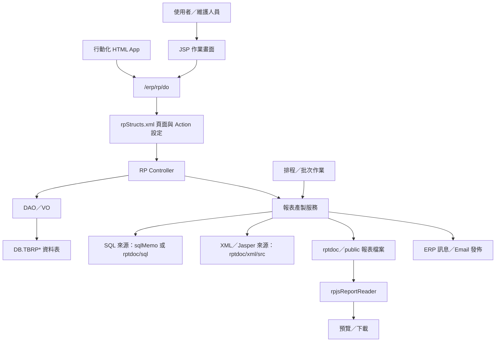
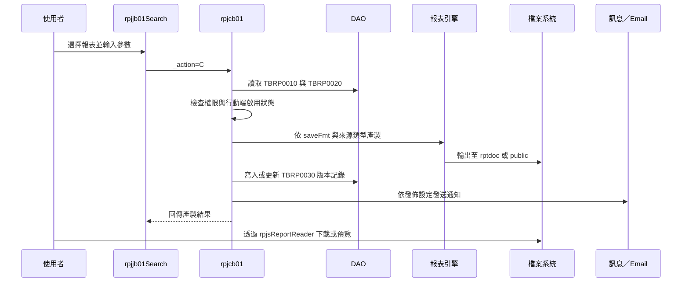

# RP 報表管理系統功能規格手冊

## 1. 系統概述

### 1.1 系統定位

RP 報表管理系統是 ERP 內部的通用報表設定、產製、查詢與發佈平台。系統以「報表代碼」為核心，集中管理報表主檔、輸入參數、SQL 或 XML 報表來源、產製格式、保留版本、執行權限與發佈對象，讓使用者可透過 ERP Web 畫面、行動化頁面或排程機制產生報表。

本模組的主要任務如下：

- 提供報表主檔維護，定義報表代碼、名稱、群組、輸出格式、權限群組、產製來源、SQL 來源與啟用狀態。
- 提供報表參數維護，支援日期、月份、年度、文字、帳務代碼、幣別等參數型態與預設值。
- 提供報表產製作業，依報表設定產出 PDF、CSV、XLS、TXT 等檔案。
- 保留報表產製版本與檔案路徑，供使用者查詢、預覽、下載或再次取得。
- 支援報表權限控管、發佈對象管理、訊息或 Email 通知。
- 支援排程自動產製與前端行動化查詢。

### 1.2 使用對象

本系統依使用情境可分為以下角色：

- 報表維護人員：建立與維護報表主檔、參數、SQL、XML、發佈對象與權限設定。
- 一般查詢使用者：依權限查詢可使用的報表，輸入參數後產生或下載報表。
- 主管或權限管理者：透過權限群組控管報表可見範圍與可執行人員。
- 排程作業管理者：設定週期作業，自動產生例行報表。
- 行動端使用者：透過 `html/app` 下的行動化頁面查詢特定報表或戰情室資料。

### 1.3 系統範圍

本手冊依目前 `rp` 模組程式與設定整理，範圍包含：

- JSP 作業頁面：`jsp/`
- 頁面流程設定：`config/yl/rp/rpStructs.xml`
- AJAX 權限作業設定：`config/yl/rp/rpAjax.xml`
- Java Controller 與共用服務：`src/com/icsc/rp/`
- Servlet 下載與來源讀取服務：`src/com/icsc/rp/web/`
- DAO／VO 與資料表定義：`src/com/icsc/rp/dao/`、`dao/sql/`
- 行動化查詢頁面：`html/app/`

### 1.4 主要資料表

| 資料表 | VO／DAO | 功能定位 | 主要用途 | 關聯功能 |
| --- | --- | --- | --- | --- |
| `DB.TBRP0010` | `rpjc0010VO`／`rpjc0010DAO` | 報表主檔 | 保存報表代碼、名稱、群組、輸出格式、保留版數、權限群組、產製來源、SQL 來源、啟用狀態、行動端啟用狀態與發佈方式。 | 報表主檔維護、報表查詢、報表產製、權限檢查、排程註冊、下載命名與發佈通知。 |
| `DB.TBRP0020` | `rpjc0020VO`／`rpjc0020DAO` | 報表參數明細 | 保存單一報表的參數序號、參數名稱、參數型態、參數值、參數說明與預設型態。 | 報表參數維護、參數輸入畫面、SQL 參數替換、XML 報表參數傳入、排程預設值更新。 |
| `DB.TBRP0025` | `rpjc0025VO`／`rpjc0025DAO` | 報表參數樣版 | 保存常用參數樣版，供報表建立或維護時快速複製。 | 參數樣版維護、報表參數複製、降低重複設定成本。 |
| `DB.TBRP0030` | `rpjc0030VO`／`rpjc0030DAO` | 報表產製版本記錄 | 保存報表產製版本、排程或產製者資訊、產生時間、完成時間、報表描述、產出路徑、點閱數與發送數。 | 報表產製結果保存、歷史版本查詢、檔案下載、版本輪替、產製完成通知。 |
| `DB.TBRP0040` | `rpjc0040VO`／`rpjc0040DAO` | 報表查詢說明 | 保存報表用途、資料來源與查詢條件說明。 | 報表說明維護、查詢畫面輔助說明、維護人員追查報表來源。 |
| `DB.TBRP0050` | `rpjc0050VO`／`rpjc0050DAO` | 報表發佈對象 | 保存報表對應的接收類型、接收部門或群組、建立與異動資訊。 | 發佈對象維護、產製完成後訊息或 Email 發送、部門接收者展開。 |
| `DB.TBRPG020` | `rpjcg020VO`／`rpjcg020DAO` | 序號設定資料 | 保存序號格式、年月日組成、前後綴與格式型態等設定，供系統產生報表代碼或相關流水號。 | 報表代碼自動編號、`rpjcsn` 序號產生、主檔新增流程。 |

## 2. 系統架構總覽

### 2.1 整體架構

### 2.2 Web 作業分層

RP 模組採用 ERP 既有 `dejcFunctionalController` 與 Structs XML 的頁面控制架構：

- 畫面層：JSP 负责輸入、查詢條件、列表呈現與操作按鈕。
- 流程設定層：`rpStructs.xml` 定義 `pageID`、JSP、Controller、Action flag、method 與 VO 轉換。
- Controller 層：`rpjca01`、`rpjca02`、`rpjca03`、`rpjca04`、`rpjcb01`、`rpjcb02`、`rpjcb03`、`rpjcc01` 等負責交易流程。
- DAO／VO 層：`rpjc0010DAO` 至 `rpjc0050DAO`、`rpjcg020DAO` 負責資料存取。
- 共用服務層：`rpjcRptUtil`、`rpjcRptBatch`、`rpjcDFBatch`、`rpjcCommon`、`rpjcsn` 提供報表產製、預設值、檔案輸出、序號與輔助功能。
- Servlet 層：`rpjsReportReader`、`rpjsSqlReader`、`rpjsXmlReader` 提供產出檔、SQL 檔與 XML 檔讀取下載。

### 2.3 頁面與 Controller 對照

| 作業頁面 | Controller | 主要 Action | 功能說明 |
| --- | --- | --- | --- |
| `rpjja0101Edit.jsp` | `com.icsc.rp.rpjca01` | `I`、`N`、`R`、`D`、`findPre`、`findNext` | 報表主檔新增、查詢、修改、刪除與前後筆瀏覽。 |
| `rpjja0201List.jsp` | `com.icsc.rp.rpjca02` | `I`、`N`、`R`、`D`、`S` | 報表參數維護與參數樣版複製。 |
| `rpjja0301Edit.jsp` | `com.icsc.rp.rpjca03` | `I`、`N`、`R`、`D` | 報表用途、來源與查詢條件說明維護。 |
| `rpjja0401List.jsp` | `com.icsc.rp.rpjca04` | `I`、`N`、`R`、`D` | 報表發佈部門或群組維護。 |
| `rpjjb0101List.jsp` | `com.icsc.rp.rpjcb01` | `I`、`Q`、`C` | 報表清單查詢、個人常用與常產生報表查詢。 |
| `rpjjb01Search.jsp` | `com.icsc.rp.rpjcb01` | `IQ`、`C` | 查詢報表參數並執行報表產製。 |
| `rpjjb0201List.jsp` | `com.icsc.rp.rpjcb02` | `I` | SQL 檔案查詢。 |
| `rpjjb0301List.jsp` | `com.icsc.rp.rpjcb03` | `I` | XML 檔案查詢。 |
| `rpjjc0101List.jsp` | `com.icsc.rp.rpjcc01` | `I`、`N`、`R`、`D` | 報表參數樣版維護。 |

### 2.4 報表產製流程

### 2.5 報表來源與輸出

報表來源可由下列方式提供：

- `TBRP0010.sqlMemo`：直接在主檔維護 SQL 文字。
- `TBRP0010.fileDir`、`fileName`：指定 `rptdoc/sql/` 下的 SQL 檔。
- `TBRP0010.rptGenSrc`：指定 `rptdoc/xml/src/` 下的 XML／Jasper 報表定義。
- Java 處理邏輯：`javaMemo`、`cursorJavaMemo` 等欄位與 `rpjcRptUtil` 支援較進階的資料處理。

輸出格式依 `saveFmt` 判斷，程式支援 PDF、CSV、XLS、TXT。產製後檔案通常以時間戳命名，存放於 `rptdoc/GROUP{rptGroup}/{rptCode}/{version}/`，並在 `TBRP0030.rptPath` 記錄相對路徑。

### 2.6 權限與發佈架構

RP 報表執行權限主要來自 `TBRP0010.authGroup`，由 `dsjcagc` 檢核使用者是否屬於授權群組。程式另保留稽核群組 `AUDITGRP`、A3 部門及報表負責部門等特殊判斷。報表可設定 `RP_{rptCode}_AUTH` 類型權限群組，並可透過 `rpjjagcNew.jsp` 與 `rpAjax.xml` 進行群組成員管理。

報表產製完成後，可依設定發佈：

- 以 ERP 工作訊息通知接收者。
- 以 Email 寄送報表檔案。
- 依 `TBRP0050` 設定對部門或群組發佈。
- 以 `TBRP0010.rptSendType` 控制訊息、Email 或兩者皆發送。

### 2.7 排程與批次架構

排程產製主要由下列程式支援：

- `rpjcAutoGenRpt`：供 DI 排程呼叫，先套用參數預設值，再執行報表產製。
- `rpjcDFBatch`：提供 `runRpt` 系列方法，可由前端、排程或其他模組傳入報表代碼與參數 Map 產生報表。
- `rpjcRptBatch`：較早期的批次產製類別，處理參數預設值、版本輪替、輸出與通知。

維護報表主檔時，`rpjca01` 會依報表週期設定呼叫 `dejcSelPeriod` 新增或取消 `RP-{rptCode}` 排程。

### 2.8 行動化與特定報表頁

`html/app` 目錄下提供多個行動化查詢頁面，部分頁面直接呼叫 `/erp/rp/do`，部分使用 `/erp/zp/do?_pageId=zpSimpleQueryApp&_action=queryByRptCode` 以報表代碼查詢。已辨識頁面包含：

- `rpwh001App.html`：報表產製。
- `rpwh002App.html`、`rpwhB0R02970App.html`：備貨資料跟蹤表 H1 倉。
- `rpwhARR00130App.html`：扁鋼胚庫存結構分析表。
- `rpwhARR00140App.html`：熱軋訂單鋼胚欠料量彙總表。
- `rpwhARR00230App.html`：鋼胚待交量彙總表。
- `rpwhB0R03130App.html`：出貨計畫執行狀況表。
- `rpwhC0R00370App.html`：各廠暫留及待再處理統計。
- `rpwhCHR00480App.html`：熱軋改單放行統計表。
- `rpwhF0R10550App.html`：請假清單查詢。
- `rpwhP1.html`：簡明合併資產負債表。
- `rpwhd0r00080App.html`、`rpwhJ0R00040App.html`：戰情室。

## 3. 功能模組詳細說明

### 3.1 報表主檔維護

**功能目的**

建立每一張報表的基本設定，是報表平台的核心資料來源。

**主要畫面與程式**

- JSP：`rpjja01.jsp`、`rpjja0101Edit.jsp`、`rpjja01Search.jsp`、`rpjja01List.jsp`
- Controller：`rpjca01`
- DAO／VO：`rpjc0010DAO`、`rpjc0010VO`
- 資料表：`DB.TBRP0010`

**主要功能**

- 查詢報表主檔。
- 新增報表，系統依報表群組與序號設定產生報表代碼。
- 修改報表名稱、說明、群組、輸出格式、保留版數、權限群組、SQL 或 XML 來源、啟用狀態、行動端啟用狀態與負責部門。
- 刪除報表主檔時，同步刪除參數、查詢說明、發佈對象、權限群組成員與 ZP 權限資源資料。
- 維護排程設定，新增或取消 `RP-{rptCode}` 排程。
- 提供前一筆、下一筆瀏覽。
- 支援報表 SQL 內容查找與同群組 SQL／XML 打包下載。

**重要欄位**

- `rptCode`：報表代碼。
- `rptName`：報表名稱。
- `rptDesc`：報表說明。
- `rptGroup`：報表群組。
- `saveFmt`：輸出格式。
- `rptVerNo`：保留版本數。
- `authGroup`：執行權限群組。
- `rptGenMode`：報表產生方式。
- `rptPeriodId`：排程週期。
- `rptGenSrc`：XML 報表來源。
- `sqlMemo`：內嵌 SQL。
- `fileDir`、`fileName`：SQL 檔案目錄與檔名。
- `sendSql`、`sendTable`：SQL 下發或公開下載相關設定。
- `mobileUseCode`：行動端是否可用。
- `respDep`：報表負責部門。

### 3.2 報表參數維護

**功能目的**

定義報表執行前需要輸入或預設的參數，供 SQL 替換、XML 報表參數或 Java 處理邏輯使用。

**主要畫面與程式**

- JSP：`rpjja0201List.jsp`
- Controller：`rpjca02`
- DAO／VO：`rpjc0020DAO`、`rpjc0020VO`
- 資料表：`DB.TBRP0020`

**主要功能**

- 依報表代碼查詢參數清單。
- 新增、修改、刪除參數。
- 由參數樣版複製常用參數。
- 依參數序號控制畫面與替換順序。
- 設定參數預設型態，供批次或排程自動帶入日期、月份、年度等值。

**重要欄位**

- `rptCode`：報表代碼。
- `rptParaSeq`：參數序號。
- `rptParaName`：參數名稱。
- `rptParaType`：參數型態。
- `rptParaValue`：參數值。
- `rptParaDesc`：參數說明。
- `defaultType`：預設值型態。

### 3.3 報表用途與查詢說明維護

**功能目的**

補充報表用途、資料來源與查詢條件說明，讓使用者理解報表內容與查詢邏輯。

**主要畫面與程式**

- JSP：`rpjja0301Edit.jsp`
- Controller：`rpjca03`
- DAO／VO：`rpjc0040DAO`、`rpjc0040VO`
- 資料表：`DB.TBRP0040`

**主要功能**

- 維護報表用途說明。
- 維護報表資料來源說明。
- 維護查詢條件說明。
- 提供查詢、建立、更新與刪除。

**重要欄位**

- `rptCode`：報表代碼。
- `rptUsed`：報表用途。
- `rptSource`：資料來源。
- `rptCond`：查詢條件。

### 3.4 報表發佈對象維護

**功能目的**

設定報表產製完成後的發佈或通知對象，讓系統可依部門或群組發送訊息。

**主要畫面與程式**

- JSP：`rpjja0401List.jsp`
- Controller：`rpjca04`
- DAO／VO：`rpjc0050DAO`、`rpjc0050VO`
- 資料表：`DB.TBRP0050`

**主要功能**

- 查詢報表發佈對象。
- 新增、修改、刪除接收部門或群組。
- 報表產製成功時，供通知流程取得接收者。

**重要欄位**

- `rptCode`：報表代碼。
- `revType`：接收類型，例如部門或群組。
- `revDept`：接收部門或群組代碼。
- `createEmp`、`createDate`：建立人與建立日期。
- `reviseEmp`、`reviseDate`：異動人與異動日期。

### 3.5 報表查詢與產製

**功能目的**

讓使用者依權限查詢可執行報表，輸入參數並產生指定格式的報表檔案。

**主要畫面與程式**

- JSP：`rpjjb01.jsp`、`rpjjb0101List.jsp`、`rpjjb01Search.jsp`、`rpjjb01List.jsp`、`rpjjb01Popup.jsp`
- Controller：`rpjcb01`
- 下載 Servlet：`rpjsReportReader`
- 主要服務：`rpjcRptUtil`、`rpjcUtil`
- 資料表：`DB.TBRP0010`、`DB.TBRP0020`、`DB.TBRP0030`

**主要功能**

- 依報表代碼、名稱、群組、啟用狀態查詢報表。
- 查詢個人常用報表或常產生報表。
- 檢查使用者是否具備 `authGroup` 權限、稽核群組權限或特殊部門權限。
- 行動端查詢時，檢查 `mobileUseCode` 是否啟用。
- 讀取報表參數並顯示輸入畫面。
- 依 `saveFmt` 與來源類型選擇產製流程：
  - PDF：以 XML／Jasper 產生。
  - CSV：以 SQL 或 XML 報表來源產生。
  - XLS：以 SQL 或 XML 報表來源產生。
  - TXT：以 SQL 產生文字檔。
- 將 `$P{參數名稱}` 替換為實際參數值。
- 新增或輪替 `TBRP0030` 產製版本。
- 產製完成後回傳結果清單，供使用者預覽或下載。

### 3.6 報表版本與下載

**功能目的**

保存每次產製結果的版本與檔案路徑，讓使用者能取得歷史產製檔。

**主要畫面與程式**

- JSP：`rpjjb01List.jsp`
- Servlet：`rpjsReportReader`
- DAO／VO：`rpjc0030DAO`、`rpjc0030VO`
- 資料表：`DB.TBRP0030`

**主要功能**

- 依報表代碼列出產製版本。
- 顯示產製時間、產製者、檔案路徑、點閱數等資訊。
- 依 `rptCode` 與 `version` 讀取 `TBRP0030.rptPath`。
- 透過 `rpjcUtil.setContentType` 設定下載檔名與 Content-Type。
- 若 `sendSql = Y`，下載來源切換至 `public/`，並以 `sendTable` 與輸出格式組合檔名。
- 下載前再次檢查使用者是否具備報表權限。

### 3.7 SQL 與 XML 來源查詢

**功能目的**

讓維護人員查詢報表背後使用的 SQL 或 XML 報表來源，利於維護與除錯。

**主要畫面與程式**

- SQL 查詢 JSP：`rpjjb02.jsp`、`rpjjb0201List.jsp`
- XML 查詢 JSP：`rpjjb03.jsp`、`rpjjb0301List.jsp`
- Controller：`rpjcb02`、`rpjcb03`
- Servlet：`rpjsSqlReader`、`rpjsXmlReader`

**主要功能**

- 查詢已設定 SQL 檔或 SQL 內容的報表。
- 查詢已設定 XML 來源的報表。
- 依報表代碼開啟 SQL 或 XML 檔。
- 供報表維護人員快速檢視報表來源。

### 3.8 報表參數樣版維護

**功能目的**

提供共用參數設定樣版，降低報表建立時重複設定參數的成本。

**主要畫面與程式**

- JSP：`rpjjc01.jsp`、`rpjjc0101List.jsp`
- Controller：`rpjcc01`
- DAO／VO：`rpjc0025DAO`、`rpjc0025VO`
- 資料表：`DB.TBRP0025`

**主要功能**

- 新增、查詢、修改、刪除參數樣版。
- 維護參數序號、名稱、型態、預設值與說明。
- 供 `rpjca02.copy()` 複製到指定報表的參數明細。

### 3.9 權限群組管理

**功能目的**

控管報表可執行人員與權限群組成員，並與 ERP 權限資料整合。

**主要畫面與程式**

- JSP：`rpjjagcNew.jsp`、`rpjjg0201List.jsp`
- AJAX 設定：`rpAjax.xml`
- Controller：`dsjcagcNewFunc`、`dsjcagcCheck`
- 輔助程式：`rpjca01.updateAuthGroup`、`copyAuthGroup`、`existAuthGroup`、`isMemberEmptyByAuth`

**主要功能**

- 建立報表專屬權限群組。
- 查詢、加入或刪除權限成員。
- 複製既有權限群組成員到新群組。
- 判斷權限群組是否存在或是否尚未設定成員。
- 將報表資源同步到 ZP 權限資源資料。

### 3.10 排程與批次產製

**功能目的**

支援不經人工操作的例行報表產製，並可供其他模組以程式方式呼叫。

**主要程式**

- `rpjcAutoGenRpt`
- `rpjcDFBatch`
- `rpjcRptBatch`
- `rpjcRptUtil`

**主要功能**

- 依 `rptPeriodId` 建立週期排程。
- 排程執行時先依參數型態與預設值更新日期、月份或年度參數。
- 支援單一報表、多報表與 JSON／Map 參數呼叫。
- 成功產製後回傳 `rptdoc/` 下的檔案路徑。
- 可依 `rptSendType` 發送 ERP 訊息、Email 或兩者。
- 支援將報表檔案複製、FTP 上傳或供外部下載。

### 3.11 行動化報表查詢

**功能目的**

提供手機或平板使用的簡化查詢畫面，讓使用者快速查詢特定報表或常用報表。

**主要程式**

- `html/app/rpwh001App.html`
- `html/app/rpwh*.html`

**主要功能**

- `rpwh001App.html` 提供報表搜尋、群組篩選、參數輸入、產製與下載。
- 特定報表 App 以固定報表代碼呼叫查詢服務，例如 `B0R02970`、`ARR00130`、`ARR00140`、`ARR00230`、`F0R10550`。
- 行動端使用 `_ajax` 呼叫時，後端會檢查報表是否允許行動端使用。
- 報表結果可透過 `parent.app.checkPermissionAndDownload` 或另開視窗下載。

### 3.12 共用工具與基礎服務

**主要程式**

- `rpjcCommon`：日期格式、金額格式、下拉選單、代碼檔、SQL 讀取等共用函式。
- `rpjcRptUtil`：報表產製核心工具，包含 XML 編譯、Jasper 產製、SQL／VO List 報表、檔案輸出與通知。
- `rpjcRptUtilPro`：進階報表產製與檔案處理工具。
- `rpjcUtil`：下載 Content-Type 與檔案輸出。
- `rpjcsn`：依序號設定產生報表代碼或其他流水號。
- `rpjc328`：檔案上傳處理。
- `rpjcWebTool`：Request 參數轉換、按鈕狀態、時間格式等 Web 輔助工具。

### 3.13 主要作業規則

- 報表代碼為報表主檔的唯一鍵，建立後作為所有參數、版本、說明與發佈設定的關聯鍵。
- 報表刪除時，會同步清除相關參數、查詢說明與發佈設定，避免孤兒資料。
- 報表產製時先確認報表存在、使用者具備權限、行動端狀態符合，再進行產製。
- 報表參數以 `TBRP0020` 為準，執行時可由畫面輸入、預設值或外部 Map 覆蓋。
- 報表版本數由 `rptVerNo` 控制，超過保留數時會刪除最舊版本並以新檔取代。
- 報表輸出路徑記錄於 `TBRP0030`，實際下載必須透過 Servlet 再次檢查權限。
- SQL 檔與 XML 檔分別存放於 `rptdoc/sql/` 與 `rptdoc/xml/src/`，主檔只保存相對設定。
- `sendSql = Y` 的報表下載來源會切換至 `public/`，檔名由 `sendTable` 與格式組成。

### 3.14 程式來源對照摘要

| 類別／檔案 | 職責 |
| --- | --- |
| `config/yl/rp/rpStructs.xml` | 定義 RP 頁面、Controller、Action 與 VO 對應。 |
| `config/yl/rp/rpAjax.xml` | 定義權限群組管理 AJAX Controller。 |
| `rpjca01` | 報表主檔維護、排程註冊、權限群組輔助。 |
| `rpjca02` | 報表參數維護與樣版複製。 |
| `rpjca03` | 報表用途、來源、查詢條件維護。 |
| `rpjca04` | 報表發佈對象維護。 |
| `rpjcb01` | 報表清單查詢、參數查詢、報表產製。 |
| `rpjcb02` | SQL 來源查詢。 |
| `rpjcb03` | XML 來源查詢。 |
| `rpjcc01` | 參數樣版維護。 |
| `rpjsReportReader` | 報表產出檔下載與權限檢查。 |
| `rpjsSqlReader` | SQL 檔案下載。 |
| `rpjsXmlReader` | XML 報表來源下載。 |
| `rpjcDFBatch` | 程式化與排程式報表產製入口。 |
| `rpjcAutoGenRpt` | DI 排程呼叫入口。 |
| `rpjcRptUtil` | 報表產製、輸出與通知核心工具。 |

### 3.15 待確認事項

本手冊依目前程式、設定與 SQL 檔整理，以下事項若要作為正式簽核版，建議再以實際環境資料確認：

- 各報表群組代碼於 `TBDE23` 或其他代碼檔中的中文名稱。
- `rptParaType`、`defaultType` 各代碼的完整定義與使用範圍。
- 實際 Email 與 ERP 工作訊息發送規則，包含 `rptSendType` 對應值。
- `sendSql`、`sendTable` 的業務使用場景與安全要求。
- 行動端特定報表代碼是否仍為現行使用清單。
