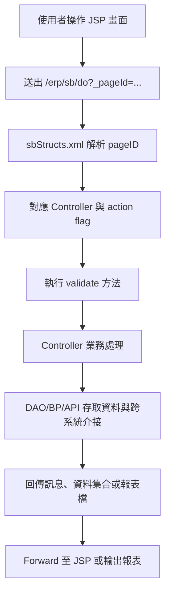

# SB 發貨管理系統功能規格手冊

## 1. 系統概述

### 1.1 系統定位

SB 發貨管理系統為 ERP 中負責發貨、移倉、擬發貨、出貨計畫、出貨分析與鋼管 PI 報表維護的子系統。系統以 JSP 作為使用者操作介面，透過 `config/yl/sb/sbStructs.xml` 定義頁面、Controller、Action 與 Value Object 映射，再由 `com.icsc.sb` 套件下的 Controller、DAO、BP、API 元件完成資料維護、狀態控管、報表產出與跨系統資料更新。

### 1.2 主要使用對象

- 業務及出貨作業人員：建立、修改、查詢發貨通知單、移倉通知單與擬發貨通知單。
- 倉儲及出貨協調人員：執行鎖定、解鎖、結案、取消結案、備貨與實際出貨數量回寫。
- 管理及主管人員：查詢發貨彙總、移倉彙總、月計畫、出貨現況及 PI 報表。
- 系統介接程序：透過 API 更新發貨／移倉實績、存貨鎖定、訂單已發數量與出貨現況追蹤資料。

### 1.3 系統範圍

系統涵蓋下列作業範圍：

- 發貨通知單主檔與項次檔維護。
- 移倉通知單主檔與項次檔維護。
- 擬發貨通知單、項次及鎖定存貨資料維護。
- 收貨人資料、費用資料、付款授信資料與訂單項次參照。
- 發貨月計畫、出貨現況分析與客戶月核定量控制。
- 發貨／移倉相關報表查詢與列印。
- 外銷與內銷鋼管 PI 報表主檔、明細與 Excel 匯出。
- 與訂單、價格、存貨、出貨實績及 eForm 事件相關的內部 API 介接。

### 1.4 主要資料表

| 資料表 | VO／DAO | 功能定位 | 主要用途 | 關聯功能 |
| --- | --- | --- | --- | --- |
| `db.tbsbyl01` | `sbjcyl01VO`／`sbjcyl01DAO` | 發貨通知單主檔 | 保存發貨通知單號、客戶、預計出貨日期、運送方式、指送地點、金額、重量與狀態。 | 發貨通知單維護、發貨明細、鎖定／解鎖、結案／取消結案、出貨實績回寫。 |
| `db.tbsbyl02` | `sbjcyl02VO`／`sbjcyl02DAO` | 發貨通知單項次檔 | 保存發貨通知單各訂單項次之品名、規格、品級、單價、計畫數量／重量、實際數量／重量與備貨資料。 | 訂單項次參照、發貨通知單明細、備貨更新、實際出貨更新、發貨通知單查詢表。 |
| `db.tbsbyl03` | `sbjcyl03VO`／`sbjcyl03DAO` | 費用資料檔 | 保存發貨相關費用、付款摘要、授信額度、幣別與可開發貨金額資料。 | 發貨通知單費用維護、付款方式參照、授信額度檢核、金額計算。 |
| `db.tbsbyl04` | `sbjcyl04VO`／`sbjcyl04DAO` | 移倉通知單主檔 | 保存移倉通知單號、移倉類別、產品分類、預計移倉日期、運輸資料、客戶與狀態。 | 移倉通知單維護、移倉明細、鎖定／解鎖、結案／取消結案、移倉彙總。 |
| `db.tbsbyl05` | `sbjcyl05VO`／`sbjcyl05DAO` | 移倉通知單項次檔 | 保存移倉通知單各訂單項次之品級、規格、下製程、計畫移倉量、實際移倉量與重量資料。 | 移倉明細維護、訂單項次參照、移倉實績回寫、存貨鎖定、移倉彙總。 |
| `db.tbsbyl06` | `sbjcyl06VO`／`sbjcyl06DAO` | 收貨人資料檔 | 保存客戶收貨人、指送地點、聯絡資訊、車種限制與收貨地址。 | 收貨人資料維護、發貨通知單主檔帶入、指送地點查詢、收貨資料檢核。 |
| `db.tbsbyl07` | `sbjcyl07VO`／`sbjcyl07DAO` | 發貨月計畫資料檔 | 保存資料年月、產品名稱、內銷計畫量、外銷計畫量、小計與合計。 | 發貨月計畫維護、出貨現況分析、月計畫達成率比較。 |
| `db.tbsbyl08` | `sbjcyl08VO`／`sbjcyl08DAO` | 發貨現況追蹤檔 | 保存每日及每月出貨實績、累計量、計畫量、差額、達成率與分析項目。 | 出貨現況分析、實際出貨 API 回寫、發貨月計畫比對、管理查詢。 |
| `db.tbsbyl09` | `sbjcyl09VO`／`sbjcyl09DAO` | 存貨鎖定檔 | 保存通知單、訂單項次、產品、品級、規格與鎖定存貨資料。 | 發貨存貨鎖定、移倉存貨鎖定、擬發貨鎖定參照、鋼捲查詢。 |
| `db.tbsbyl10` | `sbjcyl10VO`／`sbjcyl10DAO` | 擬發貨通知單主檔 | 保存擬發貨通知單號、客戶、預計出貨日期、業務人員、幣別、匯率、狀態與備註。 | 擬發貨通知單維護、擬發貨項次、鎖定／解鎖、結案／取消結案、擬發貨報表。 |
| `db.tbsbyl11` | `sbjcyl11VO`／`sbjcyl11DAO` | 擬發貨通知單項次檔 | 保存擬發貨訂單項次、品名、規格、尺寸、品級、單價、計畫數量與計畫重量。 | 擬發貨明細維護、訂單項次參照、擬發貨鎖定存貨、擬發貨報表。 |
| `db.tbsbyl12` | `sbjcyl12VO`／`sbjcyl12DAO` | 擬發貨通知單鎖定存貨檔 | 保存擬發貨項次對應之鋼捲、規格、品級、尺寸、硬度、淨重與倉別。 | 擬發貨鋼捲查詢、鎖定存貨維護、外銷預定出貨審核。 |
| `db.tbsbyl20` | `sbjcyl20VO`／`sbjcyl20DAO` | 客戶月核定量控制檔 | 保存出貨年月、銷售品別、內外銷別、客戶、核定量、公差量、額外量與當月出貨量。 | 客戶月核定量維護、資料複製、出貨額度控管、發貨量檢核。 |
| `db.tbsbyl30` | `sbjcyl30VO`／`sbjcyl30DAO` | 鋼管 PI 報表基本資料檔 | 保存外銷鋼管 PI 主檔資料，例如 PI 編號、客戶、船名、銀行、合約、訂購編號與公司資料。 | 外銷鋼管 PI 主檔維護、PI 明細、PDF 列印、Excel 匯出。 |
| `db.tbsbyl31` | `sbjcyl31VO`／`sbjcyl31DAO` | 鋼管 PI 報表項次資料檔 | 保存外銷鋼管 PI 明細，例如訂單項次、管徑、管厚、長度、捆數、總支數、總重量與總價。 | 外銷鋼管 PI 明細維護、訂單參照、PI 報表彙總、Excel 匯出。 |
| `db.tbsbyl40` | `sbjcyl40VO`／`sbjcyl40DAO` | 內銷鋼管 PI 報表基本資料檔 | 保存內銷鋼管 PI 主檔資料，例如年度、客戶、地址、送貨地址、出貨地、訂單號碼與採購號碼。 | 內銷鋼管 PI 主檔維護、PI 明細、Excel 匯出。 |
| `db.tbsbyl41` | `sbjcyl41VO`／`sbjcyl41DAO` | 內銷鋼管 PI 報表項次資料檔 | 保存內銷鋼管 PI 明細，例如訂單項次、管徑、管厚、長度、每捆支數、捆數與總支數。 | 內銷鋼管 PI 明細維護、訂單參照、PI 報表彙總、Excel 匯出。 |

## 2. 系統架構總覽

### 2.1 程式分層

SB 模組採用典型 ERP Web 模組分層：

| 層級 | 位置 | 職責 |
| --- | --- | --- |
| 使用者介面層 | `jsp/*.jsp` | 提供查詢條件、主檔、明細、彈窗、報表條件與操作按鈕。 |
| 頁面映射層 | `config/yl/sb/sbStructs.xml` | 定義 `_pageId`、JSP、Controller、Action flag、驗證方法與 VO。 |
| Controller 層 | `src/com/icsc/sb/sbjcyl*.java` | 接收 action，執行查詢、新增、修改、刪除、鎖定、結案、列印等作業。 |
| 商業邏輯層 | `src/com/icsc/sb/bp/*.java`、`sbjcylAPI*.java` | 執行 PI 報表組成、訂單／價格／存貨／實績更新及跨模組邏輯。 |
| 資料存取層 | `src/com/icsc/sb/*DAO.java`、`src/com/icsc/sb/dao/*DAO.java` | 對 SB 相關資料表進行新增、查詢、修改、刪除及彙總。 |
| 報表層 | `xml/dr/*.xml` | 定義發貨通知單、發貨彙總、移倉彙總、鋼捲外銷預定出貨審核表等報表版面。 |

### 2.2 請求處理流程

### 2.3 主要 Action 約定

| Action flag | 一般用途 |
| --- | --- |
| `I` | 查詢或載入資料。 |
| `N` | 新增資料。 |
| `R` | 修改資料。 |
| `D` | 刪除資料。 |
| `A` / `B` | 鎖定／解鎖發貨或擬發貨資料。 |
| `F` / `G` | 結案／取消結案。 |
| `P` | PDF 或報表列印。 |
| `E` | Excel 匯出。 |
| `L` | 彈窗參照查詢，例如訂單、付款方式、鋼捲資料。 |
| `CP` | 資料複製。 |
| `R2` | 修改主鍵或項次索引。 |

### 2.4 系統介接

SB 模組不只維護本身資料，也會依作業狀態與其他模組互動：

- 訂單資料：查詢訂單主檔與項次，並回寫已發貨數量、重量或備貨數量。
- 價格與付款資料：計算發貨金額、運費、授信額度與付款摘要可用金額。
- 庫存與鋼捲資料：提供鋼捲查詢、存貨鎖定、解除鎖定與出貨檢核。
- 出貨現況追蹤：依實際出貨或移倉結果更新每日／每月統計數量。
- eForm 事件：`sbjcEFormEventHandler` 提供 eForm 啟動、核准、退回等事件擴充點。

## 3. 功能模組詳細說明

### 3.1 發貨通知單維護

#### 3.1.1 發貨通知單主檔

- 主要頁面：`sbjjyl01.jsp`、`sbjjyl01MN.jsp`、`sbjjyl01Search.jsp`、`sbjjyl01List.jsp`。
- Controller：`com.icsc.sb.sbjcyl01`。
- 資料表：`db.tbsbyl01`。
- 主要欄位：發貨通知單號、客戶編號、客戶名稱、預計出貨日期、指送地點、收貨人、運送方式、起點、訖點、計畫總重量、實際總重量、幣別、業務人員、狀態、備註、信用狀、船次、倉庫及理貨資訊。
- 主要功能：
  - 查詢、新增、修改、刪除發貨通知單主檔。
  - 鎖定、解除鎖定、結案、取消結案。
  - 更新出貨暗號等附屬欄位。
  - 依狀態控制主檔及明細可編輯性。

#### 3.1.2 發貨通知單項次

- 主要頁面：`sbjjyl01DT.jsp`、`sbjjylOrderNo.jsp`、`sbjjylDispPlanItem.jsp`、`sbjjyl01DThelp.jsp`。
- Controller：`com.icsc.sb.sbjcyl02`。
- 資料表：`db.tbsbyl02`。
- 主要欄位：訂單編號、訂單項次、品級、規格、品名、尺寸、單價、單位、計畫數量、計畫重量、實際數量、實際重量、單重上下限、每捆支數、捆數、長度、運費金額。
- 主要功能：
  - 維護發貨通知單明細項次。
  - 參照訂單項次帶入品名、規格、單價、幣別及單位。
  - 參照出貨計畫或鋼捲資料帶入可出貨數量與重量。
  - 更新備貨與實際出貨數量、重量。
  - 檢核實績不可超過計畫數量或重量。

#### 3.1.3 費用與授信參照

- 費用資料頁面：`sbjjyl0103.jsp`，Controller：`sbjcyl03`，資料表：`db.tbsbyl03`。
- 付款方式參照：`sbjjylPayMode.jsp`。
- 存貨鎖定參照：`sbjjyl0104.jsp`，Controller：`sbjcyl09`，資料表：`db.tbsbyl09`。
- 主要功能：
  - 維護或查詢發貨相關費用與付款摘要。
  - 顯示授信額度、幣別、可開發貨金額、發貨鎖定金額。
  - 維護通知單與訂單項次對應的存貨鎖定資料。

### 3.2 移倉通知單維護

#### 3.2.1 移倉通知單主檔

- 主要頁面：`sbjjyl02.jsp`、`sbjjyl02MN.jsp`、`sbjjyl02Search.jsp`、`sbjjyl02List.jsp`。
- Controller：`com.icsc.sb.sbjcyl04`。
- 資料表：`db.tbsbyl04`。
- 主要欄位：移倉通知單號、銷售產品分類、移倉類別、客戶編號、指送地點、預計移倉日期、運輸別、運輸工具、業務人員與狀態。
- 主要功能：
  - 查詢、新增、修改、刪除移倉通知單主檔。
  - 鎖定、解除鎖定、結案、取消結案。
  - 管控移倉狀態與明細可異動條件。

#### 3.2.2 移倉通知單項次

- 主要頁面：`sbjjyl02DT.jsp`、`sbjjylOrderNoByCHG.jsp`、`sbjjyl0203.jsp`、`sbjjylLockProd.jsp`。
- Controller：`com.icsc.sb.sbjcyl05`、`com.icsc.sb.sbjcyl09`。
- 資料表：`db.tbsbyl05`、`db.tbsbyl09`。
- 主要欄位：訂單編號、訂單項次、品級、規格、下製程、單重上下限、單重代碼、計畫移倉量、實際移倉量及鎖定存貨資料。
- 主要功能：
  - 維護移倉明細資料。
  - 參照訂單項次建立移倉項次。
  - 維護或查詢移倉相關存貨鎖定資料。
  - 配合 API 回寫移倉實際數量與重量。

### 3.3 收貨人資料維護

- 主要頁面：`sbjjyl03.jsp`、`sbjjyl0301.jsp`、`sbjjyl03Search.jsp`、`sbjjyl03List.jsp`。
- Controller：`com.icsc.sb.sbjcyl06`。
- 資料表：`db.tbsbyl06`。
- 主要欄位：客戶編號、指送地點、收貨人名稱、收貨人簡稱、聯絡人、聯絡電話、車種限制、收貨地址。
- 主要功能：
  - 查詢、新增、修改、刪除收貨人資料。
  - 維護收貨人與指送地點資訊。
  - 支援發貨通知單主檔帶入收貨人及地址資料。
  - 提供報廢與取消報廢處理。

### 3.4 發貨月計畫維護

- 主要頁面：`sbjjyl04.jsp`、`sbjjyl0401.jsp`。
- Controller：`com.icsc.sb.sbjcyl07`。
- 資料表：`db.tbsbyl07`。
- 主要欄位：資料年月、項次、產品名稱、內銷計畫出貨量、外銷計畫出貨量、小計、合計。
- 主要功能：
  - 查詢、新增、修改、刪除月計畫資料。
  - 依產品及內外銷別維護計畫出貨量。
  - 作為出貨現況與達成率分析依據。

### 3.5 出貨現況分析

- 主要頁面：`sbjjyl05.jsp`、`sbjjyl05D1.jsp`、`sbjjyl05D2.jsp`、`sbjjyl05D3.jsp`、`sbjjyl05D4.jsp`、`sbjjyl05D5.jsp`。
- Controller：`com.icsc.sb.sbjcyl08`。
- 資料表：`db.tbsbyl08`。
- 主要欄位：資料日期、分析項目、產品名稱、本日出貨量、本月累計、本月計畫量、差額、達成率、內外銷分類。
- 主要功能：
  - 依資料日期及分析項目查詢出貨現況。
  - 顯示本日、本月累計、月計畫與達成率。
  - 透過頁籤或 iframe 顯示不同分析維度。
  - 由實際出貨或移倉 API 更新追蹤數據。

### 3.6 發貨與移倉報表

#### 3.6.1 發貨通知單查詢表

- 主要頁面：`sbjjyl06.jsp`、`sbjjyl0601.jsp`、`sbjjyl06Search.jsp`。
- Controller：`com.icsc.sb.sbjcyl06CR`。
- 報表定義：`xml/dr/sbjjyl06p01.xml`。
- 主要功能：依發貨通知單、訂單項次、品名、規格、業務人員、狀態及日期條件查詢並列印發貨通知單資料。

#### 3.6.2 發貨彙總表

- 主要頁面：`sbjjyl07.jsp`、`sbjjyl0701.jsp`、`sbjjyl07Search.jsp`。
- Controller：`com.icsc.sb.sbjcyl07CR`。
- 報表定義：`xml/dr/sbjjyl07p01.xml`。
- 主要功能：依客戶、指送地點、起點、日期區間、業務人員及狀態彙總發貨資料。

#### 3.6.3 移倉彙總表

- 主要頁面：`sbjjyl08.jsp`、`sbjjyl0801.jsp`、`sbjjyl08Search.jsp`。
- Controller：`com.icsc.sb.sbjcyl08CR`。
- 報表定義：`xml/dr/sbjjyl08p01.xml`。
- 主要功能：依客戶、指送地點、起點、日期區間、業務人員及狀態彙總移倉資料。

### 3.7 擬發貨通知單維護

#### 3.7.1 擬發貨通知單主檔

- 主要頁面：`sbjjyl09.jsp`、`sbjjyl0901.jsp`、`sbjjyl09Search.jsp`、`sbjjyl09List.jsp`。
- Controller：`com.icsc.sb.sbjcyl10`。
- 資料表：`db.tbsbyl10`。
- 主要欄位：擬發貨通知單號、客戶名稱、預計出貨日期、國內統一發票、業務人員、計畫數量、銷售產品大類、內外銷、狀態、幣別、匯率、銀行資料、加減價項與備註。
- 主要功能：
  - 查詢、新增、修改、刪除擬發貨通知單主檔。
  - 鎖定／解除鎖定擬發貨資料。
  - 結案／取消結案。
  - 產出擬發貨相關報表。

#### 3.7.2 擬發貨通知單項次

- 主要頁面：`sbjjyl0902.jsp`、`sbjjyl09OrderSearch.jsp`。
- Controller：`com.icsc.sb.sbjcyl11`。
- 資料表：`db.tbsbyl11`。
- 主要欄位：訂單項次、規格、品名、尺寸、品級、單價、幣別、計畫數量、計畫重量及相關出貨條件。
- 主要功能：
  - 參照訂單建立擬發貨項次。
  - 查詢、新增、修改、刪除項次資料。
  - 支援項次索引或主鍵調整。

#### 3.7.3 擬發貨鎖定存貨

- 主要頁面：`sbjjyl0903.jsp`、`sbjjyl09CoilSearch.jsp`、`sbjjyl09NoClickButton.jsp`。
- Controller：`com.icsc.sb.sbjcyl12`。
- 資料表：`db.tbsbyl12`。
- 主要欄位：鋼捲編號、規格、品級、尺寸、硬度、淨重、倉別。
- 主要功能：
  - 依擬發貨項次查詢鋼捲資料。
  - 建立或刪除鎖定存貨紀錄。
  - 供後續發貨通知單或實際出貨流程參照。

### 3.8 客戶月核定量控制

- 主要頁面：`sbjjyl20.jsp`、`sbjjyl2001.jsp`。
- Controller：`com.icsc.sb.sbjcyl20`。
- 資料表：`db.tbsbyl20`。
- 主要欄位：出貨年月、銷售品別、內外銷別、客戶、核定量、公差量、計額度量、額外量、OD 量、當月單出貨量。
- 主要功能：
  - 依出貨年月、銷售品別、內外銷別及客戶查詢核定量。
  - 新增、修改、刪除客戶月核定量資料。
  - 複製既有控制資料以建立新月份資料。
  - 作為發貨量控管及出貨額度檢核依據。

### 3.9 鋼管 PI 報表作業

#### 3.9.1 外銷鋼管 PI 報表

- 主檔頁面：`sbjjyl30.jsp`、`sbjjyl30Main.jsp`、`sbjjyl30Search.jsp`、`sbjjyl30List.jsp`。
- 明細頁面：`sbjjyl31.jsp`、`sbjjyl30OrderSearch.jsp`。
- Controller：`com.icsc.sb.sbjcyl30`、`com.icsc.sb.sbjcyl31`。
- BP：`com.icsc.sb.bp.sbjcyl30Bp`、`com.icsc.sb.bp.sbjcyl31Bp`。
- 資料表：`db.tbsbyl30`、`db.tbsbyl31`。
- 主要欄位：鋼管 PI 編號、客戶編號、裝運船名、開狀銀行、合約編號、訂購編號、客戶公司名稱、訂單項次、管徑、管厚、長度、每捆支數、捆數、總支數、總重量與總價。
- 主要功能：
  - 查詢、新增、修改、刪除外銷 PI 主檔。
  - 參照訂單建立 PI 明細。
  - 列印 PDF 與匯出 Excel。
  - 彙整長度、重量、捆數、總支數、總價等報表數據。

#### 3.9.2 內銷鋼管 PI 報表

- 主檔頁面：`sbjjyl40.jsp`、`sbjjyl40Main.jsp`、`sbjjyl40Search.jsp`、`sbjjyl40List.jsp`。
- 明細頁面：`sbjjyl41.jsp`、`sbjjyl40OrderSearch.jsp`。
- Controller：`com.icsc.sb.sbjcyl40`、`com.icsc.sb.sbjcyl41`。
- BP：`com.icsc.sb.bp.sbjcyl40Bp`、`com.icsc.sb.bp.sbjcyl41Bp`。
- 資料表：`db.tbsbyl40`、`db.tbsbyl41`。
- 主要欄位：年度、客戶編號、客戶地址、國內送貨地址、出貨地、訂單號碼、客戶採購號碼、訂單項次、管徑、管厚、長度、每捆支數、捆數與總支數。
- 主要功能：
  - 查詢、新增、修改、刪除內銷 PI 主檔。
  - 參照訂單建立 PI 明細。
  - 匯出 Excel 報表。
  - 依年度及客戶維護內銷 PI 資料。

### 3.10 API 與背景邏輯

- `sbjcylAPI01`：提供發貨與移倉實績更新、備貨數量重量更新、訂單已發量回寫、狀態更新、價格計算、收貨人與費用資料查詢等共用服務。
- `sbjcylAPI02`：提供與流水號、付款授信、費用或相關輔助資料處理有關的服務。
- `sbjcyldi01`：處理資料介接或批次轉入邏輯。
- `sbjcIfsArdei`：提供外部介面或系統間資料傳遞相關邏輯。
- `sbjcEFormEventHandler`：作為 eForm 事件處理擴充點。

### 3.11 共用元件

- `sbjcController`、`sbjcylController`：Controller 共用基底，處理資料來源、交易控制與訊息。
- `sbjccommon`：共用工具方法。
- `sbjcsn`：單號或流水號產生。
- `sbjcmsg`：訊息處理。
- `sbjcTableControl`：表格或欄位控制輔助。
- `sb08Comp`：出貨現況分析排序輔助。

### 3.12 報表清單

| 報表定義 | 報表用途 |
| --- | --- |
| `xml/dr/sbjjyl06p01.xml` | 發貨通知單查詢表。 |
| `xml/dr/sbjjyl07p01.xml` | 發貨彙總表。 |
| `xml/dr/sbjjyl08p01.xml` | 移倉彙總表。 |
| `xml/dr/sbjjyl09p01.xml`、`xml/dr/sbjjyl09p02.xml` | 擬發貨或鋼捲外銷預定出貨審核相關報表。 |
| `xml/dr/sbjryl0708Rpt.xml` | 熱軋成品倉發貨／移倉資料表。 |
| `xml/dr/sbjryl30.xml` | 鋼管 PI 或相關報表版面。 |

### 3.13 主要狀態與控制重點

- 發貨與移倉資料皆以主檔狀態控制是否可修改、刪除、鎖定、解鎖、結案或取消結案。
- 明細實績數量與重量不可超過計畫數量與重量。
- 發貨、移倉及擬發貨資料會牽動訂單可出貨量、已出貨量、備貨量、付款授信及出貨現況追蹤資料。
- 存貨鎖定資料需與通知單、訂單項次、品級、鋼捲或產品資料保持一致。
- PI 報表主檔與明細採主從關係，刪除主檔前需同步處理明細資料。
