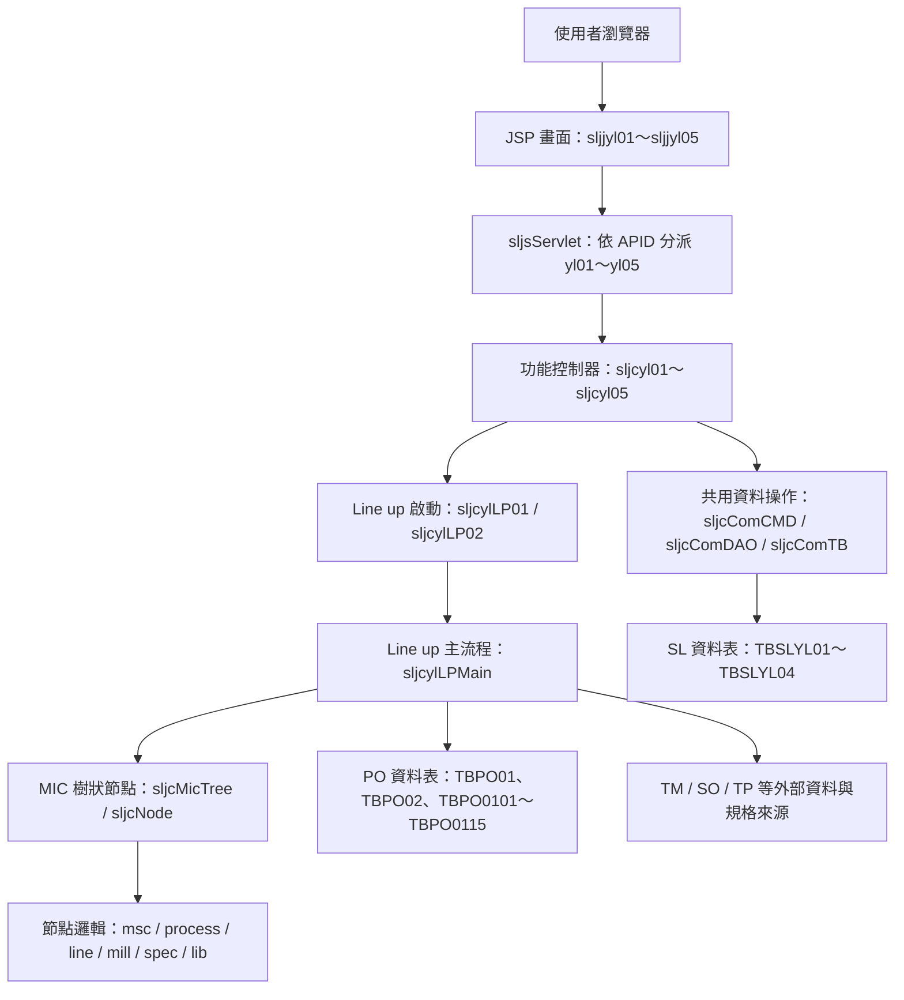
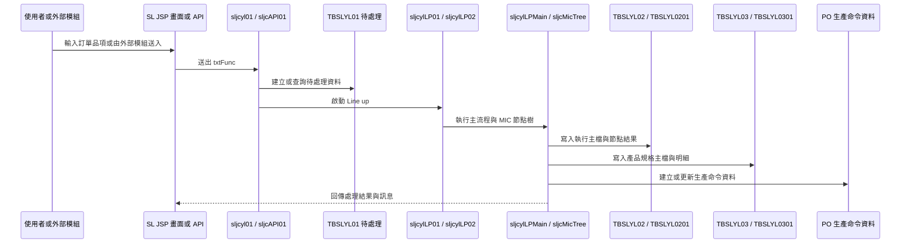

# SL 生產命令建立系統功能規格手冊

## 1. 系統概述

### 1.1 系統目的

`SL` 模組為生產命令建立與 Line up 處理系統，主要依據銷售訂單品項資料、規格資料、製程與設備條件，自動或人工觸發建立生產命令相關資料。系統處理結果會保留 Line up 執行紀錄、節點明細、規格查詢資料，並與 `PO` 生產命令資料表銜接。

本模組提供下列主要能力：

- 建立待 Line up 訂單清單，供使用者查詢、新增、修改、刪除與啟動 Line up。
- 查詢已執行 Line up 的歷史紀錄，支援再處理與結果明細檢視。
- 查詢 Line up 後產生的產品規格與動態欄位資料。
- 維護產品規格欄位定義，作為規格查詢與明細呈現的欄位中繼資料。
- 提供外部程式介面，供其他模組建立待 Line up 資料、啟動 Line up、查詢生產命令規格與 Line up 日期。

### 1.2 使用對象

- 業務或訂單相關人員：確認訂單品項是否已進入 Line up，必要時查詢或重送。
- 生管／生產規劃人員：檢視 Line up 結果、再處理失敗或異常案件。
- 系統維護人員：維護產品規格欄位定義，檢視 Line up 節點與錯誤明細。
- 其他 ERP 模組：透過 `sljcAPI01`、`sljcInApi` 取得 Line up 或生產命令規格資料。

### 1.3 作業範圍

| 範圍 | 說明 | 主要程式 |
| --- | --- | --- |
| 待處理 Line up | 訂單品項待 Line up 資料建立、查詢、啟動、維護 | `SLJJYL01`、`sljcyl01`、`TBSLYL01` |
| Line up 再處理 | Line up 歷程查詢、單筆再處理、批次再處理、結果明細 | `SLJJYL02`、`sljcyl02`、`TBSLYL02`、`TBSLYL0201` |
| 產品規格查詢 | 查詢 Line up 後產生的規格主檔與規格欄位明細 | `SLJJYL03`、`sljcyl03`、`TBSLYL03`、`TBSLYL0301` |
| 規格欄位定義 | 維護不同規格類型的欄位、欄位型態、群組與必要性 | `SLJJYL04`、`sljcyl04`、`TBSLYL04` |
| 規格查詢檢視 | 以唯讀方式檢視產品規格與欄位明細 | `SLJJYL05`、`sljcyl05`、`TBSLYL03`、`TBSLYL0301` |
| Line up 核心 | 建立生產命令、產品規格、製程、設備、節點執行與結果記錄 | `sljcylLP01`、`sljcylLP02`、`sljcylLPMain`、`sljcMicTree` |

### 1.4 主要資料表

| 資料表 | VO／DAO | 功能定位 | 主要用途 | 關聯功能 |
| --- | --- | --- | --- | --- |
| `DB.TBSLYL01` | `sljcyl01VO`／`sljcyl01DAO` | 待處理 Line up 清單 | 記錄待建立生產命令的訂單品項、尺寸、Line up 起因、指定線別、指定料源、處理狀態與失敗日期時間。 | `SLJJYL01` 待處理作業、`sljcAPI01.inLineup()`、`sljcylLP01` 批次處理來源。 |
| `DB.TBSLYL02` | `sljcyl02VO`／`sljcyl02DAO` | Line up 執行主檔 | 記錄每次 Line up 的執行序號、日期時間、訂單品項、PSR、MIC、尺寸、執行結果與耗時。 | `SLJJYL02` 再處理作業、Line up 結果查詢、`sljcAPI01.getSLspec()` 最近成功紀錄判斷。 |
| `DB.TBSLYL0201` | `sljcyl0201VO`／`sljcyl0201DAO` | Line up 節點結果明細 | 記錄 Line up 節點、父節點、節點類型、節點鍵值、結果狀態、原因與成功旗標。 | `SLJJYL02` 結果明細、`sljcMicTree` 節點執行紀錄、異常追蹤。 |
| `DB.TBSLYL03` | `sljcyl03VO`／`sljcyl03DAO` | Line up 產品規格主檔 | 記錄 Line up 後產生的產品規格主資訊，包含訂單品項、Line up 序號、PSR、用途、MIC 與尺寸。 | `SLJJYL03` 產品規格查詢、`SLJJYL05` 規格檢視、`sljcAPI01.getSLspec()`。 |
| `DB.TBSLYL0301` | `sljcyl0301VO`／`sljcyl0301DAO` | Line up 產品規格明細 | 以 `KEYTYPE`、`KEYNO` 與 `FIELD01`～`FIELD42` 儲存動態規格欄位內容。 | `SLJJYL03` 規格明細、`SLJJYL05` 規格明細、`TBSLYL04` 欄位定義解析。 |
| `DB.TBSLYL04` | `sljcyl04VO`／`sljcyl04DAO` | 產品規格欄位定義 | 定義不同規格類型的欄位序號、欄位名稱、欄位型態、大小、群組、必填設定與選項代號。 | `SLJJYL04` 欄位定義維護、`SLJJYL03`／`SLJJYL05` 動態欄位顯示。 |
| `DB.TBSOCO02` | 共用代碼 DAO／`dejcSelect` 查詢 | 系統代碼與 Line up 設定 | 提供 `SL01`～`SL06`、`SLLP`、`SLLOG` 等代碼，用於畫面名稱轉換、Line up 模式與日誌等級設定。 | 各 JSP 下拉選單與代碼翻譯、`sljcylLP02.getLineupMode()`、`sljcLpLog`。 |
| `DB.TBPO01` | `pojctb01`／`pojctb01DAO` | 鋼捲類生產命令主檔 | 儲存一般鋼捲類生產命令主資料，包含訂單、品名、規格、尺寸、交期、廠別、狀態等。 | `sljc_msc.setPO01()`、Line up 成功後生產命令建立與狀態更新。 |
| `DB.TBPO02` | `pojctb02`／`pojctb02DAO` | 鋼管類生產命令主檔 | 儲存鋼管類生產命令主資料，包含鋼管尺寸、加工、標示、廠別、狀態等。 | `sljc_msc.setPO02()`、鋼管訂單 Line up、再處理作業。 |
| `DB.TBPO0101`～`DB.TBPO0115` | `pojctb0101`～`pojctb0115`／對應 DAO | 鋼捲類生產命令明細 | 儲存製程、訂單規格、MIC、設備參數、子訂單、材料與其他生產命令明細。 | `sljc_mill_*`、`sljc_spec_*`、`sljcylLPMain` 生產命令產生流程。 |
| `DB.TBPO0201` | `pojctb0201`／`pojctb0201DAO` | 鋼管類 MIC 明細 | 儲存鋼管類生產命令 MIC 或製程明細資料。 | 鋼管類 Line up、`sljc_msc.setPO02()` 後續明細建立。 |
| `DB.TBPOPRODSPEC` | `pojcProdSpecVO`／`pojcProdSpecDAO` | 成品規格資料 | 儲存 Line up 產出的成品規格資料，供 `PO` 與後續製造流程使用。 | `sljc_spec_coil`、`sljc_spec_pipe`、產品規格產生。 |
| `DB.TBPOSEMIPRODSPEC` | `pojcSemiProdSpecVO`／`pojcSemiProdSpecDAO` | 半成品規格資料 | 儲存 Line up 產出的半成品規格資料。 | `sljc_spec_*`、半成品規格產生與製程串接。 |

## 2. 系統架構總覽

### 2.1 程式分層

本系統採 JSP、Servlet／Controller、共用 DAO、Line up 核心邏輯與資料表分層。

### 2.2 前端畫面架構

| 功能 | 主要畫面 | 說明 |
| --- | --- | --- |
| 待處理作業 | `sljjyl01Main.jsp`、`sljjyl0101Edit.jsp`、`sljjyl01List.jsp`、`sljjyl01Search.jsp` | 提供待處理訂單品項輸入、查詢、進階查詢、資料維護與啟動 Line up。 |
| 再處理作業 | `sljjyl02Main.jsp`、`sljjyl0201Edit.jsp`、`sljjyl0202List.jsp`、`sljjyl02List.jsp`、`sljjyl02Search.jsp` | 查詢 Line up 紀錄、顯示執行結果、再處理與明細清單。 |
| 規格查詢 | `sljjyl03Main.jsp`、`sljjyl0301Edit.jsp`、`sljjyl0302List.jsp`、`sljjyl0302Edit.jsp` | 查詢產品規格主檔與動態規格欄位。 |
| 欄位定義 | `sljjyl04Main.jsp`、`sljjyl04List.jsp` | 維護 `TBSLYL04` 規格欄位定義。 |
| 規格唯讀查詢 | `sljjyl05Main.jsp`、`sljjyl0502List.jsp`、`sljjyl0502Edit.jsp` | 以查詢方式檢視 `TBSLYL03` 與 `TBSLYL0301`。 |

### 2.3 後端控制器架構

`sljsServlet` 接收 `/erp/sl/sljsServlet?APID=ylXX` 請求後，依 `APID` 分派至對應控制器。控制器再依 `txtFunc` 與 `step` 決定要執行查詢、新增、修改、刪除、Line up 或再處理。

| `APID` | 控制器 | 對應資料表 | 主要 `txtFunc` |
| --- | --- | --- | --- |
| `yl01` | `sljcyl01` | `TBSLYL01` | `FQ` 進階查詢、`QP` 查詢、`SLP` 啟動 Line up、`NP` 新增、`UP` 修改、`DP` 刪除 |
| `yl02` | `sljcyl02` | `TBSLYL02`、`TBSLYL0201` | `FQ` 進階查詢、`QP` 查詢、`RP` 再處理、`BTRP` 批次再處理、`SOPRICE1`、`SOPRICE2`、`SOTOCSC`、`DP` 刪除 |
| `yl03` | `sljcyl03` | `TBSLYL03`、`TBSLYL0301` | `FQ` 進階查詢、`QP` 查詢主檔與明細 |
| `yl04` | `sljcyl04` | `TBSLYL04` | `QP` 查詢、`NP` 新增、`UP` 修改、`DP` 刪除 |
| `yl05` | `sljcyl05` | `TBSLYL03`、`TBSLYL0301` | 固定以 `QP` 查詢 |

### 2.4 Line up 核心架構

Line up 核心由 `sljcylLP01`、`sljcylLP02`、`sljcylLPMain` 與 `logic` 套件共同完成。

| 元件 | 職責 |
| --- | --- |
| `sljcylLP01` | 以 Thread 方式啟動單筆或多筆 Line up，並呼叫 `sljcylLP02`。 |
| `sljcylLP02` | 判斷 Line up 模式，執行新舊版 Line up 流程，處理交易、備份、檢核與結果更新。 |
| `sljcylLPMain` | 新版 Line up 主流程，負責讀取訂單資料、建立 Line up 紀錄、檢核資料、建立 MIC 樹、寫入生產命令與結果狀態。 |
| `sljcMicTree` | 依 MIC 結構建立節點樹，依序執行 `forward`、子節點、`backward`、`end`，並將節點結果寫入 `TBSLYL0201`。 |
| `sljcNode` | 所有節點的抽象基底，定義 `msc`、`process`、`line`、`mill`、`spec`、`lib` 等節點型態。 |
| `sljc_msc` | 產生命令主檔與鋼捲／鋼管相關 `PO` 主資料。 |
| `sljc_process` | 控制製程節點與下層線別組合。 |
| `sljc_line` | 處理線別節點、設備與規格關聯。 |
| `sljc_mill_*` | 依設備代碼處理各設備 MIC 與參數。 |
| `sljc_spec_*` | 產生成品／半成品規格資料，並寫入 `TBSLYL0301` 或 `PO` 規格資料。 |

### 2.5 設定與中繼資料

`config/yl/sl/sl_config.ini` 定義 Line up 所需的動態邏輯與 DAO／VO 對應：

- `*_logic`：對應 `TM` DataDepot 類別，例如厚度公差、寬度公差、包裝方式、材料代碼、鋼管外徑公差、拉力、硬度等規格計算來源。
- `tbpo*_dao`、`tbpo*_vo`：對應 `PO` 生產命令資料表的 DAO 與 VO。
- `tbslyl03_dao`、`tbslyl0301_dao`：對應 Line up 規格主檔與明細。
- `*_auto_commit`：定義資料寫入是否由個別 DAO 自行提交；目前主要設定為 `N`，由 Line up 主流程交易控制。

### 2.6 主要資料流

## 3. 功能模組詳細說明

### 3.1 `SLJJYL01` 生產命令建立待處理作業

#### 3.1.1 功能目的

本功能管理待執行 Line up 的訂單品項。使用者可依訂單品項查詢資料、建立待處理資料、修改指定線別或料源、刪除待處理資料，並啟動 Line up。

#### 3.1.2 使用畫面

- 主畫面：`jsp/sljjyl01Main.jsp`
- 編輯畫面：`jsp/sljjyl0101Edit.jsp`
- 清單畫面：`jsp/sljjyl01List.jsp`
- 進階查詢：`jsp/sljjyl01Search.jsp`
- 查詢彈窗：`jsp/sljjyl01Popup.jsp`

#### 3.1.3 控制器與流程

- 控制器：`src/com/icsc/sl/sljcyl01.java`
- 資料表：`DB.TBSLYL01`
- 主鍵：`COMPID`、`ORDERITEMNO`

| 動作 | `txtFunc` | 說明 |
| --- | --- | --- |
| 進階查詢 | `FQ` | 依條件查詢 `TBSLYL01` 待處理清單。 |
| 單筆查詢 | `QP` | 依公司別與訂單品項查詢待處理資料。 |
| 啟動 Line up | `SLP` | 建立 `sljcylLP01`，設定訂單品項後啟動 Thread。 |
| 新增 | `NP` | 新增 `TBSLYL01` 待處理資料。 |
| 修改 | `UP` | 修改待處理資料，例如尺寸、指定線別、指定料源與狀態。 |
| 刪除 | `DP` | 刪除待處理資料。 |

#### 3.1.4 主要欄位

| 欄位 | 說明 |
| --- | --- |
| `ORDERITEMNO` | 訂單品項合併鍵。 |
| `ORDERNO`、`ORDERITEM` | 訂單號碼與項次。 |
| `UPDATEDATE`、`UPDATETIME`、`UPDATEEMPL`、`UPDATEDEPT` | 異動日期、時間、人員與部門。 |
| `LINEUPCAUSE` | Line up 起因，代碼來源為 `SL01`。 |
| `SIZE1`、`SIZE2`、`SIZE3` | 訂單尺寸資料。 |
| `SETLINENO` | 指定線別。 |
| `SETMATSOURCE` | 指定料源。 |
| `LINEUPSTATUS` | 處理狀態，代碼來源為 `SL06`。 |
| `FAILUREDATE`、`FAILURETIME` | 失敗日期與時間。 |

#### 3.1.5 業務規則

- 啟動 Line up 時必須有 `ORDERITEMNO`；若空白，控制器回傳無法啟動 Line up 訊息。
- 啟動後由 `sljcylLP01` 非同步處理，畫面再查詢 `TBSLYL01` 顯示目前狀態。
- 待處理資料可由畫面新增，也可由外部 API `sljcAPI01.inLineup()` 建立。

### 3.2 `SLJJYL02` 生產命令建立再處理作業

#### 3.2.1 功能目的

本功能查詢 Line up 歷程與結果，並支援重新執行單筆或批次 Line up。使用者可依訂單品項、日期區間、起因、結果、節點鍵值等條件查詢。

#### 3.2.2 使用畫面

- 主畫面：`jsp/sljjyl02Main.jsp`
- 編輯畫面：`jsp/sljjyl0201Edit.jsp`
- 結果明細清單：`jsp/sljjyl0202List.jsp`
- 查詢清單：`jsp/sljjyl02List.jsp`
- 進階查詢：`jsp/sljjyl02Search.jsp`
- 查詢彈窗：`jsp/sljjyl02Popup.jsp`

#### 3.2.3 控制器與流程

- 控制器：`src/com/icsc/sl/sljcyl02.java`
- 主檔資料表：`DB.TBSLYL02`
- 明細資料表：`DB.TBSLYL0201`
- 主檔主鍵：`COMPID`、`LINEUPLOGNO`

| 動作 | `txtFunc` | 說明 |
| --- | --- | --- |
| 進階查詢 | `FQ` | 查詢 Line up 歷程清單。 |
| 單筆查詢 | `QP` | 依訂單品項查詢最近 Line up 紀錄。 |
| 新增 | `NP` | 新增 Line up 主檔資料。 |
| 修改 | `UP` | 修改 Line up 主檔資料。 |
| 再處理 | `RP` | 依現有 Line up 紀錄重新執行。 |
| 批次再處理 | `BTRP` | 依畫面權限按鈕啟動批次再處理。 |
| 訂單價格更新 | `SOPRICE1`、`SOPRICE2` | 依訂單或品項觸發 SO 價格更新相關流程。 |
| 訂單傳 CSC | `SOTOCSC` | 觸發 SO 訂單傳送 CSC 的輔助功能。 |
| 刪除 | `DP` | 刪除 Line up 主檔。 |

#### 3.2.4 主要欄位

| 資料表 | 欄位 | 說明 |
| --- | --- | --- |
| `TBSLYL02` | `LINEUPLOGNO` | Line up 執行序號。 |
| `TBSLYL02` | `LINEUPDATE`、`LINEUPTIME` | Line up 日期與時間。 |
| `TBSLYL02` | `ORDERNO`、`ORDERITEM`、`ORDERITEMNO` | 訂單號碼、項次與合併鍵。 |
| `TBSLYL02` | `PSRNO`、`PURPOSENO`、`MICNO` | PSR、用途與 MIC 編號。 |
| `TBSLYL02` | `SIZE1`、`SIZE2`、`SIZE3` | 尺寸資料。 |
| `TBSLYL02` | `LINEUPRESULT` | Line up 結果，代碼來源為 `SL06`。 |
| `TBSLYL02` | `SPENDTIME` | 執行耗時。 |
| `TBSLYL0201` | `PARENTNO`、`KEYTYPE`、`KEYNO` | 結果節點父鍵、節點類型與節點鍵值。 |
| `TBSLYL0201` | `LINEUPSTATUS`、`LINEUPREASON`、`ISSUCCESS` | 節點處理狀態、原因與成功旗標。 |

#### 3.2.5 業務規則

- 再處理會以既有 Line up 紀錄帶出的訂單品項重新執行。
- `sljjyl0202List.jsp` 依 `LINEUPLOGNO` 查詢 `TBSLYL0201`，顯示節點結果與錯誤原因。
- 結果代碼與狀態代碼由 `TBSOCO02` 的 `SL` 系統代碼轉換顯示。

### 3.3 `SLJJYL03` 產品規格查詢作業

#### 3.3.1 功能目的

本功能查詢 Line up 執行後產生的產品規格資料。主檔記錄訂單品項與 Line up 序號，明細則依規格類型保存動態欄位。

#### 3.3.2 使用畫面

- 主畫面：`jsp/sljjyl03Main.jsp`
- 主檔畫面：`jsp/sljjyl0301Edit.jsp`
- 明細清單：`jsp/sljjyl0302List.jsp`
- 明細畫面：`jsp/sljjyl0302Edit.jsp`
- 查詢清單：`jsp/sljjyl03List.jsp`
- 進階查詢：`jsp/sljjyl03Search.jsp`
- 查詢彈窗：`jsp/sljjyl03Popup.jsp`

#### 3.3.3 控制器與流程

- 控制器：`src/com/icsc/sl/sljcyl03.java`
- 主檔資料表：`DB.TBSLYL03`
- 明細資料表：`DB.TBSLYL0301`

| 步驟 | 動作 | 說明 |
| --- | --- | --- |
| `step0` | 查詢主檔 | 若未輸入 `LINEUPLOGNO`，依 `ORDERITEMNO` 查詢最近 Line up 規格；若有 `LINEUPLOGNO`，依主鍵查詢。 |
| `step1` | 查詢明細 | 依 `COMPID`、`LINEUPLOGNO`、`KEYTYPE`、`KEYNO` 查詢 `TBSLYL0301`。 |
| `queryMeta` | 查欄位定義 | 依 `TBSLYL04` 的 `KEYTYPE` 取得欄位群組與欄位說明，用於動態呈現規格內容。 |

#### 3.3.4 主要欄位

| 資料表 | 欄位 | 說明 |
| --- | --- | --- |
| `TBSLYL03` | `LINEUPLOGNO` | Line up 執行序號。 |
| `TBSLYL03` | `LINEUPDATE`、`LINEUPTIME` | Line up 日期與時間。 |
| `TBSLYL03` | `ORDERNO`、`ORDERITEM`、`ORDERITEMNO` | 訂單號碼、項次與合併鍵。 |
| `TBSLYL03` | `PSRNO`、`PURPOSENO`、`MICNO` | PSR、用途與 MIC 編號。 |
| `TBSLYL0301` | `KEYCLASS`、`KEYTYPE`、`KEYNO` | 規格分類、規格類型與規格鍵值。 |
| `TBSLYL0301` | `FIELD01`～`FIELD42` | 動態規格欄位。 |

#### 3.3.5 業務規則

- `TBSLYL0301` 的欄位本身為通用欄位，實際欄位名稱與群組需依 `TBSLYL04` 解析。
- `KEYTYPE` 的中文顯示由 `TBSOCO02` 代碼類型 `SL04` 轉換。
- 明細畫面以 `TBSLYL04` 的欄位定義控制顯示內容，避免每一種規格類型都建立獨立資料表。

### 3.4 `SLJJYL04` 產品規格欄位定義作業

#### 3.4.1 功能目的

本功能維護產品規格查詢所需的欄位中繼資料。不同 `KEYTYPE` 可設定不同欄位序號、名稱、型態、大小、說明、群組、必填旗標與選項代號。

#### 3.4.2 使用畫面

- 主畫面：`jsp/sljjyl04Main.jsp`
- 清單與編輯：`jsp/sljjyl04List.jsp`

#### 3.4.3 控制器與流程

- 控制器：`src/com/icsc/sl/sljcyl04.java`
- 資料表：`DB.TBSLYL04`
- 主鍵：`COMPID`、`KEYTYPE`、`FIELDNO`

| 動作 | `txtFunc` | 說明 |
| --- | --- | --- |
| 查詢 | `QP` | 依公司別與 `KEYTYPE` 查詢欄位定義。 |
| 新增 | `NP` | 依畫面多列輸入新增欄位定義。 |
| 修改 | `UP` | 依畫面多列輸入更新欄位定義。 |
| 刪除 | `DP` | 依畫面多列輸入刪除欄位定義。 |

#### 3.4.4 主要欄位

| 欄位 | 說明 |
| --- | --- |
| `KEYTYPE` | 規格類型，代碼來源為 `SL04`。 |
| `FIELDNO` | 欄位序號，對應 `TBSLYL0301.FIELDxx`。 |
| `FIELDNAME` | 欄位名稱。 |
| `FIELDTYPE` | 欄位型態，代碼來源為 `SL05`。 |
| `FIELDSIZE` | 欄位大小。 |
| `FIELDMEMO` | 欄位說明。 |
| `GROUPNO` | 群組序號。 |
| `GROUPREQ` | 群組必要性或必填設定。 |
| `SELECTERNO` | 選項代號或下拉來源。 |

#### 3.4.5 業務規則

- 查詢、更新、刪除都以 `KEYTYPE` 為主要作業單位。
- 編輯畫面支援多列欄位資料一次送出，控制器使用 `insertOfList`、`updateOfList`、`deleteOfList` 處理。
- 本定義會影響 `SLJJYL03` 與 `SLJJYL05` 的規格欄位顯示。

### 3.5 `SLJJYL05` 產品規格查詢作業

#### 3.5.1 功能目的

本功能提供產品規格的查詢檢視，使用 `TBSLYL03` 與 `TBSLYL0301` 作為資料來源，流程與 `SLJJYL03` 相近，但畫面定位偏向查詢與檢視。

#### 3.5.2 使用畫面

- 主畫面：`jsp/sljjyl05Main.jsp`
- 明細清單：`jsp/sljjyl0502List.jsp`
- 明細畫面：`jsp/sljjyl0502Edit.jsp`

#### 3.5.3 控制器與流程

- 控制器：`src/com/icsc/sl/sljcyl05.java`
- 主檔資料表：`DB.TBSLYL03`
- 明細資料表：`DB.TBSLYL0301`
- 固定查詢動作：`txtFunc = QP`

#### 3.5.4 業務規則

- 畫面載入時以查詢為主，不提供待處理或 Line up 啟動功能。
- 明細欄位同樣依 `TBSLYL04` 的 `KEYTYPE` 定義解析。
- 適用於需要檢視 Line up 規格結果，但不需要進入維護流程的場景。

### 3.6 Line up 核心處理模組

#### 3.6.1 功能目的

Line up 核心負責將訂單品項轉換為生產命令、製程、MIC、產品規格與節點結果。此流程同時處理資料檢核、規格轉換、設備與線別選擇、交易控制、錯誤記錄與結果狀態更新。

#### 3.6.2 主要程式

| 程式 | 說明 |
| --- | --- |
| `sljcylLP01` | Thread 啟動器，可單筆處理指定 `ORDERITEMNO`，也可批次處理 `TBSLYL01` 待處理資料。 |
| `sljcylLP02` | Line up 協調器，依 `SLLP` 設定選擇新版或舊版流程，並處理備份、交易、錯誤與結果。 |
| `sljcylLPMain` | 新版主流程，建立 `LINEUPLOGNO`，讀取訂單資料，檢核資料，建立 MIC 樹並產生 `PO` 與 `SL` 結果。 |
| `sljcylLPFunc` | Line up 共用功能，包含資料建立、結果明細與 `PO` 輔助處理。 |
| `sljcLpRecord` | 寫入 `TBSLYL01`、`TBSLYL02`、`TBSLYL0201` 等 Line up 記錄。 |
| `sljcLpLog` | Line up 執行記錄與日誌。 |
| `sljcMicTree` | 依 MIC 結構查詢結果建立節點樹並執行。 |

#### 3.6.3 處理流程

1. 接收訂單品項：來源可能為 `SLJJYL01` 畫面、`SLJJYL02` 再處理或 `sljcAPI01.inLineup()`。
2. 建立或取得待處理資料：待處理資料記錄於 `TBSLYL01`。
3. 啟動 `sljcylLP01`：以 Thread 執行，避免畫面同步等待長時間 Line up。
4. `sljcylLP02` 判斷 Line up 模式：依 `TBSOCO02` 的 `SLLP` 設定決定新舊流程。
5. `sljcylLPMain` 建立 Line up 主檔：建立 `TBSLYL02`、產生 `LINEUPLOGNO`、記錄日期時間與訂單資訊。
6. 讀取訂單與規格來源：取得 `SO`、`TM`、`TP` 等模組資料，並檢核 PSR、訂單狀態、包裝、尺寸、公差等條件。
7. 建立 `sljcMicTree`：依 MIC 結構產生 `msc`、`process`、`line`、`mill`、`spec`、`lib` 節點。
8. 節點執行：每個節點依序執行 `forward`、子節點、`backward`、`end`。
9. 產生資料：寫入 `TBPO01`、`TBPO02`、`TBPO0101`～`TBPO0115`、`TBPO0201`、`TBPOPRODSPEC`、`TBSLYL03`、`TBSLYL0301` 等資料。
10. 更新結果：成功時更新 `TBSLYL02.LINEUPRESULT`，刪除 `TBSLYL01` 待處理資料，並更新生產命令狀態；失敗時保留錯誤明細於 `TBSLYL0201`。

#### 3.6.4 節點類型

| 節點類型 | 代碼 | 說明 |
| --- | --- | --- |
| MIC 主節點 | `msc` | Line up 根節點，負責整體生產命令主體建立。 |
| 製程節點 | `process` | 製程層級節點，負責下層線別組合與流程控制。 |
| 線別節點 | `line` | 線別層級節點，負責線別資料、設備與規格組合。 |
| 設備節點 | `mill` | 設備層級節點，依 `sljc_mill_*` 實作各設備邏輯。 |
| 規格節點 | `spec` | 規格層級節點，依 `sljc_spec_*` 產生產品規格。 |
| 規格庫節點 | `lib` | 規格欄位或資料庫邏輯節點，搭配 `TM` DataDepot 取得規格值。 |

#### 3.6.5 重要輸出

| 輸出 | 說明 |
| --- | --- |
| `TBSLYL02` | Line up 主紀錄與結果。 |
| `TBSLYL0201` | 節點執行明細、失敗原因與成功旗標。 |
| `TBSLYL03` | Line up 後產品規格主資料。 |
| `TBSLYL0301` | Line up 後產品規格明細。 |
| `TBPO01` | 一般鋼捲類生產命令主檔。 |
| `TBPO02` | 鋼管類生產命令主檔。 |
| `TBPO0101`～`TBPO0115` | 製程、規格、MIC、子訂單等生產命令明細。 |
| `TBPO0201` | 鋼管 MIC 明細。 |
| `TBPOPRODSPEC`、`TBPOSEMIPRODSPEC` | 成品與半成品規格。 |

### 3.7 外部介面模組

#### 3.7.1 `sljcAPI01`

`sljcAPI01` 提供其他模組使用的 Line up 與規格查詢 API。

| 方法 | 說明 |
| --- | --- |
| `inLineup(Object inObj, String lineupType)` | 由外部資料建立 `TBSLYL01` 待處理資料，必要時直接啟動 Line up。 |
| `getLineupValue(Object inObj, String lineupType)` | 將外部訂單資料轉換為 `SL` 待處理欄位。 |
| `getPOspec(String ordNo, String itemNo, String lineNo)` | 查詢 `TBPO0104` 的生產命令規格資料。 |
| `getSLspec(String ordNo, String itemNo, String lineNo)` | 依最近成功 Line up 的 `LINEUPLOGNO` 查詢 `TBSLYL03`、`TBSLYL0301` 與 `TBSLYL04`，回傳規格 Map。 |
| `getLineUpDate(String orderNo, String itemNo)` | 查詢訂單品項最近 Line up 日期。 |

#### 3.7.2 `sljcInApi`

`sljcInApi` 為內部串接 API，目前可見功能為依訂單 VO 與品項 VO 處理特殊產品規格資料，例如 `setSPOrderSpec(sojcOrderVO, sojcItemVO, action)`。此類 API 用於 `SO`、`PO` 或規格轉換流程中，協助 Line up 取得或設定必要規格資訊。

### 3.8 共用資料操作模組

#### 3.8.1 功能目的

`sljcComCMD`、`sljcComDAO`、`sljcComTB` 提供本模組共用的資料查詢與異動能力，讓各功能控制器可用一致方式操作不同資料表。

#### 3.8.2 主要能力

| 元件 | 能力 |
| --- | --- |
| `sljcComCMD` | 提供 `fuzzyQuery`、`insert`、`update`、`delete`、`queryPK`、`querySQL`、`insertOfList`、`updateOfList`、`deleteOfList` 等控制器常用方法。 |
| `sljcComDAO` | 組合 SQL、處理欄位資料、執行資料庫查詢與異動。 |
| `sljcComTB` | 封裝 Request、Hashtable、Vector 與資料表欄位值，作為畫面與控制器間的資料載體。 |

#### 3.8.3 交易原則

- 一般畫面新增或修改可由控制器呼叫共用資料操作方法。
- Line up 主流程涉及多張 `SL`、`PO`、`TM` 資料表，主要由 `sljcylLP02`、`sljcylLPMain` 控制交易提交與回復。
- `sl_config.ini` 中多數 `*_auto_commit` 設為 `N`，表示資料寫入須納入外層交易控管。

### 3.9 代碼與狀態管理

本模組透過 `TBSOCO02` 的系統代碼轉換畫面顯示名稱與邏輯設定。

| 代碼類型 | 用途 |
| --- | --- |
| `SL01` | Line up 起因。 |
| `SL02` | Line up 結果節點類型。 |
| `SL03` | Line up 結果狀態。 |
| `SL04` | 規格類型。 |
| `SL05` | 規格欄位型態。 |
| `SL06` | Line up 處理結果或處理狀態。 |
| `SLLP` | Line up 模式設定，用於判斷新版或舊版流程。 |
| `SLLOG` | Line up 日誌等級或日誌相關設定。 |

### 3.10 異常與紀錄

Line up 過程中若發生資料缺漏、規格不符、設定錯誤或資料寫入失敗，系統會透過下列方式留下證據：

- `sljcLpLog` 寫入 Line up 執行日誌。
- `sljcLpRecord.updSL0201()` 寫入節點結果與失敗原因。
- `TBSLYL02.LINEUPRESULT` 記錄主檔結果。
- `TBSLYL01.LINEUPSTATUS`、`FAILUREDATE`、`FAILURETIME` 保留待處理失敗狀態。
- 成功時刪除 `TBSLYL01` 待處理資料，並更新 `PO` 生產命令狀態。

### 3.11 權限與操作限制

- 功能入口透過 ERP 共用框架 `de300.run()` 檢查使用者是否具備程式使用權限。
- 部分按鈕依使用者代號顯示，例如批次再處理與 SO 價格更新相關功能在 JSP 中限制特定人員可見。
- 重要資料異動須透過畫面 `txtFunc` 與控制器流程執行，不建議直接異動資料表。

### 3.12 維護注意事項

- 修改 Line up 規格欄位顯示時，需同步確認 `TBSLYL04` 定義與 `TBSLYL0301.FIELDxx` 寫入邏輯。
- 修改 Line up 節點邏輯時，需確認 `sljcMicTree` 節點順序、`sljcNode` 執行週期與 `TBSLYL0201` 結果記錄。
- 修改 `PO` 寫入邏輯時，需確認 `sl_config.ini` 中 DAO／VO 對應與交易設定。
- 若遇到 Line up 成功但規格查不到，應同時檢查 `TBSLYL02.LINEUPRESULT`、`TBSLYL03`、`TBSLYL0301`、`TBSLYL04` 的 `KEYTYPE` 定義。
- 若遇到再處理失敗，優先查看 `TBSLYL0201.LINEUPREASON` 與 Line up 日誌，再追查對應節點類別。
