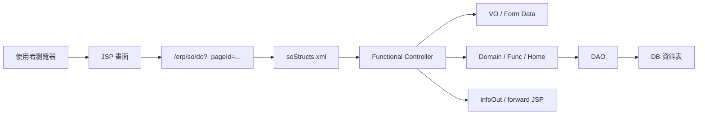
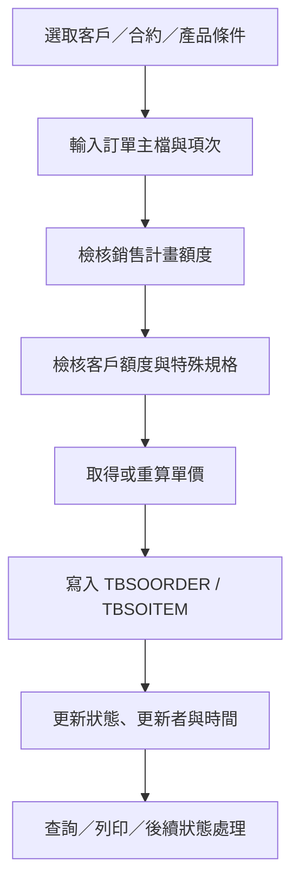
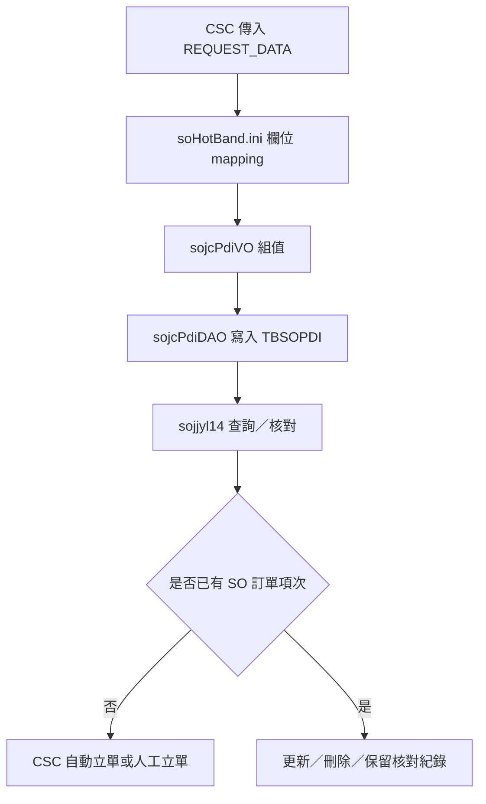
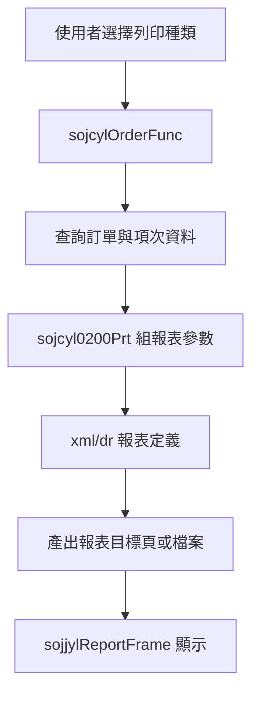

# SO 銷售訂單管理系統功能規格手冊

整理日期：2026-08-19  
整理範圍：`D:\CHSBrowser_erp\erpHome\yl.ear\erp.war\so` 模組  
主要依據：`config/yl/so/soStructs.xml`、`jsp/`、`src/com/icsc/so/`、`dao/`、`dao/sql/`、`xml/dr/`、`files/`、`servlet/`

## 1. 系統概述

### 1.1 系統定位

SO 模組為 ERP 銷售訂單管理系統，主要支援中鴻鋼鐵銷售訂單相關作業。系統涵蓋銷售計畫、客戶額度、產品與規則設定、銷售合約、訂單主檔與項次維護、PDI 下工訂單資料接收與核對、訂單狀態控管、進口標示維護、銷售說明與備註設定、報表列印與外部查詢 API。

本模組以 `JSP` 作為前端畫面，以 `de` 框架的 page-controller 設定檔 `soStructs.xml` 管理頁面、控制器、動作與資料物件；另有 `sojsServlet` 以 `APID` 方式動態派送至 `sojc{apid}` 類別，處理部分傳統多步驟或特殊作業。

### 1.2 使用對象

- 銷售／業務人員：維護客戶、合約、訂單、訂單項次、銷售條件與預計交期。
- 生產／計畫相關人員：維護或查詢銷售計畫、產品別額度、訂單排程、產出資訊。
- 系統管理與主檔維護人員：維護產品類別、規則、代碼、銷售說明、備註與下拉選單資料。
- 外部／介接流程：接收 CSC 下工訂單與 PDI 資訊，提供查詢、報表與銷售資料回傳。

### 1.3 系統目標

- 建立銷售訂單主檔、訂單項次與銷售合約資料的一致維護機制。
- 透過銷售計畫與客戶額度控管，支援訂單建立、異動與刪除前的檢核。
- 接收外部下工訂單／PDI 資訊，輔助訂單核對、更新與轉單。
- 提供訂單狀態管理、取消、轉單、退回與更新流程。
- 支援訂單列印、報表輸出、CSV 產出與外部查詢。

### 1.4 主要資料表

| 資料表 | VO／DAO | 功能定位 | 主要用途 | 關聯功能 |
| --- | --- | --- | --- | --- |
| `db.TBSOORDER` | `sojcOrderVO` / `sojcOrderDAO`；另有 `sojcylOrderVO` / `sojcylOrderDAO` | 銷售訂單主檔 | 保存訂單號碼、客戶、銷售型態、廠別、出貨月份、訂單狀態、價格條件、交期與最後異動資訊。 | 訂單建立／修改／取消、合約轉訂單、交期維護、訂單查詢、訂單列印、外部查詢 API、CSC 自動立單。 |
| `db.TBSOITEM` | `sojcItemVO` / `sojcItemDAO`；另有 `sojcylItemVO` / `sojcylItemDAO` | 銷售訂單項次明細 | 保存項次、品名、規格、厚度、寬度、重量、狀態、生產日期、產出量與備註。 | 訂單項次新增／異動／刪除、計畫額度檢核、客戶額度檢核、PDI 核對、狀態更新、生產資訊維護、CSC 自動立單。 |
| `db.TBSOORDER01` | `sojcOrder01VO` / `sojcOrder01DAO` | 訂單附加文字明細 | 保存訂單 Free Writing 或附加文字描述。 | 訂單主檔維護、訂單複製、訂單列印、特殊說明維護。 |
| `db.TBSOORDER02` | `sojcOrder02VO` / `sojcOrder02DAO` | 付款條件資料 | 保存付款條件或付款條件代碼。 | 付款條件維護、付款條件查詢、訂單列印相關頁面。 |
| `db.TBSOCNTRCT` | `sojcCntrctVO` / `sojcCntrctDAO` | 銷售合約主檔 | 保存合約號、客戶、業務、廠別、出貨月份等合約基本資料。 | 合約主檔維護、訂單建立時選取合約、合約查詢、合約列印。 |
| `db.TBSOCNTRCT01` | `sojcCntrctDetailVO` / `sojcCntrctDetailDAO` | 銷售合約明細 | 保存合約項目與合約明細資料。 | 合約明細新增／修改／刪除、訂單建立參照合約明細、合約列印。 |
| `db.tbsoPlan` | `sojcPlanVO` / `sojcPlanDAO` | 銷售計畫主檔 | 以產品類別與月份控管計畫額度與已使用量。 | 銷售計畫維護、訂單建立／異動時的計畫額度檢核、計畫複製。 |
| `db.tbsoPlan01` | `sojcPlanDetailVO` / `sojcPlanDetailDAO` | 銷售計畫明細 | 保存產品類別下的細項配置與額度條件。 | 銷售計畫明細維護、產品類別額度分配、計畫額度檢核。 |
| `db.tbsoPNType` | `sojcPlanTypeVO` / `sojcPlanTypeDAO` | 銷售計畫產品類別主檔 | 保存銷售計畫使用的產品類別。 | 產品類別維護、銷售計畫分類、訂單額度檢核分類依據。 |
| `db.tbsoPNType01` | `sojcPlanTypeFatVO` / `sojcPlanTypeFatDAO` | 銷售計畫產品類別因子明細 | 保存產品類別判斷因子與條件。 | 產品類別規則設定、產品條件比對、計畫額度歸類。 |
| `db.tbsoCust` | `sojcCustVO` / `sojcCustDAO` | 客戶額度主檔 | 以廠別、客戶與月份控管客戶可接單額度與已使用量。 | 客戶額度維護、訂單建立／異動時的客戶額度檢核、客戶額度複製。 |
| `db.tbsoCust01` | `sojcCustDetailVO` / `sojcCustDetailDAO` | 客戶產品別額度明細 | 保存客戶在不同產品類別下的額度配置。 | 客戶額度明細維護、客戶產品別控管、訂單客戶額度檢核。 |
| `db.tbsoCust02` | `sojcCustSpecVO` / `sojcCustSpecDAO` | 客戶特殊規格條件明細 | 保存客戶特殊規格、範圍或限制條件。 | 客戶特殊規格維護、訂單規格條件檢核、客戶額度細部限制。 |
| `db.tbsoCustType` | `sojcCustTypeVO` / `sojcCustTypeDAO` | 客戶產品類別主檔 | 保存客戶額度使用的產品類別。 | 客戶類別維護、客戶額度分類、客戶額度檢核分類依據。 |
| `db.tbsoCustType01` | `sojcCustTypeFatVO` / `sojcCustTypeFatDAO` | 客戶產品類別因子明細 | 保存客戶產品類別判斷因子與條件。 | 客戶類別規則設定、客戶產品條件比對、客戶額度歸類。 |
| `db.tbsoRule` | `sojcRuleVO` / `sojcRuleDAO` | SO 通用規則主檔 | 保存價格、計畫、客戶等類別規則主設定。 | 價格類別設定、計畫類別設定、客戶類別設定、規則查詢與維護。 |
| `db.tbsoRuleFat` | `sojcRuleFatVO` / `sojcRuleFatDAO` | SO 通用規則因子明細 | 保存規則條件、比對欄位、資料型態與上下限等因子資料。 | 規則條件維護、產品／客戶／價格分類判斷、額度檢核輔助。 |
| `db.TBSOPDI` | `sojcPdiVO` / `sojcPdiDAO` | CSC 下工訂單／PDI 暫存資料 | 保存 CSC 訂單號、功能碼、厚度、寬度、重量、品名、客戶、合約號與更新時間。 | `soHotBand.ini` 介接寫入、PDI 查詢／核對／更新／刪除、CSC 自動立單前置檢核。 |
| `db.tbsoRemark` | `sojcRemarkVO` / `sojcRemarkDAO` | SO 備註主檔 | 保存可套用於 SO 作業的備註資料。 | 備註維護、訂單備註套用、銷售說明輔助。 |
| `db.TBSODESC` / `db.tbsoDesc` | `sojcDescVO` / `sojcDescDAO` | 銷售說明資料 | 保存銷售說明或特殊需求描述。 | 銷售說明維護、特殊需求查詢、訂單說明選取。 |
| `db.tbsoqs00` | `sojcqs00VO` / `sojcqs00DAO` | QS／EC 操作紀錄 | 保存外部操作登入、訂單與項次、操作目標與操作代碼。 | `sojcQsToSo` 外部紀錄寫入、EC／QS 操作追蹤、外部系統稽核輔助。 |
| `db.TBSO13` | `sojcyl13VO` / `sojcyl13DAO` | SO YL13 作業資料 | 保存 YL13 功能相關主檔或作業資料。 | `sojjyl13List` 查詢、新增、修改、刪除。 |
| `db.TBSOCO01`、`db.TBSOCO02`、`db.TBSOCO03`、`db.TBSOCO04` | `sojcco01DAO`、`sojcco02DAO`、`sojcco03DAO`、`sojcco04DAO`；部分程式另以 `sojcComDAO` / `sojcComTB` 動態查詢 | SO 共用代碼資料 | 保存 SO 共用代碼與代碼明細。 | 共用代碼維護、下拉選單、狀態名稱、特殊需求、銷售型態、付款條件等代碼查詢。 |

## 2. 系統架構總覽

### 2.1 程式目錄架構

| 目錄 | 內容說明 |
| --- | --- |
| `config/yl/so/` | 系統頁面設定、熱帶介接設定。核心檔案為 `soStructs.xml`、`soHotBand.ini`。 |
| `jsp/` | SO 模組前端畫面、查詢視窗、清單、主檔維護、報表框架與特殊作業頁。 |
| `servlet/` | `sojsServlet.java`，依 `APID` 動態建立 `com.icsc.so.sojc{apid}` 類別並呼叫 `doStart()`。 |
| `src/com/icsc/so/` | SO 主套件，含訂單、合約、PDI、規則、備註、共用 DAO／VO／Controller。 |
| `src/com/icsc/so/cust/` | 客戶額度、客戶產品別條件、特殊規格與客戶類別維護。 |
| `src/com/icsc/so/plan/` | 銷售計畫、產品別計畫、計畫類別與計畫明細維護。 |
| `src/com/icsc/so/price/` | 價格類別與價格代碼相關輔助程式。 |
| `src/com/icsc/so/quata/` | 額度檢核抽象類別與計畫、客戶、價格額度檢核實作。 |
| `src/com/icsc/so/api/` | `sojcOutApiQS`，提供外部查詢、報表、代碼查詢與服務檢核。 |
| `src/com/icsc/so/dao/` | 訂單／項次紀錄與異動紀錄 DAO／VO。 |
| `src/com/icsc/so/core/` | 訂單列印核心，如 `sojcyl0200Prt`。 |
| `src/com/icsc/so/tag/` | JSP 自訂標籤與下拉選單輔助。 |
| `dao/`、`dao/sql/` | DAO 產生設定與資料表建置 SQL。 |
| `xml/dr/` | 報表 XML 定義，含 `sojryl02SCP.xml`、`sojryl02CA.xml`、`sojryl02RA.xml`。 |
| `files/` | JWS 服務與相關檔案，如 `sojw001.jws`。 |

### 2.2 Page-Controller 架構

`config/yl/so/soStructs.xml` 定義 30 個 page，對應 24 個控制器。典型流程如下：

頁面設定中可見的標準動作包含：

| 動作類型 | 常見 method | 適用情境 |
| --- | --- | --- |
| 初始 | `initial` | 進入維護畫面、初始化按鈕與預設資料。 |
| 查詢 | `query`、`query1`、`queryEdit` | 主檔、清單、彈窗與明細查詢。 |
| 新增 | `create`、`createEdit`、`insert` | 新增計畫、客戶額度、合約、訂單項次或 CSC 自動立單。 |
| 修改 | `update`、`update1`、`updateB`、`updateEdit` | 維護主檔、狀態、交期、生產資訊與明細。 |
| 刪除 | `delete`、`remove`、`deleteEdit` | 刪除主檔或明細資料。 |
| 複製 | `copy` | 複製計畫、客戶額度或訂單相關資料。 |
| 移動 | `next`、`prev` | 維護畫面上一筆／下一筆切換。 |
| 特殊 | `dispatch`、`enactment`、`cancel`、`vertify`、`doImport`、`csv` | 進口標示派送、訂單狀態處理、PDI 核對、資料匯入與 CSV 輸出。 |
| 列印 | `printSC`、`printSCP`、`printSCPForProd`、`printCA`、`printRA` | 訂單相關報表列印。 |

### 2.3 傳統 Servlet 派送架構

除 `soStructs.xml` 的 `/erp/so/do` 路由外，系統也保留 `sojsServlet`：

1. 前端以 `/erp/so/sojsServlet?APID=...` 呼叫。
2. `sojsServlet` 讀取 `APID`，組成 `SOJC{APID}` 權限檢查代碼。
3. 以反射建立 `com.icsc.so.sojc{apid}` 類別。
4. 呼叫 `setDsCom()`、`doStart()`。
5. 依物件回傳的 `getSystemId()`、`getURL()` forward 至下一畫面。

此架構主要出現在訂單多頁籤維護、付款條件、共同代碼、特殊修改金額與報表匯出等舊式作業。

### 2.4 資料存取與交易模式

系統主要以 DAO／VO 模式存取資料：

- `DAO`：封裝 `SELECT`、`INSERT`、`UPDATE`、`DELETE`，例如 `sojcCustDAO`、`sojcPlanDAO`、`sojcOrderDAO`、`sojcPdiDAO`。
- `VO`：對應資料表欄位並提供欄位格式化、ResultSet mapping、key 驗證與訊息累積。
- `Func`／`Home`／Domain class：負責畫面流程、交易包裝、商業規則、複製、檢核與狀態更新。
- `de301`／`dsjccom`：處理 DB connection、交易 commit／rollback、使用者與公司別資訊。

### 2.5 外部介接與報表

| 類型 | 檔案／類別 | 說明 |
| --- | --- | --- |
| CSC 下工訂單資料 | `config/yl/so/soHotBand.ini`、`sojcPdiDAO`、`sojcPdiVO` | 接收外部傳入 PDI／下工訂單欄位並寫入 `db.TBSOPDI`。 |
| QS／EC 操作紀錄 | `sojcQsToSo`、`tbsoqs00` | 將外部操作紀錄寫入 SO 相關資料表。 |
| 外部查詢 API | `src/com/icsc/so/api/sojcOutApiQS.java` | 提供 SQL 查詢結果轉換、代碼名稱查詢、訂單重量更新、報表產生、服務檢核等。 |
| 訂單列印 | `sojcylOrderFunc`、`sojcyl0200Prt`、`xml/dr/sojryl02*.xml` | 依訂單資料產生 SCP、CA、RA 等報表。 |
| JWS 服務 | `files/sojw001.jws` | 提供舊式 Web Service／JWS 服務，含訂單查詢、報表 PDF／CSV 產生與檔案輸出。 |

## 3. 功能模組詳細說明

### 3.1 系統設定與規則維護

#### 3.1.1 產品／客戶／價格類別規則設定

| 頁面 | 控制器 | 主要動作 | 功能說明 |
| --- | --- | --- | --- |
| `sojjPriceTypeSetup` | `com.icsc.so.sojcRuleTypeSetup` | `initial`、`query`、`create`、`update`、`restore` | 價格類別規則設定，供價格或產品分類條件使用。 |
| `sojjRuleSetup` | `com.icsc.so.sojcRuleFunc` | `initial`、`query`、`create`、`update`、`restore` | 通用規則主檔與規則因子維護。 |
| `sojjPlanTypeSetup` | `com.icsc.so.sojcRuleFunc` | `initial`、`query`、`create`、`update`、`restore` | 銷售計畫產品類別規則設定。 |
| `sojjCustTypeSetup` | `com.icsc.so.sojcRuleTypeSetup` | `initial`、`query`、`create`、`update`、`restore` | 客戶額度產品類別規則設定。 |

主要資料表：

- `db.tbsoRule`
- `db.tbsoRuleFat`
- `db.tbsoPNType`
- `db.tbsoPNType01`
- `db.tbsoCustType`
- `db.tbsoCustType01`

功能重點：

- 建立產品、客戶、價格或計畫使用的類別判斷規則。
- 維護規則主檔與規則細項，支援欄位、資料型態、上下限或比對條件。
- 提供後續額度檢核與訂單建立時的分類依據。

### 3.2 銷售計畫管理

| 頁面 | 控制器 | 主要動作 | 功能說明 |
| --- | --- | --- | --- |
| `sojjPlanTypeEdit` | `com.icsc.so.plan.sojcPlanTypeFunc` | `initial`、`query`、`create`、`update`、`remove`、`next`、`prev` | 維護銷售計畫產品類別與類別因子。 |
| `sojjPlanEdit` | `com.icsc.so.plan.sojcPlanFunc` | `create`、`update`、`remove`、`copy`、`query` | 維護產品別、月份別銷售計畫主檔。 |
| `sojjPlanDetail` | `com.icsc.so.plan.sojcPlanDetailFunc` | `query`、`create`、`update`、`remove` | 維護銷售計畫明細配置。 |

主要資料表：

- `db.tbsoPlan`
- `db.tbsoPlan01`
- `db.tbsoPNType`
- `db.tbsoPNType01`

主要程式：

- `src/com/icsc/so/plan/sojcPlan.java`
- `src/com/icsc/so/plan/sojcPlanFunc.java`
- `src/com/icsc/so/plan/sojcPlanDetailFunc.java`
- `src/com/icsc/so/plan/sojcPlanTypeFunc.java`
- `src/com/icsc/so/quata/sojcPlanQuata.java`

功能重點：

- 以產品類別與月份建立銷售計畫額度。
- 支援新增、修改、刪除、查詢與複製計畫。
- 訂單建立或異動時，可透過 `sojcyl02Func.checkPlan()` 與 `sojcPlanQuata` 檢核計畫額度。
- 計畫主檔與明細以產品類別、月份與明細類別作為主要維護鍵值。

### 3.3 客戶額度管理

| 頁面 | 控制器 | 主要動作 | 功能說明 |
| --- | --- | --- | --- |
| `sojjCustEdit` | `com.icsc.so.cust.sojcCustFunc` | `query`、`create`、`update`、`delete`、`copy` | 維護客戶月份額度主檔。 |
| `sojjCustDetailEdit` | `com.icsc.so.cust.sojcCustDetailFunc` | `query`、`create`、`update`、`delete` | 維護客戶產品別額度明細。 |
| `sojjCustSpecEdit` | `com.icsc.so.cust.sojcCustSpecFunc` | `query`、`create`、`update`、`delete` | 維護客戶特殊規格條件。 |
| `sojjCustTypeEdit` | `com.icsc.so.cust.sojcCustTypeFunc` | `initial`、`query`、`create`、`update`、`delete`、`next`、`prev` | 維護客戶類別設定與類別因子。 |

主要資料表：

- `db.tbsoCust`
- `db.tbsoCust01`
- `db.tbsoCust02`
- `db.tbsoCustType`
- `db.tbsoCustType01`

主要程式：

- `src/com/icsc/so/cust/sojcCust.java`
- `src/com/icsc/so/cust/sojcCustDetail.java`
- `src/com/icsc/so/cust/sojcCustFunc.java`
- `src/com/icsc/so/cust/sojcCustDetailFunc.java`
- `src/com/icsc/so/cust/sojcCustSpecFunc.java`
- `src/com/icsc/so/quata/sojcCustQuata.java`

功能重點：

- 以廠別、客戶、月份建立客戶額度主檔。
- 以產品類別與特殊規格條件控制客戶可下單範圍。
- 提供客戶額度複製功能，降低週期性維護成本。
- 訂單異動時，可透過 `sojcyl02Func.checkCust()` 與 `sojcCustQuata` 檢核客戶額度。
- 維護資料時會記錄異動資訊與使用者資訊。

### 3.4 銷售合約管理

| 頁面 | 控制器 | 主要動作 | 功能說明 |
| --- | --- | --- | --- |
| `sojjCntrctEdit` | `com.icsc.so.sojcCntrctFunc` | `query`、`create`、`update` | 維護銷售合約主檔。 |
| `sojjCntrctDetailEdit` | `com.icsc.so.sojcCntrctDetailFunc` | `query`、`create`、`update`、`remove` | 維護合約明細資料。 |
| `sojjCntractSearch`／`sojjCntractList` | JSP 查詢清單 | 查詢 | 合約彈窗查詢與清單選取。 |
| `sojjCntractSearchForOrder`／`sojjCntractListForOrder` | JSP 查詢清單 | 查詢 | 訂單建立時選取合約。 |
| `sojjCntrctPrint` | JSP 列印 | 列印 | 合約資料列印。 |

主要資料表：

- `db.TBSOCNTRCT`
- `db.TBSOCNTRCT01`

功能重點：

- 維護合約主檔與明細。
- 支援從訂單流程選取合約。
- 合約資料可與訂單建立、客戶、銷售人員、廠別與出貨月份連動。

### 3.5 訂單主檔與訂單項次維護

#### 3.5.1 訂單維護入口

訂單主要畫面由 `sojjOrder.jsp`、`sojjModAmt.jsp`、`sojjyl02*.jsp` 等 JSP 組成，部分作業透過 `sojsServlet?APID=yl02` 呼叫 `sojcyl02`，部分列印動作透過 `soStructs.xml` 呼叫 `sojcylOrderFunc`。

主要資料表：

- `db.TBSOORDER`
- `db.TBSOITEM`
- `db.TBSOORDER01`
- `db.TBSOORDER02`

主要程式：

- `src/com/icsc/so/sojcyl02.java`
- `src/com/icsc/so/sojcyl02Func.java`
- `src/com/icsc/so/sojcyl02Trans.java`
- `src/com/icsc/so/sojcyl02Close.java`
- `src/com/icsc/so/sojcOrderDAO.java`
- `src/com/icsc/so/sojcItemDAO.java`
- `src/com/icsc/so/sojcylUpdOrdPrice.java`

#### 3.5.2 訂單處理功能

| 功能 | 程式依據 | 說明 |
| --- | --- | --- |
| 訂單主檔維護 | `sojcyl02.tbsoorder()`、`TBSOORDER` | 建立、查詢、更新訂單主檔。 |
| 訂單項次維護 | `sojcyl02.tbsoitem()`、`TBSOITEM` | 建立、更新、刪除訂單項次，維護品名、規格、重量、狀態等。 |
| Free Writing 描述 | `TBSOORDER01`、`processFW*` | 維護訂單相關文字描述與附加說明。 |
| 付款條件 | `TBSOORDER02`、`sojjyl12*` | 查詢與維護付款條件或付款條件代碼。 |
| 訂單複製 | `copy` 相關流程 | 複製既有訂單／項次資料產生新訂單。 |
| 訂單取消／退回 | `cancelProcess02()`、狀態更新 SQL | 將訂單或項次更新為取消、退回、暫停等狀態。 |
| 價格重算 | `sojcylUpdOrdPrice`、`getUnitPrice()` | 訂單或項次異動後重算單價。 |
| 額度檢核 | `checkPlan()`、`checkCust()` | 建立、修改、刪除時檢查計畫與客戶額度。 |

#### 3.5.3 訂單狀態相關作業

| 頁面 | 控制器 | 主要動作 | 功能說明 |
| --- | --- | --- | --- |
| `sojjyl09List` | `com.icsc.so.sojcYL09` | `query`、`enactment`、`update`、`cancel` | 查詢訂單項次並進行狀態制定、更新或取消。 |
| `sojjyl10List`／`sojjyl10Main` | `com.icsc.so.sojcYL10` | `query`、`create`、`update`、`delete` | 訂單項次查詢與主畫面維護。 |
| `sojjyl10Edit` | `com.icsc.so.sojcYL101` | `queryEdit`、`createEdit`、`updateEdit`、`deleteEdit` | 訂單項次編輯。 |
| `sojjyl11List` | `com.icsc.so.sojcYL11` | `query`、`update`、`updateB` | 查詢特定狀態訂單項次並批次更新。 |
| `sojjyl111List` | `com.icsc.so.sojcYL11` | `query1`、`update1`、`updateB`、`cancel` | 狀態 `17` 類型訂單項次處理。 |
| `sojjyl112List` | `com.icsc.so.sojcYL11` | `query1`、`update1`、`cancel` | 狀態 `17` 類型訂單項次處理。 |
| `sojjyl15List` | `com.icsc.so.sojcYL15` | `query`、`update`、`doImport` | 生產日期、數量、備註等訂單項次生產資訊維護與匯入。 |
| `sojjyl16Edit` | `com.icsc.so.sojcyl16Func` | `query`、`update` | 查詢訂單並更新預計生產完成日、預計出貨日等交期資訊。 |

### 3.6 PDI／CSC 下工訂單管理

| 頁面／設定 | 程式 | 功能說明 |
| --- | --- | --- |
| `soHotBand.ini` | `sojcPdiDAO`、`sojcPdiVO` | 定義 CSC 傳入下工訂單／PDI 欄位與 `TBSOPDI` 寫入規則。 |
| `sojjyl14List` | `com.icsc.so.sojcyl14` | 查詢 `db.TBSOPDI` PDI 清單。 |
| `sojjyl14Edit` | `com.icsc.so.sojcyl14` | 查詢、核對、更新、刪除 PDI 資料。 |
| `sojccscAutoOrderEdit` | `com.icsc.so.sojccscAutoOrder` | 從 CSC／庫存相關資料檢核並產生 SO 訂單項次。 |

PDI 主要欄位包含 CSC 訂單號、功能碼、厚度、寬度、重量、訂單日期、品名、CSC 客戶、鋼種、規格、檢驗碼、產品類別、出貨日期、訂購重量、厚度上下限、寬度上下限、標籤重量上下限、交易模式、交運方式、合約號、精整產線與更新時間等。

功能重點：

- 接收 CSC 端下工訂單資訊並寫入 `db.TBSOPDI`。
- 提供 PDI 查詢、核對、更新與刪除作業。
- 檢查 PDI 是否已建立對應 SO 訂單項次，避免重複立單。
- 可由 `sojccscAutoOrder` 檢核相關資料並自動新增 `TBSOITEM`。

### 3.7 進口標示管理

| 頁面 | 控制器 | 主要動作 | 功能說明 |
| --- | --- | --- | --- |
| `sojjylImportMark` | `com.icsc.so.sojcImportMarking` | `query`、`dispatch`、`update`、`delete` | 查詢、派送、修改、刪除進口標示資料。 |
| `sojjImMark` | JSP | 上傳／查詢入口 | 提供進口標示檔案或資料維護入口。 |

功能重點：

- 維護與訂單或產品相關的進口標示資訊。
- 支援資料查詢、派送、修改與刪除。
- 畫面含檔案上傳或備份 callback 相關邏輯。

### 3.8 銷售說明、備註與代碼維護

| 功能 | 頁面／程式 | 說明 |
| --- | --- | --- |
| 銷售說明維護 | `sojjDesc`、`sojjDescList`、`sojjDescEdit`、`sojcDescFunc` | 維護 `db.TBSODESC` 銷售說明資料。 |
| 特殊需求查詢 | `sojjylSpDescQry` | 查詢 `DB.TBSOCO02` 指定 code type 的特殊需求顯示名稱。 |
| 備註維護 | `sojjRemarkEdit`、`sojcRemarkFunc` | 維護 `db.tbsoRemark` 備註資料。 |
| 共同代碼維護 | `sojjco01*`、`sojjco02*`、`sojcco01`、`sojcco02` | 透過 `sojsServlet?APID=co01/co02` 維護 SO 共用代碼與代碼明細。 |
| 下拉選單 | `sojcSelecter`、`sojcSelectDDDW`、`sojcOutApiQS.genSelMemu()` | 依公司別、系統別、code type 產生下拉選單。 |

功能重點：

- 提供訂單相關文字、說明、特殊需求與代碼資料的集中維護。
- 支援查詢彈窗與主檔畫面連動。
- 共用代碼常用於銷售型態、狀態、廠別、付款條件、特殊需求等欄位。

### 3.9 報表與列印

| 功能 | 頁面／程式 | 說明 |
| --- | --- | --- |
| 訂單列印 | `sojjyl02Print`、`sojcylOrderFunc`、`sojcyl0200Prt` | 依訂單號產生 SCP、CA、RA 等列印內容。 |
| 報表 XML | `xml/dr/sojryl02SCP.xml`、`sojryl02CA.xml`、`sojryl02RA.xml` | 報表格式與 SQL 定義。 |
| 報表框架 | `sojjylReportFrame.jsp` | 以 iframe 顯示產出報表。 |
| PDF／CSV 產出 | `sojw001.jws`、`sojcOutApiQS` | 編譯 XML 到 Jasper，呼叫 DR 工具產生 PDF 或 CSV。 |
| 付款條件列印 | `sojjyl02Print1/2/21/22/3/4` | 依付款條件或訂單資料產生不同列印頁。 |

功能重點：

- 支援訂單相關報表的即時列印與瀏覽。
- 支援 XML 報表模板、Jasper 編譯與 PDF／CSV 檔案產出。
- 報表輸出路徑可由程式組成，並可供外部或 EC 端取得。

### 3.10 外部查詢 API 與服務介接

| 類別／檔案 | 功能說明 |
| --- | --- |
| `sojcOutApiQS` | 提供外部 SQL 查詢結果轉換、代碼查詢、選單產生、訂單重量更新、報表產生與服務檢核。 |
| `sojcQsToSo` | 將 QS／EC 操作紀錄寫入 SO 相關紀錄表。 |
| `sojw001.jws` | 舊式 JWS 服務，提供查詢、報表 PDF／CSV 產生、檔案讀取等服務。 |
| `sojcMQRecv_WHL001` | MQ 接收相關類別，推測用於外部訊息接收。 |

功能重點：

- 提供 SO 資料給外部系統或查詢服務使用。
- 支援代碼轉中文、狀態名稱查詢、客戶最近訂單查詢、報表產生。
- 對查詢結果進行欄位型態轉換，回傳 Vector 或字串格式。
- 部分 API 會更新訂單重量或狀態，需留意交易與權限控管。

### 3.11 額度檢核模組

| 類別 | 說明 |
| --- | --- |
| `sojcQuataAbstract` | 額度檢核抽象基底。 |
| `sojcPlanQuata` | 銷售計畫額度檢核。 |
| `sojcCustQuata` | 客戶額度與特殊規格條件檢核。 |
| `sojcPriceQuata` | 價格額度或價格條件檢核。 |
| `sojcNotSufficientAmountException` | 額度不足例外。 |
| `sojcQuataNoLimitException` | 未設定限制或無限制例外。 |
| `sojcQuataNotFoundException` | 找不到額度設定例外。 |

功能重點：

- 訂單建立、修改、刪除時，由 `sojcyl02Func` 依動作呼叫計畫、客戶與價格檢核。
- 檢核結果會影響訂單項次狀態與單價更新。
- 額度不足或設定不存在時，以例外或訊息回饋前端流程。

### 3.12 CSC 自動立單

| 頁面 | 控制器 | 主要動作 | 功能說明 |
| --- | --- | --- | --- |
| `sojjcscAutoOrderEdit` | `com.icsc.so.sojccscAutoOrder` | `query`、`insert`、`csv` | 查詢 CSC 來源資料，檢核是否已轉 SO 訂單，新增 SO 訂單項次並可輸出 CSV。 |

主要關聯資料：

- `DB.TBIHCR011`
- `DB.TBSOORDER`
- `DB.TBSOITEM`
- `DB.TBDE23`

功能重點：

- 檢查 CSC 來源訂單與 SO 訂單項次是否已存在。
- 查找舊 PSR、MSCNO、新 APN、訂單版本與訂單項次號。
- 依來源資料產生 `TBSOITEM`，並回寫來源狀態。
- 可輸出 CSV，供後續人工檢核或交換使用。

### 3.13 訂單交期與生產資訊維護

| 頁面 | 控制器 | 功能說明 |
| --- | --- | --- |
| `sojjyl15List` | `sojcYL15` | 查詢訂單項次與生產重量，維護生產日期、產出量、備註，並支援資料匯入。 |
| `sojjyl16Edit` | `sojcyl16Func` | 依出貨月份、廠別、銷售型態等條件查詢訂單，更新預計生產完成日與預計出貨日。 |

功能重點：

- 連結 `TBSOITEM`、`TBSOORDER` 與生產端資料，例如 `TBWHYLHR1PDI`。
- 提供生產日期、產出數量、產出備註與預計交期維護。
- 支援以月份、廠別、客戶、銷售型態等條件批次查詢與更新。

### 3.14 權限、日誌與共通服務

| 類型 | 程式／機制 | 說明 |
| --- | --- | --- |
| 權限檢查 | `de300.run()`、`dsagc.check()` | 進入程式或按鈕功能時檢查使用者權限。 |
| 使用者資訊 | `dsjccom` | 取得公司別、使用者 ID、連線資訊。 |
| 異動欄位 | `LASTUPDATEUSER`、`LASTUPDATEDATE`、`LASTUPDATETIME` | 訂單、項次、主檔異動時記錄最後更新資訊。 |
| 日誌 | `dejc318` | 記錄服務、報表、匯入與錯誤訊息。 |
| 訊息 | `zpjcDwMsg`、`infoOut` | 提供前端錯誤、提醒與處理結果。 |

### 3.15 核心流程摘要

#### 3.15.1 訂單建立流程

#### 3.15.2 CSC PDI 接收與核對流程

#### 3.15.3 報表列印流程

## 附錄 A. 主要 Page 對照表

| Page ID | JSP | Controller | 動作 |
| --- | --- | --- | --- |
| `sojjPriceTypeSetup` | `sojjPriceTypeSetup.jsp` | `com.icsc.so.sojcRuleTypeSetup` | `initial`、`query`、`create`、`update`、`restore` |
| `sojjRuleSetup` | `sojjRuleSetup.jsp` | `com.icsc.so.sojcRuleFunc` | `initial`、`query`、`create`、`update`、`restore` |
| `sojjPlanTypeSetup` | `sojjPlanTypeSetup.jsp` | `com.icsc.so.sojcRuleFunc` | `initial`、`query`、`create`、`update`、`restore` |
| `sojjCustTypeSetup` | `sojjCustTypeSetup.jsp` | `com.icsc.so.sojcRuleTypeSetup` | `initial`、`query`、`create`、`update`、`restore` |
| `sojjPlanTypeEdit` | `sojjPlanTypeEdit.jsp` | `com.icsc.so.plan.sojcPlanTypeFunc` | `initial`、`query`、`create`、`update`、`remove`、`next`、`prev` |
| `sojjPlanEdit` | `sojjPlanEdit.jsp` | `com.icsc.so.plan.sojcPlanFunc` | `create`、`update`、`remove`、`copy`、`query` |
| `sojjPlanDetail` | `sojjPlanDetail.jsp` | `com.icsc.so.plan.sojcPlanDetailFunc` | `query`、`create`、`update`、`remove` |
| `sojjCustEdit` | `sojjCustEdit.jsp` | `com.icsc.so.cust.sojcCustFunc` | `query`、`create`、`update`、`delete`、`copy` |
| `sojjCustDetailEdit` | `sojjCustDetailEdit.jsp` | `com.icsc.so.cust.sojcCustDetailFunc` | `query`、`create`、`update`、`delete` |
| `sojjCustSpecEdit` | `sojjCustSpecEdit.jsp` | `com.icsc.so.cust.sojcCustSpecFunc` | `query`、`create`、`update`、`delete` |
| `sojjCustTypeEdit` | `sojjCustTypeEdit.jsp` | `com.icsc.so.cust.sojcCustTypeFunc` | `initial`、`query`、`create`、`update`、`delete`、`next`、`prev` |
| `sojjyl10List` | `sojjyl10List.jsp` | `com.icsc.so.sojcYL10` | `query` |
| `sojjyl10Main` | `sojjyl10Main.jsp` | `com.icsc.so.sojcYL10` | `query`、`create`、`update`、`delete` |
| `sojjyl10Edit` | `sojjyl10Edit.jsp` | `com.icsc.so.sojcYL101` | `queryEdit`、`createEdit`、`updateEdit`、`deleteEdit` |
| `sojjyl11List` | `sojjyl11List.jsp` | `com.icsc.so.sojcYL11` | `query`、`update`、`updateB` |
| `sojjyl111List` | `sojjyl111List.jsp` | `com.icsc.so.sojcYL11` | `query1`、`update1`、`updateB`、`cancel` |
| `sojjyl112List` | `sojjyl112List.jsp` | `com.icsc.so.sojcYL11` | `query1`、`update1`、`cancel` |
| `sojjCntrctEdit` | `sojjCntrctEdit.jsp` | `com.icsc.so.sojcCntrctFunc` | `query`、`create`、`update` |
| `sojjCntrctDetailEdit` | `sojjCntrctDetailEdit.jsp` | `com.icsc.so.sojcCntrctDetailFunc` | `query`、`create`、`update`、`remove` |
| `sojjyl09List` | `sojjyl09List.jsp` | `com.icsc.so.sojcYL09` | `query`、`enactment`、`update`、`cancel` |
| `sojjDescEdit` | `sojjDescEdit.jsp` | `com.icsc.so.sojcDescFunc` | `query`、`create`、`update`、`delete` |
| `sojjRemarkEdit` | `sojjRemarkEdit.jsp` | `com.icsc.so.sojcRemarkFunc` | `query`、`create`、`update`、`delete` |
| `sojjylImportMark` | `sojjylImportMark.jsp` | `com.icsc.so.sojcImportMarking` | `query`、`dispatch`、`update`、`delete` |
| `sojjyl13List` | `sojjyl13List.jsp` | `com.icsc.so.sojcyl13` | `query`、`create`、`update`、`delete` |
| `sojjyl14Edit` | `sojjyl14Edit.jsp` | `com.icsc.so.sojcyl14` | `query`、`vertify`、`update`、`delete` |
| `sojjyl14List` | `sojjyl14List.jsp` | `com.icsc.so.sojcyl14` | `query` |
| `sojjyl15List` | `sojjyl15List.jsp` | `com.icsc.so.sojcYL15` | `query`、`update`、`doImport` |
| `sojjyl16Edit` | `sojjyl16Edit.jsp` | `com.icsc.so.sojcyl16Func` | `query`、`update` |
| `sojjyl02Print` | `sojjyl02Print.jsp` | `com.icsc.so.sojcylOrderFunc` | `printSC`、`printSCP`、`printSCPForProd`、`printCA`、`printRA` |
| `sojjcscAutoOrderEdit` | `sojjcscAutoOrderEdit.jsp` | `com.icsc.so.sojccscAutoOrder` | `query`、`insert`、`csv` |

## 附錄 B. 文件限制與後續建議

本手冊依現有程式、頁面設定與資料表定義整理，重點為功能盤點與架構說明；若要作為正式系統規格書，建議後續補強以下內容：

- 逐頁補充畫面欄位名稱、欄位長度、必填條件與按鈕權限。
- 逐項補充狀態碼定義，例如 `TBSOITEM.STATUS`、`LINESTATUS`、`TBSOORDER.ORDERSTATUS`。
- 補充與外部系統的正式資料交換規格，包括欄位順序、格式、錯誤處理與重送機制。
- 針對 `sojsServlet?APID=yl02/yl12/co01/co02` 的舊式流程，另行整理序列圖與畫面流程圖。
- 針對報表 XML 補充輸入參數、SQL 條件、輸出格式與檔名規則。
