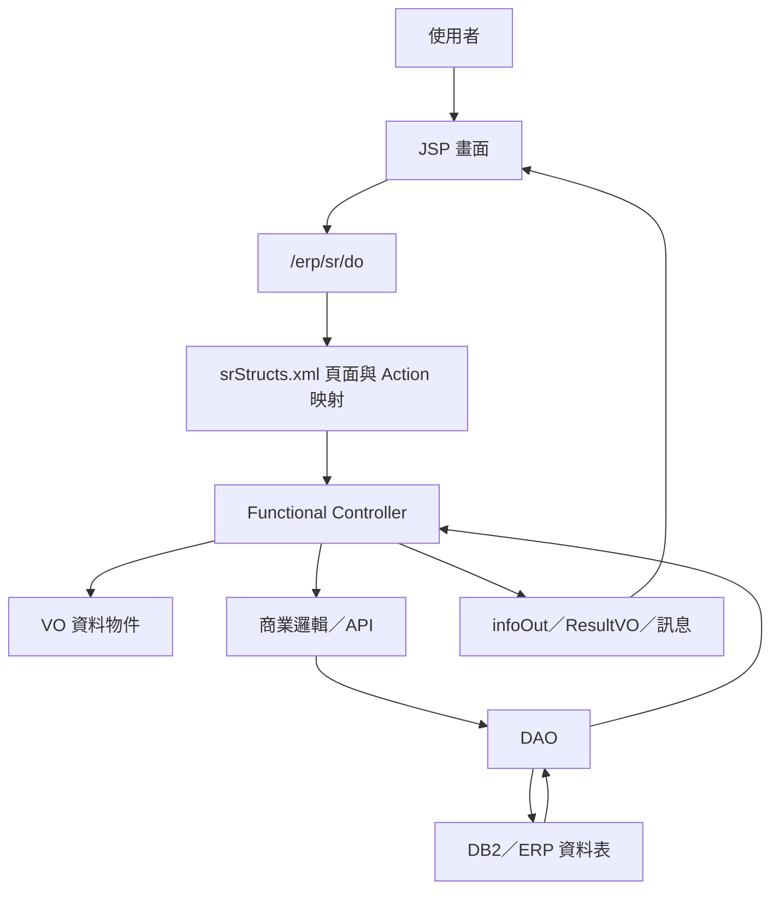
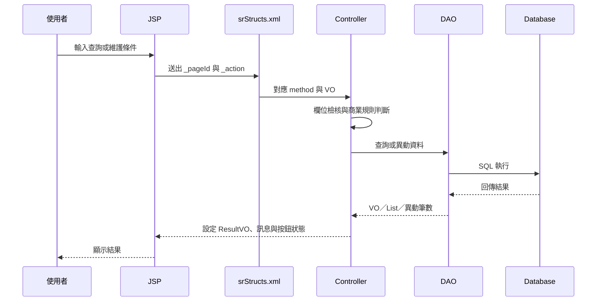

# SR 功能規格手冊

## 1. 系統概述

### 1.1 系統定位

`SR` 模組為 ERP 中的價格規則、報價設定、折讓與價格試算管理系統。系統透過 JSP 畫面、Functional Controller、VO／DAO 與資料表設定，支援價格代碼、價格因子、價格型態、價格版本、幣別、生效日期、內外銷別、價格明細與折讓基準資料的維護，並提供訂單或出貨資料進行價格試算與差異分析。

本模組主要服務對象包含營業、報價、出貨與 ERP 維運人員。使用者可在系統中建立價格規則、設定規則所需的價格代碼與因子、確認價格版本，並將價格資料匯出或由外部檔案匯入，供後續訂單定價、價格模擬與出貨折讓作業使用。

### 1.2 系統目標

1. 提供集中化的價格設定資料維護機制，降低價格代碼、因子與版本資料分散造成的維護風險。
2. 支援以價格型態、版本、內外銷別、幣別與生效日期管理不同價格規則。
3. 透過價格代碼與價格因子組合，建立可查詢、可複製、可確認與可取消確認的價格定義。
4. 維護實際價格明細與因子區間，使報價或試算可依條件取得對應價格。
5. 支援價格設定匯入／匯出，利於大量價格資料交換與版本移轉。
6. 提供價格試算與折讓設定，協助業務或出貨情境下比較既有價格與模擬價格。

### 1.3 使用者角色

| 角色 | 主要職責 |
| --- | --- |
| 價格資料維護人員 | 建立與維護價格代碼、價格因子、價格型態、價格定義與價格明細。 |
| 營業／報價人員 | 查詢價格版本、進行價格試算、確認價格適用性。 |
| 主管或資料確認人員 | 確認或取消確認價格版本與折讓資料，使其可進入後續正式使用流程。 |
| 系統維運人員 | 維護資料表、DAO、Controller 設定與匯入／匯出流程。 |

### 1.4 作業範圍

本系統涵蓋下列作業範圍：

1. 價格基礎資料維護：價格代碼、價格因子、價格型態與因子組成設定。
2. 價格版本定義：價格型態、版本、內外銷別、幣別、生效日期與狀態管理。
3. 價格規則組成：指定價格定義可使用的價格代碼與價格因子。
4. 價格明細維護：依價格代碼與因子區間維護實際價格。
5. 價格資料複製、整批複製、確認、取消確認、匯出與匯入。
6. 價格試算與結果查詢。
7. 折讓級距、折讓確認與基本類別設定。

### 1.5 主要資料來源

| 資料來源 | 用途 |
| --- | --- |
| `config/yl/sr/srStructs.xml` | 定義頁面、Controller、Action 與 VO 轉換關係。 |
| `jsp/` | 使用者操作畫面、查詢頁、編輯頁、樹狀頁與測試頁。 |
| `src/com/icsc/sr/` | 價格規則、價格明細、折讓與 API 主要 Java 程式。 |
| `src/com/icsc/sr/px/` | 價格試算交易紀錄與結果查詢相關程式。 |
| `dao/` | DAO 產生設定與資料表對應。 |
| `dao/sql/` | 主要資料表 DDL。 |

## 2. 系統架構總覽

### 2.1 整體架構

`SR` 模組採 ERP 既有 Web 架構，由 JSP 提供操作畫面，經由 `/erp/sr/do` 送出 `_pageId` 與 `_action`，再依 `srStructs.xml` 對應至 `dejcFunctionalController` 衍生 Controller。Controller 取得 VO、執行商業邏輯與 DAO 存取，最後將結果回傳至 JSP。

### 2.2 程式分層

| 分層 | 元件 | 說明 |
| --- | --- | --- |
| 表現層 | `jsp/*.jsp` | 顯示查詢、編輯、樹狀選單、複製、匯入、匯出與試算畫面。 |
| 路由設定層 | `config/yl/sr/srStructs.xml` | 以 `pageID` 對應 JSP、Controller、Action method 與 VO。 |
| 控制層 | `srjc*Func.java`、`srjcyl*.java`、`srjcptxFuncControl.java` | 接收畫面輸入，執行查詢、新增、修改、刪除、確認、複製等動作。 |
| 商業邏輯層 | `srjcPrice.java`、`srjcApi.java`、`srjcSimPriceBp.java`、`srjcylBaseTypeApi.java` | 提供價格取得、版本判定、試算與基本類別判定。 |
| 資料存取層 | `srjc*DAO.java`、`dao/*.dao` | 對應資料表，執行 CRUD 與條件查詢。 |
| 資料物件層 | `srjc*VO.java` | 承載畫面欄位與資料表欄位，包含欄位長度與基本檢核。 |

### 2.3 主要資料表

| 資料表 | VO／DAO | 功能定位 | 主要用途 | 關聯功能 |
| --- | --- | --- | --- | --- |
| `db.TBSRPCODE` | `srjcPriceCodeVO`、`srjcPriceCodeDAO` | 價格代碼主檔 | 維護價格分類代碼、說明、狀態與異動資訊，供價格定義與價格明細引用。 | 價格代碼維護、價格版本與價格定義維護、價格明細維護。 |
| `db.TBSRPFACTOR` | `srjcPriceFactorVO`、`srjcPriceFactorDAO` | 價格因子主檔 | 維護價格計算條件因子、資料型態、檢核規則與使用狀態。 | 價格因子維護、價格型態維護、價格明細維護、價格試算。 |
| `db.TBSRPTYPE` | `srjcPriceTypeVO`、`srjcPriceTypeDAO` | 價格型態主檔 | 定義價格規則框架，保存價格型態、描述、型態分類、版本與建立／異動資訊。 | 價格型態維護、價格版本與價格定義維護。 |
| `db.TBSRPTYPE01` | `srjcPriceTypeFatVO`、`srjcPriceTypeFatDAO` | 價格型態因子明細 | 保存價格型態下的因子順序、中文／英文描述、資料型態與值域設定。 | 價格型態維護、價格因子選用、價格明細輸入欄位產生。 |
| `db.TBSRPDEF` | `srjcPrcDefVO`、`srjcPrcDefDAO` | 價格版本定義主檔 | 依價格型態、版本、內外銷別、幣別與生效日期管理價格版本及確認狀態。 | 價格版本與價格定義維護、價格確認、取消確認、價格版本取得 API。 |
| `db.TBSRPDEF01` | `srjcPrcDefCodeVO`、`srjcPrcDefCodeDAO` | 價格版本代碼明細 | 定義特定價格版本可使用的價格代碼。 | 價格版本與價格定義維護、價格設定樹狀結構、價格明細維護。 |
| `db.TBSRPDEF02` | `srjcPrcDefFatVO`、`srjcPrcDefFatDAO` | 價格版本因子明細 | 定義特定價格版本與價格代碼下可使用的價格因子。 | 價格版本與價格定義維護、價格因子清單、價格明細條件維護。 |
| `db.TBSRPRICE` | `srjcPriceVO`、`srjcPriceDAO` | 實際價格主檔 | 保存各價格版本、價格代碼與序號對應的價格值。 | 價格明細維護、價格試算、價格匯入／匯出、價格複製。 |
| `db.TBSRPRICE01` | `srjcPriceFatVO`、`srjcPriceFatDAO` | 實際價格因子條件 | 保存各價格序號的因子上下限，作為價格命中條件。 | 價格明細維護、價格試算、價格匯入／匯出、價格複製。 |
| `db.TBSRPTX` | `srjcptxVO`、`srjcptxDAO` | 價格試算交易結果 | 保存試算來源系統、鍵值、總額、明細 ledger 與建立資訊。 | 價格查詢、價格試算、試算結果查詢、試算明細檢視。 |
| `db.tbsryl01` | `srjcyl01VO`、`srjcyl01DAO` | 折讓級距設定主檔 | 依月份、銷售類別、內外銷、客戶、重量區間、幣別與折讓單價維護折讓規則。 | 折讓級距設定、折讓資料複製、折讓確認前置資料。 |
| `db.tbsryl10`、`db.tbsryl11` | `srjcyl10VO`、`srjcyl10DAO`、`srjcyl11VO`、`srjcyl11DAO` | 折讓／出貨明細資料 | 保存折讓或出貨計算所需的明細資料，供折讓查詢、確認與報表使用。 | 折讓確認、折讓查詢、出貨折讓資料處理。 |
| `db.tbsryl31` | `srjcyl31VO`、`srjcyl31DAO` | 基本類別設定主檔 | 依公司、廠別、基礎類別項目、規格與生效期間維護基本類別。 | 基本類別設定、`srjcylBaseTypeApi`、價格試算或外部模組基本類別判定。 |

### 2.4 共同作業流程

### 2.5 主要頁面與 Controller 對應

| 頁面 ID | JSP | Controller | 主要 Action |
| --- | --- | --- | --- |
| `srjjPriceCodeEdit` | `srjjPriceCodeEdit.jsp` | `srjcPriceCodeFunc` | 查詢、新增、修改、刪除、停用、上一筆、下一筆。 |
| `srjjPriceFactorEdit` | `srjjPriceFactorEdit.jsp` | `srjcPriceFactorFunc` | 查詢、新增、修改、刪除、停用、取得因子。 |
| `srjjPriceTypeEdit` | `srjjPriceTypeEdit.jsp` | `srjcPriceTypeFunc` | 初始、查詢、新增、修改、刪除、上一筆、下一筆。 |
| `srjjPriceSetup` | `srjjPriceSetup.jsp` | `srjcPrcDefFunc` | 查詢、新增、修改、刪除、確認、取消確認、複製、整批複製、匯出、匯入。 |
| `srjjPriceCodeList` | `srjjPriceCodeList.jsp` | `srjcPrcDefCodeFunc` | 查詢、新增、刪除、依價格定義查詢、停用。 |
| `srjjPriceFactorList` | `srjjPriceFactorList.jsp` | `srjcPrcDefFatFunc` | 查詢、新增、刪除、依因子查詢、停用。 |
| `srjjPriceEdit` | `srjjPriceEdit.jsp` | `srjcPrcEditFunc` | 查詢全部、查詢單筆、新增、修改、刪除、複製。 |
| `srjjPtxResult` | `srjjPtxResult.jsp` | `srjcptxFuncControl` | 查詢試算結果、進入明細。 |
| `srjjyl2001` | `srjjyl2001.jsp` | `srjcyl2001` | 查詢、確認、取消確認。 |
| `srjjyl0101List` | `srjjyl0101List.jsp` | `srjcyl01` | 查詢、新增、修改、刪除、資料複製。 |
| `srjjyl0301` | `srjjyl0301.jsp` | `srjcyl03` | 查詢、列印。 |
| `srjjyl31` | `srjjyl31.jsp` | `srjcyl31` | 查詢、新增、修改、刪除。 |

## 3. 功能模組詳細說明

### 3.1 價格代碼維護

**功能目的**  
維護價格計算或價格明細分類所需的價格代碼。價格代碼可供價格定義與價格明細引用，並透過狀態控管是否可使用。

**對應程式**  
`srjjPriceCodeEdit.jsp`、`srjjPriceCodeSelect.jsp`、`srjcPriceCodeFunc`、`srjcPriceCodeDAO`、`srjcPriceCodeVO`。

**主要資料表**  
`db.TBSRPCODE`。

**主要欄位**  
`id`、`code`、`desc`、`status`、`updateUser`、`updateTime`。

**作業流程**

1. 使用者進入價格代碼維護畫面。
2. 系統依輸入代碼或條件查詢既有價格代碼。
3. 使用者可新增、修改、刪除或停用價格代碼。
4. Controller 執行欄位檢核，確認代碼、說明與狀態資料符合長度與必填限制。
5. DAO 寫入或更新 `TBSRPCODE`。
6. 畫面回傳處理結果與上一筆／下一筆瀏覽狀態。

**業務規則**

1. 價格代碼需具備唯一識別與狀態。
2. 已停用或刪除的代碼不應再被新價格定義選用。
3. 價格定義或價格明細已引用的代碼，刪除前應確認關聯資料影響。

### 3.2 價格因子維護

**功能目的**  
維護價格計算條件所需的因子，例如規格、等級、重量、產品或其他可作為價格判斷條件的欄位。因子可搭配規則物件與檢核規則，供價格設定與價格試算使用。

**對應程式**  
`srjjPriceFactorEdit.jsp`、`srjjPriceFactorSelect.jsp`、`srjcPriceFactorFunc`、`srjcPriceFactorDAO`、`srjcPriceFactorVO`、`srjiPrcFatRule`。

**主要資料表**  
`db.TBSRPFACTOR`。

**主要欄位**  
`id`、`factorName`、`factorDesc`、`factorObj`、`dataType`、`specCode`、`specRule`、`status`、`updateUser`、`updateTime`。

**作業流程**

1. 使用者查詢或建立價格因子。
2. 系統提供可用因子清單，供價格型態與價格定義引用。
3. 使用者維護因子名稱、中文說明、資料型態、對應物件與檢核規則。
4. Controller 執行新增、修改、刪除或停用。
5. DAO 異動 `TBSRPFACTOR`。

**業務規則**

1. 因子名稱為價格規則判斷條件，需避免與既有因子重複或語意衝突。
2. 因子若被價格型態、價格定義或價格明細引用，停用前需評估影響。
3. `specRule` 可作為因子值域或特殊檢核依據。

### 3.3 價格型態維護

**功能目的**  
定義價格型態與其適用因子組合。價格型態相當於價格規則的框架，用來描述某一類價格如何由多個因子構成。

**對應程式**  
`srjjPriceType.jsp`、`srjjPriceTypeEdit.jsp`、`srjjPriceTypeSetup.jsp`、`srjcPriceTypeFunc`、`srjcPriceType`、`srjcPriceTypeDAO`、`srjcPriceTypeFatDAO`。

**主要資料表**  
`db.TBSRPTYPE`、`db.TBSRPTYPE01`。

**主要欄位**

1. `TBSRPTYPE`：`id`、`priceType`、`desc`、`type`、`version`、`createUser`、`createTime`、`updateUser`、`updateTime`。
2. `TBSRPTYPE01`：`id`、`priceType`、`serNo`、`factorName`、`factorCDesc`、`factorEDesc`、`dataType`、`fatValueMin`、`fatValueMax`。

**作業流程**

1. 使用者查詢既有價格型態。
2. 使用者建立價格型態基本資料。
3. 系統同步維護價格型態下的因子明細與順序。
4. 使用者可修改或刪除價格型態。
5. Controller 依按鈕狀態控制新增、修改、刪除、上一筆、下一筆等操作。
6. DAO 分別異動主檔與因子明細。

**業務規則**

1. 價格型態需先建立，後續價格版本定義與價格明細才可引用。
2. 因子順序會影響畫面呈現與價格條件輸入順序。
3. 型態版本欄位用於辨識型態資料變更歷程。

### 3.4 價格版本與價格定義維護

**功能目的**  
建立正式價格設定版本，定義價格型態、版本、內外銷別、幣別、生效日期與狀態，並指定此版本可用的價格代碼與價格因子。

**對應程式**  
`srjjprice.jsp`、`srjjPriceSetup.jsp`、`srjjPriceSetupTree.jsp`、`srjjPriceCopy.jsp`、`srjjPriceCopyAll.jsp`、`srjcPrcDefFunc`、`srjcPrcDefDAO`、`srjcPrcDefCodeFunc`、`srjcPrcDefFatFunc`。

**主要資料表**  
`db.TBSRPDEF`、`db.TBSRPDEF01`、`db.TBSRPDEF02`。

**主要欄位**

1. `TBSRPDEF`：`priceType`、`version`、`export`、`crcy`、`effectDate`、`updateUser`、`updateTime`、`status`。
2. `TBSRPDEF01`：`priceType`、`version`、`export`、`crcy`、`priceCode`。
3. `TBSRPDEF02`：`priceType`、`version`、`export`、`crcy`、`priceCode`、`priceFactor`。

**作業流程**

1. 使用者選擇價格型態、版本、內外銷別與幣別。
2. 系統查詢或建立價格定義主檔。
3. 使用者設定生效日期與狀態。
4. 使用者指定價格代碼清單。
5. 使用者針對價格代碼指定適用價格因子。
6. 使用者可執行確認、取消確認、複製、整批複製、匯出或匯入。
7. 系統依設定更新價格樹狀結構與明細維護畫面。

**業務規則**

1. 價格版本以 `priceType`、`version`、`export`、`crcy` 作為主要識別條件。
2. 生效日期用於價格版本選取，外部 API 可依訂單條件取得適用版本。
3. 確認後的價格版本應視為可供正式流程引用。
4. 取消確認後，該版本可回到可維護狀態，但需注意已被訂單或試算引用的資料一致性。
5. `crcy` 欄位在價格定義、價格明細與因子明細表中皆存在，代表系統支援依幣別管理價格。

### 3.5 價格明細維護

**功能目的**  
維護實際價格資料與各價格因子的適用區間，使系統能依訂單、產品、規格、內外銷與幣別條件取得價格。

**對應程式**  
`srjjPriceEdit.jsp`、`srjjPriceEditTree.jsp`、`srjjPriceEditCopy.jsp`、`srjcPrcEditFunc`、`srjcPriceDAO`、`srjcPriceFatDAO`、`srjcPrice`。

**主要資料表**  
`db.TBSRPRICE`、`db.TBSRPRICE01`。

**主要欄位**

1. `TBSRPRICE`：`id`、`priceType`、`version`、`export`、`crcy`、`priceCode`、`price`。
2. `TBSRPRICE01`：`id`、`priceType`、`version`、`export`、`crcy`、`priceCode`、`priceFactor`、`MinFatVal`、`MaxFatVal`。

**作業流程**

1. 使用者透過價格設定樹狀結構選取價格代碼。
2. 系統查詢該價格代碼下的所有價格明細。
3. 使用者新增價格序號與價格值。
4. 使用者為每筆價格設定因子上下限。
5. Controller 依新增、修改、刪除或複製動作異動主檔與因子條件。
6. 系統重新查詢並顯示價格明細。

**業務規則**

1. 每筆價格明細需對應到價格定義中的價格代碼。
2. 價格因子條件需與價格定義中的因子清單一致。
3. 同一價格代碼下的因子區間應避免重疊，以免試算時產生多筆命中。
4. 價格欄位為數值資料，應避免空值或非數值輸入。

### 3.6 價格設定複製、整批複製、匯出與匯入

**功能目的**  
提供價格資料版本移轉與大量維護能力。使用者可將既有價格定義與明細複製到新版本，也可將價格設定匯出成檔案或由外部檔案匯入。

**對應程式**  
`srjjPriceCopy.jsp`、`srjjPriceCopyAll.jsp`、`srjjPriceOut.jsp`、`srjjPriceInward.jsp`、`srjcPrcDefFunc`、`srjcPriceOutwardThread`、`srjcPriceInwardThread`。

**涉及資料表**  
`TBSRPDEF`、`TBSRPDEF01`、`TBSRPDEF02`、`TBSRPRICE`、`TBSRPRICE01`。

**作業流程**

1. 複製作業：使用者選擇來源價格設定與目標版本，系統複製價格定義、代碼、因子與價格明細。
2. 整批複製：使用者透過 `copyAll` 作業大量建立新版本或新條件資料。
3. 匯出作業：系統依價格型態、版本、內外銷與幣別讀取五張價格設定表，產生外部檔案。
4. 匯入作業：系統解析外部檔案內容，先建立價格定義，再依工作表或資料區塊建立代碼、因子與價格明細。

**業務規則**

1. 匯入與複製需維持五張價格表的主從一致性。
2. 匯入前應確認目標版本是否已存在，避免覆蓋正式版本。
3. 匯出資料應包含幣別，避免不同幣別價格混用。
4. 匯入過程若任一主檔或明細失敗，需避免留下不完整價格版本。

### 3.7 價格查詢、試算與交易結果查詢

**功能目的**  
依訂單、產品、出貨或其他 ERP 物件條件取得價格版本與試算價格，並記錄或查詢試算結果。

**對應程式**  
`srjjPriceTest.jsp`、`srjjPriceRsltTest.jsp`、`srjjPtxResult.jsp`、`srjjPtxDetail.jsp`、`srjcPrice`、`srjcApi`、`srjcSimPriceBp`、`srjcptxFuncControl`、`srjcptxDAO`。

**主要資料表**  
`TBSRPDEF`、`TBSRPRICE`、`TBSRPRICE01`、`TBSRPTX`。

**作業流程**

1. 系統接收訂單、項次、出貨、規格、幣別或其他價格因子資料。
2. `srjcApi.getPriceVer` 或 `srjcSimPriceBp` 依條件取得適用價格版本。
3. `srjcPrice` 載入相關 VO，依價格代碼與因子條件比對價格。
4. 系統回傳價格值與價格明細。
5. 若有試算交易紀錄，結果可寫入或查詢 `TBSRPTX`。
6. 使用者可由結果頁進入明細頁檢視 ledger 或價格組成。

**業務規則**

1. 價格版本依內外銷、幣別與生效日期判定。
2. 若訂單或產品條件不足，價格試算可能無法取得對應價格。
3. 因子比對需使用價格明細設定的上下限。
4. 試算結果應保留系統別與鍵值，方便追溯來源交易。

### 3.8 折讓級距設定

**功能目的**  
維護出貨或銷售折讓級距，依月份、銷售類別、內外銷、客戶與重量區間設定折讓單價。

**對應程式**  
`srjjyl0101List.jsp`、`srjcyl01`、`srjcyl01DAO`、`srjcyl01VO`。

**主要資料表**  
`db.tbsryl01`。

**主要欄位**  
`dispMonth`、`saleClassNo`、`export`、`custNo`、`minWet`、`maxWet`、`crcyUnit`、`discPrice`、`modifyEmpNo`、`modifyDate`。

**作業流程**

1. 使用者輸入出貨月份、銷售類別、內外銷或客戶條件查詢折讓資料。
2. 使用者新增重量區間與折讓單價。
3. 使用者可修改或刪除既有折讓級距。
4. 系統支援資料複製，降低跨月份或跨條件設定成本。

**業務規則**

1. 折讓級距應避免同一條件下重量區間重疊。
2. 幣別單位需與價格或出貨資料保持一致。
3. 修改人員與修改日期需保留，以利稽核。

### 3.9 折讓確認與取消確認

**功能目的**  
提供折讓或價格相關資料的確認機制，使已檢核完成的資料可進入正式使用狀態，也可在必要時取消確認。

**對應程式**  
`srjjyl2001.jsp`、`srjcyl2001`。

**主要資料物件**  
`srjcPrcDefVO`。

**作業流程**

1. 使用者查詢待確認資料。
2. 系統列出符合條件的價格或折讓設定。
3. 使用者執行確認。
4. 若需重新維護，使用者可執行取消確認。
5. 系統回傳處理訊息與最新狀態。

**業務規則**

1. 確認後資料應限制異動或需透過取消確認後再修改。
2. 取消確認需注意下游流程是否已使用該資料。
3. 確認與取消確認應保留異動者與時間。

### 3.10 價格試算報表與列印

**功能目的**  
提供價格試算資料查詢與列印，用於檢視不同價格月份、廠別、銷售型態或訂單條件下的價格差異。

**對應程式**  
`srjjyl0301.jsp`、`srjcyl03`、`srjcSimPriceBp`。

**作業流程**

1. 使用者輸入出貨月份、價格月份、廠別、銷售型態或訂單條件。
2. 系統取得既有價格與模擬價格。
3. 系統計算並回傳價格差異資料。
4. 使用者可列印結果。

**業務規則**

1. 試算月份與出貨月份可能不同，系統需分別取得對應價格版本。
2. 不同廠別或銷售型態可能使用不同價格基礎。
3. 無法取得價格版本時，試算價格應以空值或零值處理，並提示使用者檢查價格設定。

### 3.11 基本類別設定

**功能目的**  
依公司、廠別、基礎類別項目、規格與生效期間維護基本類別，供其他模組或價格試算判斷基礎類別。

**對應程式**  
`srjjyl31.jsp`、`srjcyl31`、`srjcyl31DAO`、`srjcyl31VO`、`srjcylBaseTypeApi`。

**主要資料表**  
`db.tbsryl31`。

**主要欄位**  
`compId`、`factory`、`baseTypeItem`、`spec`、`baseType`、`beginDate`、`endDate`、`modifyEmpNo`、`modifyDate`。

**作業流程**

1. 使用者輸入廠別、類別項目或規格查詢既有設定。
2. 使用者新增、修改或刪除基本類別設定。
3. `srjcylBaseTypeApi.getBaseType` 可依廠別與規格取得目前日期適用的基本類別。
4. 查詢不到設定時，API 回傳空值並記錄訊息。

**業務規則**

1. 同一公司、廠別、項目與規格下，生效期間不應重疊。
2. API 以目前日期查詢有效資料，因此起訖日期需維護正確。
3. 基本類別可能影響價格版本或價格試算邏輯，異動前需確認下游影響。

### 3.12 系統介面與 API

**功能目的**  
提供其他 ERP 模組取得價格版本、價格值或基本類別的程式介面。

**對應程式**

1. `srjcApi`：提供價格版本取得功能。
2. `srjcPrice`：提供價格計算與價格明細取得功能。
3. `srjcSimPriceBp`：提供價格模擬與報表資料產生功能。
4. `srjcylBaseTypeApi`：提供基本類別取得功能。

**主要輸入**

1. 訂單 VO、項次 VO、出貨 VO 或其他價格因子 VO。
2. 銷售型態、廠別、規格、幣別、內外銷與月份。
3. 價格版本或價格月份。

**主要輸出**

1. 適用價格版本。
2. 價格值。
3. 價格明細或 ledger。
4. 基本類別。

**業務規則**

1. API 呼叫端需提供足夠的價格因子資料。
2. 價格版本選取需符合內外銷、幣別與生效日期。
3. 若有特殊廠別或銷售型態判斷，應以 `srjcSimPriceBp` 與現行價格規則為準。

### 3.13 權限與操作控制

**功能目的**  
控制使用者可執行的新增、修改、刪除、確認與其他操作，避免未授權異動價格或折讓資料。

**對應程式**

`srjcButton`、`srjcPriceTypeBtn`、各 Controller 的按鈕狀態設定，以及 `srjcyl31` 中的權限檢核呼叫。

**作業說明**

1. 畫面按鈕會依查詢結果、資料狀態與權限狀態啟用或停用。
2. Controller 可在處理完成後設定 `infoOut` 的按鈕狀態。
3. 特定功能會呼叫 ERP 權限檢核元件，判斷使用者是否具備新增、修改或刪除權限。

**業務規則**

1. 價格與折讓資料屬關鍵主檔，應限制未授權新增、修改與刪除。
2. 已確認資料應比未確認資料具備更嚴格的異動限制。
3. 權限不足時，畫面應停用相關按鈕或回傳錯誤訊息。

### 3.14 異常處理與檢核

**功能目的**  
在資料維護與價格試算過程中，避免空值、主鍵不完整、因子未勾選或價格建立失敗造成資料不一致。

**對應程式**

`srjcPrcPKNullException`、`srjcPrcNullValueException`、`srjcPrcBoxUncheckedException`、`srjcPrcCreateException`、各 VO `verify()` 與 Controller validate method。

**檢核項目**

1. 主鍵欄位不可空白。
2. 價格型態、版本、內外銷、幣別與價格代碼需完整。
3. 價格因子需符合資料型態與值域設定。
4. 數值欄位需符合格式與長度。
5. 新增、修改、刪除作業需回傳成功筆數或錯誤訊息。

**異常處理原則**

1. Controller 應將錯誤訊息回傳至畫面。
2. 批次匯入或複製若失敗，需避免留下部分完成資料。
3. API 取得價格失敗時，需提供足夠訊息供呼叫端追蹤設定缺漏。
