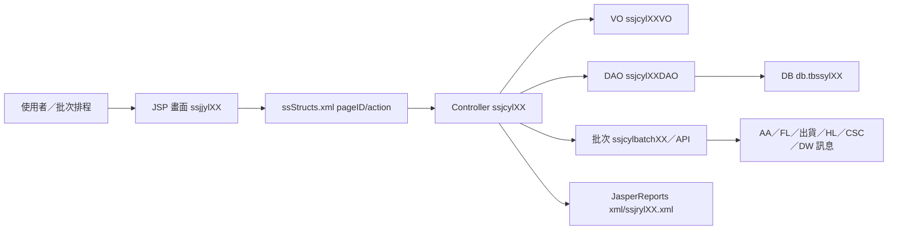

# SS 銷售結算管理系統功能規格手冊

## 1. 系統概述

### 1.1 系統定位

SS 模組為銷售結算管理系統，主要負責彙整出貨、發票、銷售調整與行紀受託銷售相關資料，依結算週期或人工指定條件執行銷售結算，產生應收憑單、會計分錄、傳票資料、統計查詢與報表輸出，並與外部模組交換資料。

本手冊依據 `ss` 模組現有 JSP、`config/yl/ss/ssStructs.xml`、Java Controller、DAO／VO、SQL 建表檔與 JasperReports XML 交叉整理。若部分畫面中文名稱未直接出現在程式碼中，本文以程式命名、資料表說明與流程註解保守推定。

### 1.2 使用對象

- 會計與銷售結算作業人員：維護結算條件、執行結算、檢視應收與傳票結果。
- 業務／出貨關聯人員：提供出貨銷帳、發票與調整資料來源，查詢結算結果。
- 系統維護人員：維護原因代碼、產品型態對照、通知收件人、批次排程與異常資料。

### 1.3 系統範圍

- 結算參數與控制資料維護。
- 出貨資料、核算資料、發票資料、銷售調整資料收集與整理。
- 自動結算與手動特殊結算。
- 銷售調整單建立、修改、刪除、查詢與原因代碼套用。
- 產品型態、銷售類別與通知收件人等主檔維護。
- 銷售結算結果查詢、統計與報表輸出。
- 會計分錄、AA 傳票、FL 額度、HL／CSC 等外部系統介接。

### 1.4 主要資料來源與外部介接

- 出貨系統：透過 `ssjcylbatch01.ilToSs10` 將出貨資料暫存至 `db.tbssyl10`。
- 銷售調整來源：畫面 `SSJJYL08` 或 API `ssjcylAPI.InsertRevise` 建立調整資料，並可回拋暫存檔供結算。
- 會計系統 AA：批次產生分錄與傳票，並於月初關帳流程回報結算完成狀態。
- 信用狀／額度系統 FL：結算時計算並鎖定內外銷信用狀額度；異常寫入 `db.tbssyl24` 並通知。
- 發貨／SB 或相關系統：結算後回寫實際金額、運費與稅額等結果。
- HL 與 CSC：行紀受託銷售資料、代軋帳務資料透過批次或 WebService 拋送。

## 2. 系統架構總覽

### 2.1 程式架構

SS 模組採傳統 Java／JSP 架構，主要路由由 `/erp/ss/do?_pageId=...` 進入，`ssStructs.xml` 負責定義 pageID、JSP、Controller、Action 與 VO 對應。

### 2.2 Page／Controller／Action 對應

| 功能頁面 | JSP／pageID | Controller | VO | Action |
| --- | --- | --- | --- | --- |
| 結算點控制主檔 | `ssjjyl01MN`、`ssjjyl01DT` | `ssjcyl01`、`ssjcyl02` | `ssjcyl01VO`、`ssjcyl02VO` | `I` 查詢、`N` 新增、`R` 修改、`D` 刪除 |
| 核算資料查詢／維護 | `ssjjyl03MN` | `ssjcyl03` | `ssjcyl03VO` | `I` 查詢、`R` 修改 |
| 銷售調整原因 | `ssjjyl06MN`、`ssjjyl06DT` | `ssjcyl06`、`ssjcyl07` | `ssjcyl06VO`、`ssjcyl07VO` | `I`、`N`、`R`、`D` |
| 銷售調整操作 | `ssjjyl08MN` | `ssjcyl08` | `ssjcyl08VO` | `I`、`N`、`R`、`D` |
| 產品型態對照 | `ssjjyl09`、`ssjjyl09MN`、`ssjjyl09List` | `ssjcyl09` | `ssjcyl17VO` | `I`、`N`、`R`、`D` |
| 結算資料查詢 | `ssjjyl10`、`ssjjyl10MN`、`ssjjyl10List` | `ssjcyl10` | `ssjcyl03VO` | `I`、`N`、`R`、`D` |
| 出貨整理資料查詢 | `ssjjyl11`、`ssjjyl11List` | `ssjcyl11` | `ssjcyl03VO`／`ssjcyl11VO` | `I`、`N`、`R`、`D` |
| 統計資料查詢 | `ssjjyl12`、`ssjjyl12List`、`ssjjyl12Statistic` | `ssjcyl12` | `ssjcyl20VO` | `I`、`N`、`R`、`D` |
| 暫存／歷史資料維護 | `ssjjyl13`、`ssjjyl13MN` | `ssjcyl13` | `ssjcyl10VO` | `I`、`N`、`R`、`D` |
| 報表與批次查詢 | `ssjjyl31` 至 `ssjjyl38` | `ssjcyl31` 至 `ssjcyl38` | 對應 Controller 本身 | `I` 查詢，`ssjjyl33` 另有 `S` 寄送 Mail |
| 客戶業務通知收件人 | `ssjjyl39MN` | `ssjcyl39` | `ssjcyl39VO` | `I`、`N`、`R`、`D` |

> 注意：`ssjjyl13.jsp` 內的 form action 出現 `ssjjjl13MN` 字樣，與 `ssStructs.xml` 的 `ssjjyl13MN` 命名不一致，文件先以 `ssStructs.xml` 為正式路由依據。

### 2.3 結算資料流

1. 出貨、發票、銷售調整等來源資料進入 `db.tbssyl10` 等暫存檔。
2. 自動結算由 `ssjcylbatch00` 啟動，依 `db.tbssyl01` 的結算週期與前次結算日期檢核是否執行；特殊結算由 `ssjcyl02` 寫入 `db.tbssyl02` 後啟動。
3. `ssjcylbatch02.Ss10ToSs11` 將待結算資料由 `db.tbssyl10` 搬移、整理至 `db.tbssyl11`、`db.tbssyl12`、`db.tbssyl14` 等階段表。
4. `ssjcylbatch03` 產生應收憑單號、計算貨款／稅額／信用狀段與現金段，並準備會計分錄。
5. `ssjcylbatch04` 依 `db.tbssyl18` 匯總資料拋 AA，取得傳票號碼後回寫 `db.tbssyl14` 及銷售調整單。
6. 結算後續批次處理 AA 關帳流程、代收運費沖銷拋帳、FL 鎖額度異常通知、CSC 代軋資料與 HL 行紀資料拋送。

### 2.4 技術與資料存取特性

- JSP 使用 DPMS taglib、查詢 popup、iframe 與舊式 function bar 組成。
- Controller 多數繼承 `dejcFunctionalController`，透過 `infoIn`／`infoOut` 取得參數與 VO。
- DAO 使用手寫 SQL 或 DAO Tool 產生方法，常見方法包含 `findByPK`、`query`、`create`、`remove`、`update`、`updateCreateList`。
- 資料表多位於 `db` schema，核心表命名為 `tbssylXX`，另有 `tbssCSC01`、`tbssyl39` 等介接或通知用途資料表。
- 報表以 JasperReports XML 檔 `xml/ssjryl31.xml` 至 `xml/ssjryl38.xml` 定義欄位與版面。

## 3. 功能模組詳細說明

### 3.1 結算參數與結算點控制

**對應程式**

- 畫面：`ssjjyl01.jsp`、`ssjjyl01MN.jsp`、`ssjjyl01DT.jsp`
- Controller：`ssjcyl01`、`ssjcyl02`
- 資料表：`db.tbssyl01`、`db.tbssyl02`、`db.tbssyl99`

**功能說明**

此模組維護銷售結算的自動結算週期、結算時間、核算／出貨啟動設定，以及手動特殊結算條件。使用者可設定結算起迄期間、客戶、訂單項次及是否處理核算資料或出貨資料。

**主要處理規則**

- `ssjcyl01` 維護公司別層級的結算週期與時間。
- `ssjcyl02.createColumn` 建立手動結算條件後，呼叫 `ssjcylbatch02.Ss10ToSs11` 執行特殊結算。
- 自動結算由批次 `ssjcylbatch00` 讀取結算點設定與前次結算日，判斷是否處理銷售調整與出貨資料。

### 3.2 出貨與核算資料收集

**對應程式**

- API／批次：`ssjcylbatch01`、`ssjcylbatch02`、`ssjcylAPI`
- 查詢畫面：`ssjjyl03`、`ssjjyl10`、`ssjjyl11`、`ssjjyl12`
- 資料表：`db.tbssyl03`、`db.tbssyl04`、`db.tbssyl05`、`db.tbssyl10`、`db.tbssyl11`、`db.tbssyl12`、`db.tbssyl13`、`db.tbssyl14`、`db.tbssyl15`、`db.tbssyl16`、`db.tbssyl22`

**功能說明**

此模組負責接收出貨系統拋送之銷帳、退貨、發票及相關資料，先進入暫存檔，再依結算條件整理成核算資料、應收資料與會計處理資料。資料整理過程會依客戶、訂單、發貨通知、交貨單、發票、產品、品級、幣別、稅別等欄位分組。

**主要處理規則**

- `ssjcylbatch01.ilToSs10` 提供出貨系統呼叫，將資料先寫入 `db.tbssyl10`。
- `ssjcylbatch02` 將待結算資料搬移到 `db.tbssyl11`，再依 distinct key 整理至 `db.tbssyl12`、`db.tbssyl14`。
- 數量折扣、即時退、外銷賒銷匯率、信用狀額度、反銷帳限制等規則在批次註解與程式內判斷處理。
- `db.tbssyl15` 保留結算後的歷史紀錄，供查詢、報表與後續退貨／調整比對。

### 3.3 銷售調整作業

**對應程式**

- 畫面：`ssjjyl06`、`ssjjyl08`
- Controller：`ssjcyl06`、`ssjcyl07`、`ssjcyl08`
- API：`ssjcylAPI.InsertRevise`、`ssjcylAPI.InsertReviseE`
- 資料表：`db.tbssyl06`、`db.tbssyl07`、`db.tbssyl08`、`db.tbssyl10`

**功能說明**

銷售調整作業包含原因主檔、原因明細會計科目設定，以及調整單建立與查詢。調整單可由人工畫面建立，也可由折扣、報支或其他系統透過 API 建立，再轉入暫存檔參與結算。

**主要處理規則**

- 原因主檔 `db.tbssyl06` 管理原因代碼與啟用狀態。
- 原因明細 `db.tbssyl07` 定義借貸方、會計科目、到期日欄位、百分比與是否沖回。
- 調整單 `db.tbssyl08` 記錄調整單號、客戶、指定訂單／發貨／交貨／應收／發票、幣別、原幣金額、台幣金額、原因代碼、傳票資訊與狀態。
- API 建立調整時會檢查調整台幣金額不得為 0，並檢核原因代碼會計科目借貸方百分比。
- 調整資料建立後可透過 `ssjcylbatch01.ss08ToSs10` 拋入 `db.tbssyl10` 參與結算。

### 3.4 產品型態、銷售類別與通知設定

**對應程式**

- 畫面：`ssjjyl09`、`ssjjyl39`
- Controller：`ssjcyl09`、`ssjcyl39`
- 批次／Mail：`ssjcyl33Thread`、`ssjcDispDetalMailBatch`
- 資料表：`db.tbssyl17`、`db.tbssyl39`

**功能說明**

本模組維護銷售收入產品型態對照，以及客戶與產品大類對應的業務／Email 通知收件人。產品型態對照供結算時判斷銷售收入分類；通知設定供報表或明細寄送作業取得收件人。

**主要處理規則**

- `db.tbssyl17` 以產品大類、產品型態、工廠等欄位對應結算分類與收入判斷。
- `db.tbssyl39` 以公司別、客戶編號、產品大類為鍵，維護 `EmailA` 至 `EmailH` 與對應業務名稱。
- `ssjcyl39` 新增時檢查同一產品大類與客戶編號資料不可重複。

### 3.5 結算查詢、統計與報表

**對應程式**

- 查詢畫面：`ssjjyl03`、`ssjjyl10`、`ssjjyl11`、`ssjjyl12`
- 報表畫面：`ssjjyl31` 至 `ssjjyl38`
- 報表定義：`xml/ssjryl31.xml` 至 `xml/ssjryl38.xml`
- 資料表：`db.tbssyl03`、`db.tbssyl11`、`db.tbssyl15`、`db.tbssyl20`

**功能說明**

提供使用者依應收憑單、產品、客戶、日期、發票、傳票、銷售方式、資料類別、原因代碼等條件查詢結算結果、統計資料與報表。`ssjjyl33` 具備寄送 Mail 的 action，可配合收件人設定進行通知。

**主要處理規則**

- `ssjjyl03` 查詢與維護核算資料，畫面可依應收憑單等條件查詢。
- `ssjjyl10`、`ssjjyl11` 顯示結算暫存與整理資料。
- `ssjjyl12` 提供群組查詢與統計資料顯示。
- `ssjjyl31` 至 `ssjjyl38` 對應 JasperReports 報表，報表參數包含起迄日期、客戶、產品、工廠、銷售方式、資料類別、原因代碼等。

### 3.6 會計拋帳與外部系統介接

**對應程式**

- 批次：`ssjcylbatch03`、`ssjcylbatch04`、`ssjcylbatch07`、`ssjcylbatch08`、`ssjcylbatch09`
- API：`ssjcylCSAPI`、`ssjcylSAAPI`、`ssjcylSOApi`、`ssjcyldiWSHL01`
- 資料表：`db.tbssyl18`、`db.tbssyl19`、`db.tbssyl21`、`db.tbssyl23`、`db.tbssyl24`、`db.tbssyl30`、`db.tbssCSC01`

**功能說明**

結算完成後，系統會依應收與會計規則整理分錄，拋送 AA 取得傳票，並處理信用狀額度、外銷報關預開發票、運費沖銷、行紀受託銷售與代軋資料拋送等後續流程。

**主要處理規則**

- `ssjcylbatch03` 產生應收憑單號，整理 `db.tbssyl14` 與會計暫存。
- `ssjcylbatch04` 將 `db.tbssyl18` 匯總後拋 AA，取得傳票號碼與日期並回寫。
- `ssjcylbatch07` 處理代收運費沖減原料及轉列其他收入拋 AA 帳，結果記錄至 `db.tbssyl23`。
- `ssjcylbatch08` 依簡易表格設定於每月指定日期呼叫 AA 關帳流程。
- `ssjcylbatch09` 處理銷售結算時 FL 鎖不到額度的通知與註記。
- `ssjcyldiWSHL01` 讀取 `db.tbssyl30` 未拋送資料，呼叫 HG／HL WebService 接收行紀資料，並以 DW 工作訊息通知結果。
- `ssjcCSC01DAO`／`VO` 處理中鋼熱冷軋代軋回拋報支界面資料。

### 3.7 主要資料表

| 資料表 | VO／DAO | 功能定位 | 主要用途 | 關聯功能 |
| --- | --- | --- | --- | --- |
| `db.tbssyl00` | `ssjcyl00VO`／`ssjcyl00DAO` | 系統編碼資料檔 | 儲存 SS 模組內部編碼、期間、屬性與流水號等簡易代碼資料。 | 系統參數、批次判斷 |
| `db.tbssyl01` | `ssjcyl01VO`／`ssjcyl01DAO` | 結算點控制紀錄檔 | 維護公司別的核算／出貨結算週期與執行時間。 | `SSJJYL01`、自動結算 `ssjcylbatch00` |
| `db.tbssyl02` | `ssjcyl02VO`／`ssjcyl02DAO` | 手動結算點控制紀錄檔 | 記錄特殊結算條件、資料產生期間、客戶、訂單項次與處理狀態。 | `SSJJYL01DT`、特殊結算 `ssjcylbatch02` |
| `db.tbssyl03` | `ssjcyl03VO`／`ssjcyl03DAO` | 核算資料收集檔 | 保存核算階段的出貨、客戶、產品、發票、金額、稅額、傳票等資料。 | `SSJJYL03`、查詢報表、結算結果 |
| `db.tbssyl04` | `ssjcyl04VO`／`ssjcyl04DAO` | 出貨資料收集檔 | 保存出貨銷帳來源資料，供銷售結算整理與比對。 | 出貨介接、結算批次 |
| `db.tbssyl05` | `ssjcyl05VO`／`ssjcyl05DAO` | 發票資料收集檔 | 保存發票相關資料，供結算、退關、退貨與發票比對使用。 | 發票處理、外銷／內銷結算 |
| `db.tbssyl06` | `ssjcyl06VO`／`ssjcyl06DAO` | 銷售調整原因主檔 | 維護調整原因代碼、原因說明與啟用狀態。 | `SSJJYL06`、`SSJJYL08`、會計科目套用 |
| `db.tbssyl07` | `ssjcyl07VO`／`ssjcyl07DAO` | 銷售調整原因明細檔 | 定義原因代碼對應的借貸方、會計科目、到期日欄位、百分比與沖回設定。 | `SSJJYL06DT`、`ssjcylSAAPI`、分錄產生 |
| `db.tbssyl08` | `ssjcyl08VO`／`ssjcyl08DAO` | 銷售調整操作主檔 | 儲存銷售調整單、指定調整條件、金額、原因、傳票與狀態。 | `SSJJYL08`、`ssjcylAPI.InsertRevise`、結算暫存 |
| `db.tbssyl09` | `ssjcyl09VO`／`ssjcyl09DAO` | 銷售結算會計資料紀錄檔 | 保存結算日期區間、會計科目、重量、平均單價、原幣與台幣金額。 | 會計資料查詢、結算彙總 |
| `db.tbssyl10` | `ssjcyl10VO`／`ssjcyl10DAO` | 出貨資料收集暫存檔 | 暫存出貨與銷售調整待結算資料，是結算批次的主要輸入。 | 出貨介接、`SSJJYL10`、`ssjcylbatch02` |
| `db.tbssyl11` | `ssjcyl11VO`／`ssjcyl11DAO` | 出貨資料整理暫存檔 | 接收由 `tbssyl10` 搬移後的待整理資料，作為結算分組前階段。 | `SSJJYL11`、結算整理 |
| `db.tbssyl12` | `ssjcyl12VO`／`ssjcyl12DAO` | 核算資料整理檔 | 儲存整理後的核算資料，供產生應收憑單與統計使用。 | `SSJJYL12`、`ssjcylbatch03` |
| `db.tbssyl13` | `ssjcyl13VO`／`ssjcyl13DAO` | 出貨資料暫存歷史資料檔 | 保存出貨暫存歷史，供備查、重算或異常追蹤。 | `SSJJYL13`、結算追蹤 |
| `db.tbssyl14` | `ssjcyl14VO`／`ssjcyl14DAO` | 實際金額出貨資料暫存 | 儲存已取得實際金額、應收憑單與後續會計處理所需資料。 | `ssjcylbatch03`、AA 拋帳、傳票回寫 |
| `db.tbssyl15` | `ssjcyl15VO`／`ssjcyl15DAO` | 紀錄暫存檔 | 保存結算後或過程中的明細紀錄，供歷史查詢、退貨調整、運費沖銷與報表使用。 | `SSJJYL03` 查詢、`ssjcylbatch07`、報表 |
| `db.tbssyl16` | `ssjcyl16VO`／`ssjcyl16DAO` | Log 紀錄檔／回寫暫存 | 程式說明為 log 紀錄檔，批次亦以其彙總結算後金額回寫發貨相關資料。 | `ssjcylbatch02`、`ssjcylbatch05`、出貨回寫 |
| `db.tbssyl17` | `ssjcyl17VO`／`ssjcyl17DAO` | 銷售收入產品型態對照表 | 維護產品大類、產品型態、工廠與銷售收入分類對照。 | `SSJJYL09`、收入分類、調整科目判斷 |
| `db.tbssyl18` | `ssjcyl18VO`／`ssjcyl18DAO` | 會計資料暫存檔 | 儲存待拋 AA 的會計分錄暫存資料。 | `ssjcylbatch03`、`ssjcylbatch04` |
| `db.tbssyl19` | `ssjcyl19VO`／`ssjcyl19DAO` | 分錄對帳暫存檔 | 儲存分錄對帳或批次比對暫存結果。 | 會計拋帳檢核 |
| `db.tbssyl20` | `ssjcyl20VO`／`ssjcyl20DAO` | 統計資料 | 儲存統計查詢或彙總結果。 | `SSJJYL12Statistic`、統計報表 |
| `db.tbssyl21` | `ssjcyl21VO`／`ssjcyl21DAO` | 外銷報關預開發票暫存檔 | 保存外銷報關預開發票、台幣金額、稅額與狀態。 | 外銷發票、報關結算 |
| `db.tbssyl22` | `ssjcyl22VO`／`ssjcyl22DAO` | 出貨資料收集暫存檔 | 新版或特定流程用的出貨收集暫存資料。 | 出貨介接、結算前處理 |
| `db.tbssyl23` | `ssjcyl23VO`／`ssjcyl23DAO` | 內銷運費購價運費沖銷拋 AA 記錄檔 | 記錄代收運費沖減原料及轉列其他收入的拋帳資料。 | `ssjcylbatch07`、AA 拋帳 |
| `db.tbssyl24` | `ssjcyl24VO`／`ssjcyl24DAO` | 銷售結算 FL 額度異常記錄檔 | 保存 FL 鎖不到額度的交貨、發票、信用狀與錯誤訊息。 | `ssjcylbatch09`、FL 通知 |
| `db.tbssyl25` | `ssjcyl25VO`／`ssjcyl25DAO` | 外銷銷售結算尾差調整主檔 | 儲存外銷尾差調整主資料、調整金額與調整說明。 | 外銷尾差調整 |
| `db.tbssyl250` | `ssjcyl250VO`／`ssjcyl250DAO` | 外銷銷售結算尾差調整暫存檔 | 暫存外銷尾差加減金額。 | 外銷尾差調整前置 |
| `db.tbssyl251` | `ssjcyl251VO`／`ssjcyl251DAO` | 外銷銷售結算尾差調整異動記錄檔 | 保存尾差調整異動序號、交易型態、調整發票與金額。 | 外銷尾差異動稽核 |
| `db.tbssyl30` | `ssjcyl30VO`／`ssjcyl30DAO` | 行紀受託銷售結算資料收集檔 | 保存行紀受託銷售待拋 HL 的結算資料與狀態。 | `ssjcyldiWSHL01`、HL WebService |
| `db.tbssyl39` | `ssjcyl39VO`／`ssjcyl39DAO` | 客戶／產品大類通知收件人檔 | 維護客戶、產品大類、業務與 Email A 至 H 收件人資訊。 | `SSJJYL39`、`ssjcyl33Thread`、明細 Mail |
| `db.tbssyl99` | `ssjcyl99VO`／`ssjcyl99DAO` | 結算步驟與結算日期檔 | 保存結算步驟、前次結算日、簡易識別鍵與批次控制欄位。 | 自動結算、批次日期判斷 |
| `db.tbssCSC01` | `ssjcCSC01VO`／`ssjcCSC01DAO` | 中鋼熱冷軋代軋回拋報支界面 | 保存中鋼鋼捲、訂單、合約、代軋費、狀態與動作別。 | CSC 代軋資料回拋 |

### 3.8 批次與 API 清單

| 程式               | 功能定位        | 主要用途                                           |
| ---------------- | ----------- | ---------------------------------------------- |
| `ssjcylbatch00`  | 銷售結算主批次     | 判斷結算週期，啟動銷售結算，並串接後續 AA、FL、CSC、通知等批次。           |
| `ssjcylbatch01`  | 出貨／銷售調整寫入暫存 | 提供出貨系統將資料寫入 `tbssyl10`，並將銷售調整單轉入暫存檔。           |
| `ssjcylbatch02`  | 結算資料搬移與整理   | 將 `tbssyl10` 待結算資料搬移至整理表，處理數折、彙總與回寫。           |
| `ssjcylbatch03`  | 應收憑單與金額計算   | 產生應收憑單號，計算貨款、稅額、信用狀段、現金段與會計資料。                 |
| `ssjcylbatch04`  | AA 拋帳       | 彙總會計暫存資料，呼叫 AA 取得傳票號碼並回寫。                      |
| `ssjcylbatch05`  | 結算後回寫       | 將結算後實際金額回寫發貨相關資料。                              |
| `ssjcylbatch06`  | CSC 代軋資料處理  | 產生或拋送中鋼代軋帳務資料。                                 |
| `ssjcylbatch07`  | 運費沖銷拋 AA    | 處理代收運費沖減原料及轉列其他收入傳票。                           |
| `ssjcylbatch08`  | AA 關帳流程通知   | 每月指定日期通知 AA 關帳流程 SS 結算完成。                      |
| `ssjcylbatch09`  | FL 額度異常通知   | 偵測 FL 鎖不到額度資料並通知業務或系統維護者。                      |
| `ssjcylAPI`      | SS 對外服務 API | 提供查詢結算日、查詢原因、建立銷售調整、查詢出貨日期等服務。                 |
| `ssjcylSAAPI`    | 銷售調整／會計欄位服務 | 依原因代碼取得會計欄位，供分錄與批次處理。                          |
| `ssjcylCSAPI`    | 信用狀／銀行日服務   | 計算付款天數、信用狀天數、銀行與代理資料。                          |
| `ssjcylSOApi`    | 訂單資料輔助查詢    | 查詢 SO 代碼或訂單關聯資料。                               |
| `ssjcyldiWSHL01` | 行紀資料拋 HL    | 將 `tbssyl30` 未拋送資料透過 WebService 拋至 HL，並發送工作訊息。 |

### 3.9 風險與維護注意事項

- 本模組資料流高度依賴批次搬移，若中途失敗，需依 `tbssyl10`、`tbssyl11`、`tbssyl12`、`tbssyl14`、`tbssyl15`、`tbssyl18` 的階段狀態判斷，不宜只看單一表。
- 銷售調整會影響應收、AA、FL 與折扣／報支相關流程，調整原因的借貸方百分比與科目設定需嚴格控管。
- `tbssyl24` 是 FL 額度異常的重要追蹤來源；若已通知或已處理，需確認 `sendMessageYN` 與批次更新狀態。
- `ssjjyl13.jsp` 的 pageID 命名疑似有歷史 typo，維護時須以 `ssStructs.xml` 與實際部署路由交叉確認。
- 多數檔案為 Big5／cp950 編碼，搜尋與文件維護時需使用正確編碼，避免將亂碼誤判為缺少中文註解。
