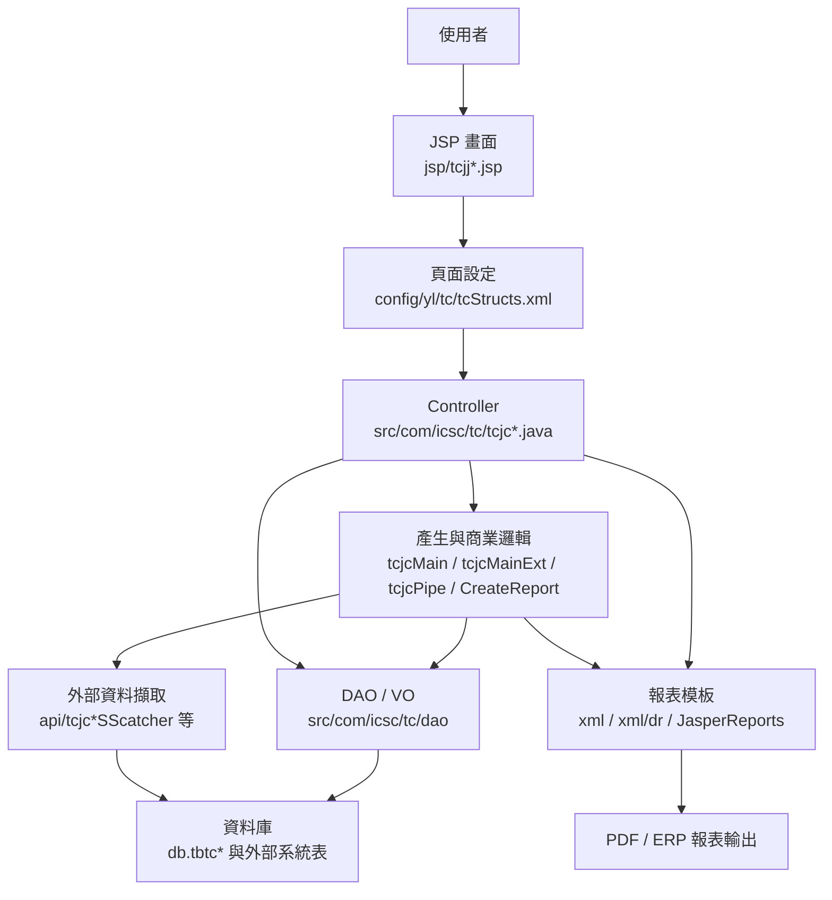

# TC 品證書管理系統功能規格手冊

## 1. 系統概述

### 1.1 系統定位

TC 模組為 ERP 內的品證書管理系統，主要支援熱軋、冷軋、鋼管、移撥鋼捲與無輻射證明等出貨品質文件之資料產生、維護、列印與資料確認。系統以出貨、訂單、發票、鋼捲／鋼管、檢驗值、化學成分、機械性質、輻射檢測與客戶列印條件為基礎，產生對內維護與對外提供的品質證明文件。

本手冊依目前 `tc` 模組程式與設定整理，主要證據來源包含：

- `config/yl/tc/tcStructs.xml`：頁面、Controller、Action 與 VO 對應。
- `config/yl/tc/tc_pipe.ini`：鋼管品證書文字、查詢 SQL、報表格式與客戶列印條件。
- `jsp/`：畫面功能、按鈕、欄位與使用者操作。
- `src/com/icsc/tc/`：Controller、產生邏輯、列印邏輯、輻射偵測與外部資料擷取。
- `src/com/icsc/tc/dao/`：`tbtc*` 主要資料表之 VO／DAO。
- `xml/`、`xml/dr/`、`xml/vcGen/`：JasperReports／報表 XML 與產生設定。

### 1.2 業務範圍

TC 模組涵蓋下列業務範圍：

- 品證書主檔與明細維護：維護證書編號、訂單、客戶、品名規格、出貨日、發票號碼、尺寸、允收標準、試驗值與列印文字。
- 品證書自動產生：依交運日期或外銷發票號碼，自 SS、SP、IL、IH、PO、SO 等來源資料產生 TC 主檔與明細。
- 批次作業：整批修改、刪除、重新產生與列印報表。
- 冷軋品證書列印條件：維護內銷／外銷冷軋品證書列印參數，例如交運日期、訂單、發票、厚度顯示與列印旗標。
- 鋼管品證書：維護鋼管品證書主檔、明細、報表預覽／列印，並提供新版鋼管品證書取號、列印與明細編輯功能。
- 無輻射證明：維護需開立無輻射證明客戶清單、證明書主檔／明細，支援產生與放行。
- 輻射偵測資料：維護鋼品入出庫方向、鋼品代碼、鋼品編號、檢測廠別、儀器編號、測值與通過否。
- 報表產出：依品證書編號、日期、Invoice No. 或鋼管資料輸出 PDF／Jasper 報表。
- 外部系統介接：透過 API 類別向銷售、庫存、熱軋、冷軋、訂單、檢驗與規範資料來源擷取資料。

### 1.3 使用者與權限

TC 模組為 ERP JSP 作業，畫面透過 `_AppId` 與 ERP 權限機制控制功能。常見 AppId 包含：

- `TCJCMAIN`：品證書主檔／明細維護。
- `TCJCCREATE`：品證書、鋼管品證書、無輻射證明產生與刪除。
- `TCJCBATCH`：批次維護與列印。
- `TCJJPIPE`：鋼管品證書主檔／明細維護。
- `TCJJCOLDPRINT`：冷軋品證書列印參數與列印。
- `tcjjRadiationDetect`：輻射偵測資料維護。
- `TCJJ12011LIST`、`TCJJ12012LIST`、`TCJJ12013LIST`、`TCJJ1301EDIT` 等：新版鋼管品證書清單、取號、列印與明細編輯。

實際角色、部門與授權範圍需依 ERP 權限設定另行確認；本手冊僅依程式中 AppId 與畫面按鈕推定功能邊界。

### 1.4 主要輸入與輸出

主要輸入：

- 交運日期、Invoice No.、訂單號碼、訂單項次、品證書編號。
- 鋼捲編號、鋼管編號、成品標籤、試片批號、試片序號。
- 客戶、品名、產品規格、尺寸與列印格式條件。
- 化學成分、機械性質、規範標準、輻射檢測資料。
- 冷軋與鋼管品證書列印參數。

主要輸出：

- 品證書資料主檔與明細資料。
- 鋼管品證書資料與列印報表。
- 冷軋品證書列印 PDF。
- 無輻射證明主檔與明細。
- 輻射偵測資料與確認狀態。
- JasperReports／ERP 報表列印檔案，例如 `tcjrMain`、`tcjrDetail`、`tcjrColdByInvoiceNo`、`tcjrColdByShipdate`、`pipeByInvoiceNo`。

## 2. 系統架構總覽

### 2.1 架構分層

TC 模組採傳統 ERP Java Servlet／JSP 架構，主要分層如下：

### 2.2 頁面與 Controller 對應

`tcStructs.xml` 定義主要作業頁面、Controller 與 Action。常見 Action 包含：

- `I`：查詢。
- `N`：新增。
- `R`：修改。
- `D`：刪除。
- `P`、`Nx`：上一筆／下一筆。
- `Print`、`Preview`、`Print_D`、`Print_In`、`Print_No`：列印或預覽列印。
- `Create_D`、`Create_In`、`CreatePipeByDate`、`CreatePipeByInvoiceNo`、`CreateNonRadiusByDate`：依日期、發票或資料條件產生證書。
- `Delete_D`、`Delete_In`、`Delete_T`：依日期、發票或移撥鋼捲條件刪除。
- `actionQ`、`actionN`、`actionU`、`actionD`：Ajax 型輻射偵測查詢、新增、修改、刪除。
- `insertCertNo`：新版鋼管品證書取號。
- `pass`、`cancel`、`passOrder`：放行、取消或訂單確認類操作。

主要頁面對應如下：

| 頁面 ID | JSP | Controller | VO | 功能定位 |
| --- | --- | --- | --- | --- |
| `tcjjMaster` | `tcjjMaster.jsp` | `tcjc02` | `tcjc02VO` | 品證書主檔維護與依品證書編號列印冷軋品證書。 |
| `tcjjDetail` | `tcjjDetail.jsp` | `tcjc03` | `tcjc03VO` | 品證書明細維護，含鋼捲、標籤、試片與尺寸資料。 |
| `tcjjRpt_1` | `tcjjRpt_1.jsp` | `tcjcRpt_1` | `tcjc02VO` | 依日期或品證書編號列印品證書。 |
| `tcjjRpt_2` | `tcjjRpt_2.jsp` | `tcjcRpt_2` | `tcjc02VO` | 依 Invoice No. 或品證書編號列印品證書。 |
| `tcjjCreate` | `tcjjCreate.jsp` | `tcjcCreate` | `tcjc02VO` | 依日期／發票產生或刪除品證書、鋼管品證書、無輻射證明與移撥鋼捲證書。 |
| `tcjjBatch` | `tcjjBatch.jsp` | `tcjcBatch` | `tcjc02VO` | 批次查詢、整批修改、刪除與重新產生報表。 |
| `tcjj061` | `tcjj061.jsp` | `tcjc061` | `tcjc061VO` | 需開立無輻射證明客戶清單維護。 |
| `tcjj062` | `tcjj062.jsp` | `tcjc062` | `tcjc062VO` | 無輻射證明主檔維護。 |
| `tcjj063`、`tcjj064` | `tcjj063.jsp`、`tcjj064.jsp` | `tcjc063`、`tcjc064` | `tcjc063VO` | 無輻射證明明細維護。 |
| `tcjjHand` | `tcjjHand.jsp` | `tcjcHand` | `tcjc03VO` | 手動建立品證書明細。 |
| `tcjjPipeMaster` | `tcjjPipeMaster.jsp` | `tcjc07` | `tcjc07VO` | 鋼管品證書主檔維護與列印。 |
| `tcjjPipeDetail` | `tcjjPipeDetail.jsp` | `tcjc08` | `tcjc08VO` | 鋼管品證書明細維護。 |
| `tcjjColdPrintIn` | `tcjjColdPrintIn.jsp` | `tcjc0201in` | `tcjc0201VO` | 內銷冷軋品證書列印參數、列印與預覽。 |
| `tcjjColdPrintOut` | `tcjjColdPrintOut.jsp` | `tcjc0201out` | `tcjc0201VO` | 外銷冷軋品證書列印參數、依發票／訂單列印與預覽。 |
| `tcjjControlWP` | `tcjjControlWP.jsp` | `tcjcControlWP` | `tcjc09VO` | 鋼管品檢資料管制與訂單放行。 |
| `tcjjCustomer` | `tcjjCustomer.jsp` | `tcjcCustomer` | `tcjc02VO` | 客戶相關品證書資料確認／放行。 |
| `tcjjEcPrintPassNonRadiation` | `tcjjEcPrintPassNonRadiation.jsp` | `tcjcEcPrintPassNonRadiation` | `tcjc062VO` | 無輻射證明 EC 列印放行或取消。 |
| `tcjjRadiationDetect` | `tcjjRadiationDetect.jsp` | `tcjcRadiationDetect` | `tcjc09VO`／`tcjc0301VO` | 輻射偵測單筆資料維護。 |
| `tcjjRDInList`、`tcjjRDOutList` | `tcjjRDInList.jsp`、`tcjjRDOutList.jsp` | `tcjcRadiationDetect` | `tcjc0301VO` | 入庫／出庫輻射偵測清單維護。 |
| `tcjjRDInListP`、`tcjjRDOutListP` | `tcjjRDInListP.jsp`、`tcjjRDOutListP.jsp` | `tcjcRadiationDetect` | `tcjc0301VO` | 依出貨單／管制作業處理輻射偵測清單。 |
| `tcjjRadiationDetect_Outsourcing` | `tcjjRadiationDetect_Outsourcing.jsp` | `tcjcRadiationDetect` | `tcjc0301VO` | 外包或委外情境之輻射偵測資料維護。 |
| `tcjj12011List`～`tcjj12014List` | `tcjj12011List.jsp` 等 | `tcjc12011CR`、`tcjc12012CR`、`tcjc12013CR`、`tcjc1201CR` | `tcjc010VO` | 新版鋼管品證書清單、查詢、取號、列印與刪除。 |
| `tcjj12021Edit`～`tcjj12024Edit` | `tcjj12021Edit.jsp` 等 | `tcjc12021CR`、`tcjc12022CR`、`tcjc1202CR` | `tcjc010VO` | 新版鋼管品證書內容編輯。 |
| `tcjj1301Edit` | `tcjj1301Edit.jsp` | `tcjc13CR` | `tcjc010VO` | 鋼管品證書試片／證書明細編輯。 |

### 2.3 主要程式元件

| 類別／元件 | 功能定位 | 說明 |
| --- | --- | --- |
| `tcjcMain` | 核心品證書邏輯 | 統一處理主檔／明細新增、修改、刪除、查詢、手動製證、重新取得鋼捲檢驗資料、依 SS 資料產生品證書、無輻射證明產生等。 |
| `tcjcMainExt` | 延伸資料整理 | 取得證書鋼捲、更新檢驗值、寫入規範值、取得可產生清單與相關資料彙整。 |
| `tcjcCreate` | 產生／刪除作業 Controller | 依交運日期、Invoice No.、鋼管或移撥條件呼叫產生或刪除流程。 |
| `tcjcPipe`、`tcjcPipeNew`、`tcjcPipeCertNewUtil` | 鋼管品證書邏輯 | 鋼管資料產生、取號、分組、鋼管證書新版報表與細節處理。 |
| `CreateReport`、`tcjcCreateReport` | 報表資料組裝 | 將 `tbtc*` 資料轉為報表容器並產出報表資料。 |
| `tcjcRpt_1`、`tcjcRpt_2` | 報表列印 Controller | 依品證書編號、日期或發票號碼觸發列印。 |
| `tcjcRadiationDetect` | 輻射偵測 Controller | 處理單筆、清單、出貨單與委外情境之輻射偵測資料 CRUD 與驗證。 |
| `tcjcSScatcher` | SS 出貨資料擷取 | 呼叫 SS API 取得交運資料，並轉入 TC 暫存或正式資料。 |
| `tcjcSPcatcher` | SP 外銷資料擷取 | 依 Invoice No. 取得外銷訂單與鋼捲資料，並維護 `tbtc04`。 |
| `tcjcIHcatcher` | IH 熱軋資料擷取 | 依鋼捲／標籤取得熱軋檢驗資料。 |
| `tcjcILcatcher` | IL 冷軋資料擷取 | 檢查與取得冷軋鋼捲、出貨或訂單資料。 |
| `tcjcChemStdCatcher`、`tcjcMachStdCatcher` | 規範標準擷取 | 依訂單、項次與規格取得化學成分與機械性質標準。 |
| `tcjcOutApiQS` | 對外查詢 API | 提供依品證書編號查詢品證書資料與驗證碼圖形等對外支援功能。 |

### 2.4 主要資料流

#### 2.4.1 依交運日期產生品證書

1. 使用者於 `tcjjCreate.jsp` 輸入交運日期並執行 `Create_D`。
2. `tcjcCreate.createTCbyDate()` 呼叫 `tcjcMain.doSSLogic()`。
3. 系統透過 `tcjcSScatcher` 取得 SS 出貨資料。
4. `tcjcMain` 透過 IH／IL／規範擷取元件補齊鋼捲、訂單、化學成分、機械性質與規格值。
5. 系統寫入 `tbtc02` 主檔與 `tbtc03` 明細；必要時同步 `tbtc01`、`tbtc051`、`tbtc052` 或其他衍生資料。
6. 使用者可於主檔、明細或報表頁查詢、修改與列印。

#### 2.4.2 依 Invoice No. 產生外銷品證書

1. 使用者於 `tcjjCreate.jsp` 輸入 Invoice No. 並執行 `Create_In`。
2. `tcjcCreate.createTCbyInvoiceNo()` 呼叫 `tcjcAPI` 或 `tcjcMain` 相關邏輯。
3. 系統透過 SP API 取得外銷訂單與鋼捲資料，並比對 IH／IL 檢驗資料。
4. 系統建立或更新 TC 主檔、明細與外銷發票暫存資料。
5. 使用者可依 Invoice No. 或品證書編號列印。

#### 2.4.3 鋼管品證書產生與列印

1. 使用者於 `tcjjCreate.jsp` 依交運日期或 Invoice No. 執行鋼管品證書產生。
2. `tcjcCreate.createPipeByDate()` 或 `createPipeByInvoiceNo()` 呼叫 `tcjcPipe`／`tcjcMain.doSSLogic_Pipe()`。
3. 系統依 SS 出貨、訂單、鋼管品檢與規範資料產生 `tbtc07`／`tbtc08` 或新版 `tbtc010` 相關資料。
4. 使用者於 `tcjjPipeMaster`、`tcjjPipeDetail` 或 `tcjj12011List`～`tcjj1301Edit` 維護內容、取號與列印。

#### 2.4.4 無輻射證明產生與放行

1. 使用者維護 `tbtc061` 需開立無輻射證明客戶清單。
2. 系統依日期與出貨資料判斷是否需產生無輻射證明。
3. `tcjcMain.doNonRadiativeLogic()` 或手動流程建立 `tbtc062` 主檔與 `tbtc063` 明細。
4. `tcjjEcPrintPassNonRadiation` 提供 EC 列印放行與取消。
5. 輻射偵測結果可透過 `tbtc0301` 排除或控制不合格鋼品。

#### 2.4.5 輻射偵測資料維護

1. 使用者於 `tcjjRadiationDetect.jsp` 或入出庫清單頁維護輻射偵測資料。
2. `tcjcRadiationDetect` 驗證入出庫方向、鋼品代碼、鋼品編號、檢測廠別、儀器、測值、檢測日期、檢測者與通過否。
3. 系統寫入或更新 `tbtc0301`。
4. 產生無輻射證明或出貨檢核時，系統會參考 `tbtc0301` 判斷特定鋼品是否通過。

## 3. 功能模組詳細說明

### 3.1 品證書主檔維護

| 項目 | 說明 |
| --- | --- |
| 入口頁面 | `tcjjMaster.jsp` |
| Controller | `tcjc02` |
| VO／DAO | `tcjc02VO`／`tcjc02DAO` |
| 主要資料表 | `db.tbtc02` |
| 主要操作 | 查詢、新增、修改、刪除、上一筆、下一筆、依品證書編號列印冷軋品證書 |
| 功能說明 | 維護品證書主檔資料，包含品證書編號、訂單、客戶、品名規格、出貨日期、發票號碼、尺寸與列印相關欄位。刪除時會搭配明細或其他資料回復邏輯，避免鋼捲資料狀態不一致。 |
| 關聯功能 | 品證書明細維護、報表列印、批次產生、冷軋列印、無輻射證明產生。 |

### 3.2 品證書明細維護

| 項目 | 說明 |
| --- | --- |
| 入口頁面 | `tcjjDetail.jsp` |
| Controller | `tcjc03` |
| VO／DAO | `tcjc03VO`／`tcjc03DAO` |
| 主要資料表 | `db.tbtc03` |
| 主要操作 | 查詢、新增、修改、刪除、上一筆、下一筆 |
| 功能說明 | 維護單張品證書下的鋼捲／標籤／試片明細，包含鋼捲編號、成品標籤、試片批號、試片序號、產出厚度、產出寬度等。 |
| 關聯功能 | 主檔維護、手動製證、報表資料組裝、無輻射證明與鋼捲檢驗資料更新。 |

### 3.3 品證書產生與刪除作業

| 項目 | 說明 |
| --- | --- |
| 入口頁面 | `tcjjCreate.jsp` |
| Controller | `tcjcCreate` |
| 主要邏輯 | `tcjcMain`、`tcjcAPI`、`tcjcPipe`、`tcjcTransCoilCertCreateThread` |
| 主要操作 | 依交運日期產生、依 Invoice No. 產生、依日期／發票刪除、產生鋼管品證書、產生無輻射證明、移撥鋼捲產生與刪除 |
| 功能說明 | 作為 TC 模組資料產生與清除的主要入口。系統會依使用者輸入條件從外部來源取回出貨、訂單、鋼捲與檢驗資料，並寫入 TC 主檔與明細。 |
| 關聯功能 | SS、SP、IH、IL、PO、SO 資料來源、主檔／明細、鋼管品證書、無輻射證明、批次列印。 |

### 3.4 品證書報表列印

| 項目 | 說明 |
| --- | --- |
| 入口頁面 | `tcjjRpt_1.jsp`、`tcjjRpt_2.jsp`、`tcjjMaster.jsp` |
| Controller | `tcjcRpt_1`、`tcjcRpt_2`、`tcjc02` |
| 報表元件 | `CreateReport`、`tcjcCreateReport`、`ReportContainer` |
| 報表模板 | `xml/tcjrMain.xml`、`xml/tcjrDetail.xml`、`xml/dr/tcjrMain.xml`、`xml/dr/tcjrDetail.xml` |
| 主要操作 | 依日期列印、依品證書編號列印、依 Invoice No. 列印、冷軋新版列印 |
| 功能說明 | 將 TC 主檔、明細、規範與檢驗資料組成報表資料，產出 PDF 或 ERP 報表。部分新版列印透過 `Ajax.JavaRequest.printReport()` 呼叫報表代號。 |
| 關聯功能 | 主檔／明細維護、批次作業、冷軋列印參數、報表 XML。 |

### 3.5 批次維護與重新產生報表

| 項目 | 說明 |
| --- | --- |
| 入口頁面 | `tcjjBatch.jsp` |
| Controller | `tcjcBatch` |
| VO／DAO | `tcjc02VO`／`tcjc02DAO` |
| 主要操作 | 查詢、整批修改、刪除、重新產生新版報表、預覽列印 |
| 功能說明 | 針對同一 Invoice No. 或批次條件下的品證書資料進行整批維護與報表重新產生。畫面顯示發票號碼、客戶名稱、製品名稱等資料，並提醒發票號碼不可修改。 |
| 關聯功能 | 品證書主檔、報表列印、外銷發票資料、冷軋列印。 |

### 3.6 冷軋品證書列印參數維護

| 項目 | 說明 |
| --- | --- |
| 入口頁面 | `tcjjColdPrintIn.jsp`、`tcjjColdPrintOut.jsp` |
| Controller | `tcjc0201in`、`tcjc0201out` |
| VO／DAO | `tcjc0201VO`／`tcjc0201DAO` |
| 主要資料表 | `db.tbtc0201` |
| 主要操作 | 查詢、新增、修改、刪除、列印、預覽列印、送出 |
| 功能說明 | 維護冷軋品證書列印參數。內銷以交運日期／訂單為主，外銷支援依發票或訂單列印，並可控制交運日期、訂單、發票、證明書日期、厚度等欄位是否列印。 |
| 關聯功能 | 主檔依品證書編號列印冷軋品證書、`tcjrColdByInvoiceNo`、`tcjrColdByShipdate`、`tcjrColdDetail` 報表。 |

### 3.7 鋼管品證書主檔與明細維護

| 項目 | 說明 |
| --- | --- |
| 入口頁面 | `tcjjPipeMaster.jsp`、`tcjjPipeDetail.jsp` |
| Controller | `tcjc07`、`tcjc08` |
| VO／DAO | `tcjc07VO`／`tcjc07DAO`、`tcjc08VO`／`tcjc08DAO` |
| 主要資料表 | `db.tbtc07`、`db.tbtc08` |
| 主要操作 | 查詢、新增、修改、刪除、預覽列印、列印 |
| 功能說明 | 維護鋼管品證書的主檔與明細資料，主檔包含文件主題、客戶、訂單、規格與證書資料，明細保存鋼管、鋼帶、爐號、試驗與檢驗值等資料。 |
| 關聯功能 | 鋼管品證書產生、鋼管新版取號、報表列印、鋼管品檢資料確認。 |

### 3.8 新版鋼管品證書清單、取號與編輯

| 項目 | 說明 |
| --- | --- |
| 入口頁面 | `tcjj12011List.jsp`～`tcjj12014List.jsp`、`tcjj12021Edit.jsp`～`tcjj12024Edit.jsp`、`tcjj1301Edit.jsp` |
| Controller | `tcjc12011CR`、`tcjc12012CR`、`tcjc12013CR`、`tcjc1201CR`、`tcjc12021CR`、`tcjc12022CR`、`tcjc1202CR`、`tcjc13CR` |
| VO／DAO | `tcjc010VO`／`tcjc010DAO` |
| 主要資料表 | `db.tbtc010` |
| 主要操作 | 查詢、刪除、取號、列印、內容修改、未完成鋼管列印 |
| 功能說明 | 提供新版鋼管品證書作業，包含依 Invoice No. 查詢、品證書號碼取號、列印、主體資料編輯與試片／明細編輯。 |
| 關聯功能 | `tcjcPipeNew`、`tcjcPipeCertNewUtil`、鋼管報表代號、鋼管主檔／明細資料。 |

### 3.9 鋼管品檢資料確認與放行

| 項目 | 說明 |
| --- | --- |
| 入口頁面 | `tcjjControlWP.jsp`、`tcjjCustomer.jsp` |
| Controller | `tcjcControlWP`、`tcjcCustomer` |
| VO／DAO | `tcjc09VO`／`tcjc09DAO` |
| 主要資料表 | `db.tbtc09` |
| 主要操作 | 查詢、新增、修改、刪除、訂單放行、客戶放行 |
| 功能說明 | 維護鋼管品檢資料確認狀態，作為鋼管品證書或相關出貨品檢資料是否可繼續處理的控制點。 |
| 關聯功能 | 鋼管證書產生、訂單確認、客戶確認、輻射偵測相關畫面。 |

### 3.10 無輻射證明客戶與證明書維護

| 項目 | 說明 |
| --- | --- |
| 入口頁面 | `tcjj061.jsp`、`tcjj062.jsp`、`tcjj063.jsp`、`tcjj064.jsp`、`tcjjEcPrintPassNonRadiation.jsp` |
| Controller | `tcjc061`、`tcjc062`、`tcjc063`、`tcjc064`、`tcjcEcPrintPassNonRadiation` |
| VO／DAO | `tcjc061VO`／`tcjc061DAO`、`tcjc062VO`／`tcjc062DAO`、`tcjc063VO`／`tcjc063DAO` |
| 主要資料表 | `DB.TBTC061`、`DB.TBTC062`、`db.tbtc063` |
| 主要操作 | 客戶清單維護、證明書主檔維護、明細維護、EC 列印放行、取消放行 |
| 功能說明 | 管理需開立無輻射證明的客戶與證明書資料。系統依客戶、品名規格、出貨資料與鋼捲／鋼胚檢測資訊建立證明主檔與明細。 |
| 關聯功能 | 品證書產生、輻射偵測資料、EC 列印放行、外部熱軋與鋼胚資料。 |

### 3.11 輻射偵測資料維護

| 項目 | 說明 |
| --- | --- |
| 入口頁面 | `tcjjRadiationDetect.jsp`、`tcjjRDInList.jsp`、`tcjjRDOutList.jsp`、`tcjjRDInListP.jsp`、`tcjjRDOutListP.jsp`、`tcjjRadiationDetect_Outsourcing.jsp` |
| Controller | `tcjcRadiationDetect` |
| VO／DAO | `tcjc0301VO`／`tcjc0301DAO` |
| 主要資料表 | `DB.TBTC0301` |
| 主要操作 | 單筆查詢、新增、修改、刪除；入出庫清單新增、修改、刪除；委外資料維護 |
| 功能說明 | 維護鋼品輻射檢測資料。畫面欄位包含入出庫方向、鋼品代碼、鋼品編號、檢測廠別、儀器編號、輻射測值、背景測值、5 公分／30 公分／100 公分測值、通過否、檢測日期與檢測者。 |
| 關聯功能 | 無輻射證明產生、出貨單／入出庫資料、`tbilyl0011`、`tbwl0020`、`tbwp0010`、`tbissl01`。 |

### 3.12 手動製證

| 項目 | 說明 |
| --- | --- |
| 入口頁面 | `tcjjHand.jsp`、`tcjjbyhand.jsp` |
| Controller | `tcjcHand` |
| VO／DAO | `tcjc03VO`／`tcjc03DAO` |
| 主要操作 | 查詢、新增、修改、刪除 |
| 功能說明 | 當自動來源資料不足或需人工指定鋼捲時，提供手動建立品證書明細與鋼捲資料的入口。核心邏輯會透過 IL／IH 檢查鋼捲與補齊檢驗資料。 |
| 關聯功能 | 品證書主檔／明細、外部檢驗資料、報表列印。 |

### 3.13 主要資料表

| 資料表 | VO／DAO | 功能定位 | 主要用途 | 關聯功能 |
| --- | --- | --- | --- | --- |
| `db.tbtc001` | `tcjc001VO`／`tcjc001DAO` | 舊版或延伸品證書主體資料 | 儲存品證書編號、訂單項次、證書日期、客戶、品名規格、出貨、發票、報表路徑、尺寸、機械性質、衝擊值與狀態等完整證書資料。 | 報表資料組裝、歷史或延伸品證書維護。 |
| `db.tbtc002` | `tcjc002VO`／`tcjc002DAO` | 化學成分資料 | 以品證書編號與爐號保存鋼胚或爐次化學成分，含 A／B／C 組成欄位。 | 品證書報表、`tc_pipe.ini` 的 `slabComp` SQL、外部 `tbissl02` 資料。 |
| `db.tbtc003` | `tcjc003VO`／`tcjc003DAO` | 鋼管或新版證書明細資料 | 保存鋼管／管件出貨與證書明細，程式與 `tc_pipe.ini` 以此查詢 `pipeNo`、`heatNo`、`sampleId`、重量與證書編號。 | 鋼管證書產生、鋼管報表、依交運日期或發票產生證書。 |
| `db.tbtc004` | `tcjc004VO`／`tcjc004DAO` | 外銷發票資料 | 保存 Invoice No.、出貨日期、客戶與 LC 等外銷資料；由 SP 介接類別建立或更新。 | 外銷品證書產生、依 Invoice No. 查詢與刪除。 |
| `db.tbtc01` | `tcjc01VO`／`tcjc01DAO` | SS 出貨轉入暫存／原始資料 | 保存從 SS 出貨資料轉入的資料，供依交運日期產生品證書前整理使用。 | `tcjcSScatcher`、`tcjcMain.doSSLogic()`、依日期刪除。 |
| `db.tbtc02` | `tcjc02VO`／`tcjc02DAO` | 品證書主檔 | 保存一般品證書主檔資料，例如證書編號、證書日期、訂單、客戶、品名規格、交運日期、發票號碼、尺寸、報表欄位與列印相關資料。 | 主檔維護、報表列印、批次作業、無輻射證明產生、依日期／發票刪除。 |
| `db.tbtc0201` | `tcjc0201VO`／`tcjc0201DAO` | 冷軋品證書列印參數 | 保存冷軋品證書依交運日期、訂單或發票列印時的顯示旗標與列印參數。 | 內銷／外銷冷軋列印、`tcjrColdByInvoiceNo`、`tcjrColdByShipdate`、主檔冷軋列印。 |
| `db.tbtc03` | `tcjc03VO`／`tcjc03DAO` | 品證書明細 | 保存品證書下的鋼捲、標籤、試片、尺寸、重量與檢驗值等明細。 | 明細維護、報表資料、手動製證、無輻射證明、移撥鋼捲刪除。 |
| `DB.TBTC0301` | `tcjc0301VO`／`tcjc0301DAO` | 輻射偵測資料 | 保存鋼品代碼、鋼品編號、入出庫方向、檢測廠別、儀器、測值、通過否、檢測日期與檢測者。 | 輻射偵測維護、無輻射證明產生、入出庫與出貨單檢核。 |
| `db.tbtc04` | `tcjc04VO`／`tcjc04DAO` | 外銷 Invoice 控制資料 | 保存外銷發票與出貨資料，支援外銷品證書產生時判斷資料是否已存在或需更新。 | `tcjcSPcatcher`、外銷品證書產生、依 Invoice No. 刪除。 |
| `db.tbtc051` | `tcjc051DAO` | 舊版／特定品證書主檔 | 程式於依日期／發票刪除時同步刪除此表，推定保存特定格式或歷史品證書主檔。未見對應 VO 正式檔，欄位級用途需再確認。 | 批次產生與刪除、歷史格式品證書。 |
| `db.tbtc052` | `tcjc052DAO` | 舊版／特定品證書明細 | 程式於刪除 `tbtc051` 時同步刪除此表，推定保存特定格式或歷史品證書明細。未見對應 VO 正式檔，欄位級用途需再確認。 | 批次產生與刪除、歷史格式品證書。 |
| `DB.TBTC061` | `tcjc061VO`／`tcjc061DAO` | 需開立無輻射證明客戶清單 | 保存客戶是否需開立無輻射證明、客戶名稱等資料。 | 無輻射證明自動產生、客戶條件判斷。 |
| `DB.TBTC062` | `tcjc062VO`／`tcjc062DAO` | 無輻射證明主檔 | 保存無輻射證明編號、日期、訂單、客戶、品名規格、出貨日期、發票、數量、總重與 EC 列印放行狀態。 | 無輻射證明維護、EC 列印放行、無輻射報表。 |
| `db.tbtc063` | `tcjc063VO`／`tcjc063DAO` | 無輻射證明明細 | 保存無輻射證明下的鋼捲編號與重量。 | 無輻射證明明細維護、依鋼捲產生證明、輻射檢測排除。 |
| `db.tbtc07` | `tcjc07VO`／`tcjc07DAO` | 鋼管品證書主檔 | 保存鋼管品證書主檔，含證書主題、訂單、客戶、規格、日期、尺寸與相關品質證明資料。 | 鋼管主檔維護、鋼管證書列印、依日期／發票產生。 |
| `db.tbtc08` | `tcjc08VO`／`tcjc08DAO` | 鋼管品證書明細 | 保存鋼管品證書明細，含鋼帶／鋼管、爐號、試片與檢驗資料；亦會查詢 `tbtc03` 取得相關鋼捲資料。 | 鋼管明細維護、鋼管報表、鋼管證書產生。 |
| `db.tbtc09` | `tcjc09VO`／`tcjc09DAO` | 鋼管品檢資料確認 | 保存鋼管品檢資料確認與放行資訊，主要鍵值包含訂單項次。 | 鋼管品檢確認、訂單放行、客戶放行、鋼管證書控制。 |
| `db.tbtc010` | `tcjc010VO`／`tcjc010DAO` | 新版鋼管品證書資料 | 保存新版鋼管品證書清單、取號、列印與編輯所需資料。 | `tcjj12011List`～`tcjj1301Edit`、`tcjcPipeNew`、新版鋼管報表。 |

### 3.14 外部資料表與介接來源

| 資料來源 | 使用位置 | 功能定位 |
| --- | --- | --- |
| `db.tbssyl15` | `tc_pipe.ini`、`tcjcSScatcher` | SS 出貨／銷售結算資料，依交運日期、發票、標籤與訂單項次取得可產生品證書資料。 |
| `db.tbsoitem` | `tc_pipe.ini` | SO 訂單項目資料，提供訂單尺寸與客戶需求規格。 |
| `db.tbpo02`、`db.tbpo0201`、`db.tbpo0101`、`db.tbpo0104` | `tc_pipe.ini`、鋼管邏輯 | PO／製程或訂單規格資料，提供鋼管尺寸、公差、檢驗與製程標準。 |
| `db.tbissl02` | `tc_pipe.ini`、`tcjcMain` | 鋼胚／爐次化學成分與無輻射保證相關資料。 |
| `db.tbissl01` | `tcjcRadiationDetect` | 鋼胚資料，用於委外或輻射偵測鋼品存在檢查。 |
| `db.tbihcr01`、`db.tbihcr01h` | `tcjcIHcatcher`、`tcjcMain` | 熱軋鋼捲檢驗／歷史資料，提供鋼捲、標籤、爐號與鋼胚連結。 |
| `db.tbilyl0010`、`db.tbilyl0011` | `tcjcILcatcher`、`tcjcCreate`、`tcjcRadiationDetect` | 冷軋出貨、鋼捲與訂單資料，支援冷軋品證書、移撥鋼捲與入出庫檢核。 |
| `db.tbwl0020`、`db.tbwp0010` | `tcjcRadiationDetect` | 出貨單或管制資料，支援入出庫清單型輻射偵測資料產生。 |
| `DB.TBTQPCHEM` 等檢驗表 | `tcjcPipeCertNewUtil` | 鋼管新版證書取得化學成分或品檢資料。 |

### 3.15 報表與設定檔

| 檔案／路徑 | 功能定位 | 主要用途 |
| --- | --- | --- |
| `config/yl/tc/tc_pipe.ini` | 鋼管品證書設定 | 保存中英文標題、地址、證明文字、單位、產生 SQL、客戶對應報表格式與 Jasper 檔名。 |
| `xml/tcjrMain.xml`、`xml/dr/tcjrMain.xml` | 品證書主報表 | 一般品證書主報表模板。 |
| `xml/tcjrDetail.xml`、`xml/dr/tcjrDetail.xml` | 品證書明細報表 | 品證書明細報表模板。 |
| `xml/tcjrColdByInvoiceNo.xml` | 冷軋依發票列印報表 | 外銷冷軋品證書依 Invoice No. 產出。 |
| `xml/tcjrColdByShipdate.xml` | 冷軋依交運日期列印報表 | 內銷冷軋品證書依交運日期產出。 |
| `xml/tcjrColdDetail.xml` | 冷軋明細報表 | 冷軋品證書明細資料。 |
| `xml/pipeByInvoiceNo.xml` | 鋼管依發票報表 | 鋼管品證書依 Invoice No. 產出。 |
| `xml/vcGen/*.xml` | VC／程式產生設定 | 支援 TC 相關畫面或程式產生設定，含 `tcMain`、`tcCreate`、`tcBatch`、`tcReport` 等。 |

### 3.16 待確認事項

下列事項僅從目前程式與設定推定，正式版若需作為驗收文件，建議再補資料庫 schema、權限設定與實際使用者確認：

- `tbtc051`、`tbtc052` 未在正式 DAO 目錄中看到完整 VO 檔，雖由刪除流程確認為相關證書主檔／明細，但正式中文名稱與欄位用途需再比對 DB schema。
- `tbtc001`～`tbtc004` 與 `tbtc01`～`tbtc04` 之間存在新舊或不同格式資料模型並存情況，實際啟用範圍需依目前線上入口與使用者操作確認。
- 新版鋼管品證書 `tcjj12011List`～`tcjj1301Edit` 的各頁差異，需再依使用者作業情境確認其對應產品類型或格式版本。
- 報表代號如 `GPR00140`、`GHR00430` 的正式部署位置與權限，需由報表平台設定確認。
- 欄位級規則、資料必填、檢核訊息與狀態流轉，本手冊僅列核心功能，未逐欄驗證所有 JavaScript 與 VO 檢核。
