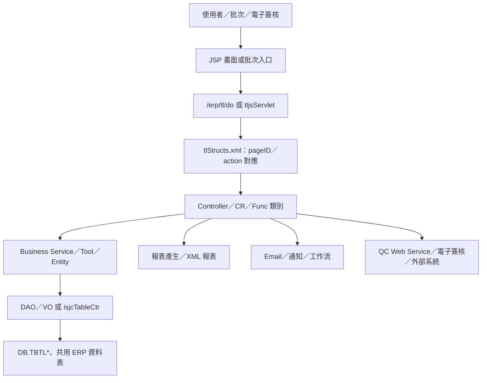

# TL 客訴與品質異常管理系統功能規格手冊

> 依據目前 `tl` 模組程式與設定檔整理：`config/yl/tl/tlStructs.xml`、`config/yl/tl/tlConfig.ini`、`jsp/tljj*.jsp`、`src/com/icsc/tl/**/*.java`、`src/com/chsteel/tl/esign/tljc2301Esign.java`、`xml/dr/*.xml`。  
> 本文件以既有程式可確認內容為主；部分舊 JSP 中文畫面文字因 Big5 顯示限制，功能名稱以程式檔名、`_AppId`、DAO 註解、SQL 資料表與 Controller 方法推定。

## 1. 系統概述

### 1.1 系統定位

TL 模組為 ERP 中處理客訴、品質異常、鋼捲退貨、報支、簽核、通知及相關報表的作業模組。系統以傳統 Java Servlet／JSP 架構運作，主要透過 `/erp/tl/do?_pageId=...&_action=...` 進入 Controller，並由 JSP 畫面、Controller／CR 類別、DAO／VO 及跨系統查詢資料表共同完成維護、查詢、簽核與資料轉拋。

### 1.2 主要業務範圍

1. 客訴主檔與鋼捲明細維護。
2. 客訴缺陷、處置、報支與退貨資料維護。
3. 品質異常單主檔、明細、簽註、矯正／預防措施處理。
4. 客訴前置作業與後續轉正式客訴資料。
5. 客訴 E 化暫存資料、客戶確認與通知。
6. 客訴資料電子郵件寄送基本資料與附件上傳。
7. 客訴、品質異常與報支相關報表產生。
8. 批次郵件、催辦通知、品質異常排程及電子簽核回呼。

### 1.3 使用者與角色

| 使用者／角色 | 作業定位 | 主要功能 |
| --- | --- | --- |
| 業務／客訴承辦 | 客訴資料建立與維護 | 建立客訴主檔、鋼捲明細、缺陷資料、處置與報支資料 |
| 品保／品管人員 | 品質異常與原因處理 | 維護品質異常單、異常明細、簽註與矯正／預防措施 |
| 主管／簽核人員 | 簽核與確認 | 送簽、核准、退回、關閉、查詢簽核紀錄 |
| 客戶或外部確認流程 | 客訴 E 化與確認 | 客訴資料確認、暫存資料轉正式客訴、通知與回覆 |
| 系統管理／批次作業 | 背景通知與介接 | 郵件寄送、逾期催辦、品質異常排程、電子簽核回呼 |

### 1.4 系統邊界與外部介接

| 介接對象 | 程式／設定線索 | 用途 |
| --- | --- | --- |
| QC Web Service | `config/yl/tl/tlConfig.ini` 的 `retEndPoint=http://testec.chsteel.com.tw:80/erp/qc/jws/qcjw001.jws` | 與 QC 客訴或品質相關服務介接，正式位址在設定中保留註解 |
| 電子簽核 | `src/com/chsteel/tl/esign/tljc2301Esign.java` | 依電子簽核狀態產生報告、回寫或複製報支相關資料 |
| ERP 共用表／訂單與出貨資料 | `TBGP10`、`TBGP26`、`TBISPB02`、`TBILYL0010`、`TBILYL0011`、`TBSOITEM`、`TBSOORDER`、`TBWl0020`、`TBWL0025` 等 | 取得客戶、產品、鋼捲、訂單、缺陷代碼、行事曆與使用者資料 |
| 財務／報支資料 | `TBAPYL0201`、`TBFN330`、`TBPO01`、`TBPO02` | 客訴報支、付款、帳務通知與請款資料查詢 |

### 1.5 主要文件與程式位置

| 類型 | 路徑 | 說明 |
| --- | --- | --- |
| 頁面流程設定 | `config/yl/tl/tlStructs.xml` | 定義部分 `pageID`、JSP、Controller、Action、VO 映射 |
| 系統設定 | `config/yl/tl/tlConfig.ini` | 定義 QC Web Service endpoint |
| JSP 畫面 | `jsp/` | 依 `tljj01`、`tljj06`、`tljj09`、`tljj21`、`tljjyl01Pre` 等編號組成作業畫面 |
| Controller／CR | `src/com/icsc/tl/`、`src/com/icsc/tl/controller/` | 負責業務流程、資料查詢、送簽、轉檔、寄信、列印 |
| DAO／VO | `src/com/icsc/tl/dao/` 及部分 `src/com/icsc/tl/` | 對應 `TBTL*` 資料表 |
| Entity／報表資料 | `src/com/icsc/tl/entity/`、`src/com/icsc/tl/gen/` | 報表查詢資料列、時效管理、通知案件、報表產生 |
| 批次 | `src/com/icsc/tl/batch/`、`src/com/icsc/tl/tljc*Batch*.java` | 郵件、催辦、品質異常排程 |
| 報表 XML | `xml/dr/tljr001.XML`、`xml/dr/tljrCr001.xml` | 客訴／調查報告類報表格式與查詢資料 |

## 2. 系統架構總覽

### 2.1 邏輯架構

### 2.2 分層說明

| 分層 | 元件 | 說明 |
| --- | --- | --- |
| 畫面層 | `jsp/tljj*.jsp`、`html/tljt*.jss` | 提供查詢、清單、編輯、Popup、Tab、Ajax 與共用畫面元件 |
| 流程設定層 | `config/yl/tl/tlStructs.xml` | 將 `_pageId` 對應到 JSP、Controller、Action method 與 VO |
| 控制層 | `tljcCr*.java`、`tljcyl*.java`、`controller/tljc31Func.java` | 接收 `_action`，執行新增、修改、刪除、查詢、送簽、退回、列印、上傳 |
| 商業邏輯層 | `bs/`、`tool/`、`entity/` | 處理客訴流程、時效管理、簽核流程設定、主鍵、壓縮、通知與報表資料整形 |
| 資料存取層 | `dao/*DAO.java`、`*VO.java`、`isjcTableCtr` | 對 `TBTL*` 及共用表進行 CRUD 與查詢 |
| 報表／輸出層 | `gen/`、`xml/dr/`、`tljcZipIReport` | 產生客訴報告、調查報告、報支資料與壓縮檔 |
| 背景作業層 | `tljcMailBatch*`、`tljcInformBatch`、`tljcHeraldBatch`、`batch/tljcQCScheduleBat.java` | 定期寄送、通知、催辦與品質異常排程 |

### 2.3 頁面與 Controller 對應

| Page ID／作業 | JSP | Controller | 主要 Action |
| --- | --- | --- | --- |
| `tljjyl01PreMain` | `tljjyl01PreMain.jsp` | `com.icsc.tl.tljcyl01PreCR` | `query`、`create`、`update`、`updateS`、`delete` |
| `tljjyl01PreDetail` | `tljjyl01PreDetailEdit.jsp` | `com.icsc.tl.tljcyl01PreDCR` | `query`、`create`、`update`、`delete`、`orderInsert` |
| `tljjyl01PreRecordEdit` | `tljjyl01PreRecordEdit.jsp` | `com.icsc.tl.tljcyl01PreDCR` | `query1` |
| `tljjyl71Edit` | `tljjyl71Edit.jsp` | `com.icsc.tl.tljcyl71CR` | `query`、`create`、`update`、`reject`、`update1`、`delete`、`Auth`、`close` |
| `tljjyl04List` | `tljjyl04List.jsp` | `com.icsc.tl.tljcyl99CR` | `query`、`sendCC`、`update`、`delete` |
| `tljja1` | `tljja1.jsp` | `com.icsc.tl.tljcA1` | `query`、`insert`、`delete`、`cscData` |
| `tljj31Edit` | `tljj31Edit.jsp` | `com.icsc.tl.controller.tljc31Func` | `query`、`create`、`modify`、`delete`、`upload`、`loadUploadForm` |
| `tljj81a`、`tljj82a` | `tljj81a.jsp`、`tljj82a.jsp` | `com.icsc.tl.func.tljc81aFunc`、`tljc82aFunc` | `query`、`create`、`update`、`delete`、`send`、`approve`、`back`、`print` |

> 注意：`tlStructs.xml` 中的 `tljj81a`、`tljj82a` Controller 指向 `com.icsc.tl.func.*`，但目前目錄盤點未看到對應 `func/` 原始檔；可能由其他模組或未納入此次目錄的程式提供，實際部署需再查 classpath。

### 2.4 典型流程

#### 2.4.1 客訴立案與明細維護

1. 使用者進入 `TL01` 相關 JSP，例如 `tljj0101.jsp`、`tljj0201.jsp`、`tljj0301.jsp`。
2. 客訴主檔寫入 `TBTL01M`，鋼捲明細寫入 `TBTL01D`，缺陷明細寫入 `TBTL01DD` 或 `TBTL02DD`。
3. 程式由 `tljcCr01.java` 處理訂單匯入、鋼捲、缺陷與客訴主檔關聯。
4. 輔助查詢會讀取訂單、出貨、鋼捲與客戶資料，例如 `TBILYL0010`、`TBILYL0011`、`TBSOITEM`、`TBSSYL15`、`TBISPB02`。

#### 2.4.2 客訴處理、報支與簽核

1. `TL02`、`TL03` 相關 JSP 維護調查、處置、報支或付款資料。
2. `tljcCr11.java`、`tljcCr21.java` 等處理列印調查報告、報支資料與送簽。
3. 報支關聯資料使用 `TBTL20`、`TBTL21`，並可能連結 `TBAPYL0201` 等財務資料。
4. 電子簽核回呼由 `tljc2301Esign.java` 處理，依簽核狀態產生報告並調整後續資料。

#### 2.4.3 品質異常與矯正／預防措施

1. `TLJJ09`、`TL51`、`TL61` 相關 JSP 維護品質異常資料。
2. 主檔、明細、簽註與處理說明分別使用 `TBTL09`、`TBTL0902`、`TBTL0901`、`TBTL0903`、`TBTL0904`、`TBTL0905`。
3. `tljcCr09.java`、`tljcCr51.java`、`tljcCr61.java` 依流程進行儲存、送出與異常資料查詢。
4. `tljcMailBatchQcAbnormal.java`、`tljcQCScheduleBat.java` 支援品質異常通知或排程。

#### 2.4.4 客訴前置與 E 化確認

1. `TLJJ01PRE` 使用 `tljjyl01Pre*.jsp` 建立前置主檔、明細與簽核紀錄。
2. `tljcyl01PreCR.java` 管理前置主檔狀態與送出，`tljcyl01PreDCR.java` 管理明細與訂單匯入。
3. 前置資料先存放於 `TBTL01PREMAIN`、`TBTL01PREDETAIL`、`TBTL01PRERECORD`。
4. 確認後透過 DAO 轉寫正式 `TBTL01M`、`TBTL01D`、`TBTL01DD`。
5. `TLJJYL04`、`tljcyl99CR.java` 以 `TBTL99`、`TBTLFILETMP` 暫存客訴 E 化鋼捲資料，並可轉入正式客訴。

## 3. 功能模組詳細說明

### 3.1 客訴主檔維護與立案作業

| 項目 | 說明 |
| --- | --- |
| 功能代碼 | `TL01`、`tljj0101`、`tljj0201`、`tljj0301` |
| 主要畫面 | `tljj0101.jsp`、`tljj0101List.jsp`、`tljj0201.jsp`、`tljj0201List.jsp`、`tljj0301.jsp`、`tljj0301List.jsp` |
| 主要程式 | `tljcCr01.java`、`tljcApi.java`、`tljc02dd.java` |
| 功能說明 | 建立客訴案件，維護客訴主檔、鋼捲明細、缺陷明細，並支援由訂單／出貨資料帶入鋼捲或缺陷資料。 |
| 主要動作 | 查詢、新增、修改、刪除、訂單匯入、缺陷匯入、資料檢核 |

#### 主要資料表

| 資料表 | VO／DAO | 功能定位 | 主要用途 | 關聯功能 |
| --- | --- | --- | --- | --- |
| `DB.TBTL01M` | 程式以 `isjcTableCtr`／`tBase` 操作，未於本目錄找到專屬 DAO／VO | 客訴主檔 | 保存客訴案件基本資料、客戶、受理日期、進度、承辦與狀態 | 客訴立案、前置轉正式客訴、報表、時效管理、通知 |
| `DB.TBTL01D` | 程式以 `isjcTableCtr`／`tBase` 操作，未於本目錄找到專屬 DAO／VO | 客訴鋼捲明細 | 保存客訴案件下的鋼捲、訂單、規格、重量、出貨等資料 | 客訴立案、缺陷明細、調查報告、報支 |
| `DB.TBTL01DD` | 程式以 `isjcTableCtr`／`tBase` 操作，未於本目錄找到專屬 DAO／VO | 客訴缺陷明細 | 保存鋼捲缺陷、缺陷說明與處理相關資料 | 客訴缺陷維護、調查報告、品質異常 |
| `DB.TBTL02DD` | `tljc02dd.java` | 客訴處置／決議明細 | 保存缺陷處置、賠付重量、處理代碼、客訴狀態說明 | 客訴處置、報支、報表產生 |
| `DB.TBTL30` | `tljcGet30.java`，其餘由 SQL 直接查詢 | 客訴補充／處理資料 | 供客訴主流程查詢處理資訊，並支援郵件內容與輔助查詢 | 客訴立案、郵件通知、輔助查詢 |

### 3.2 客訴調查、處置與報告列印

| 項目 | 說明 |
| --- | --- |
| 功能代碼 | `TL02`、`TL03` |
| 主要畫面 | `tljj1101.jsp`、`tljj1201.jsp`、`tljj1301.jsp`、`tljj1301a.jsp`、`tljj2101.jsp`、`tljj2201.jsp`、`tljj2301.jsp` |
| 主要程式 | `tljcCr11.java`、`tljcCr21.java`、`tljcCr21Bp.java`、`tljcB0R00210Rpt.java`、`tljcB0R00230Gen.java`、`tljcG0R00020Gen.java` |
| 功能說明 | 進行客訴調查、缺陷判定、報支資料處理、調查報告列印與報表產生。 |
| 主要動作 | 查詢、維護、列印調查報告、送簽、報支處理、帳務資料查詢 |

#### 主要資料表

| 資料表 | VO／DAO | 功能定位 | 主要用途 | 關聯功能 |
| --- | --- | --- | --- | --- |
| `DB.TBTL01M` | `isjcTableCtr`／SQL | 客訴案件主檔 | 作為調查、報告與報支流程的案件來源 | 客訴立案、報表、時效管理 |
| `DB.TBTL01D` | `isjcTableCtr`／SQL | 客訴鋼捲明細 | 供調查與報支計算鋼捲、重量、訂單資料 | 客訴明細、報表 |
| `DB.TBTL02DD` | `tljc02dd.java` | 處置／決議明細 | 保存處置結果、賠付重量、決議代碼，供報表與報支計算 | 調查報告、報支、通知 |
| `DB.TBTL20` | SQL 直接操作 | 報支紀錄主檔 | 保存客訴報支或拋帳主檔資料 | 報支簽核、電子簽核、帳務介接 |
| `DB.TBTL21` | SQL 直接操作 | 報支明細／付款關聯 | 保存報支明細、付款或帳號關聯資料 | 報支簽核、`TBAPYL0201` 關聯 |
| `DB.TBAPYL0201` | 外部 AP 表，SQL 查詢 | 應付／付款資料 | 查詢付款單、請款或報支相關資訊 | 報支查詢、電子簽核、報表 |

### 3.3 品質異常單維護

| 項目 | 說明 |
| --- | --- |
| 功能代碼 | `TLJJ09` |
| 主要畫面 | `tljj0901.jsp`、`tljj0901Edit.jsp`、`tljj0902Edit.jsp`、`tljj0902List.jsp`、`tljj0903Edit.jsp`、`tljj0903List.jsp` |
| 主要程式 | `tljcCr09.java`、`dao/tljctb09DAO.java`、`dao/tljctb0901DAO.java`、`dao/tljctb0902DAO.java`、`dao/tljctb0903DAO.java` |
| 功能說明 | 建立與維護品質異常單主檔、異常單明細、簽註紀錄及相關處理資料，並與客訴案件、鋼捲、訂單、部門與缺陷代碼資料交互查詢。 |
| 主要動作 | 查詢、新增、修改、刪除、送出、簽註、異常明細維護 |

#### 主要資料表

| 資料表 | VO／DAO | 功能定位 | 主要用途 | 關聯功能 |
| --- | --- | --- | --- | --- |
| `DB.TBTL09` | `tljctb09VO`／`tljctb09DAO` | 品質異常單主檔 | 保存異常單基本資料、進度、責任單位、案件來源與狀態 | 品質異常維護、通知、矯正／預防措施 |
| `DB.TBTL0901` | `tljctb0901VO`／`tljctb0901DAO` | 品質異常單簽註記錄檔 | 保存品質異常簽註、意見與流程記錄 | 品質異常簽核、郵件通知 |
| `DB.TBTL0902` | `tljctb0902VO`／`tljctb0902DAO` | 品質異常單明細檔 | 保存異常鋼捲、缺陷、訂單或明細資訊 | 品質異常主檔、客訴明細、矯正措施 |
| `DB.TBTL0903` | `tljctb0903VO`／`tljctb0903DAO` | 品質異常補充明細 | 程式有 DAO／VO 與 CRUD，但表格中文註解未完整確認 | 品質異常維護、原因／處置補充 |
| `DB.TBTL01M`、`DB.TBTL01D`、`DB.TBTL01DD` | `isjcTableCtr`／SQL | 客訴來源資料 | 供品質異常單從客訴案件、鋼捲與缺陷資料帶入或比對 | 品質異常建立、客訴關聯查詢 |

### 3.4 矯正／預防措施處理

| 項目 | 說明 |
| --- | --- |
| 功能代碼 | `TL51`、`TL61`、`tljj81a`、`tljj82a` |
| 主要畫面 | `tljj5101Edit.jsp`、`tljj6101Edit.jsp`、`tljj81a.jsp`、`tljj82a.jsp` |
| 主要程式 | `tljcCr51.java`、`tljcCr61.java`，`tlStructs.xml` 另定義 `tljc81aFunc`、`tljc82aFunc` |
| 功能說明 | 對品質異常或客訴案件建立矯正／預防措施、其他說明與後續追蹤，支援送出、簽核、退回、關閉與列印。 |
| 主要動作 | 查詢、新增、修改、刪除、送出、核准、退回、關閉、列印 |

#### 主要資料表

| 資料表 | VO／DAO | 功能定位 | 主要用途 | 關聯功能 |
| --- | --- | --- | --- | --- |
| `DB.TBTL0904` | `tljctb0904VO`／`tljctb0904DAO` | 預防措施處理表 | 保存預防措施處理主資料與流程狀態 | 預防措施維護、送簽、列印 |
| `DB.TBTL0905` | `tljctb0905VO`／`tljctb0905DAO` | 矯正預防措施其他說明表 | 保存矯正／預防措施的其他說明或補充內容 | 矯正措施、品質異常補充 |
| `DB.TBTL09` | `tljctb09VO`／`tljctb09DAO` | 品質異常來源主檔 | 提供措施處理的來源異常單與進度 | 品質異常單、通知 |
| `DB.TBTL0901` | `tljctb0901VO`／`tljctb0901DAO` | 簽註記錄 | 保存措施處理過程中的簽註或意見紀錄 | 簽核、退回、追蹤 |

### 3.5 客訴前置作業

| 項目 | 說明 |
| --- | --- |
| 功能代碼 | `TLJJ01PRE` |
| 主要畫面 | `tljjyl01Pre.jsp`、`tljjyl01PreMain.jsp`、`tljjyl01PreDetailEdit.jsp`、`tljjyl01PreRecordEdit.jsp`、`tljjyl01PreIns*.jsp` |
| 主要程式 | `tljcyl01PreCR.java`、`tljcyl01PreDCR.java`、`tljcyl01PreMainDAO.java`、`tljcyl01PreDetailDAO.java`、`tljcyl01PreRecordDAO.java` |
| 功能說明 | 先以暫存／前置方式建立客訴資料與鋼捲明細，經送出或確認後轉寫正式客訴主檔與明細。 |
| 主要動作 | 查詢、新增、修改、刪除、送出、確認、退回、訂單匯入、轉正式客訴 |

#### 主要資料表

| 資料表 | VO／DAO | 功能定位 | 主要用途 | 關聯功能 |
| --- | --- | --- | --- | --- |
| `DB.TBTL01PREMAIN` | `tljcyl01PreMainVO`／`tljcyl01PreMainDAO` | 客訴前置作業主檔 | 保存尚未轉正式客訴的前置案件資料 | 前置建立、送出、確認、轉正式客訴 |
| `DB.TBTL01PREDETAIL` | `tljcyl01PreDetailVO`／`tljcyl01PreDetailDAO` | 客訴前置鋼捲明細檔 | 保存前置案件下的鋼捲、訂單、規格、缺陷等明細 | 前置明細維護、訂單匯入、轉 `TBTL01D`／`TBTL01DD` |
| `DB.TBTL01PRERECORD` | `tljcyl01PreRecordVO`／`tljcyl01PreRecordDAO` | 客訴前置簽核記錄檔 | 保存前置案件送出、確認、退回或流程紀錄 | 前置簽核查詢、歷程追蹤 |
| `DB.TBTL01M` | `tljcyl01PreMainDAO.transToTBTL01M` | 正式客訴主檔 | 前置案件確認後轉入正式客訴 | 客訴立案、後續處理 |
| `DB.TBTL01D`、`DB.TBTL01DD` | `tljcyl01PreDetailDAO.transToTBTL01D`、`transToTBTL01DD` | 正式客訴明細 | 前置鋼捲明細轉入正式客訴明細與缺陷明細 | 客訴明細、調查報告 |

### 3.6 客訴 E 化與客戶確認作業

| 項目 | 說明 |
| --- | --- |
| 功能代碼 | `TLJJYL04`、`TLJJYL71` |
| 主要畫面 | `tljjyl04.jsp`、`tljjyl04List.jsp`、`tljjyl71.jsp`、`tljjyl71Edit.jsp`、`tljjyl71List.jsp` |
| 主要程式 | `tljcyl99CR.java`、`tljc99DAO.java`、`tljcyl71CR.java`、`tljc71DAO.java` |
| 功能說明 | 支援客訴 E 化暫存鋼捲資料、客戶確認、送出、退回、結案或建立正式客訴案件。 |
| 主要動作 | 查詢、修改、刪除、送出客戶確認、授權／審核、退回、關閉、轉正式客訴 |

#### 主要資料表

| 資料表 | VO／DAO | 功能定位 | 主要用途 | 關聯功能 |
| --- | --- | --- | --- | --- |
| `DB.TBTL99` | `tljc99VO`／`tljc99DAO` | TL 客訴 E 化鋼捲暫存檔 | 保存客訴 E 化暫存鋼捲、客戶、訂單與確認狀態 | 客戶確認、轉正式客訴、QC 暫存資料 |
| `DB.TBTLFILETMP` | SQL 直接操作 | 上傳或外部暫存檔 | 保存 E 化客訴相關暫存檔案或轉檔狀態 | 客訴 E 化、附件／檔案暫存 |
| `DB.TBTL71` | `tljc71VO`／`tljc71DAO` | MT 服務記錄維護作業 | 保存服務記錄、申請單與客戶確認相關資料 | `TLJJYL71` 查詢、送出、退回、關閉 |
| `DB.TBQC99`、`DB.TBQC999` | QC 外部表，SQL 直接操作 | QC 客訴暫存／回寫資料 | 供客訴 E 化流程轉入或更新 QC 來源狀態 | QC 介接、客戶確認 |

### 3.7 鋼管客訴與鋼捲退貨資料

| 項目 | 說明 |
| --- | --- |
| 功能代碼 | `TLJJ06`、`TLJJ07`、`TLJJ08`、`TLJJA1` |
| 主要畫面 | `tljj0601*.jsp`、`tljj0602*.jsp`、`tljj0701*.jsp`、`tljj0702*.jsp`、`tljj0703*.jsp`、`tljj0801*.jsp`、`tljj0802*.jsp`、`tljj0803*.jsp`、`tljja1.jsp` |
| 主要程式 | `tljcCr06.java`、`tljcCr07.java`、`tljcCr08.java`、`tljcA1.java`、`tljctb61DAO.java`、`tljcA1DAO.java` |
| 功能說明 | 維護鋼管客訴、處理紀錄、報支資料與中鋼鋼捲退貨明細；依實際程式可見 `TBTL60`、`TBTL61`、`TBTL62`、`TBTLA1` 等資料表。 |
| 主要動作 | 查詢、新增、修改、刪除、訂單查詢、退貨資料匯入 |

#### 主要資料表

| 資料表 | VO／DAO | 功能定位 | 主要用途 | 關聯功能 |
| --- | --- | --- | --- | --- |
| `DB.TBTL60` | SQL 直接操作 | 鋼管客訴主資料，中文名稱未由 DAO 註解確認 | 保存鋼管客訴案件主體或處理資料 | `TLJJ06`、`TLJJ07`、`TLJJ08` |
| `DB.TBTL61` | `tljctb61VO`／`tljctb61DAO` | 鋼管客訴明細檔 | 保存鋼管客訴明細、訂單、尺寸、重量等資料 | 鋼管客訴明細、訂單查詢 |
| `DB.TBTL62` | SQL 直接操作 | 鋼管客訴延伸明細，中文名稱未由 DAO 註解確認 | 保存鋼管客訴處理、明細或補充資料 | 鋼管客訴維護、報支或處置 |
| `DB.TBTLA1` | `tljcA1VO`／`tljcA1DAO` | 中鋼鋼捲退貨明細檔 | 保存鋼捲退貨標籤、退貨日期與相關明細 | 鋼捲退貨、來源資料帶入 |
| `DB.TBIHCR01`、`DB.TBIHCR17`、`DB.TBILYL0040`、`DB.TBILYL0090` | 外部表，SQL 查詢 | 鋼捲／品質／出貨參照資料 | 查詢退貨、出貨、鋼捲與客訴來源資訊 | `TLJJA1`、客訴資料查詢 |

### 3.8 客訴資料電子郵件與附件管理

| 項目 | 說明 |
| --- | --- |
| 功能代碼 | `TLJJ31` |
| 主要畫面 | `tljj31.jsp`、`tljj31Search.jsp`、`tljj31List.jsp`、`tljj31Edit.jsp`、`tljj31Popup.jsp` |
| 主要程式 | `controller/tljc31Func.java`、`bs/tljc31Bs.java`、`dao/tljctb31DAO.java`、`dao/tljctbfi01DAO.java`、`tool/tljc31Upload.java` |
| 功能說明 | 維護客訴資料電子郵件寄送基本資料，並支援附件上傳、查詢與刪除。 |
| 主要動作 | 查詢、新增、修改、刪除、上傳、載入上傳表單 |

#### 主要資料表

| 資料表 | VO／DAO | 功能定位 | 主要用途 | 關聯功能 |
| --- | --- | --- | --- | --- |
| `DB.TBTL31` | `tljctb31VO`／`tljctb31DAO` | 客訴資料電子郵件寄送基本資料檔 | 保存寄送對象、信件基本資料、寄送設定或案件關聯 | 客訴通知、郵件寄送、附件管理 |
| `DB.TBTLFI01` | `tljctbfi01VO`／`tljctbfi01DAO` | 上傳檔案 | 保存客訴郵件或流程附件檔案資訊 | 附件上傳、郵件寄送、客訴資料 |
| `DB.TBGP10`、`DB.TBGP26` | 外部 GP 表，SQL 查詢 | 人員／單位參照資料 | 查詢收件人、部門或使用者資料 | 郵件名單、輔助查詢 |

### 3.9 簽核紀錄、流程與電子簽核

| 項目 | 說明 |
| --- | --- |
| 功能代碼 | `TBTLS01`、`tljc2301Esign`、前置與報支相關流程 |
| 主要畫面 | 前置簽核紀錄、報支簽核畫面、電子簽核回呼無直接 JSP |
| 主要程式 | `dao/tljctbs01DAO.java`、`tool/tljcLoadFlowSetting.java`、`src/com/chsteel/tl/esign/tljc2301Esign.java` |
| 功能說明 | 保存 TL 簽核紀錄與流程設定，並處理電子簽核狀態回呼、報告產生及報支資料後續處理。 |
| 主要動作 | 送簽、核准、退回、關閉、讀取流程設定、電子簽核回呼 |

#### 主要資料表

| 資料表 | VO／DAO | 功能定位 | 主要用途 | 關聯功能 |
| --- | --- | --- | --- | --- |
| `DB.TBTLS01` | `tljctbs01VO`／`tljctbs01DAO` | 簽核檔 | 保存 TL 模組簽核資料 | 客訴、品質異常、預防措施簽核 |
| `DB.TBTL01PRERECORD` | `tljcyl01PreRecordVO`／`tljcyl01PreRecordDAO` | 客訴前置簽核記錄 | 保存前置案件流程歷程 | 客訴前置作業 |
| `DB.TBTL0901` | `tljctb0901VO`／`tljctb0901DAO` | 品質異常簽註記錄 | 保存品質異常單簽註與流程意見 | 品質異常單、矯正／預防措施 |
| `DB.TBZP0100` | 電子簽核外部表，SQL 查詢 | 電子簽核任務狀態 | 查詢電子簽核任務、狀態與回呼資料 | `tljc2301Esign`、報支簽核 |

### 3.10 報表與列印

| 項目 | 說明 |
| --- | --- |
| 功能代碼 | `TLJJP001`、`tljr001`、`tljrCr001`、`B0R00210`、`B0R00230`、`G0R00020` |
| 主要畫面／格式 | `tljjp001.jsp`、`xml/dr/tljr001.XML`、`xml/dr/tljrCr001.xml` |
| 主要程式 | `gen/tljcB0R00210Rpt.java`、`gen/tljcB0R00230Gen.java`、`gen/tljcG0R00020Gen.java`、`entity/tljcB0R00210Form.java`、`entity/tljcG0R00020RowData.java` |
| 功能說明 | 依客訴主檔、鋼捲明細、處置明細、客戶與產品資料產生調查報告、客訴報表與對帳／報支相關輸出。 |
| 主要動作 | 查詢、列印、產生報表、產生壓縮檔 |

#### 主要資料表

| 資料表 | VO／DAO | 功能定位 | 主要用途 | 關聯功能 |
| --- | --- | --- | --- | --- |
| `DB.TBTL01M` | SQL 查詢 | 客訴主檔 | 報表主資料來源 | 調查報告、客訴報表 |
| `DB.TBTL01D` | SQL 查詢 | 客訴鋼捲明細 | 報表鋼捲、訂單、規格、重量資料來源 | 調查報告、報支報表 |
| `DB.TBTL02DD` | `tljc02dd.java`／SQL | 處置明細 | 報表中決議、賠付、處置資料來源 | 調查報告、報支 |
| `DB.TBTL09` | `tljctb09VO`／`tljctb09DAO` | 品質異常主檔 | 品質異常相關報表或通知資料來源 | 品質異常報表、通知 |
| `DB.TBGP10`、`DB.TBISPB02`、`DB.TBILYL0011`、`DB.TBSOITEM` | 外部參照表，SQL 查詢 | 客戶、人員、缺陷、鋼捲、訂單參照資料 | 補足報表顯示名稱、規格與代碼說明 | 報表、查詢、通知 |

### 3.11 批次通知、郵件與時效管理

| 項目 | 說明 |
| --- | --- |
| 功能代碼 | `tljcMailBatch`、`tljcInformBatch`、`tljcHeraldBatch`、`tljcQCScheduleBatch` |
| 主要程式 | `tljcMailBatch.java`、`tljcInformBatch.java`、`tljcHeraldBatch.java`、`tljcMailBatchQcAbnormal.java`、`batch/tljcQCScheduleBat.java`、`entity/tljcTimelinessManageForm.java`、`entity/tljcTimeManageRowData.java` |
| 功能說明 | 依客訴進度、處置狀態、工作天與品質異常流程進行通知、催辦、時效統計與排程。 |
| 主要動作 | 郵件產生、逾期催辦、品質異常通知、時效統計、排程執行 |

#### 主要資料表

| 資料表 | VO／DAO | 功能定位 | 主要用途 | 關聯功能 |
| --- | --- | --- | --- | --- |
| `DB.TBTL01M` | SQL 查詢 | 客訴主檔 | 判斷案件進度、時效與通知對象 | 批次通知、時效管理 |
| `DB.TBTL01D` | SQL 查詢 | 客訴鋼捲明細 | 提供案件明細、重量與訂單資訊 | 郵件內容、時效統計 |
| `DB.TBTL02DD` | SQL 查詢 | 客訴處置明細 | 判斷處理結果、賠付或退貨狀態 | 通知、時效、報支 |
| `DB.TBTL21` | SQL 查詢 | 報支／付款關聯 | 提供報支與付款狀態 | 郵件、催辦、報支流程 |
| `DB.TBHAC0` | 外部行事曆表，SQL 查詢 | 工作日／假日計算 | 支援時效天數與逾期判定 | 時效管理、批次通知 |
| `DB.TBFN330` | 外部財務表，SQL 查詢 | 財務通知資料 | 支援報支或付款相關通知 | 郵件批次、帳務追蹤 |
| `DB.TBDW11` | 外部工作流／通知表，SQL 查詢 | 待辦或通知參照 | 支援品質異常通知與流程狀態判斷 | 品質異常批次、簽核通知 |

### 3.12 共用查詢與輔助功能

| 項目 | 說明 |
| --- | --- |
| 主要畫面 | `tljjCoilFuzQry.jsp`、`tljjDefectFuzQry.jsp`、`tljjOrderIns*.jsp`、`tljjGPQry.jsp`、`tljjGPHelpQry.jsp`、`tljjPayModPopup.jsp`、`tljjClose.jsp`、`tljjClose1.jsp` |
| 主要程式 | `tljcSelectMenu.java`、`tool/tljcTlTool.java`、`tool/tljcDeTool.java`、`tool/tljcPriKey.java`、`tljsServlet.java` |
| 功能說明 | 提供鋼捲查詢、缺陷代碼查詢、訂單匯入查詢、人員／單位查詢、付款方式查詢、關閉視窗與 Servlet 轉導等共用功能。 |
| 主要動作 | Popup 查詢、代碼轉換、主鍵產生、流程設定讀取、頁面轉導 |

#### 主要資料表

| 資料表 | VO／DAO | 功能定位 | 主要用途 | 關聯功能 |
| --- | --- | --- | --- | --- |
| `DB.TBISPB02` | 外部共用表，SQL 查詢 | 代碼資料 | 查詢缺陷、客訴處理、區域、原因等代碼 | 缺陷查詢、報表、維護畫面 |
| `DB.TBGP10`、`DB.TBGP26` | 外部共用表，SQL 查詢 | 人員／單位資料 | 查詢承辦、主管、收件人或單位資訊 | 郵件、簽核、輔助查詢 |
| `DB.TBILYL0010`、`DB.TBILYL0011` | 外部出貨／鋼捲資料，SQL 查詢 | 出貨與鋼捲參照 | 提供客訴鋼捲、出貨日期、規格、重量 | 客訴立案、訂單匯入、報表 |
| `DB.TBSOITEM`、`DB.TBSOORDER` | 外部訂單資料，SQL 查詢 | 訂單參照 | 提供訂單、項次、產品與規格資料 | 客訴明細、鋼管客訴、報表 |
| `DB.TBWL0020`、`DB.TBWL0025` | 外部規格／鋼管資料，SQL 查詢 | 產品與規格參照 | 支援鋼管或產品規格查詢 | 鋼管客訴、訂單查詢 |
| `DB.TBISPB07` | `tljsServlet.java` 查詢 | 使用者或權限參照，中文名稱未確認 | Servlet 轉導或權限資料判斷 | 共用轉頁、權限判斷 |

## 附錄 A. 主要資料表總覽

| 資料表 | VO／DAO | 功能定位 | 主要用途 | 關聯功能 |
| --- | --- | --- | --- | --- |
| `DB.TBTL01M` | 未於本目錄找到專屬 DAO／VO；多以 `isjcTableCtr`、SQL 操作 | 客訴主檔 | 客訴案件主資料 | 客訴立案、報表、通知、前置轉正式 |
| `DB.TBTL01D` | 未於本目錄找到專屬 DAO／VO；多以 `isjcTableCtr`、SQL 操作 | 客訴鋼捲明細 | 客訴鋼捲、訂單、規格、重量 | 客訴明細、報表、品質異常 |
| `DB.TBTL01DD` | 未於本目錄找到專屬 DAO／VO；多以 `isjcTableCtr`、SQL 操作 | 客訴缺陷明細 | 缺陷與原因資料 | 客訴缺陷、調查報告 |
| `DB.TBTL02DD` | `tljc02dd.java` | 客訴處置明細 | 決議、賠付、處置狀態 | 客訴處理、報支、報表 |
| `DB.TBTL09` | `tljctb09VO`／`tljctb09DAO` | 品質異常單主檔 | 異常單基本資料與進度 | 品質異常、通知、矯正措施 |
| `DB.TBTL0901` | `tljctb0901VO`／`tljctb0901DAO` | 品質異常單簽註記錄檔 | 簽註、流程意見 | 品質異常簽核、通知 |
| `DB.TBTL0902` | `tljctb0902VO`／`tljctb0902DAO` | 品質異常單明細檔 | 異常明細資料 | 品質異常維護 |
| `DB.TBTL0903` | `tljctb0903VO`／`tljctb0903DAO` | 品質異常補充明細，中文名稱未完整確認 | 補充異常處理資料 | 品質異常、矯正措施 |
| `DB.TBTL0904` | `tljctb0904VO`／`tljctb0904DAO` | 預防措施處理表 | 預防措施與流程狀態 | 預防措施處理 |
| `DB.TBTL0905` | `tljctb0905VO`／`tljctb0905DAO` | 矯正預防措施處理其他說明表 | 其他說明與補充內容 | 矯正／預防措施 |
| `DB.TBTL20` | SQL 直接操作 | 報支紀錄主檔 | 報支主資料 | 報支、電子簽核 |
| `DB.TBTL21` | SQL 直接操作 | 報支明細／付款關聯 | 報支明細、付款或帳號資料 | 報支、財務介接 |
| `DB.TBTL31` | `tljctb31VO`／`tljctb31DAO` | 客訴資料電子郵件寄送基本資料檔 | 郵件收件與寄送設定 | 郵件通知、附件管理 |
| `DB.TBTL60` | SQL 直接操作 | 鋼管客訴主資料，中文名稱未確認 | 鋼管客訴主體資料 | 鋼管客訴 |
| `DB.TBTL61` | `tljctb61VO`／`tljctb61DAO` | 鋼管客訴明細檔 | 鋼管客訴明細 | 鋼管客訴、訂單查詢 |
| `DB.TBTL62` | SQL 直接操作 | 鋼管客訴延伸明細，中文名稱未確認 | 鋼管客訴補充資料 | 鋼管客訴 |
| `DB.TBTL71` | `tljc71VO`／`tljc71DAO` | MT 服務記錄維護作業 | 服務記錄與申請資料 | 客戶確認、服務記錄 |
| `DB.TBTL99` | `tljc99VO`／`tljc99DAO` | TL 客訴 E 化鋼捲暫存檔 | 客訴 E 化暫存資料 | 客戶確認、QC 介接 |
| `DB.TBTLA1` | `tljcA1VO`／`tljcA1DAO` | 中鋼鋼捲退貨明細檔 | 鋼捲退貨資料 | 退貨作業 |
| `DB.TBTLFI01` | `tljctbfi01VO`／`tljctbfi01DAO` | 上傳檔案 | 附件檔案資訊 | 郵件、附件管理 |
| `DB.TBTLS01` | `tljctbs01VO`／`tljctbs01DAO` | 簽核檔 | TL 簽核資料 | 簽核流程 |
| `DB.TBTL01PREMAIN` | `tljcyl01PreMainVO`／`tljcyl01PreMainDAO` | 客訴前置作業主檔 | 前置案件主資料 | 客訴前置、轉正式 |
| `DB.TBTL01PREDETAIL` | `tljcyl01PreDetailVO`／`tljcyl01PreDetailDAO` | 客訴前置作業鋼捲明細檔 | 前置案件明細 | 客訴前置、轉正式 |
| `DB.TBTL01PRERECORD` | `tljcyl01PreRecordVO`／`tljcyl01PreRecordDAO` | 客訴前置作業簽核記錄檔 | 前置流程歷程 | 客訴前置簽核 |

## 附錄 B. 維護注意事項

1. `tlStructs.xml` 僅涵蓋部分頁面流程；大量 `TL01`、`TL02`、`TL03`、`TLJJ06`、`TLJJ07`、`TLJJ08`、`TLJJ09` 的傳統作業仍需由 JSP `_AppId`、表格 ID 及 `tljcCr*.java` 追蹤。
2. `TBTL01M`、`TBTL01D`、`TBTL01DD`、`TBTL20`、`TBTL21`、`TBTL60`、`TBTL62` 等核心表在本目錄未看到完整專屬 DAO／VO，維護時需同步檢查共用 Table Controller 或其他模組產生的 VO。
3. `tljj81a`、`tljj82a` 在設定中存在，但對應 Controller 原始檔未於目前目錄盤點到；若需逐項驗收，應補查部署 class 或完整 source tree。
4. `tlConfig.ini` 目前啟用測試 QC endpoint，正式 endpoint 被註解；上線環境需確認設定切換方式。
5. 舊 JSP 與 Java 註解多為 Big5，搜尋與文件整理時應使用 Big5 解碼，避免將亂碼誤判為正式欄位或功能名稱。
