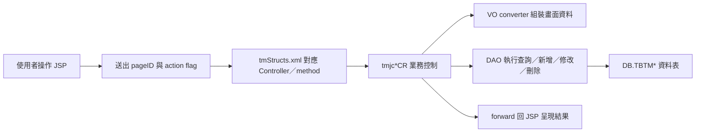

# TM 冶金規範管理系統功能規格手冊

## 1. 系統概述

### 1.1 系統定位

TM 模組為冶金規範管理系統，主要提供冶金、製程、檢驗、包裝與投入產出品名等規範資料的查詢與維護。系統由 JSP 畫面、XML 頁面設定、Java Controller、DAO／VO 資料物件與資料表組成，供使用者維護各製程規格條件，並提供樹狀規格結構、複合查詢、共用代碼與 Applet／Servlet 互動支援。

從程式註解與命名可確認，本模組涵蓋下列主要管理範圍：

- 熱軋規範：熱軋溫度、熱軋張力、熱軋料源溫度、熱軋冷卻。
- 冷軋規範：原料厚度、原料寬度、酸洗修邊寬度、酸洗速度、軋延厚度、清洗速度、指定退火、除濕冷卻、退火 CYCLE、精整是否加套筒、表面品質、塗油作業。
- 檢驗規範：硬度試驗、拉力試驗、化學成份、彎曲試驗、鋅層重量、CGL／CPL 抗拉強度。
- 鋼管規範：外徑公差、厚度公差、內刮、長度公差、拉力試驗、圈選試片、超音波檢測。
- 包裝與代碼：包裝方式、包裝方式代碼、Material Code 成份分類、Material Code 指定、加熱代碼、投入產出品名。
- 規格樹與共用設定：節點、節點型態、製程型態、產線／廠別、資料庫欄位版面與複合查詢。

### 1.2 使用對象

- 冶金、品管、製程或規格維護人員：維護產品規範、檢驗條件與製程參數。
- 生產與系統介接程式：透過共用 API 查詢冶金規範，用於生產程序更新或其他 ERP 模組。
- 系統管理或維運人員：維護樹狀規格結構、共用代碼、畫面版面與例外紀錄。

### 1.3 功能範圍

系統功能以維護作業為主，常見操作包含查詢、新增、修改、刪除、複製、驗證、關鍵值查詢與複合查詢。依 `config/yl/tm/tmStructs.xml` 盤點，系統設定約有 `307` 個頁面、`151` 個 Controller、`148` 個 VO 對應，主要動作旗標如下：

| 動作旗標 | 對應方法 | 功能意義 |
| --- | --- | --- |
| `I` | `query` | 查詢或帶出維護資料 |
| `N` | `create` | 新增資料 |
| `NN` | `createNew` | 新版畫面新增資料 |
| `R` | `update` | 修改資料 |
| `D` | `delete` | 刪除資料 |
| `DD` | `deleteNew` | 新版畫面刪除資料 |
| `C` | `duplicate` | 複製既有規格資料 |
| `V` | `action_validate` | 畫面動作前檢核 |
| `K` | `queryKey` | 依鍵值查詢 |
| `A` | `advanceQry` | 進階／複合查詢 |
| `F` | `fuzQryObj` | 複合查詢物件處理 |
| `Q` | `queryByCate` | 依分類查詢 |

## 2. 系統架構總覽

### 2.1 程式目錄與責任分工

| 目錄／檔案 | 架構定位 | 主要內容 |
| --- | --- | --- |
| `config/yl/tm/tmStructs.xml` | 頁面與流程設定 | 定義 pageID、JSP 路徑、Controller、Action flag、method、forward 與 VO converter |
| `jsp/` | 使用者介面 | `tmjjYLxx*.jsp`、`tmjjHLN*.jsp`、`tmjjyls*.jsp`、`tmjjylTree*.jsp` 等維護、清單、彈窗與查詢畫面 |
| `src/com/icsc/tm/*.java` | Controller／業務邏輯 | `tmjcYLxxCR`、`tmjcHLNxCR`、`tmjcsxxCR`、`tmjctxxCR` 等控制查詢與維護流程 |
| `src/com/icsc/tm/dao/` | 主要 DAO／VO | 冶金規範主資料表 `TBTMYL*`、`TBTMYLN*`、共用表與特殊表的資料存取與資料物件 |
| `src/com/icsc/tm/mscdao/` | 規格樹／共用結構 DAO／VO | `TBTMS*`、`TBTMT*`、`TBTMYLS*` 等樹狀結構、節點型態與共用維護資料 |
| `src/com/icsc/tm/DataDepot/` | 資料提供層 | 依功能別提供查詢結果、資料轉換與規格樹資料供應 |
| `src/applet/tmjayl01/`、`html/tm/` | Applet 支援 | `tmja000.jar`、`tmjayl01.jar` 與相關 Applet 程式 |
| `src/tmjsApp2Serv.java`、`tmjcApp2Serv.java` | Applet／Servlet 通訊 | 透過 `/erp/tm/tmjsApp2Serv` 傳送序列化物件並呼叫指定實作類別 |

### 2.2 請求處理流程

### 2.3 主要技術與框架

- Web 層採 JSP 與 DPMS `dejcFunctionalController` 架構，透過 XML 設定將 pageID 導向對應 Controller。
- 資料層採 DAO／VO 模式；VO 負責欄位承載、Request／ResultSet 轉換與基本驗證，DAO 負責 SQL 查詢與維護。
- 交易與連線多透過 `dejc301` 取得 Connection，部分 API 可接收外部 Connection 以納入上層交易。
- 樹狀資料透過 `tmjcs00DAO`、`tmjcs01DAO`、`tmjcs04DAO` 與 `tmjcylMicTreeMenu` 等元件供應。
- Applet 互動透過 `tmjcApp2Serv` 呼叫 `/erp/tm/tmjsApp2Serv`，Servlet 以 `className` 反射建立實作 `tmjiApp2Serv` 的類別並回傳處理結果。

### 2.4 命名規則

| 命名樣式 | 說明 |
| --- | --- |
| `tmjjYLxx*.jsp` | 冶金規範 YL 系列畫面，常見 `m`、`List`、`Edit`、`Search`、`Popup` |
| `tmjjHLNx*.jsp` | HLN 系列畫面，對應鍍鋅、加熱、CGL／CPL、整平線等維護 |
| `tmjjyls*.jsp` | 規格樹或共用設定維護畫面 |
| `tmjcYLxxCR.java` | YL 系列 Controller，執行查詢、新增、修改、刪除、複製與驗證 |
| `tmjcHLNxCR.java` | HLN 系列 Controller |
| `tmjcYLxxVO.java`／`tmjcYLxxDAO.java` | 對應 `DB.TBTMYLxx` 系列表格 |
| `tmjcYLNxxVO.java`／`tmjcYLNxxDAO.java` | 對應 `DB.TBTMYLNxx` 系列表格 |
| `tmjcsxxVO.java`／`tmjcsxxDAO.java` | 對應 `DB.TBTMSxx` 規格樹與共用設定 |

## 3. 功能模組詳細說明

### 3.1 規格樹與共用設定

本功能群支援冶金規範資料的樹狀分類、節點維護、製程／產線／資料庫欄位設定與共用查詢。頁面主要集中在 `tmjjyls*`、`tmjjylt*`、`tmjjylTree*`，Controller 包含 `tmjcs01CR`、`tmjcs02CR`、`tmjcs03CR`、`tmjcs04CR`、`tmjcs041CR`、`tmjct01CR`、`tmjct02CR`、`tmjcTreeQryCR`、`tmjcTreeModify`、`tmjcylMicTreeMenu` 與 `tmjcylFuzQryCR`。

主要功能：

- 維護節點型態、製程型態、廠別或產線等規格分類基礎資料。
- 維護規格樹節點與父子關係，支援樹狀展開、排序、搬移與複製。
- 提供複合查詢入口，讓使用者依規格樹、產品條件或其他參數查詢相關規範。
- 維護畫面資料版面與欄位對應，支援多表、多節點資料呈現。

### 3.2 熱軋與熱軋料源規範

本功能群維護熱軋相關的溫度、張力、料源溫度與冷卻條件。程式註解可確認 `tmjcYL01CR` 為熱軋溫度停用版，後續以 `tmjcYL47CR`／`tmjcYL471CR` 管理熱軋溫度，`tmjcYL03CR`／`tmjcYL031CR` 管理熱軋張力，`tmjcYL04CR`／`tmjcYL041CR` 管理熱軋料源溫度，`tmjcYL48CR`／`tmjcYL481CR` 管理熱軋冷卻。

主要功能：

- 依產品規格、料源、厚度／寬度或其他鍵值查詢熱軋條件。
- 維護熱軋製程控制參數與上下限資料。
- 提供複製功能，便於沿用相近產品規範後再調整。
- 供 `tmjcYLPOAPI` 等 API 查詢，支援生產程序或外部模組使用。

### 3.3 冷軋製程規範

本功能群維護冷軋前後段製程條件，涵蓋原料厚度、原料寬度、酸洗、軋延、清洗、退火、除濕冷卻、精整、表面品質與塗油作業。對應 Controller 包含 `tmjcYL17CR` 至 `tmjcYL28CR`、`tmjcYL53CR`、`tmjcYL57CR`、`tmjcYL58CR`、`tmjcYL60CR`、`tmjcYL61CR`、`tmjcYL64CR`、`tmjcYL71CR` 等系列。

主要功能：

- 依產品、規格、製程或適用條件維護冷軋製程參數。
- 管理主檔與明細檔，例如主規格、序號明細、最小／最大適用範圍。
- 對品質與製程控制類資料提供新增、修改、刪除、複製與查詢。
- 作為後續生產排程、製程控制或檢驗判定的規範來源。

### 3.4 檢驗與品質規範

本功能群維護產品檢驗條件與品質規範，包含硬度試驗、拉力試驗、化學成份、彎曲試驗、鋅層重量、CGL／CPL 抗拉強度等。對應 Controller 包含 `tmjcYL10CR`、`tmjcYL11CR`、`tmjcYL12CR`、`tmjcYL13CR`、`tmjcYL54CR`、`tmjcYL55CR`、`tmjcYL56CR`、`tmjcHLN1CR`、`tmjcHLN3CR`、`tmjcHLN6CR` 等。

主要功能：

- 維護不同產品、規格或標準的檢驗項目與允收條件。
- 管理鋅層重量、抗拉強度、彎曲與硬度等品質判定基準。
- 以主檔搭配明細檔記錄不同適用範圍、試驗條件或序號資料。
- 供品管、製程與規範查詢功能引用。

### 3.5 鋼管規範

本功能群維護鋼管產品相關的尺寸公差、檢驗與加工條件。程式註解可確認功能包含鋼管外徑公差、鋼管厚度公差、鋼管內刮、鋼管長度公差、鋼管拉力試驗、鋼管圈選試片與鋼管超音波檢測。主要 Controller 包含 `tmjcYL29CR`、`tmjcYL30CR`、`tmjcYL31CR`、`tmjcYL32CR`、`tmjcYL63CR`、`tmjcYL65CR`、`tmjcYL66CR`、`tmjcYL731CR`。

主要功能：

- 維護鋼管尺寸、厚度、外徑、長度等公差條件。
- 維護鋼管內刮與超音波檢測等製程／檢驗條件。
- 維護鋼管拉力試驗與圈選試片規則。
- 支援依產品規格或製程條件查詢對應規範。

### 3.6 包裝、Material Code 與投入產出設定

本功能群維護包裝方式、包裝方式代碼、Material Code 成份分類、Material Code 指定、加熱代碼與投入產出品名。主要 Controller 包含 `tmjcYL05CR`、`tmjcYL06CR`、`tmjcYL14CR`、`tmjcYL16CR`、`tmjcYL62CR`、`tmjcHLN2CR`、`tmjcHLN7CR`。

主要功能：

- 維護包裝方式與包裝方式代碼，提供規範資料或訂單相關條件引用。
- 維護 Material Code 與成份分類，支援產品成份與規格條件的分類管理。
- 維護加熱代碼與投入／產出品名，支援製程與品名轉換規則。
- 支援查詢、新增、修改、刪除及部分複製功能。

### 3.7 API、Applet 與系統共用服務

本功能群不是一般畫面維護功能，而是提供跨模組或前端元件支援。

- `tmjcYLPOAPI`：冶金規範查詢 API，程式註解標示用於生產程序更新；可查詢如熱軋 FCEET 等製程參數。
- `tmjcApp2Serv`／`tmjsApp2Serv`：Applet 與 Servlet 互動機制，透過序列化物件與 `className` 參數呼叫後端服務。
- `tmjcCustomDAO`：共用查詢與更新工具，提供動態查詢、序號查詢、狀態查詢、主負責人與最後引用日期更新等共用能力。
- `tmjcsllogDAO`／`tmjcsllogVO`：系統執行紀錄或方法呼叫紀錄資料存取。

### 3.8 主要資料表

> 說明：下表依 DAO／VO 標頭與 `tmStructs.xml` 的 converter 對應整理。部分功能中文名稱為 Controller 註解明確標示；未見中文註解者以表號與相鄰功能推定，仍建議後續以資料字典或使用者手冊補齊正式名稱。

| 資料表 | VO／DAO | 功能定位 | 主要用途 | 關聯功能 |
| --- | --- | --- | --- | --- |
| `DB.TBTMS00` | `tmjcs00VO`／`tmjcs00DAO` | 規格樹節點關係 | 儲存父節點、子節點、節點型態與排序 | 規格樹查詢、節點維護、`tmjcylMicTreeMenu` |
| `DB.TBTMS01` | `tmjcs01VO`／`tmjcs01DAO` | 節點型態主檔 | 維護節點中文名稱、英文名稱、圖片、程式與對應表名 | 規格樹分類、節點顯示 |
| `DB.TBTMS02` | `tmjcs02VO`／`tmjcs02DAO` | 製程型態設定 | 維護製程類別或處理類別 | 共用設定、規格分類 |
| `DB.TBTMS03` | `tmjcs03VO`／`tmjcs03DAO` | 製程／廠別設定 | 依公司、製程與廠別維護規格分類資料 | 共用設定、產線規格 |
| `DB.TBTMS04` | `tmjcs04VO`／`tmjcs04DAO` | 規格資料庫／資料表設定 | 維護規格庫或表格定義 | 樹狀規格、資料表對應 |
| `DB.TBTMS041` | `tmjcs041VO`／`tmjcs041DAO` | 規格資料庫明細 | 維護規格庫明細序號資料 | 規格庫設定 |
| `DB.TBTMT01` | `tmjct01VO`／`tmjct01DAO` | 製程明細設定 | 維護製程、廠別與序號型明細資料 | 共用設定、規格樹 |
| `DB.TBTMT02` | `tmjct02VO`／`tmjct02DAO` | 製程明細設定 | 維護另一類序號型製程明細資料 | 共用設定、規格樹 |
| `DB.TBTMTABLELAYOUT` | `tmjcTableLayoutVO`／`tmjcTableLayoutDAO` | 畫面／欄位版面設定 | 維護表格欄位顯示與配置 | `tmjjTableLayout.jsp`、規格資料呈現 |
| `DB.TBTMSLLOG` | `tmjcsllogVO`／`tmjcsllogDAO` | 系統紀錄 | 紀錄類別、方法、時間戳與執行訊息 | API／Controller 除錯與追蹤 |
| `DB.TBTMYLS05`～`DB.TBTMYLS09`、`DB.TBTMYLS071`、`DB.TBTMYLS072` | `tmjcyls05VO`～`tmjcyls09VO`／同名 DAO | 規格樹附屬設定 | 維護新舊版規格樹或共用規格設定資料 | `tmjjyls05Edit`～`tmjjyls09Edit_new` |
| `DB.TBTMYL01`、`DB.TBTMYL011` | `tmjcYL01VO`、`tmjcYL011VO`／同名 DAO | 熱軋溫度舊版資料 | 程式註解標示為停用，保留既有熱軋溫度資料 | 熱軋溫度舊版維護 |
| `DB.TBTMYL02`、`DB.TBTMYL021`、`DB.TBTMYL08`、`DB.TBTMYL081` | `tmjcYL02VO`、`tmjcYL021VO`、`tmjcYL08VO`、`tmjcYL081VO`／同名 DAO | 厚度公差 | 維護產品厚度公差條件與明細 | 厚度公差維護 |
| `DB.TBTMYL03`、`DB.TBTMYL031` | `tmjcYL03VO`、`tmjcYL031VO`／同名 DAO | 熱軋張力 | 維護熱軋張力規範與明細 | 熱軋張力維護 |
| `DB.TBTMYL04`、`DB.TBTMYL041` | `tmjcYL04VO`、`tmjcYL041VO`／同名 DAO | 熱軋料源溫度 | 維護熱軋料源與溫度條件 | 熱軋料源溫度維護 |
| `DB.TBTMYL05`、`DB.TBTMYL051` | `tmjcYL05VO`、`tmjcYL051VO`／同名 DAO | Material Code 成份分類 | 維護 Material Code 與成份分類規則 | Material Code 成份分類 |
| `DB.TBTMYL06`、`DB.TBTMYL061` | `tmjcYL06VO`、`tmjcYL061VO`／同名 DAO | Material Code 指定 | 維護 Material Code 指定條件 | Material Code 指定 |
| `DB.TBTMYL07`、`DB.TBTMYL071`、`DB.TBTMYL072` | `tmjcYL07VO`、`tmjcYL071VO`、`tmjcYL072VO`／同名 DAO | 鋼胚成分舊版資料 | 程式註解標示為停用，保留既有鋼胚成分規範 | 鋼胚成分舊版維護 |
| `DB.TBTMYL09`、`DB.TBTMYL091` | `tmjcYL09VO`、`tmjcYL091VO`／同名 DAO | 寬度公差 | 維護寬度公差條件與明細 | 寬度公差維護 |
| `DB.TBTMYL10`、`DB.TBTMYL101` | `tmjcYL10VO`、`tmjcYL101VO`／同名 DAO | 硬度試驗 | 維護硬度試驗規範 | 硬度試驗維護 |
| `DB.TBTMYL11`、`DB.TBTMYL111`、`DB.TBTMYL54`、`DB.TBTMYL541`、`DB.TBTMYL721` | `tmjcYL11VO`、`tmjcYL111VO`、`tmjcYL54VO`、`tmjcYL541VO`、`tmjcYL721VO`／同名 DAO | 拉力試驗 | 維護一般、冷軋或延伸產品的拉力試驗條件 | 拉力試驗維護 |
| `DB.TBTMYL12`、`DB.TBTMYL121` | `tmjcYL12VO`、`tmjcYL121VO`／同名 DAO | 化學成份 | 維護化學成份規範與明細 | 化學成份維護 |
| `DB.TBTMYL13`、`DB.TBTMYL131`、`DB.TBTMYL71`、`DB.TBTMYL72` | `tmjcYL13VO`、`tmjcYL131VO`、`tmjcYL71VO`、`tmjcYL72VO`／同名 DAO | 彎曲試驗 | 維護彎曲試驗條件 | 彎曲試驗維護 |
| `DB.TBTMYL14`、`DB.TBTMYL141`、`DB.TBTMYL16`、`DB.TBTMYL62` | `tmjcYL14VO`、`tmjcYL141VO`、`tmjcYL16VO`、`tmjcYL62VO`／同名 DAO | 包裝方式與代碼 | 維護包裝方式及包裝方式代碼 | 包裝規範維護 |
| `DB.TBTMYL17`～`DB.TBTMYL173` | `tmjcYL17VO`、`tmjcYL171VO`、`tmjcYL172VO`、`tmjcYL173VO`／同名 DAO | 冷軋原料厚度 | 維護冷軋原料厚度條件、明細與範圍 | 冷軋原料厚度 |
| `DB.TBTMYL18`、`DB.TBTMYL181`、`DB.TBTMYL58` | `tmjcYL18VO`、`tmjcYL181VO`、`tmjcYL58VO`／同名 DAO | 冷軋原料寬度 | 維護冷軋原料寬度條件 | 冷軋原料寬度 |
| `DB.TBTMYL19`～`DB.TBTMYL193` | `tmjcYL19VO`、`tmjcYL191VO`、`tmjcYL192VO`、`tmjcYL193VO`／同名 DAO | 冷軋酸洗修邊寬度 | 維護酸洗修邊寬度規範 | 冷軋酸洗修邊寬度 |
| `DB.TBTMYL20`、`DB.TBTMYL201` | `tmjcYL20VO`、`tmjcYL201VO`／同名 DAO | 冷軋酸洗速度 | 維護酸洗速度條件 | 冷軋酸洗速度 |
| `DB.TBTMYL21`、`DB.TBTMYL211`、`DB.TBTMYL212` | `tmjcYL21VO`、`tmjcYL211VO`、`tmjcYL212VO`／同名 DAO | 冷軋軋延厚度 | 維護軋延厚度條件與明細 | 冷軋軋延厚度 |
| `DB.TBTMYL22`、`DB.TBTMYL221` | `tmjcYL22VO`、`tmjcYL221VO`／同名 DAO | 冷軋清洗速度 | 維護清洗速度規範 | 冷軋清洗速度 |
| `DB.TBTMYL23`、`DB.TBTMYL231` | `tmjcYL23VO`、`tmjcYL231VO`／同名 DAO | 冷軋指定退火 | 維護指定退火條件 | 冷軋指定退火 |
| `DB.TBTMYL24`、`DB.TBTMYL64` | `tmjcYL24VO`、`tmjcYL64VO`／同名 DAO | 冷軋除濕冷卻 | 維護除濕冷卻規範 | 冷軋除濕冷卻 |
| `DB.TBTMYL25`～`DB.TBTMYL253` | `tmjcYL25VO`、`tmjcYL251VO`、`tmjcYL252VO`、`tmjcYL253VO`／同名 DAO | 冷軋退火 CYCLE | 維護退火 CYCLE 條件、明細與範圍 | 冷軋退火 CYCLE |
| `DB.TBTMYL26`～`DB.TBTMYL262` | `tmjcYL26VO`、`tmjcYL261VO`、`tmjcYL262VO`／同名 DAO | 冷軋精整是否加套筒 | 維護精整套筒條件 | 冷軋精整設定 |
| `DB.TBTMYL27`、`DB.TBTMYL271`、`DB.TBTMYL61`、`DB.TBTMYL611`、`DB.TBTMYL631`、`DB.TBTMYL711` | `tmjcYL27VO`、`tmjcYL271VO`、`tmjcYL61VO`、`tmjcYL611VO`、`tmjcYL631VO`、`tmjcYL711VO`／同名 DAO | 冷軋表面品質 | 維護表面品質規範及延伸明細 | 冷軋表面品質 |
| `DB.TBTMYL28`、`DB.TBTMYL281` | `tmjcYL28VO`、`tmjcYL281VO`／同名 DAO | 冷軋平坦度管制 | 維護平坦度管制條件 | 冷軋平坦度管制 |
| `DB.TBTMYL29`、`DB.TBTMYL291` | `tmjcYL29VO`、`tmjcYL291VO`／同名 DAO | 鋼管外徑公差 | 維護鋼管外徑公差條件 | 鋼管外徑公差 |
| `DB.TBTMYL30`、`DB.TBTMYL301`、`DB.TBTMYL731` | `tmjcYL30VO`、`tmjcYL301VO`、`tmjcYL731VO`／同名 DAO | 鋼管厚度公差 | 維護鋼管厚度公差與明細 | 鋼管厚度公差 |
| `DB.TBTMYL31`、`DB.TBTMYL311` | `tmjcYL31VO`、`tmjcYL311VO`／同名 DAO | 鋼管內刮 | 維護鋼管內刮條件 | 鋼管內刮 |
| `DB.TBTMYL32` | `tmjcYL32VO`／`tmjcYL32DAO` | 鋼管長度公差 | 維護鋼管長度公差條件 | 鋼管長度公差 |
| `DB.TBTMYL33`～`DB.TBTMYL46` | `tmjcYL33VO`～`tmjcYL46VO`／同名 DAO | YL 中段規範資料 | 程式未見明確中文註解，依頁面與 DAO 推定為冶金規範維護主檔 | `tmjjYL3300Edit`～`tmjjYL4600Edit` 等維護畫面 |
| `DB.TBTMYL47`、`DB.TBTMYL471` | `tmjcYL47VO`、`tmjcYL471VO`／同名 DAO | 熱軋溫度 | 維護新版熱軋溫度規範 | 熱軋溫度 |
| `DB.TBTMYL48`、`DB.TBTMYL481` | `tmjcYL48VO`、`tmjcYL481VO`／同名 DAO | 熱軋冷卻 | 維護熱軋冷卻條件 | 熱軋冷卻、API 查詢 |
| `DB.TBTMYL49`～`DB.TBTMYL52` | `tmjcYL49VO`～`tmjcYL52VO`／同名 DAO | YL 後段規範資料 | 程式未見明確中文註解，依頁面與 DAO 推定為冶金規範維護資料 | `tmjjYL4900Edit`～`tmjjYL5200Edit` 等維護畫面 |
| `DB.TBTMYL531`、`DB.TBTMYL532`、`DB.TBTMYL57`、`DB.TBTMYL601`、`DB.TBTMYL602` | `tmjcYL531VO`、`tmjcYL532VO`、`tmjcYL57VO`、`tmjcYL601VO`、`tmjcYL602VO`／同名 DAO | 冷軋塗油作業 | 維護塗油作業規範與明細 | 冷軋塗油作業 |
| `DB.TBTMYL55`、`DB.TBTMYL551`、`DB.TBTMYL56`、`DB.TBTMYL561`、`DB.TBTMYLN01`、`DB.TBTMYLN011` | `tmjcYL55VO`、`tmjcYL551VO`、`tmjcYL56VO`、`tmjcYL561VO`、`tmjcYLN01VO`、`tmjcYLN011VO`／同名 DAO | 鋅層重量 | 維護鋅層重量規範與明細 | 鋅層重量維護、HLN N1 |
| `DB.TBTMYL63`、`DB.TBTMYL65`、`DB.TBTMYL651`、`DB.TBTMYL66` | `tmjcYL63VO`、`tmjcYL65VO`、`tmjcYL651VO`、`tmjcYL66VO`／同名 DAO | 鋼管檢驗 | 維護鋼管拉力試驗、圈選試片與超音波檢測 | 鋼管品質規範 |
| `DB.TBTMYL67`～`DB.TBTMYL701` | `tmjcYL67VO`～`tmjcYL701VO`／同名 DAO | YL 延伸規範資料 | 程式未見明確中文註解，依頁面與 DAO 推定為延伸冶金規範維護資料 | `tmjjYL6700Edit`～`tmjjYL7001Edit` |
| `DB.TBTMYLN02`、`DB.TBTMYLN021` | `tmjcYLN02VO`、`tmjcYLN021VO`／同名 DAO | 加熱代碼 | 維護加熱代碼與明細 | HLN N2 加熱代碼 |
| `DB.TBTMYLN03` | `tmjcYLN03VO`／`tmjcYLN03DAO` | CGL 抗拉強度 | 維護 CGL 抗拉強度規範 | HLN N3 |
| `DB.TBTMYLN04` | `tmjcYLN04VO`／`tmjcYLN04DAO` | 整平線基本參數 | 維護整平線基本參數 | HLN N4 |
| `DB.TBTMYLN05` | `tmjcYLN05VO`／`tmjcYLN05DAO` | 整平線硬度 | 維護整平線硬度規範 | HLN N5 |
| `DB.TBTMYLN06` | `tmjcYLN06VO`／`tmjcYLN06DAO` | CPL 抗拉強度 | 維護 CPL 抗拉強度規範 | HLN N6 |
| `DB.TBTMYLN07` | `tmjcYLN07VO`／`tmjcYLN07DAO` | 投入產出品名 | 維護投入與產出品名對應 | HLN N7 |
| `DB.TBTMYLS1` | `tmjcYLS1VO`／`tmjcYLS1DAO` | YLS1 規範資料 | 依畫面 `tmjjYLS1*` 維護 YLS1 類規格資料 | YLS1 維護作業 |
| `DB.TBTMPBPRICETHICK` | `tmjcPBPRICETHICKVO`／`tmjcPBPRICETHICKDAO` | 價格厚度相關參數 | 維護厚度與價格相關設定，正式用途需依資料字典確認 | 價格或產品厚度參數 |
| `DB.TBTMASTMWATERPRESSURE` | `tmjcAstmWaterPressureVO`／`tmjcAstmWaterPressureDAO` | ASTM 水壓相關參數 | 維護 ASTM 水壓測試或規格相關資料 | ASTM 水壓規範 |
| `DB.TBTMYLLINEDIA` | `tmjcylLineDiaVO`／`tmjcylLineDiaDAO` | 產線口徑／內外徑設定 | 維護產線、內徑、外徑與是否略過等資料 | 鋼管或產線規格判定 |

### 3.9 主要畫面與 Controller 對照

| 功能群 | 主要 JSP | 主要 Controller | 說明 |
| --- | --- | --- | --- |
| 規格樹與共用設定 | `tmjjyls*.jsp`、`tmjjylt*.jsp`、`tmjjylTree*.jsp` | `tmjcs*CR`、`tmjct*CR`、`tmjcTreeQryCR`、`tmjcTreeModify`、`tmjcylFuzQryCR` | 維護樹狀規格結構、節點、製程、版面與複合查詢 |
| YL 冶金規範 | `tmjjYL01*.jsp`～`tmjjYL73*.jsp` | `tmjcYL01CR`～`tmjcYL731CR` | 維護熱軋、冷軋、鋼管、檢驗、包裝與 Material Code 等規範 |
| HLN 維護 | `tmjjHLN1*.jsp`～`tmjjHLN7*.jsp` | `tmjcHLN1CR`～`tmjcHLN7CR` | 維護鍍鋅重量、加熱代碼、CGL／CPL 抗拉強度、整平線與投入產出品名 |
| 共用查詢與資料供應 | `tmjjyl99FuzQry.jsp` 等 | `tmjcylFuzQryCR`、`DataDepot/*` | 提供進階查詢與各功能資料供應 |
| Applet／Servlet 服務 | `html/tm/*.jar`、`src/applet/tmjayl01/*` | `tmjsApp2Serv`、`tmjcApp2Serv`、`tmjiApp2Serv` 實作 | 支援舊式 Applet 與後端資料互動 |

### 3.10 維護規則與注意事項

- `tmStructs.xml` 是頁面流程的主要事實來源；新增功能時需同步定義 pageID、JSP、Controller、Action 與 VO converter。
- 多數維護頁以 `action_validate` 做前置檢核，再執行查詢、新增、修改或刪除。
- `unique` 型 VO 多用於主檔單筆資料，`sequence` 型 VO 多用於序號明細資料。
- DAO 內 SQL 多以字串組合方式產生，維護時需留意輸入檢核、特殊字元與交易一致性。
- Big5 編碼檔案在現代工具中容易顯示亂碼；閱讀 JSP、XML 或 Java 註解時應以 Big5／CP950 解碼確認。
- 本手冊依目前程式碼與設定整理，尚未連線資料庫核對資料字典、索引、外鍵與實際欄位中文名稱。
