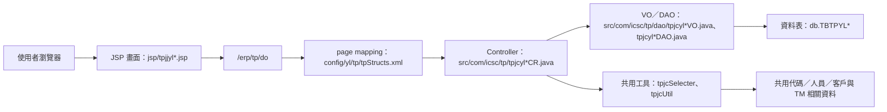

# TP 產品規範管理系統功能規格手冊

## 1. 系統概述

### 1.1 系統定位

`TP` 模組為產品規範管理系統，主要提供銷售產品分類、品名、規格協會、標準號、產品規格、用途碼、作業指示、產品規範、可生產尺寸、包裝方式、鋼管尺寸管制與馬來西亞訂單 `NS` 認證等主檔維護功能。

本系統位於 `D:\CHSBrowser_erp\erpHome\yl.ear\erp.war\tp`，以傳統 `JSP`、`Java Controller`、`VO`、`DAO` 與 `XML` page mapping 組成。依現有 DAO 定義，資料表主要落在 `db.TBTPYL01` 至 `db.TBTPYL121`，並透過共用選單與查名工具查詢 `TBTPCO02`、`TBGP10`、`TBTMS03`、`TBTMS04`、`TBTMS02`、`TBTMYLS02`、`TBTMYL45`、`TBTMYLS03` 等跨模組或代碼資料。

### 1.2 使用對象

- 產品規格主檔維護人員：維護產品大類、品名、規格協會、標準號與產品規格代碼。
- 接單／銷售支援人員：查詢產品規範、用途、作業指示、可生產尺寸與包裝條件。
- 生產／技術管理人員：維護產品規範、鋼管可生產尺寸、厚度與寬度管制資料。
- 系統維護人員：維護 `JSP`、Controller、DAO／VO 與 page action 對應。

### 1.3 主要功能範圍

- 基礎代碼主檔：銷售產品大類、品名、規格協會、標準號、用途碼、作業指示。
- 產品規格主檔：產品規格代碼、中文／英文名稱、規格描述、舊規格、含碳等級、`RC` 材比例與備註。
- 產品規範管理：產品規範代碼、關聯產品大類／品名／規格協會／標準號／產品規格、有效期限、狀態、作業指示、規格描述、公差描述、接單注意事項與客戶用途明細。
- 可生產尺寸與包裝管理：一般產品可生產尺寸、厚度／寬度上下限、是否修邊、包裝方式設定。
- 鋼管與國別認證管理：鋼管可生產尺寸管制、管徑／長短邊／厚度／長度限制，以及馬來西亞訂單 `NS` 認證資料。

### 1.4 作業入口與權限

各功能畫面以 `tpjjyl*.jsp` 為入口，表單送至 `/erp/tp/do?_pageId=...`，再由 `config/yl/tp/tpStructs.xml` 指派 Controller 與 action。部分維護畫面透過 `dsagc.check` 檢查 `INSERT`、`UPDATE`、`DELETE` 權限，未授權時按鈕會停用。

## 2. 系統架構總覽

### 2.1 程式分層

### 2.2 主要目錄與責任

| 目錄／檔案 | 功能定位 | 說明 |
|---|---|---|
| `jsp/` | 使用者畫面層 | 提供查詢、清單、編輯、彈窗與進階查詢畫面。 |
| `config/yl/tp/tpStructs.xml` | 頁面流程設定 | 定義 `pageID`、JSP、Controller、action flag、method、forward 與 converter VO。 |
| `src/com/icsc/tp/tpjcyl*CR.java` | 功能控制層 | 承接 action，執行查詢、新增、修改、刪除、複製、列印、批次給號等商業流程。 |
| `src/com/icsc/tp/dao/` | 資料存取與資料物件 | `tpjcyl*DAO` 負責資料庫操作，`tpjcyl*VO` 承載表單與資料表欄位。 |
| `dao/*.dao` | DAO 產生／資料表定義來源 | 定義資料表、DAO class、VO entity、欄位、鍵值與中文說明。 |
| `html/tpjtComm.jss` | 前端共用腳本 | 提供 TP 畫面可能共用的 JavaScript。 |
| `tpjcSelecter.java` | 下拉選單與代碼查名工具 | 產生資料表選單、代碼選單，並查詢產品分類、品名、規格、用途、作業指示、客戶、製程等名稱。 |
| `tpjcUtil.java` | 共用工具 | 提供資料字典取值、員工姓名／部門查詢、模糊查詢 SQL 條件、下拉選單與 VO 轉換工具。 |

### 2.3 Action 對應規則

| Action flag | Controller method | 作業意義 |
|---|---|---|
| `I` | `query` | 查詢指定資料或清單資料。 |
| `N` | `create` | 新增資料。 |
| `R` | `update` | 修改資料。 |
| `D` | `delete` | 刪除資料。 |
| `K` | `queryKey`、`makeSRLNO` | 關鍵值查詢或批次給號。 |
| `C` | `copy`、`duplicate` | 複製既有主檔或產品規範資料。 |
| `UA` | `updateAll` | 產品規範整批更新。 |
| `P` | `print` | 報表查詢或列印。 |

### 2.4 主要資料流

1. 使用者進入 `tpjjyl*.jsp` 查詢或編輯畫面。
2. JSP 表單帶入 `_pageId` 與 `_action`，送至 `/erp/tp/do`。
3. `tpStructs.xml` 依 `_pageId` 找到 Controller，依 `_action` 找到 method。
4. Controller 透過 converter 取得對應 VO，執行查詢、新增、修改、刪除或複製。
5. Controller 呼叫 DAO 存取 `db.TBTPYL*` 主檔或明細檔。
6. 結果 forward 回原 JSP 或清單 JSP，畫面顯示訊息與資料。

### 2.5 主要資料表

| 【資料表】 | 【VO／DAO】 | 【功能定位】 | 【主要用途】 | 【關聯功能】 |
|---|---|---|---|---|
| `db.TBTPYL01` | `tpjcyl01VO`／`tpjcyl01DAO` | 產品分類主檔 | 維護公司別、銷售產品大類代碼、中文名稱、英文名稱、建檔與異動資訊。 | `TPJJYL01`；被品名、產品規格、用途、產品規範等功能引用。 |
| `db.TBTPYL02` | `tpjcyl02VO`／`tpjcyl02DAO` | 品名主檔 | 維護產品大類下的品名代碼、中文名稱、英文名稱與產品號碼。 | `TPJJYL02`；被產品規範、查詢清單與名稱轉換引用。 |
| `db.TBTPYL03` | `tpjcyl03VO`／`tpjcyl03DAO` | 規格協會主檔 | 維護規格協會代碼、中文名稱與英文名稱。 | `TPJJYL03`；被標準號、產品規格、產品規範引用。 |
| `db.TBTPYL04` | `tpjcyl04VO`／`tpjcyl04DAO` | 標準號主檔 | 維護規格協會下的標準號、用途縮寫、用途中文／英文名稱。 | `TPJJYL04`；被產品規格與產品規範引用。 |
| `db.TBTPYL05` | `tpjcyl05VO`／`tpjcyl05DAO` | 產品規格主檔 | 維護產品大類、規格協會、標準號、產品規格代碼、規格名稱、規格描述、舊規格、含碳等級、`RC` 材比例、`RC` 材說明與備註。 | `TPJJYL05`；被產品規範、可生產尺寸、包裝、鋼管尺寸、國別認證引用。 |
| `db.TBTPYL06` | `tpjcyl06VO`／`tpjcyl06DAO` | 用途碼主檔 | 維護產品大類下的用途碼與用途說明。 | `TPJJYL06`；被產品規範明細與包裝條件引用。 |
| `db.TBTPYL07` | `tpjcyl07VO`／`tpjcyl07DAO` | 作業指示主檔 | 維護作業指示代碼與作業指示說明。 | `TPJJYL07`；被產品規範主檔引用。 |
| `db.TBTPYL08` | `tpjcyl08VO`／`tpjcyl08DAO` | 產品規範主檔 | 維護產品規範代碼、產品大類、品名、規格協會、標準號、產品規格、有效期限、狀態、作業指示、規格描述、公差描述與接單注意事項。 | `TPJJYL08`；主檔與 `TBTPYL081` 明細共同構成產品規範。 |
| `db.TBTPYL081` | `tpjcyl081VO`／`tpjcyl081DAO` | 產品規範項次檔 | 維護產品規範下的客戶編號、用途碼、製造標準代碼、最近使用日期與檢驗代碼。 | `TPJJYL08` 明細頁；引用 `TBTPYL08`、`TBTPYL06`。 |
| `db.TBTPYL09` | `tpjcyl09VO`／`tpjcyl09DAO` | 可生產尺寸主檔 | 維護產品品名、產品規格代碼、銷售別與可生產尺寸狀態。 | `TPJJYL09`；與 `TBTPYL091` 組成一般產品可生產尺寸管制。 |
| `db.TBTPYL091` | `tpjcyl091VO`／`tpjcyl091DAO` | 可生產尺寸項次檔 | 維護厚度／寬度上下限、邊界條件、量測單位與是否修邊。 | `TPJJYL09` 明細頁；依 `TBTPYL09` 主檔建立多筆尺寸條件。 |
| `db.TBTPYL10` | `tpjcyl10VO`／`tpjcyl10DAO` | 包裝方式設定檔 | 依內外銷別、客戶、品名、產品規格、用途、厚度與寬度區間維護包裝方式。 | `TPJJYL10`；支援包裝方式查詢與報表查詢。 |
| `db.TBTPYL11` | `tpjcyl11VO`／`tpjcyl11DAO` | 鋼管可生產尺寸管制檔 | 維護產品規格代碼與鋼管尺寸管制狀態。 | `TPJJYL11`；與 `TBTPYL111` 組成鋼管可生產尺寸管制。 |
| `db.TBTPYL111` | `tpjcyl111VO`／`tpjcyl111DAO` | 鋼管可生產尺寸管制明細檔 | 維護管徑、長邊、短邊、厚度上下限與長度上下限。 | `TPJJYL11` 明細頁；依 `TBTPYL11` 主檔建立尺寸條件。 |
| `db.TBTPYL12` | `tpjcyl12VO`／`tpjcyl12DAO` | 馬來西亞訂單 `NS` 認證主檔 | 維護國家別、產品規格代碼與品名。 | `TPJJYL12`；與 `TBTPYL121` 組成國別認證資料。 |
| `db.TBTPYL121` | `tpjcyl121VO`／`tpjcyl121DAO` | 馬來西亞訂單 `NS` 認證明細檔 | 維護序號、厚度起迄、寬度起迄與認證號。 | `TPJJYL12` 明細頁；依 `TBTPYL12` 主檔建立認證範圍。 |

## 3. 功能模組詳細說明

### 3.1 TPJJYL01 銷售產品大類維護

- 入口畫面：`tpjjyl01.jsp`、`tpjjyl01List.jsp`、`tpjjyl01Edit.jsp`。
- Controller：`tpjcyl01CR`。
- 資料表：`TBTPYL01`。
- 主要欄位：公司別、銷售產品大類、中文名稱、英文名稱、建檔人員、建檔日期、異動人員、異動日期。
- 功能說明：提供銷售產品大類查詢、新增、修改與刪除，作為品名、產品規格、用途碼、產品規範等後續主檔的上層分類。
- Action：`I=query`、`N=create`、`R=update`、`D=delete`。

### 3.2 TPJJYL02 品名維護

- 入口畫面：`tpjjyl02.jsp`、`tpjjyl02List.jsp`、`tpjjyl02Edit.jsp`。
- Controller：`tpjcyl02CR`。
- 資料表：`TBTPYL02`。
- 主要欄位：公司別、產品分類代碼、品名代碼、品名中文名稱、品名英文名稱、產品號碼、建檔與異動資訊。
- 功能說明：維護各產品大類下的品名代碼，支援產品規範、可生產尺寸與其他查詢功能取用品名。
- 關聯資料：`TBTPYL01`。
- Action：`I=query`、`N=create`、`R=update`、`D=delete`。

### 3.3 TPJJYL03 規格協會維護

- 入口畫面：`tpjjyl03.jsp`、`tpjjyl03List.jsp`、`tpjjyl03Edit.jsp`。
- Controller：`tpjcyl03CR`。
- 資料表：`TBTPYL03`。
- 主要欄位：公司別、規格協會代碼、規格協會中文名稱、規格協會英文名稱、建檔與異動資訊。
- 功能說明：維護標準號與產品規格所需的規格協會主檔。
- Action：`I=query`、`N=create`、`R=update`、`D=delete`。

### 3.4 TPJJYL04 標準號維護

- 入口畫面：`tpjjyl04.jsp`、`tpjjyl04List.jsp`、`tpjjyl04Edit.jsp`。
- Controller：`tpjcyl04CR`。
- 資料表：`TBTPYL04`。
- 主要欄位：公司別、規格協會代碼、標準號、用途縮寫、用途中文名稱、用途英文名稱、建檔與異動資訊。
- 功能說明：維護各規格協會底下的標準號，供產品規格與產品規範設定使用。
- 關聯資料：`TBTPYL03`。
- Action：`I=query`、`N=create`、`R=update`、`D=delete`。

### 3.5 TPJJYL05 產品規格代碼維護

- 入口畫面：`tpjjyl05.jsp`、`tpjjyl05List.jsp`、`tpjjyl05Edit.jsp`、`tpjjyl05Search.jsp`、`tpjjyl05Popup.jsp`。
- Controller：`tpjcyl05CR`。
- 資料表：`TBTPYL05`。
- 主要欄位：公司別、產品大類、規格協會、標準號、產品規格代碼、產品規格中文／英文名稱、規格描述、舊規格代碼、含碳等級、`RC` 材比例、`RC` 材說明、備註。
- 功能說明：建立產品規格代碼主檔，為產品規範、可生產尺寸、包裝與認證等功能的核心參照資料。
- 關聯資料：`TBTPYL01`、`TBTPYL03`、`TBTPYL04`。
- Action：`I=query`、`K=queryKey`、`N=create`、`R=update`、`D=delete`。

### 3.6 TPJJYL06 用途碼維護

- 入口畫面：`tpjjyl06.jsp`、`tpjjyl06List.jsp`、`tpjjyl06Edit.jsp`。
- Controller：`tpjcyl06CR`。
- 資料表：`TBTPYL06`。
- 主要欄位：公司別、產品大類、用途碼、用途碼說明、建檔與異動資訊。
- 功能說明：維護產品用途碼，供產品規範明細與包裝方式等功能記錄用途條件。
- 關聯資料：`TBTPYL01`。
- Action：`I=query`、`N=create`、`R=update`、`D=delete`。

### 3.7 TPJJYL07 作業指示代碼維護

- 入口畫面：`tpjjyl07.jsp`、`tpjjyl07List.jsp`、`tpjjyl07Edit.jsp`。
- Controller：`tpjcyl07CR`。
- 資料表：`TBTPYL07`。
- 主要欄位：公司別、作業指示代碼、作業指示代碼說明、建檔與異動資訊。
- 功能說明：維護作業指示代碼，供產品規範主檔記錄製程或接單相關作業注意事項。
- Action：`I=query`、`N=create`、`R=update`、`D=delete`。

### 3.8 TPJJYL08 產品規範維護

- 入口畫面：`tpjjyl08.jsp`、`tpjjyl08List.jsp`、`tpjjyl08Edit.jsp`、`tpjjyl0801Edit.jsp`、`tpjjyl08Search.jsp`、`tpjjyl08Popup.jsp`。
- Controller：`tpjcyl08CR`、`tpjcyl081CR`。
- 資料表：`TBTPYL08`、`TBTPYL081`。
- 主檔欄位：產品規範代碼、產品大類、品名、規格協會、標準號、產品規格代碼、流水號、有效期限、產品規範狀態、作業指示代碼、規格描述、公差描述、接單注意事項。
- 明細欄位：產品規範代碼、客戶編號、用途碼、製造標準代碼、最近使用日期、檢驗代碼。
- 功能說明：維護產品規範主檔與客戶／用途明細，支援新增、修改、刪除、複製、批次給號、整批更新與列印。
- 關聯資料：`TBTPYL01`、`TBTPYL02`、`TBTPYL03`、`TBTPYL04`、`TBTPYL05`、`TBTPYL06`、`TBTPYL07`。
- Action：主檔 `I=query`、`N=create`、`R=update`、`C=duplicate`、`D=delete`、`UA=updateAll`、`P=print`；明細 `I=query`、`N=create`、`R=update`、`D=delete`、`K=makeSRLNO`。

### 3.9 TPJJYL09 可生產尺寸維護

- 入口畫面：`tpjjyl09.jsp`、`tpjjyl09Main.jsp`、`tpjjyl09List.jsp`、`tpjjyl09Edit.jsp`、`tpjjyl0901Edit.jsp`、`tpjjyl09Search.jsp`、`tpjjyl09Popup.jsp`、`tpjjyl091List.jsp`。
- Controller：`tpjcyl09CR`、`tpjcyl091CR`。
- 資料表：`TBTPYL09`、`TBTPYL091`。
- 主檔欄位：產品品名、產品規格代碼、銷售別、產品規範／狀態、建檔與異動資訊。
- 明細欄位：流水號、厚度下限／上限、厚度量測單位、寬度下限／上限、寬度量測單位、邊界條件、是否修邊。
- 功能說明：維護一般產品可生產尺寸限制，主檔定義品名、規格與銷售別，明細定義厚度、寬度與修邊條件。
- 關聯資料：`TBTPYL05`。
- Action：主檔 `I=query`、`N=create`、`R=update`、`D=delete`、`C=copy`；明細 `I=query`、`N=create`、`R=update`、`D=delete`。

### 3.10 TPJJYL10 包裝方式設定

- 入口畫面：`tpjjyl10.jsp`、`tpjjyl10List.jsp`。
- Controller：`tpjcyl10CR`。
- 資料表：`TBTPYL10`。
- 主要欄位：公司別、內外銷別、客戶編號、品名、產品規格代碼、用途碼、訂單厚度上下限、訂單寬度上下限、包裝方式。
- 功能說明：依銷別、客戶、產品規格、用途與尺寸條件設定包裝方式，並提供報表查詢／列印入口。
- 關聯資料：`TBTPYL05`，另可能透過工具查詢客戶與用途名稱。
- Action：`I=query`、`N=create`、`R=update`、`D=delete`、`P=print`。

### 3.11 TPJJYL11 鋼管可生產尺寸管制

- 入口畫面：`tpjjyl11.jsp`、`tpjjyl11Main.jsp`、`tpjjyl11List.jsp`、`tpjjyl11Edit.jsp`、`tpjjyl1101Edit.jsp`、`tpjjyl11Search.jsp`、`tpjjyl11Popup.jsp`、`tpjjyl111List.jsp`。
- Controller：`tpjcyl11CR`、`tpjcyl111CR`。
- 資料表：`TBTPYL11`、`TBTPYL111`。
- 主檔欄位：產品規格代碼、狀態、建檔與異動資訊。
- 明細欄位：管徑、長邊、短邊、厚度下限／上限、長度下限／上限。
- 功能說明：維護鋼管類產品可生產尺寸條件，主檔管制產品規格狀態，明細維護管徑與尺寸限制。
- 關聯資料：`TBTPYL05`。
- Action：主檔 `I=query`、`N=create`、`R=update`、`D=delete`、`C=copy`；明細 `I=query`、`N=create`、`R=update`、`D=delete`。

### 3.12 TPJJYL12 馬來西亞訂單 NS 認證維護

- 入口畫面：`tpjjyl12.jsp`、`tpjjyl12Main.jsp`、`tpjjyl12List.jsp`、`tpjjyl12Edit.jsp`、`tpjjyl1201Edit.jsp`、`tpjjyl12Search.jsp`、`tpjjyl12Popup.jsp`、`tpjjyl121List.jsp`。
- Controller：`tpjcyl12CR`、`tpjcyl121CR`。
- 資料表：`TBTPYL12`、`TBTPYL121`。
- 主檔欄位：國家別、產品規格代碼、品名、建檔與異動資訊。
- 明細欄位：序號、厚度起迄、寬度起迄、認證號。
- 功能說明：維護馬來西亞訂單 `NS` 認證主檔與尺寸認證明細，依國別、品名與產品規格管理認證範圍。
- 關聯資料：`TBTPYL05`。
- Action：主檔 `I=query`、`N=create`、`R=update`、`D=delete`、`C=copy`；明細 `I=query`、`N=create`、`R=update`、`D=delete`。

### 3.13 TPJJYL90 系列進階／模糊查詢

- 入口畫面：`tpjjyl91FuzQry.jsp` 至 `tpjjyl96FuzQry.jsp`。
- AppId：`TPJJYL90`。
- 資料來源：`TBTPYL02`、`TBTPYL04`、`TBTPYL05`、`TBTPYL06`、`TBTPYL07`、`TBTPYL08`、`TBTPYL081`。
- 功能說明：提供品名、標準號、產品規格、用途碼、作業指示與產品規範等輔助查詢，供主檔畫面進階查找或彈窗選取使用。

### 3.14 共用查詢與工具功能

- `tpjcSelecter`：產生資料表下拉選單、共用代碼選單，並提供產品分類、品名、規格協會、產品規格、用途、作業指示、客戶、製程、缺陷、工廠與庫位等名稱查詢。
- `tpjcUtil`：提供資料字典欄位取得、員工姓名／部門查詢、模糊查詢條件組合、下拉選單文字產生與 VO 值轉換。

## 4. 補充說明與待確認事項

- 本手冊依現有 `tpStructs.xml`、`JSP`、Controller 與 `dao/*.dao` 定義整理，尚未連線資料庫驗證實際資料量、索引、外鍵或歷史資料狀態。
- 部分 JSP 檔案的 `_AppId` 與檔名存在疑似複製遺留，例如 `tpjjyl11List.jsp` 顯示 `TPJJYL09`、`tpjjyl121List.jsp` 顯示 `TPJJYL11`，文件以檔名與功能群組判定歸屬，正式上線文件建議再由系統選單設定確認。
- `TBTPYL10` 的 DAO 描述為 `Table 包裝方式設定檔`，此處依欄位內容整理為包裝方式設定功能；若現場有正式中文選單名稱，應以選單為準。
- `TPJJYL08` 的 `updateAll`、`print` 與 `TPJJYL10` 的 `print` 需進一步確認報表格式與查詢條件，本文先依 Controller action 與畫面按鈕列為整批更新與報表查詢／列印。
