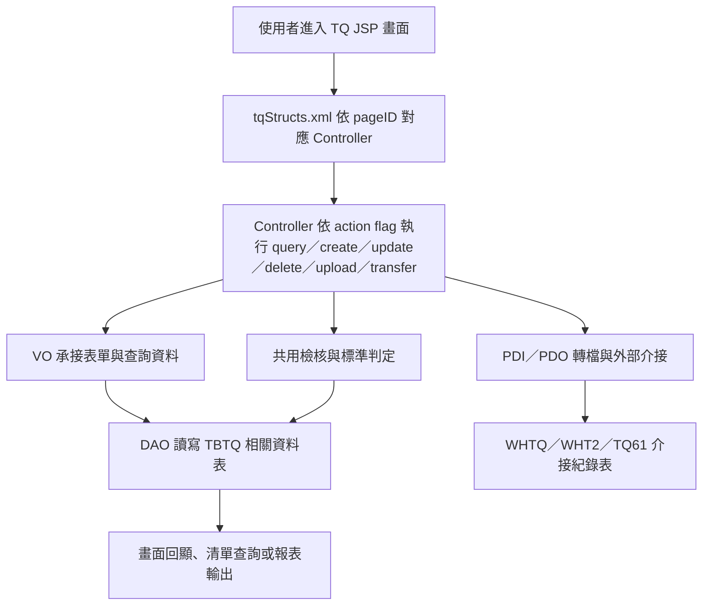

# TQ 功能規格手冊

## 1. 系統概述

### 1.1 系統定位

TQ 模組為 ERP 內之品質／試驗資料管理子系統，主要處理鋼捲、試片、委託試驗、鋼管試驗資料、檢驗標準、檢驗結果上傳，以及與外部產線或中心系統之資料介接。系統以 JSP 畫面提供維護、查詢、上傳與轉送作業，以 Java Controller 執行資料檢核、資料轉換、資料庫異動及介接處理。

依目前程式與設定檔可確認，本模組涵蓋下列業務面：

- 一般試片與檢驗結果資料維護，核心資料表為 `DB.TBTQ0010`。
- 委託試驗主檔與明細資料維護，核心資料表為 `DB.TBTQ0020`、`DB.TBTQ0021`。
- 鋼管類試驗資料維護，包含拉伸、衝擊、化學成分與尺寸／標準資料。
- 冷軋或相關製程之硬度資料維護，包含 `DB.TBTQCR10`、`DB.TBTQCR15`。
- WHTQ、WHT2、TQ61 等 PDI／PDO 介接資料產生、轉送、回查與介接紀錄維護。
- 基礎代碼、模板、標準與共用查詢畫面。

### 1.2 使用對象

本系統主要使用者包含品質檢驗、試驗室、製程／產線資料維護人員、委託試驗作業人員，以及需要查詢或確認試驗結果之相關業務單位。實際權限控制需再依 ERP 既有登入、功能代碼與 `db.tbtqCode` 權限欄位設定確認。

### 1.3 系統範圍

本手冊依目前 `tq` 模組程式與設定整理，範圍包含：

- `jsp/` 下 `tqjj*.jsp` 畫面。
- `config/yl/tq/tqStructs.xml` 頁面、Controller、Action 與 VO 映射。
- `src/com/icsc/tq/` 下 Controller、共用邏輯、轉檔與介接程式。
- `src/com/icsc/tq/dao/`、`src/com/icsc/tq/ex/dao/` 下 VO／DAO。
- `dao/sql/` 下已提供的資料表建置 SQL。
- `config/yl/tq/*.ini` 下資料上傳、PDI／PDO 轉換欄位設定。

舊檔案中部分中文註解因 Big5 顯示問題呈現亂碼，本文件對中文功能名稱採保守整理；若需正式欄位中文名稱，建議再以資料字典或實際畫面校對。

## 2. 系統架構總覽

### 2.1 技術架構

TQ 模組採傳統 Java Web 架構：

- 前端畫面：`jsp/tqjj*.jsp`。
- 功能入口：`config/yl/tq/tqStructs.xml` 定義 `pageID`、JSP、Controller、action flag、method、forward 與 VO converter。
- Controller：`src/com/icsc/tq/tqjc*.java`，多數繼承 `dejcFunctionalController` 或共用功能類別。
- 資料物件：`src/com/icsc/tq/dao/*VO.java`，承接 JSP 表單、查詢結果與報表／轉檔資料。
- 資料存取：`src/com/icsc/tq/dao/*DAO.java`、`src/com/icsc/tq/ex/dao/*DAO.java`。
- 資料表：以 `DB.TBTQ*`、`db.tbtq*` 為主，部分功能會讀取其他 ERP 模組資料，例如訂單、鋼捲、製程或標準資料。
- 介接設定：`config/yl/tq/tq_WHTQ.ini`、`tq_WHT2.ini`、`tq_TQ61.ini`、`tq_tbtq0010.ini` 等。
- 報表／資料輸出：`xml/dr/*.xml`、`dao/sql/tqjr*.sql`。

### 2.2 主要流程

### 2.3 程式分層

| 分層 | 路徑／類別 | 說明 |
| --- | --- | --- |
| 頁面層 | `jsp/tqjj*.jsp` | 提供功能畫面、查詢清單、維護頁、Popup、上傳頁與共用 frame。 |
| 頁面映射 | `config/yl/tq/tqStructs.xml` | 定義功能代號、Controller、Action 與 VO converter。 |
| 控制層 | `src/com/icsc/tq/tqjc*.java` | 處理查詢、檢核、維護、刪除、轉送、上傳及資料轉換。 |
| 共用邏輯 | `tqjcPipeFunc`、`tqjcInnerCheck`、`tqjcOrdStandard`、`tqjcMCAPI`、`tqjcSD01` | 提供鋼管試驗共用流程、資料必要性檢核、訂單標準判斷、跨模組查詢與標準檢核。 |
| 資料物件 | `src/com/icsc/tq/dao/*VO.java` | 對應資料表欄位或畫面資料。 |
| 資料存取 | `src/com/icsc/tq/dao/*DAO.java` | 封裝 `SELECT`、`INSERT`、`UPDATE`、`DELETE` 與部分進階查詢。 |
| 介接層 | `src/com/icsc/tq/ex/*`、`tqjcConvert*`、`tqjcGenCscWHTQ` | 處理 WHTQ、WHT2、TQ61 轉檔、PDI／PDO 產生與送出紀錄。 |
| 設定層 | `config/yl/tq/*.ini` | 定義介接欄位、上傳 SQL、驗證 SQL、欄位長度與資料格式。 |

### 2.4 Action 命名與操作型態

依 `tqStructs.xml` 可確認常見 action：

| Action | 對應方法 | 功能意義 |
| --- | --- | --- |
| `I` | `query` | 查詢或載入畫面資料。 |
| `AQ` | `advancedQuery` | 進階查詢或 Popup 清單查詢。 |
| `N` | `insert`／`create` | 新增資料。 |
| `U` | `update` | 更新資料。 |
| `R` | `update` | 清單型維護更新。 |
| `D` | `delete` | 刪除資料。 |
| `O` | `inputOK`／`create` | 確認輸入或送出建立。 |
| `upload` | `upload` | 檔案上傳與資料匯入。 |
| `35`～`42` | `mod35`～`mod42` | 委託試驗或 WHTQ 介接相關作業階段；實際中文名稱需由畫面或操作手冊再確認。 |

## 3. 功能模組詳細說明

### 3.1 主選單與共用畫面

| 項目 | 說明 |
| --- | --- |
| 代表 JSP | `tqjjMain.jsp`、`tqjjMain01.jsp`、`tqjjMain02.jsp`、`tqjjFrame01.jsp`、`tqjjFrame02.jsp` |
| 主要 Controller | 未完全由 `tqStructs.xml` 映射，屬畫面框架與導覽用途。 |
| 功能定位 | TQ 模組進入點、頁框、主功能導覽與共用訊息處理。 |
| 主要用途 | 提供使用者進入 C、H、P、Code、OtherInput 等功能群。 |
| 關聯功能 | 所有 TQ JSP 功能。 |

### 3.2 基礎代碼維護

| 項目 | 說明 |
| --- | --- |
| 功能代號 | `TQJJCODE` |
| 代表 JSP | `tqjjCode.jsp`、`tqjjCodeList.jsp` |
| 主要 Controller | `com.icsc.tq.tqjcCode` |
| 主要 VO／DAO | `tqjcCodeVO`、`tqjcCodeDAO` |
| 主要資料表 | `db.tbtqCode` |
| 功能定位 | TQ 模組基礎代碼、選單或權限相關參數維護。 |
| 主要用途 | 查詢、新增／修改代碼資料、刪除代碼、提供 `getMCodeValue`、`getDCodeDesc` 等共用查詢。 |
| 關聯功能 | 各功能畫面之下拉選單、權限判斷、代碼描述顯示。 |

### 3.3 一般試片與檢驗結果資料

| 項目 | 說明 |
| --- | --- |
| 代表功能 | `tqjjC0010`、`tqjjC0020`、`tqjjC0030`、`tqjjH0010`、`tqjjH0020` 等清單／明細畫面 |
| 主要 Controller | `tqjcCrC0010`、`tqjcCrC0020`、`tqjcCrC0030`、`tqjcCrH0010`、`tqjcCrH0020` 等 |
| 主要 VO／DAO | `tqjc0010VO`、`tqjc0010DAO` |
| 主要資料表 | `DB.TBTQ0010` |
| 功能定位 | 保存一般試片資料、訂單與鋼捲資訊、試驗項目旗標、拉伸／彎曲／硬度／晶粒／化學等檢驗結果與判定欄位。 |
| 主要用途 | 建立、查詢、更新或匯入試片檢驗資料；作為試驗結果回寫、委託試驗比對、外部介接與報表輸出的核心來源。 |
| 關聯功能 | `tq_tbtq0010.ini` 上傳設定、`tqjcOtherInput`、`tqjcCRTestTPdo`、`tqjcGITestTPdo`、`tqjcHRTestTPdo`、`tqjcInnerCheck`、`tqjcMCAPI`。 |

### 3.4 委託試驗主檔與明細

| 項目 | 說明 |
| --- | --- |
| 代表 JSP | `tqjjC0053.jsp`、`tqjjC005301.jsp`、`tqjjC0053Popup*.jsp` |
| 主要 Controller | `tqjcC0053` |
| 主要 VO／DAO | `tqjc0040VO`、`tqjc0040DAO`；委託主明細另由 `DB.TBTQ0020`、`DB.TBTQ0021` 保存 |
| 主要資料表 | `DB.TBTQ0020`、`DB.TBTQ0021`、`db.tbtq0040` |
| 功能定位 | 管理委託試驗資料與後續 WHTQ／WHT2 介接處理。 |
| 主要用途 | 依 action `35`～`42` 執行多階段處理，例如資料查詢、轉送號取得、委託資料異動或介接前後資料比對。 |
| 關聯功能 | WHTQ／WHT2 PDI 產生、`tqjcGenCscWHTQ`、`tqjcConvertWHTQ`、`tqjcConvertWHT2`、外部介接紀錄表。 |

### 3.5 CR 硬度與相關資料維護

| 項目 | 說明 |
| --- | --- |
| 功能代號 | `TQJC0015` |
| 代表 JSP | `tqjjC0015KeyIn.jsp`、`tqjjC0015.jsp` |
| 主要 Controller | `tqjcCRC0015` |
| 主要 VO／DAO | `tqjcCR15VO`、`tqjcCR15DAO` |
| 主要資料表 | `DB.TBTQCR15` |
| 功能定位 | 以公司別與鋼捲號為主鍵，維護線別、硬度值、產品分類、訂單規格與厚度等資料。 |
| 主要用途 | 查詢、新增、更新、刪除 CR 硬度相關資料。 |
| 關聯功能 | `tqjcMCAPI.getCrHardness`、`DB.TBTQCR10`、C／H 系列硬度查詢或結果處理畫面。 |

### 3.6 鋼管拉伸試驗資料

| 項目 | 說明 |
| --- | --- |
| 功能代號 | `TQJJP010` |
| 代表 JSP | `tqjjP010KeyIn.jsp`、`tqjjP010.jsp`、`tqjjPTempList.jsp` |
| 主要 Controller | `tqjcP010Func`，共用父類別 `tqjcPipeFunc` |
| 主要 VO／DAO | `tqjcPPullVO`、`tqjcPPullDAO`、`tqjcPPullSpecVO` |
| 主要資料表 | `db.tbtqPPull` |
| 功能定位 | 管理鋼管拉伸試驗結果。 |
| 主要用途 | 查詢試片資料、輸入或建立拉伸結果、刪除資料；欄位包含試片號、取樣位置、時效試驗、降伏、抗拉、伸長率等。 |
| 關聯功能 | 鋼管尺寸標準、訂單標準判定、`tqjcOrdStandard`、`tqjcPipeFunc` 進階查詢。 |

### 3.7 鋼管衝擊試驗資料

| 項目 | 說明 |
| --- | --- |
| 功能代號 | `TQJJP020` |
| 代表 JSP | `tqjjP020KeyIn.jsp`、`tqjjP020.jsp`、`tqjjPTempList.jsp` |
| 主要 Controller | `tqjcP020Func`，共用父類別 `tqjcPipeFunc` |
| 主要 VO／DAO | `tqjcPImpactVO`、`tqjcPImpactDAO`、`tqjcPImpactSpecVO` |
| 主要資料表 | `db.tbtqPImpact` |
| 功能定位 | 管理鋼管衝擊試驗結果。 |
| 主要用途 | 查詢、建立或刪除衝擊試驗資料；欄位包含試片號、取樣位置、時效試驗、溫度、吸收能、剪斷面率等。 |
| 關聯功能 | 標準判定 `checkImpactByStand`、鋼管試驗共用查詢、P 系列標準設定。 |

### 3.8 鋼管化學成分資料

| 項目 | 說明 |
| --- | --- |
| 功能代號 | `TQJJP030` |
| 代表 JSP | `tqjjP030KeyIn.jsp`、`tqjjP030.jsp` |
| 主要 Controller | `tqjcP030Func`，共用父類別 `tqjcPipeFunc` |
| 主要 VO／DAO | `tqjcPChemVO`、`tqjcPChemDAO` |
| 主要資料表 | `db.tbtqPChem` |
| 功能定位 | 管理鋼管化學成分試驗結果。 |
| 主要用途 | 查詢、建立或刪除化學成分資料；欄位包含 C、Si、Mn、P、S、Ni、Cr、Mo、Cu、Ti、V、Al、Pb、Nb、Co、Sn、W、N、O、B 等元素。 |
| 關聯功能 | `checkChemByStand` 標準判定、`tqjjP0501` 上傳、外部化學資料匯入。 |

### 3.9 鋼管尺寸／標準設定

| 項目 | 說明 |
| --- | --- |
| 功能代號 | `tqjjPPullSize0101List`、`tqjjPPullSize0102List` |
| 代表 JSP | `tqjjPPullSize0101List.jsp`、`tqjjPPullSize0102List.jsp`、`tqjjPPullSize01.jsp` |
| 主要 Controller | `tqjcPPullSize0101ListCR`、`tqjcPPullSize0102ListCR` |
| 主要 VO／DAO | `tqjcPPullSize010VO`、`tqjcPPullSize010DAO`、`tqjcPPullSize011VO`、`tqjcPPullSize011DAO` |
| 主要資料表 | `db.tbtqPPullSize010`、`db.tbtqPPullSize011` |
| 功能定位 | 維護鋼管試驗之產品規格、尺寸與標準值資料。 |
| 主要用途 | 查詢、新增、更新、刪除鋼管拉伸相關標準；`tqjcPPullSize0102ListCR` 另有 `setSpstdnoInTM`，會回寫或同步 TM 規格標準號相關資料。 |
| 關聯功能 | `TQJJP010` 拉伸結果、`TQJJP020` 衝擊結果、TM 規格資料、訂單標準檢核。 |

### 3.10 鋼管檢驗資料上傳

| 項目 | 說明 |
| --- | --- |
| 功能代號 | `tqjjP0501` |
| 代表 JSP | `tqjjP0501.jsp`、`tqjjP05.jsp` |
| 主要 Controller | `tqjcP0501CR` |
| 主要 VO／DAO | 上傳後依試驗類型寫入 `tqjcPChemDAO` 或相關 P 系列 DAO |
| 主要資料表 | `db.tbtqPChem` 等鋼管試驗資料表 |
| 功能定位 | 匯入外部檔案中的鋼管試驗資料。 |
| 主要用途 | 上傳檔案、解析 CSV 或指定格式資料、檢核未上傳試片、依標準判定化學資料。 |
| 關聯功能 | `tqjcP030Func.checkChemByStand`、`tqjjP030`、鋼管化學成分資料。 |

### 3.11 其他檢驗資料輸入與上傳

| 項目 | 說明 |
| --- | --- |
| 代表 JSP | `tqjjOtherInput.jsp`、`tqjjOtherInputList.jsp` |
| 主要 Controller | `tqjcOtherInput` |
| 主要設定 | `config/yl/tq/tqOtherInputSample.ini`、`tq_tbtq0010.ini` |
| 主要資料表 | `DB.TBTQ0010` |
| 功能定位 | 針對非主要畫面流程的檢驗資料進行輸入或轉入。 |
| 主要用途 | 將外部或其他來源資料轉入 `TBTQ0010`，並依試片號、鋼捲號、類別等條件比對既有資料。 |
| 關聯功能 | 一般試片資料、化學檢驗資料、跨模組鋼捲／試片資料來源。 |

### 3.12 WHTQ 模板與資料維護

| 項目 | 說明 |
| --- | --- |
| 功能代號 | `tqjjC0051` |
| 代表 JSP | `tqjjC005101.jsp`、`tqjjC0051Popup*.jsp` |
| 主要 Controller | `tqjcC0051` |
| 主要 VO／DAO | `tqjc0030VO`、`tqjc0030DAO` |
| 主要資料表 | `db.tbtq0030` |
| 功能定位 | WHTQ 介接或試驗資料模板維護。 |
| 主要用途 | 查詢、進階查詢、新增、更新、刪除模板資料；模板欄位會被 `tq_WHTQ.ini` 取用作為 PDI 內容來源。 |
| 關聯功能 | WHTQ PDI 產生、`tqjcConvertWHTQ`、`tqjcGenCscWHTQ`。 |

### 3.13 WHTQ／WHT2 資料維護與送出

| 項目 | 說明 |
| --- | --- |
| 功能代號 | `tqjjC005401`、`tqjjC005402`、`tqjjC005501`、`tqjjC005502`、`tqjjC005701`、`tqjjC005801`、`tqjjC005802`、`tqjjC005803`、`tqjjC005901` |
| 代表 JSP | `tqjjC0054*.jsp`、`tqjjC0055*.jsp`、`tqjjC0057*.jsp`、`tqjjC0058*.jsp`、`tqjjC0059*.jsp` |
| 主要 Controller | `tqjcC0054`、`tqjcC0055`、`tqjcC0057`、`tqjcC0058`、`tqjcC0059` |
| 主要 VO／DAO | `tqjc0040VO`、`tqjc0040DAO`、`tqjcCscExWHTQVO`、`tqjcCscExWHTQDAO`、`tqjcCscExWHT2VO`、`tqjcCscExWHT2DAO` |
| 主要資料表 | `db.tbtq0040`、`DB.tbtqCscExWHTQ`、`DB.tbtqCscExWHT2` |
| 功能定位 | 管理 WHTQ／WHT2 介接資料、PDI 產生、重送、查詢與介接結果紀錄。 |
| 主要用途 | 查詢待處理資料、建立介接資料、刪除或更新資料、查詢 PDI 送出狀態。 |
| 關聯功能 | `tq_WHTQ.ini`、`tq_WHT2.ini`、`tqjcConvertWHTQ`、`tqjcConvertWHT2`、`tqjcExWHTQTransfer`、`tqjcExWHT2Transfer`。 |

### 3.14 TQ61 PDO 介接

| 項目 | 說明 |
| --- | --- |
| 主要 Controller／轉換程式 | `tqjcConvertTQ61` |
| 主要 VO／DAO | `tqjctq61VO`、`tqjctq61DAO` |
| 主要資料表 | `db.tbtqtq61` |
| 主要設定 | `config/yl/tq/tq_TQ61.ini` |
| 功能定位 | 處理委託試驗或試片拉伸資料之 TQ61 PDO 格式資料。 |
| 主要用途 | 依設定檔欄位長度與格式，轉換包含試片 ID、位置、方向、爐號、試驗代碼、訂單、試驗日期、YS、TS、EL、N 值、R 值、彎曲結果等資料。 |
| 關聯功能 | 一般試片資料、委託試驗資料、外部 PDO 傳送或接收流程。 |

### 3.15 標準判定與跨模組資料查詢

| 項目 | 說明 |
| --- | --- |
| 主要類別 | `tqjcOrdStandard`、`tqjcInnerCheck`、`tqjcMCAPI`、`tqjcSD01` |
| 功能定位 | 提供訂單標準、硬度標準、必要欄位、試片號、鋼捲資料與跨模組資料查詢。 |
| 主要用途 | 判斷拉伸、硬度、化學或其他試驗值是否符合標準；由訂單、鋼捲、試片號查詢 TY、PO、WG、IH、SD 等模組資料。 |
| 關聯功能 | P 系列試驗資料、一般試片資料、外部介接、上傳流程。 |

### 3.16 報表與查詢輸出

| 項目 | 說明 |
| --- | --- |
| 代表檔案 | `xml/dr/tqjrC0020.xml`、`xml/dr/tqjrH0020.xml`、`xml/dr/tqrpC0053-01.xml`、`xml/dr/tqrpC0053-02.xml`、`dao/sql/tqjr*.sql` |
| 功能定位 | 提供試驗資料、委託資料或特定作業結果之查詢與報表輸出。 |
| 主要用途 | 配合 Jasper／DR XML 與 SQL 產生報表資料。 |
| 關聯功能 | C 系列、H 系列、委託試驗、主檔查詢功能。 |

### 3.17 主要資料表

| 資料表 | VO／DAO | 功能定位 | 主要用途 | 關聯功能 |
| --- | --- | --- | --- | --- |
| `DB.TBTQ0010` | `tqjc0010VO`、`tqjc0010DAO` | 一般試片與檢驗結果核心資料表。 | 保存公司別、類別、試片號、取樣號、鋼捲號、訂單、規格、尺寸、爐號、拉伸、彎曲、硬度、晶粒、化學、表面、判定與維護資訊。 | C／H 系列查詢維護、資料上傳、`tqjcOtherInput`、`tqjcCRTestTPdo`、`tqjcGITestTPdo`、`tqjcHRTestTPdo`、標準檢核、報表。 |
| `DB.TBTQ0020` | 未見專屬 Java VO／DAO；SQL 定義存在。 | 委託試驗主檔。 | 保存委託單號、委託人、部門、日期、試驗項目、試驗目的、樣品數、類別、需求日期、結案註記與維護資訊。 | 委託試驗流程、`TBTQ0021` 明細、C0053 相關功能。 |
| `DB.TBTQ0021` | 未見專屬 Java VO／DAO；SQL 定義存在。 | 委託試驗明細。 | 保存委託單號、試片號、訂單、取樣位置、尺寸、爐號、試驗項目、拉伸／彎曲／硬度／晶粒／化學結果與維護資訊。 | 委託試驗流程、試驗結果回寫、`tqjcGITestTPdo`、`tqjcHRTestTPdo`。 |
| `db.tbtq0030` | `tqjc0030VO`、`tqjc0030DAO` | WHTQ 模板或標準資料。 | 保存 WHTQ PDI 產生所需模板欄位，例如試驗鍵值、coupon、排序、試驗條件與相關規格來源。 | `tqjjC0051`、`tq_WHTQ.ini`、WHTQ 介接。 |
| `db.tbtq0040` | `tqjc0040VO`、`tqjc0040DAO` | 委託／WHTQ 介接作業資料。 | 保存委託試驗或外部介接前後處理所需資料；程式以鋼捲號、轉送號、取樣號、訂單等條件查詢。 | `tqjcC0053`～`tqjcC0059`、`tqjcGenCscWHTQ`、WHTQ／WHT2 介接。 |
| `db.tbtqCode` | `tqjcCodeVO`、`tqjcCodeDAO` | 代碼與權限參數表。 | 保存代碼類別、代碼值、描述、權限、監控代碼類別與排序。 | `tqjjCode`、共用下拉、權限判斷與代碼描述。 |
| `DB.TBTQCR10` | 未見專屬 VO／DAO；SQL 與查詢邏輯存在。 | CR 硬度資料表。 | 保存鋼捲號、線別、多組硬度值、分類、訂單規格、厚度與維護資訊。 | `tqjcMCAPI.getCrHardness`、CR 硬度查詢與判定。 |
| `DB.TBTQCR15` | `tqjcCR15VO`、`tqjcCR15DAO` | CR 硬度維護資料表。 | 保存鋼捲號、線別、硬度 A／B／R、產品分類、訂單規格、厚度與維護資訊。 | `TQJC0015`、`tqjcCRC0015`、CR 系列畫面。 |
| `db.tbtqPPull` | `tqjcPPullVO`、`tqjcPPullDAO` | 鋼管拉伸試驗結果表。 | 保存試片號、取樣位置、時效試驗、降伏、抗拉、伸長率、建立與維護資訊。 | `TQJJP010`、`tqjcP010Func`、鋼管標準判定。 |
| `db.tbtqPImpact` | `tqjcPImpactVO`、`tqjcPImpactDAO` | 鋼管衝擊試驗結果表。 | 保存試片號、取樣位置、時效試驗、溫度、三支吸收能、平均吸收能、最小吸收能與剪斷面率。 | `TQJJP020`、`tqjcP020Func.checkImpactByStand`。 |
| `db.tbtqPChem` | `tqjcPChemVO`、`tqjcPChemDAO` | 鋼管化學成分結果表。 | 保存試片號、序號、各元素成分值與維護資訊。 | `TQJJP030`、`tqjjP0501`、`checkChemByStand`。 |
| `db.tbtqPPullSize010` | `tqjcPPullSize010VO`、`tqjcPPullSize010DAO` | 鋼管拉伸尺寸／標準設定表。 | 保存產品規格、尺寸範圍、標準上下限、試驗方法與相關建立／維護資訊。 | `tqjjPPullSize0101List`、P 系列拉伸結果、標準檢核。 |
| `db.tbtqPPullSize011` | `tqjcPPullSize011VO`、`tqjcPPullSize011DAO` | TM 產品規格鋼管標準設定表。 | 保存 TM 相關鋼管標準資料，並可由程式同步或回寫規格標準號。 | `tqjjPPullSize0102List`、`setSpstdnoInTM`、TM 規格資料。 |
| `db.tbtqtq61` | `tqjctq61VO`、`tqjctq61DAO` | TQ61 PDO 介接資料表。 | 保存 TQ61 格式之試片、試驗代碼、訂單、試驗日期與試驗結果轉換資料。 | `tqjcConvertTQ61`、`tq_TQ61.ini`。 |
| `DB.tbtqCscExWHTQ` | `tqjcCscExWHTQVO`、`tqjcCscExWHTQDAO` | WHTQ 外部介接紀錄表。 | 保存 WHTQ 送出資料、功能代碼、送出日期時間、訊息、結果與狀態。 | `tqjcExWHTQTransfer`、`tqjcConvertWHTQ`、C005x 介接查詢。 |
| `DB.tbtqCscExWHT2` | `tqjcCscExWHT2VO`、`tqjcCscExWHT2DAO` | WHT2 外部介接紀錄表。 | 保存 WHT2 送出資料、功能代碼、送出日期時間、訊息、結果與狀態。 | `tqjcExWHT2Transfer`、`tqjcConvertWHT2`、C005x 介接查詢。 |

### 3.18 外部關聯與介接資料來源

依 `tqStructs.xml` 與 Java 程式引用可見，TQ 模組會查詢或承接其他模組資料：

| 模組／資料 | 代表類別或欄位 | 用途 |
| --- | --- | --- |
| TY | `com.icsc.ty.tyjccrtb04VO` | 產品或冶金相關資料查詢，供 P 系列試驗使用。 |
| PO | `com.icsc.po.pojctb02`、`pojctb01` | 訂單與訂單項次、規格標準查詢。 |
| WG | `com.icsc.wg.wgjc067VO` | 鋼捲或製程相關資料查詢。 |
| IH | `com.icsc.ih.ihjccrtb01VO` | 試片、鋼捲、爐號、MIC 等來源資料。 |
| SD | `db.tbtqsd10` | 標準上下限或規格判定資料，透過 `tqjcSD01` 查詢。 |
| TM | `tqjcPPullSize0102ListCR.setSpstdnoInTM` | 鋼管產品規格標準號同步或回寫。 |

### 3.19 待補確認事項

- C 系列與 H 系列多數 JSP／Controller 未全部納入 `tqStructs.xml`，應以實際 menu 設定或操作畫面確認正式功能名稱。
- 舊檔註解中文顯示為 Big5 亂碼，本文件未強行翻譯無法確認的中文名稱。
- `DB.TBTQ0020`、`DB.TBTQ0021`、`DB.TBTQCR10` 目前可由 SQL 與程式查詢確認用途，但未在目前檔案中看到對應專屬 Java VO／DAO。
- `db.tbtq0030`、`db.tbtq0040`、`db.tbtqtq61`、`DB.tbtqCscExWHTQ`、`DB.tbtqCscExWHT2` 未在 `dao/sql/` 中看到完整建表 SQL，欄位級說明需以 VO 或資料庫 schema 進一步校對。
- 正式驗收仍需補上實際權限、選單代碼、批次排程、外部介接觸發時機與錯誤重送規則。
