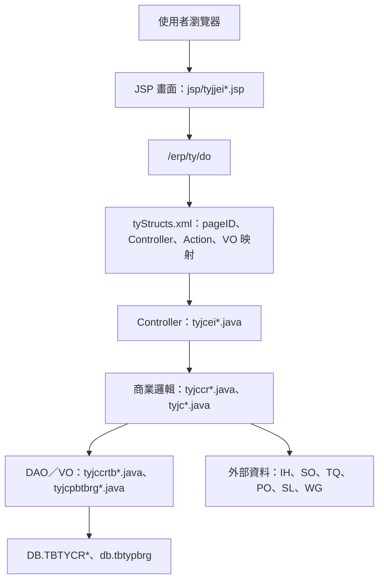
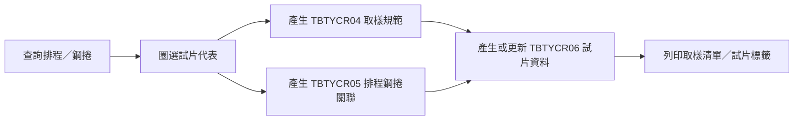
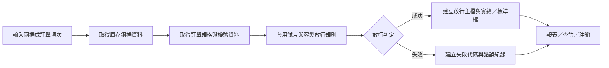

# TY 功能規格手冊

## 1. 系統概述

### 1.1 系統定位

`TY` 模組為鋼捲試片取樣、試片代表、檢驗放行與放行紀錄管理相關之 ERP 子系統。依目前程式與設定檔判讀，系統主要圍繞鋼捲、訂單、排程、工場、試片規範、試片批號與放行判定等資料，提供基本參數維護、交易紀錄查詢、取樣圈選、試片資料調整、標籤／報表列印、強制放行、沖銷與自動放行處理。

本手冊依下列現有檔案整理：

- 頁面流程設定：`config/yl/ty/tyStructs.xml`
- 畫面程式：`jsp/tyjjei*.jsp`
- Web Controller：`src/com/icsc/ty/tyjcei*.java`
- 商業邏輯：`src/com/icsc/ty/tyjccr*.java`、`src/com/icsc/ty/tyjc*.java`
- DAO／VO：`src/com/icsc/ty/*DAO.java`、`src/com/icsc/ty/*VO.java`
- 建表 SQL：`dao/sql/DB.TBTYCR*.sql`、`dao/sql/db.tbtypbrg.sql`

### 1.2 使用對象

本模組使用對象推定包含：

- 品管、檢驗或現場單位：執行試片取樣、試片代表確認、試片資料調整與檢驗放行。
- 生產／排程相關人員：依排程、鋼捲、訂單項次查詢或確認取樣資料。
- 系統維護人員：維護工場代號、圈選頻率、取樣參數、交易紀錄與序號輔助資料。
- 放行作業人員：執行即時放行、測試放行、測試轉單、半成品放行、強制放行與沖銷。

### 1.3 作業範圍

本模組涵蓋下列作業範圍：

- 基本參數維護：工場代號與代碼類參數維護。
- 交易與異動紀錄查詢：交易主檔與交易明細記錄查詢、維護。
- 圈選頻率與試片規範維護：管理取樣頻率、取樣位置、測試項目與用途。
- 試片取樣與代表鋼捲管理：依排程、庫存或訂單需求選取試片鋼捲並產生試片資料。
- 試片資料調整：調整試片代表、指定或取消試片規範、挑選存貨鋼捲。
- 報表與標籤列印：取樣清單、試片批號、鋼捲放行與標籤列印。
- 檢驗放行：依訂單規格、鋼捲實績、試片結果與客製化條件判定放行。
- 放行沖銷：查詢已放行資料並執行確認沖銷。

### 1.4 外部系統與資料關聯

程式中可見與下列資料或系統模組互動：

- `IH` 庫存／鋼捲資料：例如 `DB.TBIHCR01`、`DB.TBIHCR011`、`DB.TBIHCR012`。
- `SO` 訂單資料：例如 `DB.TBSOITEM`、訂單規格與訂單項次資料。
- `TQ` 檢驗／品質資料：畫面引用 `com.icsc.tq.dao.*`，放行畫面顯示降伏、抗拉等檢驗值。
- `PO` 或製程／生產資料：畫面與放行查詢引用 `com.icsc.po.*`。
- `SL` 規格展開資料：`tyjcBusiUtil` 以訂單項次取得 `SL` line-up 結果，組成 H6、H7 等測試規格查詢。
- `WG` 實驗室或排程資料：`tyjcBusiUtil` 透過 `DB.TBWG066`、`DB.TBWG067` 以試片批號反查訂單項次。

## 2. 系統架構總覽

### 2.1 技術架構

`TY` 模組採傳統 Java Servlet／JSP 架構，透過 ERP 共用框架處理頁面導向、表單資料轉換、交易控制與資料庫存取。

### 2.2 主要分層

| 層級 | 主要檔案 | 功能 |
|---|---|---|
| 畫面層 | `jsp/tyjjei*.jsp` | 提供查詢、維護、彈窗、列表、列印與 iframe 分頁畫面。 |
| 流程設定層 | `config/yl/ty/tyStructs.xml` | 定義 `pageID` 對應 JSP、Controller、Action flag、方法名稱與 VO。 |
| Controller 層 | `tyjcei01m`、`tyjcei03m1`、`tyjcei11m`、`tyjcei13m`、`tyjcei21m` 等 | 接收 `_action`，執行查詢、新增、修改、刪除、確認、放行、列印等動作。 |
| 商業邏輯層 | `tyjccr01m01`、`tyjccr02m01`、`tyjccr04m01`、`tyjccr04m02`、`tyjccr07m01`、`tyjccr07m02` 等 | 封裝取樣、試片代表、放行判定、沖銷、序號、客製條件等規則。 |
| 資料存取層 | `tyjccrtb01DAO`～`tyjccrtb09DAO`、`tyjcpbtbrgDAO` | 對 `DB.TBTYCR*`、`db.tbtypbrg` 執行查詢、新增、修改、刪除。 |
| 資料物件層 | `tyjccrtb01VO`～`tyjccrtb09VO`、`tyjcpbtbrgVO`、`tyjcOrderSpecVO` | 承載表單與資料庫欄位，部分 VO 具備欄位驗證與格式轉換。 |

### 2.3 頁面與 Action 映射

`tyStructs.xml` 以 `_pageId` 決定處理 Controller 與 Action。常見 Action 如下：

| Action | 方法語意 | 說明 |
|---|---|---|
| `I` | `query`、`queryOneRow`、`queryTB03` | 查詢清單或單筆資料。 |
| `N` | `create`、`createTB03`、`confirm` | 新增資料或確認作業。 |
| `R` | `update`、`updateOneRow`、`updateTB03` | 修改資料。 |
| `D` | `delete`、`deleteTB03` | 刪除資料。 |
| `P` | `Print`、`print`、`labelPrint` | 預覽列印或列印標籤。 |
| `CS`、`AS`、`CAS` | `chooseSample`、`assignPattern`、`cancelAssign` | 試片圈選與試片規範指定／取消。 |
| `CI`、`QI`、`CSI` | `chooseInv`、`queryInv`、`confirmByInvCoil` | 由庫存鋼捲挑選並確認。 |
| `CC`、`CF` | `cancelPass`、`cancelConfirm`、`confirmPass` | 取消放行、沖銷或強制放行。 |
| `A` | `adjust` | 試片代表或試片資料調整。 |
| `E`、`RN`、`T`、`CO`、`WP` | `execute`、`rightNow`、`test`、`changOrd`、`wipPass` | 自動／即時／測試／半成品放行與測試轉單。 |

### 2.4 共用服務與規則元件

| 元件 | 功能定位 | 主要用途 |
|---|---|---|
| `tyjcAPI` | 外部呼叫 API | 提供是否為人工試片等查詢。 |
| `tyjcAppr` | 權限檢核 | 依員工、使用者、程式與功能檢核授權。 |
| `tyjcBusiUtil` | 訂單規格與檢驗條件工具 | 取得訂單 line-up、材料、H6／H7 試驗規格等資料。 |
| `tyjcCoilPassOrd` | 鋼捲放行核心物件 | 整合鋼捲、訂單、檢驗與放行規則，產生放行結果。 |
| `tyjcCoilWipPassOrd` | 在製鋼捲放行物件 | 針對在製鋼捲取得庫存／製程資料並進行放行處理。 |
| `tyjcCustomize` | 客製化放行條件 | 依設定檔觸發 JIS 訂單、黑皮包裝、CQC 等客製放行邏輯。 |
| `tyjcPrt` | 列印輔助 | 組成列印表頭、列印按鈕、分頁與畫面列印控制。 |
| `tyjcpbm011` | 序號產生 | 依表名與欄位產生序號，供試片編號等資料使用。 |
| `tyjcpbmer` | 錯誤紀錄 | 建立批次或交易錯誤紀錄。 |

## 3. 功能模組詳細說明

### 3.1 基本參數維護

| 項目 | 說明 |
|---|---|
| 代表程式 | `TYJJEI01`、`TYJJEI06` |
| 主要畫面 | `tyjjei01.jsp`、`tyjjei01m1.jsp`、`tyjjei06.jsp`、`tyjjei06m1.jsp` |
| Controller | `tyjcei01m` |
| 主要資料 | `DB.TBTYCR01` |
| 主要功能 | 查詢、新增、修改、刪除工場或代碼類參數。`TYJJEI01` 畫面固定查詢 `codeType = mill`，`TYJJEI06` 畫面出現「圈選頻率」欄位，推定用於取樣頻率或圈選條件類參數。 |
| 處理規則 | 以 `compId`、`codeType`、`codeNo` 為主鍵；新增、修改、刪除均經 `tyjcei01m` 呼叫 `tyjccr01m01` 與 `tyjccrtb01DAO`。 |

### 3.2 交易紀錄查詢與維護

| 項目 | 說明 |
|---|---|
| 代表程式 | `TYJJEI02`、`TYJJEI03` |
| 主要畫面 | `tyjjei02.jsp`、`tyjjei02m1.jsp`、`tyjjei02m2.jsp`、`tyjjei03.jsp`、`tyjjei03m1.jsp`、`tyjjei03m2.jsp` |
| Controller | `tyjcei02m`、`tyjcei03m1`、`tyjcei03m2` |
| 商業邏輯 | `tyjccr02m01` |
| 主要資料 | `DB.TBTYCR02`、`DB.TBTYCR03`、`db.tbtypbrg` |
| 主要功能 | 查詢交易主檔、交易明細，並可維護單據資料。畫面條件包含交易日期、資料單號、表格代號、異動人員、鋼卷編號等。 |
| 處理規則 | `TBTYCR02` 作為交易主檔，`TBTYCR03` 作為交易記錄或明細。`tyjccr02m01.throwData` 會建立主檔與明細，並以 `db.tbtypbrg` 管理序號或日別表格流水。 |

### 3.3 試片取樣圈選

| 項目 | 說明 |
|---|---|
| 代表程式 | `TYJJEI11` |
| 主要畫面 | `tyjjei11.jsp`、`tyjjei11m1.jsp`、`tyjjei11m1s1.jsp`、`tyjjei11m2.jsp` |
| Controller | `tyjcei11m` |
| 商業邏輯 | `tyjccr04m01`、`tyjccr04m02`、`tyjccr04m02CSC`、`tyjccr04m02HL` |
| 主要資料 | `DB.TBTYCR04`、`DB.TBTYCR05`、`DB.TBTYCR06` |
| 主要功能 | 依排程編號、工場、鋼捲、圈選日期等條件查詢，執行「確定圈選」、「取消圈選」、「指定試片規範」、「取消試片規範」與單筆更新。 |
| 處理規則 | 以排程資料產生試片代表或取樣資料；依取樣頻率、取樣位置、測試項目、試片用途、當站／前後站工場等條件判定。`tyjccr04m02` 負責取樣資料建立，`tyjccr04m02CSC`、`tyjccr04m02HL` 則為特定流程或工場別邏輯。 |

### 3.4 取樣報表與試片標籤列印

| 項目 | 說明 |
|---|---|
| 代表程式 | `TYJJEI12`、`TYJJEI14`、`TYJJEI16` |
| 主要畫面 | `tyjjei12m1.jsp`、`tyjjei14m1.jsp`、`tyjjei16m1.jsp`、`tyjjei16p1.jsp` |
| Controller | `tyjcei12m1`、`tyjcei16m` |
| 共用元件 | `tyjcPrt` |
| 主要資料 | `DB.TBTYCR06`、`DB.TBTYCR05`、`DB.TBTYCR04` |
| 主要功能 | 依排程編號、鋼捲編號、工場代號、訂單編號、試片批號等條件預覽列印；`TYJJEI16` 顯示「列印標籤」，用於試片標籤列印。 |
| 處理規則 | 透過 `P` action 呼叫列印方法，JSP 端提供預覽列印、清空、返回與分頁列印控制。 |

### 3.5 試片代表與試片資料調整

| 項目 | 說明 |
|---|---|
| 代表程式 | `TYJJEI13`、`TYJJEI13H`、`TYJJEI15` |
| 主要畫面 | `tyjjei13m1.jsp`、`tyjjei13mh1.jsp`、`tyjjei13m1s1.jsp`、`tyjjei13m2.jsp`、`tyjjei15m1.jsp`、`tyjjei15m2.jsp` |
| Controller | `tyjcei13m`、`tyjcei15m` |
| 商業邏輯 | `tyjccr04m01`、`tyjccr04m02` |
| 主要資料 | `DB.TBTYCR04`、`DB.TBTYCR05`、`DB.TBTYCR06`、`DB.TBIHCR01` |
| 主要功能 | 查詢試片編號、鋼捲編號、圈選工場、圈選日期、圈選目的；可加選訂單需求鋼捲、挑選庫存鋼捲、依排程確認、更新試片用途或調整試片代表。 |
| 處理規則 | `changeUse` 用於變更試片用途；`confirmByInvCoil` 由庫存鋼捲確認取樣；`confirmBySchedule` 由排程資料確認；`adjust` 用於試片代表調整。 |

### 3.6 調質資料處理

| 項目 | 說明 |
|---|---|
| 代表程式 | `TYJJEI19` |
| 主要畫面 | `tyjjei19.jsp` |
| Controller | `tyjcei19m` |
| 主要功能 | 畫面提供「調質（CS）」與「調質（HS）」選項，Controller 內有 `executeCS`、`executeHS` 與 `execute` 方法。 |
| 處理規則 | 依輸入或畫面選項執行調質相關資料處理。因目前僅從方法名稱與畫面標籤確認功能，詳細資料契約需再追 `executeCS`、`executeHS` 內部欄位規則。 |

### 3.7 鋼捲強制放行

| 項目 | 說明 |
|---|---|
| 代表程式 | `TYJJEI21`、`TYJJEI21H` |
| 主要畫面 | `tyjjei21.jsp`、`tyjjei21h.jsp`、`tyjjei21m1.jsp`、`tyjjei21mh1.jsp` |
| Controller | `tyjcei21m` |
| 商業邏輯 | `tyjccr07m01`、`tyjccr07m02`、`tyjccr07m03` |
| 主要資料 | `DB.TBTYCR07`、`DB.TBTYCR001`、`DB.TBTYCR002`、`DB.TBTYCR003`、`DB.TBTYCR004`、`DB.TBIHCR01` |
| 主要功能 | 依訂單編號、工場代號、鋼捲編號、放行日期等條件查詢，執行「強制放行」與「取消強制放行」。 |
| 處理規則 | `confirmPass` 建立或更新放行資料；`cancelPass`、`cancelForcePassCoil`、`cancelForcePassOfSampling` 取消放行。放行核心邏輯會比對鋼捲狀態、訂單規格、試片資料、檢驗值與客製化條件。 |

### 3.8 鋼捲放行報表

| 項目 | 說明 |
|---|---|
| 代表程式 | `TYJJEI22`、`TYJJEI23`、`TYJJEI24` |
| 主要畫面 | `tyjjei22.jsp`、`tyjjei22m1.jsp`、`tyjjei23.jsp`、`tyjjei23m1.jsp`、`tyjjei24.jsp` |
| Controller | `tyjcei22m1`、`tyjcei23m` |
| 主要資料 | `DB.TBTYCR07`、`DB.TBTYCR001`～`DB.TBTYCR004`、庫存與訂單相關表 |
| 主要功能 | 依鋼捲編號、工場代號、訂單編號、放行日期、報表類別與產品大類等條件預覽列印放行資料。 |
| 處理規則 | `TYJJEI22` 可見條件 `a.coilStus Like '2%'`，推定以特定鋼捲狀態作為報表篩選條件之一。`TYJJEI24` 畫面包含產品大類 `H`、`C` 選項。 |

### 3.9 放行沖銷

| 項目 | 說明 |
|---|---|
| 代表程式 | `TYJJEI25` |
| 主要畫面 | `tyjjei25.jsp`、`tyjjei25m1.jsp`、`tyjjei25Popup.jsp` |
| Controller | `tyjcei25m` |
| 商業邏輯 | `tyjccr07m01`、`tyjccr07m02` |
| 主要資料 | `DB.TBTYCR001`、`DB.TBTYCR07` 相關放行資料、`DB.TBIHCR01` |
| 主要功能 | 查詢放行資料並執行「確定沖銷」。查詢條件包含工場代號、鋼捲編號、放行日期、檢驗判定、放行判定、訂單編號、訂單項次、試片批號與鋼捲狀態。 |
| 處理規則 | `cancelConfirm` 執行沖銷確認，應同步處理放行主檔狀態、鋼捲資料與相關放行記錄。 |

### 3.10 自動／即時放行與測試工具

| 項目 | 說明 |
|---|---|
| 代表程式 | `TYJJEI29` |
| 主要畫面 | `tyjjei29.jsp`、`tyjjei29m1.jsp` |
| Controller | `tyjcei29m` |
| 核心物件 | `tyjcCoilPassOrd`、`tyjcCoilWipPassOrd`、`tyjcCustomize` |
| 主要資料 | `DB.TBTYCR001`～`DB.TBTYCR004`、`DB.TBTYCR07`、`DB.TBIHCR01`、`DB.TBSOITEM` |
| 主要功能 | 提供「即時放行」、「自動放行」、「測試放行」、「測試轉單」、「半成品放行」。可依鋼捲編號或訂單編號／項次執行。 |
| 處理規則 | 放行時整合鋼捲實績、訂單規格、檢驗結果與客製放行規則。`ty_Customize.ini` 可設定條件式客製處理，例如黑皮包裝、CQC 或 JIS 類規則；因設定檔中文註解來源編碼不完整，本手冊僅依 SQL 條件與 Java 方法名稱保守描述。 |

### 3.11 主要資料表

| 資料表 | VO／DAO | 功能定位 | 主要用途 | 關聯功能 |
|---|---|---|---|---|
| `DB.TBTYCR01` | `tyjccrtb01VO`／`tyjccrtb01DAO` | 基本參數設定檔 | 以 `compId`、`codeType`、`codeNo` 管理工場代號、圈選頻率或其他代碼型參數，並保存 `fldA`～`fldJ`、建立／修改資訊與備註。 | `TYJJEI01` 工場代號維護、`TYJJEI06` 圈選頻率或取樣參數維護、各查詢彈窗工場選單。 |
| `DB.TBTYCR02` | `tyjccrtb02VO`／`tyjccrtb02DAO` | 交易主檔 | 保存交易單號、交易日期、人員、表單、查詢識別、鋼捲編號、錯誤狀態與交易資料欄位。 | `TYJJEI02` 交易查詢、`TYJJEI03` 交易維護、批次或放行錯誤追蹤。 |
| `DB.TBTYCR03` | `tyjccrtb03VO`／`tyjccrtb03DAO` | 交易明細／記錄檔 | 以 `compId`、`transId`、`logSrlNo` 保存交易明細、錯誤代碼、錯誤訊息、記錄日期時間與備註。 | `TYJJEI02` 明細檢視、`TYJJEI03` 明細增刪改、交易拋轉紀錄。 |
| `DB.TBTYCR04` | `tyjccrtb04VO`／`tyjccrtb04DAO` | 試片取樣設定／試片規範檔 | 保存試片編號、代表鋼捲、圈選工場、硬度／拉伸／彎曲／NR 測試旗標、各測試長度、取樣位置、取樣頻率、取樣數量、用途與放行狀態。 | `TYJJEI11` 圈選、`TYJJEI13` 試片代表維護、`TYJJEI15` 試片調整、取樣規則判定。 |
| `DB.TBTYCR05` | `tyjccrtb05VO`／`tyjccrtb05DAO` | 試片代表鋼捲／排程取樣關聯檔 | 以排程編號與鋼捲編號記錄訂單、爐號、鋼胚、當站／前後站工場、是否切邊、是否取樣、試片編號與選取序號。 | `TYJJEI11` 排程圈選、`TYJJEI13` 依排程挑選、`TYJJEI15` 試片代表調整、`TYJJEI16` 標籤列印。 |
| `DB.TBTYCR06` | `tyjccrtb06VO`／`tyjccrtb06DAO` | 試片資料檔 | 保存試片編號、排程、鋼捲、工場、訂單、製程、測試項目、取樣長度、取樣位置、取樣頻率、取樣旗標、代表鋼捲 A／B、放行狀態與用途。 | `TYJJEI11` 單筆更新、`TYJJEI12` 取樣報表、`TYJJEI14` 試片批號報表、`TYJJEI16` 標籤列印。 |
| `DB.TBTYCR07` | `tyjccrtb07VO`／`tyjccrtb07DAO` | 鋼捲放行或強制放行暫存／結果檔 | 保存鋼捲、目前工場、品管日期、訂單、庫別、入庫日期、試片編號、鋼捲狀態、放行狀態與放行訊息。 | `TYJJEI21` 強制放行、`TYJJEI22`／`TYJJEI23` 放行報表、`TYJJEI25` 沖銷、`TYJJEI29` 放行處理。 |
| `DB.TBTYCR08` | `tyjccrtb08VO`／`tyjccrtb08DAO` | 特定製程或前段試片取樣資料檔 | 以鋼捲編號記錄工場、判定日期、訂單項次、測試旗標、取樣長度、取樣位置、取樣頻率與取樣旗標。 | 特定取樣流程與放行前資料判定；目前未出現在 `tyStructs.xml` 主畫面映射，需再依呼叫點確認實際入口。 |
| `DB.TBTYCR09` | `tyjccrtb09VO`／`tyjccrtb09DAO` | 接續上一次排程取樣記錄檔 | 以 `lineCode`、`classifyStr` 保存計數，用於延續上次排程取樣或流水狀態。 | 取樣排程、圈選頻率與取樣序號延續。 |
| `db.tbtypbrg` | `tyjcpbtbrgVO`／`tyjcpbtbrgDAO` | 序號輔助檔 | 以公司、日期、表名管理流水號與備註，供交易或取樣資料產生序號。 | `TYJJEI02`／`TYJJEI03` 交易資料、`tyjccr02m01.throwData`、取樣編號或表格流水管理。 |
| `DB.TBTYCR001` | `tyjccrtb001VO`／`tyjccrtb001DAO` | 鋼捲放行主檔 | 保存放行序號、鋼捲、訂單、放行人員、放行日期、放行判定、狀態、錯誤紀錄、取消旗標與轉次。 | `TYJJEI21` 強制放行、`TYJJEI25` 沖銷、`TYJJEI29` 即時／自動／測試放行。 |
| `DB.TBTYCR002` | `tyjccrtb002VO`／`tyjccrtb002DAO` | 鋼捲放行失敗代碼檔 | 以放行序號與錯誤代碼保存放行失敗原因與錯誤說明。 | 放行失敗追蹤、`TYJJEI29` 放行測試與自動放行紀錄。 |
| `DB.TBTYCR003` | `tyjccrtb003VO`／`tyjccrtb003DAO` | 鋼捲放行實績檔 | 保存鋼捲產品、規格、等級、狀態、尺寸、重量、內徑、塗油、切邊、包裝、鍍層、材質、鋼胚、爐號、工場、試片、機械性質與檢驗判定等實績。 | 放行判定、放行報表、放行追溯。 |
| `DB.TBTYCR004` | `tyjccrtb004VO`／`tyjccrtb004DAO` | 鋼捲放行標準檔 | 保存訂單產品、規格、厚寬長重上下限、內徑、塗油、切邊、包裝、鍍層、材質、MSC、機械性質標準與證書等訂單標準。 | 放行標準比對、放行報表、`tyjcCoilPassOrd` 規格判定。 |

### 3.12 主要資料流程

#### 3.12.1 試片取樣流程

#### 3.12.2 放行流程

### 3.13 未完全確認事項

下列事項因目前僅依本模組程式與設定檔判讀，若要作為正式驗收文件，建議再補資料庫 schema 或使用者作業說明交叉確認：

- `TBTYCR08`、`TBTYCR09` 的實際畫面入口與營運名稱。
- `TYJJEI19` 調質（CS／HS）作業的完整資料來源、輸出與錯誤處理。
- `ty_Customize.ini` 中文註解因原始編碼顯示受限，客製條件中文名稱需由維護者確認。
- `DB.TBTYCR001～004` 未在本資料夾 `dao/sql` 中找到建表 SQL，本手冊依 VO／DAO 欄位與描述整理。
- 外部模組 `IH`、`SO`、`TQ`、`PO`、`SL`、`WG` 的欄位規則未在本次範圍逐表驗證。
