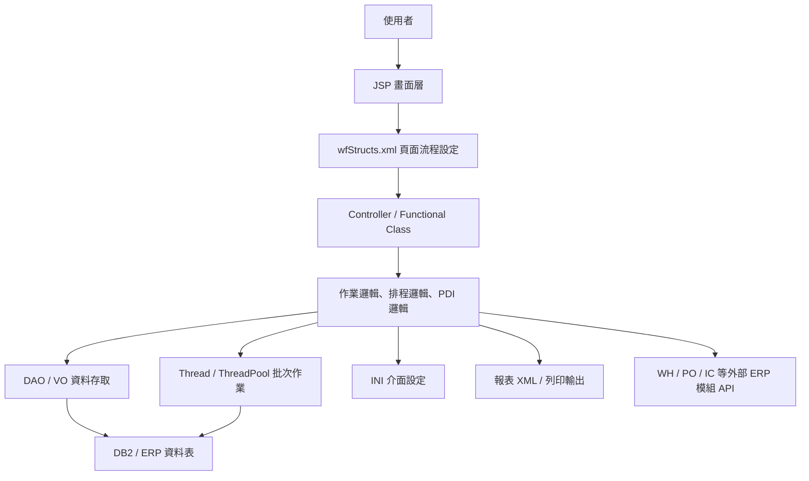

# WF 功能規格手冊

> 本文件依據 `wf` 模組現有程式、設定與資料存取檔案整理，主要參考 `config/yl/wf/wfStructs.xml`、`jsp/`、`src/com/icsc/wf/`、`dao/`、`dao/sql/`、`config/yl/wf/*.ini` 與 `xml/dr/`。文件目的為建立功能規格總覽，供需求確認、維護交接與後續細部查核使用。

## 1. 系統概述

### 1.1 系統定位

`WF` 模組為中鴻鋼鐵 ERP 內的產線排程、鋼捲作業與生產資料介接系統。系統以鋼捲、訂單、排程、產線狀態與 `PDI` 資料為核心，提供使用者進行排程啟動、作業確認、人工調整、資料查詢、報表列印與介面資料維護。

本模組涵蓋多條生產線及不同作業型態，包含熱軋、冷軋及表面處理相關線別。從程式與設定檔可辨識的線別代碼包含 `CPN`、`GIN`、`CAN`、`CKN`、`CSN`、`CTN`、`CR1`、`CR2`、`HS1`、`CR0`、`CE1`、`CA0`、`CS1`、`CT1`、`CF1` 等。

### 1.2 使用對象

主要使用對象如下：

- 生產排程人員：維護及啟動排程資料，查詢鋼捲與訂單狀態。
- 產線操作人員：確認產線作業、放行或取消指定排程作業。
- 生管與製程管理人員：查詢 PDI、排程報表、鋼捲命令與鋼捲明細。
- 系統維護人員：維護系統參數、介面設定、異常資料與批次執行狀態。

### 1.3 系統範圍

本系統主要功能範圍包含：

- 產線排程啟動、報廢／退回與狀態查詢。
- 鋼捲作業資料查詢、人工調整、確認、授權與取消。
- 訂單、鋼捲、群組與熱片相關資料維護。
- PDI 資料產生、查詢、明細檢視與重建作業。
- 各線別排程報表、鋼捲命令、鋼捲明細與鋼捲彙總報表。
- 系統參數、共用設定、表格映射與介面檔案轉入。

### 1.4 主要資料來源

本文件整理依據如下：

| 類別 | 位置 | 說明 |
|---|---|---|
| 頁面流程設定 | `config/yl/wf/wfStructs.xml` | 定義 `pageID`、JSP、Controller、Action、VO 對應。 |
| 前端畫面 | `jsp/` | 使用者操作畫面、查詢清單、編輯頁、列印頁與 Popup。 |
| 控制與商業邏輯 | `src/com/icsc/wf/` | 產線作業、排程查詢、PDI、報表、批次與工具類別。 |
| 共用邏輯 | `src/com/icsc/wf/common/`、`src/com/icsc/wf/logic/` | 共用 Thread、批次、流程控制與跨線別邏輯。 |
| 資料存取 | `dao/`、`src/com/icsc/wf/dao/`、`src/com/icsc/wf/logic/dao/` | DAO、VO 與資料表操作。 |
| 資料表定義 | `dao/sql/` | `TBWF` 相關資料表建置 SQL。 |
| 介面設定 | `config/yl/wf/*.ini` | PDI、排程報表、鋼捲命令、鋼捲明細與資料表欄位設定。 |
| 報表定義 | `xml/dr/` | 排程、品管檢驗及相關列印報表 XML。 |

### 1.5 主要資料表與資料契約

從 `dao/sql/`、`src/com/icsc/wf/*DAO.java`、`src/com/icsc/wf/*VO.java` 與 `config/yl/wf/*.ini` 可整理出主要資料群：

| 資料表 | VO／DAO | 功能定位 | 主要用途 | 關聯功能 |
|---|---|---|---|---|
| `TBWFYL01` 至 `TBWFYL26` | `wfjcyltb01VO/DAO` 至 `wfjcyltb26VO/DAO` | 產線作業核心資料 | 保存排程啟動、鋼捲作業、狀態控制、作業明細與中間結果。 | 產線排程啟動、作業確認、放行、取消、報表查詢。 |
| `TBWFYLxxCA0`、`TBWFYLxxCE1`、`TBWFYLxxCF1`、`TBWFYLxxCR0`、`TBWFYLxxCS1`、`TBWFYLxxCT1`、`TBWFYLxxHS1` | `wfjcyltb01CA0VO/DAO` 等線別 VO／DAO | 線別拆分資料 | 依線別保存同型排程與鋼捲資料，降低不同產線資料混用。 | `ylBAF`、`ylECL`、`ylCF`、`ylRCM`、`ylTPM`、`ylRCL` 等線別作業。 |
| `TBWFYLCA0PDI`、`TBWFYLCE1PDI`、`TBWFYLCF1PDI`、`TBWFYLCS1PDI` | `wfjcyltbCA0PDIVO/DAO`、`wfjcyltbCE1PDIVO/DAO`、`wfjcyltbCF1PDIVO/DAO`、`wfjcyltbCS1PDIVO/DAO` | 線別 PDI 資料 | 保存線別 PDI 清單與明細，供產線或下游系統讀取。 | PDI 產生、PDI 查詢、線別批次。 |
| `TBWFCPN04` 至 `TBWFCPN07`、`TBWFCPNPDI` | `wfjcCPN04VO/DAO` 至 `wfjcCPN07VO/DAO`、`wfjcCPNPDIVO/DAO` | `CPN` 排程與 PDI | 保存 `CPN` 線別排程、鋼捲處理、前後資料與 PDI。 | `wfjjMCPN*`、`wfjcCPNMakePDIThread`、排程報表。 |
| `TBWFGIN04` 至 `TBWFGIN07`、`TBWFGINPDI` | `wfjcGIN04VO/DAO` 至 `wfjcGIN07VO/DAO`、`wfjcGINPDIVO/DAO` | `GIN` 排程與 PDI | 保存 `GIN` 線別排程、鋼捲處理、前後資料與 PDI。 | `wfjjMGIN*`、`wfjcGINMakePDIThread`、排程報表。 |
| `TBWFCAN045`、`TBWFCAN08`、`TBWFCANPDI` | `wfjcCAN045VO/DAO`、`wfjcCAN08VO/DAO`、`wfjcCANPDIVO/DAO` | `CAN` 線別資料 | 保存 `CAN` 線別排程資料、結果資料與 PDI。 | `wfjjSCAN*`、`wfjcCANMakePDIThread`、鋼捲命令。 |
| `TBWFCKN045`、`TBWFCKN08`、`TBWFCKNPDI` | `wfjcCKN045VO/DAO`、`wfjcCKN08VO/DAO`、`wfjcCKNPDIVO/DAO` | `CKN` 線別資料 | 保存 `CKN` 線別排程資料、結果資料、PDI 與標籤列印來源。 | `wfjjSCKN*`、`wfjjCKNLblPnt`、標籤列印。 |
| `TBWFCSN045`、`TBWFCSN08`、`TBWFCSNPDI` | `wfjcCSN045VO/DAO`、`wfjcCSN08VO/DAO`、`wfjcCSNPDIVO/DAO` | `CSN` 線別資料 | 保存 `CSN` 線別排程資料、結果資料與 PDI。 | `wfjjSCSN*`、`wfjcCSNMakePDIThread`、排程報表。 |
| `TBWFCTN045`、`TBWFCTN08`、`TBWFCTNPDI` | `wfjcCTN045VO/DAO`、`wfjcCTN08VO/DAO`、`wfjcCTNPDIVO/DAO` | `CTN` 線別資料 | 保存 `CTN` 線別排程資料、結果資料與 PDI。 | `wfjjSCTN*`、`wfjcCTNMakePDIThread`、排程報表。 |
| `TBWFCR1045`、`TBWFCR108`、`TBWFCR1PDI` | `wfjcCR1045VO/DAO`、`wfjcCR108VO/DAO`、`wfjcCR1PDIVO/DAO` | `CR1` 線別資料 | 保存 `CR1` 排程、結果與 PDI。 | `wfjjCR1*`、`wfjcCR1MakePDIThread`、冷軋流程查詢。 |
| `TBWFCR2045`、`TBWFCR208`、`TBWFCR2PDI` | `wfjcCR2045VO/DAO`、`wfjcCR208VO/DAO`、`wfjcCR2PDIVO/DAO` | `CR2` 線別資料 | 保存 `CR2` 排程、結果與 PDI。 | `wfjjCR2*`、`wfjcCR2MakePDIThread`、冷軋流程查詢。 |
| `TBWFSYS` | `wfjcsysVO/DAO` | 系統參數 | 保存 WF 模組控制參數、線別參數與批次開關。 | 系統參數維護、ThreadPool 控制、設定轉檔。 |
| `TBWFPP01`、`TBWFPP02`、`TBWFPP11` | `wfjcPp01VO/DAO`、`wfjcPp02VO/DAO`、`wfjcPp11VO/DAO` | 生產計畫與鋼捲計畫 | 保存訂單、鋼捲、計畫與排程前置資料。 | `wfjjPp01*`、`wfjjPp02*`、訂單加入、鋼捲加入。 |
| `TBWFHP01`、`TBWFHP0101`、`TBWFHP011`、`TBWFHP02` | `wfjcHp01VO/DAO`、`wfjcHp0101VO/DAO`、`wfjcHp011VO/DAO`、`wfjcHp02VO/DAO` | 熱片與待處理資料 | 保存熱片、排序、暫存及待處理清單資料。 | `wfjjHp*`、熱片查詢、人工調整、排序作業。 |
| `TBWFSP01`、`TBWFSP021`、`TBWFSP022` | `wfjcSp01VO/DAO`、`wfjcSp021VO/DAO`、`wfjcSp022VO/DAO` | 特殊排程 | 保存特殊排程、掛單與指定作業資料。 | `wfjjSp01*`、`wfjjSp02*`、手動訂單、掛單處理。 |
| `TBWFRQ02`、`TBWFRQ04` | `wfjcRq02VO/DAO`、`wfjcRq04VO/DAO` | 需求與介面查詢 | 保存需求查詢、PDI 關聯或介面結果資料。 | `wfjjRq02*`、`wfjjRq04*`、需求查詢、連結查詢。 |

## 2. 系統架構總覽

### 2.1 邏輯架構

### 2.2 程式分層

| 層級 | 元件 | 說明 |
|---|---|---|
| 畫面層 | `jsp/*.jsp` | 提供查詢、編輯、清單、Popup、列印與主畫面。 |
| 流程設定層 | `wfStructs.xml` | 將頁面、Controller、Action 與 VO 串接。 |
| 控制層 | `wfjc*.java` | 接收 Action，處理查詢、建立、更新、刪除、列印、啟動與取消。 |
| 共用邏輯層 | `logic/`、`common/` | 跨線別共用流程、PDI 產生、排程前處理、Thread 與例外處理。 |
| 資料存取層 | `dao/`、`dao/sql/` | 封裝資料表查詢與異動，並提供資料表建置 SQL。 |
| 設定層 | `config/yl/wf/*.ini` | 定義各線別表格、欄位、報表、PDI 與資料輸出入設定。 |
| 報表層 | `xml/dr/*.xml` | 定義排程、鋼捲命令、品管檢驗及明細報表格式。 |

### 2.3 頁面流程設定

`wfStructs.xml` 為本模組主要流程設定檔，目前定義約 `218` 個 page。每個 page 主要包含：

- `pageID`：ERP 內部頁面代碼。
- `path`：對應 JSP 檔案。
- `controller`：處理該頁 Action 的 Java 類別。
- `action`：畫面按鈕或事件代碼，對應實際 method。
- `converter`：輸入輸出資料物件，例如 `wf01VO`、`wfpdiVOListBef`、`wf04VOList`。

常見 Action 對應如下：

| Action | 常見 Method | 功能語意 |
|---|---|---|
| `I` | `query`、`doQuery`、`init` | 查詢、初始化。 |
| `N` | `create` | 新增。 |
| `R` | `update`、`query`、`doRun` | 更新、重新查詢或執行。 |
| `D` | `delete`、`scrap`、`xmlScrap*` | 刪除、報廢、退回或清除線別資料。 |
| `S` | `start`、`doStart` | 啟動排程或啟動作業。 |
| `O` | `doOk` | 確認作業。 |
| `G` | `doGrant` | 授權或放行作業。 |
| `C` | `doCancel` | 取消作業。 |
| `P` | `print`、`queryPrevPage` | 列印或上一頁。 |
| `N` | `queryNextPage` | 下一頁。 |
| `32` | `printSchdRpt` | 列印排程報表。 |
| `33` | `printCoilOrder` | 列印鋼捲命令。 |
| `40`、`42` | `query`、`print`、`mod40`、`mod42` | PDI 查詢、列印或跨畫面操作。 |

### 2.4 主要流程

#### 2.4.1 產線排程啟動流程

1. 使用者進入線別作業頁，例如 `wfjjyl02Edit` 或各線別 `wfjjyl*02Edit`。
2. 系統依 `compId`、`millId`、`lineCode` 查詢目前排程與狀態。
3. 使用者執行啟動，Controller 更新 `TBWFYL09` 或相關狀態表。
4. 系統清除或重設指定線別的暫存資料，例如 `TBWFYL17`、`TBWFSYS` 或線別中間表。
5. 啟動對應 Thread，進行排程資料整理、鎖定、轉檔或 PDI 建置。
6. 畫面回查狀態並提示作業進度。

#### 2.4.2 作業確認與放行流程

1. 使用者查詢待處理鋼捲或排程資料。
2. 系統依線別讀取對應資料表，例如 `TBWFYL04`、`TBWFYL05`、`TBWFYL06`、`TBWFYL07`、`TBWFYL08`。
3. 使用者可執行確認、取消或放行。
4. 確認時系統更新作業狀態，並可能同步更新 `WHPP10` 之執行狀態。
5. 放行時系統會啟動後續 Thread，清除待處理暫存或重建資料。

#### 2.4.3 PDI 產生與重建流程

1. 使用者透過 `Rq01` 或線別 PDI 頁面啟動 PDI 產生或查詢。
2. 系統檢查前階段作業狀態，例如排程、訂單排序、人工調整與確認狀態。
3. 通過檢查後，系統啟動 `wfjcRqAutoThread` 或各線別 `MakePDIThread`。
4. Thread 依 `INI` 設定與 DAO 讀取鋼捲、訂單、排程與線別資料。
5. 產生或更新對應 `PDI` 資料表，例如 `TBWFCPNPDI`、`TBWFGINPDI`、`TBWFCANPDI`、`TBWFCR1PDI`。
6. 使用者透過 PDI 清單與明細畫面查詢產生結果。

#### 2.4.4 報表列印流程

1. 使用者進入排程報表或鋼捲命令頁面。
2. Controller 依 Action 呼叫 `printSchdRpt`、`printCoilOrder` 或 `print`。
3. 系統依 `config/yl/wf/*.ini` 取得報表資料欄位與資料來源。
4. 報表定義由 `xml/dr/*.xml` 控制輸出格式。
5. 輸出排程報表、鋼捲命令、鋼捲明細、鋼捲彙總或品管檢驗表。

### 2.5 與外部 ERP 模組整合

從程式中可見本模組會使用其他 ERP 模組資料與 API：

- `WH` 模組：透過 `whjcInAPI` 查詢與更新作業狀態，例如 `WHPP10`。
- `PO` 模組：讀取訂單資料，例如 `TBPO0101`、`TBPO0103`、`TBPO0105`、`TBPO0107`。
- `IC` 或品管相關資料：用於鋼捲、品管檢驗、標籤與報表輸出。
- ThreadPool／DQ 機制：部分 PDI 或批次工作可透過工作池執行。

## 3. 功能模組詳細說明

### 3.1 系統參數與共用設定

#### 3.1.1 系統參數維護

| 項目 | 內容 |
|---|---|
| 主要頁面 | `wfjjsysEdit.jsp`、`wfjjsysList.jsp` |
| 主要 Controller | `com.icsc.wf.wfjcsysFunc` |
| 主要資料表 | `TBWFSYS` |
| 主要 Action | 查詢、新增、刪除、更新、轉檔 |

功能說明：

- 維護 WF 系統層級參數與控制設定。
- 支援查詢、新增、刪除與更新。
- 支援 `transFile`，表示可進行設定或資料檔案轉入處理。
- 提供批次、ThreadPool、線別狀態與系統行為控制參數。

#### 3.1.2 共用工具與訊息

| 元件 | 說明 |
|---|---|
| `wfjcUtil`、`wfjctool` | 共用工具、參數取得與字串處理。 |
| `wfjcMsg` | 共用訊息常數。 |
| `wfjcClassUtil` | 類別與反射工具。 |
| `wfjcStructsUtil` | 流程設定或結構資料工具。 |
| `wfjcTransportSQLUtil` | SQL 或資料轉換輔助。 |

### 3.2 產線排程與作業控制模組

此區塊以 `wfjjyl*` 系列頁面與 `wfjcyl*Func` 類別為主，處理產線排程啟動、查詢、確認、取消、授權、報表與線別資料維護。

#### 3.2.1 基本登入與線別狀態

| 項目 | 內容 |
|---|---|
| 主要頁面 | `wfjjyl01Edit.jsp` |
| Controller | `com.icsc.wf.wfjcyl01` |
| Action | `L:login` |
| 功能 | 進入線別作業或初始化操作人員相關狀態。 |

#### 3.2.2 排程啟動與報廢

| 項目 | 內容 |
|---|---|
| 主要頁面 | `wfjjyl02Edit.jsp` 及各線別 `*02Edit.jsp` |
| Controller | `wfjcyl02Func`、`wfjcylRCM02Func`、`wfjcylSPM02Func`、`wfjcylECL02Func`、`wfjcylBAF02Func`、`wfjcylTPM02Func`、`wfjcylRCL02Func` |
| Action | `I:query`、`S:start`、`D:scrap` |
| 主要資料 | `TBWFYL09`、`TBWFYL17`、`TBWFSYS` 及線別中間資料 |

功能說明：

- 查詢目前線別排程狀態。
- 啟動排程作業，更新狀態並啟動對應 Thread。
- 報廢或退回排程資料時，清除特定線別暫存或中間表。
- 線別報廢可透過 `wfjcylMgr02` 執行 `xmlScrapHS`、`xmlScrapCR`、`xmlScrapCE`、`xmlScrapCA`、`xmlScrapCS`、`xmlScrapCT`。

#### 3.2.3 排程報表與查詢

| 項目 | 內容 |
|---|---|
| 主要頁面 | `wfjjyl03Edit.jsp`、`wfjjyl03Rpt1.jsp`、`wfjjyl03Rpt2.jsp`、`wfjjyl03Rpt3.jsp` 及各線別對應頁面 |
| Controller | `wfjcyl03Func`、`wfjcylBAF03Func`、`wfjcylSPM03Func`、`wfjcylRCM03Func`、`wfjcylECL03Func`、`wfjcylTPM03Func`、`wfjcylRCL03Func` |
| Action | `I1:doQuery2`、`I2:doQuery1`、`I3:doQuery3` |

功能說明：

- 查詢不同型態排程資料。
- 依線別輸出排程相關報表。
- 支援多種報表頁面，分別對應不同查詢條件或資料彙總方式。

#### 3.2.4 作業確認、取消與授權

| 項目 | 內容 |
|---|---|
| 主要頁面 | `wfjjyl04Edit.jsp`、`wfjjyl05Edit.jsp` 及各線別 `*04Edit.jsp`、`*05Edit.jsp` |
| Controller | `wfjcyl04Func`、`wfjcyl05Func` 及各線別子類 |
| Action | `I:doQuery`、`O:doOk`、`S:doStart`、`G:doGrant`、`C:doCancel` |
| 主要資料 | `TBWFYL04`、`TBWFYL05`、`TBWFYL06`、`TBWFYL07`、`TBWFYL08`、`TBWFYL10`、`TBWFYL23` |

功能說明：

- 查詢作業前後資料、待處理鋼捲與作業清單。
- 執行作業確認，更新排程狀態。
- 取消時回復或解除狀態鎖定。
- 授權時清除或重建後續資料，並啟動後續 Thread。
- 與 `WHPP10` 狀態同步，用於記錄階段處理結果。

#### 3.2.5 線別資料維護與查詢

| 項目 | 內容 |
|---|---|
| 主要頁面 | `wfjjyl06Edit.jsp`、`wfjjyl07Edit.jsp`、`wfjjyl07List.jsp`、`wfjjyl08List.jsp` 及各線別對應頁面 |
| Controller | `wfjcyl06Func`、`wfjcyl07Func`、`wfjcyl08Func` 及各線別子類 |
| Action | 查詢、新增、刪除、更新、列印 |

功能說明：

- 維護線別相關資料。
- 查詢或列印鋼捲、排程、異常或結果資料。
- 支援 `Search`、`Popup`、`List`、`Rpt` 等頁面型態。

### 3.3 跨線別排程查詢與 PDI 檢視模組

此區塊由 `MCPN`、`MGIN`、`SCAN`、`SCKN`、`SCSN`、`SCTN`、`CR1`、`CR2` 等頁面群組構成，透過共用 Controller 處理跨線別流程。

#### 3.3.1 `MCPN`、`MGIN` 主流程

| 模組 | 頁面數 | 主要 Controller | 功能範圍 |
|---|---:|---|---|
| `MCPN` | 約 `21` | `wfjchlMXXX01Func` 至 `wfjchlMXXX15Func` | 主線別排程、鋼捲、PDI、報表與週期資料。 |
| `MGIN` | 約 `19` | `wfjchlMXXX01Func` 至 `wfjchlMXXX14Func` | 與 `MCPN` 類似的主流程，對應 `GIN` 線別資料。 |

主要功能：

- `01` 至 `03`：基礎資料、訂單與鋼捲條件查詢。
- `04` 至 `05`：線別排程資料、鋼捲處理清單與列印。
- `06` 至 `10`：排程調整、前後資料比對、排序與結果查詢。
- `11`：PDI 清單與 PDI 明細。
- `12`：排程報表與鋼捲命令列印。
- `13` 至 `15`：週期報表、Popup 查詢、列印與延伸分析。

#### 3.3.2 `SCAN`、`SCKN`、`SCSN`、`SCTN` 次流程

| 模組 | 頁面數 | 主要 Controller | 功能範圍 |
|---|---:|---|---|
| `SCAN` | 約 `9` | `wfjchlSXXX01Func` 至 `wfjchlSXXX14Func` | 線別排程查詢、PDI、排程報表與列印。 |
| `SCKN` | 約 `9` | `wfjchlSXXX01Func` 至 `wfjchlSXXX14Func` | 線別排程查詢、PDI、排程報表與列印。 |
| `SCSN` | 約 `9` | `wfjchlSXXX01Func` 至 `wfjchlSXXX14Func` | 線別排程查詢、PDI、排程報表與列印。 |
| `SCTN` | 約 `9` | `wfjchlSXXX01Func` 至 `wfjchlSXXX14Func` | 線別排程查詢、PDI、排程報表與列印。 |

主要功能：

- `01` 至 `05`：線別資料查詢、鋼捲資料整理、排程條件與結果查詢。
- `06`：PDI 清單與明細。
- `07`：排程報表與鋼捲命令。
- `14`：PDI 查詢與列印。

#### 3.3.3 `CR1`、`CR2` 流程

| 模組 | 頁面數 | 主要 Controller | 功能範圍 |
|---|---:|---|---|
| `CR1` | 約 `6` | `logic.wfjcSCR001Func`、`logic.wfjcSXXX02Func` 至 `logic.wfjcXXXPDIFunc` | 冷軋線別排程查詢與 PDI。 |
| `CR2` | 約 `6` | `logic.wfjcSCR001Func`、`logic.wfjcSXXX02Func` 至 `logic.wfjcXXXPDIFunc` | 冷軋線別排程查詢與 PDI。 |

主要功能：

- `01` 至 `05`：查詢、排序、比較與線別資料整理。
- `06`：PDI 清單與明細查詢。
- 使用 `logic/dao` 下的 `CR1`、`CR2` DAO／VO 操作對應資料表。

#### 3.3.4 `CKN` 標籤列印

| 項目 | 內容 |
|---|---|
| 主要頁面 | `wfjjCKNLblPnt.jsp` |
| Controller | `com.icsc.wf.wfjcCKNLabelFunc` |
| Action | `AQ:advancedQuery`、`P:print` |
| 功能 | 進階查詢 `CKN` PDI 資料並列印標籤。 |

### 3.4 生產計畫、訂單與鋼捲作業模組

#### 3.4.1 生產計畫資料維護

| 項目 | 內容 |
|---|---|
| 主要頁面 | `wfjjPp01List.jsp`、`wfjjPp01Edit.jsp`、`wfjjPp01ListOrd.jsp` |
| Controller | `com.icsc.wf.wfjcPp01` |
| 主要資料表 | `TBWFPP01` |
| 主要 Action | 查詢、移除、進階查詢、上下頁、訂單查詢、訂單加入 |

功能說明：

- 查詢生產計畫與訂單資料。
- 支援依訂單號、項次及其他條件進階查詢。
- 可讀取 `PO` 模組訂單資料並建立 WF 計畫資料。
- 支援將訂單加入排程資料。

#### 3.4.2 鋼捲計畫資料維護

| 項目 | 內容 |
|---|---|
| 主要頁面 | `wfjjPp02List.jsp`、`wfjjPp02Edit.jsp`、`wfjjPp02ListCoil.jsp` |
| Controller | `wfjcPp02List`、`wfjcPp02Edit` |
| 主要資料表 | `TBWFPP02`、`TBWFPP11` |
| 主要 Action | 查詢、刪除、進階查詢、上下頁、查詢全部鋼捲、加入鋼捲 |

功能說明：

- 查詢與維護鋼捲計畫資料。
- 支援清單、編輯與鋼捲挑選。
- 可將鋼捲資料加入指定計畫或排程。

#### 3.4.3 群組與鋼捲列印

| 項目 | 內容 |
|---|---|
| 主要頁面 | `wfjjGp01List.jsp`、`wfjjGp01Print.jsp` |
| Controller | `com.icsc.wf.wfjcGp01` |
| Action | `queryGroupNo`、`queryCoilNo`、`queryIhcr` |
| 功能 | 查詢群組與鋼捲資料，並輸出指定列印資料。 |

### 3.5 熱片與特殊排程模組

#### 3.5.1 熱片資料處理

| 項目 | 內容 |
|---|---|
| 主要頁面 | `wfjjHp01List.jsp`、`wfjjHp0101Main.jsp`、`wfjjHp011.jsp`、`wfjjHp02List.jsp` |
| Controller | `wfjcHp01`、`wfjcHp0101`、`wfjcHp011`、`wfjcHp02` |
| 主要資料表 | `TBWFHP01`、`TBWFHP0101`、`TBWFHP011`、`TBWFHP02` |

功能說明：

- 查詢熱片或待處理資料。
- 支援人工調整、刪除、查詢上下頁與條件查詢。
- 支援排序與批次執行。
- 可將熱片相關資料納入排程準備流程。

#### 3.5.2 特殊排程與指定作業

| 項目 | 內容 |
|---|---|
| 主要頁面 | `wfjjSp01List.jsp`、`wfjjSp02Main.jsp` |
| Controller | `wfjcSp01`、`wfjcSp02` |
| 主要資料表 | `TBWFSP01`、`TBWFSP021`、`TBWFSP022` |

功能說明：

- 查詢特殊排程或指定作業。
- 支援人工調整、手動訂單、產生排程訂單與回上一階段。
- `Sp02` 支援啟動掛單或調整指定作業。

### 3.6 PDI 與需求查詢模組

#### 3.6.1 PDI 產生與狀態查詢

| 項目 | 內容 |
|---|---|
| 主要頁面 | `wfjjRq01.jsp` |
| Controller | `com.icsc.wf.wfjcRq01` |
| Action | `I:doQuery`、`R:doRun`、`B:back` |
| 主要 Thread | `common.wfjcRqAutoThread` |

功能說明：

- 查詢 PDI 產生狀態。
- 檢查前置階段是否完成，例如排程、訂單排序、人工調整與確認。
- 啟動 PDI 產生批次。
- 支援失敗或取消時回復階段狀態。
- 可依 ThreadPool 設定決定使用工作池或直接啟動 Thread。

#### 3.6.2 需求與資料查詢

| 項目 | 內容 |
|---|---|
| 主要頁面 | `wfjjRq02List.jsp`、`wfjjRq03List.jsp`、`wfjjRq04List.jsp` |
| Controller | `wfjcRq02`、`wfjcRq03`、`wfjcRq04` |
| 主要資料表 | `TBWFRQ02`、`TBWFRQ04` |

功能說明：

- 依主鍵、進階條件、上一筆、下一筆或連結查詢資料。
- 查詢需求、PDI 或排程相關資料。
- 提供使用者檢視批次結果與關聯資料。

### 3.7 PDI 資料查詢與明細模組

各線別 PDI 主要透過共用頁面與 Controller 呈現：

| 線別群組 | 主要頁面 | Controller | 資料物件 |
|---|---|---|---|
| `MCPN`、`MGIN` | `wfjjhlXXXPDI01.jsp`、`wfjjhlXXXPDI02.jsp` | `wfjchlXXXPDIFunc` | `wfpdiVOListBef`、`wfpdiVOListAft` |
| `SCAN`、`SCKN`、`SCSN`、`SCTN` | `wfjjhlXXXPDI01.jsp`、`wfjjhlXXXPDI02.jsp` | `wfjchlXXXPDIFunc` | 各線別 PDI VO |
| `CR1`、`CR2` | `wfjjCR106.jsp`、`wfjjCR206.jsp` | `logic.wfjcXXXPDIFunc` | `CR1`、`CR2` PDI VO |

功能說明：

- 查詢 PDI 清單。
- 檢視 PDI 明細。
- 依線別使用對應 DAO 與 `INI` 設定。
- 提供列印或檢核前後資料的基礎資料來源。

### 3.8 報表與列印模組

#### 3.8.1 排程報表與鋼捲命令

| 項目 | 內容 |
|---|---|
| 主要頁面 | `wfjjhlXXXSchdRptList.jsp`、`wfjjRptListPrint.jsp` |
| Controller | `wfjchlXXXSchdRptFunc` |
| Action | `32:printSchdRpt`、`33:printCoilOrder` |
| 設定檔 | `wf_*_schdrpt.ini`、`wf_*_coilorder.ini` |

功能說明：

- 依線別列印排程報表。
- 依線別列印鋼捲命令。
- 使用 `INI` 設定決定欄位與資料來源。
- 輸出格式由 `xml/dr/` 報表 XML 控制。

#### 3.8.2 鋼捲明細與鋼捲彙總

| 類型 | 設定檔 |
|---|---|
| 一般鋼捲明細 | `wf_coildetailrpt.ini` |
| 一般鋼捲彙總 | `wf_coilsummaryrpt.ini` |
| `CPN` 鋼捲明細 | `wf_cpn_coildetailrpt.ini` |
| `CPN` 鋼捲彙總 | `wf_cpn_coilsummaryrpt.ini` |
| `GIN` 鋼捲明細 | `wf_gin_coildetailrpt.ini` |
| `GIN` 鋼捲彙總 | `wf_gin_coilsummaryrpt.ini` |

功能說明：

- 提供鋼捲層級明細查詢與列印。
- 提供彙總型報表，支援管理與生管檢視。
- 不同線別可使用不同設定檔，降低共用報表欄位差異造成的維護成本。

#### 3.8.3 品管檢驗表

`xml/dr/` 內含多個品管檢驗表與排程報表，例如：

- 酸洗線品管檢驗表。
- 鍍鋅線品管檢驗表。
- 依生產日起迄查詢的檢驗表。
- 中鋼專用、中鴻專用或全部資料版本。

功能說明：

- 依線別與日期條件輸出品管檢驗資料。
- 搭配排程與 PDI 資料作為檢驗表來源。
- 提供列印或匯出給生產、品管與管理單位使用。

### 3.9 批次與背景作業模組

| 類別 | 主要元件 | 說明 |
|---|---|---|
| PDI 產生 | `wfjcRqAutoThread`、`wfjchlXXXMakePDIThread`、`wfjcXXXMakePDIThread` | 依線別產生或重建 PDI。 |
| 前處理 | `wfjchlXXXPreWorkThread`、`wfjcXXXPreWorkThread` | 執行排程或 PDI 前置資料整理。 |
| 共用批次 | `wfjcAutoThread`、`wfjcXXXMakePDICommonThread` | 統一處理跨線別工作。 |
| 線別批次 | `wfjcCPNMakePDIThread`、`wfjcGINMakePDIThread`、`wfjcCANMakePDIThread`、`wfjcCKNMakePDIThread`、`wfjcCSNMakePDIThread`、`wfjcCTNMakePDIThread`、`wfjcCR1MakePDIThread`、`wfjcCR2MakePDIThread` | 依線別執行 PDI 產生。 |
| ThreadPool | `wfjcYLThreadPool`、`dqjcPoolUtils` 使用點 | 部分作業可由工作池執行，避免畫面同步等待。 |

功能說明：

- 批次作業負責長時間資料整理，避免使用者畫面直接執行大量運算。
- 透過狀態表與 `WHPP10` 類似機制記錄各階段完成、執行中或失敗。
- 依系統參數判斷是否走 ThreadPool。
- 批次失敗時，畫面功能可提示使用者重啟、查詢或退回狀態。

### 3.10 資料維護與異常處理

#### 3.10.1 資料新增、更新與刪除

多數維護頁面支援下列標準作業：

- 查詢既有資料。
- 新增資料。
- 更新資料。
- 刪除資料。
- 進階查詢與上下頁。
- Popup 選取或清單帶回。

此類功能常見於 `wfjcyl18Func`、`wfjcyl19Func`、`wfjcyl20Func`、`wfjcsysFunc`、`wfjcPp01`、`wfjcPp02List` 等 Controller。

#### 3.10.2 排程退回與清除

排程退回或報廢相關功能會影響多個資料表。程式中可見退回邏輯可能處理：

- 重設 `TBWFYL09` 狀態。
- 清除指定線別的 `TBWFYL01`、`TBWFYL02`、`TBWFYL03`、`TBWFYL10`、`TBWFYL23` 等資料。
- 解除 `TBICWIP` 或類似在製資料的鎖定狀態。
- 清除 `TBWFYLSUBSTMILL` 指定線別排程記錄。

此類功能具資料破壞性，正式操作前應由業務流程確認條件、狀態與影響資料範圍。

### 3.11 主要功能群組對照表

| 功能群組 | 代表頁面 | 代表 Controller | 說明 |
|---|---|---|---|
| 系統參數 | `wfjjsysEdit`、`wfjjsysList` | `wfjcsysFunc` | 系統參數與設定轉檔。 |
| 產線啟動 | `wfjjyl02Edit`、各線別 `*02Edit` | `wfjcyl02Func`、各線別 `02Func` | 啟動、查詢、報廢排程。 |
| 作業確認 | `wfjjyl04Edit`、`wfjjyl05Edit` | `wfjcyl04Func`、`wfjcyl05Func` | 查詢、確認、放行、取消。 |
| 線別維護 | `wfjjyl06Edit`、`wfjjyl07Edit`、`wfjjyl08List` | `wfjcyl06Func`、`wfjcyl07Func`、`wfjcyl08Func` | 線別資料維護與查詢。 |
| 主流程查詢 | `wfjjMCPN*`、`wfjjMGIN*` | `wfjchlMXXX*Func` | 主線別排程、PDI、報表。 |
| 次流程查詢 | `wfjjSCAN*`、`wfjjSCKN*`、`wfjjSCSN*`、`wfjjSCTN*` | `wfjchlSXXX*Func` | 線別排程、PDI、報表。 |
| 冷軋流程 | `wfjjCR1*`、`wfjjCR2*` | `logic.wfjcSXXX*Func`、`logic.wfjcXXXPDIFunc` | `CR1`、`CR2` 查詢與 PDI。 |
| 生產計畫 | `wfjjPp01*`、`wfjjPp02*` | `wfjcPp01`、`wfjcPp02List` | 訂單、鋼捲與計畫資料。 |
| 熱片資料 | `wfjjHp*` | `wfjcHp01`、`wfjcHp02`、`wfjcHp011` | 熱片查詢、調整與排序。 |
| 特殊排程 | `wfjjSp*` | `wfjcSp01`、`wfjcSp02` | 特殊排程、掛單與手動作業。 |
| 需求查詢 | `wfjjRq*` | `wfjcRq01`、`wfjcRq02`、`wfjcRq03`、`wfjcRq04` | PDI 產生、需求與結果查詢。 |
| 報表列印 | `wfjjhlXXXSchdRptList`、`wfjjRptListPrint` | `wfjchlXXXSchdRptFunc` | 排程報表、鋼捲命令與列印。 |
| 標籤列印 | `wfjjCKNLblPnt` | `wfjcCKNLabelFunc` | `CKN` PDI 標籤查詢與列印。 |

### 3.12 維護注意事項

- `wfStructs.xml` 是頁面與 Controller 的關鍵契約，新增功能時需同步維護 `pageID`、Action、VO 與 JSP。
- 線別資料表多採同型結構加線別後綴，修改 DAO 或 SQL 時需確認是否需同步調整其他線別。
- PDI 產生與排程退回會跨多張資料表，異動前需確認狀態表、Thread 狀態與外部模組狀態。
- 報表欄位多由 `INI` 與 `xml/dr` 控制，欄位異動需同步確認資料來源 SQL、VO 與報表版面。
- 部分程式中文註解與訊息為 `BIG5` 編碼，若終端顯示亂碼，應以原始檔編碼或可正確開啟的編輯器確認，不宜只依終端輸出判斷文字內容。
