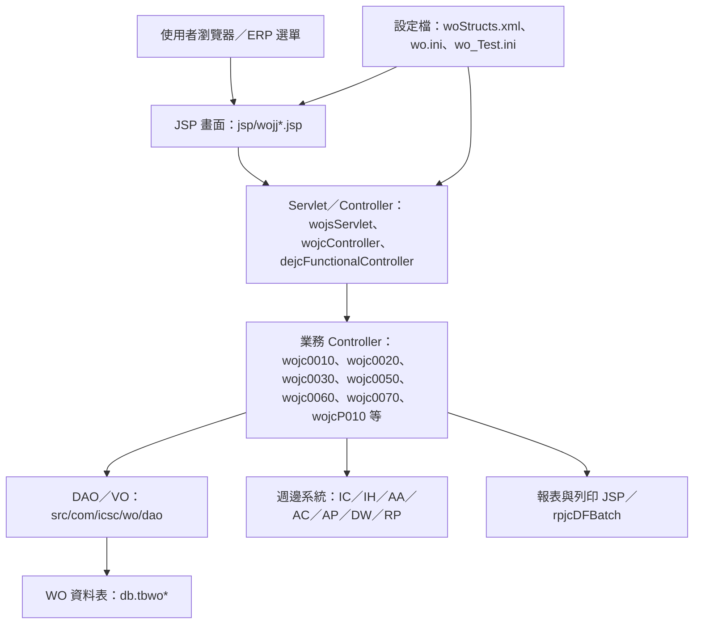

# WO 託工作業管理系統功能規格手冊

## 1.系統概述

### 1.1 系統定位

`WO` 為 ERP 中的託工作業管理系統，依目前程式與資料表命名，主要支援鋼捲及鋼管託工流程。系統涵蓋託工合約與單價條件維護、託工產出及驗收資料維護、報支申請、發票與傳票資料、報表列印、批次轉入，以及與 `IC`、`IH`、`AA`、`AC`、`AP` 等週邊系統介接。

本手冊依據目前 `wo` 模組下列實體整理：

- `jsp/`：使用者畫面、查詢、清單、明細、報表列印與彈出查詢頁。
- `src/com/icsc/wo/`：主要 Controller、共用設定、批次與工具程式。
- `src/com/icsc/wo/dao/`：`VO`／`DAO` 資料存取物件。
- `dao/tbwo*.dao`：`db.tbwo*` 資料表定義與欄位說明。
- `config/yl/wo/woStructs.xml`：新版 `/erp/wo/do?_pageId=...` 頁面與 Controller 對應。
- `config/yl/wo/wo_Test.ini`：中鋼代清洗鋼捲產出資料拋入 `WO` 的介接設定。

### 1.2 系統範圍

系統功能可分為下列範圍：

- 鋼捲託工合約管理：合約主檔、加工單價、鋅層附價、包裝單價、製程附價。
- 鋼捲託工產出及驗收：託工主檔、明細、已驗收未報支資料、傳票內容。
- 鋼捲託工報支：一般報支主檔、報支明細、發票記錄、報支準備鋼捲、客訴索賠明細。
- 鋼管託工合約管理：鋼管合約主檔、管徑與表面積關係、表面清潔與其他附價。
- 鋼管託工產出及報支：鋼管產出明細、驗收主檔、傳票內容、一般報支主檔、報支明細、發票記錄。
- Controller 登錄及授權指令管理：作業代碼、啟動 JSP、Controller、execution 與授權控制。
- 外部系統介接：庫存／產出資料拋轉、會計傳票、付款／報支資料、工作訊息及報表。

### 1.3 主要使用對象

- 託工業務承辦：建立及維護託工合約、產出資料、報支申請。
- 驗收／倉儲相關人員：確認鋼捲或鋼管託工產出、重量、數量與入庫狀態。
- 會計／報支人員：處理報支、發票、傳票、付款資訊與會計介接。
- 系統維護人員：維護 `WO` 作業代碼、Controller execution、批次與介接設定。

### 1.4 文件限制與待確認事項

本文件依程式碼、JSP 名稱、Controller 方法、`woStructs.xml` 及 `.dao` 定義整理。部分舊 JSP 與 Java 註解為 Big5 編碼，已盡量以正確編碼讀取；若功能名稱未在程式中明確揭露，則採檔名、資料表描述與欄位名稱保守描述。正式上線規格若需欄位級檢核規則、簽核路徑、會計科目設定或跨系統資料契約，仍需再比對實際資料庫、共用元件與使用者作業流程。

## 2.系統架構總覽

### 2.1 架構分層

### 2.2 程式與資料流

- 傳統作業多由 `wojsServlet` 接收 `EXECUTION`，再依 `wojcapid`／`wojcapidexe` 登錄或 Controller 內部判斷呼叫對應方法。
- 新式頁面使用 `/erp/wo/do?_pageId=...`，由 `woStructs.xml` 對應 `pageID`、JSP、Controller、action flag 與 `VO`。
- `VO` 承載畫面欄位及資料表欄位，`DAO` 負責 `SELECT`、`INSERT`、`UPDATE`、`DELETE` 與批次 SQL。
- 託工產出流程會寫入 `tbwo1010`／`tbwo1020` 或 `tbwo6010`／`tbwo6005` 等資料表，並在特定作業中拋轉 `IC`／`IH` 介面。
- 報支流程以 `tbwo2010`／`tbwo2020`／`tbwo2030` 或 `tbwo7010`／`tbwo7020`／`tbwo7030` 為核心，並建立會計傳票、付款或報支資料。

### 2.3 主要作業代碼與 Controller

| 作業／頁面群 | 主要 JSP | 主要 Controller | 功能定位 |
| --- | --- | --- | --- |
| `WOJS0010` | `wojj0010*` 至 `wojj0050*` | `wojc0010` | 鋼捲託工合約與附價條件維護。 |
| `WOJS0020` | `wojj1010*`、`wojj1020*`、`wojj1030*`、`wojj1000imp.jsp` | `wojc0020` | 鋼捲託工產出、明細、傳票與轉檔。 |
| `WOJS0030` | `wojj2010*` 至 `wojj2070*` | `wojc0030`、`wojc2070` | 鋼捲一般報支、發票、報支準備、客訴索賠與報表。 |
| `WOJS0050` | `wojj5010*`、`wojj5020*` | `wojc0050` | 鋼管託工合約與管徑／表面積設定。 |
| `WOJS0060` | `wojj6010*`、`wojj6020*` | `wojc0060` | 鋼管驗收產出與傳票查詢。 |
| `WOJS0070` | `wojj7010*`、`wojj7020*`、`wojj7030*`、`wojj7050Rpt*` | `wojc0070` | 鋼管託工一般報支、明細、發票與報表。 |
| `WOJJCOILCONTRACT` | `wojjCoilContract*` | `wojcCoilContract01` 至 `wojcCoilContract05` | 新版鋼捲合約分頁維護。 |
| `WOJJCOILOUTSOURCED` | `wojjCoilOutsourced*` | `wojcCoilOutsourced01` 至 `wojcCoilOutsourced04` | 新版鋼捲委外產出資料處理。 |
| `WOJJCOILPAYOUT` | `wojjCoilPayOut*` | `wojcCoilPayOut01` 至 `wojcCoilPayOut03` | 新版鋼捲報支／撥付處理。 |
| `WOJJP010` | `wojjP010*` | `wojcP010` | 鋼管託工產出挑選、確認、取消與檔案匯入。 |
| `WOJSAPID` | `wojjapid*` | `wojcapid` | 作業代碼與 execution 登錄維護。 |

### 2.4 主要資料表

| 資料表 | VO／DAO | 功能定位 | 主要用途 | 關聯功能 |
| --- | --- | --- | --- | --- |
| `db.tbwo0010` | `wojc0010VO`／`wojc0010DAO` | 託工合約主檔 | 維護合約編號、有效日期、出入倉別、託工來源廠、公司編號、託工線別、回收單價、運費附價、其他附價、結案日期與合約備註。 | 鋼捲合約維護、鋼捲產出、報支挑選、合約結案。 |
| `db.tbwo0020` | `wojc0020VO`／`wojc0020DAO` | 加工單價檔 | 依合約、品名、厚度、寬度與等級維護加工單價。 | 鋼捲合約加工單價、產出費用試算、報支金額計算。 |
| `db.tbwo0030` | `wojc0030VO`／`wojc0030DAO` | 鋅層附價檔 | 維護合約、品名、鋅層、厚度範圍與鋅層附價。 | 鋼捲合約附價、鋼捲產出費用計算。 |
| `db.tbwo0040` | `wojc0040VO`／`wojc0040DAO` | 包裝單價檔 | 維護合約、包裝方式、包裝單價與最終包裝單價。 | 鋼捲合約包裝附價、產出成本計算。 |
| `db.tbwo0050` | `wojc0050VO`／`wojc0050DAO` | 製程附價檔 | 維護合約、製程型別、製程說明與製程附價。 | 鋼捲合約製程附價、產出成本計算。 |
| `db.tbwo1010` | `wojc1010VO`／`wojc1010DAO` | 託工主檔 | 記錄合約、產出日期、倉別、廠商、線別、合計產出數量及重量。 | 鋼捲託工產出主檔、列印、傳票產生。 |
| `db.tbwo1020` | `wojc1020VO`／`wojc1020DAO` | 託工明細檔 | 記錄鋼捲號碼、產出鋼捲編號、品名、規格、厚寬長、重量、鋅層、包裝、單價、金額、稅額、託工狀態與拋轉狀態。 | 鋼捲產出明細、庫存拋轉、報支明細來源。 |
| `db.tbwo1020h` | `wojc1020hVO`／`wojc1020hDAO` | 已驗收未報支檔 | 保留已驗收但尚未完成報支的鋼捲產出明細。 | 鋼捲報支挑選、已驗收未報支控管。 |
| `db.tbwo1030` | `wojc1030VO`／`wojc1030DAO` | 託工傳票內容檔 | 記錄合約、產出日期、傳票編號、借貸別、會計科目、戶號、參號、到期日、記帳金額與摘要。 | 鋼捲託工傳票、會計 `AA`／`AC` 介接。 |
| `db.tbwo2010` | `wojc2010VO`／`wojc2010DAO` | 託工一般報支主檔 | 記錄報支申請單號、請款日期、請款人、受款人、付款方式、銀行帳號、報支總金額、案由摘要、報支狀態與合約資訊。 | 鋼捲一般報支、付款資料、報支列印。 |
| `db.tbwo2020` | `wojc2020VO`／`wojc2020DAO` | 託工一般報支明細檔 | 記錄報支申請單號、產出鋼捲編號、倉別、品名、產出重量、加工費用與營業稅。 | 鋼捲報支明細、報支金額彙總、發票核對。 |
| `db.tbwo2020E` | `wojc2020EVO`／`wojc2020DAO` | 報支明細延伸資料 | `.dao` 描述文字疑似編碼異常，依命名推定為 `tbwo2020` 相關延伸資料。 | 鋼捲報支明細延伸，需再由資料庫 schema 確認。 |
| `db.tbwo2030` | `wojc2030VO`／`wojc2030DAO` | 託工一般報支發票記錄檔 | 記錄報支申請單號、進項發票索引、發票種類、發票號碼、發票日期、稅率、統一編號、稅前金額、營業稅、發票金額與客訴折讓申請單號。 | 鋼捲報支發票、客訴折讓、付款附件。 |
| `db.tbwo2040` | `wojc2040VO`／`wojc2040DAO` | 託工傳票內容檔 | 依程式功能用於鋼捲報支或產出資料的傳票內容查詢及計算。 | 鋼捲報支傳票、費用試算、會計介接。 |
| `db.tbwo2060` | `wojc2060VO`／`wojc2060DAO` | 託工報支準備鋼捲檔 | 保存可供報支挑選或準備處理的鋼捲資料。 | 鋼捲報支挑選、檔案上傳、待報支控管。 |
| `db.tbwo2070` | `wojc2070VO`／`wojc2070DAO` | 託工鋼捲客訴索賠明細檔 | 記錄受理編號、鋼捲編號、缺陷代碼、託工廠、索賠金額、索賠日期、入帳日期與最終索賠金額。 | 客訴索賠、發票／報支折讓、入帳狀態更新。 |
| `db.tbwo5010` | `wojc5010VO`／`wojc5010DAO` | 鋼管託工合約主檔 | 維護鋼管合約、合約型別、有效日期、倉別、託工來源、廠商、線別、託工單價、表面清潔附價與其他附價。 | 鋼管合約維護、鋼管產出、鋼管報支。 |
| `db.tbwo5020` | `wojc5020VO`／`wojc5020DAO` | 鋼管管徑與表面積關係表 | 維護合約、管徑範圍、面積與加價。 | 鋼管合約附加條件、鋼管產出金額計算。 |
| `db.tbwo6005` | `wojc6005VO`／`wojc6005DAO` | 鋼管鍍鋅／噴漆託工產出明細資料 | 記錄鋼管編號、合約、產出日期、捆號、倉別、訂單、品級、重量、清洗重量、產出線別、投入／產出品名、規格與缺陷代碼。 | `WOJJP010` 鋼管產出挑選、確認、檔案匯入。 |
| `db.tbwo6010` | `wojc6010VO`／`wojc6010DAO` | 託工鋼管驗收產出主檔 | 記錄鋼管合約、產出日期、序號、廠商、線別、品名、規格、管徑、方管長短邊、厚度、重量、支數、長度、清潔計重、加工費與稅額。 | 鋼管驗收產出、鋼管傳票、鋼管報支來源。 |
| `db.tbwo6010h` | `wojc6010hVO`／`wojc6010hDAO` | 託工鋼管驗收產出歷史／暫存主檔 | 欄位結構接近 `tbwo6010`，依名稱判斷用於驗收產出資料的歷史或暫存控管。 | 鋼管驗收、報支前資料保留，需再由流程確認用途。 |
| `db.tbwo6020` | `wojc6020VO`／`wojc6020DAO` | 託工鋼管傳票內容檔 | 記錄鋼管合約、產出日期、傳票編號、借貸別、會計科目、戶號、參號、到期日、記帳金額與摘要。 | 鋼管驗收傳票、會計 `AA`／`AC` 介接。 |
| `db.tbwo7010` | `wojc7010VO`／`wojc7010DAO` | 鋼管託工一般報支主檔 | 記錄鋼管報支申請單號、請款人、受款人、付款方式、銀行資料、報支總金額、案由摘要與報支狀態。 | 鋼管一般報支、付款資料、報表列印。 |
| `db.tbwo7020` | `wojc7020VO`／`wojc7020DAO` | 鋼管託工一般報支明細檔 | 記錄報支申請單號、合約、產出日期、線別、品名、規格、管徑、尺寸、重量、支數、長度、清潔計重、總面積等明細。 | 鋼管報支明細、金額彙總、報表。 |
| `db.tbwo7030` | `wojc7030VO`／`wojc7030DAO` | 鋼管託工一般報支發票記錄檔 | 記錄報支申請單號、發票種類、發票號碼、發票日期、稅率、統一編號、稅前金額、營業稅、發票金額與客訴折讓品名／金額。 | 鋼管報支發票、折讓與付款附件。 |
| `db.tbwoapid` | `wojcapidVO`／`wojcapidDAO` | Controller 登錄檔 | 維護作業代碼、啟動模式、Controller、主 JSP、啟用碼、紀錄碼與作業說明。 | `WOJSAPID` 作業登錄、Servlet 啟動控制。 |
| `db.tbwoapidexe` | `wojcapidexeVO`／`wojcapidexeDAO` | Controller execution 登錄檔 | 維護作業代碼、作業指令、Controller、啟用碼、授權控制與指令說明。 | `WOJSAPID` 指令登錄、權限及 action 對應。 |
| `db.tbwoicwork` | `wojcicworkVO`／`wojcicworkDAO` | 託工產出拋 `IC`、`IH` 介面檔 | 暫存鋼捲產出或回沖資料，包含鋼捲號碼、託工廠商鋼捲編號、倉別、廠商、線別、品名、規格、產出厚寬長、重量、等級與產出日期。 | 鋼捲產出拋庫存、`IC`／`IH` 介接、轉檔與模擬。 |

### 2.5 外部系統關聯

| 系統 | 關聯方式 | 說明 |
| --- | --- | --- |
| `IC` | `tbwoicwork`、`traceICProd`、`traceICCelProd` | 鋼捲或鋼管託工產出資料拋轉庫存／製品在製相關介面。 |
| `IH` | 鋼捲資料查詢與產出資料核對 | 程式查詢鋼捲既有資料、重量與 Label 相關資訊。 |
| `AA` | `aajbdei.doRegister`、`doDessection2`、`doVchr` | 託工費用傳票建立與借貸分錄。 |
| `AC` | `acjcdei.doInsert` | 建立成本／付款相關會計資料。 |
| `AP` | 報支主檔、付款欄位及程式內 `apMaster` | 一般報支、付款批號與受款人資料處理。 |
| `RP` | `rpjcDFBatch.runRpt`、列印 JSP | 報支明細、請款明細及彙總報表產生。 |

## 3.功能模組詳細說明

### 3.1 鋼捲託工合約管理

**主要作業**：`WOJS0010`、`WOJJCOILCONTRACT`

**主要畫面**：`wojj0010*`、`wojj0020*`、`wojj0030*`、`wojj0040*`、`wojj0050*`、`wojjCoilContract*`

**主要 Controller**：`wojc0010`、`wojcCoilContract01`、`wojcCoilContract02`、`wojcCoilContract03`、`wojcCoilContract04`、`wojcCoilContract05`

**主要資料表**：`tbwo0010`、`tbwo0020`、`tbwo0030`、`tbwo0040`、`tbwo0050`

此模組負責建立託工合約與其單價條件。合約主檔維護合約期間、託工來源、廠商、線別、倉別、回收單價、運費與其他附價；明細條件包含加工單價、鋅層附價、包裝單價與製程附價。

主要功能包含：

- 合約查詢、進階查詢、新增、修改、刪除、批次刪除。
- 合約複製與匯入。
- 合約結案日期更新。
- 加工單價依厚度、寬度、品名及等級維護。
- 鋅層、包裝及製程附價維護。
- 新版 `woStructs.xml` 頁面以 `I`、`N`、`R`、`D`、`RD` 等 action 執行查詢、新增、修改、刪除及結案日更新。

**重要規則與限制**：

- 程式中多處以 `wojc1020DAO.canChange()` 判斷合約若已有產出資料，部分合約及附價資料不得任意修改或刪除。
- 包裝方式使用 `ICPACKWGT`，倉別使用 `IHCSTOCK` 等代碼表。

### 3.2 鋼捲託工產出與驗收

**主要作業**：`WOJS0020`

**主要畫面**：`wojj1000imp.jsp`、`wojj1010*`、`wojj1020*`、`wojj1030*`、`wojj1000Print001.jsp`

**主要 Controller**：`wojc0020`

**主要資料表**：`tbwo1010`、`tbwo1020`、`tbwo1020h`、`tbwo1030`、`tbwoicwork`

此模組處理鋼捲託工產出資料，由合約、產出日期與鋼捲明細構成，並可進行試算、正式拋轉及回沖。產出明細保存鋼捲號碼、產出鋼捲編號、規格、厚寬長、重量、等級、鋅層、包裝、單價、附價、加工費用、營業稅、託工狀態與介接狀態。

主要功能包含：

- 託工產出主檔查詢、新增、修改、刪除。
- 託工產出明細查詢、新增、修改、刪除、強制更新與強制刪除。
- 產出資料匯入與轉檔。
- 加工費、營業稅及傳票資料試算。
- 拋轉 `IC`／`IH` 產出介面。
- 建立或回沖 `AA` 傳票與 `AC` 成本資料。
- 產出資料列印與 Excel 輸出。

**重要規則與限制**：

- `wo_Test.ini` 顯示中鋼代清洗鋼捲產出資料可由外部傳入並寫入 `db.tbwo2080`，但目前資料夾未看到對應 `.dao` 檔，需再確認此表是否由其他模組或資料庫維護。
- 拋轉前會清除或重建 `tbwoicwork` 介面資料，再呼叫 `IC` 相關 API。
- 程式包含 `checkAA()` 機制，用於確認 `AA` 傳票主檔與明細是否確實建立。

### 3.3 鋼捲一般報支與客訴索賠

**主要作業**：`WOJS0030`、`WOJS2070`、`WOJJCOILPAYOUT`

**主要畫面**：`wojj2010*`、`wojj2020*`、`wojj2030*`、`wojj2040.jsp`、`wojj2050*`、`wojj2060List.jsp`、`wojj2070*`、`wojjCoilPayOut*`

**主要 Controller**：`wojc0030`、`wojc2070`、`wojcCoilPayOut01`、`wojcCoilPayOut02`、`wojcCoilPayOut03`

**主要資料表**：`tbwo2010`、`tbwo2020`、`tbwo2030`、`tbwo2040`、`tbwo2060`、`tbwo2070`

此模組負責鋼捲託工費用報支，包含報支申請主檔、報支明細、發票記錄、待報支鋼捲資料、客訴索賠與報表。報支主檔保存請款人、部門、受款人、付款方式、銀行帳號、預計付款日、報支金額與狀態；報支明細連結產出鋼捲編號及加工費、稅額；發票記錄支援進項發票、稅額及客訴折讓資料。

主要功能包含：

- 報支申請建立、修改、刪除、查詢。
- 從已驗收或待報支鋼捲挑選明細。
- 報支明細刪除與查詢。
- 發票資料新增、修改、刪除與查詢。
- 報支資料申請、取消申請及不同報支類型處理。
- 客訴索賠明細新增、修改、刪除、入帳日期更新。
- 報支單、請款明細表、彙總報表及 Excel 輸出。

**重要規則與限制**：

- 報支流程會計算加工費用及營業稅，並依不同情境處理客訴折讓。
- `wojc0030` 內有 `C0R00180` 報表呼叫，對應請款明細類報表。
- `wojc2070` 會查核發票號碼是否已存在於 `tbwo2030` 或其他發票資料來源，並可更新索賠入帳狀態。

### 3.4 鋼管託工合約管理

**主要作業**：`WOJS0050`

**主要畫面**：`wojj5000Main.jsp`、`wojj5010*`、`wojj5020*`

**主要 Controller**：`wojc0050`

**主要資料表**：`tbwo5010`、`tbwo5020`

此模組負責鋼管託工合約主檔與管徑／表面積條件設定。合約主檔保存合約型別、有效期間、倉別、託工來源、廠商、線別、託工單價、表面清潔附價、其他附價與結案日期；管徑與表面積表則用於不同管徑範圍的面積及加價計算。

主要功能包含：

- 鋼管合約查詢、進階查詢、新增、修改、刪除、批次刪除。
- 鋼管合約複製。
- 管徑範圍、表面積與加價維護。
- 依管徑或合約條件提供鋼管產出及報支金額計算基礎。

### 3.5 鋼管託工產出與驗收

**主要作業**：`WOJS0060`、`WOJJP010`

**主要畫面**：`wojj6000Main.jsp`、`wojj6000SelectPC.jsp`、`wojj6000SelectPG.jsp`、`wojj6000SelectPO.jsp`、`wojj6000SelectPT.jsp`、`wojj6010*`、`wojj6020*`、`wojjP010*`

**主要 Controller**：`wojc0060`、`wojcP010`、`wojcPipeUtil`

**主要資料表**：`tbwo6005`、`tbwo6010`、`tbwo6010h`、`tbwo6020`

此模組處理鋼管託工產出資料挑選、確認、取消、檔案匯入、驗收及傳票查詢。`WOJJP010` 以 `woStructs.xml` 設定 action：`SP` 選擇鋼管、`I` 查詢、`A` 新增鋼管、`D` 刪除鋼管、`T` 確認、`C` 取消、`DO` 檔案匯入。

主要功能包含：

- 依合約型別選擇未結案託工合約。
- 鋼管產出資料挑選與匯入。
- 新增或刪除鋼管產出明細。
- 託工產出確認與取消確認。
- 驗收產出主檔查詢。
- 鋼管傳票內容查詢。
- 透過 `wojcPipeUtil` 計算鋼管加工費、清潔費、總面積與稅額。

**重要規則與限制**：

- 鋼管流程以 `PG`、`PO`、`PC`、`PT` 等合約或產品型別切換不同挑選畫面，正式含義需以使用者作業定義確認。
- `wojcP010` 內使用交易隔離設定，代表確認及取消作業涉及多筆資料一致性。

### 3.6 鋼管一般報支

**主要作業**：`WOJS0070`

**主要畫面**：`wojj7000Main.jsp`、`wojj7010*`、`wojj7020*`、`wojj7030*`、`wojj7000Print001.jsp`、`wojj7050Rpt.jsp`、`wojj7050Rpt001.jsp`

**主要 Controller**：`wojc0070`

**主要資料表**：`tbwo7010`、`tbwo7020`、`tbwo7030`

此模組負責鋼管託工報支，結構與鋼捲報支類似，分為報支主檔、報支明細及發票記錄。明細資料包含合約、產出日期、線別、品名、規格、管徑、尺寸、產出重量、支數、清潔計重、總面積、加工費用與營業稅。

主要功能包含：

- 鋼管報支申請建立、修改、刪除、查詢。
- 從鋼管驗收產出資料挑選報支明細。
- 鋼管報支明細查詢與刪除。
- 鋼管報支發票新增、修改、刪除與查詢。
- 報支申請與取消申請。
- 鋼管報支單列印、Excel 輸出及月報類報表。

### 3.7 新版鋼捲委外產出作業

**主要作業**：`WOJJCOILOUTSOURCED`

**主要畫面**：`wojjCoilOutsourced*`

**主要 Controller**：`wojcCoilOutsourced01` 至 `wojcCoilOutsourced04`

**主要資料表**：依 Controller 內容，主要仍關聯鋼捲產出與合約資料，包含 `tbwo1010`、`tbwo1020` 及周邊查詢表。

此模組為新版鋼捲委外資料處理畫面，包含產出資料匯入、確認產出、查詢、修改與刪除。畫面提供 `wojjCoilOutsourced01KeyIn.jsp` 匯入與確認產出操作，並以清單及彈出查詢頁支援資料挑選。

### 3.8 作業登錄與授權指令維護

**主要作業**：`WOJSAPID`

**主要畫面**：`wojjapidMain.jsp`、`wojjapid.jsp`、`wojjapidexe.jsp`、`wojjapidexeList.jsp`

**主要 Controller**：`wojcapid`

**主要資料表**：`tbwoapid`、`tbwoapidexe`

此模組維護 `WO` 系統的作業代碼、啟動模式、主 JSP、Controller、啟用狀態、記錄碼、execution 指令與授權控制。傳統 `wojsServlet` 作業依此類設定判斷要啟動的 Controller 與執行動作。

主要功能包含：

- 作業代碼查詢、新增、修改、刪除。
- execution 指令查詢、新增、修改、刪除、批次刪除。
- Controller 與授權 action 對應維護。

### 3.9 批次、轉檔與介接

**主要程式**：`wojcBat010`、`wojcBat020`、`wojcBat030`、`wojcApi`、`wojcPipeUtil`

**主要設定**：`wo_Test.ini`

**主要資料表**：`tbwoicwork`，以及各產出、報支、傳票資料表。

此範圍處理外部資料匯入、產出資料轉入、庫存或製品介接，以及會計／付款系統拋轉。`wo_Test.ini` 明確描述「中鋼代清洗鋼捲產出拋 WO 設定檔（CSC -> CHS）」，傳入資料會解析訂單編號、鋼捲編號、託工鋼捲編號、厚度、寬度、淨重、產出日期、內徑與製程路徑等欄位。

主要功能包含：

- 外部文字或參數資料解析。
- 清除、重建或寫入 `tbwoicwork` 介面資料。
- 拋轉或回沖 `IC` 產出資料。
- 查詢 `IH` 鋼捲資料做重量、鋼捲狀態或 Label 核對。
- 建立 `AA` 傳票與 `AC` 成本資料。
- 產生報表或 PDF／Excel 輸出。

### 3.10 報表與輸出

**主要畫面**：`wojj1000Print001.jsp`、`wojj2000Print001.jsp`、`wojj2050Rpt*`、`wojj7000Print001.jsp`、`wojj7050Rpt*`

**主要功能**：

- 鋼捲託工產出明細列印。
- 鋼捲報支單及請款明細表列印。
- 鋼捲報支彙總及 Excel 輸出。
- 鋼管報支明細及鋼管報支單列印。
- 鋼管月報或彙總報表產生。

部分報表由 JSP 直接產生 HTML／Excel 形式，部分由 `rpjcDFBatch.runRpt()` 呼叫報表代碼產生 PDF。報表代碼如 `C0R00180`、`C0R00340`、`C0R00350` 已在程式中出現，但完整報表版型需至報表系統設定再確認。

## 附錄 A：主要檔案對照

| 類別 | 路徑 | 說明 |
| --- | --- | --- |
| 系統設定 | `config/yl/wo/wo.ini` | 系統預設設定，包含 dump 與測試使用者設定。 |
| 新版頁面設定 | `config/yl/wo/woStructs.xml` | `pageID`、JSP、Controller、action flag、VO 對應。 |
| 外部介接設定 | `config/yl/wo/wo_Test.ini` | 中鋼代清洗鋼捲產出資料拋 `WO` 設定。 |
| 傳統 Servlet | `src/com/icsc/wo/wojsServlet.java` | 接收作業請求、建立 `dsCom` 與派送 Controller。 |
| 共用 Controller | `src/com/icsc/wo/wojcController.java` | 傳統 Controller 基底。 |
| 共用常數 | `src/com/icsc/wo/wojcSetting.java` | `Initial`、`Search`、`Insert`、`Update`、`Delete`、`Transfer`、`Simulate`、`Copy` 等 execution 常數。 |
| 狀態常數 | `src/com/icsc/wo/wojcWoStatus.java`、`wojcApStatus.java`、`wojcApplyType.java` | 託工狀態、報支狀態、申請類型等代碼常數。 |
| 鋼管工具 | `src/com/icsc/wo/wojcPipeUtil.java` | 鋼管費用、傳票、拋轉及工作訊息相關共用處理。 |

