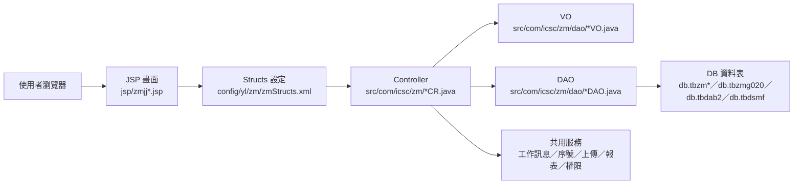
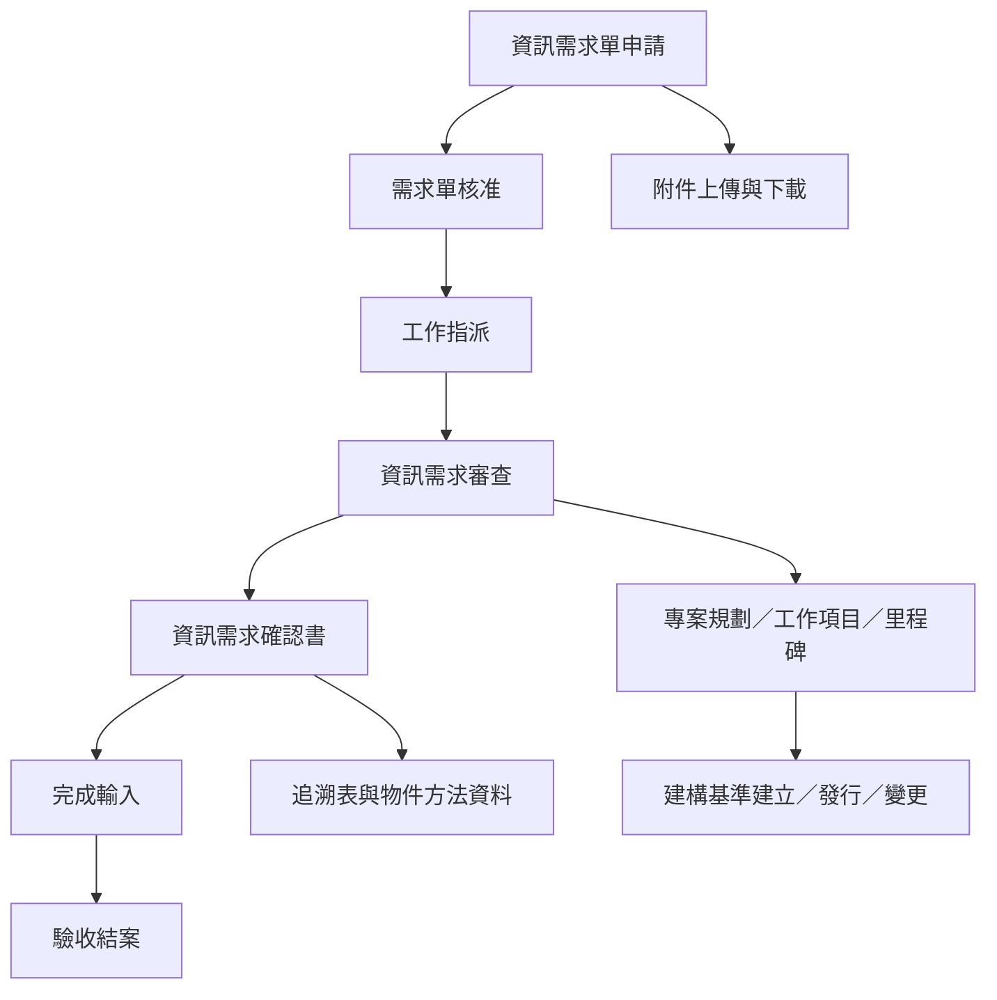

# ZM 資訊需求與專案建構管理功能規格手冊

## 1.系統概述

### 1.1 系統定位

ZM 模組為傳統 ERP Web 子系統，依 `config/yl/zm/zmStructs.xml` 所定義之頁面、Controller、Action 與 VO 對應關係執行。從現有程式與資料表命名判斷，本模組主要支援資訊需求單生命週期、資訊需求審查與確認、專案規劃、CMMI 文件維護、建構基準管理、追溯資料、物件方法資料與上傳文件管理。

本手冊依現有 `JSP`、`Controller`、`VO／DAO` 與 `dao/*.dao` 定義整理，作為功能盤點、系統維護與後續補規格之基礎。欄位級商業規則、角色權限矩陣與簽核條件如未能由程式名稱或 XML 設定直接確認，本文以保守方式描述，正式上線或異動前仍需搭配資料庫 schema、實際畫面與使用單位流程確認。

### 1.2 主要功能範圍

1. CMMI 文件管理：維護 CMMI 流程領域文件、基本文件及查詢作業。
2. 資訊需求管理：支援需求單申請、核准、工作指派、審查、確認、完成輸入、驗收結案與記錄／考核維護。
3. 專案規劃管理：維護專案基本資料、專案相關人員、工作項目、工作項目相依性、需求權重與工時估算。
4. 專案里程碑審查：分開支援開發專案與維護專案里程碑審查資料維護，並與 MA 資訊需求系統進度檔作業銜接。
5. 建構基準與 CM 管理：維護建構項目、建構基準主檔／版本、建立／發行／變更申請、通知對象、影響評估與文件下載。
6. 追溯與物件方法管理：維護水平／垂直追溯表、物件方法、方法說明、使用資料表對照、其他物件方法對照與順序。
7. 文件與附件管理：支援 REQM 上傳文件、上傳檔案下載與刪除，並引用共用登錄物件與資訊登錄資料。
8. 系統輔助：提供序號控制、工作訊息、權限設定、選單／代碼選項、報表與批次執行等共用能力。

### 1.3 使用者與角色概念

程式內可見流程涵蓋需求申請者、需求單位、資訊單位、審查／核准人員、工作指派人員、專案或工作項目負責人、建構基準申請與審核人員等角色概念。實際權限來源需再對照 ERP 共用權限、`zmjcAuth`、`zmjcCommon`、DW 工作訊息及登入人員資料。

### 1.4 文件依據

本手冊主要依據下列檔案整理：

- `config/yl/zm/zmStructs.xml`：頁面、Controller、Action、VO 對應設定。
- `jsp/*.jsp`：前端作業畫面與查詢／編輯／清單頁。
- `src/com/icsc/zm/*.java`：功能 Controller、共用工具、批次與上傳處理。
- `src/com/icsc/zm/dao/*DAO.java`、`src/com/icsc/zm/dao/*VO.java`：資料存取與資料物件。
- `dao/*.dao`：資料表定義來源之一。

## 2.系統架構總覽

### 2.1 架構型態

ZM 模組採用傳統 Java Servlet／JSP 架構，透過 DPMS 功能控制器處理畫面請求。典型執行鏈如下：

### 2.2 分層說明

| 層級 | 主要元件 | 說明 |
|---|---|---|
| 畫面層 | `jsp/zmjj*.jsp`、`html/app/zmwh001.html` | 提供查詢、清單、編輯、Popup、申請編號與下載等操作介面。 |
| 設定映射層 | `config/yl/zm/zmStructs.xml` | 定義 `pageID`、JSP 路徑、Controller、Action flag、method 與 VO converter。 |
| 控制層 | `src/com/icsc/zm/*CR.java` | 依 Action 執行查詢、新增、修改、刪除、送出、核准、退回、完成、結案、產製、部署等作業。 |
| 共用邏輯層 | `zmjcCommon`、`zmjcDwMsg`、`zmjcsn`、`zmjc328`、`zmjcRptUtilPro` | 提供代碼選單、權限／資料檢核、ERP 工作訊息、序號、檔案上傳、報表及批次相關處理。 |
| 資料存取層 | `src/com/icsc/zm/dao/*DAO.java` | 對應資料表執行 `query`、`create`、`update`、`remove`、`queryData` 等資料操作。 |
| 資料物件層 | `src/com/icsc/zm/dao/*VO.java` | 承載畫面與資料庫之間的資料，並配合 converter 回填至畫面。 |
| 資料層 | `db.tbzm*`、`db.tbzmg020`、`db.tbzmdrdc3`、`db.tbdab2`、`db.tbdsmf` | 保存需求、專案、CMMI、建構基準、追溯、物件方法、附件與共用登錄資料。 |

### 2.3 Action flag 對照

| Flag | Method | 功能意義 |
|---|---|---|
| `I` | `query` | 查詢或載入資料。 |
| `N` | `create` | 新增資料。 |
| `R` | `update` | 修改／更新資料。 |
| `D` | `delete`／`remove`／`deploy` | 刪除資料；在建構基準主檔作業中 `D` 對應 `deploy`，代表部署相關動作。 |
| `S` | `send`／`sendOut` | 送出申請或送出流程。 |
| `C` | `check`／`copy`／`calcManHour`／`cancle` | 視作業而定，可能為檢核、複製、工時計算或取消。 |
| `A` | `agree` | 同意／核准建構基準申請。 |
| `CL` | `cancel` | 取消申請。 |
| `CI`／`CO` | `checkIn`／`checkOut` | 建構基準版本簽入／簽出。 |
| `AC` | `accept` | 接受需求或工作。 |
| `CS`／`SS`／`RS` | `sendOut`／`reSendOut` | 送出或重新送出需求流程。 |
| `RT`／`RF` | `rtnUser`／`rtnFree` | 退回使用者或退回自由狀態。 |
| `OF`／`FF` | `origFinish`／`finalFinish` | 原始完成／最終完成確認。 |
| `SD`／`RC` | `sendReqDept`／`reqConfirm` | 送需求單位與需求確認。 |
| `ULA` | `uploadAdd` | 附件上傳新增。 |
| `P` | `produce` | 產製專案工作項目或相關資料。 |
| `findPre`／`findNext` | `findPre`／`findNext` | 前後筆資料瀏覽。 |

### 2.4 主要流程概觀

### 2.5 主要資料表

| 資料表 | VO／DAO | 功能定位 | 主要用途 | 關聯功能 |
|---|---|---|---|---|
| `db.tbzm010` | `zmjc010VO`／`zmjc010DAO` | CMMI 流程領域文件 | 維護 CMMI 作業程序文件資料。 | CMMI流程領域文件維護、CMMI流程領域文件查詢。 |
| `db.tbzm020` | `zmjc020VO`／`zmjc020DAO` | CMMI 基本文件 | 維護 CMMI 基本文件清單或基本屬性。 | CMMI基本文件維護。 |
| `db.tbzm100` | `zmjc100VO`／`zmjc100DAO` | 資訊需求基本檔 | 保存需求單主檔，支援申請、核准、指派、審查、確認、完成與結案流程。 | 資訊需求單申請、核准、工作指派、審查、確認、完成輸入、驗收結案、資訊單位維護。 |
| `db.tbzm100App` | `zmjc100AppVO`／`zmjc100AppDAO` | 資訊需求基本檔延伸 | 作為需求主檔之應用或查詢延伸資料。 | 需求單查詢與需求流程輔助；實際畫面需再確認。 |
| `db.tbzm101` | `zmjc101VO`／`zmjc101DAO` | 資訊需求明細檔 | 保存需求工作指派明細。 | 資訊需求單工作指派明細維護。 |
| `db.tbzm105` | `zmjc105VO`／`zmjc105DAO` | 資訊需求記錄檔 | 保存需求單處理記錄或歷程。 | 需求單記錄查詢、需求單記錄維護。 |
| `db.tbzm106` | `zmjc106VO`／`zmjc106DAO` | 資訊需求考核明細檔 | 保存需求考核資料。 | 需求考核維護。 |
| `db.tbzm110` | `zmjc110VO`／`zmjc110DAO` | 資訊需求審查表 | 保存審查表資料。 | 資訊需求審查表維護。 |
| `db.tbzm120` | `zmjc120VO`／`zmjc120DAO` | 資訊需求確認書 | 保存確認書資料，支援需求單位與資訊單位查詢／維護。 | 資訊需求確認書查詢、確認書維護、工時計算。 |
| `db.tbzm125` | `zmjc125VO`／`zmjc125DAO` | 確認書相關人員設定 | 保存確認書相關人員。 | 確認書相關人員維護。 |
| `db.tbzm130` | `zmjc130VO`／`zmjc130DAO` | 需求數工時統計檔 | 保存需求數與工時估算／統計資料。 | 需求數工時估算、確認書工時計算。 |
| `db.tbzm140` | `zmjc140VO`／`zmjc140DAO` | 需求異動程式明細檔 | 保存需求完成或異動時涉及之程式明細。 | 需求程式異動明細、資訊需求單完成輸入。 |
| `db.tbzm150` | `zmjc150VO`／`zmjc150DAO` | 追溯表基本資料檔 | 保存水平／垂直追溯表主檔。 | 水平／垂直追溯表主檔維護。 |
| `db.tbzm151` | `zmjc151VO`／`zmjc151DAO` | 水平追溯表明細資料檔 | 保存水平追溯項目明細。 | 水平追溯表明細維護。 |
| `db.tbzm152` | `zmjc152VO`／`zmjc152DAO` | 垂直追溯表明細資料檔 | 保存垂直追溯項目明細。 | 垂直追溯表明細維護。 |
| `db.tbzm160` | `zmjc160VO`／`zmjc160DAO` | 物件方法檔 | 保存物件方法主檔與順序資料。 | 物件方法主檔維護、物件方法順序維護。 |
| `db.tbzm161` | `zmjc161VO`／`zmjc161DAO` | 物件方法說明明細檔 | 保存物件方法說明明細。 | 物件方法說明明細維護。 |
| `db.tbzm162` | `zmjc162VO`／`zmjc162DAO` | 物件方法使用 Table 對照檔 | 保存物件方法與資料表之對照。 | 物件方法與 Table 對照維護。 |
| `db.tbzm163` | `zmjc163VO`／`zmjc163DAO` | 物件方法與其他物件對照檔 | 保存物件方法間關聯。 | 物件方法與其他物件方法對照維護。 |
| `db.tbzm200` | `zmjc200VO`／`zmjc200DAO` | 專案相關人員檔 | 保存專案人員設定。 | 專案相關人員維護、專案資料複製。 |
| `db.tbzm201` | `zmjc201VO`／`zmjc201DAO` | 工作項目相依性基本檔 | 保存工作項目基本資料或相依性設定。 | 工作項目基本資料維護。 |
| `db.tbzm210` | `zmjc210VO`／`zmjc210DAO` | 專案規劃基本資料檔 | 保存專案規劃主檔。 | 專案基本資料維護、專案資料產製。 |
| `db.tbzm211` | `zmjc211VO`／`zmjc211DAO` | 專案工作項目產製設定檔 | 保存專案工作項目產製或設定資料。 | 專案工作項目設定。 |
| `db.tbzm215` | `zmjc215VO`／`zmjc215DAO` | 專案工作項目明細檔 | 保存工作項目明細，支援前後筆瀏覽。 | 工作項目明細資料維護。 |
| `db.tbzm220` | `zmjc220VO`／`zmjc220DAO` | 需求權重評估準則檔 | 保存需求權重評估準則。 | 需求權重評估準則維護。 |
| `db.tbzm225` | `zmjc225VO`／`zmjc225DAO` | 需求權重工時對照檔 | 保存權重與工時之對照資料。 | 需求權重工時對照檔維護、工時估算。 |
| `db.tbzm310` | `zmjc310VO`／`zmjc310DAO` | 開發專案里程碑審查檔 | 保存開發專案里程碑審查資料。 | 開發專案里程碑審查維護。 |
| `db.tbzm320` | `zmjc320VO`／`zmjc320DAO` | 維護專案里程碑審查檔 | 保存維護專案里程碑審查資料，亦供 MA 進度檔作業查詢更新。 | 維護專案里程碑審查、MA資訊需求系統進度檔。 |
| `db.tbzm700` | `zmjc700VO`／`zmjc700DAO` | 建構項目基本檔 | 保存建構項目資料。 | 建構項目基本檔維護。 |
| `db.tbzm710` | `zmjc710VO`／`zmjc710DAO` | 建構基準主檔 | 保存建構基準主檔，支援簽入、簽出與部署。 | 建構基準主檔、CM建構文件下載。 |
| `db.tbzm720` | `zmjc720VO`／`zmjc720DAO` | 建構基準明細檔（版本） | 保存建構基準版本明細。 | 建構基準明細檔（版本）維護。 |
| `db.tbzm730` | `zmjc730VO`／`zmjc730DAO` | 基準發行通知對象 | 保存建構基準相關通知對象。 | 建構基準通知對象維護、發行／變更通知。 |
| `db.tbzm735` | `zmjc735VO`／`zmjc735DAO` | 專案通知對象 | 保存專案通知對象資料。 | 專案通知；實際畫面映射需再確認。 |
| `db.tbzm740` | `zmjc740VO`／`zmjc740DAO` | 建構基準申請檔 | 保存建構基準建立、發行、變更申請主檔。 | 建構基準建立申請、發行申請、變更申請、核准／取消。 |
| `db.tbzm750` | `zmjc750VO`／`zmjc750DAO` | 基準變更影響評估 | 保存建構基準變更明細與影響評估資料。 | 建構基準變更明細維護。 |
| `db.tbzm0100` | `zmjc0100VO`／`zmjc0100DAO` | 上傳檔案下線維護 | 保存上傳檔案下線、下載或刪除管理資料。 | 上傳檔案下載執行作業。 |
| `db.tbzmdrdc3` | `zmjcdrdc3VO`／`zmjcdrdc3DAO` | REQM 上傳文件維護檔 | 保存需求相關上傳文件資料。 | 需求單附件上傳、確認書附件、上傳文件維護。 |
| `db.tbzmg020` | `zmjcg020VO`／`zmjcg020DAO` | 序號控制檔 | 保存系統、資料表、欄位與年月日序號控制。 | 需求單號、文件編號或其他流水號產生。 |
| `db.tbdab2` | `dajcb2VO`／`dajcb2DAO`、`zmjcdab2VO`／`zmjcdab2DAO` | 登錄物件主檔 | 保存登錄物件基本資料。 | 垂直追溯、物件方法主檔、物件方法關聯。 |
| `db.tbdsmf` | `dsjcmfVO`／`dsjcmfDAO` | 資訊登錄基本資料 | 保存資訊登錄基本設定資料。 | 系統共用查詢或登錄資料引用；實際畫面需再確認。 |

## 3.功能模組詳細說明

### 3.1 CMMI 文件管理

#### 3.1.1 功能定位

提供 CMMI 流程領域文件與基本文件維護、查詢功能，作為需求與專案管理流程中的文件依據。

#### 3.1.2 作業對照

| 作業名稱 | Page ID | Controller | 主要 Action | 主要 VO |
|---|---|---|---|---|
| CMMI流程領域文件維護作業 | `zmjj0101Edit` | `zmjc01CR` | `query`、`create`、`update`、`delete`、`send`、`check` | `zmjc010VO` |
| CMMI流程領域文件查詢作業 | `zmjj0201List` | `zmjc02CR` | `query` | `zmjc010VO` |
| CMMI基本文件維護作業 | `zmjj0301List` | `zmjc03CR` | `query`、`create`、`update`、`delete` | `zmjc020VO` |

#### 3.1.3 處理重點

- 流程領域文件維護支援新增、修改、刪除、送出與檢核。
- 查詢作業以 `zmjc010VO` 序列回傳文件清單。
- 基本文件維護以 `zmjc020VO` 清單方式處理，支援批次新增／修改／刪除型態。

### 3.2 資訊需求單生命週期管理

#### 3.2.1 功能定位

管理資訊需求從申請、核准、指派、審查、確認、完成到驗收結案的主要流程，核心主檔為 `db.tbzm100`。

#### 3.2.2 作業對照

| 作業名稱 | Page ID | Controller | 主要 Action | 主要 VO |
|---|---|---|---|---|
| 資訊需求單申請維護 | `zmjjreq0101Edit` | `zmjcreq01CR` | `query`、`create`、`update`、`delete`、`sendOut` | `zmjc100VO` |
| 資訊需求單核准維護 | `zmjjreq0201Edit` | `zmjcreq02CR` | `query`、`rtnUser`、`sendToA3`、`sendOut` | `zmjc100VO` |
| 資訊需求單工作指派維護 | `zmjjreq0301Edit` | `zmjcreq03CR` | `query`、`accept`、`sendOut`、`reSendOut`、`rtnUser` | `zmjc100VO` |
| 資訊需求單工作指派明細 | `zmjjreq0302List` | `zmjcreq032CR` | `query`、`create`、`update`、`delete` | `zmjc101VO` |
| 資訊需求審查表維護 | `zmjjreq1101Edit` | `zmjcreq11CR` | `query`、`accept`、`sendOut`、`changeType`、`rtnUser`、`reSendOut`、`workSign`、`rtnFree`、`sendManage`、`reDispatch` | `zmjc100VO` |
| 資訊需求審查表明細 | `zmjjreq1102Edit` | `zmjcreq112CR` | `query`、`create`、`update`、`delete` | `zmjc110VO` |
| 資訊需求確認書查詢 | `zmjjreq0102Edit`、`zmjjreq1103Edit`、`zmjjreq1302Edit` | `zmjcreq012CR`、`zmjcreq113CR`、`zmjcreq132CR` | `query`、部分維護頁支援 `create`、`update`、`delete` | `zmjc120VO` |
| 資訊需求確認書維護 | `zmjjreq1201Edit` | `zmjcreq12CR` | `query`、`origFinish`、`finalFinish`、`sendReqDept`、`reqConfirm`、`uploadAdd` | `zmjc100VO` |
| 資訊需求確認書明細維護 | `zmjjreq1202Edit` | `zmjcreq122CR` | `query`、`create`、`update`、`calcManHour` | `zmjc120VO` |
| 確認書相關人員維護 | `zmjjreq1203List` | `zmjcreq123CR` | `query`、`create`、`update`、`delete` | `zmjc125VO` |
| 資訊需求單完成輸入 | `zmjjreq0401Edit` | `zmjcreq04CR` | `query`、`reMark`、`doFinish`、`interrupt` | `zmjc100VO` |
| 資訊需求單驗收結案 | `zmjjreq0501Edit` | `zmjcreq05CR` | `query`、`doClose`、`reProduce` | `zmjc100VO` |

#### 3.2.3 流程說明

1. 需求申請者於資訊需求單申請維護建立或修改需求資料，送出後進入後續核准流程。
2. 核准維護可將需求退回使用者，或送往下一階段。
3. 工作指派作業接受需求、指派工作，必要時可重新送出或退回。
4. 審查作業提供需求接受、送出、變更類型、退回、會簽、轉管理、重新指派等處理。
5. 確認書作業支援需求確認、送需求單位、原始完成、最終完成與附件上傳。
6. 完成輸入支援完成註記、完成執行與中斷。
7. 驗收結案支援需求結案及重新產製。

### 3.3 資訊需求記錄、考核與資訊單位維護

#### 3.3.1 功能定位

管理需求單記錄、需求考核與資訊單位側需求資料補充維護，用於流程追蹤、品質考核與後續管理。

#### 3.3.2 作業對照

| 作業名稱 | Page ID | Controller | 主要 Action | 主要 VO |
|---|---|---|---|---|
| 需求單記錄查詢作業 | `zmjjreq0103List` | `zmjcreq013CR` | `query` | `zmjc105VO` |
| 需求單記錄維護作業 | `zmjjreq1303List` | `zmjcreq133CR` | `query`、`create`、`update`、`delete` | `zmjc105VO` |
| 需求考核維護作業 | `zmjjreq1304List` | `zmjcreq134CR` | `query`、`create`、`update`、`delete` | `zmjc106VO` |
| 資訊需求單申請維護（資訊單位維護） | `zmjjreq1301Edit` | `zmjcreq13CR` | `query`、`update`、`uploadAdd` | `zmjc100VO` |

#### 3.3.3 處理重點

- 需求記錄分查詢與維護兩類作業，對應同一需求記錄資料表。
- 考核作業獨立保存明細，通常用於需求處理品質或績效評估。
- 資訊單位維護頁面可補充需求主檔資料並新增附件。

### 3.4 專案規劃與工作項目管理

#### 3.4.1 功能定位

支援需求衍生專案或工作項目後的規劃資料、人員設定、工作項目設定、需求權重與工時估算。

#### 3.4.2 作業對照

| 作業名稱 | Page ID | Controller | 主要 Action | 主要 VO |
|---|---|---|---|---|
| 專案相關人員維護作業 | `zmjjpp0101List` | `zmjcpp01CR` | `query`、`create`、`update`、`delete`、`copy` | `zmjc200VO` |
| 工作項目基本資料維護作業 | `zmjjpp0201List` | `zmjcpp02CR` | `query`、`create`、`update`、`delete` | `zmjc201VO` |
| 專案基本資料維護 | `zmjjpp0301Edit` | `zmjcpp03CR` | `query`、`create`、`update`、`delete`、`produce` | `zmjc210VO` |
| 專案工作項目設定作業 | `zmjjpp0302List` | `zmjcpp032CR` | `query`、`queryQ`、`create`、`update`、`delete` | `zmjc211VO` |
| 工作項目明細資料維護 | `zmjjpp0401Edit` | `zmjcpp04CR` | `query`、`create`、`update`、`delete`、`findPre`、`findNext` | `zmjc215VO` |
| 需求權重評估準則資料維護作業 | `zmjjpp0501List` | `zmjcpp05CR` | `query`、`create`、`update`、`delete` | `zmjc220VO` |
| 需求權重工時對照檔維護作業 | `zmjjpp0601List` | `zmjcpp06CR` | `query`、`create`、`update`、`delete` | `zmjc225VO` |
| 需求數工時估算維護 | `zmjjpp0701Edit` | `zmjcpp07CR` | `query`、`create`、`update`、`delete`、`calcManHour` | `zmjc130VO` |

#### 3.4.3 處理重點

- 專案基本資料可執行 `produce`，推測用於產製專案工作項目或初始化相關設定。
- 工作項目明細支援前後筆瀏覽，適合逐筆檢視或維護。
- 工時估算依需求權重準則與工時對照資料計算，實際公式需由程式與使用規則進一步確認。

### 3.5 專案里程碑與進度管理

#### 3.5.1 功能定位

提供開發專案、維護專案里程碑審查資料維護，並提供 MA 資訊需求系統進度檔查詢／更新。

#### 3.5.2 作業對照

| 作業名稱 | Page ID | Controller | 主要 Action | 主要 VO |
|---|---|---|---|---|
| 開發專案里程碑審查維護作業 | `zmjjpmc0201List` | `zmjcpmc02CR` | `query`、`create`、`update`、`delete` | `zmjc310VO` |
| 維護專案里程碑審查維護作業 | `zmjjpmc0301List` | `zmjcpmc03CR` | `query`、`create`、`update`、`delete` | `zmjc320VO` |
| MA資訊需求系統進度檔作業 | `zmjjma0101Edit` | `zmjcma01CR` | `query`、`update` | `zmjc320VO` |

#### 3.5.3 處理重點

- 開發與維護專案里程碑分別使用 `tbzm310`、`tbzm320`。
- MA 進度檔作業引用 `zmjc320VO`，偏向維護專案進度資料的查詢與更新。

### 3.6 建構基準與 CM 管理

#### 3.6.1 功能定位

管理 CM 建構項目、建構基準主檔、版本明細、建立／發行／變更申請、通知對象、變更影響評估與建構文件下載。

#### 3.6.2 作業對照

| 作業名稱 | Page ID | Controller | 主要 Action | 主要 VO |
|---|---|---|---|---|
| 建構項目基本檔作業 | `zmjjcm0101List` | `zmjccm01CR` | `query`、`create`、`update`、`delete` | `zmjc700VO` |
| 建構基準主檔作業 | `zmjjcm0201Edit` | `zmjccm02CR` | `query`、`create`、`update`、`deploy`、`checkIn`、`checkOut`、`cancle` | `zmjc710VO` |
| 建構基準明細檔（版本） | `zmjjcm0202Edit` | `zmjccm021CR` | `query`、`create`、`update`、`delete` | `zmjc720VO` |
| 建構基準通知對象維護 | `zmjjcm0203List`、`zmjjcm0402List` | `zmjccm022CR`、`zmjccm042CR` | `query`、`create`、`update`、`delete` | `zmjc730VO` |
| 建構基準建立申請作業 | `zmjjcm0301Edit` | `zmjccm03CR` | `query`、`create`、`update`、`delete`、`send`、`check`、`cancel`、`agree` | `zmjc740VO` |
| 建構基準發行申請作業 | `zmjjcm0401Edit` | `zmjccm04CR` | `query`、`create`、`update`、`delete`、`send`、`check`、`cancel`、`agree` | `zmjc740VO` |
| 建構基準變更申請作業 | `zmjjcm0501Edit` | `zmjccm05CR` | `query`、`create`、`update`、`delete`、`send`、`check`、`cancel`、`agree` | `zmjc740VO` |
| 建構基準變更明細維護 | `zmjjcm0502Edit` | `zmjccm052CR` | `query`、`create`、`update`、`delete` | `zmjc750VO` |
| CM建構文件下載作業 | `zmjjcm0601List` | `zmjccm06CR` | `query` | `zmjc710VO` |
| 建構基準清單查詢 | `zmjjcm1001List` | `zmjccm10CR` | `query` | `zmjc710VO` |

#### 3.6.3 處理重點

- 建構基準主檔提供簽入、簽出與部署處理，是 CM 作業核心。
- 建立、發行、變更申請共用 `tbzm740`，以不同作業與 Controller 區分流程。
- 變更明細／影響評估使用 `tbzm750`。
- 發行與變更通知對象使用 `tbzm730`，專案通知對象另有 `tbzm735`，實際使用點需再補畫面或程式呼叫鏈確認。

### 3.7 追溯表與物件方法管理

#### 3.7.1 功能定位

支援資訊需求、確認書、物件方法或程式設計資料之追溯與關聯維護，便於追蹤需求到設計／物件／資料表之關係。

#### 3.7.2 作業對照

| 作業名稱 | Page ID | Controller | 主要 Action | 主要 VO |
|---|---|---|---|---|
| 水平／垂直追溯表主檔維護 | `zmjjreq1501Edit` | `zmjcreq1501CR` | `query`、`create`、`update`、`delete` | `zmjc150VO` |
| 水平追溯表明細檔維護 | `zmjjreq1502Edit` | `zmjcreq1502CR` | `query`、`create`、`update`、`delete` | `zmjc151VO`、`zmjc150VO` |
| 垂直追溯表明細檔維護 | `zmjjreq1503Edit` | `zmjcreq1503CR` | `query`、`create`、`update`、`delete` | `zmjc152VO`、`zmjcdab2VO` |
| 物件方法主檔維護 | `zmjjreq1601Edit` | `zmjcreq1601CR` | `query`、`create`、`update`、`delete` | `zmjc160VO`、`zmjcdab2VO` |
| 物件方法說明明細檔維護 | `zmjjreq1602Edit` | `zmjcreq1602CR` | `query`、`create`、`update`、`delete` | `zmjc161VO` |
| 物件方法與 Table 對照維護 | `zmjjreq1603Edit` | `zmjcreq1603CR` | `query`、`create`、`update`、`delete` | `zmjc162VO`、`zpjc100aVO` |
| 物件方法與其他物件方法對照維護 | `zmjjreq1604Edit` | `zmjcreq1604CR` | `query`、`create`、`update`、`delete` | `zmjc163VO` |
| 物件方法順序維護 | `zmjjreq1701Edit` | `zmjcreq1701CR` | `query`、`update` | `zmjc160VO` |

#### 3.7.3 處理重點

- 追溯表分主檔、水平明細與垂直明細。
- 垂直追溯與物件方法主檔會引用登錄物件主檔 `tbdab2`。
- 物件方法與 Table 對照作業引用外部 `zp.dao.zpjc100aVO`，表示可能需要跨 ZP 模組取得資料表或程式物件相關資料。

### 3.8 上傳文件、下載與附件管理

#### 3.8.1 功能定位

提供需求文件附件、上傳文件維護、下載與刪除功能，支援需求流程與確認書作業附檔。

#### 3.8.2 作業與元件對照

| 作業／元件 | 類型 | 主要用途 |
|---|---|---|
| `zmjjUpload0101List`／`zmjcUpload01CR` | 上傳檔案下載執行作業 | 查詢與刪除上傳檔案下線維護資料。 |
| `zmjcreq328` | 需求附件工具 | 支援需求單附件上傳、刪除與批次刪除。 |
| `zmjc328`、`zmjc328FileUpload` | 共用上傳工具 | 處理 SmartUpload 與磁碟上傳。 |
| `zmjcdrdc3DAO`／`zmjcdrdc3VO` | REQM 上傳文件資料存取 | 保存需求相關上傳文件基本資料。 |
| `zmjc0100DAO`／`zmjc0100VO` | 上傳檔案下線維護資料存取 | 保存檔案下線、下載與刪除管理資料。 |

#### 3.8.3 處理重點

- 需求單申請、確認書與資訊單位維護可見附件新增動作。
- 刪除檔案時需同時注意資料表記錄與實體檔案是否一致。
- 檔案大小、儲存路徑、權限控管需再對照實際環境設定確認。

### 3.9 共用服務與批次／報表

#### 3.9.1 共用服務

| 元件 | 功能定位 | 主要用途 |
|---|---|---|
| `zmjcCommon` | ZM 共用工具 | 提供代碼選項、選單、專案相依資料、關帳判斷、主管取得、錯誤訊息與欄位描述等共用方法。 |
| `zmjcDwMsg` | ERP 工作訊息 | 建立、完成或拋送 DW 工作訊息與 URL。 |
| `zmjcsn` | 序號工具 | 依 `tbzmg020` 產生與更新系統序號。 |
| `zmjcAuth` | 權限工具 | 設定作業權限。 |
| `zmjcSetting` | 常數與訊息設定 | 保存新增、修改、刪除、查詢、列印、上傳等動作常數與訊息。 |
| `zmjcRptUtilPro` | 報表工具 | 支援報表產製及目錄檔案處理。 |

#### 3.9.2 批次／背景元件

| 元件 | 功能定位 | 主要用途 |
|---|---|---|
| `zmjcAutoGenZm100` | 自動產生需求資料 | 具 `run` 方法，推測用於批次產生或同步 `tbzm100` 需求資料；實際排程需再確認。 |
| `zmjcCMMIWeekInfo` | CMMI 週資訊 | 具 `run` 方法，推測用於 CMMI 週資訊查詢或產製。 |
| `zmjcZMR00100` | 報表／郵件處理 | 實作 `diji234`，含報表產生與寄送處理。 |

### 3.10 頁面、Controller、Action 總表

| 作業名稱 | Page ID | Controller | Action | VO |
|---|---|---|---|---|
| CMMI流程領域文件維護作業 | `zmjj0101Edit` | `zmjc01CR` | `I:query`、`N:create`、`R:update`、`D:delete`、`S:send`、`C:check` | `zmjc010VO` |
| CMMI流程領域文件查詢作業 | `zmjj0201List` | `zmjc02CR` | `I:query` | `zmjc010VO` |
| CMMI基本文件維護作業 | `zmjj0301List` | `zmjc03CR` | `I:query`、`N:create`、`R:update`、`D:delete` | `zmjc020VO` |
| 建構項目基本檔作業 | `zmjjcm0101List` | `zmjccm01CR` | `I:query`、`N:create`、`R:update`、`D:delete` | `zmjc700VO` |
| 建構基準主檔作業 | `zmjjcm0201Edit` | `zmjccm02CR` | `I:query`、`N:create`、`R:update`、`D:deploy`、`CI:checkIn`、`CO:checkOut`、`C:cancle` | `zmjc710VO` |
| 建構基準明細檔（版本） | `zmjjcm0202Edit` | `zmjccm021CR` | `I:query`、`N:create`、`R:update`、`D:delete` | `zmjc720VO` |
| 通知對象維護 | `zmjjcm0203List` | `zmjccm022CR` | `I:query`、`N:create`、`R:update`、`D:delete` | `zmjc730VO` |
| 建構基準建立申請作業 | `zmjjcm0301Edit` | `zmjccm03CR` | `I:query`、`N:create`、`R:update`、`D:delete`、`S:send`、`C:check`、`CL:cancel`、`A:agree` | `zmjc740VO` |
| 建構基準發行申請作業 | `zmjjcm0401Edit` | `zmjccm04CR` | `I:query`、`N:create`、`R:update`、`D:delete`、`S:send`、`C:check`、`CL:cancel`、`A:agree` | `zmjc740VO` |
| 通知對象維護 | `zmjjcm0402List` | `zmjccm042CR` | `I:query`、`N:create`、`R:update`、`D:delete` | `zmjc730VO` |
| 建構基準變更申請作業 | `zmjjcm0501Edit` | `zmjccm05CR` | `I:query`、`N:create`、`R:update`、`D:delete`、`S:send`、`C:check`、`CL:cancel`、`A:agree` | `zmjc740VO` |
| 建構基準變更明細維護 | `zmjjcm0502Edit` | `zmjccm052CR` | `I:query`、`N:create`、`R:update`、`D:delete` | `zmjc750VO` |
| CM建構文件下載作業 | `zmjjcm0601List` | `zmjccm06CR` | `I:query` | `zmjc710VO` |
| 建構基準查詢作業 | `zmjjcm1001List` | `zmjccm10CR` | `I:query` | `zmjc710VO` |
| 專案相關人員維護作業 | `zmjjpp0101List` | `zmjcpp01CR` | `I:query`、`N:create`、`R:update`、`D:delete`、`C:copy` | `zmjc200VO` |
| 工作項目基本資料維護作業 | `zmjjpp0201List` | `zmjcpp02CR` | `I:query`、`N:create`、`R:update`、`D:delete` | `zmjc201VO` |
| 專案基本資料維護 | `zmjjpp0301Edit` | `zmjcpp03CR` | `I:query`、`N:create`、`R:update`、`D:delete`、`P:produce` | `zmjc210VO` |
| 專案工作項目設定作業 | `zmjjpp0302List` | `zmjcpp032CR` | `I:query`、`IQ:queryQ`、`N:create`、`R:update`、`D:delete` | `zmjc211VO` |
| 工作項目明細資料維護 | `zmjjpp0401Edit` | `zmjcpp04CR` | `I:query`、`N:create`、`R:update`、`D:delete`、`findPre:findPre`、`findNext:findNext` | `zmjc215VO` |
| 需求權重評估準則資料維護作業 | `zmjjpp0501List` | `zmjcpp05CR` | `I:query`、`N:create`、`R:update`、`D:delete` | `zmjc220VO` |
| 需求權重工時對照檔維護作業 | `zmjjpp0601List` | `zmjcpp06CR` | `I:query`、`N:create`、`R:update`、`D:delete` | `zmjc225VO` |
| 需求數工時估算維護 | `zmjjpp0701Edit` | `zmjcpp07CR` | `I:query`、`N:create`、`R:update`、`D:delete`、`C:calcManHour` | `zmjc130VO` |
| 資訊需求單申請維護 | `zmjjreq0101Edit` | `zmjcreq01CR` | `I:query`、`N:create`、`R:update`、`D:delete`、`S:sendOut` | `zmjc100VO` |
| 資訊需求確認書查詢（需求單位查詢） | `zmjjreq0102Edit` | `zmjcreq012CR` | `I:query` | `zmjc120VO` |
| 需求單記錄查詢作業 | `zmjjreq0103List` | `zmjcreq013CR` | `I:query` | `zmjc105VO` |
| 資訊需求單核准維護 | `zmjjreq0201Edit` | `zmjcreq02CR` | `I:query`、`RT:rtnUser`、`A3:sendToA3`、`SS:sendOut` | `zmjc100VO` |
| 資訊需求單工作指派維護 | `zmjjreq0301Edit` | `zmjcreq03CR` | `I:query`、`AC:accept`、`CS:sendOut`、`RS:reSendOut`、`RT:rtnUser` | `zmjc100VO` |
| 資訊需求單工作指派明細 | `zmjjreq0302List` | `zmjcreq032CR` | `I:query`、`N:create`、`R:update`、`D:delete` | `zmjc101VO` |
| 資訊需求審查表維護 | `zmjjreq1101Edit` | `zmjcreq11CR` | `I:query`、`AC:accept`、`CS:sendOut`、`CT:changeType`、`RT:rtnUser`、`RS:reSendOut`、`WS:workSign`、`RF:rtnFree`、`SM:sendManage`、`RD:reDispatch` | `zmjc100VO` |
| 資訊需求審查表明細 | `zmjjreq1102Edit` | `zmjcreq112CR` | `I:query`、`N:create`、`R:update`、`D:delete` | `zmjc110VO` |
| 資訊需求確認書查詢 | `zmjjreq1103Edit` | `zmjcreq113CR` | `I:query`、`N:create`、`R:update`、`D:delete` | `zmjc120VO` |
| 資訊需求確認書維護 | `zmjjreq1201Edit` | `zmjcreq12CR` | `I:query`、`OF:origFinish`、`FF:finalFinish`、`SD:sendReqDept`、`RC:reqConfirm`、`ULA:uploadAdd` | `zmjc100VO` |
| 資訊需求確認書明細維護 | `zmjjreq1202Edit` | `zmjcreq122CR` | `I:query`、`N:create`、`R:update`、`C:calcManHour` | `zmjc120VO` |
| 確認書相關人員維護作業 | `zmjjreq1203List` | `zmjcreq123CR` | `I:query`、`N:create`、`R:update`、`D:delete` | `zmjc125VO` |
| 資訊需求單申請維護（資訊單位維護） | `zmjjreq1301Edit` | `zmjcreq13CR` | `I:query`、`R:update`、`ULA:uploadAdd` | `zmjc100VO` |
| 資訊需求確認書查詢（資訊單位維護） | `zmjjreq1302Edit` | `zmjcreq132CR` | `I:query`、`N:create`、`R:update`、`D:delete` | `zmjc120VO` |
| 需求單記錄維護作業 | `zmjjreq1303List` | `zmjcreq133CR` | `I:query`、`N:create`、`R:update`、`D:delete` | `zmjc105VO` |
| 需求考核維護作業 | `zmjjreq1304List` | `zmjcreq134CR` | `I:query`、`N:create`、`R:update`、`D:delete` | `zmjc106VO` |
| 資訊需求單完成輸入 | `zmjjreq0401Edit` | `zmjcreq04CR` | `I:query`、`RM:reMark`、`DF:doFinish`、`IR:interrupt` | `zmjc100VO` |
| 需求程式異動明細檔 | `zmjjreq0402Edit` | `zmjcreq042CR` | `I:query`、`N:create`、`R:update`、`D:delete` | `zmjc140VO` |
| 資訊需求單驗收結案 | `zmjjreq0501Edit` | `zmjcreq05CR` | `I:query`、`CS:doClose`、`RD:reProduce` | `zmjc100VO` |
| 開發專案里程碑審查維護作業 | `zmjjpmc0201List` | `zmjcpmc02CR` | `I:query`、`N:create`、`R:update`、`D:delete` | `zmjc310VO` |
| 維護專案里程碑審查維護作業 | `zmjjpmc0301List` | `zmjcpmc03CR` | `I:query`、`N:create`、`R:update`、`D:delete` | `zmjc320VO` |
| MA資訊需求系統進度檔作業 | `zmjjma0101Edit` | `zmjcma01CR` | `I:query`、`R:update` | `zmjc320VO` |
| 水平／垂直追溯表主檔維護 | `zmjjreq1501Edit` | `zmjcreq1501CR` | `I:query`、`N:create`、`R:update`、`D:delete` | `zmjc150VO` |
| 水平追溯表明細檔維護 | `zmjjreq1502Edit` | `zmjcreq1502CR` | `I:query`、`N:create`、`R:update`、`D:delete` | `zmjc151VO`、`zmjc150VO` |
| 垂直追溯表明細檔維護 | `zmjjreq1503Edit` | `zmjcreq1503CR` | `I:query`、`N:create`、`R:update`、`D:delete` | `zmjc152VO`、`zmjcdab2VO` |
| 物件方法主檔維護 | `zmjjreq1601Edit` | `zmjcreq1601CR` | `I:query`、`N:create`、`R:update`、`D:delete` | `zmjc160VO`、`zmjcdab2VO` |
| 物件方法說明明細檔維護 | `zmjjreq1602Edit` | `zmjcreq1602CR` | `I:query`、`N:create`、`R:update`、`D:delete` | `zmjc161VO` |
| 物件方法與 Table 對照維護 | `zmjjreq1603Edit` | `zmjcreq1603CR` | `I:query`、`N:create`、`R:update`、`D:delete` | `zmjc162VO`、`zpjc100aVO` |
| 物件方法與其他物件方法對照維護 | `zmjjreq1604Edit` | `zmjcreq1604CR` | `I:query`、`N:create`、`R:update`、`D:delete` | `zmjc163VO` |
| 物件方法順序維護 | `zmjjreq1701Edit` | `zmjcreq1701CR` | `I:query`、`R:update` | `zmjc160VO` |
| 上傳檔案下載執行作業 | `zmjjUpload0101List` | `zmjcUpload01CR` | `I:query`、`D:delete` | `zmjc0100VO` |

### 3.11 待補確認事項

1. 各資料表欄位中文名稱、PK／FK、索引與必填規則需對照正式資料庫 schema。
2. 資訊需求流程中的狀態碼、角色權限、退回／會簽／重派條件需對照畫面測試與使用單位規則。
3. 工時估算公式、需求權重換算與里程碑審查標準需補實際計算規則。
4. DW 工作訊息收件人、完成條件與錯誤處理需對照共用模組與實際資料。
5. 上傳檔案的目錄、大小限制、保留政策與刪除機制需對照正式環境設定。
6. `tbzm735`、`tbdsmf`、`tbzm100App` 等未直接由 `zmStructs.xml` 映射之資料表，需再追程式呼叫鏈確認完整關聯。
