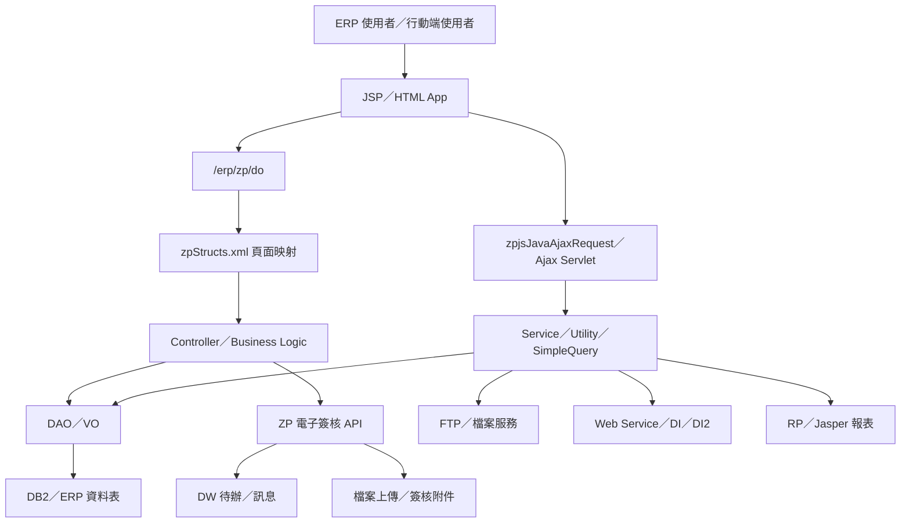
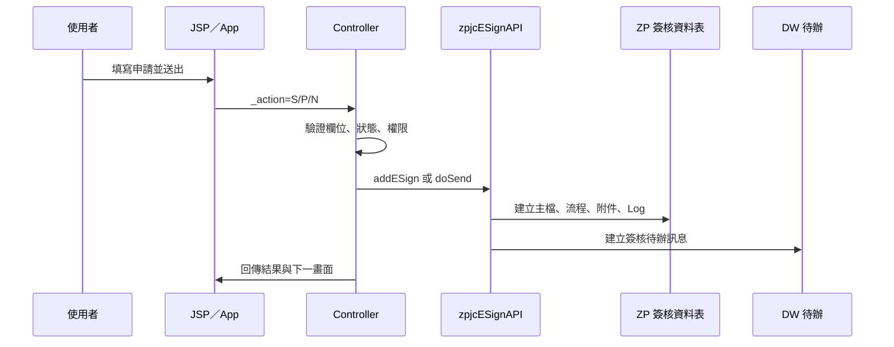
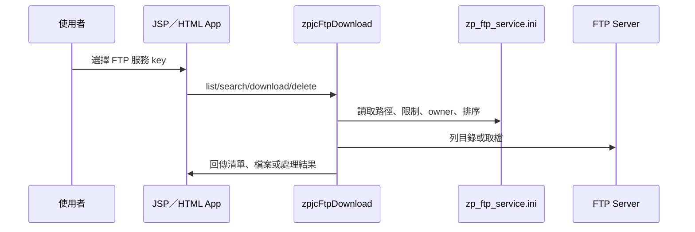
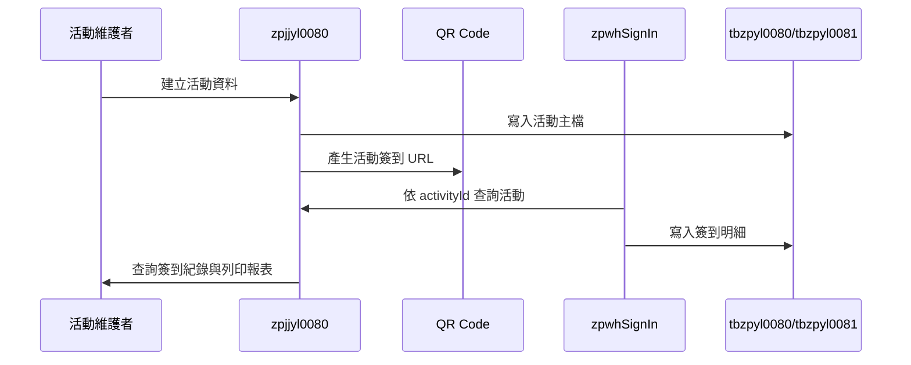

# ZP 功能規格手冊

## 1. 系統概述

### 1.1 系統定位

ZP 模組為 ERP 平台中的共用支援與流程整合模組，主要提供下列能力：

- 共用資料維護：客戶訂單優惠、工作報告、文件資料、Web Service 設定、資料表與 APPID 對應等主檔維護。
- 作業流程支援：報廢／出售申請、廠商／承攬商相關流程、電子簽核、待辦通知、週報與工作訊息。
- 檔案與資料交換：檔案上傳下載、FTP 清單／下載／刪除、SQL 批次、Web Service 查詢、DI／DI2 訊息轉送。
- 行動化與前端共用：HTML app、Vue／EasyTable、Ajax／Java Shell Script Request、QR Code 簽到。
- 稽核與診斷：SQL Log、IH Log、ERP request trace、EZoID Log、報表產出與查詢。

本模組同時保留早期 `com.icsc.zp` 程式與後續擴充的 `com.chsteel.zp` 程式。傳統 ERP 畫面以 JSP 搭配 `/erp/zp/do?_pageId=...` 進入，頁面與 Controller 對應主要由 `config/yl/zp/zpStructs.xml` 管理；行動與 Ajax 類功能則透過 `html/app`、`zpjsJavaAjaxRequest`、`zpSimpleQueryApp`、`zpFtpDownload` 等入口提供。

### 1.2 使用者與角色

- 一般 ERP 使用者：查詢工作報告、下載文件、處理個人簽核與通知、使用課程／會議簽到。
- 申請人：建立報廢／出售申請、電子簽核申請、公告通知、週報或文件簽核。
- 簽核人員：依職位與部門階層核准、退回、加簽或處理待簽工作。
- 系統管理者：維護系統文件、Web Service 設定、FTP 服務、資料表設定、授權資源與批次參數。
- 批次與介接服務：定期執行 FTP 產檔、通知轉送、Web Service 收發、IH Log 轉拋等自動化工作。

### 1.3 主要作業範圍

- 基本資料維護：`zpjja0101Edit`、`zpjjb0101Edit`、`zpjjb0201Edit`、`zpjjb0202List`、`zpjjb0301List`、`zpjjc0101Edit`、`zpjjc0201List`。
- 報廢／出售與廠商流程：`zpjj0023m`、`zpjj0024m`、`zpjj00250`、`zpjj00251`、`zpjj0032`、`zpjj0036`。
- 電子簽核：`zpjjESign01`、`zpjjESignInput`、`zpjjJournal_ESign01`、`zpjjJournal_ESignInput`、`zpjjDSAuthESign`、`zpjjDSAuthResource`、`zpjjESignFollowUp`。
- 公告通知：`zpjjNoticeInput`、`zpjjNotice`。
- 課程／會議簽到：`zpjjyl0080`、`zpjjyl0081`、`html/app/zpwhSignIn.html`。
- 檔案、FTP 與報表：`zpjjFileUpload`、`zpjjFileDownload`、`zpFtpDownload`、`zpFtpDelete`、`zpjjHTMLRptPrint`、`zpjjIcReport`。
- 共用查詢與設定：`zpSimpleQueryApp`、`zpjjVueEasytable`、`zpjjDbSchema`、`zpjjDbSchEdit`、`zpjjSQLBatchJob`、`zpjjws`。

### 1.4 主要資料來源

- 頁面流程設定：`config/yl/zp/zpStructs.xml`
- 共用設定：`config/yl/zp/zpCommonConfig.ini`、`zpConfig.ini`、`zpResource.ini`
- FTP 設定：`config/yl/zp/zp_ftp_service.ini`
- Web Service 與訊息設定：`zpWSMessagePublishConfig.ini`、`zpWSMessageReceiveConfig.ini`、`zpExternalService.ini`
- JSP 畫面：`jsp/`
- 傳統 Controller：`src/com/icsc/zp/`
- 新增服務、簽核、工具類別：`src/com/chsteel/zp/`
- DAO／VO 與資料表定義：`src/com/icsc/zp/dao/`、`src/com/chsteel/zp/esign/dao/`、`dao/sql/`、`sql/`

## 2. 系統架構總覽

### 2.1 邏輯架構

### 2.2 分層說明

| 層級 | 主要元件 | 說明 |
|---|---|---|
| 表現層 | `jsp/*.jsp`、`html/app/*.html`、`html/*.jss` | 提供傳統 ERP 畫面、查詢彈窗、清單、行動簽到與前端共用元件。 |
| 頁面控制層 | `/erp/zp/do`、`zpStructs.xml` | 依 `_pageId` 決定 JSP、Controller、action flag、method、forward 與 VO converter。 |
| 業務控制層 | `com.icsc.zp.*`、`com.chsteel.zp.busi.*`、`com.chsteel.zp.esign.*` | 執行查詢、建立、修改、刪除、送簽、退回、結案、通知、報表與檔案流程。 |
| 資料存取層 | `com.icsc.zp.dao.*`、`com.chsteel.zp.esign.dao.*` | 封裝 DB table 的 CRUD、查詢、序號與狀態更新。 |
| 共用服務層 | `com.chsteel.zp.service.*`、`com.icsc.zp.zpjcFileUpload*`、`zpjcFtp*` | 處理 Ajax、FTP、Web Service、檔案、訊息收發、資料轉送。 |
| 外部整合層 | DW、DI／DI2、FTP Server、RP Report、Mail、HA／DU／DS | 與待辦訊息、外部服務、報表平台、郵件、組織權限與人員資料整合。 |

### 2.3 頁面與 Controller 對應模式

`zpStructs.xml` 採以下模式定義頁面：

- `pageID`：前端以 `_pageId` 傳入的功能代號。
- `path`：預設或回傳 JSP。
- `controller`：處理該頁 action 的 Java 類別。
- `action`：以 `flag` 對應 `method`，並可指定 `validate` 與 `forward`。
- `converter`：將 request 轉換為指定 VO，型態包含 `unique` 與 `sequence`。

常見 action flag：

| flag | 常見意義 |
|---|---|
| `I` | 查詢或初始化 |
| `N` | 新增或建立申請 |
| `R`、`U` | 修改、更新或重送 |
| `D` | 刪除 |
| `S`、`P` | 送簽、送出或預設簽核 |
| `A`、`B` | 簽核同意或簽核層級處理 |
| `C`、`SC`、`FC` | 取消、取消送簽或取消結案 |
| `F`、`FF` | 結案、檔案處理或強制產生主檔 |
| `query`、`download`、`delete` | app／service 類入口的命令式操作 |

### 2.4 主要資料表

| 資料表 | VO／DAO | 功能定位 | 主要用途 | 關聯功能 |
|---|---|---|---|---|
| `db.tbzp0001` | `zpjc0001VO`／`zpjc0001DAO` | 客戶訂單優惠主檔 | 維護公司別、客戶／對象代號、產品別、折扣別、付款方式與匯款資料。 | 客戶訂單優惠維護 `zpjja0101Edit`。 |
| `db.tbzp0030` | `zpjc0030MVO`／`zpjc0030MDAO` | 報價資料主檔 | 保存報價管理作業所需的主檔與流程資料。 | 報價資料管理 `zpjj0032`、報價相關查詢。 |
| `db.tbzp0036` | `zpjc0036VO`／`zpjc0036DAO` | 報價申請資料 | 保存報價申請、確認、退回與流程處理資料。 | 報價申請 `zpjj0036`、BP 介面處理。 |
| `db.tbzp0050` | `zpjc0050VO`／`zpjc0050DAO` | 工作報告主檔 | 依員工、日期、序號記錄工作類別、報告類型、工時、主題與備註。 | 工作報告維護 `zpjjb0101Edit`、審核作業 `zpjjb0201Edit`。 |
| `db.tbzp0051` | `zpjc0051VO`／`zpjc0051DAO` | 週報／A 類文件主檔 | 保存週報或 A 類文件內容、狀態、建立人、部門與簽核鍵值。 | 週報編輯 `zpjjJournal_01`、簽核輸入 `zpjjJournal_ESignInput`。 |
| `db.tbzp0052` | `zpjc0052VO`／`zpjc0052DAO` | 週報編彙明細 | 支援週報顯示、編彙與明細資料保存。 | 週報顯示 `zpjjJournalDisplay`、週報編彙流程。 |
| `db.tbzp0053` | `zpjc0053VO`／`zpjc0053DAO` | 每日觸發工作通知設定 | 保存定期通知、簽核、主檔連結、參數與執行狀態。 | `zpjcDailyTriggerWorkNotice` 批次通知與簽核送出。 |
| `db.tbzp0055` | `zpjc0055VO`／`zpjc0055DAO` | 工作報告審核項目 | 維護工作報告審核項目與序列資料。 | 工作報告審核項目維護 `zpjjb0202List`。 |
| `db.tbzp0056` | `zpjc0056VO`／`zpjc0056DAO` | 外部顧問審核項目 | 維護外部顧問或外部審核項目資料。 | 外部顧問審核項目維護 `zpjjb0301List`。 |
| `db.tbzp0060` | `zpjc0060VO`／`zpjc0060DAO` | 系統文件主檔 | 維護文件代號、文件類別、名稱、檔名、檔案類型與授權群組。 | 系統文件維護 `zpjjc0101Edit`、文件查詢 `zpjjc0201List`。 |
| `db.TBZP0080` | `zpjc0080VO`／`zpjc0080DAO` | 報廢／出售申請主檔 | 保存申請單號、申請日期、部門、人員、狀態、簽核鍵值、待辦鍵值與備註。 | 報廢申請 `zpjj0023m`、廠商處理 `zpjj0024m`、非過磅主檔 `zpjj00250`。 |
| `db.TBZP0081` | `zpjc0081VO`／`zpjc0081DAO` | 報廢／出售申請明細 | 保存申請明細、資產資訊、品名規格、數量、預估重量、訂單與處理說明。 | 報廢明細維護、廠商處理、非過磅明細 `zpjj00251`。 |
| `db.tbzp0100` | `zpjc0100VO`／`zpjc0100DAO`、`zpjc0101VO`／`zpjc0101DAO` | 檔案上傳與檔案索引 | 保存檔案代理編號、檔案實體資訊、附件與顯示下載所需資訊。 | 檔案上傳下載、電子簽核附件、公告附件打包。 |
| `DB.TBDSMF` | `zpjcDSMFVO`／`zpjcDSMFDAO` | DS 系統資訊主檔 | 保存 DS 系統基本資料，作為系統、權限或資料表關聯參照。 | APPID／tableName 對照 `zpjj0200m`、DS 權限相關作業。 |
| `db.tbzp0200` | `zpjc0200VO`／`zpjc0200DAO` | APPID 與資料表對照 | 維護 APPID 與 tableName 對應關係。 | 系統管理、資料表設定、`zpjj0200m`。 |
| `db.tbzp100a` | `zpjc100aVO`／`zpjc100aDAO`、`zpjc100aMVO`／`zpjc100aMDAO` | 資料表設定主檔 | 保存資料表名稱、說明、可用狀態與主檔設定。 | DB Schema 查詢、資料表設定維護、`zpjj0040`。 |
| `db.tbzp100b` | `zpjc100bVO`／`zpjc100bDAO`、`zpjc100bMVO`／`zpjc100bMDAO` | 資料表欄位設定 | 保存欄位名稱、欄位屬性、顯示或轉換設定。 | DB Schema 查詢、資料表欄位維護、EasyTable／查詢工具。 |
| `db.tbzpws` | `zpjcwsVO`／`zpjcwsDAO` | Web Service 程式設定 | 維護 Web Service 呼叫設定、程式入口與服務相關參數。 | Web Service 設定維護 `zpjjwsm1`、Java Bean Service 呼叫。 |
| `DB.TBDWMSG` | `zpjcMSGVO`／`zpjcMSGDAO`、`zpjcDwMsg` | DW 工作訊息與待辦 | 保存 ERP 工作訊息、待辦導向 URL、建立人與訊息處理狀態。 | 電子簽核待辦、週報通知、公告通知、`zpUbMsgApp`。 |
| `DB.TBZPSQLLOG` | `zpjcSQLLOGVO`／`zpjcSQLLOGDAO` | SQL 執行紀錄 | 保存 SQL 查詢、批次或診斷工具的執行紀錄。 | SQL Batch、DB Schema、系統診斷與稽核。 |
| `DB.TBZPIHLOG` | `zpjcIhLog` | IH Log 轉拋紀錄 | 保存 DJ journal 轉入 IH 的鋼捲、訂單、板胚與維護時間資料。 | IH Log 轉拋、`zpjcIhLogBatch`、`zpjjIhLogQuery`。 |
| `db.tbzpyl0080` | `zpjcyl0080VO`／`zpjcyl0080DAO` | 課程／會議簽到主檔 | 保存活動代號、名稱、地點、類型、日期、時間、主辦人與 QR Code 路徑。 | 活動設定 `zpjjyl0080`、QR Code 簽到與報表列印。 |
| `db.tbzpyl0081` | `zpjcyl0081VO`／`zpjcyl0081DAO` | 課程／會議簽到明細 | 保存簽到人員、簽到類型、日期、時間與活動關聯。 | 簽到明細 `zpjjyl0081`、行動簽到 `zpwhSignIn.html`。 |
| `db.tbzpESign` | `zpjcESignVO`／`zpjcESignDAO` | 電子簽核主檔 | 保存簽核單號、外部鍵值、文件說明、申請人、狀態、流程類型與主檔連結。 | 一般電子簽核、週報簽核、公告簽核、報廢／出售送簽。 |
| `db.tbzpESignSub` | `zpjcESignSubVO`／`zpjcESignSubDAO` | 電子簽核附件／子檔 | 保存簽核附件、關聯檔案代理編號與子項資訊。 | 簽核附件、主檔檔案產生、公告附件。 |
| `db.tbzpESignFlow` | `zpjcESignFlowVO`／`zpjcESignFlowDAO` | 電子簽核流程設定 | 保存簽核節點、簽核人、實際簽核人、職級與流程順序。 | 簽核送出、核准、退回、權限判斷。 |
| `db.tbzpESignLog` | `zpjcESignLogVO`／`zpjcESignLogDAO` | 電子簽核歷程紀錄 | 保存簽核動作、意見、狀態變化與處理紀錄。 | 簽核歷程查詢、稽核、補送訊息與追蹤。 |
| `db.tbzpDSAuthResource` | `zpjcDSAuthResourceVO`／`zpjcDSAuthResourceDAO` | DS 權限資源設定 | 維護可申請的 DS 權限資源、owner 與對應權限資料。 | DS 權限資源維護 `zpjjDSAuthResource`。 |
| `db.tbzpDSAuthESign` | `zpjcDSAuthESignVO`／`zpjcDSAuthESignDAO` | DS 權限簽核申請 | 保存權限新增、刪除、申請原因、期間與簽核狀態。 | DS 權限申請 `zpjjDSAuthESign`、callback 更新 HA／DS 權限。 |
| `db.tbzpNotice` | `zpjcNoticeVO`／`zpjcNoticeDAO` | 公告通知主檔 | 保存公告主旨、內容、狀態、申請人、附件與簽核資訊。 | 公告建立 `zpjjNoticeInput`、公告閱讀 `zpjjNotice`。 |
| `db.tbzpNoticeLog` | `zpjcNoticeLogVO`／`zpjcNoticeLogDAO` | 公告通知紀錄 | 保存公告收件人、讀取狀態、通知歷程與完成狀態。 | 公告已讀、Messenger 發送、通知結案與稽核。 |

### 2.5 外部整合與設定

- ERP 主機與公司別：`zpCommonConfig.ini` 設定 `PlatformName=erp`、`CompanyId=yl`、`HostURL=HTTP://erp.chsteel.com.tw/erp`。
- 簽核職級限制：`zpCommonConfig.ini` 的 `esign_constraint` 依部門代號與職級對應最高簽核人員。
- FTP 服務：`zp_ftp_service.ini` 以 `ftp_service_key` 設定 FTP URL、起始路徑、下載限制、排序、owner 與說明。
- Web Service：`zpConfig.ini` 設定 `wsEndPoint`；`zpExternalService.ini` 定義外部 IP、帳號與可呼叫 Java 程序。
- 訊息收發：`zpWSMessagePublishConfig.ini`、`zpWSMessageReceiveConfig.ini`、`zpForwardMsgToDiConfig.ini`、`zpForwardMsgToDi2Config.ini` 支援 DI／DI2 與 WS 訊息轉送。

## 3. 功能模組詳細說明

### 3.1 共用維護與主檔管理

#### 3.1.1 客戶訂單優惠維護

- 入口頁面：`zpjja01.jsp`、`zpjja0101Edit.jsp`
- pageID：`zpjja0101Edit`
- Controller：`com.icsc.zp.zpjca01`
- VO／DAO：`zpjc0001VO`、`zpjc0001DAO`
- 資料表：`db.tbzp0001`
- 主要功能：查詢、新增、修改、刪除客戶、產品別、折扣別、付款與匯款資料。
- 主要欄位：`compId`、`Id`、`prodType`、`discType`、`payType`、`remitBank`、`remitAccount`、`remitName`。

#### 3.1.2 工作報告維護與查詢

- 入口頁面：`zpjjb01.jsp`、`zpjjb0101Edit.jsp`、`zpjjb02.jsp`、`zpjjb0201Edit.jsp`
- pageID：`zpjjb0101Edit`、`zpjjb0201Edit`
- Controller：`com.icsc.zp.zpjcb01`、`com.icsc.zp.zpjcb02`
- VO／DAO：`zpjc0050VO`、`zpjc0050DAO`
- 資料表：`db.tbzp0050`
- 主要功能：依員工、日期與序號維護工作報告；支援部門、工作類別、報告類型、工時、主題與備註。
- 補充功能：`zpjjb0202List` 使用 `zpjc0055VO` 維護工作報告審核項目；`zpjjb0301List` 使用 `zpjc0056VO` 維護外部顧問審核項目。

#### 3.1.3 系統文件維護與查詢

- 入口頁面：`zpjjc01.jsp`、`zpjjc0101Edit.jsp`、`zpjjc02.jsp`、`zpjjc0201List.jsp`
- pageID：`zpjjc0101Edit`、`zpjjc0201List`
- Controller：`com.icsc.zp.zpjcc01`、`com.icsc.zp.zpjcc02`
- VO／DAO：`zpjc0060VO`、`zpjc0060DAO`
- 資料表：`db.tbzp0060`
- 主要功能：維護文件代號、文件類別、文件名稱、檔名、檔案類型與授權群組；查詢端依條件列出可用文件。
- 權限控制：以 `authGroup` 或相關頁面控制下載可見性。

#### 3.1.4 Web Service 設定維護

- 入口頁面：`zpjjws.jsp`、`zpjjwsm1.jsp`
- pageID：`zpjjwsm1`
- Controller：`com.icsc.zp.zpjcCrws`
- VO／DAO：`zpjcwsVO`、`zpjcwsDAO`
- 資料表：`db.tbzpws`
- 主要功能：維護 Web Service 設定資料，支援查詢、新增、修改、刪除。
- 關聯服務：`zpjcWebServiceUtil`、`zpjcWebServiceList`、`zpjcWebServiceSQLQuery` 提供 Java Bean Service 呼叫與 SQL 查詢清單輸出。

#### 3.1.5 APPID 與資料表對應維護

- 入口頁面：`zpjj0200.jsp`、`zpjj0200m.jsp`
- pageID：`zpjj0200m`
- Controller：`com.icsc.zp.zpjc0200CR`
- VO／DAO：`zpjcDSMFVO`、`zpjc0200VO`
- 資料表：`DB.TBDSMF`、`db.tbzp0200`
- 主要功能：維護系統 APPID 與資料表對應，供資料表查詢、權限或共用工具參照。

### 3.2 報廢／出售申請與處分流程

#### 3.2.1 報廢申請人作業

- 入口頁面：`zpjj0023.jsp`、`zpjj0023m.jsp`
- pageID：`zpjj0023m`
- Controller：`com.icsc.zp.zpjc0023CR`
- VO／DAO：`zpjc0080VO`、`zpjc0081VO`
- 資料表：`db.TBZP0080`、`db.TBZP0081`
- 主要功能：查詢申請、更新主檔與明細、送簽、取消送簽。
- 處理邏輯：送簽前檢查申請單是否已建立、目前狀態是否允許送簽、明細是否存在、預估重量是否正確；送簽後建立 ZP 電子簽核資料，並寫回主檔狀態與簽核鍵值。

#### 3.2.2 廠商／外部處理作業

- 入口頁面：`zpjj0024.jsp`、`zpjj0024m.jsp`
- pageID：`zpjj0024m`
- Controller：`com.icsc.zp.zpjc0024CR`
- VO／DAO：`zpjc0080VO`、`zpjc0081VO`
- 資料表：`db.TBZP0080`、`db.TBZP0081`
- 主要功能：更新處理資料、送簽、取消送簽、結案、取消結案、強制結案、取消強制結案、退回申請人。
- 狀態控制：依 `statusCode` 控制可執行動作，例如申請人送簽、外部處理、結案與強制結案階段。
- 權限控制：部分動作需 JC2 廠商／外部負責人或指定管理角色執行。

#### 3.2.3 非過磅／附屬流程

- 入口頁面：`zpjj00250.jsp`、`zpjj00251.jsp`
- pageID：`zpjj00250`、`zpjj00251`
- Controller：`com.icsc.zp.zpjc00250CR`、`com.icsc.zp.zpjc00251CR`
- 主要功能：主檔新增／更新／刪除、明細更新與查詢。
- 使用時機：處理報廢／出售流程中不走過磅或需額外資料補充的項目。

### 3.3 報價／資料管理與申請流程

#### 3.3.1 報價資料管理

- 入口頁面：`zpjj0032.jsp`、`zpjj0032Main.jsp`
- pageID：`zpjj0032`
- Controller：`com.icsc.zp.zpjc0032`
- VO／DAO：`zpjc0030MVO`、`zpjc0030MDAO`
- 資料表：`db.tbzp0030`
- 主要功能：查詢、新增、修改、刪除報價主檔或流程資料。

#### 3.3.2 報價申請

- 入口頁面：`zpjj0036.jsp`、`zpjj0036Main.jsp`
- pageID：`zpjj0036`
- Controller：`com.icsc.zp.zpjc0036`
- VO／DAO：`zpjc0036VO`、`zpjc0036DAO`
- 資料表：`db.tbzp0036`
- 主要功能：查詢、確認、退回、轉至主頁。
- 處理邏輯：Controller 內含申請檢核、確認與退回流程，並與 `zpjc0036Bp`、`zpji0036Bp` 等 BP 介面協同。

### 3.4 電子簽核平台

#### 3.4.1 一般電子簽核主流程

- 入口頁面：`zpjjESign.jsp`、`zpjjESign01.jsp`
- pageID：`zpjjESign01`
- Controller：`com.chsteel.zp.esign.zpjcESignLogic`
- 主要資料表：`db.tbzpESign`、`db.tbzpESignSub`、`db.tbzpESignFlow`、`db.tbzpESignLog`
- 主要功能：查詢簽核單、預設簽核人員、取消、取號、強制產生主檔、補送訊息、核准、退回、送出。
- API 支援：`zpjcESignAPI` 提供 `addESign`、`cancel`、`cancelALL`、簽核人員清單取得與自動送出。
- 附件支援：可透過 `fileAgentNo` 或主檔檔案產生簽核附件。

#### 3.4.2 電子簽核申請輸入

- 入口頁面：`zpjjESignInput.jsp`、`zpjjESignInput01.jsp`
- pageID：`zpjjESignInput`
- Controller：`com.chsteel.zp.esign.zpjcESignInput`
- 主要功能：查詢、建立簽核、取消、檔案上傳訊息、清除畫面。
- 驗證：建立時執行 `create_validate`，檢查必要欄位與資料完整性。

#### 3.4.3 週報／A 類文件簽核

- 入口頁面：`zpjjJournal.jsp`、`zpjjJournal_01.jsp`、`zpjjJournal_02.jsp`、`zpjjJournal_ESignInput.jsp`、`zpjjJournal_ESign01.jsp`
- Controller：`com.icsc.zp.zpjcd01`、`com.icsc.zp.zpjcJournal01`、`com.icsc.zp.zpjcJournal02`、`com.chsteel.zp.esign.zpjcESignLogic`
- 主要功能：週報查詢、保存、刪除、編彙、送簽、通知、核准、退回與批次送訊息。
- 整合點：簽核完成後可更新週報狀態、完成 DW 工作、依部門或處級產生週報通知。

#### 3.4.4 DS 權限資源與授權簽核

- 入口頁面：`zpjjDSAuthResource.jsp`、`zpjjDSAuthESign.jsp`
- pageID：`zpjjDSAuthResource`、`zpjjDSAuthESign`
- Controller：`com.chsteel.zp.esign.zpjcDSAuthResource`、`com.chsteel.zp.esign.zpjcDSAuthESign`
- 資料表：`db.tbzpDSAuthResource`、`db.tbzpDSAuthESign`
- 主要功能：維護 DS 權限資源、查詢權限申請、清除、作廢、更新、批次新增、送簽與檢視。
- 後續處理：簽核 callback 會依授權申請內容新增或刪除 HA／DS 權限成員。

#### 3.4.5 簽核待處理追蹤

- 入口頁面：`zpjjESignFollowUp.jsp`、`zpjjESignFollowUp01.jsp`
- pageID：`zpjjESignFollowUp`
- Controller：`com.chsteel.zp.esign.zpjcESignFollowUp`
- 主要功能：查詢簽核待處理案件、指派、備註、結案、重送簽核。

### 3.5 公告通知

#### 3.5.1 公告建立與維護

- 入口頁面：`zpjjNoticeInput.jsp`、`zpjjNoticeInput01.jsp`
- pageID：`zpjjNoticeInput`
- Controller：`com.chsteel.zp.esign.zpjcNoticeInput`
- 資料表：`db.tbzpNotice`、`db.tbzpNoticeLog`
- 主要功能：查詢、建立公告、取消、更新、清除、強制結案。
- 處理邏輯：建立公告後依通知對象寫入 log，必要時建立電子簽核；取消或強制結案會更新公告狀態並處理相關簽核。

#### 3.5.2 公告閱讀與完成

- 入口頁面：`zpjjNotice.jsp`、`zpjjNotice01.jsp`
- pageID：`zpjjNotice`
- Controller：`com.chsteel.zp.esign.zpjcNotice`
- 主要功能：查詢公告、標記已讀、執行 callback、附件打包下載。
- 權限控制：申請人、簽核人與可閱讀人員可查閱公告內容。
- 批次支援：`zpjcNotice.run` 可查詢未完成通知並執行後續處理。

### 3.6 課程／會議簽到

#### 3.6.1 課程／會議設定

- 入口頁面：`zpjjyl0080Main.jsp`、`zpjjyl0080.jsp`
- pageID：`zpjjyl0080`
- Controller：`com.icsc.zp.zpjcyl0080`
- 資料表：`db.tbzpyl0080`
- 主要功能：查詢、新增、修改、刪除課程／會議活動。
- 主要欄位：`activityId`、`activityName`、`location`、`activityType`、`activityDate`、`activityTime_S`、`activityTime_E`、`holdUserNo`、`qrcodePath`。
- 報表整合：可列印活動簽到、QR Code 或相關報表，如 `FAR00420`、`FAR00410`、`ZZR00850`。

#### 3.6.2 簽到明細

- 入口頁面：`zpjjyl0081.jsp`、`html/app/zpwhSignIn.html`
- pageID：`zpjjyl0081`
- Controller：`com.icsc.zp.zpjcyl0081`
- 資料表：`db.tbzpyl0081`
- 主要功能：查詢、新增、刪除簽到明細；提供 app 查詢歷史紀錄。
- 行動流程：活動頁產生 QR Code，行動端以 activityId 進入簽到頁，寫入簽到人員、簽到類型、日期與時間。

### 3.7 檔案、FTP 與報表服務

#### 3.7.1 檔案上傳與下載

- 入口頁面：`zpjjFileUpload.jsp`、`zpjjFileUploadEC.jsp`、`zpjjFileDownload.jsp`、`zpjjFileDisplay.jsp`
- 主要類別：`com.icsc.zp.zpjcFileUpload`、`zpjcFileUploadApi`、`zpjcFileUploadEC`、`com.chsteel.zp.service.zpjcFileServer`
- 資料表：`db.tbzp0100`
- 主要功能：檔案上傳、代理編號管理、檔案下載、檔案顯示、EC 端上傳、簽核附件關聯。

#### 3.7.2 FTP 清單、下載與刪除

- 入口頁面：`zpjjFtp.jsp`、`zpjjFtpDownload.jsp`、`zpjjFtpDelete.jsp`
- pageID：`zpFtpDownload`、`zpFtpDelete`
- Controller：`com.chsteel.zp.service.zpjcFtpDownload`
- 設定檔：`config/yl/zp/zp_ftp_service.ini`
- 主要功能：依服務 key 取得 FTP 清單、套用下載限制與排序、下載檔案、刪除檔案。
- 控制項：`MAX_DOWNLOAD_SIZE`、`MAX_DOWNLOAD_COUNT`、`limit_entry`、`limit_filter`、`sort`、`owner`。

#### 3.7.3 批次 FTP 產檔

- 主要類別：`com.icsc.zp.zpjcFtpBatch`、`zpjcCustFtpXmlFile`
- 主要功能：依客戶、月份、檔案類型產生 CSV／文字檔並上傳 FTP。
- SQL 來源：`sql/ftp.txt`、`sql/iil.txt`、`sql/ss.txt` 與程式內建 SQL 片段。

#### 3.7.4 報表與列印

- 入口頁面：`zpjjHTMLRptPrint.jsp`、`zpjjIcReport.jsp`、`zpjjReportResultList.jsp`
- 主要類別：`com.chsteel.zp.busi.zpjcCommonUtility.genRPReport`、`com.icsc.zp.zpjcRPUtil`、`zpjcIcReportQA`
- 主要功能：呼叫 RP 報表平台、組合報表參數、產出 HTML／PDF／列印結果。

### 3.8 查詢、Ajax 與前端共用工具

#### 3.8.1 Java Ajax Request

- pageID：`zpjjJavaAjaxRequest`
- Controller：`com.chsteel.zp.service.zpjcJavaAjaxRequest`
- 主要功能：依 `procedure` 參數執行 Java Shell Script 式程序，將結果回傳 `zpjjAjaxResponse.jsp`。
- 使用場景：前端需要動態呼叫 Java 類別、產生報表、查詢資料或執行小型服務時使用。

#### 3.8.2 Simple Query App

- pageID：`zpSimpleQueryApp`
- Controller：`com.chsteel.zp.busi.zpjcSimpleQueryApp`
- 主要功能：`query`、`queryByRptCode`、`queryByXls`、`queryByCsv`、`queryByXlsFetchRange`、`queryByFile`。
- 回傳格式：透過 `zpjjStructsMap.jsp` 回傳結構化資料，供 app 或 Ajax 前端使用。

#### 3.8.3 Vue／EasyTable 與查詢元件

- 入口頁面：`zpjjVueEasytable.jsp`、`zpjjQryGridToJson.jsp`
- 前端檔案：`html/zpjt_easytable_index.jss`、`html/zpjt_easytable_parser.jss`、`html/zpjtVueInfiniteLoading.jss`
- 主要功能：依設定檔或 SQL 產生表格欄位、格式化日期／數字、支援前端查詢與 JSON 化。

### 3.9 訊息、待辦與郵件

#### 3.9.1 DW 工作訊息

- 主要類別：`com.icsc.zp.zpjcDwMsg`、`com.chsteel.zp.busi.zpjcUbMsgApp`
- 資料表：`DB.TBDWMSG`
- 主要功能：建立待辦、完成待辦、查詢個人訊息、轉入 ERP DW 頁面。
- 使用場景：送簽、退回、公告通知、週報流程與外部處理提醒。

#### 3.9.2 郵件通知

- 入口頁面：`zpjjSendMail.jsp`、`zpjjSendMailMain.jsp`
- 主要類別：`com.icsc.zp.zpjcSendMail`
- 主要功能：設定 SMTP host、寄件者、收件者、CC、BCC、主旨、HTML 內容與附件；可依員工編號查 DU email 後寄送。
- 預設郵件主機：`smtp.chsteel.com.tw`

#### 3.9.3 Web Service／DI／DI2 訊息收發

- 主要類別：`zpjcWSMessagePublisher`、`zpjcWSMessageReceiver`、`zpjcForwardMsgToDiProcessor`、`zpjcForwardMsgToDi2Processor`、`zpjcDiMsgToWs`、`zpjcDi2MsgToWs`
- 設定檔：`zpWSMessagePublishConfig.ini`、`zpWSMessageReceiveConfig.ini`、`zpForwardMsgToDiConfig.ini`、`zpForwardMsgToDi2Config.ini`
- 主要功能：ERP 與外部訊息服務之間的發佈、接收、轉送與處理。

### 3.10 稽核、Log 與診斷工具

#### 3.10.1 SQL Log 與 DB Schema

- 入口頁面：`zpjjDbSchema.jsp`、`zpjjDbSchEdit.jsp`、`zpjjsql.jsp`、`zpjjSQLBatchJob.jsp`
- 主要類別：`zpjcDbSchema`、`zpjcCrDbSchema`、`zpjcCrDbSchEdit`、`zpjcSQLBatchJob`
- 資料表：`DB.TBZPSQLLOG`、`db.tbzp100a`、`db.tbzp100b`
- 主要功能：資料表 schema 查詢、設定維護、SQL 執行紀錄、批次 SQL 執行與狀態查詢。

#### 3.10.2 IH Log 轉拋

- 入口頁面：`zpjjIhLog.jsp`、`zpjjIhLogQuery.jsp`
- 主要類別：`com.icsc.zp.zpjcIhLog`、`zpjcIhLogBatch`、`zpjcIhLogBatPre`
- 資料表：`DB.TBZPIHLOG`
- 主要功能：將 DJ journal 資料轉入 IH Log，記錄鋼捲、訂單、板胚與維護時間。

#### 3.10.3 EZoID Log

- 入口頁面：`zpjjEzoIdLog.jsp`、`zpjjEzoIdLog01.jsp`
- pageID：`zpjjEzoIdLog`
- Controller：`com.chsteel.zp.zpjcEzoIdLog`
- DAO：`zpjcEzoIdLogDAO`
- 主要功能：查詢、更新、刪除 EZoID 相關紀錄。

### 3.11 行動端與 HTML App

| App | 功能概述 |
|---|---|
| `zpwhSignIn.html` | 課程／會議 QR Code 簽到。 |
| `zpwhUbMsgApp.html` | 個人訊息或待辦查詢。 |
| `zpwhimg2txtApp.html` | 圖片辨識文字或圖片轉文字相關 app。 |
| `zpwh001App.html` 至 `zpwh016App.html` | 多個行動化查詢、表單、嵌入式 iframe 或作業入口。 |
| `zpwhIframeWindow.html` | 行動端 iframe 容器。 |

行動端多透過 Ajax、`zpSimpleQueryApp`、`zpFtpDownload`、`zpUbMsgApp` 或 `zpjjStructsMap.jsp` 取得資料。若涉及 ERP 身分，需依既有 session、`dsCom`、app request 判斷與後端權限檢核執行。

### 3.12 共用工具與基礎類別

- 字串、日期與資料轉換：`zpjcStringUtil`、`zpjcDateUtil`、`zpjcDateTimeUtility`、`zpjcArgumentConvert`、`zpjcSQLUtility`。
- 反射與 Java Shell Script：`zpjcReflect`、`zpjcReflection`、`zpjcShellScript`、`zpjcJavaBeanService`。
- JSON 與資料集：`zpjcJson`、`zpjcJson2`、`zpjcDataSet`、`zpjcParseDaoFile`、`zpjcParseResultSet`。
- QR Code：`zpjcQRCode`，用於簽到與 app 入口 URL。
- 權限與人員：`zpjcAuth`、`zpjcEmpAuthLevel`、`zpjcCommonUtility.getAuthList`。
- 系統設定：`zpjcSetting`、`zpjcConfigTable`、`zpjcResourceFactory`。

### 3.13 關鍵流程摘要

#### 電子簽核送出流程

#### FTP 下載流程

#### 課程／會議簽到流程

### 3.14 維護注意事項

- 異動頁面流程時，需同步檢查 JSP、`zpStructs.xml`、Controller method、VO converter 與 DAO 欄位。
- 新增簽核類功能時，需確認 `outKeyNo` 唯一性、callback 類別、附件代理編號、簽核人員清單與 DW 待辦建立結果。
- 涉及 FTP 設定時，應避免在程式中硬編服務參數，優先維護 `zp_ftp_service.ini`。
- 涉及 BIG5 檔案時，搜尋與檢視需注意編碼，避免因終端亂碼誤判中文註解或欄位說明。
- 涉及資料表 schema、SQL 執行或批次流程時，應檢查 `TBZPSQLLOG`、相關 DAO 與批次 Log，保留可追溯紀錄。
- 修改報廢／出售流程時，需特別注意 `statusCode`、簽核鍵值、`dwKey`、主明細一致性與取消／退回／結案狀態。
