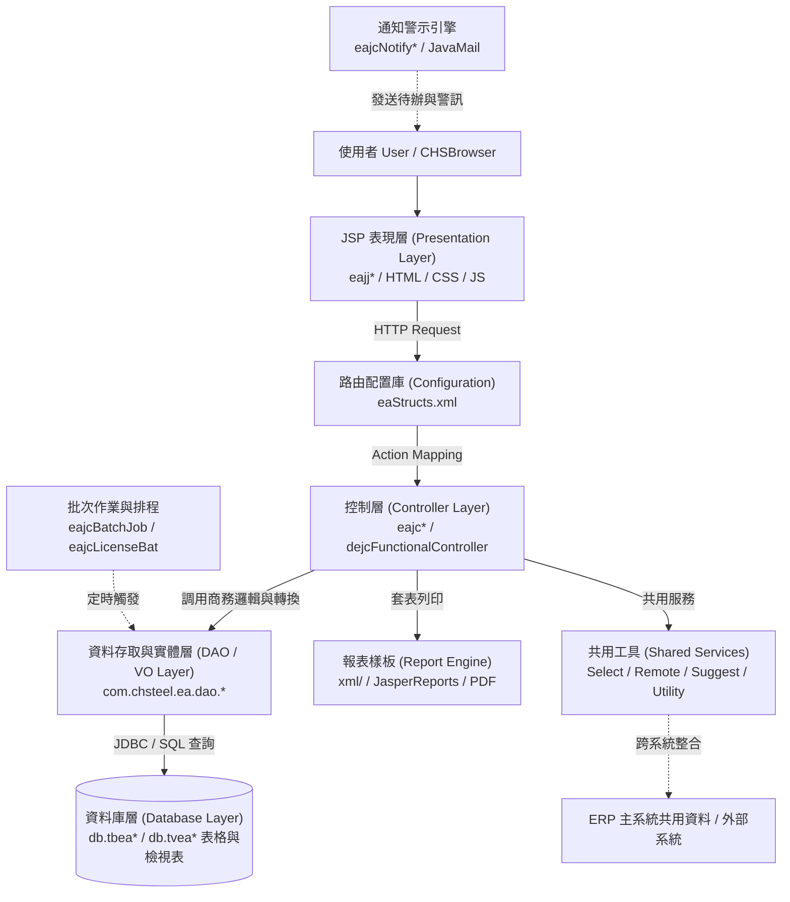

# 安環績效管理系統（EA）功能規格手冊

---

## 1. 系統概述

### 1.1 系統名稱
**安環績效管理系統（EA，Environment & Safety Management System）**。

### 1.2 系統定位
本系統為中龍鋼鐵／企業資源規劃（ERP）架構下專責之**環境保護、職業安全衛生、法規合規性、風險鑑別及安環績效指標**之核心營運子系統。

系統以 Java Servlet、JSP、DAO／VO 資料存取模式及 ICSC DPMS 框架為主要實作基礎，結合專屬 XML 頁面與公文路由設定檔（`eaStructs.xml`），全面落實 ISO 14001（環境管理系統）、ISO 45001 / TOSHMS（職業安全衛生管理系統）等標準作業。

### 1.3 建置目的
1. **集中管控安環資料**：建立全廠環安衛數據集中管理平台，降低紙本作業與分散式表單維護成本。
2. **落實災害防阻與事故追蹤**：提供失能傷害、非失能傷害、交通事故、安全觀察、關鍵巡檢等登錄、原因分析、改善對策制定與結案追蹤。
3. **動態風險與環境衝擊鑑別**：支援部門作業之危害辨識、風險矩陣評分（RE）及環境考量面評估（EA）。
4. **強化法規符合性查核**：自動收錄最新環安衛法規，定期指派各廠處進行合規性查核，並透過批次作業排程監控逾期項目。
5. **環境永續與污染源管制**：納管空污費申報、連續自動監測（CEMS）、環保許可證（空/水/廢/毒）生命週期與資源回收流向。
6. **綠色供應鏈審查與證照管理**：針對原物料請購進行 RoHS/REACH/VOC 安環審核，並自動預警人員安環證照效期。

### 1.4 使用對象
| 使用對象 | 主要用途 |
| :--- | :--- |
| **安環管理人員** | 維護事故調查、安全檢查、法規鑑別、許可證、目標方案、環境監測與統計報表 |
| **各單位承辦人** | 登錄單位安環資料、執行關鍵巡檢、填報法規查核、處理改善對策、查詢簽核進度 |
| **主管／簽核人員** | 審核安環文件、核定改善方案、追蹤未結案件、檢閱安全與環境績效指針 |
| **系統管理人員** | 維護基礎代碼字典、排程批次作業、訊息通知設定與系統操作履歷稽核 |

### 1.5 系統主要資料與文件
| 類別 | 說明 | 主要位置 |
| :--- | :--- | :--- |
| **JSP 頁面** | 前端作業畫面、查詢頁、清單頁、Popup 快顯頁、列印頁 | [jsp/](file:///d:/CHSBrowser_erp/erpHome/yl.ear/erp.war/ea/jsp) |
| **Java Controller** | 業務邏輯、流程分派與頁面動作控制 | [src/com/chsteel/ea/](file:///d:/CHSBrowser_erp/erpHome/yl.ear/erp.war/ea/src/com/chsteel/ea) |
| **DAO／VO** | 資料庫存取物件（DAO）與值物件（VO） | [src/com/chsteel/ea/dao/](file:///d:/CHSBrowser_erp/erpHome/yl.ear/erp.war/ea/src/com/chsteel/ea/dao) 及 [dao/](file:///d:/CHSBrowser_erp/erpHome/yl.ear/erp.war/ea/dao) |
| **頁面設定檔** | 頁面、控制器、動作 flag 與 ValueObject 映射設定 | [eaStructs.xml](file:///d:/CHSBrowser_erp/erpHome/yl.ear/erp.war/ea/eaStructs.xml) 及 [config/yl/ea/eaStructs.xml](file:///d:/CHSBrowser_erp/erpHome/yl.ear/erp.war/ea/config/yl/ea/eaStructs.xml) |
| **報表樣板** | 報表定義 XML、JasperReports 樣板 | [xml/](file:///d:/CHSBrowser_erp/erpHome/yl.ear/erp.war/ea/xml) 及 `xml/dr/` |
| **共用頁面與資源** | CSS 樣式、JavaScript 腳本、圖示資源 | [html/](file:///d:/CHSBrowser_erp/erpHome/yl.ear/erp.war/ea/html) 及 [images/](file:///d:/CHSBrowser_erp/erpHome/yl.ear/erp.war/ea/images) |
| **範本與匯出檔** | Excel、CSV 或 GUL 等檔案範本 | [files/](file:///d:/CHSBrowser_erp/erpHome/yl.ear/erp.war/ea/files) 及 [gul/](file:///d:/CHSBrowser_erp/erpHome/yl.ear/erp.war/ea/gul) |

### 1.6 命名規則
| 命名規則 | 說明 |
| :--- | :--- |
| `eajj*` | JSP 頁面，主要為使用者操作畫面與介面元件 |
| `eajc*` | Java 控制類別（Controller）、批次作業或共用元件 |
| `*_dao`／`*DAO` | Data Access Object，負責資料庫 SQL 存取與封裝 |
| `*_vo`／`*VO` | Value Object，負責承載資料表欄位屬性與資料封裝 |
| `*Search`、`*List`、`*Popup` | 查詢條件輸入頁、多筆結果清單頁、快顯輔助選擇視窗 |
| `*Doc`、`*Text*`、`*Print` | 表單文件主頁、明細維護頁面、報表輸出與列印頁面 |
| `CR`／`CRN` | CRUD（新增/查詢/修改/刪除）或新版標準流程控制類別 |

---

### 1.7 主要資料表
【主要資料表】依【資料表】、【VO／DAO】、【功能定位】、【主要用途】、【關聯功能】整理如下：

| 資料表 | VO／DAO | 功能定位 | 主要用途 | 關聯功能 |
| :--- | :--- | :--- | :--- | :--- |
| `db.tbeaWorkDoc` | `eajcWorkDoc_vo` `eajcWorkDoc_dao` | 安環公文主檔 | 所有安環表單之通用公文表頭，記錄文件編號、機密等級、發文人與當前狀態 | [eajjNewDoc.jsp](file:///d:/CHSBrowser_erp/erpHome/yl.ear/erp.war/ea/eaStructs.xml#L3-L16) [eajcWorkDoc_dao.java](file:///d:/CHSBrowser_erp/erpHome/yl.ear/erp.war/ea/src/com/chsteel/ea/dao/eajcWorkDoc_dao.java) |
| `db.tbeaAgreeID` | `eajcAgreeID_vo` `eajcAgreeID_dao` | 簽核流程檔 | 記錄簽核中或已完成之主管工號、簽核時間與結果（同意/退回） | [eajjAgreeID.jsp](file:///d:/CHSBrowser_erp/erpHome/yl.ear/erp.war/ea/jsp/eajjAgreeID.jsp) [eajcAgreeID.java](file:///d:/CHSBrowser_erp/erpHome/yl.ear/erp.war/ea/src/com/chsteel/ea/eajcAgreeID.java) |
| `db.tbeaAgreeIDList` | `eajcAgreeIDList_vo` `eajcAgreeIDList_dao` | 預設簽核路徑檔 | 定義不同表單類型之預設簽核主管層級順序與會辦單位規則 | 簽核路徑範本維護 |
| `db.tbeaAgreeLimit` | `eajcAgreeLimit_vo` `eajcAgreeLimit_dao` | 簽核時效管制檔 | 定義各簽核關卡之標準作業時效（SLA），逾期自動發送催辦通知 | 簽核時效管制 |
| `db.tbeaReferenceID` | `eajcReferenceID_vo` `eajcReferenceID_dao` | 會辦人員檔 | 記錄表單加會之各相關單位會辦主管工號、會辦意見與加簽時間 | 公文會辦處理 |
| `db.tbeaReceiver` | `eajcReceiver_vo` `eajcReceiver_dao` | 受文人員檔 | 記錄公文結案後受文分發之主管、同仁與群組清單 | 公文受文分發 |
| `db.tbeaAnnotate` | `eajcAnnotate_vo` `eajcAnnotate_dao` | 批示與簽核意見檔 | 儲存簽核流程中各主管填寫之批示內容、核示意見與退件說明 | 簽核意見歷程 |
| `db.tbeaAttach` | `eajcAttach_vo` `eajcAttach_dao` | 附件管理檔 | 記錄表單夾帶之上傳檔案名稱、檔案大小、儲存路徑與上傳人員 | [eajjFileUpload.jsp](file:///d:/CHSBrowser_erp/erpHome/yl.ear/erp.war/ea/jsp/eajjFileUpload.jsp) |
| `db.tbeaDocFlow` | `eajcDocFlow_vo` `eajcDocFlow_dao` | 公文流程歷程檔 | 完整記錄表單在各關卡流轉之歷史軌跡與停留時數 | 流程軌跡查詢 |
| `db.tbeaDocStatus` | `eajcDocStatus_vo` `eajcDocStatus_dao` | 公文狀態定義檔 | 定義草稿、審核中、已核准、退回、作廢、結案等公文狀態代碼 | 狀態碼字典 |
| `db.tbeaDocType` | `eajcDocType_vo` `eajcDocType_dao` | 表單類型定義檔 | 維護各安環表單之類型編碼（如失能傷害報告、法規鑑別單、管理方案等） | 表單分類字典 |
| `db.tbeaDocChange` | `eajcDocChange_vo` `eajcDocChange_dao` | 文件變更檔 | 保存公文或表單變更申請之異動內容與版本歷程 | [eajjDocChange01.jsp](file:///d:/CHSBrowser_erp/erpHome/yl.ear/erp.war/ea/jsp/eajjDocChange01.jsp) |
| `db.tbeaHtContent` | `eajcHtContent_vo` `eajcHtContent_dao` | 失能傷害報告主檔 | 記錄失能傷害事故之人事、發生時間地點、事故過程與初步判定 | [eajjHtContent01.jsp](file:///d:/CHSBrowser_erp/erpHome/yl.ear/erp.war/ea/jsp/eajjHtContent01.jsp) [eajcHtContent01.java](file:///d:/CHSBrowser_erp/erpHome/yl.ear/erp.war/ea/src/com/chsteel/ea/eajcHtContent01.java) |
| `db.tbeaHtContentPlan` | `eajcHtContentPlan_vo` `eajcHtContentPlan_dao` | 失能改善計畫檔 | 儲存事故檢討對策、改善行動方案、預計完成日與執行進度 | [eajjHtContentPlan02.jsp](file:///d:/CHSBrowser_erp/erpHome/yl.ear/erp.war/ea/jsp/eajjHtContentPlan02.jsp) |
| `db.tbeaHtContentTrace` | `eajcHtContentTrace_vo` `eajcHtContentTrace_dao` | 失能事故追蹤檔 | 記錄工安單位與權責主管對改善成效之複查、結案驗證與追蹤紀錄 | [eajjHtTrace.jsp](file:///d:/CHSBrowser_erp/erpHome/yl.ear/erp.war/ea/jsp/eajjHtTrace.jsp) |
| `db.tbeaNHtContent` | `eajcNHtContent_vo` `eajcNHtContent_dao` | 非失能傷害主檔 | 記錄輕傷、無損工時之非失能職業災害事件與預防對策 | [eajjNHtContent01.jsp](file:///d:/CHSBrowser_erp/erpHome/yl.ear/erp.war/ea/jsp/eajjNHtContent01.jsp) |
| `db.tbeaTRContent` | `eajcTRContent_vo` `eajcTRContent_dao` | 交通事故報告檔 | 記錄員工上下班途中發生之交通事故狀況、肇事責任與就醫資料 | [eajjTRContent01.jsp](file:///d:/CHSBrowser_erp/erpHome/yl.ear/erp.war/ea/jsp/eajjTRContent01.jsp) |
| `db.tbeaHTRContent` | `eajcHTRContent_vo` `eajcHTRContent_dao` | 事故損失調查表 | 統計各類事故之直接損失、設備損害、醫療費用與間接工時損失 | [eajjHTRContent01.jsp](file:///d:/CHSBrowser_erp/erpHome/yl.ear/erp.war/ea/jsp/eajjHTRContent01.jsp) |
| `db.tbeaZHurt` | `eajcZHurt_vo` `eajcZHurt_dao` | 零傷害累計主檔 | 統計各部門累計無災害工時、無事故天數與安全紀錄里程碑 | [eajjZHt01.jsp](file:///d:/CHSBrowser_erp/erpHome/yl.ear/erp.war/ea/jsp/eajjZHt01.jsp) |
| `db.tbeaZHtContent` | `eajcZHtContent_vo` `eajcZHtContent_dao` | 零傷害獎勵統計檔 | 依零傷害達成標準，核算各部門獎勵點數與安環獎金發放明細 | [eajjZHt.jsp](file:///d:/CHSBrowser_erp/erpHome/yl.ear/erp.war/ea/jsp/eajjZHt.jsp) |
| `db.tbeaWorkTime` | `eajcWorkTime_vo` `eajcWorkTime_dao` | 每月工時統計檔 | 記錄各廠處全體同仁與承攬商每月總工作時數，作為傷害頻率分母 | [eajjWorkTimeDoc.jsp](file:///d:/CHSBrowser_erp/erpHome/yl.ear/erp.war/ea/jsp/eajjWorkTimeDoc.jsp) |
| `db.tbeaHurtType` | `eajcHurtType_vo` `eajcHurtType_dao` | 事故型態代碼檔 | 維護墜落、感電、被夾、燙傷等標準職災型態分類 | 職災登錄與分析報表 |
| `db.tbeaHurtRegion` | `eajcHurtRegion_vo` `eajcHurtRegion_dao` | 傷害部位代碼檔 | 定義人體受傷部位（頭部、四肢、眼部、軀幹等）代碼 | 職災傷情登錄 |
| `db.tbeaHurtID` | `eajcHurtID_vo` `eajcHurtID_dao` | 傷害項目主檔 | 維護傷害細部項目代碼與中文說明 | 傷害管理、事故統計 |
| `db.tbeaHospitalIO` | `eajcHospitalIO_vo` `eajcHospitalIO_dao` | 醫療就診記錄檔 | 記錄受傷人員轉送醫院、住院天數、就醫評估與出院復工狀態 | [eajjHos.jsp](file:///d:/CHSBrowser_erp/erpHome/yl.ear/erp.war/ea/jsp/eajjHos.jsp) |
| `db.tbeaCDSDoc` | `eajcCDSDoc_vo` `eajcCDSDoc_dao` | 職災統計／CEMS主檔 | 記錄全廠職業災害綜合統計指標及煙道連續自動監測設施數據 | [eajjCDSI01.jsp](file:///d:/CHSBrowser_erp/erpHome/yl.ear/erp.war/ea/jsp/eajjCDSI01.jsp) |
| `db.tbeaCDSHtRate` | `eajcCDSHtRate_vo` `eajcCDSHtRate_dao` | 傷害率／運作率檔 | 計算全廠傷害率指標（FR/SR）及 CEMS 每日/每月連線運作率 | CDSI 職災統計、CEMS 統計 |
| `db.tbeaCDSManTime` | `eajcCDSManTime_vo` `eajcCDSManTime_dao` | 人工小時／保養工時 | 記錄各單位總人工工時及連續監測設施定期校正與維護工時 | [eajjCDSI02.jsp](file:///d:/CHSBrowser_erp/erpHome/yl.ear/erp.war/ea/jsp/eajjCDSI02.jsp) |
| `db.tbeaSafeDoc` | `eajcSafeDoc_vo` `eajcSafeDoc_dao` | 安全觀察紀錄主檔 | 記錄安全觀察活動之觀察者、部門、區域、時間及總體摘要 | [eajjSafeDoc.jsp](file:///d:/CHSBrowser_erp/erpHome/yl.ear/erp.war/ea/jsp/eajjSafeDoc.jsp) [eajcSafeDoc.java](file:///d:/CHSBrowser_erp/erpHome/yl.ear/erp.war/ea/src/com/chsteel/ea/eajcSafeDoc.java) |
| `db.tbeaSafeDetail` | `eajcSafeDetail_vo` `eajcSafeDetail_dao` | 安全觀察明細檔 | 記錄特定不安全行為（個人防護具、作業姿勢等）與防範措施 | [eajjSafeItemEdit.jsp](file:///d:/CHSBrowser_erp/erpHome/yl.ear/erp.war/ea/jsp/eajjSafeItemEdit.jsp) |
| `db.tbeaSafeTrace` | `eajcSafeTrace_vo` `eajcSafeTrace_dao` | 工安課追蹤檔 | 記錄工安廠務課對安全觀察發現事項之複查、督導與結案確認 | 安全觀察改善追蹤 |
| `db.tbeaDySafeDoc` | `eajcDySafeDoc_vo` `eajcDySafeDoc_dao` | 動態工安查核檔 | 執行現場非預告動態走動工安稽查，記錄即時缺失並開立改善單 | [eajjDySafeDoc.jsp](file:///d:/CHSBrowser_erp/erpHome/yl.ear/erp.war/ea/jsp/eajjDySafeDoc.jsp) |
| `db.tbeaConstSafChk` | `eajcConstSafChk_vo` `eajcConstSafChk_dao` | 營造工安查核檔 | 針對擴廠或大修營造施工現場之高架、吊掛、開挖等工安自主查驗 | [eajjConstSafChk01.jsp](file:///d:/CHSBrowser_erp/erpHome/yl.ear/erp.war/ea/jsp/eajjConstSafChk01.jsp) |
| `db.tbeaKeycheck` | `eajcKeycheck_vo` `eajcKeycheck_dao` | 關鍵巡檢主檔 | 設定廠區關鍵製程、重大危害點之定期巡檢計畫與查核週期 | [eajjKeyCheck01.jsp](file:///d:/CHSBrowser_erp/erpHome/yl.ear/erp.war/ea/jsp/eajjKeyCheck01.jsp) |
| `db.tbeaKeycheckItem` | `eajcKeycheckItem_vo` `eajcKeycheckItem_dao` | 關鍵巡檢項目檔 | 定義具體查檢標準、判定基準（如壓力、溫度、防護罩、連鎖開關） | [eajjKeyCheckItemEdit.jsp](file:///d:/CHSBrowser_erp/erpHome/yl.ear/erp.war/ea/jsp/eajjKeyCheckItemEdit.jsp) |
| `db.tbeaKeycheckItemRun` | `eajcKeycheckItemRun_vo` `eajcKeycheckItemRun_dao` | 關鍵巡檢執行檔 | 記錄巡檢人員現場實際量測數值、合格判定與異常缺失描述 | [eajjKeyCheckText01.jsp](file:///d:/CHSBrowser_erp/erpHome/yl.ear/erp.war/ea/jsp/eajjKeyCheckText01.jsp) |
| `db.tbeaAED01` | `eajcAED01_vo` `eajcAED01_dao` | AED設備管理主檔 | 列管全廠所有 AED 安裝位置、保管人、主機序號、電極貼片效期 | [eajjAEDCheDoc.jsp](file:///d:/CHSBrowser_erp/erpHome/yl.ear/erp.war/ea/jsp/eajjAEDCheDoc.jsp) |
| `db.tbeaAED02` | `eajcAED02_vo` `eajcAED02_dao` | AED定期查核檔 | 記錄 AED 每月自主檢點狀態（指示燈、電量、消耗品更換） | [eajjAEDCheck.jsp](file:///d:/CHSBrowser_erp/erpHome/yl.ear/erp.war/ea/jsp/eajjAEDCheck.jsp) |
| `db.tbeaMBoxDoc` | `eajcMBoxDoc_vo` `eajcMBoxDoc_dao` | 醫藥箱管理主檔 | 列管各廠處與車間急救醫藥箱編號、設置處所與專責管理人 | [eajjMBoxCheDoc.jsp](file:///d:/CHSBrowser_erp/erpHome/yl.ear/erp.war/ea/jsp/eajjMBoxCheDoc.jsp) |
| `db.tbeaInspectDoc` | `eajcInspectDoc_vo` `eajcInspectDoc_dao` | 稽查評核主檔 | 記錄全廠安環聯合稽查、專案評比之主辦單位、受稽對象與綜合評分 | [eajjInspectDoc.jsp](file:///d:/CHSBrowser_erp/erpHome/yl.ear/erp.war/ea/jsp/eajjInspectDoc.jsp) |
| `db.tbeaInspCheck` | `eajcInspCheck_vo` `eajcInspCheck_dao` | 聯合稽查項目檔 | 維護各類安環稽查檢核表項目與評分權重標準 | [eajjInspContent.jsp](file:///d:/CHSBrowser_erp/erpHome/yl.ear/erp.war/ea/jsp/eajjInspContent.jsp) |
| `db.tbeaInspContent` | `eajcInspContent_vo` `eajcInspContent_dao` | 稽查內容明細檔 | 保存稽查內容、發現缺失、改善建議與評核彙整數據 | 稽查報告、評核彙整 |
| `db.tbeaEnvPerm` | `eajcEnvPerm_vo` `eajcEnvPerm_dao` | 環保許可證主檔 | 登載許可證字號、許可類別（空/水/廢/毒）、有效期限與核准發證日 | [eajjEnvPermText.jsp](file:///d:/CHSBrowser_erp/erpHome/yl.ear/erp.war/ea/jsp/eajjEnvPermText.jsp) |
| `db.tbeaEnvPermItem` | `eajcEnvPermItem_vo` `eajcEnvPermItem_dao` | 許可證登載項目 | 記錄許可之製程設備、最大產能、原物料上限與排放濃度限值 | [eajjEnvPermItemEdit.jsp](file:///d:/CHSBrowser_erp/erpHome/yl.ear/erp.war/ea/jsp/eajjEnvPermItemEdit.jsp) |
| `db.tbeaEnvPermItemMan` | `eajcEnvPermItemMan_vo` `eajcEnvPermItemMan_dao` | 許可專責人員檔 | 列管各許可項目指定之法定專責人員（空保、水保、廢棄物專責等） | 專責人員任免核定 |
| `db.tbeaEPProcedureID` | `eajcEPProcedureID_vo` `eajcEPProcedureID_dao` | 廢清製程代碼檔 | 維護廢棄物清理計畫書相關製程資料與排放流向代碼 | [eajjEPPDoc.jsp](file:///d:/CHSBrowser_erp/erpHome/yl.ear/erp.war/ea/jsp/eajjEPPDoc.jsp) |
| `db.tbeaEPProduct` | `eajcEPProduct_vo` `eajcEPProduct_dao` | 廢清產品主檔 | 維護製程主副產品種類、產能上限與登記規格 | EPP、產能暨廢棄物統計 |
| `db.tbeaEPWaste` | `eajcEPWaste_vo` `eajcEPWaste_dao` | 廢棄物主檔 | 維護一般與有害事業廢棄物種類、代碼與清理流向資訊 | [eajjPPAW01.jsp](file:///d:/CHSBrowser_erp/erpHome/yl.ear/erp.war/ea/jsp/eajjPPAW01.jsp) |
| `db.tbeaAirPTax` | `eajcAirPTax_vo` `eajcAirPTax_dao` | 空污費申報檔 | 儲存每季各排放源之原物料消耗、排放係數、產出量與試算稅費 | [eajjAirPTax01.jsp](file:///d:/CHSBrowser_erp/erpHome/yl.ear/erp.war/ea/jsp/eajjAirPTax01.jsp) [eajcAirPTax01.java](file:///d:/CHSBrowser_erp/erpHome/yl.ear/erp.war/ea/src/com/chsteel/ea/eajcAirPTax01.java) |
| `db.tbeaAirPStock` | `eajcAirPStock_vo` `eajcAirPStock_dao` | 空污原料庫存檔 | 記錄各製程原物料及燃料期初庫存、進貨量、使用量與期末結存 | [eajjAirPStockDoc.jsp](file:///d:/CHSBrowser_erp/erpHome/yl.ear/erp.war/ea/jsp/eajjAirPStockDoc.jsp) |
| `db.tbeaNsExposDt` | `eajcNsExposDt_vo` `eajcNsExposDt_dao` | 噪音暴露明細檔 | 記錄具體採樣點位、檢測有害物質濃度、八小時日時量平均濃度（TWA） | [eajjNsExpos.jsp](file:///d:/CHSBrowser_erp/erpHome/yl.ear/erp.war/ea/jsp/eajjNsExpos.jsp) |
| `db.tbeaNsMnt01` | `eajcNsMnt01_vo` `eajcNsMnt01_dao` | 噪音管制標準檔 | 維護各廠房作業場所之噪音管制基準（85 dB(A)警戒、90 dB(A)強制防護） | [eajjNsMnt.jsp](file:///d:/CHSBrowser_erp/erpHome/yl.ear/erp.war/ea/jsp/eajjNsMnt.jsp) |
| `db.tbeaNsMnt02` | `eajcNsMnt02_vo` `eajcNsMnt02_dao` | 噪音監測處所檔 | 列管高噪音車間、機房、發電機組等特定監測處所位置與設備編號 | 噪音處所清單 |
| `db.tbeaNsMnt03` | `eajcNsMnt03_vo` `eajcNsMnt03_dao` | 噪音實測登錄檔 | 記錄定期噪音量測數據、頻譜分析、隔音改善前後比對紀錄 | 噪音監測登錄 |
| `db.tbeaRdExpos` | `eajcExposureDAO` `eajcRdExpos` | 暴露評估主檔 | 記錄各部門作業環境監測計畫、採樣日期、檢測機構與判定結果 | [eajjRdExpos.jsp](file:///d:/CHSBrowser_erp/erpHome/yl.ear/erp.war/ea/jsp/eajjRdExpos.jsp) [eajcRdExpos.java](file:///d:/CHSBrowser_erp/erpHome/yl.ear/erp.war/ea/src/com/chsteel/ea/eajcRdExpos.java) |
| `DB.TBEARECYCLE` | `eajcRecycle_vo` `eajcRecycle_dao` | 資源回收主檔 | 記錄全廠各單位資源回收申報單、清運日期、受託回收廠商 | [eajjRecycleText01.jsp](file:///d:/CHSBrowser_erp/erpHome/yl.ear/erp.war/ea/jsp/eajjRecycleText01.jsp) |
| `DB.TBEARECYCLEITEM` | `eajcRecycleItem_vo` `eajcRecycleItem_dao` | 資源回收明細檔 | 記錄廢鐵、廢銅、廢塑膠、廢油等回收重量、變賣金額與磅單號碼 | [eajjRecycleP1.jsp](file:///d:/CHSBrowser_erp/erpHome/yl.ear/erp.war/ea/jsp/eajjRecycleP1.jsp) |
| `db.tbeaEA` | `eajcEAVO` `eajcEADAO` | 環境考量面主檔 | 保存環境考量面評估主資料與全廠版本設定 | [eajjEA.jsp](file:///d:/CHSBrowser_erp/erpHome/yl.ear/erp.war/ea/jsp/eajjEA.jsp) |
| `db.tbeaEA00`~`03` | `eajcEA00VO`~`03VO` `eajcEA00DAO`~`03DAO` | 環境考量面明細檔 | 維護環境考量面分類、衝擊因子、嚴重性評分與管制作為 | [eajjEA00MainN.jsp](file:///d:/CHSBrowser_erp/erpHome/yl.ear/erp.war/ea/jsp/eajjEA00MainN.jsp) |
| `db.tbeaEADept` | `eajcEADeptVO` `eajcEADeptDAO` | 部門環境評估檔 | 保存各部門環境考量面填報、衝擊評估及核定歷程 | [eajjEADeptN.jsp](file:///d:/CHSBrowser_erp/erpHome/yl.ear/erp.war/ea/jsp/eajjEADeptN.jsp) |
| `db.tbeaRateRule` | `eajcRateRuleVO` `eajcRateRuleDAO` | 評估規則配置檔 | 定義嚴重度（S）、可能性（L）矩陣計算公式與重大性門檻 | [eajjRateRuleMainN.jsp](file:///d:/CHSBrowser_erp/erpHome/yl.ear/erp.war/ea/jsp/eajjRateRuleMainN.jsp) |
| `db.tbeaRE` | `eajcREVO` `eajcREDAO` | 危害風險評估主檔 | 保存全廠職業安全衛生危害鑑別與風險評估主資料 | [eajjRE.jsp](file:///d:/CHSBrowser_erp/erpHome/yl.ear/erp.war/ea/jsp/eajjRE.jsp) |
| `db.tbeaRE00`~`04` | `eajcRE00VO`~`04VO` `eajcRE00DAO`~`04DAO` | 風險評估明細檔 | 記錄作業單元、職務作業清查、危害情境與控制措施 | [eajjRE00MainN.jsp](file:///d:/CHSBrowser_erp/erpHome/yl.ear/erp.war/ea/jsp/eajjRE00MainN.jsp) |
| `db.tbeaRE13` / `13a` | `eajcRE13VO` / `13aVO` `eajcRE13DAO` / `13aDAO` | 風險與機會評估檔 | 支援 ISO 45001「風險與機會」二階段綜合評鑑與對策制定 | [eajjRE13MainN.jsp](file:///d:/CHSBrowser_erp/erpHome/yl.ear/erp.war/ea/jsp/eajjRE13MainN.jsp) |
| `db.tbeaREDept` | `eajcREDeptVO` `eajcREDeptDAO` | 部門風險評估檔 | 保存各部門風險辨識與評估審核結果 | [eajjREDeptN.jsp](file:///d:/CHSBrowser_erp/erpHome/yl.ear/erp.war/ea/jsp/eajjREDeptN.jsp) |
| `db.tbeaRERank` | `eajcRERankVO` `eajcRERankDAO` | 風險等級代碼檔 | 定義高風險（不可接受）、中度風險、低風險（可接受）等級 | [eajjRERankN.jsp](file:///d:/CHSBrowser_erp/erpHome/yl.ear/erp.war/ea/jsp/eajjRERankN.jsp) |
| `db.tbeaRiskRRVers` | `eajcRiskRRVersVO` `eajcRiskRRVersDAO` | 風險規則版本檔 | 保存風險評估矩陣規則版本、生效日期與審核歷程 | [eajjRateRuleVersN.jsp](file:///d:/CHSBrowser_erp/erpHome/yl.ear/erp.war/ea/jsp/eajjRateRuleVersN.jsp) |
| `db.tbeaLaws` | `eajcLaws_vo` `eajcLaws_dao` | 法規條文主檔 | 儲存各項法規名稱、發布日期、主管機關、法規類別與法規全文 | [eajjLaws01.jsp](file:///d:/CHSBrowser_erp/erpHome/yl.ear/erp.war/ea/jsp/eajjLaws01.jsp) [eajcLaws01.java](file:///d:/CHSBrowser_erp/erpHome/yl.ear/erp.war/ea/src/com/chsteel/ea/eajcLaws01.java) |
| `db.tbeaLawsCellect` | `eajcLawsCellect_vo` `eajcLawsCellect_dao` | 法規鑑別主檔 | 記錄法規收錄鑑別單、適用部門判定、相關條文摘要與會辦意見 | [eajjLawsCellect01.jsp](file:///d:/CHSBrowser_erp/erpHome/yl.ear/erp.war/ea/jsp/eajjLawsCellect01.jsp) |
| `db.tbeaLawsMatch` | `eajcLawsMatch_vo` `eajcLawsMatch_dao` | 法規符合性查核單 | 建立年度/季度各部門法規符合性定期查核工作單 | [eajjLawsMatch01.jsp](file:///d:/CHSBrowser_erp/erpHome/yl.ear/erp.war/ea/jsp/eajjLawsMatch01.jsp) |
| `db.tbeaLawsMatch10` / `11` | `eajcLawsMatch10_vo` / `11` `eajcLawsMatch10_dao` / `11` | 法規查核明細檔 | 記錄各條文符合性自評結果（符合/不符合/不適用）、現行做法與佐證 | [eajjLawsMatchEdit.jsp](file:///d:/CHSBrowser_erp/erpHome/yl.ear/erp.war/ea/jsp/eajjLawsMatchEdit.jsp) |
| `db.tbeaLawsFullChkRel` | `eajcLawsFullChkRel_vo` `eajcLawsFullChkRel_dao` | 全廠法規關聯檔 | 建立全廠跨單位共用之法規查核範本與部門對應關係 | [eajjLawsFullChk01.jsp](file:///d:/CHSBrowser_erp/erpHome/yl.ear/erp.war/ea/jsp/eajjLawsFullChk01.jsp) |
| `db.tveaLawsFullChkVrl` | `eajcLawsFullChkVrl_vo` `eajcLawsFullChkVrl_dao` | 法規查核檢視表 | 彙整跨部門法規查核落實率、不符合項目清冊與改善進度檢視 | [eajjLawsFullMat01.jsp](file:///d:/CHSBrowser_erp/erpHome/yl.ear/erp.war/ea/jsp/eajjLawsFullMat01.jsp) |
| `db.tbeaLawsKind` | `eajcLawsKind_vo` `eajcLawsKind_dao` | 法規類別主檔 | 維護環境、勞安、消防、毒化物等法規分類與類別代碼 | [eajjLaws.jsp](file:///d:/CHSBrowser_erp/erpHome/yl.ear/erp.war/ea/jsp/eajjLaws.jsp) |
| `db.tbeaLicense` | `eajcLicenseVo` `eajcLicenseDao` | 安環證照主檔 | 記錄人員員工代號、證照名稱、證書字號、發證機關、生效日與到期日 | [eajjLicense.jsp](file:///d:/CHSBrowser_erp/erpHome/yl.ear/erp.war/ea/jsp/eajjLicense.jsp) [eajcLicense.java](file:///d:/CHSBrowser_erp/erpHome/yl.ear/erp.war/ea/src/com/chsteel/ea/eajcLicense.java) |
| `db.tbeaLicenseVersion` | `eajcLicenseVersionVo` `eajcLicenseVersionDao` | 證照回訓版本檔 | 記錄證照在職回訓紀錄、換照歷程、更新版本與受訓時數證明 | [eajjLicenseVersion.jsp](file:///d:/CHSBrowser_erp/erpHome/yl.ear/erp.war/ea/jsp/eajjLicenseVersion.jsp) |
| `db.tbeaMPPSource` | `eajcMPPSource_vo` `eajcMPPSource_dao` | 管理方案來源檔 | 記錄環安衛管理方案之來源依據（重大風險、法規要求、重大考量面） | [eajjEISHMP01.jsp](file:///d:/CHSBrowser_erp/erpHome/yl.ear/erp.war/ea/jsp/eajjEISHMP01.jsp) |
| `db.tbeaMPPKind` | `eajcMPPKind_vo` `eajcMPPKind_dao` | 管理方案類別檔 | 維護節能減碳、污染防治、工安防護等方案類別與目標屬性 | 管理方案分類 |
| `db.tbeaMPP` | `eajcMPP_vo` `eajcMPP_dao` | 管理方案計劃主檔 | 記錄年度管理方案之專案名稱、權責單位、目標指標與預算編列 | [eajjMPPDoc.jsp](file:///d:/CHSBrowser_erp/erpHome/yl.ear/erp.war/ea/jsp/eajjMPPDoc.jsp) [eajcMPPDoc.java](file:///d:/CHSBrowser_erp/erpHome/yl.ear/erp.war/ea/src/com/chsteel/ea/eajcMPPDoc.java) |
| `db.tbeaMPPItem` | `eajcMPPItem_vo` `eajcMPPItem_dao` | 方案工作內容檔 | 拆解管理方案之各階段具體實施工作項次與負責人員 | [eajjEISHMPItemEdit.jsp](file:///d:/CHSBrowser_erp/erpHome/yl.ear/erp.war/ea/jsp/eajjEISHMPItemEdit.jsp) |
| `db.tbeaMPPItemRun` | `eajcMPPItemRun_vo` `eajcMPPItemRun_dao` | 方案工作執行檔 | 記錄方案各工作項次之每月實施進度、里程碑達成率與差異分析 | [eajjEISHMPText01.jsp](file:///d:/CHSBrowser_erp/erpHome/yl.ear/erp.war/ea/jsp/eajjEISHMPText01.jsp) |
| `db.tbeaMPPTargetID` | `eajcMPPTargetID_vo` `eajcMPPTargetID_dao` | 政策目標標的設定 | 建立公司環安衛政策方針、中長期目標與各方案項目之關聯對應 | 目標標的關聯維護 |
| `db.tbeaMPPCloseState` | `eajcMPPCloseState_vo` `eajcMPPCloseState_dao` | 方案結案狀態檔 | 記錄管理方案年度結案驗收、效益評估（節能/減廢/降災）與主管核定 | 方案結案驗收 |
| `db.tbeaMPReqCheck` | `eajcMPReqCheck_vo` `eajcMPReqCheck_dao` | 物料請購檢核主檔 | 記錄 ERP 請購單號、物料編號、品名規格、請購單位與安環審查結果 | [eajjMPReqCheck01.jsp](file:///d:/CHSBrowser_erp/erpHome/yl.ear/erp.war/ea/jsp/eajjMPReqCheck01.jsp) [eajcMPReqCheck01.java](file:///d:/CHSBrowser_erp/erpHome/yl.ear/erp.war/ea/src/com/chsteel/ea/eajcMPReqCheck01.java) |
| `db.tbeaMPReqCheckAttr` | `eajcMPReqCheckAttr_vo` `eajcMPReqCheckAttr_dao` | 物料屬性審查檔 | 檢核物料之危險物/有害物特性分類、危害圖式與儲存防護要求 | 物料危險性判定 |
| `db.tbeaMPReqCheckRR` | `eajcMPReqCheckRR_vo` `eajcMPReqCheckRR_dao` | RoHS/REACH審查檔 | 記錄化學品 RoHS 六大禁限用物質檢測報告與 REACH SVHC 清單比對 | 禁限用物質查核 |
| `db.tbeaMPReqCheckTS` | `eajcMPReqCheckTS_vo` `eajcMPReqCheckTS_dao` | 採購技術規範審查 | 針對重大採購設備或工程之採購技術規範（TS）進行安環條件審查 | [eajjMPReqCheckTS01.jsp](file:///d:/CHSBrowser_erp/erpHome/yl.ear/erp.war/ea/jsp/eajjMPReqCheckTS01.jsp) |
| `db.tbeaMPReqCheckVOC` | `eajcMPReqCheckVOC_vo` `eajcMPReqCheckVOC_dao` | VOC檢核檔 | 查驗油漆、塗料、稀釋劑等揮發性有機物重量百分比是否符合標準 | VOC含量審查 |
| `db.tbeaNotify10`~`40` | `eajcNotify10VO`~`40VO` `eajcNotify10DAO`~`40DAO` | 通知訊息中心主檔 | 記錄各級通知訊息（10:一般通知、20:待辦提醒、30:逾期警告、40:緊急通報） | [eajjNotify10Main.jsp](file:///d:/CHSBrowser_erp/erpHome/yl.ear/erp.war/ea/jsp/eajjNotify10Main.jsp) [eajcNotify10.java](file:///d:/CHSBrowser_erp/erpHome/yl.ear/erp.war/ea/src/com/chsteel/ea/eajcNotify10.java) |
| `db.tbeaNotifyFactory` | `eajcNotifyFactoryVO` `eajcNotifyFactoryDAO` | 通知工廠設定檔 | 保存工廠別通知對象、通知管道與群組派送設定 | 批次通知設定 |
| `db.tbeaAPAloc` | `eajcAPAlocVO` `eajcAPAlocDAO` | 安環撥款主檔 | 保存工安、環保、衛健等專案撥款與核銷資料 | [eajjAPAloc.jsp](file:///d:/CHSBrowser_erp/erpHome/yl.ear/erp.war/ea/jsp/eajjAPAloc.jsp) |
| `db.tbeaINAloc` | `eajcINAlocVO` `eajcINAlocDAO` | 內部撥款主檔 | 保存內部費用撥款與各廠處分攤主資料 | [eajjINAloc.jsp](file:///d:/CHSBrowser_erp/erpHome/yl.ear/erp.war/ea/jsp/eajjINAloc.jsp) |
| `db.tbeaINAlocItem` | `eajcINAlocItemVO` `eajcINAlocItemDAO` | 內部撥款項目檔 | 保存內部撥款明細項目、物料領用金額與成本中心分攤 | [eajjINAlocListItem.jsp](file:///d:/CHSBrowser_erp/erpHome/yl.ear/erp.war/ea/jsp/eajjINAlocListItem.jsp) |
| `db.tbeaDictionary` | `eajcDictionary_vo` `eajcDictionary_dao` | 系統共用字典檔 | 維護系統共用下拉選單代碼、多國語言名稱與通用轉換資料 | 共用下拉、資料轉換 |
| `db.tbeaLogs` | `eajcLogs_vo` `eajcLogs_dao` | 系統操作日誌檔 | 記錄使用者登入、表單新增/修改/刪除/查詢之操作時間與 IP 位址 | 資訊安全與稽核 |

---

## 2. 系統架構總覽

### 2.1 架構分層與資料流向
本系統採用 J2EE 多層次企業級架構，結合專屬 XML 路由控制機制：

### 2.2 頁面流程
系統透過 `eaStructs.xml` 定義頁面與控制器的對應關係。典型生命週期如下：
1. **進入頁面**：使用者開啟 `eajj*.jsp` 操作畫面。
2. **送出動作**：頁面指定作業代碼（flag）送出 HTTP POST/GET 請求（如查詢、新增、修改、刪除或簽核）。
3. **路由分派**：框架依 `pageID` 查找對應 Controller，並將 Form 參數自動轉換為對應之 ValueObject（VO）。
4. **業務處理**：Controller 執行指定 method，調用 DAO 讀寫資料庫或調用共用業務元件。
5. **結果轉發**：Controller 將執行結果與訊息 forward 回目標 JSP 頁面或報表列印頁。

### 2.3 常見作業代碼（Action Flag）
| 代碼 | 意義 | 說明 |
| :--- | :--- | :--- |
| `I` | 查詢 (Query / Initial) | 初始載入或依條件執行多筆/單筆查詢 |
| `N` | 新增 (Create / New) | 建立全新表單或明細資料 |
| `R` | 修改／更新 (Update / Revise) | 儲存現有表單內容之異動 |
| `D` | 刪除 (Delete) | 刪除指定記錄或將其標記為作廢 |
| `YES` | 簽核同意 (Say Yes) | 主管核准通過並流轉至下一關卡 |
| `NO` | 簽核退回 (Say No) | 主管退件並記錄退回意見 |
| `F` | 單純轉頁 (Forward) | 不執行資料庫寫入，直接跳轉指定頁面 |
| `SENDAGREE` | 送出簽核 (Send Agreement) | 將草稿表單正式送出進入簽核流程 |

### 2.4 主要技術組成
| 技術／元件 | 規格說明 |
| :--- | :--- |
| **Web 核心** | Java Servlet、JSP (J2EE Standard) |
| **系統框架** | ICSC DPMS 企業級架構，Controller 繼承 `dejcFunctionalController` |
| **頁面配置** | XML 設定 page、controller、action、converter 映射對應 |
| **資料存取** | Java DAO／VO 模式，封裝 PreparedStatement 與交易控制 |
| **字元編碼** | 系統檔案多為 Big5 / MS950 編碼，支援繁體中文中文環境 |
| **報表引擎** | XML 報表樣板、JasperReports `.jasper` / `.jrxml` |
| **前端環境** | CHSBrowser 企業瀏覽器相容 UI、CSS、JavaScript 元件 |
| **檔案匯出** | Excel 範本套印、CSV 匯出、瀏覽器行內列印 |

### 2.5 目錄架構與職責
| 目錄路徑 | 主要職責與內容說明 |
| :--- | :--- |
| [src/com/chsteel/ea/](file:///d:/CHSBrowser_erp/erpHome/yl.ear/erp.war/ea/src/com/chsteel/ea) | 主要業務 Controller、排程批次、報表列印與共用作業類別 |
| [src/com/chsteel/ea/dao/](file:///d:/CHSBrowser_erp/erpHome/yl.ear/erp.war/ea/src/com/chsteel/ea/dao) | Java DAO／VO 資料存取類別 |
| `src/com/icsc/ea/tag/` | 自訂 Tag、共用下拉選單（`eajcSelect*`）與遠端查詢元件（`eajcRemote*`） |
| `src/com/icsc/ea/sg/` | Suggest 提示查詢元件（`eajcSuggest*`） |
| [jsp/](file:///d:/CHSBrowser_erp/erpHome/yl.ear/erp.war/ea/jsp) | 前端操作頁面、查詢頁、清單頁、Popup 快顯頁、列印頁 |
| [dao/](file:///d:/CHSBrowser_erp/erpHome/yl.ear/erp.war/ea/dao) | DAO 定義檔、資料表 SQL 腳本與欄位結構說明文字檔（`*.txt` / `*.dao`） |
| [xml/](file:///d:/CHSBrowser_erp/erpHome/yl.ear/erp.war/ea/xml) | 報表定義 XML 與 JasperReports 樣板 |
| [html/](file:///d:/CHSBrowser_erp/erpHome/yl.ear/erp.war/ea/html) 及 [images/](file:///d:/CHSBrowser_erp/erpHome/yl.ear/erp.war/ea/images) | 系統 CSS 樣式、JavaScript 庫、系統圖示與圖表資源 |
| [files/](file:///d:/CHSBrowser_erp/erpHome/yl.ear/erp.war/ea/files) 及 [gul/](file:///d:/CHSBrowser_erp/erpHome/yl.ear/erp.war/ea/gul) | Excel 匯出範本、GUL 格式檔及附屬範本 |
| [config/](file:///d:/CHSBrowser_erp/erpHome/yl.ear/erp.war/ea/config) | 系統部署配置與頁面結構設定檔 |

### 2.6 共用服務與輔助元件
| 服務類型 | 說明 |
| :--- | :--- |
| **基底控制器** | `eajcController` 提供全系統共用授權驗證、錯誤捕捉與 Session 管理 |
| **資料庫工具** | `eajcConnectDB`、`eajcDBUtility` 負責連線池管理與通用 SQL 查詢封裝 |
| **日期與字串工具** | `eajcDateTimeUtility`、`eajcStringUtility` 提供中西元年轉換與字串檢核 |
| **共用下拉選單** | `eajcSelect*` 提供單位、法規、燃料、傷害類別、醫院代碼等動態選單 |
| **遠端查詢元件** | `eajcRemote*` 整合 ERP 組織架構、員工主檔、原物料及庫存主檔 |
| **Suggest 提示查詢** | `eajcSuggest*` 提供關鍵字即時模糊比對與多選代碼功能 |
| **列印與匯出** | `eajcPrint`、`eajcPrintPQ` 提供排版列印、CSV 產出與報表套印 |
| **檔案上傳下載** | `eajcFileUpload`、`eajsFileDownload` 處理附件儲存、路徑對應與下載串流 |
| **郵件與通知** | JavaMail 引擎與 `eajcSendUtil` 負責發送待辦提醒與重要通報 |

---

## 3. 功能模組詳細說明

---

### 3.1 事故與職災管理模組

#### 3.1.1 Ht 失能傷害事故管理
| 項目 | 說明 |
| :--- | :--- |
| **功能目的** | 管理全廠失能傷害事故調查報告書、改善計畫、結案追蹤與損失統計 |
| **主要功能** | 事故通報、調查報告登錄、原因分析、改善行動計畫擬定、工安主管覆核、成效追蹤與結案驗證 |
| **主要頁面** | [eajjHt.jsp](file:///d:/CHSBrowser_erp/erpHome/yl.ear/erp.war/ea/jsp/eajjHt.jsp)、[eajjHtContent01.jsp](file:///d:/CHSBrowser_erp/erpHome/yl.ear/erp.war/ea/jsp/eajjHtContent01.jsp)、[eajjHtPlan.jsp](file:///d:/CHSBrowser_erp/erpHome/yl.ear/erp.war/ea/jsp/eajjHtPlan.jsp)、[eajjHtTrace.jsp](file:///d:/CHSBrowser_erp/erpHome/yl.ear/erp.war/ea/jsp/eajjHtTrace.jsp)、[eajjHtLost.jsp](file:///d:/CHSBrowser_erp/erpHome/yl.ear/erp.war/ea/jsp/eajjHtLost.jsp) |
| **主要程式** | [eajcHtContent01.java](file:///d:/CHSBrowser_erp/erpHome/yl.ear/erp.war/ea/src/com/chsteel/ea/eajcHtContent01.java)、[eajcHtContentPlan02.java](file:///d:/CHSBrowser_erp/erpHome/yl.ear/erp.war/ea/src/com/chsteel/ea/eajcHtContentPlan02.java)、[eajcHtContentTrace03.java](file:///d:/CHSBrowser_erp/erpHome/yl.ear/erp.war/ea/src/com/chsteel/ea/eajcHtContentTrace03.java)、[eajcHtQueryDoc.java](file:///d:/CHSBrowser_erp/erpHome/yl.ear/erp.war/ea/src/com/chsteel/ea/eajcHtQueryDoc.java) |
| **輸出文件** | 失能傷害調查報告書、失能傷害事故檢討及改善計畫表、事故損失調查表 |
| **關聯資料表** | `db.tbeaHtContent`、`db.tbeaHtContentPlan`、`db.tbeaHtContentTrace`、`db.tbeaHTRContent` |

#### 3.1.2 NHt 非失能傷害管理
| 項目 | 說明 |
| :--- | :--- |
| **功能目的** | 管理輕傷、急救處置、無損失工時之非失能傷害事件，落實早期預防 |
| **主要功能** | 非失能傷害事件通報、調查原因登錄、預防改善措施擬定與追蹤 |
| **主要頁面** | [eajjNHt.jsp](file:///d:/CHSBrowser_erp/erpHome/yl.ear/erp.war/ea/jsp/eajjNHt.jsp)、[eajjNHtContent01.jsp](file:///d:/CHSBrowser_erp/erpHome/yl.ear/erp.war/ea/jsp/eajjNHtContent01.jsp)、[eajjNHtPlan.jsp](file:///d:/CHSBrowser_erp/erpHome/yl.ear/erp.war/ea/jsp/eajjNHtPlan.jsp)、[eajjNHtTrace.jsp](file:///d:/CHSBrowser_erp/erpHome/yl.ear/erp.war/ea/jsp/eajjNHtTrace.jsp) |
| **主要程式** | [eajcNHtContent01.java](file:///d:/CHSBrowser_erp/erpHome/yl.ear/erp.war/ea/src/com/chsteel/ea/eajcNHtContent01.java)、[eajcNHtContentPlan02.java](file:///d:/CHSBrowser_erp/erpHome/yl.ear/erp.war/ea/src/com/chsteel/ea/eajcNHtContentPlan02.java)、[eajcNHtContentTrace03.java](file:///d:/CHSBrowser_erp/erpHome/yl.ear/erp.war/ea/src/com/chsteel/ea/eajcNHtContentTrace03.java) |
| **輸出文件** | 非失能傷害調查報告書 |
| **關聯資料表** | `db.tbeaNHtContent` |

#### 3.1.3 TR 上下班交通事故報告
| 項目 | 說明 |
| :--- | :--- |
| **功能目的** | 記錄與調查員工上下班途中發生之交通事故，維護勞保職災申請與交通安全改善 |
| **主要功能** | 交通事故通報、肇事責任分析、就醫資料登記、改善對策與公文送簽 |
| **主要頁面** | [eajjTR.jsp](file:///d:/CHSBrowser_erp/erpHome/yl.ear/erp.war/ea/jsp/eajjTR.jsp)、[eajjTRContent01.jsp](file:///d:/CHSBrowser_erp/erpHome/yl.ear/erp.war/ea/jsp/eajjTRContent01.jsp)、[eajjTRPlan.jsp](file:///d:/CHSBrowser_erp/erpHome/yl.ear/erp.war/ea/jsp/eajjTRPlan.jsp)、[eajjTReport.jsp](file:///d:/CHSBrowser_erp/erpHome/yl.ear/erp.war/ea/jsp/eajjTReport.jsp) |
| **主要程式** | [eajcTRContent01.java](file:///d:/CHSBrowser_erp/erpHome/yl.ear/erp.war/ea/src/com/chsteel/ea/eajcTRContent01.java)、[eajcTRContentPlan02.java](file:///d:/CHSBrowser_erp/erpHome/yl.ear/erp.war/ea/src/com/chsteel/ea/eajcTRContentPlan02.java) |
| **輸出文件** | 上下班交通事故報告書、交通安全統計分析表 |
| **關聯資料表** | `db.tbeaTRContent` |

#### 3.1.4 傷害、就醫與職災統計
| 項目 | 說明 |
| :--- | :--- |
| **功能目的** | 集中維護受傷型態、受傷部位、就醫轉送紀錄，產出全廠職災指標（FR/SR） |
| **主要功能** | 傷害代碼維護、受傷部位清查、醫療院所急救紀錄、零傷害累積工時與獎勵發放 |
| **主要頁面** | [eajjHurt.jsp](file:///d:/CHSBrowser_erp/erpHome/yl.ear/erp.war/ea/jsp/eajjHurt.jsp)、[eajjHos.jsp](file:///d:/CHSBrowser_erp/erpHome/yl.ear/erp.war/ea/jsp/eajjHos.jsp)、[eajjCDSI01.jsp](file:///d:/CHSBrowser_erp/erpHome/yl.ear/erp.war/ea/jsp/eajjCDSI01.jsp)、[eajjHNT.jsp](file:///d:/CHSBrowser_erp/erpHome/yl.ear/erp.war/ea/jsp/eajjHNT.jsp)、[eajjZHt01.jsp](file:///d:/CHSBrowser_erp/erpHome/yl.ear/erp.war/ea/jsp/eajjZHt01.jsp) |
| **主要程式** | [eajcHurtDoc.java](file:///d:/CHSBrowser_erp/erpHome/yl.ear/erp.war/ea/src/com/chsteel/ea/eajcHurtDoc.java)、[eajcHosDoc.java](file:///d:/CHSBrowser_erp/erpHome/yl.ear/erp.war/ea/src/com/chsteel/ea/eajcHosDoc.java)、[eajcCDSI01.java](file:///d:/CHSBrowser_erp/erpHome/yl.ear/erp.war/ea/src/com/chsteel/ea/eajcCDSI01.java)、[eajcHNT01.java](file:///d:/CHSBrowser_erp/erpHome/yl.ear/erp.war/ea/src/com/chsteel/ea/eajcHNT01.java)、[eajcZHt01.java](file:///d:/CHSBrowser_erp/erpHome/yl.ear/erp.war/ea/src/com/chsteel/ea/eajcZHt01.java) |
| **輸出文件** | 職業災害統計調查表、傷害率計算清單、零傷害獎勵統計一覽表 |
| **關聯資料表** | `db.tbeaHurtType`、`db.tbeaHurtRegion`、`db.tbeaHospitalIO`、`db.tbeaZHurt`、`db.tbeaZHtContent` |

---

### 3.2 工安觀察、稽查與巡檢管理模組

#### 3.2.1 安全觀察與現場走動管理
| 項目 | 說明 |
| :--- | :--- |
| **功能目的** | 推動主管現場走動觀察（Safety Observation），鑑別不安全行為與不安全環境 |
| **主要功能** | 安全觀察單登錄、觀察項目明細編輯、三階段改善回覆、工安廠務課督導覆核 |
| **主要頁面** | [eajjSafe.jsp](file:///d:/CHSBrowser_erp/erpHome/yl.ear/erp.war/ea/jsp/eajjSafe.jsp)、[eajjSafeDoc.jsp](file:///d:/CHSBrowser_erp/erpHome/yl.ear/erp.war/ea/jsp/eajjSafeDoc.jsp)、[eajjSafeItemEdit.jsp](file:///d:/CHSBrowser_erp/erpHome/yl.ear/erp.war/ea/jsp/eajjSafeItemEdit.jsp)、[eajjSafeLocal.jsp](file:///d:/CHSBrowser_erp/erpHome/yl.ear/erp.war/ea/jsp/eajjSafeLocal.jsp) |
| **主要程式** | [eajcSafeDoc.java](file:///d:/CHSBrowser_erp/erpHome/yl.ear/erp.war/ea/src/com/chsteel/ea/eajcSafeDoc.java)、[eajcSafeItemEdit.java](file:///d:/CHSBrowser_erp/erpHome/yl.ear/erp.war/ea/src/com/chsteel/ea/eajcSafeItemEdit.java)、[eajcSafeLocal01.java](file:///d:/CHSBrowser_erp/erpHome/yl.ear/erp.war/ea/src/com/chsteel/ea/eajcSafeLocal01.java) |
| **輸出文件** | 安全觀察紀錄表、安全觀察改善追蹤清冊 |
| **關聯資料表** | `db.tbeaSafeDoc`、`db.tbeaSafeDetail`、`db.tbeaSafeTrace` |

#### 3.2.2 關鍵巡檢與專案查核
| 項目 | 說明 |
| :--- | :--- |
| **功能目的** | 管制廠區重大危害設備與特定作業之關鍵巡檢項目，落實點檢防護 |
| **主要功能** | 巡檢項目維護、AM/BM/CM/GM 分類檢核、現場實測數值登錄、異常缺失通報 |
| **主要頁面** | [eajjKeyCheck01.jsp](file:///d:/CHSBrowser_erp/erpHome/yl.ear/erp.war/ea/jsp/eajjKeyCheck01.jsp)、[eajjKeyCheckItemEdit.jsp](file:///d:/CHSBrowser_erp/erpHome/yl.ear/erp.war/ea/jsp/eajjKeyCheckItemEdit.jsp)、[eajjKeyCheckText01.jsp](file:///d:/CHSBrowser_erp/erpHome/yl.ear/erp.war/ea/jsp/eajjKeyCheckText01.jsp) |
| **主要程式** | [eajcKeyCheckText01.java](file:///d:/CHSBrowser_erp/erpHome/yl.ear/erp.war/ea/src/com/chsteel/ea/eajcKeyCheckText01.java)、[eajcKeycheckItemEdit.java](file:///d:/CHSBrowser_erp/erpHome/yl.ear/erp.war/ea/src/com/chsteel/ea/eajcKeycheckItemEdit.java) |
| **輸出文件** | 關鍵記錄暨巡檢項目查核表、關鍵巡檢異常清冊 |
| **關聯資料表** | `db.tbeaKeycheck`、`db.tbeaKeycheckItem`、`db.tbeaKeycheckItemRun` |

#### 3.2.3 動態工安與營造工程安全查核
| 項目 | 說明 |
| :--- | :--- |
| **功能目的** | 執行非預告現場動態走動稽查，以及擴廠大修營造施工（SJP）高風險作業管制 |
| **主要功能** | 動態工安查核開立、違規缺失拍照記錄、營造工程自主工安檢查表審查 |
| **主要頁面** | [eajjDySafe.jsp](file:///d:/CHSBrowser_erp/erpHome/yl.ear/erp.war/ea/jsp/eajjDySafe.jsp)、[eajjDySafeDoc.jsp](file:///d:/CHSBrowser_erp/erpHome/yl.ear/erp.war/ea/jsp/eajjDySafeDoc.jsp)、[eajjConstSafChk.jsp](file:///d:/CHSBrowser_erp/erpHome/yl.ear/erp.war/ea/jsp/eajjConstSafChk.jsp)、[eajjConstSafChk01.jsp](file:///d:/CHSBrowser_erp/erpHome/yl.ear/erp.war/ea/jsp/eajjConstSafChk01.jsp) |
| **主要程式** | [eajcDySafeDoc.java](file:///d:/CHSBrowser_erp/erpHome/yl.ear/erp.war/ea/src/com/chsteel/ea/eajcDySafeDoc.java)、[eajcConstSafChk01.java](file:///d:/CHSBrowser_erp/erpHome/yl.ear/erp.war/ea/src/com/chsteel/ea/eajcConstSafChk01.java) |
| **輸出文件** | 動態工安查核紀錄單、工程施工安全檢查表 |
| **關聯資料表** | `db.tbeaDySafeDoc`、`db.tbeaConstSafChk` |

#### 3.2.4 急救設備（AED／醫藥箱）與聯合稽查評核
| 項目 | 說明 |
| :--- | :--- |
| **功能目的** | 管制廠區 AED 電擊器與醫藥箱自主點檢，辦理跨部門安環聯合稽查評比 |
| **主要功能** | AED 耗材效期點檢、醫藥箱藥品補給登錄、聯合稽查期別維護、稽查評核計分 |
| **主要頁面** | [eajjAEDCheDoc.jsp](file:///d:/CHSBrowser_erp/erpHome/yl.ear/erp.war/ea/jsp/eajjAEDCheDoc.jsp)、[eajjMBoxCheDoc.jsp](file:///d:/CHSBrowser_erp/erpHome/yl.ear/erp.war/ea/jsp/eajjMBoxCheDoc.jsp)、[eajjInspect.jsp](file:///d:/CHSBrowser_erp/erpHome/yl.ear/erp.war/ea/jsp/eajjInspect.jsp)、[eajjInspContent.jsp](file:///d:/CHSBrowser_erp/erpHome/yl.ear/erp.war/ea/jsp/eajjInspContent.jsp) |
| **主要程式** | [eajcAEDDoc.java](file:///d:/CHSBrowser_erp/erpHome/yl.ear/erp.war/ea/src/com/chsteel/ea/eajcAEDDoc.java)、[eajcMBoxDoc.java](file:///d:/CHSBrowser_erp/erpHome/yl.ear/erp.war/ea/src/com/chsteel/ea/eajcMBoxDoc.java)、[eajcInspectDoc.java](file:///d:/CHSBrowser_erp/erpHome/yl.ear/erp.war/ea/src/com/chsteel/ea/eajcInspectDoc.java)、[eajcInspContent.java](file:///d:/CHSBrowser_erp/erpHome/yl.ear/erp.war/ea/src/com/chsteel/ea/eajcInspContent.java) |
| **輸出文件** | AED 點檢紀錄表、醫藥箱檢查表、工安環保聯合稽查評核報告 |
| **關聯資料表** | `db.tbeaAED01`、`db.tbeaAED02`、`db.tbeaMBoxDoc`、`db.tbeaInspectDoc`、`db.tbeaInspCheck` |

---

### 3.3 危害鑑別與風險評估模組 (RE)

| 項目 | 說明 |
| :--- | :--- |
| **功能目的** | 鑑別各部門製程與各職務作業之危害因子，評定風險等級並制定控制措施 |
| **主要功能** | 製程作業階層建立、職務作業清查、危害辨識、風險矩陣計算（R值）、二階段風險與機會評估、風險等級劃分、評分規則版本管理 |
| **主要頁面** | [eajjRE.jsp](file:///d:/CHSBrowser_erp/erpHome/yl.ear/erp.war/ea/jsp/eajjRE.jsp)、[eajjRE00MainN.jsp](file:///d:/CHSBrowser_erp/erpHome/yl.ear/erp.war/ea/jsp/eajjRE00MainN.jsp)、[eajjRE01MainN.jsp](file:///d:/CHSBrowser_erp/erpHome/yl.ear/erp.war/ea/jsp/eajjRE01MainN.jsp)、[eajjRE02MainN.jsp](file:///d:/CHSBrowser_erp/erpHome/yl.ear/erp.war/ea/jsp/eajjRE02MainN.jsp)、[eajjRE03MainN.jsp](file:///d:/CHSBrowser_erp/erpHome/yl.ear/erp.war/ea/jsp/eajjRE03MainN.jsp)、[eajjRE13MainN.jsp](file:///d:/CHSBrowser_erp/erpHome/yl.ear/erp.war/ea/jsp/eajjRE13MainN.jsp)、[eajjRateRuleMainN.jsp](file:///d:/CHSBrowser_erp/erpHome/yl.ear/erp.war/ea/jsp/eajjRateRuleMainN.jsp) |
| **主要程式** | `eajcRE00DAO`、`eajcRE01DAO`、`eajcRE02DAO`、`eajcRE03DAO`、`eajcRE13DAO`、`eajcRateRuleDAO`、`eajcRiskRRVersDAO` |
| **輸出文件** | 危害辨識及風險評估表、不可接受風險控制清冊、風險與機會評估報告 |
| **關聯資料表** | `db.tbeaRE`、`db.tbeaRE00`~`04`、`db.tbeaRE13`、`db.tbeaREDept`、`db.tbeaRERank`、`db.tbeaRateRule`、`db.tbeaRiskRRVers` |

---

### 3.4 環境保護與環境考量面評估模組 (EA)

#### 3.4.1 環境考量面評估 (EA)
| 項目 | 說明 |
| :--- | :--- |
| **功能目的** | 盤點各廠處各作業活動對環境（空/水/廢/毒/噪/能資源）之衝擊，評定重大考量面 |
| **主要功能** | 環境考量面鑑別單登錄、正常/異常/緊急狀況評估、衝擊顯著性判定、改善對策連結 |
| **主要頁面** | [eajjEA.jsp](file:///d:/CHSBrowser_erp/erpHome/yl.ear/erp.war/ea/jsp/eajjEA.jsp)、[eajjEA00MainN.jsp](file:///d:/CHSBrowser_erp/erpHome/yl.ear/erp.war/ea/jsp/eajjEA00MainN.jsp)、[eajjEA01MainN.jsp](file:///d:/CHSBrowser_erp/erpHome/yl.ear/erp.war/ea/jsp/eajjEA01MainN.jsp)、[eajjEA03MainN.jsp](file:///d:/CHSBrowser_erp/erpHome/yl.ear/erp.war/ea/jsp/eajjEA03MainN.jsp)、[eajjEADeptN.jsp](file:///d:/CHSBrowser_erp/erpHome/yl.ear/erp.war/ea/jsp/eajjEADeptN.jsp) |
| **主要程式** | `eajcEA00DAO`、`eajcEA01DAO`、`eajcEA03DAO`、`eajcEADeptDAO`、[eajcForEAM.java](file:///d:/CHSBrowser_erp/erpHome/yl.ear/erp.war/ea/src/com/chsteel/ea/eajcForEAM.java) |
| **輸出文件** | 環境考量面鑑別評估表、重大環境考量面清冊 |
| **關聯資料表** | `db.tbeaEA`、`db.tbeaEA00`~`03`、`db.tbeaEADept`、`db.tbeaRateRule` |

#### 3.4.2 環保許可證與廢棄物清理計畫 (EPP/PPAW)
| 項目 | 說明 |
| :--- | :--- |
| **功能目的** | 納管空/水/廢/毒環保許可證生命週期、專責人員登載及廢棄物清理計畫書 |
| **主要功能** | 許可證字號與效期登載、許可條件維護、專責人員指派、廢棄物製程產品與暫存統計 |
| **主要頁面** | [eajjEnvPermText.jsp](file:///d:/CHSBrowser_erp/erpHome/yl.ear/erp.war/ea/jsp/eajjEnvPermText.jsp)、[eajjEnvPermItemEdit.jsp](file:///d:/CHSBrowser_erp/erpHome/yl.ear/erp.war/ea/jsp/eajjEnvPermItemEdit.jsp)、[eajjEPP.jsp](file:///d:/CHSBrowser_erp/erpHome/yl.ear/erp.war/ea/jsp/eajjEPP.jsp)、[eajjEPPDoc.jsp](file:///d:/CHSBrowser_erp/erpHome/yl.ear/erp.war/ea/jsp/eajjEPPDoc.jsp)、[eajjPPAW01.jsp](file:///d:/CHSBrowser_erp/erpHome/yl.ear/erp.war/ea/jsp/eajjPPAW01.jsp) |
| **主要程式** | [eajcEnvPermText.java](file:///d:/CHSBrowser_erp/erpHome/yl.ear/erp.war/ea/src/com/chsteel/ea/eajcEnvPermText.java)、[eajcEnvPermItemEdit.java](file:///d:/CHSBrowser_erp/erpHome/yl.ear/erp.war/ea/src/com/chsteel/ea/eajcEnvPermItemEdit.java)、[eajcEPPDoc.java](file:///d:/CHSBrowser_erp/erpHome/yl.ear/erp.war/ea/src/com/chsteel/ea/eajcEPPDoc.java)、[eajcPPAW01.java](file:///d:/CHSBrowser_erp/erpHome/yl.ear/erp.war/ea/src/com/chsteel/ea/eajcPPAW01.java) |
| **輸出文件** | 環保許可證清冊、廢棄物清理計畫書、產能暨廢棄物暫存統計表 |
| **關聯資料表** | `db.tbeaEnvPerm`、`db.tbeaEnvPermItem`、`db.tbeaEnvPermItemMan`、`db.tbeaEPProcedureID`、`db.tbeaEPProduct`、`db.tbeaEPWaste` |

#### 3.4.3 空污費申報與 CEMS 連續監測
| 項目 | 說明 |
| :--- | :--- |
| **功能目的** | 管理空氣污染防制費申報計費、原物料/燃料庫存核銷及煙道 CEMS 監測運作率 |
| **主要功能** | 空污費每季申報試算、燃料消耗統計、CEMS 連線數據紀錄、停機與校正工時管制 |
| **主要頁面** | [eajjAirPTax01.jsp](file:///d:/CHSBrowser_erp/erpHome/yl.ear/erp.war/ea/jsp/eajjAirPTax01.jsp)、[eajjAirPStockDoc.jsp](file:///d:/CHSBrowser_erp/erpHome/yl.ear/erp.war/ea/jsp/eajjAirPStockDoc.jsp)、[eajjCDSI01.jsp](file:///d:/CHSBrowser_erp/erpHome/yl.ear/erp.war/ea/jsp/eajjCDSI01.jsp) |
| **主要程式** | [eajcAirPTax01.java](file:///d:/CHSBrowser_erp/erpHome/yl.ear/erp.war/ea/src/com/chsteel/ea/eajcAirPTax01.java)、[eajcAirPStockDoc.java](file:///d:/CHSBrowser_erp/erpHome/yl.ear/erp.war/ea/src/com/chsteel/ea/eajcAirPStockDoc.java)、[eajcCDSI01.java](file:///d:/CHSBrowser_erp/erpHome/yl.ear/erp.war/ea/src/com/chsteel/ea/eajcCDSI01.java) |
| **輸出文件** | 固定污染源空氣污染防制費申報表、CEMS 監測運作率月報表 |
| **關聯資料表** | `db.tbeaAirPTax`、`db.tbeaAirPStock`、`db.tbeaCDSDoc`、`db.tbeaCDSHtRate`、`db.tbeaCDSManTime` |

#### 3.4.4 噪音、暴露測定與資源回收
| 項目 | 說明 |
| :--- | :--- |
| **功能目的** | 管制全廠高噪音處所、作業環境有害物質暴露測定及資源回收變賣核銷 |
| **主要功能** | 噪音分貝實測登錄、作業環境暴露群組（SEG）測定資料匯入、資源回收重量與金額換算 |
| **主要頁面** | [eajjNsMnt.jsp](file:///d:/CHSBrowser_erp/erpHome/yl.ear/erp.war/ea/jsp/eajjNsMnt.jsp)、[eajjNsExpos.jsp](file:///d:/CHSBrowser_erp/erpHome/yl.ear/erp.war/ea/jsp/eajjNsExpos.jsp)、[eajjRdExpos.jsp](file:///d:/CHSBrowser_erp/erpHome/yl.ear/erp.war/ea/jsp/eajjRdExpos.jsp)、[eajjRecycleText01.jsp](file:///d:/CHSBrowser_erp/erpHome/yl.ear/erp.war/ea/jsp/eajjRecycleText01.jsp) |
| **主要程式** | [eajcNsMnt.java](file:///d:/CHSBrowser_erp/erpHome/yl.ear/erp.war/ea/src/com/chsteel/ea/eajcNsMnt.java)、[eajcNsExpos.java](file:///d:/CHSBrowser_erp/erpHome/yl.ear/erp.war/ea/src/com/chsteel/ea/eajcNsExpos.java)、[eajcRdExpos.java](file:///d:/CHSBrowser_erp/erpHome/yl.ear/erp.war/ea/src/com/chsteel/ea/eajcRdExpos.java)、[eajcRecycleText01.java](file:///d:/CHSBrowser_erp/erpHome/yl.ear/erp.war/ea/src/com/chsteel/ea/eajcRecycleText01.java) |
| **輸出文件** | 作業環境測定結果報告書、噪音監測清冊、資源回收統計表 |
| **關聯資料表** | `db.tbeaNsMnt01`~`03`、`db.tbeaNsExposDt`、`db.tbeaRdExpos`、`DB.TBEARECYCLE`、`DB.TBEARECYCLEITEM` |

---

### 3.5 安環法規鑑別與符合性管理模組

| 項目 | 說明 |
| :--- | :--- |
| **功能目的** | 收錄最新環安衛法規條文，指派各廠處進行法規符合性定期查核，降低違規風險 |
| **主要功能** | 法規條文收錄、適用部門鑑別、符合性定期自評（符合/不符合/不適用）、排程自動催辦、簽核流轉 |
| **主要頁面** | [eajjLaws.jsp](file:///d:/CHSBrowser_erp/erpHome/yl.ear/erp.war/ea/jsp/eajjLaws.jsp)、[eajjLaws01.jsp](file:///d:/CHSBrowser_erp/erpHome/yl.ear/erp.war/ea/jsp/eajjLaws01.jsp)、[eajjLawsCellect01.jsp](file:///d:/CHSBrowser_erp/erpHome/yl.ear/erp.war/ea/jsp/eajjLawsCellect01.jsp)、[eajjLawsMatch01.jsp](file:///d:/CHSBrowser_erp/erpHome/yl.ear/erp.war/ea/jsp/eajjLawsMatch01.jsp)、[eajjLawsFullChk01.jsp](file:///d:/CHSBrowser_erp/erpHome/yl.ear/erp.war/ea/jsp/eajjLawsFullChk01.jsp)、[eajjLawsFullMat01.jsp](file:///d:/CHSBrowser_erp/erpHome/yl.ear/erp.war/ea/jsp/eajjLawsFullMat01.jsp) |
| **主要程式** | [eajcLaws01.java](file:///d:/CHSBrowser_erp/erpHome/yl.ear/erp.war/ea/src/com/chsteel/ea/eajcLaws01.java)、[eajcLawsCellect01.java](file:///d:/CHSBrowser_erp/erpHome/yl.ear/erp.war/ea/src/com/chsteel/ea/eajcLawsCellect01.java)、[eajcLawsMatch01.java](file:///d:/CHSBrowser_erp/erpHome/yl.ear/erp.war/ea/src/com/chsteel/ea/eajcLawsMatch01.java)、[eajcBatchLawsOver.java](file:///d:/CHSBrowser_erp/erpHome/yl.ear/erp.war/ea/src/com/chsteel/ea/eajcBatchLawsOver.java) |
| **輸出文件** | 環安衛法規鑑別一覽表、法規符合性查核報告、不符合事項改善清單 |
| **關聯資料表** | `db.tbeaLaws`、`db.tbeaLawsCellect`、`db.tbeaLawsMatch`、`db.tbeaLawsMatch10`~`11`、`db.tbeaLawsFullChkRel`、`db.tveaLawsFullChkVrl`、`db.tbeaLawsKind` |

---

### 3.6 目標、管理方案與綠色請購檢核模組 (MPP)

#### 3.6.1 環安衛目標標的與管理方案 (MPP)
| 項目 | 說明 |
| :--- | :--- |
| **功能目的** | 依據重大風險與環境考量面，制定年度改善目標（Target）、管理方案計劃書及執行追蹤 |
| **主要功能** | 政策目標設定、管理方案拆解（項次/負責人/時程）、月度進度管制、里程碑達成驗收 |
| **主要頁面** | [eajjEISHMP01.jsp](file:///d:/CHSBrowser_erp/erpHome/yl.ear/erp.war/ea/jsp/eajjEISHMP01.jsp)、[eajjEISHMPItemEdit.jsp](file:///d:/CHSBrowser_erp/erpHome/yl.ear/erp.war/ea/jsp/eajjEISHMPItemEdit.jsp)、[eajjEISHMPText01.jsp](file:///d:/CHSBrowser_erp/erpHome/yl.ear/erp.war/ea/jsp/eajjEISHMPText01.jsp)、[eajjMPPDoc.jsp](file:///d:/CHSBrowser_erp/erpHome/yl.ear/erp.war/ea/jsp/eajjMPPDoc.jsp) |
| **主要程式** | [eajcEISHMP01.java](file:///d:/CHSBrowser_erp/erpHome/yl.ear/erp.war/ea/src/com/chsteel/ea/eajcEISHMP01.java)、[eajcEISHMPItemEdit.java](file:///d:/CHSBrowser_erp/erpHome/yl.ear/erp.war/ea/src/com/chsteel/ea/eajcEISHMPItemEdit.java)、[eajcMPPDoc.java](file:///d:/CHSBrowser_erp/erpHome/yl.ear/erp.war/ea/src/com/chsteel/ea/eajcMPPDoc.java) |
| **輸出文件** | 管理方案計劃書、管理方案進度管制表、目標標的及管理方案一覽表 |
| **關聯資料表** | `db.tbeaMPP`、`db.tbeaMPPItem`、`db.tbeaMPPItemRun`、`db.tbeaMPPTargetID`、`db.tbeaMPPCloseState`、`db.tbeaMPPSource`、`db.tbeaMPPKind` |

#### 3.6.2 原物料請購安環審查 (RoHS / REACH / VOC)
| 項目 | 說明 |
| :--- | :--- |
| **功能目的** | 整合 ERP 請購單據，針對各單位請購之原物料與化學品進行安環條件審核 |
| **主要功能** | 請購單物料屬性審查、RoHS 禁限用物質查驗、REACH 高關注物質清單比對、VOC 含量審核、採購技術規範（TS）審查 |
| **主要頁面** | [eajjMPReqCheck01.jsp](file:///d:/CHSBrowser_erp/erpHome/yl.ear/erp.war/ea/jsp/eajjMPReqCheck01.jsp)、[eajjMPReqCheckTS01.jsp](file:///d:/CHSBrowser_erp/erpHome/yl.ear/erp.war/ea/jsp/eajjMPReqCheckTS01.jsp) |
| **主要程式** | [eajcMPReqCheck01.java](file:///d:/CHSBrowser_erp/erpHome/yl.ear/erp.war/ea/src/com/chsteel/ea/eajcMPReqCheck01.java)、[eajcMPReqCheckTS01.java](file:///d:/CHSBrowser_erp/erpHome/yl.ear/erp.war/ea/src/com/chsteel/ea/eajcMPReqCheckTS01.java) |
| **輸出文件** | 原物料請購安環審查表、化學品安環檢核清單 |
| **關聯資料表** | `db.tbeaMPReqCheck`、`db.tbeaMPReqCheckAttr`、`db.tbeaMPReqCheckRR`、`db.tbeaMPReqCheckTS`、`db.tbeaMPReqCheckVOC` |

---

### 3.7 安環證照與專業資質管理模組

| 項目 | 說明 |
| :--- | :--- |
| **功能目的** | 管制全廠員工與承攬商各類安環法定專業證照（工安師、空保水保專責、急救員、堆高機/吊車操作員） |
| **主要功能** | 證照資料登錄、在職回訓換照歷程記錄、每日排程批次檢核、到期前 30/60/90 天自動預警通報 |
| **主要頁面** | [eajjLicense.jsp](file:///d:/CHSBrowser_erp/erpHome/yl.ear/erp.war/ea/jsp/eajjLicense.jsp)、[eajjLicenseVersion.jsp](file:///d:/CHSBrowser_erp/erpHome/yl.ear/erp.war/ea/jsp/eajjLicenseVersion.jsp)、[eajjLicenseBat.jsp](file:///d:/CHSBrowser_erp/erpHome/yl.ear/erp.war/ea/jsp/eajjLicenseBat.jsp) |
| **主要程式** | [eajcLicense.java](file:///d:/CHSBrowser_erp/erpHome/yl.ear/erp.war/ea/src/com/chsteel/ea/eajcLicense.java)、[eajcLicenseVersion.java](file:///d:/CHSBrowser_erp/erpHome/yl.ear/erp.war/ea/src/com/chsteel/ea/eajcLicenseVersion.java)、[eajcLicenseBat.java](file:///d:/CHSBrowser_erp/erpHome/yl.ear/erp.war/ea/src/com/chsteel/ea/eajcLicenseBat.java) |
| **輸出文件** | 安環專業證照清冊、證照即將到期待複訓公告表 |
| **關聯資料表** | `db.tbeaLicense`、`db.tbeaLicenseVersion` |

---

### 3.8 共用公文呈核、簽核與流程管理模組

| 項目 | 說明 |
| :--- | :--- |
| **功能目的** | 提供全系統表單通用之電子公文送簽、會辦、核准、退件、附件管理與流程軌跡留存 |
| **主要功能** | 公文起單、送簽（SendAgreement）、主管簽核（YES/NO）、加會會辦、附件上傳下載、批示註記、文件變更申請 |
| **主要頁面** | [eajjNewDoc.jsp](file:///d:/CHSBrowser_erp/erpHome/yl.ear/erp.war/ea/eaStructs.xml#L3-L16)、[eajjAgreeID.jsp](file:///d:/CHSBrowser_erp/erpHome/yl.ear/erp.war/ea/jsp/eajjAgreeID.jsp)、[eajjDocChange01.jsp](file:///d:/CHSBrowser_erp/erpHome/yl.ear/erp.war/ea/jsp/eajjDocChange01.jsp)、[eajjExChange01.jsp](file:///d:/CHSBrowser_erp/erpHome/yl.ear/erp.war/ea/jsp/eajjExChange01.jsp)、[eajjFileUpload.jsp](file:///d:/CHSBrowser_erp/erpHome/yl.ear/erp.war/ea/jsp/eajjFileUpload.jsp) |
| **主要程式** | [eajcAgreeID.java](file:///d:/CHSBrowser_erp/erpHome/yl.ear/erp.war/ea/src/com/chsteel/ea/eajcAgreeID.java)、[eajcDocChangeText01.java](file:///d:/CHSBrowser_erp/erpHome/yl.ear/erp.war/ea/src/com/chsteel/ea/eajcDocChangeText01.java)、[eajcExChangeText01.java](file:///d:/CHSBrowser_erp/erpHome/yl.ear/erp.war/ea/src/com/chsteel/ea/eajcExChangeText01.java)、`eajcFileUpload` |
| **輸出文件** | 電子簽核流程單、文件流轉歷程表 |
| **關聯資料表** | `db.tbeaWorkDoc`、`db.tbeaAgreeID`、`db.tbeaAgreeIDList`、`db.tbeaAgreeLimit`、`db.tbeaReferenceID`、`db.tbeaReceiver`、`db.tbeaAnnotate`、`db.tbeaAttach`、`db.tbeaDocFlow`、`db.tbeaDocStatus`、`db.tbeaDocType` |

---

### 3.9 訊息通知中心與郵件發送模組

| 項目 | 說明 |
| :--- | :--- |
| **功能目的** | 支援系統待辦提醒、法規逾期警告、證照到期通知與外部 JavaMail 郵件發送 |
| **主要功能** | 四級通知管理（10:一般/20:待辦/30:逾期/40:緊急）、工廠別通知派送、定時排程批次發送、外部 SMTP 郵件寄送 |
| **主要頁面** | [eajjNotify10Main.jsp](file:///d:/CHSBrowser_erp/erpHome/yl.ear/erp.war/ea/jsp/eajjNotify10Main.jsp)、[eajjNotify20Main.jsp](file:///d:/CHSBrowser_erp/erpHome/yl.ear/erp.war/ea/jsp/eajjNotify20Main.jsp)、[eajjNotify30Main.jsp](file:///d:/CHSBrowser_erp/erpHome/yl.ear/erp.war/ea/jsp/eajjNotify30Main.jsp)、[eajjNotify40Main.jsp](file:///d:/CHSBrowser_erp/erpHome/yl.ear/erp.war/ea/jsp/eajjNotify40Main.jsp)、[eajjMail.jsp](file:///d:/CHSBrowser_erp/erpHome/yl.ear/erp.war/ea/jsp/eajjMail.jsp)、[eajjJavaMail.jsp](file:///d:/CHSBrowser_erp/erpHome/yl.ear/erp.war/ea/jsp/eajjJavaMail.jsp) |
| **主要程式** | [eajcNotify10.java](file:///d:/CHSBrowser_erp/erpHome/yl.ear/erp.war/ea/src/com/chsteel/ea/eajcNotify10.java)、[eajcNotify20.java](file:///d:/CHSBrowser_erp/erpHome/yl.ear/erp.war/ea/src/com/chsteel/ea/eajcNotify20.java)、[eajcNotifyBatch.java](file:///d:/CHSBrowser_erp/erpHome/yl.ear/erp.war/ea/src/com/chsteel/ea/eajcNotifyBatch.java)、[eajcSumNotifyBatch.java](file:///d:/CHSBrowser_erp/erpHome/yl.ear/erp.war/ea/src/com/chsteel/ea/eajcSumNotifyBatch.java) |
| **關聯資料表** | `db.tbeaNotify10`~`40`、`db.tbeaNotifyFactory`、`db.tbeaSender` |

---

### 3.10 費用撥款與內部費用分攤模組

| 項目 | 說明 |
| :--- | :--- |
| **功能目的** | 管理工安環保各項專案撥款、內部費用分攤核銷及相關會計帳務報表 |
| **主要功能** | 安環撥款資料維護、內部撥款明細項目登錄、成本中心分攤、報銷撥款彙整列印 |
| **主要頁面** | [eajjAPAloc.jsp](file:///d:/CHSBrowser_erp/erpHome/yl.ear/erp.war/ea/jsp/eajjAPAloc.jsp)、[eajjINAloc.jsp](file:///d:/CHSBrowser_erp/erpHome/yl.ear/erp.war/ea/jsp/eajjINAloc.jsp)、[eajjINAlocListItem.jsp](file:///d:/CHSBrowser_erp/erpHome/yl.ear/erp.war/ea/jsp/eajjINAlocListItem.jsp)、[eajjReimbAloc.jsp](file:///d:/CHSBrowser_erp/erpHome/yl.ear/erp.war/ea/jsp/eajjReimbAloc.jsp)、[eajjAlocRptMain.jsp](file:///d:/CHSBrowser_erp/erpHome/yl.ear/erp.war/ea/jsp/eajjAlocRptMain.jsp) |
| **主要程式** | `eajcAPAlocDAO`、`eajcINAlocDAO`、[eajcINAlocListItem.java](file:///d:/CHSBrowser_erp/erpHome/yl.ear/erp.war/ea/src/com/chsteel/ea/eajcINAlocListItem.java) |
| **輸出報表** | 撥款明細表（樣板：[xml/eajrAlocRpt1.xml](file:///d:/CHSBrowser_erp/erpHome/yl.ear/erp.war/ea/xml/eajrAlocRpt1.xml)、`eajrAlocRpt4.xml`、`eajrAlocRpt8.xml` 等） |
| **關聯資料表** | `db.tbeaAPAloc`、`db.tbeaINAloc`、`db.tbeaINAlocItem` |

---

### 3.11 報表列印與資料匯出模組

| 項目 | 說明 |
| :--- | :--- |
| **功能目的** | 提供全模組標準化套表列印、JasperReports PDF 輸出、Excel 範本與 CSV 資料匯出 |
| **主要功能** | 報表套印預覽、排版輸出、XML 報表引擎渲染、CSV 批次下載 |
| **主要頁面** | [eajjPrint.jsp](file:///d:/CHSBrowser_erp/erpHome/yl.ear/erp.war/ea/jsp/eajjPrint.jsp)、[eajjPrintPQ.jsp](file:///d:/CHSBrowser_erp/erpHome/yl.ear/erp.war/ea/jsp/eajjPrintPQ.jsp) 及各功能專屬 `*Print*.jsp` |
| **主要程式** | [eajcPrint.java](file:///d:/CHSBrowser_erp/erpHome/yl.ear/erp.war/ea/src/com/chsteel/ea/eajcPrint.java)、[eajcPrintPQ.java](file:///d:/CHSBrowser_erp/erpHome/yl.ear/erp.war/ea/src/com/chsteel/ea/eajcPrintPQ.java) |
| **報表樣板** | [xml/](file:///d:/CHSBrowser_erp/erpHome/yl.ear/erp.war/ea/xml) 及 `xml/dr/`、[files/](file:///d:/CHSBrowser_erp/erpHome/yl.ear/erp.war/ea/files) |

---

### 3.12 批次排程與系統管理模組

| 項目 | 說明 |
| :--- | :--- |
| **功能目的** | 管理系統排程作業、法規到期/逾期檢核批次、證照預警批次及管理員維護工具 |
| **主要功能** | 批次作業狀態維護、法規逾期自動發信批次、證照過期自動檢核批次、AED 點檢提醒批次、系統日誌記錄 |
| **主要頁面** | [eajjBatchJob.jsp](file:///d:/CHSBrowser_erp/erpHome/yl.ear/erp.war/ea/jsp/eajjBatchJob.jsp)、[eajjBatchJob01.jsp](file:///d:/CHSBrowser_erp/erpHome/yl.ear/erp.war/ea/jsp/eajjBatchJob01.jsp)、[eajjComFLog.jsp](file:///d:/CHSBrowser_erp/erpHome/yl.ear/erp.war/ea/jsp/eajjComFLog.jsp) |
| **主要程式** | [eajcBatchJob01.java](file:///d:/CHSBrowser_erp/erpHome/yl.ear/erp.war/ea/src/com/chsteel/ea/eajcBatchJob01.java)、[eajcBatchLawsOver.java](file:///d:/CHSBrowser_erp/erpHome/yl.ear/erp.war/ea/src/com/chsteel/ea/eajcBatchLawsOver.java)、[eajcBatchLawsFullOver.java](file:///d:/CHSBrowser_erp/erpHome/yl.ear/erp.war/ea/src/com/chsteel/ea/eajcBatchLawsFullOver.java)、[eajcComFLog.java](file:///d:/CHSBrowser_erp/erpHome/yl.ear/erp.war/ea/src/com/chsteel/ea/eajcComFLog.java) |
| **關聯資料表** | `db.tbeaLogs`、`db.tbeaDictionary` |

---

### 3.13 共用查詢、選擇與遠端整合模組

| 項目 | 說明 |
| :--- | :--- |
| **功能目的** | 提供系統共用快顯查詢（Popup）、下拉代碼選單（Select）、遠端資料讀取（Remote）與即時提示查詢（Suggest） |
| **主要功能** | 單位、同仁、法規、傷害類別、醫療院所、燃料、環保製程、請購物料與庫存之遠端即時選擇與自動填入 |
| **主要程式** | `src/com/icsc/ea/tag/eajcSelect*`、`src/com/icsc/ea/tag/eajcRemote*`、`src/com/icsc/ea/sg/eajcSuggest*` |
| **整合對象** | ERP 主系統組織與人事主檔、物料請購與庫存主檔、全廠共用資料庫 |

---

## 4. 補充說明與維護指引

### 4.1 規格邊界
本手冊依據本專案原始碼、JSP 介面、Java Controller、DAO/VO 資料表定義、XML 報表樣板及 `eaStructs.xml` 完整盤點整合。後續若需作為軟體變更或驗收基準，建議留意以下項目：
1. **各功能畫面細部欄位**：可參閱 [dao/](file:///d:/CHSBrowser_erp/erpHome/yl.ear/erp.war/ea/dao) 下之 `*.txt` 欄位規格定義檔。
2. **簽核角色與核決權限**：由 `db.tbeaAgreeIDList` 與公文流程引擎動態判定。
3. **排程作業時間**：批次排程由 AP Server（WebSphere / WebLogic）排程機制定時調用。

### 4.2 系統維護建議
1. **新增功能或表單**：應同步於 [eaStructs.xml](file:///d:/CHSBrowser_erp/erpHome/yl.ear/erp.war/ea/eaStructs.xml) 定義 `pageID`、`controller`、`action flag` 與 `valueObject` 映射。
2. **資料庫異動**：修改資料表結構時，應同步更新 [src/com/chsteel/ea/dao/](file:///d:/CHSBrowser_erp/erpHome/yl.ear/erp.war/ea/src/com/chsteel/ea/dao) 下對應之 `*DAO.java` 與 `*VO.java`。
3. **報表調整**：新增或修改報表時，請同步維護 [xml/](file:///d:/CHSBrowser_erp/erpHome/yl.ear/erp.war/ea/xml) 樣板及對應之 Controller 輸出方法。
4. **共用查詢元件**：新增跨模組下拉或彈出查詢時，請遵循 `eajcSelect*`、`eajcRemote*`、`eajcSuggest*` 之統一命名與封裝規則。
