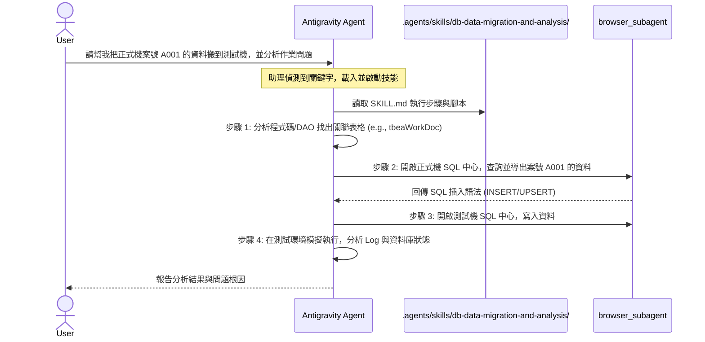

# ERP 系統資料搬移與問題分析技能（Skill）建置計畫書

本計畫書旨在為 **EA 系統** 以及其他 ERP 系統設計一個可複用的 **Antigravity 技能（Workspace Skill）**。此技能將自動化「表格識別、正式機資料提取、測試機資料寫入、系統問題分析」的完整流程，並可隨時套用於不同的系統中。

---

## 運作原理 (How it Works)

Antigravity 具有「漸進式載入（Progressive Disclosure）」機制。當我們在專案中建立客製化技能後，其運作方式如下：



1. **自動識別與載入**：技能放置在專案根目錄的 `.agents/skills/db-data-migration-and-analysis/`。當您對助理說「我要搬移資料」、「提取特定案號」或「分析測試機問題」時，助理會自動識別並載入該技能的 `SKILL.md` 指南。
2. **靜態分析程式結構**：助理根據技能指示，分析工作區（如 `dao/` 目錄下的 `.dao` 或 `.txt` 檔）以找出資料庫表格名稱。
3. **網頁自動化操作**：助理利用瀏覽器代理（`browser_subagent`）操作您提供的 SQL 命令中心網址，進行跨環境的資料查詢與寫入。
4. **流程化驗證**：引導助理以標準化的除錯流程（檢視 Log、比對程式碼、驗證資料庫欄位）分析問題。

---

## 技能目錄結構

我們將在專案根目錄 [ea](file:///d:/CHSBrowser_erp/erpHome/yl.ear/erp.war/ea) 中建立以下目錄結構：

```text
d:/CHSBrowser_erp/erpHome/yl.ear/erp.war/ea/
└── .agents/
    └── skills/
        └── db-data-migration-and-analysis/
            ├── SKILL.md               # 技能核心說明檔（內含 YAML Frontmatter 與步驟指引）
            ├── scripts/
            │   └── migrate_helper.py  # [NEW] 用於輔助解析 DAO 檔案並自動生成遷移 SQL 的 Python 腳本
            └── templates/
                └── sql_templates.json # [NEW] 儲存不同系統的常用查詢與寫入範本
```

---

## 變更項目詳細說明

### 1. 建立技能核心說明檔
#### [NEW] [SKILL.md](file:///d:/CHSBrowser_erp/erpHome/yl.ear/erp.war/ea/.agents/skills/db-data-migration-and-analysis/SKILL.md)
*   **用途**：定義技能的啟動條件與標準作業程序（SOP）。
*   **YAML Frontmatter**：
    ```yaml
    ---
    name: db-data-migration-and-analysis
    description: >-
      當使用者需要跨正式機與測試機搬移特定案號資料，或是需要在測試環境中分析與排查某作業問題時，使用此技能。
      適用於 EA 系統及其他 ERP 子系統。
    ---
    ```
*   **指引內容**：包含 DAO/Table 解析步驟、安全遷移規範（如何處理外鍵約束與舊資料）、以及使用瀏覽器代理操作 SQL 命令中心的具體指令。

### 2. 建立輔助自動化腳本
#### [NEW] [migrate_helper.py](file:///d:/CHSBrowser_erp/erpHome/yl.ear/erp.war/ea/.agents/skills/db-data-migration-and-analysis/scripts/migrate_helper.py)
*   **用途**：
    *   自動解析特定作業所關聯的 `.dao` / `.txt` 定義檔（例如讀取 `table : db.tbeaWorkDoc`），取得實際表格名稱與主鍵。
    *   動態產生用以查詢特定案號的 `SELECT` 語句，以及匯入測試機的 `INSERT`/`UPDATE` 語句。
    *   提供一個通用的 Python 介面，未來可支援其他 ERP 系統的 DAO 格式解析。

---

## 驗證與測試計畫

### 自動化測試
*   使用 Python 執行解析測試：
    ```powershell
    python .agents/skills/db-data-migration-and-analysis/scripts/migrate_helper.py --test
    ```
    驗證是否能正確從 `dao/eajcWorkDoc.dao` 提取出 `db.tbeaWorkDoc` 表格名稱及主鍵。

### 手動驗證流程
1.  **技能啟動驗證**：向助理發送模擬指令，確認助理能成功辨識並啟用 `db-data-migration-and-analysis` 技能。
2.  **連線與搬移驗證**：
    *   在正式機 SQL 中心查詢特定案號，確認資料筆數。
    *   透過助理寫入測試機後，手動在測試機 SQL 中心查詢，確認資料結構與內容完全一致。
3.  **除錯分析驗證**：執行測試機作業，確認助理能根據 Log 與資料庫狀態，準確定位問題原因。

---

## 開放性確認問題

1. **技能存放位置**：是否同意將此技能直接建立在目前 EA 專案的目錄 `.agents/skills/` 下？（後續您若有其他系統，只需將整個 `.agents` 資料夾複製過去即可套用）。
2. **正式與測試 SQL 命令中心的網址**：請提供這兩個環境的 URL，以便我們開始設計瀏覽器的網頁操作流程。
3. **目標案號與要分析的作業名稱**：請提供目前需要處理的案號以及發生問題的程式碼/作業名稱。

---

> [!NOTE]
> 要將此技能複製到公司 NB（筆電）並無縫使用，有以下兩種最推薦的複製方式：

### 方法 A：放入全域設定（推薦 ⭐⭐⭐，所有 ERP 專案皆可共用）

將此技能放在個人的全域設定夾，這樣無論您在公司 NB 開啟 EA、EB、EC 還是其他 ERP 專案，AI 都能隨時取用此技能。

1. **複製來源資料夾：**
    - 複製此資料夾： `d:\CHSBrowser_erp\erpHome\yl.ear\erp.war\ea\.agents\skills\db-data-migration-and-analysis`
2. **貼至公司 NB 的全域路徑：**
    - 貼到公司 NB 的： `C:\Users\<您的使用者名稱>\.gemini\config\skills\db-data-migration-and-analysis\`
    - （_註：若 `skills` 資料夾不存在，可自行建立_）

---

### 方法 B：放入特定專案目錄（專屬該專案）

如果只希望在該 ERP 專案目錄下生效：

1. **複製來源：**
    - 複製整包 `.agents` 資料夾： `d:\CHSBrowser_erp\erpHome\yl.ear\erp.war\ea\.agents`
2. **貼至公司 NB 的專案根目錄：**
    - 貼到公司 NB 專案對應目錄下（例如 `.../ea/.agents`）。

---

### 資料夾內容確認清單

複製過去後，請確認目標資料夾內包含以下結構與檔案：

text

db-data-migration-and-analysis/

├── SKILL.md                   # 核心流程與規範定義

└── scripts/

    └── migrate_helper.py      # DAO 解析與 SQL 自動生成工具

---

### 在公司 NB 上執行此計畫

在公司 NB 開啟 Antigravity IDE 並連上公司內網後，直接對 AI 下達指令即可觸發：

> **範例提示詞：** 「請依照 `db-data-migration-and-analysis` 技能，幫我將作業 `(EAJJRE00N)` 單號 `26Y01M462260821610` 的資料從正式機搬移至測試機，並分析作業問題。」

在公司內網環境下，內網網址（`erp.chsteel.com.tw` 與 `test.chsteel.com.tw`）連線速度將會非常順暢！

---
![[Pasted image 20260825160809.png]]

![[Pasted image 20260825161005.png]]


> [!NOTE]
> 雖然網頁端顯示「Authentication successful」，但終端機端（CLI）仍拋出失敗訊息，這是因為 Google 官方政策已於 2026 年調整。個人 Google 帳號（包含免費版、Google One AI Pro 及 AI Ultra 訂戶）已無法再透過 OAuth 直連舊版 Gemini CLI。

如果你想繼續在 Terminal 使用 AI 工具，建議採取以下替代方案：

**方案一：安裝官方新版 Antigravity CLI（推薦）**

Google 已將個人開發者的 CLI 工作流程轉移至 Antigravity 套件：

1. 前往官方網站 [antigravity.google](https://antigravity.google) 下載並安裝 Antigravity CLI。
    
2. 安裝完成後，直接在 Terminal 執行命令：
    
    Bash
    
    ```
    agy
    ```
    
3. 按照提示登入個人 Google 帳號即可正常使用。
    

**方案二：繼續使用原 Gemini CLI（改用 API Key 驗證）**

如果你希望保留目前的 Gemini CLI 工具，請避開「Sign in with Google」選項：

1. 至 [Google AI Studio](https://aistudio.google.com/) 申請免費或付費的 Gemini API Key。
    
2. 在 Terminal 設定環境變數：
    
    Bash
    
    ```
    export GEMINI_API_KEY="你的_API_KEY"
    ```
    
1. 重新執行 `gemini`，並在選單中選擇 **`2. Use Gemini API Key`** 即可順利通關。

---


> [!NOTE]
> **「只要與 AI 對話或由 AI 思考處理，就一定會消耗 Token；但改用 CLI／腳本方式，Token 消耗量會少數十倍至上百倍，且完全不會觸發配額限制！」**

向您詳細比較兩者的差異：

---

### 1. 為什麼剛才 `browser_subagent` 消耗極快？

- **視覺截圖是 Token 黑洞**：瀏覽器代理每走一步（點擊、輸入、等待），都會截取一張全螢幕高解析度畫面丟給 AI 視覺模型辨識。
- **高頻迴圈**：只要操作三、五分鐘，背後就可能送出了幾十張圖片與大量的上下文分析，相當於**數十萬至上百萬 Token**，因此瞬間將 Google API 的配額用盡（429 錯誤）。

---

### 2. 如果改用 CLI 或本機腳本（例如 Python / cURL / Terminal 指令）：

|比較項目|瀏覽器子代理 (`browser_subagent`)|CLI / 本機腳本方式|
|---|---|---|
|**傳輸內容**|每次操作皆傳送**全螢幕高解析度截圖**|純文字指令與查詢文字|
|**Token 消耗量**|極高（每回合數萬至十幾萬 Token）|**極低（每回合僅數百至千餘 Token，相差 50~100 倍）**|
|**本機完全執行部分**|無|本地 Python/PowerShell 執行時 **Token = 0**|
|**執行速度**|慢（需等待畫面渲染、截圖、重試）|**極快（秒級完成）**|
|**配額限制 (429)**|容易觸發 API 限制|**幾乎不可能超額**|

---

### 3. 建議的最佳實踐

1. **AI 負責產生精準的 CLI 指令 / SQL 腳本**（消耗極少 Token，幾秒鐘完成）。
2. **在終端機（PowerShell / CLI）或手動執行指令**（完全不消耗任何 API Token，且不會出錯）。

這樣既能享受 AI 輔助分析與生成程式碼的便利，又不會浪費任何寶貴的 Token 配額！

---
已為您切換至 **低 Token 消耗的 CLI 模式**！

我已在本機撰寫完成專屬的 CLI 遷移工具：


`migrate_cli.py`。

此工具針對 ERP `dsjjsql.jsp` 進行了最佳化（利用 `dsjjsql.jsp` 內建的 **`Type=3 (INSERT SQL)`** 功能直接產出標準寫入語句），您可以選擇以下任一最省 Token 的方式操作：

---

### 推薦方式 A：利用網頁內建的「INSERT SQL」功能（最快、最直覺）

您目前瀏覽器已經開啟在正式機 `dsjjsql.jsp`，請依下列三步操作：

1. **選擇輸出格式**：在畫面上勾選 **`INSERT SQL`**（第四個選項）。
2. **貼入查詢語法**（可一次貼上）：
    
    sql
    
    SELECT * FROM db.tbeaWorkDoc WHERE WorkDocID = '26S01M462262081511';
    
    SELECT * FROM db.tbeaWorkDocEX WHERE WorkDocID = '26S01M462262081511';
    
    SELECT * FROM db.tbeaAnnotate WHERE WorkDocID = '26S01M462262081511';
    
    SELECT * FROM db.tbeaDocFlow WHERE WorkDocID = '26S01M462262081511';
    
    SELECT * FROM db.tbeaAttach WHERE WorkDocID = '26S01M462262081511';
    
    SELECT * FROM db.tbeaRE00 WHERE formNo = '26S01M462262081511';
    
    SELECT * FROM db.tbeaRE01 WHERE formNo = '26S01M462262081511';
    
    SELECT * FROM db.tbeaRE02 WHERE formNo = '26S01M462262081511';
    
    SELECT * FROM db.tbeaRE03 WHERE formNo = '26S01M462262081511';
    
    SELECT * FROM db.tbeaRE04 WHERE formNo = '26S01M462262081511';
    
    SELECT * FROM db.tbeaRE042 WHERE formNo = '26S01M462262081511';
    
    SELECT * FROM db.tbeaRE043 WHERE formNo = '26S01M462262081511';
    
3. **複製產出的 INSERT 區塊**：
    - 按下「確定」後，頁面下方的文字框會自動生成所有資料表的 `INSERT INTO ...` 語法。
    - 將該文字框內容複製貼回此處，我會為您組合好「測試機一鍵清理與寫入腳本」。
### 推薦方式 B：全自動 CLI 指令（完全不開瀏覽器）

若您想要直接在終端機一鍵抓取正式機資料：

1. 在瀏覽器按 `F12` -> 應用程式 (Application) -> Cookie，取得您的 `JSESSIONID`（例如 `JSESSIONID=abc123xyz`）。
2. 在終端機執行：
    
    powershell
    
    python C:\Users\ch26788\.gemini\config\skills\db-data-migration-and-analysis\scripts\migrate_cli.py --case-id "26S01M462262081511" --cookie "JSESSIONID=您的Cookie值" --output "d:\CHSBrowser_erp\migration.sql"
    
    它會透過本機 HTTP CLI 自動批次提取 12 張表並直接產出可執行的 `migration.sql` 檔案！


![[Pasted image 20260825113730.png]]

這是因為工具在嘗試用 `python -c` 讀取並解碼 Big5 格式的原始檔案內容（例如 `.dao` 檔或舊系統原始碼）時，將編碼後的 Raw Bytes 直接傳給模型，觸發了 Gemini API 的敏感字詞/安全過濾器（Safety Filter）誤判。

你可以透過以下方式繞過這個問題：

**解決方式**

- **引導 AI 寫成實體指令碼檔執行：** 在提示字元（`>`）輸入以下指令，讓 AI 改將內容寫入暫存檔再解析，避免把未處理的原始文字直傳 API：
    
    Plaintext
    
    ```
    請不要用 python -c 直接印出檔案內容，請寫一個 python 腳本檔來讀取並處理 Big5 檔案，只輸出你需要提取的關鍵欄位或結構。
    ```
    
- **手動提供目標檔案結構：** 若 AI 是想了解 `.dao` 檔的結構，你可以直接用 Notepad++ 等文字編輯器開啟該檔案，複製其中 1~2 行關鍵欄位定義貼給 AI 即可。