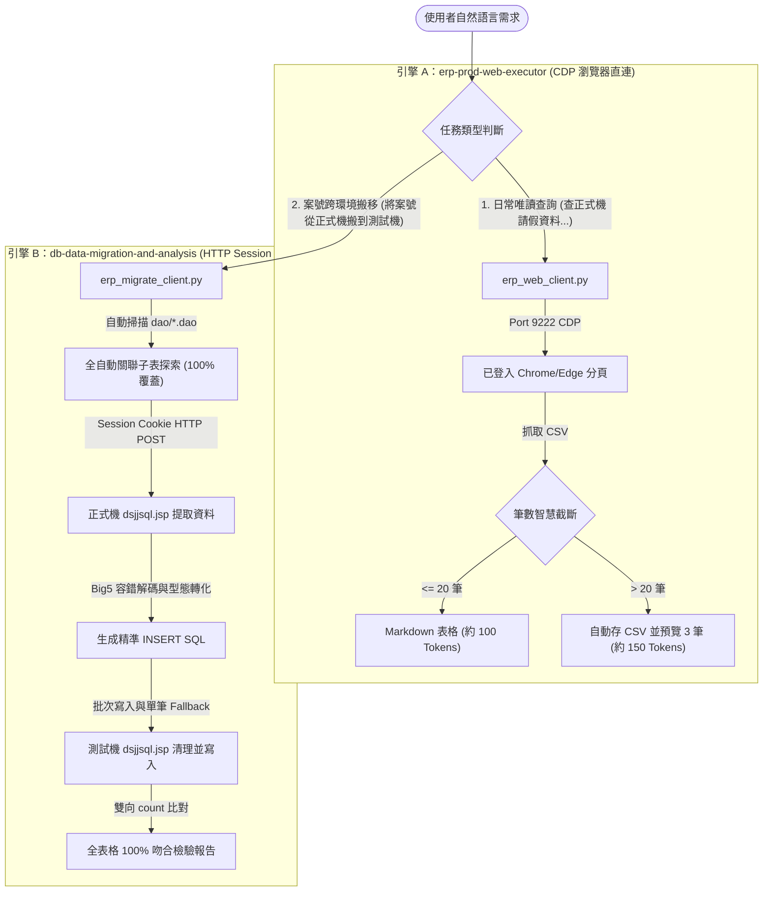

# 🛠️ Antigravity CLI：ERP 正式機查詢與跨環境資料庫遷移技能完整安裝與實戰指南 (Master Skill Guide)

> **文檔定位**：本指南整合了 **`erp-prod-web-executor`（正式機 Web 唯讀查詢）** 與 **`db-data-migration-and-analysis`（跨機資料遷移與診斷）** 兩大技能，並融入今日實戰排查出的**編碼崩潰、新版 HTML 結構、隱藏關聯子表遺漏、批次容錯寫入**等關鍵卡關防坑經驗，是一份可直接發放給團隊同仁、標準化安裝的完整手冊。

---

## 📌 目錄
1. [為什麼同事會做不出來？Token 暴增的四大元兇](#1-為什麼同事會做不出來token-暴增的四大元兇)
2. [系統核心架構：雙引擎運作模式與三大關鍵優勢](#2-系統核心架構雙引擎運作模式與三大關鍵優勢)
3. [實戰卡關問題與防坑避雷大全 (Crucial Pitfalls & Fixes)](#3-實戰卡關問題與防坑避雷大全-crucial-pitfalls--fixes)
4. [標準化一鍵安裝與部署指南 (4 個步驟)](#4-標準化一鍵安裝與部署指南-4-個步驟)
   - [步驟 1：安裝 Python 核心依賴](#步驟-1安裝-python-核心依賴)
   - [步驟 2：部署桌面 AI 連線模式啟動捷徑](#步驟-2部署桌面-ai-連線模式啟動捷徑)
   - [步驟 3：部署核心通用 Python 橋接工具](#步驟-3部署核心通用-python-橋接工具)
   - [步驟 4：在 Antigravity 註冊兩大 Skills](#步驟-4在-antigravity-註冊兩大-skills)
5. [日常操作標準 SOP 與自然語言提示詞範例](#5-日常操作標準-sop-與自然語言提示詞範例)

---

## 1. 為什麼同事會做不出來？Token 暴增的四大元兇

若沒有標準配置此技能，直接對 Antigravity CLI 說「*幫我查正式機 ERP 資料*」，通常會發生以下幾種致命情況，導致 Token 瘋狂燃燒：

| 元兇編號 | 問題現象 | 為什麼會狂耗 Token？ |
| :--- | :--- | :--- |
| 💣 **元兇一** | **沒有定義 Skill 與專屬橋接腳本** | AI 不知道如何連線正式機，於是在背景**盲目嘗試各種無效方案**（寫 Playwright 爬蟲、搜尋整台硬碟找密碼、寫 Java JDBC 連線、反覆重試試錯），每一輪對話都在 Context 中塞滿報錯 log，一次對話就能燒掉數萬 Tokens！ |
| 💣 **元兇二** | **瀏覽器未開啟 9222 遠端調試埠** | 一般直接點開的 Chrome/Edge **並未開放 CDP (Chrome DevTools Protocol) 埠號**。腳本連不上時，AI 會反覆分析錯誤、搜尋本機進程，陷入死循環。 |
| 💣 **元兇三** | **未做查詢結果截斷與自動轉存 CSV** | 正式機查詢若回傳數百或數千筆資料，若未經截斷**直接全部輸出到終端機/Context**，單次查詢就會塞爆 Context（消耗 50,000 ~ 100,000+ Tokens），造成速度極慢甚至 Token 額度瞬間耗盡。 |
| 💣 **元兇四** | **路徑寫死（工號硬編碼）或缺少套件** | 複製他人腳本時，檔案路徑若寫死為他人工號（例如 `C:\Users\ch26358\...`）或未安裝 `websocket-client`，Python 一執行就崩潰，AI 又會花費大量 Token 嘗試除錯。 |

---

## 2. 系統核心架構：雙引擎運作模式與三大關鍵優勢

為兼顧「日常除錯唯讀查詢」的極速免密碼體驗與「跨環境案號搬移」的批次高穩定度，系統設計為雙引擎架構：



### 💡 三大關鍵優勢：
1. **免密碼安全復用**：直接掛載使用者已經在瀏覽器登入好的 Session，不用在腳本或 CLI 中輸入/儲存任何帳號密碼。
2. **零探索 Token**：透過 `SKILL.md` 明確告訴 AI 唯一的執行指令，AI 不會胡思亂想或亂寫爬蟲，探索成本為 0。
3. **智慧筆數截斷**：查詢結果超過 20 筆時，自動轉存本機 CSV 檔案，Context 永遠只接收 3 筆預覽，**將 Token 消耗減少 99%**。

---

## 3. 實戰卡關問題與防坑避雷大全 (Crucial Pitfalls & Fixes)

在實際對接 ERP 系統時，若未處理以下底層細節，會導致 AI 陷入死循環或大量浪費 Token：

### 💣 陷阱 1：`dsjjsql.jsp` 新版 HTML 解析與正則貪婪匹配崩潰
* **問題現象**：查詢明明有資料，但腳本回傳 0 筆或解析失敗。
* **原因剖析**：
  1. 正式機與測試機為新版 Bootstrap / iframe 介面，資料呈現於 `<table id="stockTable" ...>`。
  2. 網頁原始碼內含有 JavaScript 迴圈 `for(var i=0; i<tables.length; i++)`，一般的正則表達式 `<table[^>]*>` 會誤把 `<tables.length` 當作 Table 開始標籤，導致非貪婪匹配提前結束！
* **避坑解法**：正則必須加上單詞邊界 `\b`，並優先鎖定 ID：
  ```python
  m = re.search(r'<table\b[^>]*id=["\']?stockTable["\']?[^>]*>(.*?)</table>', html, re.DOTALL | re.IGNORECASE)
  if not m:
      m = re.search(r'<table\b[^>]*border=["\']?1["\']?[^>]*>(.*?)</table>', html, re.DOTALL | re.IGNORECASE)
  ```

### 💣 陷阱 2：Big5 / CP950 特殊符號與非標準多位元組字元編碼異常
* **問題現象**：提取包含中文備註（如 `M462-20-03-248 評估...`）或特殊圖形符號的資料時，Python 拋出 `UnicodeEncodeError: 'cp950' codec can't encode character '\xaa'` 導致程式中斷。
* **避坑解法**：
  1. 在 `urllib.parse.urlencode` 與 `.encode()` 時，**一律加上 `errors="replace"`**。
  2. 解碼 HTTP 回應時，依序嘗試 `cp950`（搭配 `errors="replace"`）與 `big5`，絕不讓單一特殊字元中斷整個流程。

### 💣 陷阱 3：關聯子表遺漏（如 `tbeaAgreeIDList` 簽核人員清單）
* **問題現象**：搬移完成後，進入測試機網頁畫面發現無法送簽、核決清單空白、或是報出關聯空指標錯誤。
* **原因剖析**：除了業務主檔（如 `tbeaRE00` ~ `tbeaRE13a`）外，公文流程系統包含大量泛用表（`tbeaWorkDoc`、`tbeaAnnotate`、`tbeaDocFlow`、`tbeaDeptFlow`、`tbeaAgreeIDList`、`tbeaReferenceID` 等）。
* **避坑解法**：**全自動 DAO 反查法**！腳本自動掃描 `dao/*.dao` 檔案，提取所有以 `WorkDocID` 或 `formNo` 為欄位的表格，先在正式機進行探測，有資料者自動全數納入搬移清單。

### 💣 陷阱 4：Table 第一欄位為行號序號偏移
* **問題現象**：生成的 SQL 把序號 `1.`、`2.` 誤當作第一個欄位的值，導致型態錯誤。
* **避坑解法**：`stockTable` 的每一行第一格 `<td>` 固定為序號，提取欄位名稱與數值時必須固定切片跳過首欄：`cols = raw_cols[1:]`、`vals = raw_vals[1:]`。

### 💣 陷阱 5：批次寫入過長或單筆語法報錯造成整批中斷
* **問題現象**：一次送出 1,000+ 筆 INSERT 語句時，伺服器可能因 Buffer 或單筆錯誤整批失敗。
* **避坑解法**：採用 **20~50 筆分批發送 + 失敗自動 Fallback 單筆重試** 機制，確保其餘 99.9% 資料能正常寫入，並精確印出失敗的個別語句。

---

## 4. 標準化一鍵安裝與部署指南 (4 個步驟)

任何同仁的新電腦只需依序執行以下 4 個步驟即可完成安裝：

### 步驟 1：安裝 Python 核心依賴
打開 PowerShell 或 CMD 終端機執行：
```powershell
pip install websocket-client
```

---

### 步驟 2：部署桌面 AI 連線模式啟動捷徑
在桌面建立以下兩個啟動批次檔：

#### 1. `C:\Users\您的帳號\Desktop\啟動正式機ERP(AI連線模式).bat` (Chrome)
```bat
@echo off
chcp 65001 >nul
echo 正在啟動 Chrome (AI 連線模式)...
start "" "C:\Program Files\Google\Chrome\Application\chrome.exe" --remote-debugging-port=9222 --user-data-dir="C:\ChromeERPProfile" "http://erp.chsteel.com.tw/erp/ds/jsp/dsjjsql.jsp"
exit
```

#### 2. `C:\Users\您的帳號\Desktop\啟動正式機ERP(Edge連線模式).bat` (Edge)
```bat
@echo off
chcp 65001 >nul
echo 正在啟動 Edge (AI 連線模式)...
start "" "C:\Program Files (x86)\Microsoft\Edge\Application\msedge.exe" --remote-debugging-port=9222 --user-data-dir="C:\EdgeERPProfile" "http://erp.chsteel.com.tw/erp/ds/jsp/dsjjsql.jsp"
exit
```

---

### 步驟 3：部署核心通用 Python 橋接工具

#### 1. 唯讀 CDP 查詢腳本：儲存為 `%USERPROFILE%\erp_web_client.py`
```python
# -*- coding: utf-8 -*-
import sys
import json
import time
import urllib.request
import urllib.error
import urllib.parse
import csv
import io
import os
import websocket

CDP_PORT = 9222
TARGET_URL_KEY = "dsjjsql.jsp"
DEFAULT_ERP_SQL_URL = "http://erp.chsteel.com.tw/erp/ds/jsp/dsjjsql.jsp"

# 動態取得當前使用者的家目錄，避免寫死工號路徑
USER_HOME = os.path.expanduser("~")
OUTPUT_FILE = os.path.join(USER_HOME, "query_output.txt")
EXPORT_DIR = r"D:\temp\query_results" if os.path.exists("D:\\") else os.path.join(USER_HOME, "query_results")

def get_tab_list():
    try:
        url = f"http://127.0.0.1:{CDP_PORT}/json/list"
        req = urllib.request.Request(url, headers={"User-Agent": "Mozilla/5.0"})
        with urllib.request.urlopen(req, timeout=3) as resp:
            return json.loads(resp.read().decode('utf-8'))
    except Exception:
        return None

def create_tab(target_url):
    try:
        url = f"http://127.0.0.1:{CDP_PORT}/json/new?{urllib.parse.quote(target_url, safe=':/?=&')}"
        req = urllib.request.Request(url, headers={"User-Agent": "Mozilla/5.0"}, method="PUT")
        with urllib.request.urlopen(req, timeout=3) as resp:
            return json.loads(resp.read().decode('utf-8'))
    except Exception:
        try:
            url = f"http://127.0.0.1:{CDP_PORT}/json/new?{target_url}"
            with urllib.request.urlopen(url, timeout=3) as resp:
                return json.loads(resp.read().decode('utf-8'))
        except Exception:
            return None

def send_cdp_eval(ws, expression, await_promise=False):
    req_id = int(time.time() * 1000) % 1000000
    msg = {
        "id": req_id,
        "method": "Runtime.evaluate",
        "params": {
            "expression": expression,
            "returnByValue": True,
            "awaitPromise": await_promise
        }
    }
    ws.send(json.dumps(msg))
    
    start_time = time.time()
    while time.time() - start_time < 10:
        raw_res = ws.recv()
        res = json.loads(raw_res)
        if res.get("id") == req_id:
            result_obj = res.get("result", {}).get("result", {})
            return result_obj.get("value")
    return None

def execute_sql_on_web(sql_query, row_limit=0):
    # 1. 唯讀安全防護：正式機僅允許 SELECT / WITH 查詢
    cleaned_sql = sql_query.strip().upper()
    if not (cleaned_sql.startswith("SELECT") or cleaned_sql.startswith("WITH")):
        print("[安全警示] 正式機查詢僅限 SELECT / WITH 唯讀查詢，已攔截執行。")
        return False, "FORBIDDEN_SQL_WRITE"

    # 2. 檢查 CDP 是否可連線
    tabs = get_tab_list()
    if tabs is None:
        print("[錯誤] 無法連線至瀏覽器遠端偵錯埠 (Port 9222)。")
        print("請確認是否已透過桌面「啟動正式機ERP(AI連線模式)」捷徑開啟瀏覽器！")
        return False, "CDP_CONNECTION_ERROR"

    # 3. 尋找或開啟命令中心分頁
    target_tab = None
    for tab in tabs:
        url = tab.get("url", "")
        title = tab.get("title", "")
        if TARGET_URL_KEY in url or "命令中心" in title:
            target_tab = tab
            break

    if not target_tab:
        print(f"[提示] 未發現已開啟的命令中心，正在自動開啟新分頁：{DEFAULT_ERP_SQL_URL}...")
        target_tab = create_tab(DEFAULT_ERP_SQL_URL)
        if not target_tab:
            print("[錯誤] 自動開啟命令中心分頁失敗，請手動在瀏覽器開啟。")
            return False, "FAILED_TO_CREATE_TAB"
        time.sleep(1.5)

    ws_url = target_tab.get("webSocketDebuggerUrl")
    if not ws_url:
        print("[錯誤] 未能取得分頁的 WebSocket 調試位址。")
        return False, "NO_WS_URL"

    # 4. 連線 WebSocket 操控分頁
    try:
        ws = websocket.create_connection(ws_url, timeout=10, suppress_origin=True)
    except Exception as e:
        print(f"[錯誤] 連線分頁 WebSocket 失敗: {e}")
        return False, str(e)

    try:
        escaped_sql = json.dumps(sql_query)
        
        # 注入執行 JavaScript：填入 SQL、選擇 CSV 格式 (Type=1)、提交表單
        js_submit = f'''
        (function() {{
            var sqlArea = document.getElementById('SqlStr') || document.querySelector("textarea[name='SqlStr']");
            if (!sqlArea) return "NO_SQL_FIELD";
            sqlArea.value = {escaped_sql};
            
            var radioCsv = document.querySelector("input[name='Type'][value='1']");
            if (radioCsv) radioCsv.checked = true;
            
            var rowSizeInput = document.querySelector("input[name='RowSize']");
            if (rowSizeInput) rowSizeInput.value = "{row_limit}";
            
            if (document.forms['form1']) {{
                document.forms['form1'].submit();
                return "SUBMITTED";
            }}
            return "NO_FORM";
        }})();
        '''
        
        res = send_cdp_eval(ws, js_submit)
        if res != "SUBMITTED":
            print(f"[警告] 表單提交回傳狀態: {res}")
            if res == "NO_SQL_FIELD":
                return False, "請確認分頁是否處於登入狀態並停留在命令中心頁面。"

        # 等待網頁載入與查詢結果完成（最多等 15 秒）
        time.sleep(1.0)
        max_wait = 15.0
        start_wait = time.time()
        csv_content = None
        err_message = None

        while time.time() - start_wait < max_wait:
            js_check = '''
            (function() {
                var csvArea = document.getElementById('csvData');
                var msgSpan = document.getElementById('msg');
                var msgText = msgSpan ? msgSpan.innerText : '';
                
                if (csvArea && csvArea.value !== undefined) {
                    return { status: 'DONE', data: csvArea.value, msg: msgText };
                }
                
                if (msgText && (msgText.indexOf('錯誤') !== -1 || msgText.indexOf('Error') !== -1 || msgText.indexOf('禁止') !== -1)) {
                    return { status: 'ERROR', msg: msgText };
                }
                
                return { status: 'WAITING', msg: msgText };
            })();
            '''
            check_res = send_cdp_eval(ws, js_check)
            if isinstance(check_res, dict):
                if check_res.get("status") == "DONE":
                    csv_content = check_res.get("data", "")
                    err_message = check_res.get("msg", "")
                    break
                elif check_res.get("status") == "ERROR":
                    err_message = check_res.get("msg", "")
                    break
            time.sleep(0.5)

        ws.close()

        if csv_content is None and err_message:
            return False, f"查詢發生錯誤: {err_message}"
        if csv_content is None:
            return False, "查詢逾時，未能取得結果。"

        return True, csv_content

    except Exception as e:
        ws.close()
        return False, f"執行例外錯誤: {e}"

def parse_and_save_result(csv_raw):
    os.makedirs(EXPORT_DIR, exist_ok=True)
    
    lines = [line for line in csv_raw.strip().splitlines() if line.strip()]
    if not lines:
        print("[結果] 查詢成功，但無符合條件之資料列 (0 rows returned)。")
        with open(OUTPUT_FILE, "w", encoding="utf-8-sig") as f:
            f.write("0 rows returned.")
        return

    reader = csv.reader(io.StringIO(csv_raw))
    rows = list(reader)
    
    total_rows = len(rows)
    print(f"[成功] 共查詢到 {total_rows} 筆資料。")

    with open(OUTPUT_FILE, "w", encoding="utf-8-sig") as f:
        # <= 20 筆：輸出 Markdown 表格直接呈現在對話中
        if total_rows <= 20:
            header = [f"COL_{i+1}" for i in range(len(rows[0]))] if rows else []
            f.write("| " + " | ".join(header) + " |\n")
            f.write("| " + " | ".join(["---"] * len(header)) + " |\n")
            for r in rows:
                f.write("| " + " | ".join([str(c).replace("\n", " ") for c in r]) + " |\n")
            print(f"已將 {total_rows} 筆結果整理為 Markdown 格式輸出。")
        else:
            # > 20 筆：自動匯出 CSV 檔，僅預覽前 3 筆，徹底省 Token
            now_str = time.strftime("%Y%m%d_%H%M%S")
            csv_path = os.path.join(EXPORT_DIR, f"prod_query_{now_str}.csv")
            with open(csv_path, "w", encoding="cp950", errors="replace", newline="") as out_csv:
                writer = csv.writer(out_csv)
                for r in rows:
                    writer.writerow(r)
            
            f.write(f"資料總筆數: {total_rows} 筆（已超過 20 筆限制）\n")
            f.write(f"完整資料已匯出至: {csv_path}\n\n")
            f.write("前 3 筆資料預覽:\n")
            for r in rows[:3]:
                f.write(str(r) + "\n")
            print(f"資料筆數超過 20 筆，已自動匯出 CSV 檔：{csv_path}")

if __name__ == "__main__":
    if len(sys.argv) < 2:
        print('使用方式: python erp_web_client.py "SELECT ..." [row_limit]')
        sys.exit(1)
        
    sql_input = sys.argv[1]
    limit = int(sys.argv[2]) if len(sys.argv) > 2 else 0
    
    success, result = execute_sql_on_web(sql_input, limit)
    if success:
        parse_and_save_result(result)
    else:
        print(f"[執行失敗] {result}")
        with open(OUTPUT_FILE, "w", encoding="utf-8-sig") as f:
            f.write(f"ERROR: {result}")
```

---

#### 2. 全功能跨機搬移腳本：儲存為 `%USERPROFILE%\erp_migrate_client.py`
```python
# -*- coding: utf-8 -*-
"""
ERP DB 跨環境資料搬移全自動工具 (Master Migration Client)
功能：
1. 自動掃描 DAO 定義檔，100% 探索所有主表與關聯子表 (如 tbeaAgreeIDList, tbeaDeptFlow 等)
2. 透過正式機 Session Cookie 提取所有欄位與資料
3. 容錯 Big5/CP950 編碼處理，杜絕特殊符號導致之 UnicodeEncodeError
4. 自動生成反向 DELETE 清理語法與精確 INSERT 語法
5. 支援批次寫入測試機並提供單筆失敗自動 Fallback 容錯重試
6. 雙向 count 比對與驗證報表輸出
"""

import sys
import os
import glob
import argparse
import urllib.parse
import urllib.request
import re
from html import unescape

DEFAULT_DAO_DIR = r"D:\CHSBrowser_erp\erpHome\yl.ear\erp.war\ea\dao"

DEFAULT_TABLES_ORDER = [
    # 流程與公文相關表格 (WorkDocID)
    ("db.tbeaWorkDoc", "WorkDocID"),
    ("db.tbeaWorkDocEX", "WorkDocID"),
    ("db.tbeaAnnotate", "WorkDocID"),
    ("db.tbeaDocFlow", "WorkDocID"),
    ("db.tbeaDeptFlow", "WorkDocID"),
    ("db.tbeaAgreeIDList", "WorkDocID"),
    ("db.tbeaAttach", "WorkDocID"),
    ("db.tbeaReferenceID", "WorkDocID"),
    ("db.tbeaQueryDoc", "WorkDocID"),
    ("db.tbeaAnalyzer", "WorkDocID"),
    # 風險評估明細表格 (formNo)
    ("db.tbeaRE00", "formNo"),
    ("db.tbeaRE01", "formNo"),
    ("db.tbeaRE02", "formNo"),
    ("db.tbeaRE03", "formNo"),
    ("db.tbeaRE04", "formNo"),
    ("db.tbeaRE042", "formNo"),
    ("db.tbeaRE043", "formNo"),
    ("db.tbeaRE13", "formNo"),
    ("db.tbeaRE13a", "formNo"),
]

def load_dao_column_types(dao_dir):
    table_col_types = {}
    if not os.path.exists(dao_dir):
        return table_col_types

    for dao_file in glob.glob(os.path.join(dao_dir, "*.dao")):
        content = ""
        for enc in ['cp950', 'big5', 'utf-8', 'latin-1']:
            try:
                with open(dao_file, 'r', encoding=enc) as f:
                    content = f.read()
                break
            except UnicodeDecodeError:
                pass
        if not content:
            continue
        
        tbl_m = re.search(r'table\s*:\s*(\S+)', content, re.IGNORECASE)
        if not tbl_m:
            continue
        tbl_name = tbl_m.group(1).strip().upper()
        
        col_map = {}
        in_fields = False
        for line in content.splitlines():
            line_str = line.strip()
            if not line_str or line_str.startswith("---") or line_str.startswith("==="):
                continue
            if line_str.startswith("#Field"):
                in_fields = True
                continue
            if line_str.startswith("#Meta"):
                in_fields = False
                continue
            if in_fields:
                if line_str.startswith("#"):
                    continue
                parts = re.split(r'\s+', line_str)
                if len(parts) >= 2:
                    col_name = parts[0].strip().upper()
                    data_type = parts[1].strip().lower()
                    col_map[col_name] = data_type
        table_col_types[tbl_name] = col_map
    return table_col_types

def send_sql_http(url, cookie, sql_str, limit="10000"):
    cookie_str = cookie if cookie.startswith("JSESSIONID=") else f"JSESSIONID={cookie}"
    headers = {
        "User-Agent": "Mozilla/5.0 (Windows NT 10.0; Win64; x64)",
        "Cookie": cookie_str,
        "Content-Type": "application/x-www-form-urlencoded; charset=cp950"
    }
    data = {
        "SqlStr": sql_str,
        "Type": "0",
        "recordLimit": str(limit),
        "Submit": "確定"
    }
    encoded_data = urllib.parse.urlencode(data, encoding="cp950", errors="replace").encode("cp950", errors="replace")
    req = urllib.request.Request(url, data=encoded_data, headers=headers)
    try:
        with urllib.request.urlopen(req, timeout=45) as resp:
            raw = resp.read()
            return raw.decode("cp950", errors="replace")
    except Exception as e:
        print(f"[-] HTTP 連線失敗: {e}", file=sys.stderr)
        return None

def parse_html_table(html_text):
    if not html_text:
        return [], []
    m = re.search(r'<table\b[^>]*id=["\']?stockTable["\']?[^>]*>(.*?)</table>', html_text, re.DOTALL | re.IGNORECASE)
    if not m:
        m = re.search(r'<table\b[^>]*border=["\']?1["\']?[^>]*>(.*?)</table>', html_text, re.DOTALL | re.IGNORECASE)
    if not m:
        return [], []
    rows = re.findall(r'<tr\b[^>]*>(.*?)</tr>', m.group(1), re.DOTALL | re.IGNORECASE)
    if len(rows) < 2:
        return [], []
    
    raw_cols = [re.sub(r'<[^>]+>', '', c).strip() for c in re.findall(r'<td\b[^>]*>(.*?)</td>', rows[0], re.DOTALL | re.IGNORECASE)]
    cols = raw_cols[1:]
    
    data_rows = []
    for r in rows[1:]:
        raw_vals = [unescape(re.sub(r'<[^>]+>', '', c).strip()) for c in re.findall(r'<td\b[^>]*>(.*?)</td>', r, re.DOTALL | re.IGNORECASE)]
        vals = raw_vals[1:]
        if vals and len(vals) == len(cols):
            data_rows.append(vals)
    return cols, data_rows

def scan_all_related_tables(dao_dir, case_id, prd_url, prd_cookie):
    if not os.path.exists(dao_dir):
        print(f"[提示] 未發現 DAO 目錄，使用預設 19 張表格清單進行探索...")
        active_tables = []
        for tbl, key_col in DEFAULT_TABLES_ORDER:
            html = send_sql_http(prd_url, prd_cookie, f"SELECT * FROM {tbl} WHERE {key_col} = '{case_id}';")
            cols, rows = parse_html_table(html)
            active_tables.append((tbl, key_col, len(rows), cols, rows))
        return active_tables

    print("[+] 正在自動掃描 dao/*.dao 定義檔以發現全部關聯子表...")
    found_tables = []
    checked = set()
    
    for f in glob.glob(os.path.join(dao_dir, "*.dao")):
        with open(f, 'r', encoding='big5', errors='ignore') as fp:
            content = fp.read()
        tbl_m = re.search(r'table\s*:\s*(\S+)', content, re.IGNORECASE)
        if not tbl_m:
            continue
        tbl = tbl_m.group(1).strip()
        if tbl.upper() in checked:
            continue
        checked.add(tbl.upper())
        
        has_workdoc = bool(re.search(r'\bworkdocid\b', content, re.IGNORECASE))
        has_formno = bool(re.search(r'\bformno\b', content, re.IGNORECASE))
        
        key_col = "WorkDocID" if has_workdoc else ("formNo" if has_formno else None)
        if not key_col:
            continue
            
        html = send_sql_http(prd_url, prd_cookie, f"SELECT * FROM {tbl} WHERE {key_col} = '{case_id}';")
        cols, rows = parse_html_table(html)
        if rows:
            found_tables.append((tbl, key_col, len(rows), cols, rows))
            print(f"    -> 發現表格 {tbl:28} ({key_col}='{case_id}') : {len(rows):4d} 筆資料")
            
    return found_tables

def build_insert_sqls(table_name, cols, data_rows, dao_types):
    type_map = dao_types.get(table_name.upper(), {})
    inserts = []
    for vals in data_rows:
        val_strs = []
        for col_name, v in zip(cols, vals):
            col_type = type_map.get(col_name.upper(), "string")
            if col_type in ['int', 'integer', 'long', 'short', 'float', 'double', 'decimal', 'number', 'numeric']:
                val_strs.append(v if (v != '' and v is not None) else 'NULL')
            else:
                v_esc = v.replace("'", "''")
                val_strs.append(f"'{v_esc}'")
        ins = f"INSERT INTO {table_name} ({', '.join(cols)}) VALUES ({', '.join(val_strs)});"
        inserts.append(ins)
    return inserts

def get_exact_row_count(url, cookie, table, key_col, case_id):
    html = send_sql_http(url, cookie, f"SELECT * FROM {table} WHERE {key_col} = '{case_id}';")
    cols, rows = parse_html_table(html)
    return len(rows)

def execute_migration(case_id, prd_url, prd_cookie, test_url, test_cookie, dao_dir):
    print("=" * 75)
    print(f" ERP DB 跨環境資料自動遷移作業 - 案號: {case_id}")
    print(f" 正式機: {prd_url}")
    print(f" 測試機: {test_url}")
    print("=" * 75)
    
    dao_types = load_dao_column_types(dao_dir)
    discovered_tables = scan_all_related_tables(dao_dir, case_id, prd_url, prd_cookie)
    
    total_extracted = sum(t[2] for t in discovered_tables)
    print(f"\n[+] 掃描完成！共有 {len(discovered_tables)} 張表格包含案號資料，總計 {total_extracted} 筆記錄。")
    
    # 步驟 1: 清理測試機舊資料 (依反向順序)
    print("\n--- [步驟 1: 清理測試機既有舊資料] ---")
    for tbl, key_col, count, cols, rows in reversed(discovered_tables):
        del_sql = f"DELETE FROM {tbl} WHERE {key_col} = '{case_id}';"
        send_sql_http(test_url, test_cookie, del_sql)
        print(f"  -> 清理 {tbl:28} [OK]")
        
    # 步驟 2: 寫入正式機資料 (分批 + Fallback)
    print("\n--- [步驟 2: 寫入正式機資料至測試機] ---")
    total_success = 0
    total_fail = 0
    
    for tbl, key_col, count, cols, rows in discovered_tables:
        if count == 0:
            continue
        inserts = build_insert_sqls(tbl, cols, rows, dao_types)
        print(f"  -> 正在寫入 {tbl:28} (共 {len(inserts):4d} 筆)...", end="", flush=True)
        
        batch_size = 20
        tbl_success = 0
        tbl_fail = 0
        for i in range(0, len(inserts), batch_size):
            batch = inserts[i:i+batch_size]
            batch_sql = ";\r\n".join(batch) + ";"
            res = send_sql_http(test_url, test_cookie, batch_sql)
            
            if res and ("error" in res.lower() or "exception" in res.lower() or "sqlcode" in res.lower()):
                for s_sql in batch:
                    r_single = send_sql_http(test_url, test_cookie, s_sql)
                    if r_single and ("error" in r_single.lower() or "exception" in r_single.lower()):
                        tbl_fail += 1
                    else:
                        tbl_success += 1
            else:
                tbl_success += len(batch)
                
        print(f" 完成 (成功: {tbl_success}, 失敗: {tbl_fail})")
        total_success += tbl_success
        total_fail += tbl_fail
        
    # 步驟 3: 驗證筆數
    print("\n--- [步驟 3: 雙向 100% 筆數比對驗證報告] ---")
    print(f"{'資料表 (Table)':28} | {'正式機 (PRD)':12} | {'測試機 (TEST)':12} | {'比對結果':8}")
    print("-" * 68)
    
    all_matched = True
    for tbl, key_col, prd_cnt, cols, rows in discovered_tables:
        test_cnt = get_exact_row_count(test_url, test_cookie, tbl, key_col, case_id)
        status = "一致 [OK]" if prd_cnt == test_cnt else "不一致 [FAIL]"
        if prd_cnt != test_cnt:
            all_matched = False
        print(f"{tbl:28} | {prd_cnt:10d} 筆 | {test_cnt:10d} 筆 | {status}")
        
    print("-" * 68)
    if all_matched and total_fail == 0:
        print(f"[SUCCESS] 遷移作業圓滿成功！所有表格資料 100% 完整吻合 (共 {total_success} 筆)。")
    else:
        print(f"[WARNING] 部分表格存在差異或失敗，請檢查上述報告！")
    print("=" * 75)

def main():
    parser = argparse.ArgumentParser(description="ERP DB Master Migration Client")
    parser.add_argument("--case-id", required=True, help="Document/Case ID (e.g. 26S01M462262081511)")
    parser.add_argument("--prd-url", default="http://erp.chsteel.com.tw/erp/ds/jsp/dsjjsql.jsp", help="Production dsjjsql URL")
    parser.add_argument("--prd-cookie", required=True, help="Production Session Cookie")
    parser.add_argument("--test-url", default="http://test.chsteel.com.tw/erp/ds/jsp/dsjjsql.jsp", help="Test dsjjsql URL")
    parser.add_argument("--test-cookie", required=True, help="Test Session Cookie")
    parser.add_argument("--dao-dir", default=DEFAULT_DAO_DIR, help="DAO definitions directory")
    
    args = parser.parse_args()
    execute_migration(args.case_id, args.prd_url, args.prd_cookie, args.test_url, args.test_cookie, args.dao_dir)

if __name__ == "__main__":
    main()
```

---

### 步驟 4：在 Antigravity 註冊兩大 Skills

#### 1. 註冊 `erp-prod-web-executor`
檔案位置：`%USERPROFILE%\.gemini\config\skills\erp-prod-web-executor\SKILL.md`

````markdown
---
name: erp-prod-web-executor
description: 透過 Chrome DevTools Protocol (CDP) 直連已登入的 ERP 網頁命令中心 (dsjjsql.jsp)，安全執行正式機 IBM DB2 資料庫唯讀 SQL 查詢。
---

# ERP 正式機網頁 SQL 執行器 (瀏覽器 Session 整合)

本技能直接掛載使用者已登入的 ERP 瀏覽器分頁 Session，安全執行正式環境的資料庫查詢，並提取結構化資料以供即時分析與程式碼除錯。

## 核心功能

1. **正式機 Session 安全復用**：直接以使用者已登入的身分執行 SQL，無須輸入或儲存任何帳號密碼。
2. **唯讀安全防護機制**：強制僅允許執行 `SELECT` / `WITH` 語法，嚴格禁止任何異動正式機資料的語法。
3. **自動探索命令中心分頁**：自動尋找並掛載現有 `dsjjsql.jsp` 分頁（若無則自動開啟新分頁）。
4. **結構化資料解析**：將網頁輸出自動轉換為乾淨的 Markdown 表格或 Excel CSV 檔案。

## ⚠️ 資料呈現與 Token 節省規則

- **小資料集（<= 20 筆）**：直接在對話中以 Markdown 表格呈現。
- **大資料集（> 20 筆）**：
  - **自動匯出**：自動轉存為本機 CSV 檔至 `D:\temp\query_results\prod_query_YYYYMMDD_HHMMSS.csv`（CP950 編碼）。
  - **精簡摘要**：在對話中僅顯示前 3 筆資料預覽，並提供本機 CSV 檔案路徑，節省 99% Token 消耗。

## 🚀 唯一執行指令

```powershell
python "%USERPROFILE%\erp_web_client.py" "YOUR_SQL_QUERY"
```

執行結果會寫入 `%USERPROFILE%\query_output.txt`。請讀取此檔案並將結果回報給使用者。
````

---

#### 2. 註冊 `db-data-migration-and-analysis`
檔案位置：`%USERPROFILE%\.gemini\config\skills\db-data-migration-and-analysis\SKILL.md`

````markdown
---
name: db-data-migration-and-analysis
description: >-
  當使用者需要識別特定作業相關表格、跨正式機與測試機搬移特定案號資料，或是需要在測試環境中分析與排查某作業問題時，使用此技能。
  適用於 EA 系統及其他 ERP 子系統。
---

# 資料庫資料遷移與問題分析指南 (DB Data Migration & Analysis Guide)

本指引定義了如何精準識別特定作業相關表格、跨環境全自動安全遷移案號資料，並於測試環境重現及診斷系統問題。

---

## 執行流程 (SOP)

### 步驟一：精準識別作業相關表格 (雙軌探索機制)
1. **軌道 1（業務模組定位）**：
   * 依使用者提供的作業代碼（如 `EAJJRE00N`）或畫面，於 `eaStructs.xml` 或 `dao/` 定義檔找出業務主檔（如 `tbeaRE00` ~ `tbeaRE13a`）。
2. **軌道 2（全自動公文流程子表探測）**：
   * 執行全自動 DAO 掃描，找出所有外鍵包含 `WorkDocID` 或 `formNo` 的泛用流程表（如 `tbeaWorkDoc`、`tbeaAgreeIDList`、`tbeaDocFlow`、`tbeaDeptFlow`、`tbeaAnnotate`、`tbeaAttach` 等），並先於正式機探測筆數，確保零遺漏。

### 步驟二：執行全自動跨機資料遷移 (使用 erp_migrate_client.py)
優先使用本機標準遷移工具，透過正式機與測試機的 `JSESSIONID` 一鍵完成提取、型態轉換、測試機清理與批次寫入：

```powershell
python "%USERPROFILE%\erp_migrate_client.py" --case-id "案號/文件編號" --prd-cookie "JSESSIONID=正式機Cookie" --test-cookie "JSESSIONID=測試機Cookie"
```

> **底層防護機制**：
> 1. **Big5 容錯**：以 `errors="replace"` 處理特殊中文與圖形符號，避免 `UnicodeEncodeError`。
> 2. **批次防崩潰**：每 20 筆批次發送，遇語法異常自動 Fallback 單筆重試。
> 3. **反向清理**：寫入前自動依相依性反向執行 `DELETE`，避免測試機 Primary Key 衝突。

### 步驟三：雙向 100% 筆數核對驗證
遷移完成後，必須產出各表的 `SELECT count(*)` 比對報表，確認正式機筆數與測試機筆數 **100% 完全一致**。

### 步驟四：測試環境問題排查與診斷
1. 於測試環境登入並開啟該案號畫面，重現異常現象。
2. 透過 `erp_web_client.py` 查詢更新後的測試機欄位狀態值。
3. 比對 Java Controller / DAO 商業邏輯，定位問題根因並進行修復。
````

---

## 5. 日常操作標準 SOP 與自然語言提示詞範例

### 模式 A：日常正式機唯讀查詢 (CDP 免密碼模式)
1. 雙擊桌面 **`啟動正式機ERP(AI連線模式).bat`** 並登入 ERP。
2. 對 Antigravity CLI 發出自然語言：
   * 「*幫我查正式機 `db.tbeaWorkDoc` 最近 5 筆資料*」
   * 「*查詢員工 26788 於 8 月份的請假紀錄*」

### 模式 B：案號跨環境完整遷移 (PRD ➔ TEST)
1. 在對話中發出指令：
   * 「*請依照 db-data-migration-and-analysis 技能，幫我將作業 (EAJJRE00N) 文件編號 26S01M462262081511 從正式機搬移至測試機。*」
2. 提供正式機與測試機的 Session Cookie（`JSESSIONID`）。
3. AI 自動完成全表掃描、資料提取、寫入測試機並提供 100% 筆數比對報告。
