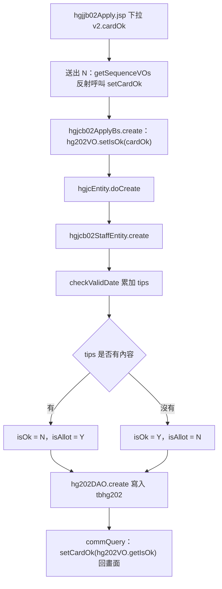

# (HGJJB02) 承攬商工作證申請作業：明細 cardOk（是否核准）取得方式分析

- 分析日期：2026-10-01
- 分析範圍：`hg` 模組原始碼，以及 `WEB-INF/lib/de.jar` 框架反組譯（javap）
- 說明：本文件依原始碼靜態分析整理，未在畫面上實際操作驗證。

---

## 一、結論

明細行的 `cardOk`（是否核准）**不是畫面選了什麼就存什麼**。

1. 畫面下拉選的值會帶進後端，Bs 也會先把它放進 `tbhg202.isOk`。
2. 但寫入資料庫前，`hgjcb02StaffEntity.create()／update()` 會呼叫 `checkValidDate()` 重新判斷，並**強制覆寫** `isOk`。
3. 存檔後重新查詢，再把 `tbhg202.isOk` 回填到 `cardOk` 顯示在畫面上。

所以在新增和修改時，畫面上的「核准／不核准」下拉其實只有顯示作用。

---

## 二、cardOk 的資料定義

| 項目 | 說明 |
|---|---|
| 宣告位置 | [hgjctb102VO.java:1144](src/com/icsc/hg/dao/hgjctb102VO.java) `private String cardOk;` |
| 性質 | 不是資料表欄位，是額外加的暫存屬性；沒有在建構子初始化，預設為 `null` |
| 實際對應 | `tbhg202.isOk`（申請明細：是否核准） |
| 容易混淆 | `tbhg102.isOk` 是「是否禁止進入」，意思不同 |
| 為什麼放在 102 VO | 明細表格 v2 的 VO 是 `hgjctb102VO`（人員資料），需要借 `cardOk` 把 202 的核准結果帶到畫面 |

---

## 三、新增（N）完整流程



| 步驟 | 位置 | 說明 |
|---|---|---|
| 1. 畫面欄位 | [hgjjb02Apply.jsp:150](jsp/hgjjb02Apply.jsp) | `<de:select property="v2.cardOk" src="de.Option" option="Y=核准;N=不核准" hideValue="true"/>`，欄位名稱為 `cardOk{seq}_v2` |
| 2. 新增空白列 | `html/de/dejtab09New.jss` 的 `insertRows()` | 複製最後一列，對 select 執行 `cObj.val("")`。選項裡沒有空值，依 jQuery 的行為，新列的下拉會變成沒有選取，送出時不帶這個欄位（推論，未實測） |
| 3. 挑選人員 | [hgjjGuestIdSelect.jsp](jsp/hgjjGuestIdSelect.jsp) | 只回填 `idNo`、`name` 兩個 input，不會動 cardOk |
| 4. 轉成 VO | [hgjcb02Apply.java:221](src/com/icsc/hg/controller/hgjcb02Apply.java) | `infoIn.getSequenceVOs("v2","box",true)`，由框架 `dejcWebObjConverter.fillObjAttribute()` 依參數名稱用反射呼叫 `setCardOk()`（不是走 VO 的 `getFromReq()`，那裡沒有 cardOk）。有選值就帶入，沒選就是 `null` |
| 5. Bs 先放入 202 | [hgjcb02ApplyBs.java:145](src/com/icsc/hg/bs/hgjcb02ApplyBs.java) | `hg202VO.setIsOk(hg102VO.getCardOk())`，`null` 會被 `hgjctb202VO.setIsOk()` 轉成空字串 |
| 6. Entity 覆寫 | [hgjcb02StaffEntity.java:68-83](src/com/icsc/hg/entity/hgjcb02StaffEntity.java) | 呼叫 `checkValidDate()` 後依結果重設 `isOk`／`isAllot`，第 5 步的值被蓋掉 |
| 7. 讀回顯示 | [hgjcb02Apply.java:949](src/com/icsc/hg/controller/hgjcb02Apply.java) `commQuery()` | `hg202DAO.findByMasterKey()` 取明細，再 `hg102VO.setCardOk(hg202VO.getIsOk())` |

### 修改（M）

[hgjcb02ApplyBs.java:239](src/com/icsc/hg/bs/hgjcb02ApplyBs.java) 先 `setIsOk("Y")`，再呼叫 `doUpdate()`。`hgjcb02StaffEntity.update()`（:117-133）用同一套規則重算，畫面的 cardOk 完全沒有用到。

### Entity 覆寫邏輯

```java
// hgjcb02StaffEntity.create() / update()
this.checkValidDate(hg202VO);
if (!this.msg.equals("") || !this.tips.equals("")) {
    hg202VO.setIsAllot("Y");
    hg202VO.setIsOk("N");   // 不核准
} else {
    hg202VO.setIsAllot("N");
    hg202VO.setIsOk("Y");   // 核准
}
```

---

## 四、checkValidDate 的呼叫鏈（往上）

```
hgjcb02Apply.create()                         controller/hgjcb02Apply.java:223
 └ hgjcb02ApplyBs.create()                    bs/hgjcb02ApplyBs.java:145-148
    └ hgB02Entity.doCreate(hg202VO)           Entity 在 Bs.initialDAO() 第 83 行建立：
       │                                      hgjcEntityFactory.getb02StaffEntity(dsCom, con)
       └ hgjcEntity.doCreate()                entity/hgjcEntity.java:72（父類別範本方法）
          ├ create_validate()                 檢查 202 是否已存在
          └ create()                          hgjcb02StaffEntity.java:68
             └ checkValidDate(hg202VO)        :71
```

修改：`doUpdate()` → `update()` → `checkValidDate()`（:120）。

### 共用同一個 Entity 的入口

以下程式都透過 `hgjcEntityFactory.getb02StaffEntity()` 取得 Entity，都會套用同一套規則：

| 程式 | 用途 |
|---|---|
| [bs/hgjcb02ApplyBs.java:83](src/com/icsc/hg/bs/hgjcb02ApplyBs.java) | B02 新增／修改 |
| [bs/hgjcb11ApplyBs.java:81](src/com/icsc/hg/bs/hgjcb11ApplyBs.java) | B11 |
| [api/hgjcb02ApplyEC.java:160](src/com/icsc/hg/api/hgjcb02ApplyEC.java) | 廠商端 EC 申請 |
| [api/hgjcb02StaffEC.java:106](src/com/icsc/hg/api/hgjcb02StaffEC.java) | 廠商端 EC 人員 |
| [controller/hgjcb02Staff.java:397](src/com/icsc/hg/controller/hgjcb02Staff.java) | B02 人員明細維護 |
| [controller/hgjcb11Staff.java:199](src/com/icsc/hg/controller/hgjcb11Staff.java) | B11 人員明細維護 |
| [upload/hgjcB02Upload.java:54](src/com/icsc/hg/upload/hgjcB02Upload.java) | B02 上傳 |
| [upload/hgjcB11Upload.java:54](src/com/icsc/hg/upload/hgjcB11Upload.java) | B11 上傳 |

> B03、B04、C01 各有自己的 `private checkValidDate()`（例如 `hgjcb03StaffEntity.java:134`），跟這個方法是不同的實作。

---

## 五、checkValidDate 引用的程式（往下）

DAO 在 `hgjcb02StaffEntity.initialDAO()`（:54-65）建立，並傳入 Bs 的 `con`，所以跟新增是同一個交易，查得到同一交易中剛寫入的資料。

| 段落 | 引用程式 | 查詢內容 | 查不到時 | 結果 |
|---|---|---|---|---|
| 0. 上傳資料跳過 | `hg202VO.getValidDateS()` | 起日為空就 `return` | — | — |
| 1. 核發期限 | `hg201DAO.findByPKExp(applyId)`（[hgjctb201DAO.java:95](src/com/icsc/hg/dao/hgjctb201DAO.java)） | 202 起日早於 201 起日，**而且** 202 迄日晚於 201 迄日 | 丟 `dejcNotFoundException`，沒有接住，往上拋 | 累加 `tips` |
| 2. 人事基本資料 | `hg102DAO.findByPK(idNo)`（[hgjctb102DAO.java:81](src/com/icsc/hg/dao/hgjctb102DAO.java)） | `tbhg102` 是否有此人 | 回傳 `null`，程式自行丟例外 | 直接 throw，中斷交易 |
| 3. 停權期間 | `hg303DAO.findBySql(sql)`（[hgjctb303DAO.java:501](src/com/icsc/hg/dao/hgjctb303DAO.java)），`hgjctb303VO.getStartDateCF()／getEndDateCF()` | `tbhg303` 停權期間與核發期限重疊 | 丟 `dejcNotFoundException`，被 catch 吃掉 | 累加 `tips` |
| 4. 已有其他證件 | `hg202DAO.getBySql(sql)`（[hgjctb202DAO.java:657](src/com/icsc/hg/dao/hgjctb202DAO.java)），`hgjctb206VO.STATUS_D01`（= `"D01"`，發證、製卡完成），`getValidDateSCF()／getValidDateECF()` | 同一人在**其他申請單**有重疊期限，狀態為空白或 D01，且 `cardSrl` 不為空 | 丟 `dejcNotFoundException`，被 catch 吃掉 | 累加 `tips` |

### 規則總覽

`checkValidDate()`（[hgjcb02StaffEntity.java:147-202](src/com/icsc/hg/entity/hgjcb02StaffEntity.java)）依序執行下面五段，**每一段都會執行，不會因為前一段已經有 tips 就停下來**（規則 2 丟例外的情況除外）。規則 1、3、4 的訊息會串接在同一個 `tips` 字串裡。

| 規則 | 名稱 | 程式行號 | 性質 | 成立時的結果 | 畫面看得到嗎 |
|---|---|---|---|---|---|
| 0 | 上傳資料跳過 | 148-149 | 前置判斷 | 直接 `return`，後面都不檢查 | 否 |
| 1 | 核發期限超出申請單 | 151-161 | 軟性檢核 | 累加 `tips` → isOk = N | 否（只寫 log） |
| 2 | 人事基本資料必須存在 | 162-172 | **硬性檢核** | **丟例外，整筆交易回復** | **是**（訊息列） |
| 3 | 停權期間重疊 | 173-183 | 軟性檢核 | 累加 `tips` → isOk = N | 否（只寫 log） |
| 4 | 已有其他有效證件 | 185-197 | 軟性檢核 | 累加 `tips` → isOk = N | 否（只寫 log） |
| — | 結尾 | 198-201 | 記錄 | `tips` 有內容就 `msger.logInfo(tips)` | 否 |

> **軟性檢核**：不會擋住存檔，只會讓這個人被標成不核准（isOk = N、isAllot = Y）。
> **硬性檢核**：直接中斷，整張申請單（包含剛建立的 201 主檔）都不會存進去。

---

### 規則 0：上傳資料跳過檢核

```java
if (hg202VO.getValidDateS().equals("")) // 來自上傳的資料
    return;
```

| 項目 | 說明 |
|---|---|
| 目的 | 上傳進來的資料沒有核發期限，無法比較期間，所以不檢核 |
| 判斷條件 | 202 的核發起日 `validDateS` 是空的 |
| 成立時 | 直接結束，**連 `tips = ""` 都不會執行** |
| B02 新增時 | Bs 一定會把 201 的起迄日填進 202（Bs:143-144），所以不會成立 |
| 注意 | 因為沒有清空 tips，Entity 實體被重複使用時，可能沿用上一筆的 tips（見第七節第 4 點） |

---

### 規則 1：核發期限超出申請單之核發期限

```java
this.tips = "";
if (this.msg.equals("")) {
    hgjctb201VO hg201VO = this.hg201DAO.findByPKExp(hg202VO.getApplyId());
    if (hg202VO.getValidDateS().compareTo(hg201VO.getValidDateS()) < 0
            && hg202VO.getValidDateE().compareTo(hg201VO.getValidDateE()) > 0) {
        this.tips += hg202VO.getIdNo() + "核發期限超出申請單之核發期限!!";
    }
}
```

| 項目 | 說明 |
|---|---|
| 目的 | 人員的核發期限不可以超出申請單（主檔）的核發期限 |
| 資料來源 | `tbhg201` 申請主檔，用 `hg201DAO.findByPKExp(applyId)` 取得 |
| 判斷條件 | 202 起日 **早於** 201 起日，**而且** 202 迄日 **晚於** 201 迄日（日期字串比較，格式為西元 yyyyMMdd） |
| 成立時 | `tips` 加上 `{身分證號}核發期限超出申請單之核發期限!!` |
| 查不到 201 | `findByPKExp` 丟 `dejcNotFoundException`，沒有被接住，整筆交易失敗。新增時 201 已在同一交易中建立，正常情況下查得到 |
| 外層 `if (msg.equals(""))` | msg 永遠是空字串，這個判斷一定成立，沒有作用 |
| 實際效果 | **新增時不會成立**：202 的起迄日是直接從 201 複製過來的，兩者相同 |
| 疑慮 | 條件用 `&&`，必須「兩端都超出」才算。只有起日提早、或只有迄日延後的情況都不會被抓到；依訊息字面意思，應該是 `\|\|` 才合理 |
| 歷史註解 | 157-159 行被註解掉的程式：RQ11408014 原本打算「承租（APPLYTYPE_91）不檢核」，目前沒有作用 |

---

### 規則 2：人事基本資料必須存在（唯一的硬性檢核）

```java
// 判斷是否有人事基本資料tbhg102有資料
try {
    hgjctb102VO hg102 = this.hg102DAO.findByPK(hg202VO.getIdNo());
    if (hg102 == null) {
        msger.logInfo(hg202VO.getIdNo() + "無此人事基本資料!!");
        throw new dejcMyException(hg202VO.getIdNo() + "無此人事基本資料!!");
    }
} catch (Exception ex) {
    msger.logInfo(hg202VO.getIdNo() + "讀取人事基本資料異常!!");
    throw new dejcMyException(hg202VO.getIdNo() + "讀取人事基本資料異常!!");
}
```

| 項目 | 說明 |
|---|---|
| 目的 | 申請明細的人員必須先存在於人員基本資料檔，避免產生沒有基本資料的工作證 |
| 資料來源 | `tbhg102` 人員基本資料，用 `hg102DAO.findByPK(idNo)` 取得（[hgjctb102DAO.java:81](src/com/icsc/hg/dao/hgjctb102DAO.java)） |
| DAO 行為 | `findByPK` 查不到時**回傳 `null`，不會丟例外**（跟 `findByPKExp` 不同），所以程式要自己判斷 null |
| 判斷條件 | 查不到這個身分證號（null），或查詢時發生任何例外（例如 SQL 錯誤） |
| 成立時 | 丟 `dejcMyException`，**不寫 tips，也不會繼續檢查規則 3、4** |
| 跟其他規則的差別 | 規則 1、3、4 只會讓人員變成「不核准」，規則 2 會讓**整張申請單存不進去** |

**例外往上傳遞的路徑（以 B02 新增為例）：**

```
checkValidDate()               丟出 dejcMyException
 └ hgjcb02StaffEntity.create()  沒有接住
    └ hgjcEntity.doCreate()     沒有接住
       └ hgjcb02ApplyBs.create() 沒有接住（外層只 catch 查 202 的 dejcNotFoundException）
          └ hgjcb02Apply.create() catch (Exception ex)
               ├ handleTransacException(ex, de301)  → rollback，連同剛新增的 201 主檔一起回復
               └ infoOut.setMessage(ex.getMessage()) → 畫面訊息列顯示錯誤
```

**畫面上實際看到的訊息：**

| 實際原因 | 預期訊息 | 實際顯示 |
|---|---|---|
| tbhg102 沒有這個人 | `{身分證號}無此人事基本資料!!` | `{身分證號}讀取人事基本資料異常!!` |
| 查詢時 SQL 錯誤 | `{身分證號}讀取人事基本資料異常!!` | `{身分證號}讀取人事基本資料異常!!` |

> **問題**：第一個 `throw` 寫在 `try` 裡面，馬上被同一段的 `catch (Exception ex)` 接住，改丟「讀取人事基本資料異常」。所以使用者**永遠看不到「無此人事基本資料」**，兩種原因無法分辨。log 裡會同時出現兩行訊息，要查 log 才知道是哪一種。
>
> **修正方向**：改成只 catch 非 `dejcMyException` 的例外，或把 null 判斷移到 try 外面。

**什麼情況會遇到：**

- 畫面上的身分證號欄位是 `readonly`，只能透過人員挑選視窗（`hgjjGuestIdSelect.jsp`，資料來源就是 `tbhg102`）選人，所以正常操作下幾乎不會發生。
- 可能發生的情況：人員資料在挑選之後、存檔之前被刪除；或是透過 EC 廠商端、其他入口直接送入不存在的身分證號。

---

### 規則 3：核發期限與停權期間重疊

```java
try {
    Vector vec303 = this.hg303DAO.findBySql(
        "select * from db.tbhg303 where startDate<='" + hg202VO.getValidDateE()
        + "' and endDate>='" + hg202VO.getValidDateS() + "' and idNo='" + hg202VO.getIdNo() + "' ");
    if (vec303.size() > 0) {
        hgjctb303VO hg303Data = (hgjctb303VO) vec303.get(0);
        this.tips += hg202VO.getIdNo() + "於" + hg303Data.getStartDateCF() + "~"
                   + hg303Data.getEndDateCF() + "是停權期間!!";
    }
} catch (dejcNotFoundException ex) {
    // 查無資料
}
```

| 項目 | 說明 |
|---|---|
| 目的 | 被停權的人員，停權期間內不可以核發工作證 |
| 資料來源 | `tbhg303` 停權資料，用 `hg303DAO.findBySql(sql)` 查詢（[hgjctb303DAO.java:501](src/com/icsc/hg/dao/hgjctb303DAO.java)） |
| 判斷條件 | 同一身分證號，停權期間與本次核發期限**有任何一天重疊** |
| 成立時 | `tips` 加上 `{身分證號}於{停權起日}~{停權迄日}是停權期間!!`（日期用 `getStartDateCF()／getEndDateCF()` 轉成民國格式） |
| 查不到 | `findBySql` 查無資料時丟 `dejcNotFoundException`，被 catch 吃掉，視為通過 |
| 注意 | `size() > 0` 一定成立（查無資料已經丟例外）；有多段停權重疊時只顯示第一段 |

**期間重疊的判斷方式：**

```sql
select * from db.tbhg303
 where startDate <= '本次核發迄日'   -- 停權開始得比核發結束早
   and endDate   >= '本次核發起日'   -- 停權結束得比核發開始晚
   and idNo = '身分證號'
```

```
核發期限：          |=========|
停權（重疊）：   |======|               ← 成立
停權（重疊）：               |=====|    ← 成立
停權（包住）：  |====================|  ← 成立
停權（不重疊）：|==|                     ← 不成立
```

> 原本的寫法是用 Java 逐日檢查（`checkValidDate()` 後半段被註解掉的程式）。RQ11408014 因為承租工作證的期限會跨年度、期間太長，改用 SQL 判斷期間重疊。

---

### 規則 4：已有其他有效證件（不重複發證）

```java
try {
    Vector vec202 = this.hg202DAO.getBySql(
        "select * from db.tbhg202 where validDateS<='" + hg202VO.getValidDateE()
        + "' and validDateE>='" + hg202VO.getValidDateS() + "' and idNo='" + hg202VO.getIdNo() + "' "
        + "and status in ('','" + hgjctb206VO.STATUS_D01 + "') and applyId<>'" + hg202VO.getApplyId()
        + "' and cardSrl<>'' ");
    if (vec202.size() > 0) {
        hgjctb202VO hg202Data = (hgjctb202VO) vec202.get(0);
        this.tips += hg202VO.getIdNo() + "於" + hg202Data.getValidDateSCF() + "~"
                   + hg202Data.getValidDateECF() + "已有證件,不重覆發證(此員不會產生證號)";
    }
} catch (dejcNotFoundException ex) {
    // 查無資料
}
```

| 項目 | 說明 |
|---|---|
| 目的 | 同一個人在同一段期間已經有工作證，就不再重複發證 |
| 資料來源 | `tbhg202` 申請明細，用 `hg202DAO.getBySql(sql)` 查詢（[hgjctb202DAO.java:657](src/com/icsc/hg/dao/hgjctb202DAO.java)） |
| 判斷條件 | 以下四個條件**同時成立**（見下表） |
| 成立時 | `tips` 加上 `{身分證號}於{證件起日}~{證件迄日}已有證件,不重覆發證(此員不會產生證號)` |
| 查不到 | `getBySql` 查無資料時丟 `dejcNotFoundException`，被 catch 吃掉，視為通過 |
| 注意 | `size() > 0` 一定成立；有多張證件重疊時只顯示第一張 |

| 條件 | SQL | 意義 |
|---|---|---|
| 期間重疊 | `validDateS <= 本次迄日 and validDateE >= 本次起日` | 跟規則 3 相同的重疊判斷 |
| 同一人 | `idNo = 身分證號` | — |
| 證件仍有效 | `status in ('', 'D01')` | 空白（尚未有狀態）或 `D01`（發證、製卡完成）。常數借用 `hgjctb206VO.STATUS_D01`；`E05` 過期等其他狀態不算 |
| 其他申請單 | `applyId <> 本申請單號` | 排除自己這張申請單 |
| 已配發卡號 | `cardSrl <> ''` | 已經有卡片流水號，代表真的有實體證件 |

> 訊息裡的「此員不會產生證號」，是指這個人因為 isOk = N，後續製證流程不會配發新的證號。

---

### 規則執行結果彙整

| 情境 | tips 內容 | isOk | isAllot | 存檔 |
|---|---|---|---|---|
| 全部通過 | 空 | Y | N | 成功 |
| 規則 1 成立 | `…核發期限超出申請單之核發期限!!` | N | Y | 成功 |
| 規則 3 成立 | `…是停權期間!!` | N | Y | 成功 |
| 規則 4 成立 | `…已有證件,不重覆發證(此員不會產生證號)` | N | Y | 成功 |
| 規則 3、4 同時成立 | 兩段訊息串接 | N | Y | 成功 |
| 規則 2 成立 | （不寫 tips） | — | — | **失敗，整張單回復** |
| 規則 0 成立（上傳） | 不清空，沿用上一次的值 | 依殘留 tips 而定 | 依殘留 tips 而定 | 成功 |

---

## 六、結果如何傳回 create／update

`checkValidDate()` 沒有回傳值，靠兩個成員欄位傳遞結果：

| 欄位 | 宣告位置 | 實際狀況 |
|---|---|---|
| `msg` | 父類別 [hgjcEntity.java:26](src/com/icsc/hg/entity/hgjcEntity.java) `protected String msg = ""` | 在 `hgjcb02StaffEntity` 中**從來沒被賦值**，永遠是空字串 |
| `tips` | 子類別 [hgjcb02StaffEntity.java:28](src/com/icsc/hg/entity/hgjcb02StaffEntity.java) `public String tips = ""` | 唯一真正有作用的判斷依據，可用 `getTips()`（:250）取得 |

- `create()` 的條件實際上等於「`tips` 有內容 → `isOk = N`、`isAllot = Y`」。
- Bs 只檢查 `getMsg()`（永遠是空），所以 tips **不會讓交易失敗**，只會讓這個人被標成不核准。
- `checkValidDate()` 最後的 `msger.logInfo(tips)` 只寫 log，不會顯示在畫面上。

---

## 七、發現的問題與注意事項

| # | 問題 | 位置 | 影響 |
|---|---|---|---|
| 1 | 畫面下拉 cardOk 在新增／修改時不影響結果 | Bs:145、Bs:239、Entity:70-78 | 承辦人手動改成「不核准」沒有作用；如果需求是讓承辦人手動否決，目前做不到 |
| 2 | 新增列的下拉被 `val("")` 清成沒有選取 | `dejtab09New.jss` | 新列看起來像沒填；因為 Entity 會覆寫，不影響存檔結果 |
| 3 | 規則 2 的錯誤訊息被蓋掉 | Entity `checkValidDate()` 人事基本資料段 | 「無此人事基本資料」在同一個 try 裡被 `catch (Exception)` 接住，改丟「讀取人事基本資料異常」，使用者看不到真正原因 |
| 4 | tips 可能帶到下一筆 | Entity `checkValidDate()` 開頭 | Bs 共用一個 Entity 實體；`tips = ""` 寫在 `validDateS` 為空就 return 之後，上傳資料可能沿用上一筆的 tips，被誤判成 N。B02 新增時一定有填起日，不會遇到 |
| 5 | 規則 1 在新增時不會成立 | Bs:143-144 | Bs 把 201 的起迄日原封不動抄到 202；而且條件用 `&&`，要兩端都超出才算，可能不是原本的意思 |
| 6 | `if (msg.equals(""))` 判斷沒有作用 | Entity 規則 1 | msg 永遠是空字串 |
| 7 | `size() > 0` 判斷多餘 | Entity 規則 3、4 | 這兩個 DAO 查不到資料時直接丟例外，只要有回傳一定大於 0 |
| 8 | 只記錄第一筆衝突 | Entity 規則 3、4 | 只取 `vec.get(0)` 組訊息，有多段重疊時只顯示第一段 |
| 9 | `isAllot` 用法跟註解不一致 | `hgjctb202VO` 註解為「已製證」 | 不核准時設成 `Y`；`commQuery()` 算核定人數的條件是 `isOk='Y' && isAllot='N' && cardSrl<>''`，修改時要一起看 |
| 10 | 廠商端 EC 寫法相同 | [hgjcb02ApplyEC.java:187](src/com/icsc/hg/api/hgjcb02ApplyEC.java) | 一樣先放 cardOk，再交給同一個 Entity 覆寫；B03、B11 的 Bs 也是同樣模式 |

---

## 八、相關檔案一覽

| 類別 | 檔案 |
|---|---|
| JSP | [jsp/hgjjb02Apply.jsp](jsp/hgjjb02Apply.jsp)、[jsp/hgjjGuestIdSelect.jsp](jsp/hgjjGuestIdSelect.jsp) |
| Controller | [src/com/icsc/hg/controller/hgjcb02Apply.java](src/com/icsc/hg/controller/hgjcb02Apply.java) |
| Bs | [src/com/icsc/hg/bs/hgjcb02ApplyBs.java](src/com/icsc/hg/bs/hgjcb02ApplyBs.java) |
| Entity | [src/com/icsc/hg/entity/hgjcb02StaffEntity.java](src/com/icsc/hg/entity/hgjcb02StaffEntity.java)、[src/com/icsc/hg/entity/hgjcEntity.java](src/com/icsc/hg/entity/hgjcEntity.java)、[src/com/icsc/hg/entity/hgjcEntityFactory.java](src/com/icsc/hg/entity/hgjcEntityFactory.java) |
| DAO／VO | `hgjctb102VO`、`hgjctb102DAO`、`hgjctb201DAO`、`hgjctb202VO`、`hgjctb202DAO`、`hgjctb206VO`、`hgjctb303VO`、`hgjctb303DAO`（皆在 `src/com/icsc/hg/dao/`） |
| 前端框架 | `erp.war/html/de/dejtab09New.jss` |
| 後端框架 | `WEB-INF/lib/de.jar`：`com.icsc.dpms.de.structs.dejcWebInfoIn`、`dejcWebObjConverter` |
| 資料表 | `tbhg102` 人員基本資料、`tbhg201` 申請主檔、`tbhg202` 申請明細、`tbhg303` 停權資料 |
