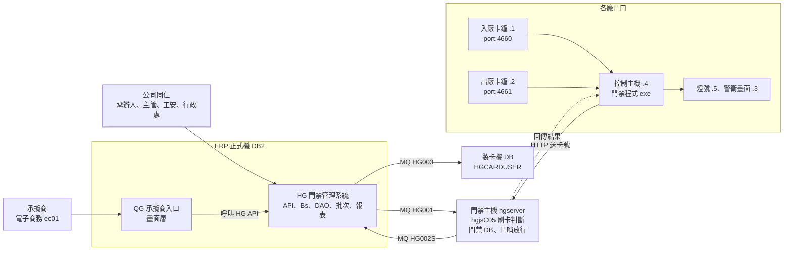
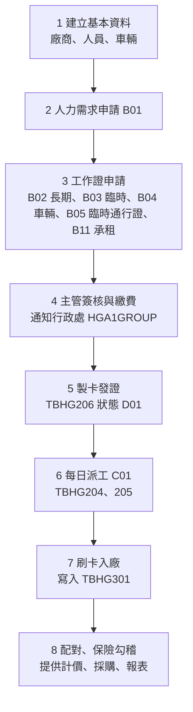
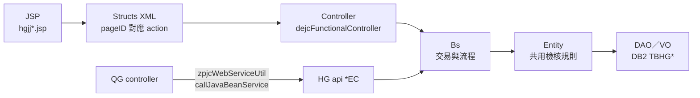
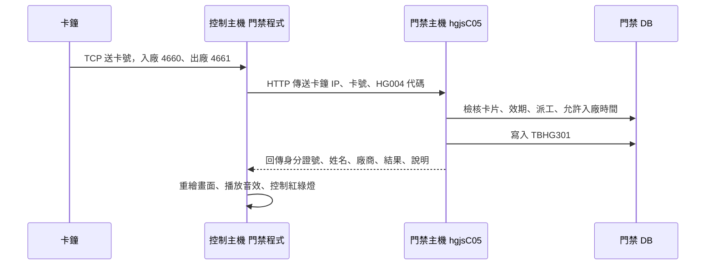

# HG／QG 門禁系統新進人員教育訓練

> [!info] 教材說明
> 本教材從業務、系統架構、資料表、刷卡硬體一路講到維運排障，帶你完整認識 HG 門禁系統與 QG 承攬商入口。讀完後，你應該能獨立回答使用者的常見問題，也知道遇到異常時要從哪裡開始查。
>
> - HTML 版（瀏覽器閱讀，含互動功能）：[HG_QG門禁系統新進人員教育訓練.html](file:///D:/專業知識/HG/HG_QG門禁系統新進人員教育訓練.html)
> - 相關筆記：[[(chatGPT)HG功能規格手冊]]、[[(chatGPT)QG功能規格手冊]]、[[HGJJB02_cardOk核准判斷分析]]

> [!warning] 關於帳號密碼
> 交接資料夾中記有部分主機、FTP、VNC 的帳號密碼。本教材刻意不列出，請向主管或系統負責人索取，並妥善保管，不要寫進任何會分享出去的文件。

---

## 01 課程導覽

### 為什麼要有這套系統
承攬商人員進廠施工前，必須確認身分、證件效期、保險、工安訓練與當日派工。系統在門口刷卡的瞬間，用畫面、聲音、燈號即時告訴警衛「這個人可不可以進廠」。

### 它影響誰
刷卡資料會提供給「計價系統」與「採購系統」，用於承攬商計價與扣款，也是勞檢報表與保險勾稽的依據。**刷卡資料正確是首要之務。**

### 學習目標
1. 說出證件申請到刷卡入廠的完整流程。
2. 看懂申請單狀態碼與主要資料表。
3. 理解刷卡機、門禁主機、ERP、製卡機之間的資料流。
4. 依異常訊息判斷問題落在哪一段。

### 名詞速查

| 名詞 | 說明 |
|---|---|
| **HG** | ERP 內部的「門禁管理與承攬商安全衛生管理系統」，給公司同仁（承辦人、主管、行政處、工安、警衛）使用。程式位於 `erp.war/hg`。 |
| **QG** | 承攬商電子商務（EC）入口模組，讓承攬商自行維護基本資料並提出申請。程式位於 `erp.war/qg`，後端大量呼叫 HG 的 API。 |
| **門禁主機（hgserver）** | 獨立的門禁 ERP 主機（`hgserver.chsteel.com.tw`），接收各廠刷卡並即時判斷，執行 `hgjsC05` servlet。 |
| **控制主機（IPC）** | 各廠門口的電腦，執行「門禁程式 .exe」：接收卡鐘送來的卡號、轉送門禁主機、控制螢幕、聲音與紅綠燈。 |
| **卡鐘** | 門口的刷卡感應機，入廠與出廠各一台。 |
| **製卡機** | 行政處製作工作證卡片的設備，資料庫 schema 為 `HGCARDUSER`。 |
| **MQ** | 2022 年起取代舊 DI 的資料傳輸中介軟體，負責 ERP、門禁主機、製卡機三方的資料同步。 |
| **派工** | 承攬商每天提報當天要進廠的人員名單；沒有派工，即使有工作證也可能無法入廠。 |

### 程式命名慣例

| 前綴 | 意義 | 範例 |
|---|---|---|
| `hgjj`／`qgjj` | JSP 畫面 | `hgjjb02.jsp`（長期工作證申請） |
| `hgjc`／`qgjc` | Java 類別（controller、Bs、DAO、批次） | `hgjcb02Apply.java` |
| `hgjs` | Servlet | `hgjsC05`（刷卡判斷） |
| `hgjctbNNN` | 對應資料表 `TBHGNNN` 的 VO／DAO | `hgjctb201VO` ↔ `DB.TBHG201` |
| `IHGxx` | ERP 選單作業代碼 | `IHGCD` 人員出入廠記錄查詢、`IHGBJ` 出入證基本資料維護 |

畫面代碼中的英文字母代表功能群組，例如 `b` 是證件申請、`c` 是派工與門哨、`g` 是工安稽查，詳見第 04 章。

---

## 02 系統全貌



*圖 2-1　系統架構與資料流（IP 結尾數字以各廠第一台刷卡機為例）*

### HG 與 QG 的分工
- **QG**：承攬商的入口。承攬商在這裡維護自家的廠商、人員、車輛資料，提出人力需求、工作證、臨時工作證、車輛通行證申請，並查詢與列印。
- **HG**：公司內部的完整系統。除了提供 QG 所有功能的後端邏輯，還包含簽核、製證、派工、門哨放行、高風險作業、工安稽查、罰單、證照、教育訓練、報表與排程。
- 簡單說：**QG 是畫面，HG 是大腦。** 修改 QG 的功能，常常要一起看 HG 的 API。

### 要記得的網址

| 用途 | 網址 |
|---|---|
| ERP 正式機 | 公司同仁使用 HG 作業 |
| 電子商務（QG） | `https://ec01.chsteel.com.tw/erp/ds/jsp/dsjjeip.jsp` |
| 門禁主機（警衛門哨放行） | `http://hgserver.chsteel.com.tw/erp/ds/jsp/dsjjeip.jsp` |
| MQ 管理 | `http://10.125.248.21:8999/ezomq/login` |

---

## 03 業務流程與狀態碼



1. **建立基本資料**：承攬商在 QG（或同仁在 HG）建立廠商（TBHG101）、人員（TBHG102，含照片）、車輛（TBHG103）資料。人員照片必須是 .jpg，檔名為身分證號。
2. **人力需求申請（B01）**：依合約或訂購單提報需求人數與工作期間，主管可線上核准、退回或擬准。
3. **工作證申請**：建立申請主檔 TBHG201，以及明細 TBHG202（人員）或 TBHG203（車輛），送出後進入主管簽核。
4. **簽核與繳費**：主管審批通過後，狀態轉為已核准，系統自動通知行政處（群組 `HGA1GROUP`）製證。
5. **製卡發證**：行政處用製卡機製卡，出入證資料寫入 TBHG206，狀態為 D01（發證）。
6. **每日派工（C01）**：承攬商填寫當天的派工名單（TBHG204／205）。派工地點必須與刷卡地點一致。
7. **刷卡入廠**：在門口卡鐘刷卡，門禁主機即時判斷可否入廠，並寫入出入紀錄 TBHG301。臨時人員由警衛在「門哨放行作業」換證放行。
8. **後續應用**：刷卡紀錄經排程配對（TBHG402）與保險勾稽後，提供給計價、採購與各類報表使用。

### 申請單狀態（TBHG201.status）

| 代碼 | 常數 | 意義 |
|---|---|---|
| `A00` | STATUS_VENDADD | 廠商建立中（承攬商在 QG 建立，尚未提交） |
| `A01` | STATUS_INITIAL | 承辦人尚未送出 |
| `B01` | STATUS_BOSS | 主管審批中 |
| `B02` | STATUS_APPR | 已核准 |
| `C01` | STATUS_FEE | 繳費中 |
| `D01` | STATUS_CARD | 發證 |
| `X01` | STATUS_REJECT | 不核准 |
| `X02` | STATUS_NOCARD | 不製證 |

### 出入證狀態（TBHG206.status）

| 代碼 | 意義 | 由誰改變 |
|---|---|---|
| `D01` | 發證（製卡完成） | 製證流程 |
| `E01` | 繳回 | 證件狀態管制（hgjjb06）或出入證基本資料維護（IHGBJ） |
| `E02` | 遺失 | 同上 |
| `E03` | 毀損 | 同上 |
| `E04` | 註銷 | 同上 |
| `E05` | 過期 | 排程 `HGCARDPASSCK` 每天 6:00 自動更新 |

卡別（TBHG206.cardType）：`02` 是長期工作證，`03` 是臨時工作證。卡片完整碼的規則是 `cardSrl = cardId || '0' || year`。

### 各類申請會更新哪些資料表

| 申請類別 | 主檔 | 明細 | 基本資料 |
|---|---|---|---|
| 長期工作證 | TBHG201 | TBHG202 | TBHG102 |
| 臨時工作證 | TBHG201 | TBHG202 | TBHG102 |
| 車輛通行證 | TBHG201 | TBHG203 | TBHG103 |
| 臨時入廠 | TBHG201 | TBHG202 | TBHG102 |
| 派工 | TBHG201 | TBHG204 | TBHG205 |

---

## 04 HG 功能地圖

HG 依英文字母分成九大功能群組，所有畫面都在 `erp.war/hg/jsp/`。

| 群組 | 功能 | 主要畫面 |
|---|---|---|
| **A** | 基本資料 | `hgjja01` 廠商、`hgjja02` 承攬商人員（含辦證紀錄、停權黑名單）、`hgjja03` 進廠車輛、`hgjja04` 關懷信、`hgjja05` 課長工作內容清單 |
| **B** | 證件申請與審核 | `hgjjb01` 人力需求、`hgjjb02` 長期工作證、`hgjjb03` 人員臨時工作證、`hgjjb04` 車輛通行證、`hgjjb05` 臨時通行證、`hgjjb06` 證件繳回／遺失／毀損／註銷、`hgjjb07～09` 查詢、`hgjjb10` 出入證基本資料維護、`hgjjb11` 承租工作證 |
| **C** | 派工與門哨放行 | `hgjjc01` 派工申請（可 Excel 匯入）、`hgjjc02` 派工臨時通行證查詢、`hgjjc03` 門哨放行（派工放行、換證、繳證）、`hgjjc06` 臨時通行證維護查詢、`hgjjc07` 出入放行歷史查詢 |
| **F** | 高風險作業 | `hgjjf01` 設定、`hgjjf02` 每日提報與簽核（可產製高雄市勞動檢查處、中區職安中心報表）、`hgjjf03` 稽查與安全照護、`hgjjf04` 每日維護 |
| **G／N** | 工安稽查與罰單 | `hgjjg01` 稽查登錄與缺失送簽、`hgjjg02` 水平展開追溯、`hgjjg04` 矯正措施登錄結案、`hgjjg05` 違規罰單與扣款（連動計價）、`hgjjg06` 改善照片上傳、`hgjjn01／n02` 承攬商稽查矯正 |
| **K** | 證照與 SOP | `hgjjk01` 安全工作程序（SJP）、`hgjjk02` 特殊作業證照（堆高機、天車、缺氧作業主管等）效期追蹤與過期預警 |
| **S** | 刷卡與保險 | `hgjjs01` 刷卡資料匯入與補登，比對每日進廠人員的投保狀態；`hgjjs00` 系統簡易代碼維護 |
| **T** | 教育訓練 | `hgjjt001` 課程基本資料、`hgjjt002` 訓練名冊匯入、證書字號、複訓通知 |
| **R** | 報表 | `HGR00010` 車證過期、`HGR00020` 承攬商駕照到期、`HGR00050` 罰單查詢、`HGR00060` 臨時工作證統計、`HGR00070` 稽核核准逾七天未送矯正單 |

> [!tip] Excel 整批上傳格式
> 各申請畫面的上傳範本放在 `D:/專業知識/HG/HG交接/HG/所有申請畫面之EXCEL上傳格式/`：HG001 人力需求、HG002 車證、HG003 長期工作證、HG004 允許入廠時間、HG005 臨時工作證、HG006 臨時通行證。.odt 檔無法上傳，會出現 `Invalid header signature`，請另存為 Excel。

---

## 05 QG 承攬商入口

QG 是承攬商看到的畫面，資料範圍只限於登入者自己的承攬商編號。

| 功能群組 | 主要頁面 | 後端服務（HG） |
|---|---|---|
| 廠商基本資料 | `qgjja01Company.jsp` | `hgjca01CompanyEC` |
| 人員基本資料 | `qgjja02List／Staff.jsp` | `hgjca02StaffEC`（照片轉成 Base64 後上傳） |
| 車輛基本資料 | `qgjja03List／Vehicle.jsp` | `hgjca03VehicleEC` |
| 人力需求申請 | `qgjjb01Apply.jsp` | `hgjcb01ApplyEC`、`hgjctb201DAO` |
| 工作證申請 | `qgjjb02Apply／Staff.jsp` | `hgjcb02ApplyEC`、`hgjcb02StaffEC` |
| 臨時工作證申請 | `qgjjb03Apply／Staff.jsp` | `hgjcb03ApplyEC`、`hgjcb03StaffEC` |
| 車輛通行證申請 | `qgjjb04Apply／Vehicle.jsp` | `hgjcb04Apply`、`hgjcb04Vehicle` |
| 查詢與列印 | `qgjjb07List`、`qgjjb08List` | `hgjcb07Rpt`、`hgjcb08Rpt` |
| SJP 與證照 | `qgjjk01*`、`qgjjk02*` | `hgjctb109DAO`、`hgjctb110DAO` |
| 稽查與矯正 | `qgjjn01List／Detail.jsp` | `hgjctb209DAO`、`hgjcn01Rpt` |

### QG 的 action flag
JSP 送出的 action 由 `config/yl/qg/qgStructs.xml` 對應到 controller 的 method。如果有設定 validate method，會先執行檢核，再執行主要 method。

| Flag | Method | 說明 |
|---|---|---|
| `I` | query | 查詢 |
| `C` | clean | 清空 |
| `N` | insert／create | 新增 |
| `R` | update／recall | 修改或撤回（依功能而定） |
| `M` | modify | 修改申請 |
| `D` | delete | 刪除 |
| `S` | sent | 送出申請 |
| `P` | print | 列印報表 |
| `U` | upload | 上傳照片或附件 |
| `CNF` | confirm | 稽查矯正確認 |
| `CNL` | cancel | 取消確認 |
| `CA` | clearAll | 清除批次選取 |

> [!note] 已知事項：三個沒有實作的頁面設定
> `qgStructs.xml` 中的 `qgjjb02Copy`、`qgjjb03Copy`、`qgjjb01B`（Approve），找不到對應的 JSP 或 controller。以下是 2026-10-02 查 CVS 紀錄的結果：
> - `qgjjb02Copy` 在 1.4 版（2024/03/27）加入；`qgjjb03Copy` 和 `qgjjb01B` 在 1.6 版（2024/05/08）加入。兩次提交的說明都是空白。
> - 對應的六個 QG 檔案（三支 JSP、三支 controller），在 CVS 的 `qg` 與 `hg` 模組都完全沒有紀錄，存放已刪除檔案的 Attic 也沒有。這表示它們從來沒有提交過，不是被刪掉。
> - HG 有名稱對應、而且還在使用中的檔案：`hgjjb01Approve`、`hgjjb02Copy`、`hgjjb03Copy`，以及 `hgjcb01Approve`、`hgjcb02Copy`、`hgjcb03Copy`。其中兩個 QG 設定的 controller 寫的是 `com.icsc.hg.controller` 這個 package，類別名稱卻以 `qg` 開頭。
>
> 結論（2026-10-02 確認）：QG 選單沒有用到這三個頁面。它們只是 2024 年從 HG 複製設定時，留在 `qgStructs.xml` 裡沒刪掉的設定，QG 版的「複製申請」和「人力需求核准」並沒有實作。目前決定保留這些設定，暫時不刪除；看到這三個 pageID 時，不必去找對應的程式。另外，`qgjcb02Apply` 裡也沒有 XML 所設定的 `all` method。

---

## 06 資料表與系統設定

| 資料表 | 名稱 | 重點 |
|---|---|---|
| `TBHG001` | 評核批示資料檔 | 簽核紀錄，`forKey` 為申請單號 |
| `TBHG101` | 廠商基本資料檔 | QG 端對應的是 `TBQG101` |
| `TBHG102` | 人員基本資料檔 | 身分證號為主鍵；這張表的 `isOk` 意思是「是否禁止進入」 |
| `TBHG103` | 車輛基本資料檔 | `compNo` 為所屬廠商 |
| `TBHG104` | 廠商工程協調人 | 廠商的明細資料 |
| `TBHG201` | 申請資料主檔 | `applyId`、`status`、`nextOp`、`dwMsg` |
| `TBHG202` | 申請人員明細檔 | `isOk` 是「是否核准」，由系統規則重新計算（見第 12 章） |
| `TBHG203` | 申請車輛明細檔 | |
| `TBHG204／205` | 派工申請人員／派工人員 | 刷卡時判斷「有無派工」的依據 |
| `TBHG206` | 出入證基本資料檔 | 卡號 `cardId`、卡別 `cardType`、狀態、使用範圍 `userange` |
| `TBHG301` | 人員車輛出入紀錄檔 | **刷卡紀錄**，由 hgjsC05 寫入 |
| `TBHG302` | 臨時證件換發紀錄 | 門哨換證（hgjcc03A／B） |
| `TBHG303` | 人員停權紀錄檔 | 申請時會檢核停權期間 |
| `TBHG402` | 人員車輛出入配對檔 | 排程把 301 的進、出紀錄配對起來 |
| `TBHG109／110／209` | SJP／證照／稽查矯正 | schema 為 `HG` |
| `HGCARDUSER.PERSON` | 製卡機人員資料 | 透過 MQ HG003 同步，含照片路徑與版次 `ver` |

### 簡易表格（DB.TBDE23）的重要設定

**HGSETTING**

| 欄位 | 正式機 ERP | 門禁主機 |
|---|---|---|
| DiQueue | `HG001` | `HG002S` |
| isDI | Y | Y |
| URL（照片位置） | `images/hg/` | `images\hg\` |
| fromURL（整批上傳來源） | `Z:\photo\` | `Z:\photo\` |

**HG004 入廠地點**
- 每一個刷卡地點在簡易代碼 `HG004` 裡都有一筆代碼，控制主機 `setup.txt` 的第八行填的就是這個代碼。
- **新增刷卡地點時，正式機 ERP 和門禁主機的 HG004 都要加上相同的代碼。**
- 通知行政處製證的人員名單，設定在群組 `HGA1GROUP`（`DB.TBDSGF`／`DB.TBDSG1`）。

---

## 07 程式架構

HG 採用中鴻 ERP 的標準框架，另外多了一層 Entity，用來放共用的商業規則。



### 原始碼目錄（`erp.war/hg/src/com/icsc/hg/`）

| 路徑 | 內容 |
|---|---|
| `controller/` | 畫面的 controller，例如 `hgjcb02Apply` |
| `bs/` | Business Service，負責處理交易，例如 `hgjcb02ApplyBs` |
| `entity/` | 共用規則，例如 `hgjcb02StaffEntity.checkValidDate()` |
| `api/` | 給 QG／電子商務呼叫的服務，類別名稱以 `EC` 結尾 |
| `dao/` | `hgjctbNNNVO`／`DAO`，狀態常數定義在 VO 裡 |
| `di/` | 資料拋送（Publish）與接收（ShiftBatch） |
| `rpt/`、`report/` | 報表產製 |
| `upload/` | Excel 整批上傳 |
| 根目錄的 `hgjc*.java` | 定時排程批次（見第 10 章） |

其他相關目錄：設定檔在 `erp.war/config/yl/hg`、靜態資源在 `erp.war/html/hg`、照片在 `erp.war/images/hg`、報表 SQL 在 `erp.war/hg/sql`、門禁程式原始碼在 `erp.war/hg/ipc`。

---

## 08 刷卡機與通訊



1. **卡鐘送出卡號**：卡鐘以 TCP 連到控制主機的 `SocketServer`，入廠用 port 4660，出廠用 port 4661。
2. **控制主機轉送**：`CommWithServ` 用 HTTP 把〔卡鐘 IP、卡號、HG004 代碼〕送到 `http://{setup.txt 第一行}/erp/hg/hgjsC05`。
3. **門禁主機判斷**：`hgjsC05` 檢查卡片、證件效期、派工、允許入廠時間等條件，並寫入 TBHG301。卡鐘 IP 為奇數判定為入廠，偶數判定為出廠。
4. **回傳結果**：回傳一個陣列：[0] 身分證號、[1] 姓名、[2] 廠商編號、[3] 廠商名稱、[4] 結果、[5] 結果說明、[6] 異常訊息。
5. **畫面、聲音、燈號**：控制主機重新繪製警衛畫面（含照片），播放 OK.wav 或 ERROR.wav，並透過 `Led.java` 控制紅綠燈。

### IP 配置規則

| 結尾 | 各廠第一台 | 結尾 | 各廠第二台 |
|---|---|---|---|
| `.1` | 入廠卡鐘 | `.6` | 出廠卡鐘 |
| `.2` | 出廠卡鐘 | `.7` | 入廠卡鐘 |
| `.3` | 警衛畫面 | `.8` | 綠燈 |
| `.4` | 控制主機 | `.9` | 控制主機 |
| `.5` | 燈號（以腳位區分紅綠燈） | `.10` | 紅燈 |

> [!important] 奇入偶出
> 卡鐘 IP 一定要遵守「奇數＝入廠、偶數＝出廠」，hgjsC05 才能判斷進出方向。IP 由網路管理單位（A32）配發。

### 各廠控制主機一覽

| 廠區 | 網段 | 控制主機 | 維護單位 | 備註 |
|---|---|---|---|---|
| 行政大樓 | 10.125.7.x | 10.125.7.4 | A32 | 用 VNC 連各廠時，從這台連出去 |
| 冷軋廠 | 10.125.15.x | .4／第二台 .9 | M55 | 第二台需要修改 Led.java |
| 熱軋廠 | 10.125.23.x | .4／第二台 .9 | M45 | 更新第二台程式時，要先 FTP 到 .4，再轉過去 |
| 鋼管廠（大發） | 10.125.31.x | 10.125.31.4 | MP8 | |
| 鋼管廠（鹿港） | 10.125.39.x | 10.125.39.4 | MPM | Led.java 的 setUnitID 必須設為 1 |
| 酸鍍廠 | 10.125.47.x | 10.125.47.3（IPC A） | M65 | .4 是 IPC B，.5 是紅綠燈控制器 |

2017 年起，刷卡機前端的硬體設定已經分給各廠儀電課負責，資訊課負責程式與 ERP 端。

### 控制主機的檔案配置（`D:\ftproot`）
- **門禁程式 .exe**：例如 `行政大樓門禁程式7.exe`，並在桌面放捷徑。
- **setup.txt**：八行的參數檔（說明見下方）。
- **OK.wav／ERROR.wav**：可以換成其他聲音，但檔名不能改。
- **pic**：人員照片，檔名為身分證號。
- **時間設定\trt.exe、pbml.ini**：卡鐘校時工具。
- **Restart_GateSystem.bat**：強制關閉並重新啟動門禁程式。

控制主機需要安裝 JRE、TightVNC、FTP Server，而且時間必須與 `stdtime.chsteel.com.tw` 同步。

```text
hgserver.chsteel.com.tw   ← 1 門禁主機位址
10                        ← 2～5 燈號 IP 的四段
125
7
5
D:\\ftproot\\OK.wav       ← 6 成功音效
D:\\ftproot\\ERROR.wav    ← 7 失敗音效
01                        ← 8 HG004 地點代碼
```

### 門禁程式改版與打包
1. 原始碼在 `erp.war/hg/ipc`，包含 `Main`、`SocketServer`、`CommWithServ`、`Led`、`IPCPanel`、`Sound`。
2. 把 `ipc`、`net` 兩個目錄的 class 編譯成 jar（燈號控制使用 `jamod` 函式庫）。
3. 用 JSmooth 打包成 exe：skeleton 選 console wrapper → 在 application 指定 embedded jar 與 main class → 在 executable 設定圖示與檔名 → 按 compile。
4. 用 FTP 上傳到控制主機的 `D:\ftproot`，再用 VNC 連線重啟程式，並實際刷卡測試。

> [!warning] 每一廠的 exe 版本都不一樣
> 熱軋、冷軋第二台的紅綠燈是不同的 IP，鹿港的 UnitID 也比較特殊，所以各廠的 exe 不能互相覆蓋。改版前，請先確認該廠目前使用的是哪個版本。

### 卡鐘校時
刷卡時間**以控制主機的時間為準**，卡鐘上顯示的時間只供參考。需要校時時，步驟如下（校時期間請該廠暫停刷卡）：
1. 用 VNC 連到控制主機。
2. 關閉門禁程式。
3. 編輯 `pbml.ini`，port 設 4660、IP 改為 .1，然後執行 `trt.exe`。
4. 出廠卡鐘（.2）要先到卡鐘的網頁，把 TCP Server 改為 TCP Client，校時完成後再改回來。
5. 重新啟動門禁程式。

---

## 09 MQ 資料同步

2022 年起改用 MQ 取代 DI，用三組佇列維持 ERP、門禁主機、製卡機之間的資料一致。

| 組別 | 發行端 | 訂閱端 | 傳送內容 | 主要程式 |
|---|---|---|---|---|
| 1 | hgserver `HG002S` | ERP 正式機 `HG002SS` | 刷卡紀錄 TBHG301 | `hgjsC05` → `hgjcPublish301` → `hgjcShiftBatch` |
| 2 | ERP 正式機 `HG001` | hgserver `HG001SB` | TBHG001、101～104、201～206、302、303 | 各 Apply／Staff 程式 → `hgjcPublish*` → `hgjcShiftBatch` |
| 3 | ERP 正式機 `HG003` | hgserver `HG003S` | 送到製卡機的 PERSON、BLACKLIST 資料 | `hgjcCardUserPublish` → `hgjcShiftBatchCardUser` |

資料格式為 `資料表$異動動作$VO 資料`。第一組會另外附上 `$刷卡結果`；第三組的人員資料以逗號分隔。

### 佇列卡住怎麼辦
當同仁反應「刷卡資料沒進來」或「在門口刷不過」，常常是 ERP 與門禁主機的資料不同步。MQ 遇到格式錯誤的資料時會一直重試，導致後面的資料全部卡住。處理步驟如下：

1. **登入 MQ 管理介面**：找到消化數停住的佇列，點進去查看錯誤資料的內容與卡住的時間。
2. **跳過錯誤資料**：先「停用」佇列 → 重新整理（消化端會從 1 變成 0）→ 輸入要跳過的筆數，按「跳過」→ 按「啟用」。
3. **比對兩邊筆數**：依照卡住的時間，比對正式機與門禁 DB 中 `tbhg102`、`tbhg201`、`tbhg202`、`tbhg204`、`tbhg205`、`tbhg301` 的筆數。
4. **補齊資料**：把筆數多的一方的資料，倒入筆數少的一方，並記錄處理過程。

```sql
-- 兩邊各執行一次，比較筆數（日期取卡住的前一天）
SELECT COUNT(*) FROM DB.TBHG201 WHERE UPDATEDATE > '20220705';
```

---

## 10 定時排程

HG 有二十多支排程，通知信、狀態更新、資料配對都靠它們完成。

| 工作代碼 | 程式 | 說明 | 週期 |
|---|---|---|---|
| HGAPPLYDATA／2 | hgjcUploadApplyData(2) | 更新當天的 TBHG201、202、206、205 | 每三小時 |
| HGCARDPASSCK | hgjcCheckCardPassOrNot | 把已過期的長期工作證更新為 E05 | 每日 6:00 |
| HGOVERDUE | hgjcOverDue | 通知 30 天內即將到期的證件 | 每日 5:15 |
| HGDOCOUPLE | hgjcCoupleSet | 把前十天 TBHG301 的進出紀錄配對，產生 TBHG402 | 每三小時 |
| HGINSUCOUPLESET | hgjcInsuCoupleSet | 產製承攬商保險資料（一人一天一筆） | 每三小時 |
| HGINSUEMAIL | hgjcInsuEmail | 寄送保險通知給承攬商 | 每日 23:59 |
| HGTran301ToCSS | hgjcTran301ToCSS | 把前一天鋼保人員的刷卡紀錄拋送給鋼保 | 每日 1:15 |
| HGJCHIGHRISKNOTIFY | hgjcHighRiskNotify | 提醒高風險作業的每日提報 | 每日 3:45 |
| HGRISKUPDATECHECKNO | hgjcHighRiskVsCheckNo | 更新高風險畫面上的稽查號碼 | 每日 10:40 |
| HGREVISEREM | hgjcReviseRemind | 通知七天後到期的矯正單 | 每日 5:00 |
| HGREVISEOVERDAY | hgjcReviseNotify | 通知已過期的矯正單 | 每日 8:20 |
| HGCHECKOVER7 | hgjcCheckOver7NoRevise | 稽核核准超過七天、尚未登錄矯正單的清單 | 週一 8:15 |
| HGNOTREVISE | hgjcNotYetReviseReturn | 稽核單尚未矯正回覆的清單 | 週一 6:00 |
| HGRENOFINISH | hgjcReviseNotFinish | 矯正單送出一週內仍未核准 | 週二 8:30 |
| HGWEEKFINISH | hgjcThisWeekFinishRevise | 七天內矯正核准結案的資料 | 週一 4:00 |
| HGCARDAPPLY | hgjcWeekCardApplyList | 一週內的工作證申請清單 | 週一、三、五、日 8:40 |
| HGCOUNTOVER15 | hgjcCountIdentifyApplyOver15 | 統計本年度臨時工作證申請次數過多的人員 | 週一 7:00 |
| HGERRPASS／2 | hgjcCheckErrNotify(2) | 把刷卡異常資料做成 PDF，通知主管與廠處長 | 依設定 |

> [!note]
> 排程的實際設定，請以 ERP 定時排程（DF 框架）上的資料為準。上表整理自交接文件 `hg定時啟動設定.ods`，收件人名單可能已經過時。

---

## 11 異常處理手冊

異常分成三類，先判斷屬於哪一類，再處理：

| 類別 | 常見原因 | 處理方式 |
|---|---|---|
| **a 刷卡機端** | 警衛執行了錯誤的 exe、執行檔或參數檔被移動、音效檔被改名、控制主機當機 | 用 VNC 連線檢查 `D:\ftproot`，執行 `Restart_GateSystem.bat` |
| **b 刷卡機與正式機之間** | 網路阻塞、hgjsC05 回傳 HTTP 500、MQ 佇列卡住 | 查看控制主機的 log、檢查門禁主機的服務、處理 MQ（見第 09 章） |
| **c 申請資料異常** | 證件過期、卡號不是最新的、沒有派工、派工地點不符、被停權 | 依刷卡畫面上的訊息，倒推檢核順序 |

### 由刷卡訊息倒推檢查順序
例如畫面顯示「本日非入廠日期」，這對應到「有無派工」的檢核，處理順序為：**查詢派工 → 確認刷卡時間正常 → 確認工作證申請 → 出入證基本資料維護**。

### 常見問題

> [!question]- 承攬商刷卡失敗，需要補登刷卡資料
> 到（IHGCD）《人員出入廠記錄查詢》點選新增來補登。如果會影響保險或計價，要注意排程的順序：補登後要等配對排程執行過，下游系統才抓得到。計價需要的資料，不能只補到「外包投保」那一段。

> [!question]- 刷卡後畫面訊息空白、燈號顯示錯誤
> 1. 等五秒後再刷一次（網路可能暫時阻塞）。
> 2. 確認卡號是最新的：到《人員基本資料》的【人員辦證紀錄】頁籤查詢。
> 3. 確認資料有沒有進到正式機，再依照刷卡檢核流程逐項檢查。
> 4. 查看控制主機的 log。如果出現 `Server returned HTTP response code: 500 for URL: .../hgjsC05`，表示門禁主機端的程式出錯，需要查伺服器。

> [!question]- 刷卡正常，但正式機查不到刷卡紀錄
> 先請對方等五秒後重刷。如果持續發生，檢查 MQ 第一組（HG002S → HG002SS）是否卡住；也可以在 SQL 命令中心直接查 `TBHG301`。如果是臨時工作證，要確認警衛有沒有在《臨時工作證門哨放行作業》確實「發證」，以及當天有沒有派工。

> [!question]- 當天明明有派工，卻顯示沒有派工資料
> 確認派工地點與刷卡地點（HG004 代碼）一致，並確認派工資料已經透過 MQ 同步到門禁主機（比對兩邊 TBHG204／205 的筆數）。

> [!question]- 已經發卡也有派工，卻出現「查無卡片資料」
> 確認卡號是最新的；必要時請該廠到製卡機「過卡」。也可以直接查製卡機的資料：`SELECT * FROM HGCARDUSER.PERSON WHERE empNo = '卡號'`。

> [!question]- 某些人刷卡後反應特別慢
> 除了網路因素，常見原因是照片檔案太大。請把照片縮小後重新上傳。

> [!question]- 人員照片一直上傳失敗
> 以下三個條件缺一不可：必須是真正的 .jpg 格式（只改副檔名沒有用）、檔名為身分證號、尺寸符合畫面上的指示。可以用小畫家另存為 JPG。

> [!question]- 承攬商人員離職或卡片毀損
> 請各廠的授權人員到（IHGBJ）《出入證基本資料維護》修改卡片狀態，或用 hgjjb06 辦理繳回、遺失、毀損、註銷。

> [!question]- 卡鐘時間與實際時間不同
> 刷卡時間以控制主機為準。先確認控制主機有和 `stdtime.chsteel.com.tw` 同步；如果卡鐘本身的時間差太多，依第 08 章「卡鐘校時」的步驟處理。

> [!question]- 工作證申請送錯了，要退回「尚未送出」
> 需要同時處理三張表：
> 1. 把 TBHG201 的 `status` 改回 `A01`，並清空 `nextOp`、`dwMsg`。
> 2. 刪除 TBHG001 中 `forKey` 為該單號的核准資料。
> 3. 刪除 TBDW11 中對應的待辦訊息。
>
> **這是正式機的資料修改，一定要先取得主管同意，並留下紀錄。**

### 年度例行作業

> [!warning] 每年年底：臨時工作證
> 確認 TBHG206 中 `cardType = '03'` 的臨時工作證資料，必要時用 `HG交接/HG/每年作業/匯資料至tbhg206.csv` 匯入。`userange` 為空白，代表任何一廠都可以使用。系統是以「年」為單位設計的，年初第一個上班日的刷卡量很大，要提前確認長期工作證的換證狀況。

---

## 12 開發與上線須知

這些是前人踩過的坑。

- **編碼：Big5／CP950**：HG、QG 的 .java、.jsp、.sql 檔大多是 Big5 編碼。用 UTF-8 開啟會變成亂碼，存檔時也會毀損中文。請使用支援 CP950 的編輯方式，修改後要檢查編碼。
- **版本控管：CVS**：程式用 CVS 管理（各目錄中的 `CVS/` 資料夾）。修改前先和 CVS 上的最新版本比對，避免覆蓋別人的修改。
- **門禁主機沒有 DA 上線機制**：ERP 正式機的程式是透過 DAJJU1 申請上線，但門禁主機（hgserver）沒有這個機制。修改 `hgjsC05` 等程式後，要請網管單位（A32）人工把 class 放上去。如果只需要替換 jar 裡的 class，可以用 `jar uvf ./bin/hg.jar -C classes /`。
- **新增刷卡地點要改很多支程式**：除了在兩邊的 HG004 加代碼、讓 hgjsC05 支援新的卡鐘之外，以下查詢也要修改，讓同一廠的多台刷卡機能合併顯示：HGJJC02、HGJJC03A／B／C、HGJJC06、HGJJC07、hgjcMagDR001～003。

### 案例：工作證明細的「核准」下拉選單其實沒有作用
在 hgjjb02 長期工作證申請的明細中，畫面上有一個「核准／不核准」的下拉選單（`cardOk`）。但寫入資料庫前，`hgjcb02StaffEntity.create()／update()` 會呼叫 `checkValidDate()` 重新判斷，並**強制覆寫** `TBHG202.isOk`。判斷規則如下：

| 規則 | 內容 | 性質 | 結果 |
|---|---|---|---|
| 0 | 起日為空（上傳的資料）就直接跳過 | 前置判斷 | 不做檢查 |
| 1 | 明細的期限超出申請單的期限 | 軟性 | isOk = N |
| 2 | TBHG102 查不到這個人 | **硬性** | 丟出例外，整筆交易回復 |
| 3 | 停權期間（TBHG303）有重疊 | 軟性 | isOk = N |
| 4 | 同一人在其他申請單已有期限重疊的有效證件 | 軟性 | isOk = N |

軟性檢核的原因只寫在 log 裡，畫面上看不到。使用者問「為什麼被判不核准」時，要從這四條規則去查。B02、B11、QG 的 EC 申請和上傳都共用這個 Entity；B03、B04、C01 則各有自己的 `checkValidDate()`。詳見 [[HGJJB02_cardOk核准判斷分析]]。

> [!danger] 正式機資料修改原則
> 查詢可以在 SQL 命令中心進行。任何 UPDATE 或 DELETE 都要先備份原資料、取得主管同意，並記錄申請單號、修改原因與時間。

---

## 13 學習路徑與自我測驗

### 第一天：業務與畫面
- [ ] 閱讀本教材第 01～05 章
- [ ] 在測試機走一次長期工作證從申請到核准的流程
- [ ] 用 QG 以承攬商身分建立人員並上傳照片
- [ ] 操作一次派工申請與門哨放行畫面

### 第二天：資料與程式
- [ ] 在 SQL 命令中心查詢 TBHG201／202／206／301
- [ ] 追蹤 hgjjb02 從 JSP 到 Entity 的程式
- [ ] 閱讀 qgStructs.xml，找出一個 action 對應到哪個 method
- [ ] 閱讀 ipc 原始碼中的 SocketServer 與 CommWithServ

### 第三天：維運實務
- [ ] 在有人帶領下，用 VNC 連線一台控制主機
- [ ] 登入 MQ 管理介面，認識三組佇列
- [ ] 閱讀 KM 的異常處理要領與 MQ 處理文件
- [ ] 完成下方的自我測驗

### 自我測驗

> [!question]- QG 與 HG 是什麼關係？
> QG 是承攬商電子商務入口的畫面層，後端透過 `zpjcWebServiceUtil` 呼叫 HG 的 api（*EC 類別）與 DAO 來完成業務處理。

> [!question]- 申請單狀態 B01、B02、D01 分別代表什麼？
> B01 是主管審批中，B02 是已核准，D01 是發證。

> [!question]- 刷卡紀錄存在哪張表？由哪支程式寫入？
> 存在 TBHG301（人員車輛出入紀錄檔），由門禁主機上的 `hgjsC05` 寫入，再透過 MQ HG002S 同步回 ERP 正式機。

> [!question]- 卡鐘 IP 10.125.15.7 是入廠還是出廠？屬於第幾台？
> 是冷軋廠第二台的入廠卡鐘。奇數代表入廠；結尾 6～10 屬於第二台。

> [!question]- 新增一個刷卡地點，ERP 端至少要做哪兩件事？
> 1. 在正式機與門禁主機的簡易代碼 HG004 都加上相同的代碼。
> 2. 在控制主機 setup.txt 的第八行填入該代碼。
>
> 另外還需要修改 hgjsC05，以及相關查詢程式的合併顯示。

> [!question]- MQ 佇列卡住、跳過錯誤資料後，還要做什麼？
> 依照卡住的時間，比對正式機與門禁 DB 中 tbhg102、201、202、204、205、301 的筆數，並把缺少的資料補齊。

> [!question]- 使用者說 hgjjb02 的明細明明選了「核准」，存檔後卻變成不核准，為什麼？
> 因為 Entity 的 `checkValidDate()` 會重新計算並覆寫 isOk，畫面上的選項不會影響結果。可能的原因有：明細期限超出申請單期限、停權期間重疊，或已經有其他有效證件。

> [!question]- 為什麼修改 hgjsC05 後，不能用 DAJJU1 申請上線？
> 因為 hgjsC05 是在門禁主機上執行的，而門禁主機沒有 DA 上線機制，需要請 A32 人工上線。

---

## 14 參考文件

| 文件 | 位置 |
|---|---|
| HG 功能規格手冊 | [[(chatGPT)HG功能規格手冊]]；原始碼版本：[system_features.md](file:///D:/CHSBrowser_erp/erpHome/yl.ear/erp.war/hg/system_features.md) |
| QG 功能規格手冊 | [[(chatGPT)QG功能規格手冊]] |
| HGJJB02 cardOk 核准判斷分析 | [[HGJJB02_cardOk核准判斷分析]] |
| 門禁系統異常處理要領 | [KM 資料夾](file:///D:/專業知識/HG/KM/)：`資訊維護_門禁管理(HG)_門禁系統異常處理要領.pdf` |
| 刷卡機設定要領 | [KM 資料夾](file:///D:/專業知識/HG/KM/)：`資訊維護_門禁管理(HG)_刷卡機設定要領.odt` |
| MQ 資料錯誤處理 | [KM 資料夾](file:///D:/專業知識/HG/KM/)：`資訊維護_門禁系統(HG)_MQ資料錯誤處理.pdf` |
| 過卡操作要領 | [KM 資料夾](file:///D:/專業知識/HG/KM/)：`資訊維護_HG門禁管理系統過卡操作要領.ppt` |
| 門禁管理系統（2013） | [HG交接/HG](file:///D:/專業知識/HG/HG交接/HG/)：`門禁管理系統201304.pdf` |
| 資料表欄位清單 | [HG交接/HG](file:///D:/專業知識/HG/HG交接/HG/)：`HG_Table.xls` |
| 承攬商保險、勞檢報表使用手冊 | [HG交接/HG/CMMI](file:///D:/專業知識/HG/HG交接/HG/CMMI/) |
| MQ 佇列對應、排程、HGSETTING | [D:/專業知識/HG](file:///D:/專業知識/HG/)：`HG_DiQueue.ods`、`hg定時啟動設定.ods`、`HGSETTING.ods` |
| 各廠門禁控制主機與負責單位 | [D:/專業知識/HG](file:///D:/專業知識/HG/)：`承攬商出入廠門禁控制主機.ods` |
| 硬體設備教育訓練（2018） | [D:/專業知識/HG](file:///D:/專業知識/HG/)：`鴻立鋼鐵門禁系統管理硬體設備教育訓練20180523.pdf` |

---

*本教材整理自 `D:\專業知識\HG` 的交接資料、KM 知識文件，以及 ERP 原始碼 `erp.war/hg`、`erp.war/qg`。主機 IP、負責單位與排程設定可能隨時間異動，請以現行系統為準。帳號密碼未收錄於本文件。*
