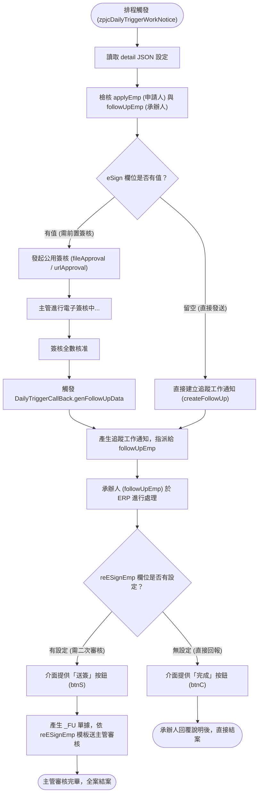

# zpjcDailyTriggerWorkNotice 問題診斷與 detail JSON 欄位規格說明報告

本文件針對 2026/09/03 `ZPJCDAILYTRIGGERWORKNOTICE_ERP43_20260903.log` 所記錄之 `null` 異常進行深入診斷，並完整解析排程設定檔中 `detail` JSON 欄位（`applyEmp`、`eSign`、`followUpEmp`、`reESignEmp`）之定義、用途與生命週期架構。

---

## 目錄
1. [問題一：執行報 null 錯誤根因分析與修復建議](#一問題一執行報-null-錯誤根因分析與修復建議)
   - [1.1 錯誤堆疊與現象](#11-錯誤堆疊與現象)
   - [1.2 根因深度剖析](#12-根因深度剖析)
   - [1.3 原始碼對應位置](#13-原始碼對應位置)
   - [1.4 程式碼修復方案](#14-程式碼修復方案)
2. [問題二：detail JSON 欄位詳細定義與運作架構](#二問題二detail-json-欄位詳細定義與運作架構)
   - [2.1 四大核心欄位功能說明表](#21-四大核心欄位功能說明表)
   - [2.2 完整協同關係總覽](#22-完整協同關係總覽)
   - [2.3 流程與生命週期架構（Mermaid 流程圖）](#23-流程與生命週期架構)
   - [2.4 程式碼對應實作細節](#24-程式碼對應實作細節)
3. [維護與設定建議](#三維護與設定建議)

---

## 一、問題一：執行報 null 錯誤根因分析與修復建議

### 1.1 錯誤堆疊與現象
於 `ZPJCDAILYTRIGGERWORKNOTICE_ERP43_20260903.log` 中，系統於觸發每日工作通知時拋出以下異常：

```text
>>>>>>>>>>>>>>>>>>>>>>>>>>>>>>>>>
null 
java.util.AbstractList.add(AbstractList.java:148)
com.chsteel.zp.busi.zpjcCommonUtility.fileApproval(zpjcCommonUtility.java:531)
com.chsteel.zp.busi.zpjcDailyTriggerWorkNotice.run(zpjcDailyTriggerWorkNotice.java:193)
sun.reflect.NativeMethodAccessorImpl.invoke0(Native Method)
...
<<<<<<<<<<<<<<<<<<<<<<<<<<<<<<<<<
```

### 1.2 根因深度剖析

此問題是由 **「空字串分割邏輯誤判」** 與 **「固定長度 List 不支援 add 操作」** 兩項問題疊加所導致：

#### 1. 為什麼 Log 中的錯誤訊息印出為 `null`？
- 在 JDK 原始碼中，`java.util.AbstractList.add(int index, E element)` 預設行為為：
  ```java
  public void add(int index, E element) {
      throw new UnsupportedOperationException();
  }
  ```
- 當拋出未帶參數的 `UnsupportedOperationException` 時，其內部的 `detailMessage` 為 `null`，因此在外層使用 `ex.getMessage()` 輸出時即印出 `null`。

#### 2. 為什麼會呼叫到 `AbstractList.add`？
- [zpjcDailyTriggerWorkNotice.java](file:///d:/CHSBrowser_erp/erpHome/yl.ear/erp.war/zp/src/com/chsteel/zp/busi/zpjcDailyTriggerWorkNotice.java#L150) 中使用 `Arrays.asList(...)` 或 `subList(...)` 來產生簽核清單 `sir_list`。
- `Arrays.asList()` 回傳的實作類別為 `java.util.Arrays$ArrayList`，該類別直接繼承自 `AbstractList` 且**未改寫 `add(int, E)` 與 `remove(int)` 方法**，屬於固定長度的唯讀結構。
- 當進入 [zpjcCommonUtility.java](file:///d:/CHSBrowser_erp/erpHome/yl.ear/erp.war/zp/src/com/chsteel/zp/busi/zpjcCommonUtility.java#L529-L534) 之 `fileApproval` 時：
  ```java
  if(include_applicant==true){
      int index = personnel_list.indexOf(applyEmpNo);
      if(index!=-1)
          personnel_list.add(0, personnel_list.remove(index));
      else
          personnel_list.add(0, applyEmpNo); // 👈 嘗試對 Arrays$ArrayList 執行 add，觸發 UnsupportedOperationException
  }
  ```
  因而觸發了 `AbstractList.java:148` 的異常。

#### 3. 業務邏輯判斷缺陷（關鍵誘因）
- Log 中顯示的設定為 `"eSign": ""`（空字串）。
- 在 [zpjcDailyTriggerWorkNotice.java](file:///d:/CHSBrowser_erp/erpHome/yl.ear/erp.war/zp/src/com/chsteel/zp/busi/zpjcDailyTriggerWorkNotice.java#L149) 僅檢查 `json_detail.has("eSign") == true`，未檢查是否為空字串。
- 在 Java 中，`"".split(";")` 會回傳長度為 1 的陣列 `new String[]{ "" }`，使得 `sir_list` 被建立且 `sir_list.size() == 1`。
- 系統誤以為有設定簽核路徑，進入了 `fileApproval`（簽核流程），而未走原預期的 `createFollowUp`（工作通知流程）。

---

### 1.3 原始碼對應位置

1. **觸發起點**：[zpjcDailyTriggerWorkNotice.java](file:///d:/CHSBrowser_erp/erpHome/yl.ear/erp.war/zp/src/com/chsteel/zp/busi/zpjcDailyTriggerWorkNotice.java#L149-L160)
   ```java
   List sir_list = null;
   if(json_detail.has("eSign")==true){	//需要透過公用簽核核准後，工作流程才會送出
       sir_list = Arrays.asList(zpShellScript.argumentConvert(json_detail.getString("eSign")).split(";"));
       
       if(sir_list.size()==1){	//判斷是否是直屬長官
           List list_tmp = zpjcESignAPI.getESingAuthListByTemplate(dsCom_new, "{maxPosNo:01}");
           int index = list_tmp.indexOf(duUserVO.getUserNo());
           if(index!=-1)
               sir_list = list_tmp.subList(0, index);
       }
   }
   ```
2. **拋出異常點**：[zpjcCommonUtility.java](file:///d:/CHSBrowser_erp/erpHome/yl.ear/erp.war/zp/src/com/chsteel/zp/busi/zpjcCommonUtility.java#L529-L534)
   ```java
   if(include_applicant==true){
       int index = personnel_list.indexOf(applyEmpNo);
       if(index!=-1)
           personnel_list.add(0, personnel_list.remove(index));
       else
           personnel_list.add(0, applyEmpNo);
   }
   ```

---

### 1.4 程式碼修復方案

建議在 **呼叫端（`zpjcDailyTriggerWorkNotice.java`）** 與 **共用工具端（`zpjcCommonUtility.java`）** 同時進行防禦性調整：

#### 方案 A：修正 `zpjcDailyTriggerWorkNotice.java`（建議必做）
加入空字串檢核，並以 `new ArrayList<String>()` 包裝確保集合可進行結構性變更：

```java
List<String> sir_list = null;
if (json_detail.has("eSign") && !"".equals(json_detail.getString("eSign").trim())) {
    String eSignVal = zpShellScript.argumentConvert(json_detail.getString("eSign")).trim();
    if (!"".equals(eSignVal)) {
        sir_list = new ArrayList<>(Arrays.asList(eSignVal.split(";")));
        
        // 若指定特定模板或單一人員時才依主管層級展出
        if (sir_list.size() == 1 && "{maxPosNo:01}".equals(sir_list.get(0))) {
            List list_tmp = zpjcESignAPI.getESingAuthListByTemplate(dsCom_new, "{maxPosNo:01}");
            int index = list_tmp.indexOf(duUserVO.getUserNo());
            if (index != -1) {
                sir_list = new ArrayList<>(list_tmp.subList(0, index));
            }
        }
    }
}
```

#### 方案 B：強化 `zpjcCommonUtility.java` 之防禦性實作
在 `fileApproval` 開頭對傳入的 `personnel_list` 建立副本：

```java
public static void fileApproval(String keyNo, dsjccom dsCom, String title, String applyEmpNo, 
                                List<String> personnel_list, boolean include_applicant, 
                                String mainFilePath, boolean checkFile, Class zpjcESignCallBackClass) throws Exception {
    
    // 防禦性複製，避免外部傳入 Arrays.asList 或 subList 導致無法 add/remove
    if (personnel_list != null) {
        personnel_list = new ArrayList<>(personnel_list);
    }
    ...
```

---

## 二、問題二：detail JSON 欄位詳細定義與運作架構

在 `TBZP0053` 的工作設定內容中，`detail` 陣列負責定義各個子工作項目。其中關鍵的四個身分欄位代表了工作流中的不同階段：

### 2.1 四大核心欄位功能說明表

| 欄位名稱 | 必填／選填 | 定義身分 | 業務用途說明 | 程式碼對應邏輯 |
| :--- | :---: | :--- | :--- | :--- |
| **`applyEmp`** | **必填** | **申請人／發起人** | 定義工作通知或簽核單的建立者工號。<br>系統以其權限與所屬部門執行建立，並在執行完成時接收 DW 成功通知。 | `duUserDAO.findByPK(applyEmp)`<br>`dsCom_new.user.ID = duUserVO.getUserNo()`<br>`vo.setApplyEmpNo(...)` |
| **`eSign`** | 選填 | **前置簽核主管／模板** | 定義發送工作通知前，**是否需先經過主管核准**。<br>支援以分號 `;` 串接工號，或填入層級模板（如 `"{maxPosNo:01}"`）。<br>填寫時走簽核審批流程；留空時直接發出工作通知。 | 判斷 `sir_list` 是否有值：<br>有值 ➔ 呼叫 `fileApproval` / `urlApproval`<br>為空 ➔ 呼叫 `createFollowUp` |
| **`followUpEmp`** | **必填** | **工作承辦人** | 定義實際負責接收、查看並執行此項工作任務的員工工號。 | 必填檢核：`"".equals(followUpEmp) == true`<br>指派給承辦人：`api.createFollowUp(vo, followUpEmp)` |
| **`reESignEmp`** | 選填 | **完成後的再次送簽主管** | 當承辦人（`followUpEmp`）處理完畢並回報時，**是否需要再往上呈送主管審核**。<br>若設定模板或主管，ERP 畫面提供「送簽」按鈕；若留空則僅提供「完成」按鈕。 | `DailyTriggerCallBack.genFollowUpData`<br>`super.reESignTemplate = reESignEmp`<br>決定畫面呈現 `btnS`（送簽）或 `btnC`（確認完成） |

---

### 2.2 完整協同關係總覽

```text
               ┌── [ eSign 有設定 ] ──> 先送主管簽核 (fileApproval / urlApproval)
               │                                   │ (簽核通過)
[ applyEmp ] ──┤                                   ▼
 (申請人)       └── [ eSign 為空 ]   ───> 發送工作通知給 [ followUpEmp ] (承辦人執行)
                                                   │
                                                   ▼ 承辦人處理完畢回報
                                 ┌── [ reESignEmp 有設定 ] ──> 產生 _FU 簽核單再次送主管審核
                                 │
                                 └── [ reESignEmp 為空 ]   ──> 直接結案完成
```

#### 階段責任切分：
1. **起單階段（發起人 `applyEmp`）**：
   - 決定工作主題、附件或內容。
   - 透過 `eSign` 決定是否為需要長官核准之重要事項。
2. **審核階段（前置主管 `eSign`，選填）**：
   - 若有設定，由主管先進行公用電子簽核，通過後系統才派工。
3. **執行階段（承辦人 `followUpEmp`，必填）**：
   - 接收待辦通知並進行實際業務作業。
4. **驗收／送簽階段（複核主管 `reESignEmp`，選填）**：
   - 承辦人回報作業成果，由系統自動依 `reESignEmp` 送交所屬主管簽核確認結案；未設定者承辦人回報即結案。

---

### 2.3 流程與生命週期架構



---

### 2.4 程式碼對應實作細節

#### 1. 前置簽核與工作通知指派（排程觸發期）
在 [zpjcDailyTriggerWorkNotice.java](file:///d:/CHSBrowser_erp/erpHome/yl.ear/erp.war/zp/src/com/chsteel/zp/busi/zpjcDailyTriggerWorkNotice.java#L178-L208)：
```java
// 如果 sir_list 有資料，則先發起公用簽核
if(sir_list != null && sir_list.size() != 0){
    zpjcCommonUtility.fileApproval(
        zp0053VO.getKeyId() + "-" + uniKey + "-" + System.currentTimeMillis(), 
        dsCom_new, json.getString("title"), duUserVO.getUserNo(), 
        sir_list, true, mainFile, false, DailyTriggerCallBack.class
    );
}
// 如果 sir_list 沒有資料，則直接發起追蹤工作通知
else {
    zpjcESignVO vo = new zpjcESignVO();
    vo.setKeyNo(zp0053VO.getKeyId() + "-" + uniKey + "-" + System.currentTimeMillis());
    vo.setDocDesc(json.getString("title"));
    vo.setApplyEmpNo(duUserVO.getUserNo()); // applyEmp
    vo.setApplyDeptNo(duUserVO.getDepNo());
    
    new zpjcESignAPI(dsCom_new, con).createFollowUp(vo, followUpEmp); // followUpEmp
}
```

#### 2. 工作完成後的二次送簽控制（承辦人處理期）
在 [zpjcESignFollowUp.java](file:///d:/CHSBrowser_erp/erpHome/yl.ear/erp.war/zp/src/com/chsteel/zp/esign/zpjcESignFollowUp.java#L189-L198)：
```java
// 依據是否設定 reESignTemplate (reESignEmp) 決定畫面開啟的按鈕
if (null != cb && !"".equals(cb.reESignTemplate)) {
    infoOut.setBtnDisabled("btnS", false); // 開放「送簽」按鈕
} else {
    infoOut.setBtnDisabled("btnC", false); // 開放「完成」按鈕
}
```

---

## 三、維護與設定建議

1. **設定檔維護規範**：
   - 若該作業**不需要**先經主管審批，請確保 `eSign` 為 `""`，在程式尚未完成修復前，建議可暫時移除 `eSign` 鍵值或確保程式已更新修復版。
   - `followUpEmp` 為必填，請務必確認工號於 `DU01` 為在職有效狀態。
   - 若承辦人處理完畢需由單位主管核可，可在 `reESignEmp` 設定 `"{maxPosNo:01}"`（或指定工號）。

2. **程式修正優先級**：
   - 優先修正 `zpjcDailyTriggerWorkNotice.java` 中的 `eSign` 空字串檢核與 `ArrayList` 轉換，即可徹底解決本次 Log 中的 `null` 報錯並導正業務流程。
