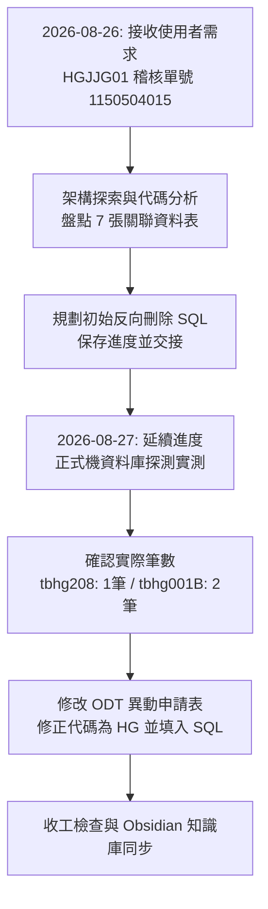

# 2026-08-26 ~ 08-27 工作與對談整理：HGJJG01 稽核單號 1150504015 資料刪除案

- **整理日期**：2026-08-27
- **涵蓋期間**：2026-08-26 ～ 2026-08-27
- **專案/需求單號**：`RQ11508035(稽核單號1150504015誤植資料刪除)`
- **主要作業**：`HGJJG01`（工安稽查登錄維護）
- **目標單號**：`1150504015`
- **主要產出**：[ERP資料_異動申請表_RQ11508035(稽核單號1150504015誤植資料刪除).odt](file:///D:/0.翁國烔_中鴻專案/RQ115/RQ11508035(稽核單號1150504015誤植資料刪除)/ERP資料_異動申請表_RQ11508035(稽核單號1150504015誤植資料刪除).odt)

---

## 📌 對談核心歷程與成果總覽

在這兩天的協同工作中，主要完成了中鴻 ERP 安衛系統（HG 模組）之工安稽查單號誤植資料的**全表關聯探索**、**正式機資料實測**、**備份與刪除 SQL 規劃**，以及**正式異動申請表 ODT 的自動化填寫與排版更新**。



---

## 一、 2026-08-26 對談內容與分析工作

### 1. 使用者需求
- 依據 `db-data-migration-and-analysis` 技能，將正式機作業 **HGJJG01（稽查登錄維護）** 中，稽核單號 **`1150504015`** 之所有相關資料列出，並規劃刪除資料所需之 SQL。
- 記錄分析過程，留待次日（08/27）打「繼續」時延續處理。

### 2. 資料庫架構與 7 張關聯表盤點
透過 [`hgStructs.xml`](file:///D:/CHSBrowser_erp/erpHome/yl.ear/erp.war/hg/config/yl/hg/hgStructs.xml)、Controller 與 DAO 原始碼分析，盤點出下列相關資料表：

| 階層 | 資料表名稱 | 表格中文說明 | 關聯條件 (FK / Key) | 對應 Controller / DAO |
| :--- | :--- | :--- | :--- | :--- |
| **主檔** | `db.tbhg208` | 稽查登錄主檔 | `checkNo = '1150504015'` | `hgjcg01d.java` / `hgjctb208DAO.java` |
| **子表 1** | `db.tbhg208t` | 改善通報 / 轉出檔 | `checkNo = '1150504015'` | `hgjcg01Pass.java` / `hgjctb208tDAO.java` |
| **子表 2** | `db.tbhg208v` | 複查作業主檔 | `checkNo = '1150504015'` | `hgjcg01v.java` / `hgjctb208vDAO.java` |
| **孫表 2-1** | `db.tbhg208vd` | 複查作業明細檔 | `reviseNo IN (SELECT reviseNo FROM db.tbhg208v ...)` | `hgjcg01vd.java` / `hgjctb208vdDAO.java` |
| **子表 3** | `db.tbhg208f` | 罰款作業明細檔 | `checkNo = '1150504015'` | `hgjcg01f.java` / `hgjctb208fDAO.java` |
| **流程表** | `db.tbhg001B` | 簽核流程記錄表 | `forKey = '1150504015'` 或通報/複查/罰款組合鍵 | `hgjcg01Apprv2.java` / `hgjctb001BDAO.java` |
| **歷程表** | `db.tbhg208R` | 退件/回覆歷程檔 | `applyNo = '1150504015'` | `db.tbhg208R-DB2.sql` |

### 3. 反向刪除原則 (孫表 ➔ 子表 ➔ 流程 ➔ 主檔)
規劃了全關聯表的清理邏輯，確保外鍵與相依性完整性。

---

## 二、 2026-08-27 對談內容與執行成果

### 1. 開工延續與正式機 DB2 探測
- 使用者輸入「繼續」，系統調出昨日分析結果。
- 透過正式機網頁命令中心直連執行探測 SQL，確認實際存在的資料筆數：

| 資料表 | 說明 | 實測筆數 | 資料摘要 |
| :--- | :--- | :---: | :--- |
| `db.tbhg208` | 稽查主檔 | **1 筆** | 稽查人員：林國勝 (`26869`)、部門：`MP8`、缺失：洗手台旁鐵柱腐蝕 |
| `db.tbhg001B` | 簽核流程表記錄 | **2 筆** | 包含 24157 審核（意見：請洽MP19協助改善）與 26727 主管核准 |
| `db.tbhg208t` / `v` / `vd` / `f` / `R` | 其餘子表 | **0 筆** | 尚未立案或無資料 |

### 2. 異動申請表 ODT 編輯與排版更新
- **目標檔案**：[ERP資料_異動申請表_RQ11508035(稽核單號1150504015誤植資料刪除).odt](file:///D:/0.翁國烔_中鴻專案/RQ115/RQ11508035(稽核單號1150504015誤植資料刪除)/ERP資料_異動申請表_RQ11508035(稽核單號1150504015誤植資料刪除).odt)
- **修正重點**：
  1. **修正系統代碼**：由 `ERP系統代碼：EA` 修正為 **`ERP系統代碼：HG`**。
  2. **填入資料備份指令**：
     ```sql
     1.(備份)TBHG001B(簽核流程記錄表) 共2筆
     SELECT * FROM db.tbhg001B WHERE forKey = '1150504015'

     2.(備份)TBHG208(工安稽查登錄主檔) 共1筆
     SELECT * FROM db.tbhg208 WHERE checkNo = '1150504015'
     ```
  3. **填入資料異動指令**：
     ```sql
     1.(刪除)TBHG001B(簽核流程記錄表) 共2筆
     DELETE FROM db.tbhg001B WHERE forKey = '1150504015'

     2.(刪除)TBHG208(工安稽查登錄主檔) 共1筆
     DELETE FROM db.tbhg208 WHERE checkNo = '1150504015'
     ```
  4. 自動備份原始檔為 `_backup.odt` 並確保 XML 格式與樣式無損。

### 3. 對談紀錄查詢架構與 Obsidian 知識庫同步
- 釐清本機 Antigravity 日誌存放在 `brain/<id>/.system_generated/logs/transcript.jsonl`。
- 將完整技術方案與兩日對談整理寫入 Obsidian 筆記庫。

---

## 三、 相關檔案與快速連結

- 📄 **異動申請表 (ODT)**：[ERP資料_異動申請表_RQ11508035.odt](file:///D:/0.翁國烔_中鴻專案/RQ115/RQ11508035(稽核單號1150504015誤植資料刪除)/ERP資料_異動申請表_RQ11508035(稽核單號1150504015誤植資料刪除).odt)
- 📝 **技術規格與 SQL 完整筆記**：[HGJJG01_稽查單號_1150504015_資料關聯與刪除計畫.md](file:///G:/我的雲端硬碟/Obsidian/AI/ERP/HGJJG01_稽查單號_1150504015_資料關聯與刪除計畫.md)
- 📁 **專案需求目錄**：[RQ11508035 目錄](file:///D:/0.翁國烔_中鴻專案/RQ115/RQ11508035(稽核單號1150504015誤植資料刪除))
- 💬 **歷史對話跳轉**：
  - 昨天分析：[2026-08-26 初始分析對話](conversation://723de8ed-2b5b-451c-b555-d6d545f591cd)
  - 今天執行：[2026-08-27 ODT 修改對話](conversation://7473259d-bbd3-49f2-8fdd-a0af88b1ec5e)

---

> [!NOTE]
>  有關昨天與今日我們對談的內容，請告訴我放哪裡，我可以去看


  我們昨天（2026/08/26）與今天（2026/08/27）的所有對話紀錄、執行步驟與暫存檔案，都保存在本機的 Antigravity 資料庫中。
  ──────
## 一、對話紀錄存放位置與對應清單

  Antigravity 系統會將每次對談依 Conversation ID 獨立存放在 ==brain 目錄==下，內含完整的 transcript.jsonl（結構化對談記錄）與 transcript_full.jsonl：

#### 1. 今天（2026/08/27）的對話

  • 當前對話 conversation://9d8d2088-c18e-43c0-bb4d-75d538153eb3 (9d8d2088-c18e-43c0-bb4d-75d538153eb3)
      • 紀錄位置：transcript.jsonl
  • ODT 異動表更新對話 conversation://7473259d-bbd3-49f2-8fdd-a0af88b1ec5e (7473259d-bbd3-49f2-8fdd-a0af88b1ec5e)
      • 對談主題：延續昨天工作，依照 RQ11508035(稽核單號1150504015誤植資料刪除) 需求，將備份與刪除 SQL 填入並更新 ODT 檔案。
      • 紀錄位置：transcript.jsonl
      • 相關腳本存放區：scratch

  ──────
#### 2. 昨天（2026/08/26）的對話

  • 稽核單號 1150504015 分析與刪除規劃對話 conversation://723de8ed-2b5b-451c-b555-d6d545f591cd (723de8ed-2b5b-451c-b555-d6d545f591cd)
      • 對談主題：依照 db-data-migration-and-analysis 技能，分析正式機作業 (HGJJG01) 稽查登錄維護中 稽核單號 1150504015 之關聯資料表與產出備份/刪除 SQL 計畫。
      • 紀錄位置：transcript.jsonl
  • 上午工作階段對話 conversation://b60cc912-6fd1-46a5-958c-841c980f4ddf (b60cc912-6fd1-46a5-958c-841c980f4ddf)
      • 紀錄位置：transcript.jsonl

  ──────
## 二、如何檢視內容？

  1. 直接點擊上方對話連結：
      • 點擊上面的對話連結（如 conversation://...）可直接在介面中跳轉查看該次對談。
  2. 使用文字編輯器開啟日誌：
      • 您可以直接在 VS Code 或文字編輯器中==開啟對應的 transcript.jsonl 檔案，裡面的 USER_INPUT 與 PLANNER_RESPONSE 即為完整的問答內容==。
  3. 全部 Brain 存放目錄總路徑：
      • brain