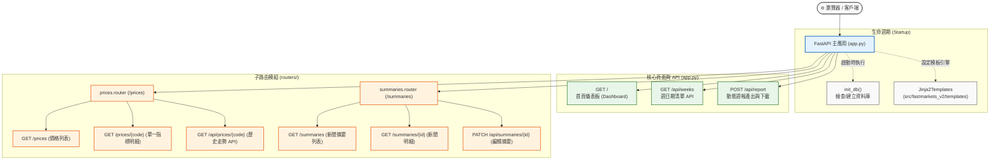

# Fastmarkets V2 — FastAPI Web 應用程式 (app.py) 說明

本文件詳細說明 `src/fastmarkets_v2/app.py` 的核心架構、頁面路由、API 端點以及資料彙整邏輯。

---

## 1. 模組定位

`app.py` 是本專案的 **Web 儀表板與 API 主進入點**，基於 **FastAPI** 與 **Jinja2 模板引擎** 建構。其主要功能包括：
1. **系統生命週期管理**：伺服器啟動時自動檢查並初始化資料庫。
2. **路由模組掛載**：整併價格模組（`prices.py`）與新聞摘要模組（`summaries.py`）。
3. **首頁儀表板資料聚合**：即時計算 KPI、漲跌榜（Top Movers）、走勢迷你圖（Sparklines）與市場情緒分佈。
4. **週報動態產出 API**：提供網頁端直接觸發生成並下載單檔 HTML 週報。

---

## 2. 應用程式架構圖



---

## 3. 核心端點詳細說明

### ① 首頁儀表板：`GET /` (dashboard)
- **用途**：渲染主控制台頁面（`dashboard.html`）。
- **聚合計算邏輯**：
  1. **關鍵指標 KPI**：
     - 最新資料日期（`latest_date`）
     - 總新聞摘要篇數（`summary_count`）與當週新增篇數
     - 追蹤指標總數（`indicator_count`）與相比前週之增減量（`indicator_delta`）
  2. **市場情緒分佈（Sentiment Distribution）**：
     - 統計資料庫中新聞的看漲（`bullish`）、看跌（`bearish`）與中立（`neutral`）比例。
  3. **波動排行榜（Top Movers）**：
     - 篩選當週週環比漲跌幅（`wow_pct`）絕對值最大的前 10 筆商品規格。
  4. **關鍵趨勢迷你圖（Key Sparklines）**：
     - 抓取波動最大的前 5 個指標歷年/歷史價格點位數列，供前端繪製小型走勢圖。
  5. **近期新聞摘要**：
     - 載入最新建立的 5 篇繁中新聞重點。

---

### ② 週日期清單：`GET /api/weeks` (list_weeks)
- **用途**：取得資料庫內所有已有價格紀錄的週日期（依時間降冪排列）。
- **回傳範例**：
  ```json
  ["2026-07-08", "2026-07-01", "2026-06-24"]
  ```

---

### ③ 週報產出與下載：`POST /api/report` (generate_report)
- **用途**：在前端點擊「產出週報」時，後端動態呼叫 `report.generate_weekly_report()`。
- **流程**：
  1. 若未指定 `week` 參數，自動抓取資料庫內最新的週三日期。
  2. 生成包含 SVG 圖表與 AI 重點摘要的單檔 HTML 週報。
  3. 透過 `FileResponse` 直接將生成的 HTML 檔案回傳給瀏覽器下載或預覽。

---

## 4. 掛載的子模組路由總覽

| 路由路徑 | 處理模組 | 說明 |
| :--- | :--- | :--- |
| `GET /prices` | `routers/prices.py` | 價格指標總覽列表（支援依市場分組篩選） |
| `GET /prices/{code}` | `routers/prices.py` | 單一指標歷史走勢圖表與數據明細頁面 |
| `GET /api/prices/{code}` | `routers/prices.py` | 供前端 ECharts 圖表非同步載入歷史走勢 JSON |
| `GET /summaries` | `routers/summaries.py` | 市場新聞繁中摘要分頁清單（支援日期與市場篩選） |
| `GET /summaries/{id}` | `routers/summaries.py` | 單篇新聞原文與中文摘要對照頁面 |
| `PATCH /api/summaries/{id}` | `routers/summaries.py` | 提供人工手動校正/修改 AI 生成的中文摘要與情緒 |

---

## 5. 啟動與訪問方式

```bash
# 預設啟動於 http://127.0.0.1:8000
fastmarkets-v2 serve

# 指定 IP 與 Port
fastmarkets-v2 serve --host 0.0.0.0 --port 3000
```
