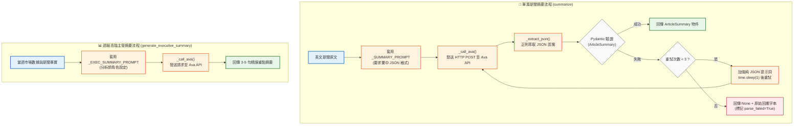

# Fastmarkets V2 — Ava API 介接客戶端 (ava_client.py) 說明

本文件詳細說明 `src/fastmarkets_v2/ava_client.py` 的核心架構、API 連線機制、Prompt 設計、結構化解析與重試機制。

---

## 1. 模組定位

`ava_client.py` 是本專案的 **AI 語言模型整合模組**，負責與 **Ava LLM API** 進行 HTTP 通訊。主要職責包括：
1. **單篇新聞中文摘要與結構化資訊抽取**（標題、內文摘要、市場區域、關鍵價格、市場情緒）。
2. **高階主管週報摘要產出**（扮演產業分析師，為每週週報撰寫 Executive Summary）。
3. **JSON 容錯解析與自動重試機制**。

---

## 2. 運作流程圖



---

## 3. 主要函式與機制說明

### ① `_call_ava(prompt: str) -> str`
- **目的**：底層 HTTP 請求封裝。
- **端點**：`{AVA_BASE_URL}/ava/chat/rag/query`
- **標頭（Headers）**：
  - `Origin: {AVA_BASE_URL}`
  - `api-key: {AVA_API_KEY}`
- **Payload 結構**：
  ```python
  {
      "message": json.dumps({"type": "text", "data": prompt}),
      "expert_id": AVA_EXPERT_ID,
      "context": "{}",
      "stream": "false"
  }
  ```
- **回應解析**：自動處理 Ava API 回傳的 List 或 Dict 結構，提取 `data` 欄位的文字內容。

---

### ② `summarize(article_text: str) -> tuple[ArticleSummary | None, str]`
- **目的**：將單篇英文新聞翻譯並轉換為強型別結構化物件。
- **Prompt 要求格式**：
  ```json
  {
    "title": "摘要標題",
    "market": "美國 或 歐洲 或 亞洲 或 中國 或 其他",
    "summary": "200字以內的摘要",
    "key_prices": [{"product": "品名", "price": 123.4, "unit": "單位", "direction": "up 或 down 或 flat"}],
    "sentiment": "bullish 或 bearish 或 neutral"
  }
  ```
- **容錯與重試策略**：
  1. 正則表達式 `_extract_json()` 自動去除 LLM 可能額外輸出的 Markdown 標記或前綴文字。
  2. 使用 Pydantic 的 `ArticleSummary.model_validate_json()` 驗證欄位型別。
  3. 若驗證失敗，最多重試 **3 次**；重試時會追加 Prompt 提示詞（*「請務必只回傳純 JSON，不要加任何其他文字」*），以提高成功率。

---

### ③ `generate_executive_summary(facts: str) -> str | None`
- **目的**：為產出每週週報撰寫「本週重點摘要（Executive Summary）」。
- **Prompt 設定**：
  - **角色**：鋼鐵產業資深分析師。
  - **目標**：根據當週數據事實，撰寫 3-5 句精簡專業的繁中分析，使主管在 30 秒內掌握市場趨勢與核心影響。

---

## 4. 資料模型對照 (`schemas.py`)

呼叫 `summarize()` 後驗證產出的 Pydantic 模型結構：

| 欄位 | 型別 | 限制／說明 |
| :--- | :--- | :--- |
| `title` | `str` | 繁體中文新聞標題 |
| `market` | `Literal` | 限制為 `["美國", "歐洲", "亞洲", "中國", "其他"]` |
| `summary` | `str` | 限制最大長度 500 字 |
| `key_prices` | `list[KeyPrice]` | 品名、價格、單位與漲跌方向 (`up`/`down`/`flat`) |
| `sentiment` | `Literal` | 市場情緒標籤：`["bullish", "bearish", "neutral"]` |

---

## 5. 環境變數設定需求

本模組需在 `.env` 中設定以下變數：
```env
AVA_BASE_URL=https://demoava.icsc.com.tw
AVA_API_KEY=your_api_key_here
AVA_EXPERT_ID=your_expert_id_here
```
