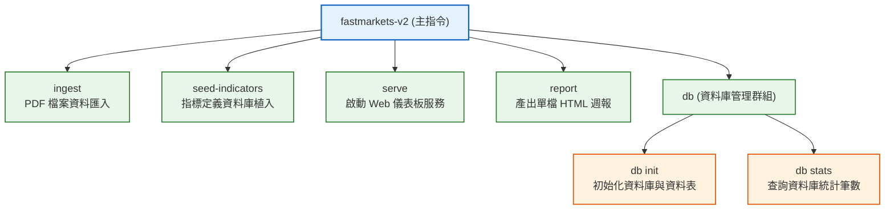

# Fastmarkets V2 — 命令列介面 (cli.py) 說明

本文件詳細說明 `src/fastmarkets_v2/cli.py` 的架構、指令樹狀結構、各子指令的用法與背後執行的程式邏輯。

---

## 1. 模組定位

`cli.py` 是本專案的 **命令列介面（Command Line Interface, CLI）進入點**，使用 Python 的 **Click** 函式庫建構。它將資料庫初始化、資料匯入、報表產生與伺服器啟動等後端功能封裝為直覺的終端機指令，方便手動執行或結合定時排程（如 Cron / Windows Task Scheduler）。

---

## 2. 指令樹狀架構



---

## 3. 指令詳細說明與參數

### ① `fastmarkets-v2 ingest`
- **功能**：掃描並解析 PDF 檔案，提取新聞進行 AI 中文摘要，並計算價格存入資料庫。
- **選項參數**：
  - `--file <路徑>`（可選）：指定處理單一 PDF 檔案。若未提供此參數，系統會自動批次掃描 `raw/` 目錄下所有尚未處理的 PDF。
- **範例**：
  ```bash
  # 批次掃描 raw/ 目錄
  fastmarkets-v2 ingest

  # 匯入指定 PDF 檔案
  fastmarkets-v2 ingest --file raw/20260708.pdf
  ```
- **呼叫邏輯**：內部呼叫 `pipeline.ingest_pdf()` 或 `pipeline.ingest_batch()`。

---

### ② `fastmarkets-v2 seed-indicators`
- **功能**：從 Markdown 檔案匯入各鋼鐵指標的品名、規格條件、計價單位與換算公式。
- **必要引數**：
  - `<md_path>`：Markdown 檔案路徑（如舊專案的 `indicators_current.md`）。
- **範例**：
  ```bash
  fastmarkets-v2 seed-indicators path/to/indicators_current.md
  ```
- **呼叫邏輯**：內部呼叫 `pipeline.seed_indicators()`。

---

### ③ `fastmarkets-v2 serve`
- **功能**：以 Uvicorn 啟動 FastAPI 網頁服務與儀表板。
- **選項參數**：
  - `--host <IP>`：綁定 IP（預設 `127.0.0.1`）。
  - `--port <PORT>`：監聽埠號（預設 `8000`）。
- **範例**：
  ```bash
  # 預設啟動 (http://127.0.0.1:8000)
  fastmarkets-v2 serve

  # 自訂 Port
  fastmarkets-v2 serve --host 0.0.0.0 --port 3000
  ```
- **呼叫邏輯**：內部呼叫 `uvicorn.run("fastmarkets_v2.app:app", ...)`。

---

### ④ `fastmarkets-v2 report`
- **功能**：自動生成包含 SVG 折線圖與本週重點摘要的單檔 HTML 週報。
- **選項參數**：
  - `--week <YYYY-MM-DD>`（可選）：指定週三日期。若未提供，系統會自動計算並對齊至**最近的週三**。
  - `--output <路徑>`（可選）：指定產出檔案路徑（預設路徑為 `output/YYYY/MM/YYYYMMDD_weekly.html`）。
- **範例**：
  ```bash
  # 自動以最近週三產出報告
  fastmarkets-v2 report

  # 指定週三日期與自訂輸出路徑
  fastmarkets-v2 report --week 2026-07-08 --output ./weekly_20260708.html
  ```
- **呼叫邏輯**：內部呼叫 `report.generate_weekly_report()`。

---

### ⑤ `fastmarkets-v2 db init`
- **功能**：建立 SQLite 資料庫檔案（`data/fastmarkets.db`）並初始化所有資料表結構（`indicator`、`price_weekly`、`summary`）。
- **範例**：
  ```bash
  fastmarkets-v2 db init
  ```
- **呼叫邏輯**：內部呼叫 `database.init_db()`。

---

### ⑥ `fastmarkets-v2 db stats`
- **功能**：快速查詢資料庫目前的資料總量與狀態。
- **範例**：
  ```bash
  fastmarkets-v2 db stats
  ```
- **輸出範例**：
  ```text
  指標: 42
  週價: 520 筆
  摘要: 185 篇 (失敗: 2)
  ```

---

## 4. 命令列指令速查總表

| 指令 | 參數 | 說明 |
| :--- | :--- | :--- |
| `fastmarkets-v2 ingest` | `[--file <path>]` | 匯入 raw/ 目錄或指定 PDF 檔案 |
| `fastmarkets-v2 seed-indicators` | `<md_path>` | 匯入鋼鐵指標規格與公式種子資料 |
| `fastmarkets-v2 serve` | `[--host <ip>] [--port <port>]` | 啟動 Web 儀表板伺服器 |
| `fastmarkets-v2 report` | `[--week <date>] [--output <path>]` | 產出 HTML 週報檔案 |
| `fastmarkets-v2 db init` | 無 | 建立 SQLite 檔案與資料庫 Schema |
| `fastmarkets-v2 db stats` | 無 | 查看資料庫指標、價格與摘要總筆數 |
