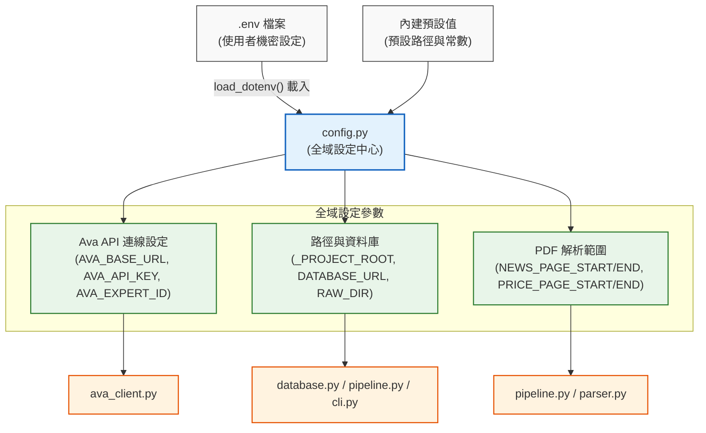

# Fastmarkets V2 — 設定與環境變數 (config.py) 說明

本文件詳細說明 `src/fastmarkets_v2/config.py` 的架構、環境變數載入機制、各設定項定義與預設值。

---

## 1. 模組定位

`config.py` 是本專案的 **全域組態設定與環境變數管理中心**。主要職責包括：
1. **自動載入環境變數**：透過 `python-dotenv` 讀取根目錄 `.env` 檔。
2. **路徑動態錨定**：動態計算專案根目錄路徑，確保跨作業系統（Windows / Linux）執行時路徑皆正確。
3. **集中管理系統常數**：定義資料庫連線、Ava API 認證參數及 PDF 解析頁碼範圍。

---

## 2. 設定架構圖



---

## 3. 設定項目詳細對照表

### ① Ava API 設定

| 變數名稱 | 讀取環境變數 | 預設值 | 說明 |
| :--- | :--- | :--- | :--- |
| `AVA_BASE_URL` | `AVA_BASE_URL` | `https://demoava.icsc.com.tw` | Ava AI API 的基礎伺服器網址 |
| `AVA_API_KEY` | `AVA_API_KEY` | `""` | 呼叫 Ava API 所需之身份驗證金鑰 |
| `AVA_EXPERT_ID` | `AVA_EXPERT_ID` | `""` | 指定對話的 Ava 專家模型 ID |

---

### ② 路徑與資料庫設定

| 變數名稱 | 讀取環境變數 | 預設值 | 說明 |
| :--- | :--- | :--- | :--- |
| `_PROJECT_ROOT` | — | `Path(__file__).parents[2]` | 動態計算之專案根目錄絕對路徑 |
| `DATABASE_URL` | `DATABASE_URL` | `sqlite:///{ROOT}/data/fastmarkets.db` | SQLAlchemy 連線字串，預設為本地 SQLite |
| `RAW_DIR` | `RAW_DIR` | `Path("{ROOT}/raw")` | 放置 Fastmarkets Daily 原始 PDF 的目錄 |

---

### ③ PDF 解析範圍常數

| 常數名稱 | 值 | 說明 |
| :--- | :--- | :--- |
| `NEWS_PAGE_START` | `0` | 新聞內容擷取的起始頁碼（0-indexed，即第 1 頁） |
| `NEWS_PAGE_END` | `6` | 新聞內容擷取的結束頁碼（0-indexed，即第 6 頁） |
| `PRICE_PAGE_START` | `0` | 價格表格擷取的起始頁碼（0-indexed，即第 1 頁） |
| `PRICE_PAGE_END` | `30` | 價格表格擷取的結束頁碼（0-indexed，即第 30 頁） |

---

## 4. `.env` 範本

在專案根目錄建立 `.env` 時可參考以下內容：

```env
# Ava API 設定（必填）
AVA_BASE_URL=https://demoava.icsc.com.tw
AVA_API_KEY=your_actual_api_key_here
AVA_EXPERT_ID=your_actual_expert_id_here

# 資料庫與目錄設定（可選，有預設值）
# DATABASE_URL=sqlite:///./data/fastmarkets.db
# RAW_DIR=./raw
```
