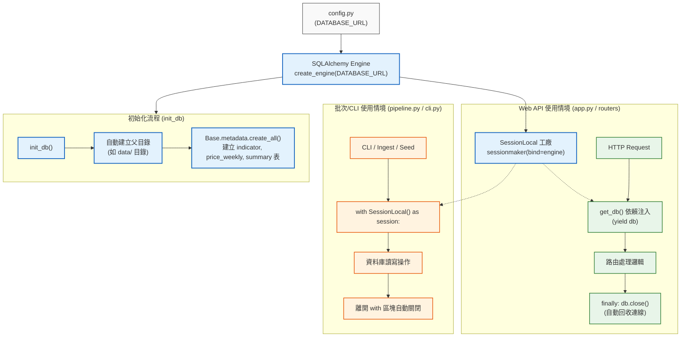

# Fastmarkets V2 — 資料庫連線與生命週期 (database.py) 說明

本文件詳細說明 `src/fastmarkets_v2/database.py` 的核心架構、SQLAlchemy 連線引擎、Session 管理機制以及資料庫初始化邏輯。

---

## 1. 模組定位

`database.py` 是本專案的 **資料庫連線管理中心**，基於 **SQLAlchemy 2.0+** 建構。主要職責包括：
1. **建立資料庫引擎（Engine）與 Session 工廠（SessionLocal）**。
2. **提供 FastAPI 依賴注入產生器（`get_db`）**，確保 Web 請求的資料庫連線自動關閉與回收。
3. **提供資料庫初始化函式（`init_db`）**，自動建立目錄並產生 Schema 資料表。

---

## 2. 資料庫連線與使用架構圖



---

## 3. 核心元件詳細說明

### ① 連線引擎與 Session 工廠
```python
engine = create_engine(DATABASE_URL, echo=False)
SessionLocal = sessionmaker(bind=engine)
```
- **`engine`**：管理底層連線池與資料庫連線（預設連線至 `sqlite:///data/fastmarkets.db`）。
- **`SessionLocal`**：自訂 Session 工廠類別，每次調用 `SessionLocal()` 會產生一個新的資料庫交易階段。

---

### ② FastAPI 依賴注入生成器：`get_db()`
```python
def get_db():
    db = SessionLocal()
    try:
        yield db
    finally:
        db.close()
```
- **目的**：供 FastAPI 路由函式進行依賴注入（`db: Session = Depends(get_db)`）。
- **連線安全性**：利用 Python 產生器（Generator）與 `finally` 區塊，保證在請求結束或發生 Exception 時，**絕對會執行 `db.close()`**，防止資料庫連線洩漏（Connection Leak）。

---

### ③ 資料庫初始化函式：`init_db()`
```python
def init_db():
    db_url = str(engine.url)
    if db_url.startswith("sqlite"):
        db_path = db_url.replace("sqlite:///", "")
        if db_path:
            Path(db_path).parent.mkdir(parents=True, exist_ok=True)
    Base.metadata.create_all(bind=engine)
```
- **自動建立目錄**：若連線字串為 SQLite，會自動解析資料庫檔案路徑並遞迴建立父目錄（例如 `data/`），避免初次執行時因目錄不存在而拋出錯誤。
- **資料表建立（`create_all`）**：讀取 `models.py` 中繼承 `Base` 的所有模型（`Indicator`、`PriceWeekly`、`Summary`），在資料庫中建立尚未存在的資料表（具備冪等性，已存在的表不會被覆蓋或破壞）。

---

## 4. 使用範例對照

### 範例 A：在 CLI / 腳本中使用
```python
from fastmarkets_v2.database import SessionLocal
from fastmarkets_v2.models import Indicator

with SessionLocal() as session:
    indicators = session.query(Indicator).all()
```

### 範例 B：在 FastAPI 路由中使用
```python
from fastapi import APIRouter, Depends
from sqlalchemy.orm import Session
from fastmarkets_v2.database import get_db

router = APIRouter()

@router.get("/items")
def list_items(db: Session = Depends(get_db)):
    return db.query(Indicator).all()
```
